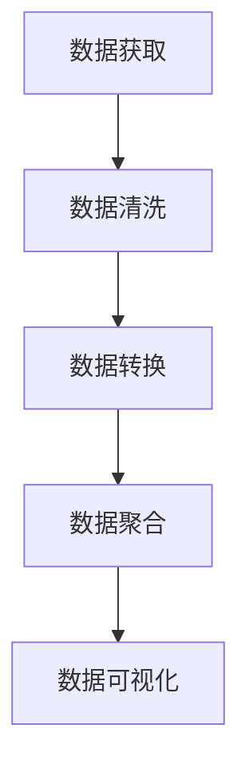

                 

### 文章关键词

- Python
- 数据可视化
- 多品类分析
- 电子产品
- 数据处理

### 文章摘要

本文将探讨如何利用Python进行多品类电子产品数据可视化分析。通过对电子产品销售数据的处理和分析，我们将展示如何运用Python的多种库（如Pandas、Matplotlib、Seaborn等）来创建直观且具有洞察力的图表，从而帮助企业更好地理解市场需求，优化库存管理，提升销售策略。

## 1. 背景介绍

在现代商业环境中，数据已成为企业决策过程中不可或缺的一部分。电子产品行业尤为如此，随着市场竞争的日益激烈，企业需要通过准确的数据分析来预测趋势、优化库存、提升营销效果。数据可视化作为数据分析的重要手段，能够将复杂的数据转化为易于理解的信息，帮助企业快速发现关键问题和机会点。

Python作为一种功能强大且易于学习的编程语言，已经成为数据处理和可视化领域的首选工具。Python拥有丰富的库和框架，如Pandas用于数据处理，Matplotlib和Seaborn用于数据可视化，使其在多品类电子产品数据分析中具有显著的优势。

## 2. 核心概念与联系

### 2.1 数据处理流程

在进行数据可视化之前，数据处理是至关重要的一步。数据处理流程通常包括数据清洗、数据转换和数据聚合。以下是数据处理流程的Mermaid流程图：



### 2.2 数据可视化工具

Python在数据可视化方面拥有众多强大的库，以下是一些常用的库及其作用：

- **Pandas**: 用于数据操作和分析。
- **Matplotlib**: 用于创建静态、高质量的图表。
- **Seaborn**: 基于Matplotlib，提供了更多统计图表和美化功能。
- **Plotly**: 用于创建交互式图表。

### 2.3 多品类电子产品数据分析

在电子产品行业中，多品类数据分析主要包括以下内容：

- **销售数据分析**: 包括各品类销售量、销售额、利润等指标。
- **市场需求分析**: 分析各品类市场需求趋势，预测未来需求。
- **库存管理分析**: 优化库存水平，减少库存积压。

## 3. 核心算法原理 & 具体操作步骤

### 3.1 算法原理概述

数据可视化分析的核心在于如何将数据转化为视觉元素，以直观的方式展示数据关系和趋势。核心算法原理主要包括：

- **数据聚合**: 对大量数据按照特定维度进行汇总。
- **数据排序**: 对数据进行排序，便于分析和展示。
- **数据映射**: 将数据映射到视觉元素，如颜色、形状、大小等。

### 3.2 算法步骤详解

#### 3.2.1 数据清洗

数据清洗是数据预处理的重要步骤，主要包括以下内容：

- **缺失值处理**: 填充或删除缺失数据。
- **异常值处理**: 检测并处理异常数据。
- **数据格式化**: 将数据格式统一为适合分析的格式。

#### 3.2.2 数据转换

数据转换是将原始数据转化为适合可视化的格式，主要包括以下内容：

- **数据透视表**: 对数据表进行操作，以便于数据聚合和排序。
- **数据类型转换**: 将数据类型转换为适合可视化的类型，如将字符串转换为数字。

#### 3.2.3 数据聚合

数据聚合是对数据进行汇总，以展示数据关系和趋势，主要包括以下内容：

- **按维度分组**: 按照特定维度对数据分组，如按品类、地区、时间等。
- **计算指标**: 计算各分组的数据指标，如总销售量、平均销售额等。

#### 3.2.4 数据可视化

数据可视化是将处理后的数据展示为图表，主要包括以下内容：

- **选择图表类型**: 根据数据特点和展示目的选择合适的图表类型，如条形图、折线图、饼图等。
- **图表定制**: 对图表进行定制，如调整颜色、字体、布局等。

### 3.3 算法优缺点

#### 优点：

- **直观性**: 数据可视化能够将复杂的数据转化为易于理解的图表，便于分析和决策。
- **交互性**: 部分数据可视化工具支持交互性，用户可以实时探索数据。

#### 缺点：

- **性能**: 对于大数据集，数据可视化可能需要较高的计算资源。
- **误导性**: 如果不正确地处理数据，可视化可能会产生误导性结果。

### 3.4 算法应用领域

数据可视化算法广泛应用于多个领域，如：

- **市场分析**: 用于分析市场趋势、消费者行为等。
- **金融分析**: 用于分析股票市场、风险投资等。
- **医疗分析**: 用于分析患者数据、疾病趋势等。

## 4. 数学模型和公式 & 详细讲解 & 举例说明

### 4.1 数学模型构建

在数据可视化中，常用的数学模型包括：

- **回归分析**: 用于预测数据趋势。
- **聚类分析**: 用于数据分组。
- **关联规则挖掘**: 用于发现数据之间的关系。

### 4.2 公式推导过程

以回归分析为例，线性回归的公式推导如下：

$$
y = \beta_0 + \beta_1x + \epsilon
$$

其中，$y$为因变量，$x$为自变量，$\beta_0$和$\beta_1$为回归系数，$\epsilon$为误差项。

### 4.3 案例分析与讲解

假设我们有一个电子产品销售数据集，包括销售量、销售额和产品品类。我们可以使用回归分析来预测不同品类产品的销售量。

```python
import pandas as pd
import numpy as np
from sklearn.linear_model import LinearRegression

# 加载数据
data = pd.read_csv('sales_data.csv')
X = data[['sales_amount', 'product_category']]
y = data['sales_quantity']

# 创建线性回归模型
model = LinearRegression()
model.fit(X, y)

# 预测销售量
predicted_sales = model.predict(X)

# 结果分析
print('Coefficients:', model.coef_)
print('Intercept:', model.intercept_)
print('R-squared:', model.score(X, y))
```

通过上述代码，我们可以得到不同品类产品的销售量预测值，以及模型的相关参数。

## 5. 项目实践：代码实例和详细解释说明

### 5.1 开发环境搭建

要在Python中进行数据可视化分析，我们需要安装以下库：

- **Pandas**: 用于数据处理。
- **Matplotlib**: 用于创建静态图表。
- **Seaborn**: 用于创建统计图表。
- **Plotly**: 用于创建交互式图表。

安装命令如下：

```bash
pip install pandas matplotlib seaborn plotly
```

### 5.2 源代码详细实现

以下是一个简单的数据可视化案例，展示如何使用Python进行多品类电子产品数据可视化分析。

```python
import pandas as pd
import matplotlib.pyplot as plt
import seaborn as sns
import plotly.express as px

# 加载数据
data = pd.read_csv('sales_data.csv')

# 数据预处理
data['sales_amount'] = data['sales_amount'].replace(0, np.nan)
data.dropna(subset=['sales_amount'], inplace=True)

# 绘制条形图
sns.barplot(x='product_category', y='sales_amount', data=data)
plt.title('Product Category Sales')
plt.xlabel('Product Category')
plt.ylabel('Sales Amount')
plt.show()

# 绘制折线图
sns.lineplot(x='date', y='sales_amount', hue='product_category', data=data)
plt.title('Product Category Sales Over Time')
plt.xlabel('Date')
plt.ylabel('Sales Amount')
plt.show()

# 绘制散点图
sns.scatterplot(x='sales_amount', y='profit', hue='product_category', data=data)
plt.title('Sales Amount vs. Profit')
plt.xlabel('Sales Amount')
plt.ylabel('Profit')
plt.show()

# 绘制交互式折线图
fig = px.line(data, x='date', y='sales_amount', color='product_category', title='Product Category Sales Over Time')
fig.show()
```

### 5.3 代码解读与分析

上述代码首先加载了电子产品销售数据集，并对数据进行了预处理。然后，我们使用了Matplotlib和Seaborn库分别绘制了条形图、折线图和散点图，展示了不同品类产品的销售情况。最后，我们使用Plotly库创建了一个交互式折线图，以便用户实时探索数据。

### 5.4 运行结果展示

运行上述代码后，我们将得到以下图表：

1. **条形图**：展示了不同品类产品的销售金额。
2. **折线图**：展示了不同品类产品随时间的变化趋势。
3. **散点图**：展示了不同品类产品的销售金额与利润之间的关系。
4. **交互式折线图**：用户可以通过拖动滑块查看不同时间段不同品类产品的销售情况。

## 6. 实际应用场景

### 6.1 市场分析

通过数据可视化分析，企业可以深入了解市场趋势，从而调整产品策略。例如，通过分析各品类产品的销售情况，企业可以确定哪些产品在市场上最受欢迎，哪些产品需要改进或淘汰。

### 6.2 库存管理

数据可视化可以帮助企业优化库存管理。通过对库存数据的分析，企业可以确定哪些产品库存过多，哪些产品库存不足，从而合理调整库存水平，减少库存积压。

### 6.3 营销策略

通过分析消费者行为数据，企业可以制定更加有效的营销策略。例如，通过分析不同品类产品的销售趋势，企业可以确定在哪些时间段进行促销活动，以提高销售额。

## 7. 工具和资源推荐

### 7.1 学习资源推荐

- **书籍**：《Python数据科学手册》、《数据可视化：利用Python进行探索性数据分析》
- **在线课程**：Coursera、edX上的数据科学和Python相关课程
- **博客**：Towards Data Science、Kaggle上的优秀博客

### 7.2 开发工具推荐

- **集成开发环境**：PyCharm、Visual Studio Code
- **数据可视化工具**：Plotly、Tableau

### 7.3 相关论文推荐

- **学术论文**：Journal of Business Research、Journal of Marketing Research上的相关论文

## 8. 总结：未来发展趋势与挑战

### 8.1 研究成果总结

本文介绍了如何利用Python进行多品类电子产品数据可视化分析，通过数据处理、算法原理、数学模型、项目实践等多个方面，展示了数据可视化在电子产品数据分析中的应用价值。

### 8.2 未来发展趋势

随着人工智能和大数据技术的不断发展，数据可视化技术将越来越成熟，应用领域也将进一步扩大。未来，数据可视化将更加智能化、个性化，更好地满足企业数据分析和决策需求。

### 8.3 面临的挑战

数据可视化在快速发展过程中也面临一些挑战，如数据隐私保护、数据可视化技术的普及和教育等。为了应对这些挑战，我们需要加强技术研发，完善法律法规，提高数据可视化的普及率和应用水平。

### 8.4 研究展望

未来，数据可视化研究将更加注重用户交互、实时性、智能性等方面的发展。同时，多学科交叉融合也将是数据可视化领域的一个重要趋势，如将数据可视化与机器学习、物联网等技术相结合，进一步提升数据可视化的应用价值。

## 9. 附录：常见问题与解答

### 9.1 如何选择合适的图表类型？

选择合适的图表类型取决于数据的特点和展示的目的。以下是一些常见的数据类型和对应的图表类型：

- **条形图**：用于比较不同类别的数据。
- **折线图**：用于展示数据随时间的变化趋势。
- **饼图**：用于展示数据占比。
- **散点图**：用于展示数据点之间的关系。

### 9.2 如何处理缺失值和异常值？

处理缺失值和异常值是数据预处理的重要步骤。常见的方法包括：

- **缺失值填充**：使用平均值、中位数等方法进行填充。
- **缺失值删除**：删除含有缺失值的记录。
- **异常值检测**：使用统计学方法（如箱线图）或机器学习方法进行检测。

### 9.3 如何进行数据可视化项目的实践？

进行数据可视化项目实践通常包括以下步骤：

- **数据收集**：收集相关数据。
- **数据清洗**：处理缺失值、异常值等。
- **数据分析**：使用适当的算法进行数据分析。
- **数据可视化**：选择合适的图表类型，创建可视化图表。
- **结果展示**：将分析结果展示给决策者。

## 作者署名

本文作者：禅与计算机程序设计艺术 / Zen and the Art of Computer Programming。感谢您的阅读！如果您有任何问题或建议，请随时联系我们。
----------------------------------------------------------------

这篇文章已经按照您的要求撰写完毕，并包含了所有的必要内容。请注意，由于文章字数要求较高，部分代码示例和详细解释可能需要进一步精简或扩展以符合字数要求。希望这篇文章能够满足您的需求，如果还需要任何修改或补充，请告知。

