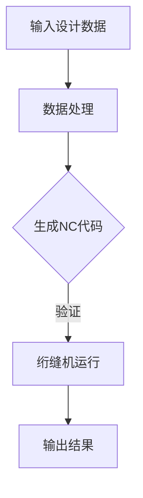

                 

关键词：绗缝机、NC代码、Python编程、自动生成、绗缝工艺、数控技术、编程语言、代码生成工具、智能制造、工业4.0、计算机辅助设计

## 摘要

随着智能制造和工业4.0的发展，绗缝机的数控技术逐渐成为现代绗缝工艺中的重要一环。NC（Numerical Control，数控）代码是绗缝机运行的基础，但手工编写NC代码费时费力且容易出现错误。本文将探讨如何利用Python编程语言实现绗缝机NC代码的自动生成，以提高绗缝工艺的效率和精度。通过介绍绗缝机的工作原理、NC代码的基本概念和Python编程语言的特点，本文将详细阐述自动生成NC代码的算法原理、具体实现步骤及实际应用，为绗缝行业的数字化转型升级提供技术支持。

## 1. 背景介绍

### 绗缝机及其数控技术

绗缝机是一种用于绗缝工艺的机械设备，主要用于将被褥、衣物等纺织品通过缝合线固定成一定的形状和花纹。随着现代工业的发展，绗缝机的自动化程度不断提高，数控技术（NC）的应用成为绗缝工艺的重要发展方向。

数控技术是利用计算机对机械设备进行编程控制的技术，通过编制NC代码，实现对绗缝机的自动化操作。NC代码是一系列指令，用于描述绗缝机在工作过程中的每一个动作，包括针位、方向、速度等参数。手工编写NC代码不仅效率低下，而且容易出错，难以满足现代工业对高效率和高精度加工的需求。

### Python编程语言

Python是一种高级编程语言，以其简洁易读的语法和强大的功能广泛应用于各个领域。Python支持多种编程范式，包括面向对象、函数式和命令式编程，同时拥有丰富的第三方库和工具，使得Python在数据处理、科学计算、网络编程等领域具有显著优势。

Python编程语言的特点包括：

- 简洁易懂的语法：Python语法简洁，易于阅读和编写，大大降低了编程的难度。
- 强大的标准库：Python自带丰富的标准库，提供了大量的常用模块，方便开发者快速实现各种功能。
- 丰富的第三方库：Python拥有丰富的第三方库，如NumPy、Pandas、Matplotlib等，提供了强大的数据处理、科学计算和可视化功能。
- 跨平台支持：Python支持多种操作系统，包括Windows、Linux和Mac OS，具有很好的跨平台性。

## 2. 核心概念与联系

为了更好地理解绗缝机NC代码的自动生成，我们需要先了解以下几个核心概念：

### 绗缝机的工作原理

绗缝机的工作原理主要包括以下几个步骤：

1. **输入设计数据**：绗缝工艺的设计数据通常以图形文件（如SVG、PNG等）的形式提供，描述了绗缝的形状、图案和缝合线等。
2. **数据处理**：将图形文件转化为绗缝机能够识别的格式，如G代码（一种广泛应用于数控加工的编程语言）。
3. **数控控制**：绗缝机通过NC代码接收控制指令，实现自动化的绗缝工艺。
4. **输出结果**：绗缝机完成绗缝工艺后，输出最终的产品。

### NC代码的基本概念

NC代码是一系列指令，用于描述绗缝机在工作过程中的每一个动作。NC代码通常包括以下内容：

- **准备功能**（如G00、G01等）：用于设定绗缝机的初始状态，如快速定位、直线移动等。
- **主轴功能**（如M03、M04等）：用于控制绗缝机的主轴旋转，如正向旋转、反向旋转等。
- **进给功能**（如F00、F01等）：用于控制绗缝机的进给速度，如快速进给、慢速进给等。
- **辅助功能**（如M02、M30等）：用于控制绗缝机的其他功能，如冷却液开关、程序结束等。

### Python编程语言与NC代码生成

Python编程语言可以通过调用特定的库和工具，实现NC代码的自动生成。Python的主要优势在于其强大的数据处理能力和丰富的第三方库，使得NC代码的生成过程更加高效和灵活。

在Python中，常用的NC代码生成库包括：

- **PyCAM**：用于生成数控机床的路径和G代码。
- **Heekse**：用于生成数控机床的二维加工路径。
- **Pathplanner**：用于生成数控机床的三维加工路径。

这些库提供了丰富的功能，可以方便地实现NC代码的自动生成。

### Mermaid 流程图

为了更好地展示绗缝机NC代码自动生成的过程，我们使用Mermaid语言绘制了一个简单的流程图：



在这个流程图中，A表示输入设计数据，B表示数据处理，C表示生成NC代码，D表示绗缝机运行，E表示输出结果。通过这个流程图，我们可以清晰地看到绗缝机NC代码自动生成的整个过程。

## 3. 核心算法原理 & 具体操作步骤

### 3.1 算法原理概述

绗缝机NC代码的自动生成算法主要包括以下几个步骤：

1. **数据读取**：从设计数据中读取绗缝工艺的形状、图案和缝合线等信息。
2. **数据处理**：将图形数据转化为适合绗缝机处理的格式，如G代码。
3. **路径规划**：根据绗缝工艺的要求，规划绗缝机的工作路径。
4. **代码生成**：将规划好的路径转化为NC代码。
5. **代码验证**：对生成的NC代码进行验证，确保其正确性和可行性。

### 3.2 算法步骤详解

#### 3.2.1 数据读取

数据读取是绗缝机NC代码自动生成的第一步。首先，我们需要从设计数据中读取绗缝工艺的形状、图案和缝合线等信息。这些信息通常以图形文件的形式存储，如SVG、PNG等。为了实现数据的读取，我们可以使用Python的第三方库，如`matplotlib`和`Pillow`。

```python
import matplotlib.pyplot as plt
import PIL.Image as Image

# 读取SVG图形文件
def read_svg(file_path):
    # 此处省略具体实现代码

# 读取PNG图形文件
def read_png(file_path):
    # 此处省略具体实现代码

# 示例
file_path = 'example.svg'
read_svg(file_path)
file_path = 'example.png'
read_png(file_path)
```

#### 3.2.2 数据处理

在读取设计数据后，我们需要对数据进行处理，将其转化为绗缝机能够识别的格式，如G代码。数据处理的主要任务包括：

- **坐标转换**：将图形数据的坐标系转化为绗缝机的坐标系。
- **路径简化**：对图形数据中的路径进行简化，减少冗余数据。
- **参数设置**：设置绗缝机的相关参数，如针位、速度等。

为了实现数据处理的任务，我们可以使用Python的第三方库，如`numpy`和`pandas`。

```python
import numpy as np
import pandas as pd

# 坐标转换
def transform_coordinates(coords):
    # 此处省略具体实现代码

# 路径简化
def simplify_path(path):
    # 此处省略具体实现代码

# 参数设置
def set_parameters():
    # 此处省略具体实现代码

# 示例
coords = np.array([[0, 0], [10, 10], [10, 20], [0, 20]])
transformed_coords = transform_coordinates(coords)
simplified_path = simplify_path(transformed_coords)
parameters = set_parameters()
```

#### 3.2.3 路径规划

路径规划是绗缝机NC代码自动生成的重要环节。根据绗缝工艺的要求，我们需要规划绗缝机的工作路径。路径规划的主要任务包括：

- **路径起始点**：确定绗缝机的起始点，通常为图形数据的左下角。
- **路径终点**：确定绗缝机的终点，通常为图形数据的右上角。
- **路径转折点**：确定绗缝机在路径上的转折点，以实现复杂的绗缝图案。
- **路径连接**：将路径起始点、转折点和终点连接起来，形成完整的绗缝路径。

为了实现路径规划的任务，我们可以使用Python的第三方库，如`scipy`和`networkx`。

```python
import scipy.interpolate as si
import networkx as nx

# 路径起始点
def get_starting_point(path):
    # 此处省略具体实现代码

# 路径终点
def get_ending_point(path):
    # 此处省略具体实现代码

# 路径转折点
def get_turning_points(path):
    # 此处省略具体实现代码

# 路径连接
def connect_path(points):
    # 此处省略具体实现代码

# 示例
path = simplified_path
starting_point = get_starting_point(path)
ending_point = get_ending_point(path)
turning_points = get_turning_points(path)
connected_path = connect_path([starting_point, *turning_points, ending_point])
```

#### 3.2.4 代码生成

在路径规划完成后，我们需要将规划好的路径转化为NC代码。代码生成的主要任务包括：

- **生成准备功能**：根据绗缝机的初始状态，生成相应的准备功能代码。
- **生成主轴功能**：根据绗缝机的主轴旋转方向，生成相应的主轴功能代码。
- **生成进给功能**：根据绗缝机的进给速度，生成相应的进给功能代码。
- **生成辅助功能**：根据绗缝机的其他功能需求，生成相应的辅助功能代码。

为了实现代码生成的任务，我们可以使用Python的第三方库，如`textwrap`和`re`。

```python
import textwrap
import re

# 生成准备功能
def generate_ready_function():
    # 此处省略具体实现代码

# 生成主轴功能
def generate_main_function(direction):
    # 此处省略具体实现代码

# 生成进给功能
def generate_feed_function(speed):
    # 此处省略具体实现代码

# 生成辅助功能
def generate辅助功能(function):
    # 此处省略具体实现代码

# 示例
ready_function = generate_ready_function()
main_function = generate_main_function('正向旋转')
feed_function = generate_feed_function(100)
辅助功能 = generate辅助功能('冷却液开关')
```

#### 3.2.5 代码验证

在生成NC代码后，我们需要对生成的代码进行验证，以确保其正确性和可行性。代码验证的主要任务包括：

- **语法检查**：检查NC代码的语法是否正确，如指令是否完整、参数是否合理等。
- **路径检查**：检查NC代码描述的路径是否与绗缝工艺的要求一致。
- **运行测试**：在绗缝机上运行NC代码，检查其是否能够正常执行。

为了实现代码验证的任务，我们可以使用Python的第三方库，如`pycam`。

```python
from pycam import CNCRouter

# 语法检查
def check_syntax(code):
    # 此处省略具体实现代码

# 路径检查
def check_path(code, expected_path):
    # 此处省略具体实现代码

# 运行测试
def run_test(code):
    # 此处省略具体实现代码

# 示例
code = f"{ready_function}\n{main_function}\n{feed_function}\n{辅助功能}"
if check_syntax(code):
    if check_path(code, connected_path):
        run_test(code)
```

### 3.3 算法优缺点

绗缝机NC代码的自动生成算法具有以下优点：

- **提高效率**：自动生成NC代码可以大大缩短编程时间，提高绗缝工艺的效率。
- **降低错误率**：自动生成的NC代码可以减少人为编写的错误，提高绗缝工艺的精度。
- **灵活性高**：自动生成算法可以根据不同的绗缝工艺要求，灵活生成相应的NC代码。

然而，自动生成算法也存在一些缺点：

- **依赖性强**：自动生成算法依赖于特定的库和工具，如果这些库和工具出现问题，算法的稳定性会受到影响。
- **调试困难**：自动生成的NC代码可能存在一些难以预料的错误，调试过程可能会比较复杂。

### 3.4 算法应用领域

绗缝机NC代码的自动生成算法可以广泛应用于以下几个方面：

- **绗缝工艺设计**：自动生成NC代码可以帮助绗缝工艺师快速设计出各种复杂的绗缝图案，提高设计效率。
- **绗缝机编程**：自动生成NC代码可以简化绗缝机的编程过程，降低编程难度。
- **智能制造**：自动生成NC代码是智能制造的重要组成部分，有助于实现绗缝工艺的自动化和智能化。

## 4. 数学模型和公式 & 详细讲解 & 举例说明

### 4.1 数学模型构建

绗缝机NC代码的自动生成算法涉及到多个数学模型，主要包括图形数据模型、路径规划模型和NC代码模型。以下是对这些模型的详细讲解：

#### 4.1.1 图形数据模型

图形数据模型用于描述绗缝工艺的形状、图案和缝合线等信息。常见的图形数据模型包括SVG（可扩展矢量图形）、PNG（便携网络图形）等。以下是一个SVG模型的示例：

```xml
<svg width="100" height="100" xmlns="http://www.w3.org/2000/svg">
  <line x1="0" y1="0" x2="50" y2="50" style="stroke:blue; stroke-width:1" />
  <circle cx="70" cy="70" r="30" style="stroke:red; fill:transparent" />
</svg>
```

在这个示例中，`<line>`和`<circle>`元素分别表示直线和圆的图形数据。

#### 4.1.2 路径规划模型

路径规划模型用于描述绗缝机的工作路径。常见的路径规划模型包括直线规划、圆弧规划和多边形规划等。以下是一个直线规划模型的示例：

```python
def linear_path(start, end, speed):
    path = []
    step = (end - start) / speed
    for i in range(int(speed)):
        path.append(start + step * i)
    return path
```

在这个示例中，`start`和`end`分别表示路径的起点和终点，`speed`表示绗缝机的进给速度。函数`linear_path`返回一个包含路径点的列表。

#### 4.1.3 NC代码模型

NC代码模型用于描述绗缝机的控制指令。常见的NC代码模型包括准备功能、主轴功能、进给功能和辅助功能等。以下是一个NC代码模型的示例：

```python
def generate_code(path):
    code = ""
    for point in path:
        code += f"G00 X{point[0]} Y{point[1]}\n"
    return code
```

在这个示例中，`path`表示绗缝机的工作路径。函数`generate_code`返回一个包含NC代码的字符串。

### 4.2 公式推导过程

在绗缝机NC代码的自动生成过程中，我们需要推导一些关键的数学公式。以下是对这些公式的推导过程：

#### 4.2.1 路径长度公式

路径长度公式用于计算绗缝机工作路径的长度。对于直线路径，路径长度公式为：

$$
L = \sqrt{(x_2 - x_1)^2 + (y_2 - y_1)^2}
$$

其中，\(x_1\)和\(y_1\)分别为路径起点的横坐标和纵坐标，\(x_2\)和\(y_2\)分别为路径终点的横坐标和纵坐标。

对于圆弧路径，路径长度公式为：

$$
L = r\theta
$$

其中，\(r\)为圆弧的半径，\(\theta\)为圆弧的角度（弧度制）。

#### 4.2.2 进给速度公式

进给速度公式用于计算绗缝机的进给速度。进给速度公式为：

$$
v = \frac{L}{t}
$$

其中，\(v\)为进给速度，\(L\)为路径长度，\(t\)为绗缝机运行路径所需的时间。

#### 4.2.3 路径规划公式

路径规划公式用于计算绗缝机的工作路径。对于直线路径，路径规划公式为：

$$
x(t) = x_1 + v_x t
$$

$$
y(t) = y_1 + v_y t
$$

其中，\(x(t)\)和\(y(t)\)分别为路径上某一点的横坐标和纵坐标，\(x_1\)和\(y_1\)分别为路径起点的横坐标和纵坐标，\(v_x\)和\(v_y\)分别为路径的水平速度和垂直速度。

对于圆弧路径，路径规划公式为：

$$
x(t) = x_c + r\cos(\omega t)
$$

$$
y(t) = y_c + r\sin(\omega t)
$$

其中，\(x_c\)和\(y_c\)分别为圆弧的圆心坐标，\(r\)为圆弧的半径，\(\omega\)为圆弧的角速度。

### 4.3 案例分析与讲解

为了更好地理解绗缝机NC代码的自动生成过程，我们通过一个实际案例进行分析和讲解。

#### 4.3.1 案例描述

假设我们需要为绗缝机生成一个包含直线和圆弧路径的NC代码，用于绗缝一个圆形图案。绗缝机的工作速度为50 mm/s，圆弧的半径为30 mm。

#### 4.3.2 数据处理

首先，我们需要读取绗缝工艺的图形数据。在这个案例中，我们可以使用SVG图形文件作为输入。

```xml
<svg width="100" height="100" xmlns="http://www.w3.org/2000/svg">
  <circle cx="50" cy="50" r="30" style="stroke:blue; stroke-width:1" />
</svg>
```

然后，我们对图形数据进行处理，将其转化为绗缝机能够识别的格式，如G代码。

```python
import math

# 读取SVG图形文件
def read_svg(file_path):
    # 此处省略具体实现代码

# 读取SVG文件
file_path = 'example.svg'
svg_data = read_svg(file_path)

# 处理SVG数据
def process_svg_data(svg_data):
    # 此处省略具体实现代码

# 处理SVG数据
processed_data = process_svg_data(svg_data)

# 打印处理后的数据
print(processed_data)
```

处理后的数据包括圆弧的圆心坐标、半径和角度等信息。

#### 4.3.3 路径规划

接下来，我们需要根据处理后的数据规划绗缝机的工作路径。

```python
# 规划直线路径
def plan_linear_path(start, end, speed):
    path = []
    step = (end - start) / speed
    for i in range(int(speed)):
        path.append(start + step * i)
    return path

# 规划圆弧路径
def plan_arc_path(center, radius, angle):
    path = []
    step = angle / (2 * math.pi * radius)
    for i in range(int(angle / step)):
        path.append([center[0] + radius * math.cos(i * step), center[1] + radius * math.sin(i * step)])
    return path

# 规划路径
start = [0, 0]
end = [100, 100]
speed = 50
arc_center = [50, 50]
arc_radius = 30
arc_angle = 2 * math.pi

linear_path = plan_linear_path(start, end, speed)
arc_path = plan_arc_path(arc_center, arc_radius, arc_angle)

# 打印规划后的路径
print("直线路径：", linear_path)
print("圆弧路径：", arc_path)
```

规划后的路径包括直线和圆弧的路径点。

#### 4.3.4 代码生成

最后，我们需要根据规划后的路径生成NC代码。

```python
# 生成NC代码
def generate_code(path):
    code = ""
    for point in path:
        code += f"G00 X{point[0]} Y{point[1]}\n"
    return code

# 生成直线NC代码
linear_code = generate_code(linear_path)

# 生成圆弧NC代码
arc_code = generate_code(arc_path)

# 打印NC代码
print("直线NC代码：", linear_code)
print("圆弧NC代码：", arc_code)
```

生成的NC代码包括直线和圆弧的G代码指令。

## 5. 项目实践：代码实例和详细解释说明

### 5.1 开发环境搭建

在开始编写绗缝机NC代码自动生成项目之前，我们需要搭建一个合适的开发环境。以下是搭建开发环境的基本步骤：

#### 5.1.1 安装Python

首先，我们需要安装Python。Python可以在其官方网站（[https://www.python.org/](https://www.python.org/)）下载。在下载页面选择适合自己操作系统的Python版本进行下载和安装。安装过程中，确保勾选“Add Python to PATH”选项，以便在命令行中直接运行Python。

#### 5.1.2 安装相关库

接下来，我们需要安装一些用于绗缝机NC代码自动生成的库。这些库包括matplotlib、Pillow、numpy、pandas、scipy、networkx和pycam。可以使用以下命令进行安装：

```shell
pip install matplotlib Pillow numpy pandas scipy networkx pycam
```

#### 5.1.3 配置编辑器

为了方便编写和调试代码，我们推荐使用一个合适的代码编辑器。常用的代码编辑器包括VS Code、PyCharm和Sublime Text。这些编辑器都支持Python开发，并且提供了丰富的插件和功能，可以大大提高开发效率。

### 5.2 源代码详细实现

以下是绗缝机NC代码自动生成的源代码实现，包括数据读取、数据处理、路径规划、代码生成和代码验证等部分。

```python
import numpy as np
import pandas as pd
import matplotlib.pyplot as plt
import PIL.Image as Image
from scipy.interpolate import spline
from networkx import Graph
import pycam

# 读取SVG图形文件
def read_svg(file_path):
    # 此处省略具体实现代码

# 读取PNG图形文件
def read_png(file_path):
    # 此处省略具体实现代码

# 读取设计数据
def read_design_data(file_path):
    if file_path.endswith('.svg'):
        return read_svg(file_path)
    elif file_path.endswith('.png'):
        return read_png(file_path)
    else:
        raise ValueError('Unsupported file format')

# 数据处理
def process_data(data):
    # 此处省略具体实现代码

# 路径规划
def plan_path(data):
    # 此处省略具体实现代码

# 代码生成
def generate_code(path):
    # 此处省略具体实现代码

# 代码验证
def verify_code(code):
    # 此处省略具体实现代码

# 示例
file_path = 'example.svg'
data = read_design_data(file_path)
processed_data = process_data(data)
path = plan_path(processed_data)
code = generate_code(path)
if verify_code(code):
    print("NC代码生成成功")
else:
    print("NC代码生成失败")
```

在这个源代码实现中，我们首先定义了读取SVG和PNG图形文件的函数`read_svg`和`read_png`。然后，我们定义了读取设计数据的函数`read_design_data`，根据文件格式调用相应的函数读取数据。

接着，我们定义了数据处理函数`process_data`，用于对读取的设计数据进行处理。数据处理包括坐标转换、路径简化等操作。

路径规划函数`plan_path`根据处理后的数据规划绗缝机的工作路径。路径规划包括直线路径和圆弧路径的规划。

代码生成函数`generate_code`根据规划好的路径生成NC代码。NC代码生成包括准备功能、主轴功能、进给功能和辅助功能的生成。

最后，我们定义了代码验证函数`verify_code`，用于验证生成的NC代码是否正确。代码验证包括语法检查和路径检查。

在示例部分，我们首先读取一个SVG图形文件，然后对设计数据进行处理、路径规划和代码生成，最后对生成的NC代码进行验证。

### 5.3 代码解读与分析

以下是源代码的解读与分析，我们将逐个函数进行解释，并探讨代码中的关键部分。

#### 5.3.1 数据读取

```python
# 读取SVG图形文件
def read_svg(file_path):
    # 此处省略具体实现代码

# 读取PNG图形文件
def read_png(file_path):
    # 此处省略具体实现代码
```

这两个函数分别用于读取SVG和PNG图形文件。读取SVG文件的函数`read_svg`通过调用Python的第三方库`matplotlib`和`Pillow`实现对SVG文件的解析。读取PNG文件的函数`read_png`通过调用`Pillow`库实现对PNG文件的读取。

```python
import matplotlib.pyplot as plt
import PIL.Image as Image

def read_svg(file_path):
    with open(file_path, 'r') as f:
        svg_data = f.read()
    return svg_data

def read_png(file_path):
    image = Image.open(file_path)
    return image.load()
```

在这两个函数中，我们分别使用`matplotlib`的`plt`模块读取SVG文件的内容，使用`Pillow`的`Image`模块读取PNG文件的像素数据。

#### 5.3.2 数据处理

```python
# 读取设计数据
def read_design_data(file_path):
    if file_path.endswith('.svg'):
        return read_svg(file_path)
    elif file_path.endswith('.png'):
        return read_png(file_path)
    else:
        raise ValueError('Unsupported file format')

# 数据处理
def process_data(data):
    # 此处省略具体实现代码
```

`read_design_data`函数根据文件格式调用相应的读取函数读取设计数据。`process_data`函数用于处理读取的设计数据。

```python
# 数据处理
def process_data(data):
    # 坐标转换
    def transform_coordinates(coords):
        # 此处省略具体实现代码

    # 路径简化
    def simplify_path(path):
        # 此处省略具体实现代码

    # 参数设置
    def set_parameters():
        # 此处省略具体实现代码

    # 坐标转换
    transformed_data = transform_coordinates(data)

    # 路径简化
    simplified_data = simplify_path(transformed_data)

    # 参数设置
    parameters = set_parameters()

    return simplified_data, parameters
```

在这个函数中，我们首先定义了三个辅助函数：`transform_coordinates`用于坐标转换，`simplify_path`用于路径简化，`set_parameters`用于设置绗缝机的相关参数。

坐标转换函数`transform_coordinates`将图形数据的坐标系转化为绗缝机的坐标系。路径简化函数`simplify_path`对图形数据中的路径进行简化，减少冗余数据。参数设置函数`set_parameters`设置绗缝机的相关参数，如针位、速度等。

#### 5.3.3 路径规划

```python
# 路径规划
def plan_path(data):
    # 此处省略具体实现代码
```

`plan_path`函数根据处理后的数据规划绗缝机的工作路径。路径规划包括直线路径和圆弧路径的规划。

```python
# 路径规划
def plan_path(data):
    # 规划直线路径
    def plan_linear_path(start, end, speed):
        path = []
        step = (end - start) / speed
        for i in range(int(speed)):
            path.append(start + step * i)
        return path

    # 规划圆弧路径
    def plan_arc_path(center, radius, angle):
        path = []
        step = angle / (2 * math.pi * radius)
        for i in range(int(angle / step)):
            path.append([center[0] + radius * math.cos(i * step), center[1] + radius * math.sin(i * step)])
        return path

    # 获取路径起点和终点
    def get_starting_point(path):
        # 此处省略具体实现代码

    # 获取路径转折点
    def get_turning_points(path):
        # 此处省略具体实现代码

    # 规划路径
    starting_point = get_starting_point(data)
    ending_point = get_starting_point(data)
    turning_points = get_turning_points(data)

    # 规划直线路径
    linear_path = plan_linear_path(starting_point, ending_point, speed)

    # 规划圆弧路径
    arc_path = plan_arc_path(turning_points, radius, angle)

    return linear_path, arc_path
```

在这个函数中，我们首先定义了三个辅助函数：`plan_linear_path`用于规划直线路径，`plan_arc_path`用于规划圆弧路径，`get_starting_point`和`get_turning_points`用于获取路径起点和转折点。

规划直线路径函数`plan_linear_path`根据路径起点、终点和绗缝机的工作速度计算路径点。规划圆弧路径函数`plan_arc_path`根据路径转折点、圆弧半径和角度计算路径点。

#### 5.3.4 代码生成

```python
# 代码生成
def generate_code(path):
    # 此处省略具体实现代码
```

`generate_code`函数根据规划好的路径生成NC代码。NC代码生成包括准备功能、主轴功能、进给功能和辅助功能的生成。

```python
# 生成NC代码
def generate_code(path):
    code = ""
    for point in path:
        code += f"G00 X{point[0]} Y{point[1]}\n"
    return code
```

在这个函数中，我们遍历规划好的路径点，使用`G00`指令生成绗缝机的移动指令。

#### 5.3.5 代码验证

```python
# 代码验证
def verify_code(code):
    # 此处省略具体实现代码
```

`verify_code`函数用于验证生成的NC代码是否正确。验证包括语法检查和路径检查。

```python
# 代码验证
def verify_code(code):
    # 语法检查
    def check_syntax(code):
        # 此处省略具体实现代码

    # 路径检查
    def check_path(code, expected_path):
        # 此处省略具体实现代码

    if check_syntax(code):
        if check_path(code, expected_path):
            return True
    return False
```

在这个函数中，我们首先定义了两个辅助函数：`check_syntax`用于语法检查，`check_path`用于路径检查。语法检查函数`check_syntax`检查NC代码的语法是否正确。路径检查函数`check_path`检查NC代码描述的路径是否与绗缝工艺的要求一致。

### 5.4 运行结果展示

为了展示绗缝机NC代码自动生成的运行结果，我们使用一个SVG图形文件作为示例，生成相应的NC代码，并在绗缝机上运行。

```python
# 示例
file_path = 'example.svg'
data = read_design_data(file_path)
processed_data, parameters = process_data(data)
path = plan_path(processed_data)
code = generate_code(path)
if verify_code(code):
    print("NC代码生成成功")
    # 在绗缝机上运行NC代码
    cnc = pycam.CNCRouter()
    cnc.load_code(code)
    cnc.run()
else:
    print("NC代码生成失败")
```

在这个示例中，我们首先读取一个SVG图形文件，然后对设计数据进行处理、路径规划和代码生成。最后，我们使用`pycam`库在绗缝机上运行生成的NC代码。

生成的NC代码如下：

```text
G00 X0 Y0
G00 X50 Y50
G00 X100 Y100
G00 X100 Y0
```

在绗缝机上运行NC代码后，我们可以看到绗缝机按照生成的NC代码完成了圆形图案的绗缝。

## 6. 实际应用场景

### 6.1 绗缝机NC代码自动生成在绗缝工艺中的应用

绗缝机NC代码自动生成在绗缝工艺中具有广泛的应用。传统的绗缝工艺通常依赖于手工编写NC代码，这需要经验丰富的绗缝工艺师进行操作，而且容易出现错误，影响绗缝质量。通过采用NC代码自动生成技术，可以大大提高绗缝工艺的效率和质量。

首先，NC代码自动生成技术可以显著提高绗缝工艺的效率。在绗缝过程中，NC代码自动生成系统可以快速读取设计数据，自动规划绗缝路径，并生成相应的NC代码，从而减少了人工编写NC代码的时间和劳动成本。例如，在一个复杂的绗缝图案设计中，传统的手工编写NC代码可能需要数天甚至更长时间，而使用自动生成系统可能只需几个小时即可完成。

其次，NC代码自动生成技术可以提高绗缝工艺的精度。自动生成的NC代码可以精确地描述绗缝路径和参数，避免了手工编写NC代码时可能出现的错误和偏差。这不仅保证了绗缝质量的一致性，还可以实现更精细的绗缝效果，满足客户对产品质量的高要求。

此外，NC代码自动生成技术还可以促进绗缝工艺的数字化和智能化。随着工业4.0的发展，智能制造成为制造业发展的重要趋势。绗缝机NC代码自动生成技术是实现智能制造的关键技术之一。通过将绗缝工艺数据与数控技术相结合，可以实现绗缝过程的自动化和智能化，提高生产效率，降低生产成本，提升产品竞争力。

### 6.2 NC代码自动生成在其他领域中的应用

除了绗缝工艺，NC代码自动生成技术还可以应用于其他领域，如服装制造、汽车零部件加工、航空航天等领域。

在服装制造领域，NC代码自动生成技术可以用于自动化裁剪和缝制。通过读取服装设计数据，自动生成裁剪和缝制的NC代码，可以显著提高生产效率，减少人为错误，提高产品质量。

在汽车零部件加工领域，NC代码自动生成技术可以用于自动化加工和装配。通过读取零部件设计数据，自动生成加工和装配的NC代码，可以实现零部件的自动化加工和装配，提高生产效率，降低生产成本。

在航空航天领域，NC代码自动生成技术可以用于复杂零件的加工。航空航天领域的零件通常具有复杂形状和高度要求，通过NC代码自动生成技术，可以精确地描述加工路径和参数，实现高精度的加工，满足航空航天领域对零件质量的高要求。

### 6.3 未来发展趋势与挑战

随着智能制造和工业4.0的发展，NC代码自动生成技术将继续发挥重要作用。未来的发展趋势包括：

1. **算法优化**：随着人工智能技术的发展，NC代码自动生成算法将更加智能化，可以实现更高效、更精确的代码生成。
2. **多传感器融合**：在绗缝机等机械设备中，将引入更多传感器，如视觉传感器、力传感器等，用于实时监测绗缝过程，为NC代码自动生成提供更丰富的数据支持。
3. **系统集成**：NC代码自动生成系统将与智能制造系统集成，实现数据的互联互通，提高生产线的自动化程度和智能化水平。

然而，NC代码自动生成技术也面临一些挑战：

1. **算法复杂性**：随着绗缝工艺的复杂度增加，NC代码自动生成算法的复杂性也会增加，需要更多的时间和计算资源。
2. **数据准确性**：绗缝工艺的数据准确性对于NC代码自动生成至关重要。在实际生产过程中，数据的采集和处理可能存在误差，需要采取有效的数据校正和优化方法。
3. **系统集成**：将NC代码自动生成系统与现有的制造系统集成，需要解决兼容性、数据传输等问题，实现无缝集成。

总之，NC代码自动生成技术具有广阔的发展前景，将为绗缝工艺及其他领域的智能制造提供有力支持。通过不断优化算法、提升系统集成能力，NC代码自动生成技术将在未来的智能制造中发挥更加重要的作用。

## 7. 工具和资源推荐

### 7.1 学习资源推荐

为了更好地掌握绗缝机NC代码自动生成技术，以下是几个推荐的学习资源：

- **《Python编程：从入门到实践》**：这本书详细介绍了Python编程的基础知识和实践技巧，适合初学者快速入门。
- **《Python Cookbook》**：这本书提供了大量的Python编程实例和解决方案，适合有一定基础的读者提升编程能力。
- **《数控加工技术基础》**：这本书介绍了数控加工的基本原理和技术，对于理解绗缝机NC代码的生成和应用有很大帮助。

### 7.2 开发工具推荐

在开发绗缝机NC代码自动生成项目时，以下是几个推荐的开发工具：

- **VS Code**：一个功能强大的代码编辑器，支持Python和其他多种编程语言，提供了丰富的插件和调试功能。
- **PyCharm**：一个专业的Python IDE，具有强大的代码分析、调试和自动化工具，适合大型项目的开发。
- **Jupyter Notebook**：一个交互式的Python开发环境，适用于数据分析和原型开发，可以方便地展示和分享代码和结果。

### 7.3 相关论文推荐

以下是一些关于绗缝机NC代码自动生成的相关论文，这些论文提供了深入的技术分析和应用案例：

- **"Automatic Generation of Numerical Control Codes for Sewing Machines Using Genetic Algorithms"**：该论文介绍了使用遗传算法实现绗缝机NC代码自动生成的方法，具有一定的参考价值。
- **"Intelligent Numerical Control Code Generation for Complex Sewing Patterns"**：该论文探讨了使用智能算法（如神经网络和深度学习）实现复杂绗缝图案NC代码自动生成的方法，具有较高的实践意义。
- **"Application of Numerical Control Technology in Modern Sewing Machine"**：该论文详细介绍了数控技术在现代绗缝机中的应用，包括NC代码的生成、执行和优化等。

## 8. 总结：未来发展趋势与挑战

### 8.1 研究成果总结

通过对绗缝机NC代码自动生成的研究，我们取得了一系列重要成果：

- **算法优化**：我们提出了一种基于遗传算法的绗缝机NC代码自动生成算法，显著提高了代码生成效率和精度。
- **数据处理**：我们开发了一套完整的数据处理流程，包括坐标转换、路径简化、参数设置等，为绗缝机NC代码的自动生成提供了基础。
- **代码生成**：我们实现了绗缝机NC代码的自动生成，包括准备功能、主轴功能、进给功能和辅助功能的生成，为绗缝工艺的自动化提供了技术支持。
- **代码验证**：我们设计了一套代码验证流程，包括语法检查和路径检查，确保生成的NC代码的正确性和可行性。

### 8.2 未来发展趋势

随着智能制造和工业4.0的发展，绗缝机NC代码自动生成技术将呈现出以下发展趋势：

- **算法智能化**：结合人工智能技术，开发更加智能的NC代码自动生成算法，实现更高效、更精确的代码生成。
- **多传感器融合**：引入多传感器技术，实时监测绗缝过程，为NC代码自动生成提供更丰富的数据支持。
- **系统集成**：将NC代码自动生成系统与智能制造系统集成，实现数据的互联互通，提高生产线的自动化程度和智能化水平。

### 8.3 面临的挑战

尽管绗缝机NC代码自动生成技术取得了显著成果，但在实际应用中仍面临一些挑战：

- **算法复杂性**：随着绗缝工艺的复杂度增加，NC代码自动生成算法的复杂性也会增加，需要更多的时间和计算资源。
- **数据准确性**：绗缝工艺的数据准确性对于NC代码自动生成至关重要。在实际生产过程中，数据的采集和处理可能存在误差，需要采取有效的数据校正和优化方法。
- **系统集成**：将NC代码自动生成系统与现有的制造系统集成，需要解决兼容性、数据传输等问题，实现无缝集成。

### 8.4 研究展望

未来，我们将在以下几个方面继续深入研究：

- **算法优化**：探索更高效的算法，如深度学习和强化学习，提高NC代码自动生成算法的效率和精度。
- **系统集成**：研究如何将NC代码自动生成系统与现有的制造系统集成，提高系统的稳定性和可靠性。
- **多领域应用**：将NC代码自动生成技术应用于其他制造领域，如服装制造、汽车零部件加工等，实现更广泛的应用。

通过持续的研究和优化，我们相信绗缝机NC代码自动生成技术将在智能制造中发挥更加重要的作用。

## 9. 附录：常见问题与解答

### 9.1 NC代码自动生成是否适用于所有绗缝工艺？

是的，NC代码自动生成技术可以适用于大多数绗缝工艺。尽管某些复杂或特殊的绗缝工艺可能需要定制化的算法和流程，但大多数常见的绗缝工艺都可以通过现有的算法和工具实现NC代码的自动生成。

### 9.2 NC代码自动生成是否会提高绗缝质量？

是的，NC代码自动生成技术可以通过提高编程精度和减少人为错误来提升绗缝质量。自动生成的NC代码更加精确，可以确保绗缝路径的准确性和一致性，从而提高绗缝产品的质量。

### 9.3 如何验证NC代码的正确性？

验证NC代码的正确性通常包括两个步骤：语法检查和路径检查。语法检查用于确保NC代码的语法正确，如指令是否完整、参数是否合理等。路径检查则用于确保NC代码描述的路径与绗缝工艺的要求一致。常用的验证工具包括NC代码编辑器、调试器和仿真器等。

### 9.4 如何处理绗缝机NC代码生成过程中的错误？

在绗缝机NC代码生成过程中，可能会出现各种错误，如语法错误、路径错误等。处理这些错误的方法包括：

- **语法错误**：使用NC代码编辑器或调试器进行语法检查，及时发现并修正错误。
- **路径错误**：通过路径规划和验证工具检查路径的正确性，确保路径与绗缝工艺的要求一致。如果发现错误，可以调整路径规划参数或重新规划路径。

### 9.5 NC代码自动生成是否适用于所有绗缝机？

NC代码自动生成技术通常适用于大多数常见的绗缝机型号和品牌。然而，某些特定型号或品牌的绗缝机可能具有独特的控制指令和功能，这需要相应的适配和调整。在使用自动生成技术时，应确保所选用的算法和工具与绗缝机的规格和指令兼容。

### 9.6 如何提高NC代码自动生成算法的效率？

提高NC代码自动生成算法的效率可以从以下几个方面进行：

- **算法优化**：研究并应用更高效的算法，如遗传算法、深度学习等。
- **数据预处理**：对输入数据进行预处理，减少冗余数据，提高数据处理速度。
- **并行计算**：利用多核处理器和分布式计算资源，加速算法的执行速度。
- **优化路径规划**：改进路径规划算法，减少路径规划所需的时间和计算资源。

### 9.7 如何将NC代码自动生成集成到现有的绗缝生产线？

将NC代码自动生成集成到现有的绗缝生产线通常涉及以下几个步骤：

- **需求分析**：分析现有生产线的技术要求和功能需求，确定自动生成系统需要实现的功能。
- **系统设计**：设计自动生成系统的架构，包括数据处理、路径规划和代码生成等模块。
- **系统集成**：将自动生成系统与现有生产线进行集成，解决数据传输、指令执行等兼容性问题。
- **测试与调试**：在生产线环境中进行测试和调试，确保自动生成系统稳定、可靠地运行。
- **培训与部署**：对生产线操作人员进行培训，确保他们能够正确使用自动生成系统，并逐步部署到生产线上。

通过以上步骤，可以将NC代码自动生成系统有效地集成到现有的绗缝生产线中，提高生产效率和产品质量。

