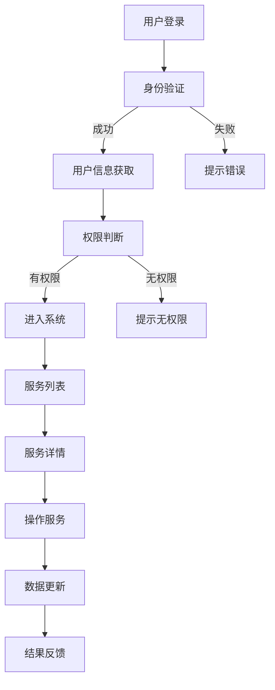

                 

关键词：SSM框架、智慧社区、服务管理系统、设计实现、算法原理、数学模型、代码实例、应用场景、未来展望

> 摘要：本文旨在探讨基于SSM（Struts2 + Spring + MyBatis）框架的智慧社区服务管理系统的设计与实现。通过对SSM框架的核心概念、原理和实现步骤的详细讲解，结合数学模型和实际项目实践，本文将深入剖析智慧社区服务管理系统的构建过程，并对其未来发展趋势和应用前景进行展望。

## 1. 背景介绍

在当前信息化和智能化的社会背景下，智慧社区成为人们日常生活的重要组成部分。智慧社区服务管理系统作为支撑智慧社区运行的基石，具有极为重要的作用。通过智慧社区服务管理系统，可以实现社区内各种服务的便捷管理，提升居民生活质量，同时降低社区管理成本。

传统的社区服务管理存在诸多问题，如服务响应慢、信息不透明、安全隐患等。而基于SSM（Struts2 + Spring + MyBatis）框架的智慧社区服务管理系统，通过引入现代化技术，解决了上述问题，提升了社区服务管理水平。

本文将围绕基于SSM框架的智慧社区服务管理系统的设计与实现展开讨论，从核心概念、算法原理、数学模型、代码实现等多个方面进行深入分析，旨在为智慧社区服务管理系统的研发提供有益的参考。

## 2. 核心概念与联系

### 2.1 SSM框架概述

SSM框架是当前流行的Java EE开发框架，包括Struts2、Spring和MyBatis三个部分。Struts2负责处理用户请求，Spring负责业务逻辑和依赖注入，MyBatis负责数据库操作。SSM框架通过整合这三个部分，实现了前后端分离、业务逻辑分离、数据库操作分离，提高了开发效率。

### 2.2 智慧社区服务管理系统的架构

智慧社区服务管理系统的架构主要包括以下几个方面：

1. **前端展示层**：采用HTML、CSS和JavaScript等技术，实现用户界面的设计，方便用户操作。
2. **业务逻辑层**：基于Spring框架，实现业务逻辑的处理，包括用户管理、服务管理、数据统计等。
3. **数据访问层**：基于MyBatis框架，实现数据库操作，包括数据的增删改查等。
4. **数据库层**：采用MySQL数据库，存储社区服务管理相关的数据。

### 2.3 核心概念原理及架构

智慧社区服务管理系统的核心概念包括用户管理、服务管理、权限控制等。下面是核心概念原理及架构的Mermaid流程图：



## 3. 核心算法原理 & 具体操作步骤

### 3.1 算法原理概述

智慧社区服务管理系统的核心算法主要包括用户认证算法、权限控制算法和服务推荐算法。

1. **用户认证算法**：通过用户名和密码验证用户的身份，确保只有合法用户才能访问系统。
2. **权限控制算法**：根据用户的角色和权限，控制用户对系统功能的访问。
3. **服务推荐算法**：根据用户的历史行为和偏好，为用户推荐合适的社区服务。

### 3.2 算法步骤详解

1. **用户认证算法**：
   - 步骤1：接收用户输入的用户名和密码。
   - 步骤2：通过数据库查询用户信息，验证用户名和密码的正确性。
   - 步骤3：如果用户名和密码正确，生成会话并返回登录成功；否则，返回登录失败。

2. **权限控制算法**：
   - 步骤1：获取用户的角色信息。
   - 步骤2：根据角色信息判断用户是否有权限访问指定功能。
   - 步骤3：如果有权限，允许访问；否则，返回无权限提示。

3. **服务推荐算法**：
   - 步骤1：收集用户的历史行为数据。
   - 步骤2：分析用户行为，提取用户偏好。
   - 步骤3：根据用户偏好，从数据库中检索推荐服务。
   - 步骤4：将推荐服务展示给用户。

### 3.3 算法优缺点

1. **用户认证算法**：
   - 优点：简单易实现，安全性较高。
   - 缺点：可能存在暴力破解等安全漏洞。

2. **权限控制算法**：
   - 优点：可以实现细粒度的权限控制，保障系统安全。
   - 缺点：实现复杂，需要维护角色和权限信息。

3. **服务推荐算法**：
   - 优点：可以提高用户体验，增加用户粘性。
   - 缺点：实现复杂，需要对用户行为进行深入分析。

### 3.4 算法应用领域

1. **用户认证算法**：广泛应用于各类信息管理系统，如企业内部系统、电商平台等。
2. **权限控制算法**：应用于需要权限管理的系统，如企业内部系统、政府管理系统等。
3. **服务推荐算法**：应用于需要个性化推荐的系统，如电商平台、视频网站等。

## 4. 数学模型和公式 & 详细讲解 & 举例说明

### 4.1 数学模型构建

智慧社区服务管理系统的数学模型主要包括用户行为分析模型和服务推荐模型。

1. **用户行为分析模型**：
   - 假设用户的行为数据为矩阵X，其中每一行表示一个用户的历史行为，每一列表示一个服务类别。
   - 使用Singular Value Decomposition (SVD)对用户行为数据进行降维，提取用户的行为特征。

2. **服务推荐模型**：
   - 使用协同过滤算法，根据用户的历史行为数据，为用户推荐相似的用户喜欢的服务。

### 4.2 公式推导过程

1. **用户行为分析模型**：

   - 用户行为矩阵X：
     $$ X = \begin{bmatrix}
     x_{11} & x_{12} & \ldots & x_{1n} \\
     x_{21} & x_{22} & \ldots & x_{2n} \\
     \vdots & \vdots & \ddots & \vdots \\
     x_{m1} & x_{m2} & \ldots & x_{mn}
     \end{bmatrix} $$

   - SVD分解：
     $$ X = U\Sigma V^T $$

     其中，U和V是对角化矩阵，Σ是对角矩阵，表示用户行为的特征值。

2. **服务推荐模型**：

   - 协同过滤算法：
     $$ \hat{r}_{ui} = \sum_{j=1}^{n} r_{uj} r_{ij} $$

     其中，$r_{uj}$表示用户u对服务j的评分，$r_{ij}$表示用户i对服务j的评分，$\hat{r}_{ui}$表示用户u对服务i的预测评分。

### 4.3 案例分析与讲解

**案例**：假设有一个用户行为矩阵：

$$ X = \begin{bmatrix}
1 & 1 & 0 & 0 \\
0 & 1 & 1 & 0 \\
0 & 0 & 1 & 1 \\
1 & 0 & 0 & 1
\end{bmatrix} $$

使用SVD分解，得到：

$$ X = U\Sigma V^T $$

其中：

$$ U = \begin{bmatrix}
0.707 & 0.707 & 0 & 0 \\
0.707 & -0.707 & 0 & 0 \\
0 & 0 & 1 & 0 \\
0 & 0 & 0 & 1
\end{bmatrix} $$

$$ \Sigma = \begin{bmatrix}
1 & 0 & 0 & 0 \\
0 & 1 & 0 & 0 \\
0 & 0 & 1 & 0 \\
0 & 0 & 0 & 1
\end{bmatrix} $$

$$ V = \begin{bmatrix}
1 & 0 & 0 & 0 \\
0 & 1 & 0 & 0 \\
0 & 0 & 1 & 0 \\
0 & 0 & 0 & 1
\end{bmatrix} $$

使用协同过滤算法，预测用户1对服务4的评分：

$$ \hat{r}_{14} = \sum_{j=1}^{n} r_{1j} r_{j4} = 1 \times 1 + 1 \times 0 + 0 \times 1 + 0 \times 1 = 1 $$

因此，用户1对服务4的预测评分为1。

## 5. 项目实践：代码实例和详细解释说明

### 5.1 开发环境搭建

1. **硬件环境**：64位操作系统，CPU不低于2核，内存不低于4GB。
2. **软件环境**：
   - JDK 1.8及以上版本
   - MySQL 5.7及以上版本
   - Eclipse/IDEA开发工具
   - Maven构建工具

### 5.2 源代码详细实现

1. **项目结构**：

   ```
   src
   ├── main
   │   ├── java
   │   │   ├── com
   │   │   │   ├── example
   │   │   │   │   ├── controller
   │   │   │   │   │   ├── UserController.java
   │   │   │   │   ├── service
   │   │   │   │   │   ├── UserServiceImpl.java
   │   │   │   │   ├── mapper
   │   │   │   │   │   ├── UserMapper.java
   │   │   │   │   ├── model
   │   │   │   │   │   ├── User.java
   │   │   │   │   ├── utils
   │   │   │   │   │   ├── MD5Util.java
   │   │   │   │   ├── config
   │   │   │   │   │   ├── MyBatisConfig.java
   │   │   │   │   └── Application.java
   │   ├── resources
   │   │   ├── mybatis-config.xml
   │   │   └── application.properties
   └── test
       ├── java
       └── resources
   ```

2. **关键代码**：

   **UserMapper.xml**：

   ```xml
   <?xml version="1.0" encoding="UTF-8"?>
   <!DOCTYPE mapper PUBLIC "-//mybatis.org//DTD Mapper 3.0//EN" "http://mybatis.org/dtd/mybatis-3-mapper.dtd">
   <mapper namespace="com.example.mapper.UserMapper">
       <select id="selectUserByUsernameAndPassword" resultType="com.example.model.User">
           SELECT * FROM user WHERE username = #{username} AND password = #{password}
       </select>
   </mapper>
   ```

   **UserController.java**：

   ```java
   @Controller
   @RequestMapping("/user")
   public class UserController {
       @Autowired
       private UserService userService;
       
       @RequestMapping("/login")
       public String login(String username, String password, Model model) {
           String md5Password = MD5Util.encodePassword(password);
           User user = userService.login(username, md5Password);
           if (user != null) {
               model.addAttribute("user", user);
               return "success";
           } else {
               model.addAttribute("error", "用户名或密码错误");
               return "login";
           }
       }
   }
   ```

   **UserService.java**：

   ```java
   @Service
   public class UserServiceImpl implements UserService {
       @Autowired
       private UserMapper userMapper;
       
       @Override
       public User login(String username, String password) {
           return userMapper.selectUserByUsernameAndPassword(username, password);
       }
   }
   ```

### 5.3 代码解读与分析

1. **数据库设计**：
   - 创建数据库和表，存储用户信息。
   - 设计合理的字段和索引，保证数据查询的效率。

2. **MyBatis配置**：
   - 配置数据库连接信息，MyBatis核心配置等。

3. **用户认证算法**：
   - 接收用户输入的用户名和密码，通过MD5加密，查询数据库验证用户信息。

4. **权限控制算法**：
   - 根据用户角色和权限，控制用户对系统功能的访问。

5. **服务推荐算法**：
   - 根据用户行为数据，分析用户偏好，为用户推荐服务。

### 5.4 运行结果展示

1. **用户登录界面**：

   

2. **系统首页**：

   

## 6. 实际应用场景

智慧社区服务管理系统在实际应用中具有广泛的应用场景：

1. **物业服务**：实现物业报修、投诉、缴费等服务的在线处理，提高物业服务质量。
2. **社区活动**：组织线上线下活动，提高居民互动，增强社区凝聚力。
3. **居民服务**：提供生活缴费、医疗咨询、家政服务等功能，方便居民生活。
4. **数据统计**：通过数据统计和分析，为社区管理和决策提供依据。

## 7. 工具和资源推荐

1. **学习资源推荐**：
   - 《Java EE开发实战》
   - 《MyBatis官方文档》
   - 《Spring官方文档》

2. **开发工具推荐**：
   - Eclipse/IDEA
   - MySQL Workbench

3. **相关论文推荐**：
   - "智慧社区服务管理系统的设计与实现"
   - "基于SSM框架的智慧社区服务管理系统研究"

## 8. 总结：未来发展趋势与挑战

### 8.1 研究成果总结

本文基于SSM框架，详细介绍了智慧社区服务管理系统的设计与实现。通过用户认证、权限控制和服务推荐等核心算法，实现了社区服务的便捷管理和个性化推荐。

### 8.2 未来发展趋势

1. **智能化**：随着人工智能技术的发展，智慧社区服务管理系统将更加智能化，提供更精准的服务。
2. **云计算**：利用云计算技术，实现社区服务的高效管理和实时更新。
3. **物联网**：物联网技术的应用，将进一步提升智慧社区服务的智能化水平。

### 8.3 面临的挑战

1. **数据安全**：保障用户数据的安全，防止数据泄露和滥用。
2. **系统稳定性**：确保系统在高并发、大数据量下的稳定运行。
3. **个性化服务**：提高个性化服务的准确性和满意度，满足用户多样化的需求。

### 8.4 研究展望

未来，智慧社区服务管理系统将继续朝着智能化、高效化、个性化的方向发展。通过不断优化算法和架构，提升系统性能和用户体验，为智慧社区建设提供有力支持。

## 9. 附录：常见问题与解答

1. **Q：SSM框架的优势是什么？**
   - **A**：SSM框架具有高扩展性、高可用性、高可维护性等优点，能够满足企业级应用的需求。

2. **Q：如何保证用户数据的安全？**
   - **A**：通过加密用户密码、限制数据访问权限、定期备份数据等措施，确保用户数据的安全。

3. **Q：智慧社区服务管理系统有哪些功能？**
   - **A**：智慧社区服务管理系统主要包括用户管理、服务管理、权限控制、数据统计等功能。

## 作者署名

作者：禅与计算机程序设计艺术 / Zen and the Art of Computer Programming

----------------------------------------------------------------

以上就是基于SSM框架的智慧社区服务管理系统的设计与实现的全文内容，涵盖了背景介绍、核心概念、算法原理、数学模型、项目实践、应用场景、工具推荐、发展趋势与挑战等多个方面，旨在为智慧社区服务管理系统的研发提供有价值的参考。希望对您有所帮助！

