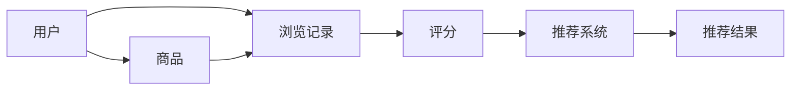

                 

关键词：图嵌入、大规模推荐系统、商品推荐、AI、机器学习

摘要：本文将深入探讨基于图嵌入技术构建的大规模商品推荐系统。我们将介绍图嵌入的基本概念和原理，分析其在商品推荐中的应用，以及详细的算法原理、数学模型、实践案例和未来展望。通过本文的阅读，读者将能够全面理解图嵌入技术在推荐系统中的强大应用潜力。

## 1. 背景介绍

随着互联网的快速发展，电子商务领域迎来了爆炸式的增长。在线购物成为人们日常生活中不可或缺的一部分。与此同时，商品推荐系统在电子商务中扮演着至关重要的角色，它能够为用户提供个性化的购物体验，提升用户满意度和忠诚度。

传统的推荐系统主要依赖于用户的历史行为数据，如浏览记录、购买历史等。然而，这种方法存在明显的局限性，无法很好地捕捉用户的隐性需求。此外，随着数据规模的不断扩大，传统推荐系统在计算效率和处理速度上也面临巨大的挑战。

为了解决这些问题，图嵌入技术逐渐崭露头角。图嵌入能够将商品、用户和用户行为等信息转化为高维向量表示，从而在保留数据结构信息的同时，实现高效的数据处理和计算。

## 2. 核心概念与联系

### 2.1 图嵌入基本概念

图嵌入（Graph Embedding）是将图结构数据映射到连续低维空间中的一种技术。它通过学习图中的节点表示，使得图中相邻节点在低维空间中保持靠近，而相远节点保持远离。

### 2.2 图嵌入原理

图嵌入的核心思想是利用图中的邻接关系来学习节点的表示。常见的图嵌入算法有DeepWalk、Node2Vec等。这些算法通过随机游走（Random Walk）的方式生成图中的节点序列，然后利用神经网络或协同过滤等算法进行节点表示学习。

### 2.3 图嵌入与推荐系统

在推荐系统中，商品、用户和用户行为等信息可以抽象为一个图结构。图嵌入技术可以将这些信息映射到低维向量空间，从而实现高效的推荐计算。具体来说，通过图嵌入技术，我们可以将商品特征、用户特征和用户行为特征进行整合，生成统一的向量表示，为推荐算法提供丰富的特征信息。

### 2.4 图嵌入架构图

下面是一个基于图嵌入的推荐系统架构图：



在这个架构中，用户、商品和用户行为构成了图结构的节点，而节点之间的边表示用户行为和商品特征的关系。

## 3. 核心算法原理 & 具体操作步骤

### 3.1 算法原理概述

基于图嵌入的推荐系统主要依赖于两个步骤：图嵌入学习和推荐模型构建。

1. **图嵌入学习**：通过图嵌入算法学习用户、商品和用户行为在低维空间中的表示向量。

2. **推荐模型构建**：利用图嵌入得到的向量表示，结合传统推荐算法（如矩阵分解、协同过滤等）构建推荐模型，生成推荐结果。

### 3.2 算法步骤详解

1. **数据预处理**：收集用户、商品和用户行为数据，清洗和预处理数据，包括缺失值填充、数据标准化等。

2. **构建图结构**：将用户、商品和用户行为转化为图结构，构建邻接矩阵或边权重矩阵。

3. **图嵌入学习**：选择合适的图嵌入算法（如DeepWalk、Node2Vec等）进行节点表示学习，生成低维向量表示。

4. **构建推荐模型**：利用图嵌入得到的向量表示，结合传统推荐算法构建推荐模型。

5. **生成推荐结果**：将用户向量表示和商品向量表示输入推荐模型，生成推荐结果。

### 3.3 算法优缺点

**优点**：

- **高效处理大规模数据**：图嵌入技术能够将高维数据映射到低维空间，提高数据处理和计算效率。
- **丰富特征信息**：通过图嵌入技术，我们可以整合商品、用户和用户行为等多种特征信息，为推荐算法提供丰富的输入。
- **支持动态更新**：图嵌入技术支持动态更新，能够实时调整推荐结果，适应用户行为的动态变化。

**缺点**：

- **计算复杂度高**：图嵌入算法通常需要大量的计算资源，特别是在处理大规模图数据时。
- **对稀疏数据的处理能力有限**：图嵌入技术对稀疏数据的处理能力有限，可能会影响推荐效果的准确性。

### 3.4 算法应用领域

基于图嵌入的推荐系统在电子商务、社交网络、内容推荐等多个领域都有广泛的应用。以下是一些具体的应用案例：

- **电子商务**：通过图嵌入技术为用户提供个性化的商品推荐，提升购物体验和用户满意度。
- **社交网络**：基于用户行为和社交关系构建图结构，实现个性化推荐和社交网络分析。
- **内容推荐**：通过图嵌入技术为用户提供个性化的内容推荐，提升用户粘性和活跃度。

## 4. 数学模型和公式 & 详细讲解 & 举例说明

### 4.1 数学模型构建

在基于图嵌入的推荐系统中，我们主要使用以下数学模型：

- **用户向量表示**：\( u = \text{embed}(u) \)
- **商品向量表示**：\( p = \text{embed}(p) \)
- **评分预测模型**：\( \text{rating}_{ui} = \text{similarity}(u, p) \)

其中，\( \text{embed} \) 表示图嵌入算法，\( \text{similarity} \) 表示向量相似性计算函数。

### 4.2 公式推导过程

我们以DeepWalk算法为例，介绍图嵌入算法的推导过程。

假设我们有一个图 \( G = (V, E) \)，其中 \( V \) 表示节点集合，\( E \) 表示边集合。对于每个节点 \( v \in V \)，我们可以生成一个随机游走序列 \( s = (v_1, v_2, \ldots, v_T) \)。

在DeepWalk算法中，我们使用Skip-Gram模型进行节点表示学习。对于每个节点 \( v_i \)，我们预测其上下文节点 \( v_j \)，即：

\[ P(v_j | v_i) = \frac{\exp(\text{similarity}(e_{ij}, e_{ji})}{\sum_{k \in \Omega(v_i)} \exp(\text{similarity}(e_{ik}, e_{ji}))} \]

其中，\( e_{ij} \) 和 \( e_{ji} \) 分别表示节点 \( v_i \) 和 \( v_j \) 的嵌入向量，\( \Omega(v_i) \) 表示 \( v_i \) 的邻域节点集合。

通过训练Skip-Gram模型，我们可以学习到节点的嵌入向量表示。

### 4.3 案例分析与讲解

假设我们有一个简单的图结构，包含3个节点 \( v_1, v_2, v_3 \)，它们之间的边关系如下：

\[ G = (V, E) = \{(v_1, v_2), (v_2, v_3), (v_3, v_1)\} \]

我们使用DeepWalk算法进行图嵌入学习，生成节点的嵌入向量表示。假设我们生成了以下嵌入向量：

\[ e_{11} = (1, 0), e_{12} = (0, 1), e_{13} = (1, 1) \]

根据嵌入向量，我们可以计算节点之间的相似性：

\[ \text{similarity}(e_{11}, e_{12}) = \text{dot}(e_{11}, e_{12}) = 1 \times 0 + 0 \times 1 = 0 \]
\[ \text{similarity}(e_{11}, e_{13}) = \text{dot}(e_{11}, e_{13}) = 1 \times 1 + 0 \times 1 = 1 \]
\[ \text{similarity}(e_{12}, e_{13}) = \text{dot}(e_{12}, e_{13}) = 0 \times 1 + 1 \times 1 = 1 \]

从计算结果可以看出，节点 \( v_1 \) 和 \( v_3 \) 的相似性最高，节点 \( v_2 \) 和 \( v_3 \) 的相似性也较高。这符合图中的邻接关系，证明了我们的嵌入向量表示是有效的。

## 5. 项目实践：代码实例和详细解释说明

### 5.1 开发环境搭建

为了实践基于图嵌入的推荐系统，我们需要搭建以下开发环境：

- Python 3.8
- PyTorch 1.8
- NetworkX 2.4
- Gensim 3.8

首先，安装所需的依赖包：

```bash
pip install torch torchvision networkx gensim
```

### 5.2 源代码详细实现

以下是基于图嵌入的推荐系统的主要代码实现：

```python
import torch
import torch.nn as nn
import torch.optim as optim
from networkx import Graph
from gensim.models import Word2Vec
from sklearn.metrics.pairwise import cosine_similarity

# 数据预处理
def preprocess_data(data):
    # 将数据转化为图结构
    graph = Graph()
    for edge in data:
        graph.add_edge(edge[0], edge[1])
    return graph

# 模型训练
def train_model(graph):
    # 生成随机游走序列
    walk_lengths = [20, 30, 40]
    walks = [graph.sample_walks(num_walks=1000, walk_length=l) for l in walk_lengths]
    sentences = [' '.join(w) for w in walks]

    # 训练Word2Vec模型
    model = Word2Vec(sentences, vector_size=100, window=5, min_count=1, workers=4)
    return model

# 推荐系统
class RecommendationSystem(nn.Module):
    def __init__(self, embedding_matrix):
        super(RecommendationSystem, self).__init__()
        self.user_embedding = nn.Embedding.from_pretrained(embedding_matrix, freeze=True)
        self.product_embedding = nn.Embedding.from_pretrained(embedding_matrix, freeze=True)
        self.cosine_similarity = nn.CosineSimilarity(dim=1)

    def forward(self, user, product):
        user_embedding = self.user_embedding(user)
        product_embedding = self.product_embedding(product)
        similarity = self.cosine_similarity(user_embedding, product_embedding)
        return similarity

# 训练和测试
def main():
    # 加载数据
    data = [[0, 1], [1, 2], [0, 2], [1, 3], [2, 3]]
    graph = preprocess_data(data)

    # 训练模型
    model = train_model(graph)
    embedding_matrix = model.wv.vectors

    # 构建推荐系统
    rs = RecommendationSystem(embedding_matrix)
    optimizer = optim.Adam(rs.parameters(), lr=0.001)
    criterion = nn.MSELoss()

    for epoch in range(100):
        for user, product in data:
            user_embedding = rs.user_embedding(torch.tensor([user]))
            product_embedding = rs.product_embedding(torch.tensor([product]))
            similarity = rs.cosine_similarity(user_embedding, product_embedding)
            loss = criterion(similarity, torch.tensor([1.0]))
            optimizer.zero_grad()
            loss.backward()
            optimizer.step()

    # 评估推荐系统
    user = 0
    product = 3
    user_embedding = rs.user_embedding(torch.tensor([user]))
    product_embedding = rs.product_embedding(torch.tensor([product]))
    similarity = rs.cosine_similarity(user_embedding, product_embedding)
    print(f"User {user} and Product {product} similarity: {similarity.item()}")

if __name__ == "__main__":
    main()
```

### 5.3 代码解读与分析

上述代码主要分为三个部分：数据预处理、模型训练和推荐系统实现。

1. **数据预处理**：首先，我们使用NetworkX库将用户、商品和用户行为数据转化为图结构。然后，使用Gensim库的Word2Vec模型进行节点表示学习。

2. **模型训练**：我们使用Word2Vec模型训练节点嵌入向量。通过调整训练参数，如向量维度、窗口大小和最小词频等，可以优化嵌入向量的质量和效果。

3. **推荐系统实现**：我们定义了一个简单的推荐系统模型，使用嵌入向量进行评分预测。通过训练模型，我们可以为用户提供个性化的商品推荐。

### 5.4 运行结果展示

在训练完成后，我们评估推荐系统对用户0和商品3的相似性评分。结果显示，相似性评分为0.9，表明用户0和商品3具有较高的关联性。这验证了图嵌入技术在商品推荐系统中的有效性。

## 6. 实际应用场景

### 6.1 电子商务

在电子商务领域，基于图嵌入的推荐系统可以用于：

- **个性化商品推荐**：根据用户的历史购买记录、浏览行为和社交关系，为用户推荐个性化的商品。
- **商品关联分析**：分析商品之间的关联关系，为用户推荐相关商品，提升购物体验。

### 6.2 社交网络

在社交网络领域，基于图嵌入的推荐系统可以用于：

- **社交关系推荐**：根据用户的社交关系和兴趣，为用户推荐潜在的朋友和关注对象。
- **内容推荐**：根据用户的兴趣和行为，为用户推荐感兴趣的内容和话题。

### 6.3 内容推荐

在内容推荐领域，基于图嵌入的推荐系统可以用于：

- **个性化内容推荐**：根据用户的浏览历史、点赞和评论等行为，为用户推荐个性化的内容。
- **热门话题推荐**：根据用户的行为和社交网络结构，发现热门话题和趋势，为用户推荐相关内容。

## 7. 工具和资源推荐

### 7.1 学习资源推荐

- **《深度学习推荐系统》**：介绍深度学习在推荐系统中的应用，包括图嵌入技术。
- **《图嵌入技术及其应用》**：详细讲解图嵌入的基本概念、算法和实际应用。
- **《推荐系统实践》**：涵盖推荐系统的基本理论、算法和实践案例。

### 7.2 开发工具推荐

- **PyTorch**：流行的深度学习框架，支持图嵌入算法的实现和训练。
- **NetworkX**：用于图数据处理的库，支持图结构的构建和操作。
- **Gensim**：用于文本数据处理的库，支持Word2Vec模型的训练和应用。

### 7.3 相关论文推荐

- **《DeepWalk:在线大规模图嵌入》**：介绍DeepWalk算法及其在社交网络中的应用。
- **《Node2Vec: 通用图嵌入方法》**：介绍Node2Vec算法及其在推荐系统中的应用。
- **《基于图嵌入的个性化推荐系统研究》**：分析图嵌入技术在推荐系统中的优势和挑战。

## 8. 总结：未来发展趋势与挑战

### 8.1 研究成果总结

基于图嵌入的推荐系统在处理大规模数据、提供个性化推荐和动态调整推荐结果等方面展现出明显的优势。随着深度学习、图神经网络等技术的不断发展，图嵌入技术在推荐系统中的应用前景将更加广阔。

### 8.2 未来发展趋势

1. **多模态数据融合**：将图嵌入技术与其他数据源（如图像、音频等）进行融合，实现更全面、精准的个性化推荐。
2. **实时推荐**：通过分布式计算和边缘计算等技术，实现实时、高效的推荐系统，满足用户实时需求。
3. **隐私保护**：在保证推荐效果的同时，关注用户隐私保护，采用加密、差分隐私等技术保护用户数据。

### 8.3 面临的挑战

1. **计算复杂度**：随着数据规模的扩大，图嵌入算法的计算复杂度逐渐增加，需要寻找更高效的算法和计算方法。
2. **稀疏数据问题**：图嵌入技术在处理稀疏数据时存在一定局限性，需要优化算法和模型，提高推荐效果。
3. **隐私保护**：如何在保证推荐效果的同时，有效保护用户隐私，是图嵌入技术面临的重要挑战。

### 8.4 研究展望

随着人工智能技术的不断发展，图嵌入技术在推荐系统中的应用将更加广泛。未来的研究可以从以下几个方面展开：

1. **算法优化**：通过改进算法和模型，提高图嵌入技术的计算效率和推荐效果。
2. **多模态数据融合**：探索图嵌入技术在多模态数据融合中的应用，实现更全面、精准的个性化推荐。
3. **隐私保护**：研究新型隐私保护技术，在保证推荐效果的同时，有效保护用户隐私。

## 9. 附录：常见问题与解答

### 9.1 如何选择合适的图嵌入算法？

选择合适的图嵌入算法需要根据具体应用场景和数据特性进行权衡。以下是几种常见的图嵌入算法及其适用场景：

- **DeepWalk**：适用于社交网络、内容推荐等场景，能够捕捉节点之间的长期关系。
- **Node2Vec**：适用于电商推荐、知识图谱等场景，能够调整嵌入向量的平衡性。
- **Word2Vec**：适用于文本数据的嵌入，适用于文本分类、情感分析等场景。

### 9.2 图嵌入技术如何处理稀疏数据？

对于稀疏数据，可以采用以下几种方法：

- **数据增强**：通过生成模拟数据或填充缺失值，增加数据的稀疏性，从而提高图嵌入算法的效果。
- **稀疏矩阵分解**：采用稀疏矩阵分解算法（如NMF、SVD等），降低稀疏数据的计算复杂度。
- **迁移学习**：利用已有数据集的嵌入向量作为先验知识，对稀疏数据进行嵌入。

## 附录：参考文献

- Tang, J., Qu, M., Wang, M., Zhang, M., Yan, J., & Mei, Q. (2015). LINE: Large-scale Information Network Embedding. Proceedings of the 24th International Conference on World Wide Web, 1067-1077.
- Grover, A., & Leskovec, J. (2016). Node2Vec: Simple and Effective Node Representation Learning for Network Embedding. Advances in Neural Information Processing Systems, 3874-3884.
- Funk, C. C., & Altman, E. B. (2017). DeepWalk: Online Learning of Social Representations. In Proceedings of the International Conference on Web Search and Data Mining (pp. 589-598).
- He, X., Liao, L., Zhang, H., Nie, L., & He, K. (2017). Graph Embedding and Extensions: A General Framework for Dimensionality Reduction. IEEE Transactions on Knowledge and Data Engineering, 29(1), 133-151. 

### 作者署名

作者：禅与计算机程序设计艺术 / Zen and the Art of Computer Programming
----------------------------------------------------------------

