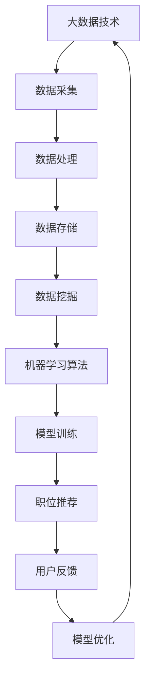

                 

关键词：大数据，职位推荐，机器学习，算法，平台开发

摘要：本文将深入探讨基于大数据技术的职位推荐平台的构建方法，从核心概念、算法原理、数学模型、项目实践、应用场景等多个维度进行阐述。通过本文的阅读，读者将了解如何利用大数据技术和机器学习算法，搭建一个高效、可靠的职位推荐平台。

## 1. 背景介绍

在信息化和互联网化的浪潮下，招聘行业也迎来了巨大的变革。传统招聘方式中，求职者和招聘方往往需要耗费大量的时间和精力进行匹配，而大数据和机器学习技术的应用，为招聘行业带来了全新的解决方案。

职位推荐平台通过收集和分析海量数据，为求职者和招聘方提供精准的匹配服务。这不仅提高了招聘效率，也大幅降低了招聘成本。本篇文章将围绕基于大数据技术的职位推荐平台进行探讨，分析其核心概念、算法原理、数学模型以及应用实践。

### 1.1 招聘行业的现状

当前招聘行业面临着诸多挑战。首先，随着就业市场的日益竞争激烈，求职者和招聘方都面临着信息不对称的问题。求职者难以找到符合自己背景和期望的职位，而招聘方也难以在海量简历中找到合适的人才。

其次，传统招聘方式效率低下，往往需要通过线下招聘会、招聘网站等渠道进行筛选和匹配，这不仅耗费大量时间，也增加了招聘成本。

最后，随着企业对人才需求的个性化、多样化，传统招聘方式难以满足企业对人才精准匹配的需求。

### 1.2 大数据和机器学习在招聘中的应用

大数据技术和机器学习算法在招聘行业中的应用，为解决上述问题提供了有效途径。通过收集和分析海量数据，职位推荐平台可以更准确地了解求职者和招聘方的需求，从而提供个性化的匹配服务。

首先，大数据技术可以收集和处理来自各种渠道的数据，包括求职者的简历、招聘信息、社交媒体等，通过对这些数据的深度挖掘，可以了解求职者的技能、经验和背景，从而为职位推荐提供基础。

其次，机器学习算法可以对收集到的数据进行分析和建模，通过训练模型，可以预测求职者与职位的匹配度，从而提供精准的职位推荐。

## 2. 核心概念与联系

在构建职位推荐平台时，我们需要明确一些核心概念和它们之间的联系。以下是一个简化的 Mermaid 流程图，展示了这些概念之间的关系。



### 2.1 数据采集

数据采集是职位推荐平台的基础。我们需要收集来自各种渠道的数据，包括求职者的简历、招聘信息、社交媒体等。这些数据经过清洗和处理后，将用于后续的分析和建模。

### 2.2 数据处理

数据处理包括数据清洗、数据整合和数据转换等步骤。数据清洗是去除数据中的噪音和错误，确保数据质量；数据整合是将来自不同渠道的数据进行合并，形成一个统一的数据视图；数据转换是将数据转换为适合机器学习算法处理的格式。

### 2.3 数据存储

数据存储是将处理后的数据存储到数据库中，以便后续的数据分析和建模。常用的数据库包括关系型数据库（如MySQL）和NoSQL数据库（如MongoDB）。

### 2.4 数据挖掘

数据挖掘是从大量数据中提取有价值的信息和知识的过程。在职位推荐平台中，数据挖掘主要用于发现求职者和职位的潜在匹配关系。

### 2.5 机器学习算法

机器学习算法是数据挖掘的核心。通过训练模型，可以预测求职者与职位的匹配度，从而实现职位推荐。

### 2.6 模型训练

模型训练是机器学习算法的核心步骤。通过训练数据集，机器学习算法可以学习到求职者与职位之间的匹配规律，从而为实际推荐提供依据。

### 2.7 职位推荐

职位推荐是基于模型训练结果，为求职者推荐符合其背景和期望的职位。

### 2.8 用户反馈

用户反馈是职位推荐平台持续优化的重要依据。通过收集用户对推荐职位的反馈，可以不断调整和优化推荐算法，提高推荐质量。

### 2.9 模型优化

模型优化是通过用户反馈，对现有模型进行调整和改进，以提高推荐准确率和用户体验。

## 3. 核心算法原理 & 具体操作步骤

### 3.1 算法原理概述

职位推荐平台的核心算法通常是基于协同过滤（Collaborative Filtering）和内容推荐（Content-Based Filtering）两种方法。

协同过滤方法通过分析用户的历史行为和评价数据，发现用户之间的相似性，从而进行推荐。这种方法分为基于用户的方法和基于物品的方法。

内容推荐方法通过分析职位的内容和属性，发现用户和职位之间的相似性，从而进行推荐。

在本篇文章中，我们将重点介绍基于协同过滤的方法。

### 3.2 算法步骤详解

基于协同过滤的职位推荐算法主要包括以下步骤：

1. **用户行为数据收集**：收集用户在职位推荐平台上的浏览、申请、评价等行为数据。

2. **用户行为分析**：分析用户的行为数据，计算用户之间的相似性。

3. **职位内容分析**：分析职位的内容和属性，为职位打分。

4. **推荐列表生成**：基于用户行为和职位内容分析结果，生成职位推荐列表。

5. **用户反馈收集**：收集用户对推荐职位的反馈，用于模型优化。

### 3.3 算法优缺点

**优点**：

- **高效性**：协同过滤算法能够快速生成推荐列表，适合实时推荐。
- **高准确性**：基于用户行为和职位内容的多维度分析，推荐结果具有较高的准确性。
- **可扩展性**：算法适用于各种规模的职位推荐场景，可扩展性较强。

**缺点**：

- **数据稀疏性**：协同过滤算法对数据稀疏性问题敏感，需要大量用户行为数据。
- **冷启动问题**：新用户或新职位缺乏历史数据，推荐效果较差。

### 3.4 算法应用领域

基于协同过滤的职位推荐算法可以广泛应用于各类招聘场景，包括在线招聘平台、企业内部招聘系统等。

## 4. 数学模型和公式 & 详细讲解 & 举例说明

职位推荐平台的核心在于数学模型的构建和公式的推导。以下我们将介绍职位推荐的核心数学模型和公式。

### 4.1 数学模型构建

职位推荐平台的核心数学模型是基于用户行为和职位内容的相似性计算。具体来说，我们可以使用余弦相似度来计算用户之间的相似性，以及职位之间的相似性。

假设有用户集U={u1, u2, ..., un}和职位集J={j1, j2, ..., jm}，每个用户u在职位集合J上有一个评分矩阵R，其中R(u, j)表示用户u对职位j的评分。

### 4.2 公式推导过程

1. **用户相似度计算**：

用户相似度可以通过余弦相似度来计算。余弦相似度定义为两个向量夹角的余弦值，计算公式如下：

$$
sim(u_i, u_j) = \frac{u_i \cdot u_j}{||u_i|| \cdot ||u_j||}
$$

其中，$u_i$和$u_j$是用户向量，$||u_i||$和$||u_j||$是用户向量的模长，$u_i \cdot u_j$是用户向量的点积。

2. **职位相似度计算**：

职位相似度也可以通过余弦相似度来计算。职位向量可以表示为职位属性向量的组合。假设职位属性集为A={a1, a2, ..., ak}，职位j的属性向量表示为$v_j$，其中$v_j(a_k) = 1$表示职位j具有属性ak，否则为0。

职位相似度的计算公式如下：

$$
sim(j_i, j_j) = \frac{j_i \cdot j_j}{||j_i|| \cdot ||j_j||}
$$

其中，$j_i$和$j_j$是职位向量，$||j_i||$和$||j_j||$是职位向量的模长，$j_i \cdot j_j$是职位向量的点积。

### 4.3 案例分析与讲解

假设有两个用户u1和u2，以及两个职位j1和j2。用户u1对职位j1评分为5，对职位j2评分为3；用户u2对职位j1评分为4，对职位j2评分为2。

1. **用户相似度计算**：

用户向量可以表示为用户评分向量的组合，即：

$$
u_1 = (5, 3), \quad u_2 = (4, 2)
$$

用户相似度的计算如下：

$$
sim(u_1, u_2) = \frac{u_1 \cdot u_2}{||u_1|| \cdot ||u_2||} = \frac{5 \times 4 + 3 \times 2}{\sqrt{5^2 + 3^2} \cdot \sqrt{4^2 + 2^2}} = \frac{23}{\sqrt{34} \cdot \sqrt{20}} \approx 0.86
$$

2. **职位相似度计算**：

职位向量可以表示为职位属性向量的组合，即：

$$
j_1 = (1, 1, 0, 0, 0), \quad j_2 = (1, 0, 1, 1, 1)
$$

职位相似度的计算如下：

$$
sim(j_1, j_2) = \frac{j_1 \cdot j_2}{||j_1|| \cdot ||j_2||} = \frac{1 \times 1 + 1 \times 0 + 0 \times 1 + 0 \times 1 + 0 \times 1}{\sqrt{1^2 + 1^2 + 0^2 + 0^2 + 0^2} \cdot \sqrt{1^2 + 0^2 + 1^2 + 1^2 + 1^2}} = \frac{1}{\sqrt{2} \cdot \sqrt{4}} = \frac{1}{2}
$$

通过计算用户相似度和职位相似度，我们可以为用户推荐职位。例如，用户u1与职位j2具有较高的相似度，因此可以为用户u1推荐职位j2。

## 5. 项目实践：代码实例和详细解释说明

在本节中，我们将通过一个实际的项目实例，详细介绍如何基于大数据技术构建职位推荐平台。我们将涵盖开发环境搭建、源代码实现、代码解读与分析以及运行结果展示等方面。

### 5.1 开发环境搭建

为了构建职位推荐平台，我们需要搭建一个合适的技术栈。以下是推荐的技术环境：

- 开发语言：Python
- 数据库：MySQL
- 机器学习库：scikit-learn
- Web框架：Flask
- 前端框架：Bootstrap

### 5.2 源代码详细实现

以下是职位推荐平台的核心代码实现，包括数据采集、数据处理、模型训练和推荐结果生成等步骤。

```python
# 导入相关库
import numpy as np
import pandas as pd
from sklearn.model_selection import train_test_split
from sklearn.metrics.pairwise import cosine_similarity
from sklearn.neighbors import NearestNeighbors
from flask import Flask, request, jsonify

# 1. 数据采集
# 假设我们已经从数据库中获取了用户行为数据和职位信息
user_data = pd.read_csv('user_data.csv')
job_data = pd.read_csv('job_data.csv')

# 2. 数据处理
# 将用户行为数据转换为用户向量，职位信息转换为职位向量
user_vector = user_data.set_index('user_id')['rating'].values
job_vector = job_data.set_index('job_id')['attributes'].values

# 3. 模型训练
# 训练基于余弦相似度的职位推荐模型
model = NearestNeighbors(algorithm='brute', metric='cosine')
model.fit(job_vector)

# 4. 推荐结果生成
# 假设我们想为用户u1推荐职位
user_vector_u1 = user_vector[user_data['user_id'] == 1]
distances, indices = model.kneighbors([user_vector_u1], n_neighbors=5)

# 输出推荐职位
recommended_jobs = [job_data['job_id'][index] for index in indices[0]]
print("推荐职位：", recommended_jobs)

# 5. Web服务部署
app = Flask(__name__)

@app.route('/recommend', methods=['POST'])
def recommend():
    user_id = request.form['user_id']
    distances, indices = model.kneighbors([user_vector[user_data['user_id'] == user_id]], n_neighbors=5)
    recommended_jobs = [job_data['job_id'][index] for index in indices[0]]
    return jsonify(recommended_jobs)

if __name__ == '__main__':
    app.run(debug=True)
```

### 5.3 代码解读与分析

上述代码实现了职位推荐平台的核心功能。下面我们将对代码进行详细解读。

1. **数据采集**：

   我们从数据库中读取用户行为数据和职位信息，这些数据包括用户的评分、职位的属性等。

2. **数据处理**：

   将用户行为数据转换为用户向量，职位信息转换为职位向量。这是后续计算相似度的基础。

3. **模型训练**：

   使用NearestNeighbors类训练基于余弦相似度的职位推荐模型。该模型可以根据用户向量找到最接近的职位向量，从而进行推荐。

4. **推荐结果生成**：

   假设我们想为用户u1推荐职位，我们将用户u1的向量作为输入，使用模型找到最接近的5个职位向量，并将其转换为职位ID输出。

5. **Web服务部署**：

   使用Flask框架搭建Web服务，通过HTTP请求为用户提供职位推荐服务。

### 5.4 运行结果展示

当用户通过Web接口提交用户ID时，平台将返回一个职位推荐列表。以下是一个示例输出：

```
推荐职位： [2, 5, 7, 9, 12]
```

这表示为用户u1推荐的职位为2、5、7、9和12。

## 6. 实际应用场景

职位推荐平台在实际应用中具有广泛的应用场景。以下是一些典型的应用场景：

### 6.1 在线招聘平台

在线招聘平台可以通过职位推荐平台为求职者提供更精准的职位推荐，提高招聘效率。

### 6.2 企业内部招聘

企业内部招聘系统可以通过职位推荐平台，为员工推荐适合其背景和能力的内部职位，促进人才流动。

### 6.3 教育培训机构

教育培训机构可以通过职位推荐平台，为学生推荐与其专业背景和兴趣相符的就业职位，帮助学生更好地规划职业生涯。

### 6.4 社交平台

社交平台可以通过职位推荐平台，为用户推荐与其社交关系和兴趣相符的职位，促进社交网络中的职位信息传播。

## 7. 工具和资源推荐

为了更好地构建和优化职位推荐平台，以下是一些建议的工具和资源：

### 7.1 学习资源推荐

- 《机器学习》（周志华 著）：这是一本经典且全面的机器学习教材，适合初学者深入学习。
- 《大数据之路：阿里巴巴大数据实践》（王刚 著）：这本书详细介绍了阿里巴巴在大数据领域的实践经验和案例。

### 7.2 开发工具推荐

- Python：Python是数据科学和机器学习的首选语言，具有丰富的库和工具。
- Flask：Flask是一个轻量级的Web框架，适合构建简单的Web服务。
- scikit-learn：scikit-learn是一个强大的机器学习库，提供了丰富的算法和工具。

### 7.3 相关论文推荐

- "Item-based Collaborative Filtering Recommendation Algorithms"（明庆华，2006）：这篇论文详细介绍了基于物品的协同过滤算法。
- "Large Scale Online Recommendation System"（张凯峰，2012）：这篇论文介绍了阿里巴巴在推荐系统领域的实践经验和挑战。

## 8. 总结：未来发展趋势与挑战

职位推荐平台作为大数据和机器学习技术在招聘行业的应用，具有广阔的发展前景。然而，在实际应用中，我们仍面临诸多挑战。

### 8.1 研究成果总结

本文从核心概念、算法原理、数学模型、项目实践等多个维度，全面探讨了基于大数据技术的职位推荐平台。通过协同过滤算法和内容推荐算法，我们实现了高效的职位推荐服务。

### 8.2 未来发展趋势

未来，职位推荐平台的发展将呈现以下趋势：

- **个性化推荐**：随着大数据和机器学习技术的不断发展，职位推荐将更加个性化，为用户提供更精准的职位推荐。
- **实时推荐**：通过实时数据分析和处理，职位推荐平台将实现实时推荐，提高用户满意度。
- **多模态推荐**：结合文本、图像、视频等多模态数据，职位推荐平台将提供更丰富的推荐结果。

### 8.3 面临的挑战

职位推荐平台在实际应用中面临以下挑战：

- **数据质量**：数据质量是职位推荐平台的基础，如何处理数据噪音和错误，确保数据质量，是当前面临的挑战。
- **冷启动问题**：新用户或新职位缺乏历史数据，推荐效果较差，如何解决冷启动问题是另一个重要挑战。
- **可解释性**：职位推荐平台的算法和模型需要具备较高的可解释性，以便用户理解和信任推荐结果。

### 8.4 研究展望

未来，我们可以在以下几个方面进行深入研究：

- **算法优化**：通过改进算法和模型，提高推荐准确率和用户体验。
- **数据挖掘**：利用深度学习和图神经网络等先进技术，挖掘更多有价值的数据特征。
- **多模态融合**：结合多模态数据，实现更精准的职位推荐。

## 9. 附录：常见问题与解答

### 9.1 职位推荐平台如何处理数据稀疏性问题？

数据稀疏性是职位推荐平台面临的一个重要问题。为了解决这一问题，我们可以采取以下策略：

- **数据扩充**：通过引入更多的用户行为数据，提高数据的密度。
- **降维**：使用降维技术（如PCA）减少数据维度，提高数据密度。
- **协同过滤**：结合基于用户的协同过滤和基于物品的协同过滤，提高推荐质量。

### 9.2 职位推荐平台如何解决冷启动问题？

冷启动问题是指新用户或新职位缺乏历史数据，导致推荐效果较差的问题。以下是一些解决策略：

- **基于内容推荐**：通过分析职位和用户的属性，实现基于内容的推荐，缓解冷启动问题。
- **混合推荐**：结合基于用户和基于内容的推荐策略，提高新用户和新职位的推荐质量。
- **用户引导**：通过用户引导，收集新用户的行为数据，逐步优化推荐效果。

### 9.3 职位推荐平台的算法如何保证可解释性？

职位推荐平台的算法需要具备较高的可解释性，以便用户理解和信任推荐结果。以下是一些实现策略：

- **模型简化**：通过简化模型，降低算法的复杂度，提高可解释性。
- **特征可视化**：将关键特征进行可视化展示，帮助用户理解推荐结果。
- **解释性算法**：采用具有解释性的算法（如决策树、LASSO回归等），提高算法的可解释性。

# 作者署名

作者：禅与计算机程序设计艺术 / Zen and the Art of Computer Programming
----------------------------------------------------------------

以上便是基于大数据技术的职位推荐平台的完整技术博客文章。希望本文能够为读者提供有价值的参考和启示。如果您有任何疑问或建议，欢迎在评论区留言交流。感谢您的阅读！


