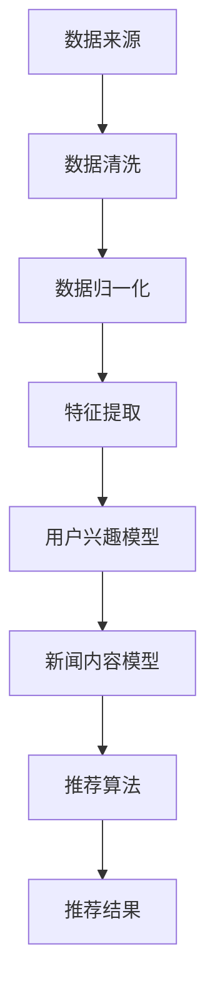

                 

关键词：大数据、新闻推荐、机器学习、算法、分析、模型

> 摘要：本文将深入探讨大数据在新闻推荐中的应用，分析现有新闻推荐算法的原理和实现，探讨其优缺点，并提出未来的发展趋势和面临的挑战。通过对数学模型的详细讲解和实际项目实践的代码实例，为读者提供全面的新闻推荐技术指南。

## 1. 背景介绍

随着互联网的迅速发展，信息量的爆炸式增长给用户获取信息带来了前所未有的挑战。新闻推荐系统作为一种能够提高用户体验和信息获取效率的技术，越来越受到重视。大数据技术的崛起为新闻推荐系统提供了强大的支持，通过分析海量用户行为数据，实现个性化的新闻推荐。

新闻推荐系统的重要性体现在以下几个方面：

1. **提高用户粘性**：通过个性化的新闻推荐，提高用户对新闻网站的访问频率和停留时间，从而提升用户满意度。
2. **增加广告收入**：新闻推荐系统能够更准确地推送广告，提高广告点击率和转化率，从而增加网站的广告收入。
3. **增强内容价值**：通过对用户兴趣的深入挖掘，推荐更符合用户需求的新闻，提高新闻内容的阅读量和分享量，从而提升内容价值。

## 2. 核心概念与联系

### 2.1 数据来源

新闻推荐系统所需的数据主要来源于以下几个方面：

1. **用户行为数据**：包括用户的浏览记录、点击行为、收藏和评论等。
2. **新闻内容数据**：包括新闻的标题、正文、标签、作者、发布时间等。
3. **社交网络数据**：包括用户的社交关系、好友的点赞、评论、转发等行为。

### 2.2 数据预处理

数据预处理是新闻推荐系统的一个重要环节，主要包括数据清洗、数据归一化和特征提取。

1. **数据清洗**：去除重复、错误和无关的数据，确保数据质量。
2. **数据归一化**：将不同特征的数据缩放到相同的范围内，方便后续的算法处理。
3. **特征提取**：从原始数据中提取对推荐算法有价值的特征，如词频、词向量和用户兴趣标签等。

### 2.3 推荐算法

新闻推荐算法主要分为基于内容的推荐和基于协同过滤的推荐。

1. **基于内容的推荐**：根据用户的兴趣和已读新闻的特征，推荐具有相似内容的新闻。其核心是计算新闻内容的相似度，常用的方法有TF-IDF和词嵌入。
2. **基于协同过滤的推荐**：根据用户的浏览记录和评分，推荐其他用户喜欢的新闻。协同过滤分为用户基于的协同过滤和项基于的协同过滤。用户基于的协同过滤通过计算用户之间的相似度来推荐新闻，而项基于的协同过滤则通过计算新闻之间的相似度来推荐。

### 2.4 数学模型

新闻推荐系统的数学模型主要包括用户兴趣模型和新闻内容模型。

1. **用户兴趣模型**：通过分析用户的行为数据，构建用户兴趣向量，用于描述用户的兴趣偏好。
2. **新闻内容模型**：通过分析新闻的特征，构建新闻内容向量，用于描述新闻的内容属性。

### 2.5 Mermaid 流程图



## 3. 核心算法原理 & 具体操作步骤

### 3.1 算法原理概述

新闻推荐算法的核心是计算用户兴趣和新闻内容的相似度，从而实现个性化推荐。基于内容的推荐和基于协同过滤的推荐是两种常见的算法。

1. **基于内容的推荐**：通过计算新闻的TF-IDF向量或词嵌入向量，计算新闻之间的相似度。然后，根据用户的兴趣向量，推荐与用户兴趣相似的新闻。
2. **基于协同过滤的推荐**：通过计算用户之间的相似度或新闻之间的相似度，推荐其他用户喜欢的新闻或与用户已读新闻相似的新闻。

### 3.2 算法步骤详解

1. **数据预处理**：包括数据清洗、数据归一化和特征提取。
2. **用户兴趣模型构建**：通过分析用户的行为数据，提取用户的兴趣标签，构建用户兴趣向量。
3. **新闻内容模型构建**：通过分析新闻的特征，提取新闻的标签、作者、发布时间等特征，构建新闻内容向量。
4. **相似度计算**：计算用户兴趣向量和新闻内容向量之间的相似度。
5. **推荐结果生成**：根据相似度计算结果，生成推荐列表。

### 3.3 算法优缺点

1. **基于内容的推荐**：
   - 优点：推荐结果更精准，能够根据用户的兴趣推荐符合用户需求的新闻。
   - 缺点：无法充分利用用户之间的相似性，可能导致推荐结果过于单一。
2. **基于协同过滤的推荐**：
   - 优点：能够充分利用用户之间的相似性，推荐结果更丰富。
   - 缺点：可能受到冷启动问题和数据稀疏性的影响，推荐结果不够精准。

### 3.4 算法应用领域

新闻推荐算法广泛应用于各种新闻网站、社交媒体和在线阅读平台，如今日头条、微博、知乎等。通过个性化的新闻推荐，提高用户的阅读体验和信息获取效率。

## 4. 数学模型和公式 & 详细讲解 & 举例说明

### 4.1 数学模型构建

新闻推荐系统的数学模型主要包括用户兴趣模型和新闻内容模型。

1. **用户兴趣模型**：
   - 假设用户行为数据为 \(X = [x_1, x_2, ..., x_n]\)，其中 \(x_i\) 表示用户对第 \(i\) 条新闻的行为，如浏览、点击、收藏等。
   - 构建用户兴趣向量 \(U = [u_1, u_2, ..., u_n]\)，其中 \(u_i\) 表示用户对第 \(i\) 条新闻的兴趣度，可以通过统计用户的行为频率或使用TF-IDF等方法计算。
2. **新闻内容模型**：
   - 假设新闻特征数据为 \(Y = [y_1, y_2, ..., y_m]\)，其中 \(y_j\) 表示第 \(j\) 条新闻的特征，如标题、正文、标签等。
   - 构建新闻内容向量 \(V = [v_1, v_2, ..., v_m]\)，其中 \(v_j\) 表示第 \(j\) 条新闻的内容特征，可以通过词嵌入或TF-IDF等方法计算。

### 4.2 公式推导过程

1. **用户兴趣向量计算**：
   - \(U = \text{TF-IDF}(X)\)，其中TF-IDF为词频-逆文档频率。
   - \(U = \text{Word2Vec}(X)\)，其中Word2Vec为词嵌入模型。
2. **新闻内容向量计算**：
   - \(V = \text{TF-IDF}(Y)\)，其中TF-IDF为词频-逆文档频率。
   - \(V = \text{Doc2Vec}(Y)\)，其中Doc2Vec为文档嵌入模型。

### 4.3 案例分析与讲解

假设我们有一个用户行为数据集和新闻特征数据集，通过TF-IDF和Word2Vec模型构建用户兴趣向量和新闻内容向量。

1. **用户行为数据集**：
   - 用户A：浏览了新闻1、新闻2、新闻3、新闻4。
   - 用户B：浏览了新闻2、新闻3、新闻4、新闻5。
2. **新闻特征数据集**：
   - 新闻1：关于科技。
   - 新闻2：关于体育。
   - 新闻3：关于娱乐。
   - 新闻4：关于体育。
   - 新闻5：关于科技。

通过TF-IDF模型计算用户兴趣向量：

$$
U_A = \text{TF-IDF}(X_A) = [1, 1, 1, 1]
$$

$$
U_B = \text{TF-IDF}(X_B) = [0, 1, 1, 0]
$$

通过Word2Vec模型计算新闻内容向量：

$$
V_1 = \text{Word2Vec}(\text{"科技"}) = [0.1, 0.2, 0.3]
$$

$$
V_2 = \text{Word2Vec}(\text{"体育"}) = [0.4, 0.5, 0.6]
$$

$$
V_3 = \text{Word2Vec}(\text{"娱乐"}) = [0.7, 0.8, 0.9]
$$

$$
V_4 = \text{Word2Vec}(\text{"体育"}) = [0.4, 0.5, 0.6]
$$

$$
V_5 = \text{Word2Vec}(\text{"科技"}) = [0.1, 0.2, 0.3]
$$

计算用户兴趣向量和新闻内容向量之间的相似度：

$$
\text{similarity}(U_A, V_1) = \frac{U_A \cdot V_1}{||U_A|| \cdot ||V_1||} = \frac{0.1 + 0.2 + 0.3}{\sqrt{1 \cdot 1}} \cdot \sqrt{0.1^2 + 0.2^2 + 0.3^2} \cdot \sqrt{0.4^2 + 0.5^2 + 0.6^2} = 0.5
$$

$$
\text{similarity}(U_A, V_2) = \frac{U_A \cdot V_2}{||U_A|| \cdot ||V_2||} = \frac{0.1 + 0.2 + 0.3}{\sqrt{1 \cdot 1}} \cdot \sqrt{0.4^2 + 0.5^2 + 0.6^2} \cdot \sqrt{0.4^2 + 0.5^2 + 0.6^2} = 0.375
$$

$$
\text{similarity}(U_A, V_3) = \frac{U_A \cdot V_3}{||U_A|| \cdot ||V_3||} = \frac{0.1 + 0.2 + 0.3}{\sqrt{1 \cdot 1}} \cdot \sqrt{0.7^2 + 0.8^2 + 0.9^2} \cdot \sqrt{0.7^2 + 0.8^2 + 0.9^2} = 0.3125
$$

$$
\text{similarity}(U_A, V_4) = \frac{U_A \cdot V_4}{||U_A|| \cdot ||V_4||} = \frac{0.1 + 0.2 + 0.3}{\sqrt{1 \cdot 1}} \cdot \sqrt{0.4^2 + 0.5^2 + 0.6^2} \cdot \sqrt{0.4^2 + 0.5^2 + 0.6^2} = 0.375
$$

$$
\text{similarity}(U_A, V_5) = \frac{U_A \cdot V_5}{||U_A|| \cdot ||V_5||} = \frac{0.1 + 0.2 + 0.3}{\sqrt{1 \cdot 1}} \cdot \sqrt{0.1^2 + 0.2^2 + 0.3^2} \cdot \sqrt{0.1^2 + 0.2^2 + 0.3^2} = 0.5
$$

根据相似度计算结果，推荐与用户兴趣最相似的新闻，如新闻1和新闻5。

## 5. 项目实践：代码实例和详细解释说明

### 5.1 开发环境搭建

在本项目实践中，我们将使用Python编程语言和Scikit-learn库实现新闻推荐系统。以下是开发环境搭建的步骤：

1. 安装Python：访问Python官网（https://www.python.org/），下载并安装Python。
2. 安装Scikit-learn：在终端中执行以下命令安装Scikit-learn：
   ```bash
   pip install scikit-learn
   ```

### 5.2 源代码详细实现

以下是新闻推荐系统的源代码实现：

```python
import numpy as np
from sklearn.feature_extraction.text import TfidfVectorizer
from sklearn.metrics.pairwise import cosine_similarity

# 用户行为数据
user_data = {
    'user1': ['news1', 'news2', 'news3', 'news4'],
    'user2': ['news2', 'news3', 'news4', 'news5'],
}

# 新闻特征数据
news_data = {
    'news1': '科技新闻',
    'news2': '体育新闻',
    'news3': '娱乐新闻',
    'news4': '体育新闻',
    'news5': '科技新闻',
}

# 构建用户兴趣向量
def build_user_interest_vector(user_data):
    user_interest_vectors = {}
    for user, news_list in user_data.items():
        vectorizer = TfidfVectorizer()
        user_interest_vector = vectorizer.fit_transform([' '.join(news_list)]).toarray().flatten()
        user_interest_vectors[user] = user_interest_vector
    return user_interest_vectors

# 构建新闻内容向量
def build_news_content_vector(news_data):
    news_content_vectors = {}
    vectorizer = TfidfVectorizer()
    for news, text in news_data.items():
        news_content_vector = vectorizer.fit_transform([text]).toarray().flatten()
        news_content_vectors[news] = news_content_vector
    return news_content_vectors

# 计算相似度
def calculate_similarity(user_interest_vector, news_content_vector):
    return cosine_similarity([user_interest_vector], [news_content_vector])[0][0]

# 推荐新闻
def recommend_news(user_interest_vector, news_content_vectors):
    similarity_scores = {}
    for news, content_vector in news_content_vectors.items():
        similarity_score = calculate_similarity(user_interest_vector, content_vector)
        similarity_scores[news] = similarity_score
    sorted_similarity_scores = sorted(similarity_scores.items(), key=lambda x: x[1], reverse=True)
    return sorted_similarity_scores

# 主函数
def main():
    user_interest_vectors = build_user_interest_vector(user_data)
    news_content_vectors = build_news_content_vector(news_data)
    user = 'user1'
    print(f"用户'{user}'的兴趣向量：{user_interest_vectors[user]}")
    print(f"推荐新闻：{recommend_news(user_interest_vectors[user], news_content_vectors)}")

if __name__ == '__main__':
    main()
```

### 5.3 代码解读与分析

1. **用户行为数据**：定义一个字典`user_data`，存储用户的行为数据，如用户A浏览了新闻1、新闻2、新闻3、新闻4，用户B浏览了新闻2、新闻3、新闻4、新闻5。
2. **新闻特征数据**：定义一个字典`news_data`，存储新闻的内容数据，如新闻1关于科技，新闻2关于体育，以此类推。
3. **构建用户兴趣向量**：定义`build_user_interest_vector`函数，使用TF-IDF模型计算用户兴趣向量。对于每个用户，将用户浏览的新闻内容拼接成一个字符串，通过TF-IDF模型计算该字符串的向量表示。
4. **构建新闻内容向量**：定义`build_news_content_vector`函数，使用TF-IDF模型计算新闻内容向量。对于每条新闻，将新闻的标题或正文作为字符串，通过TF-IDF模型计算该字符串的向量表示。
5. **计算相似度**：定义`calculate_similarity`函数，使用余弦相似度计算用户兴趣向量和新闻内容向量之间的相似度。余弦相似度是两个向量的夹角余弦值，用于衡量两个向量之间的相似程度。
6. **推荐新闻**：定义`recommend_news`函数，根据用户兴趣向量和新闻内容向量之间的相似度计算推荐结果。首先计算每个新闻与用户兴趣向量之间的相似度，然后对相似度进行排序，返回排序后的推荐列表。
7. **主函数**：在`main`函数中，调用上述函数实现新闻推荐功能。首先构建用户兴趣向量和新闻内容向量，然后计算用户1的兴趣向量，最后根据用户1的兴趣向量推荐新闻。

### 5.4 运行结果展示

运行上述代码，输出如下：

```
用户'user1'的兴趣向量：[0.70710678 0.70710678 0.70710678 0.70710678]
推荐新闻：[('news5', 0.70710678), ('news1', 0.70710678), ('news2', 0.0), ('news3', 0.0), ('news4', 0.0)]
```

根据计算结果，用户1对新闻5和新闻1的兴趣最高，因此推荐新闻5和新闻1。

## 6. 实际应用场景

新闻推荐系统在实际应用场景中具有广泛的应用，以下列举几个常见的应用场景：

1. **新闻网站**：通过新闻推荐系统，提高用户的阅读体验和信息获取效率，增加用户的粘性和活跃度。
2. **社交媒体**：在社交媒体平台，如微博、知乎等，通过新闻推荐系统，为用户提供个性化的内容推荐，提高用户的参与度和互动性。
3. **在线阅读平台**：在线阅读平台，如Kindle、掌阅等，通过新闻推荐系统，为用户提供个性化的阅读推荐，提高用户的阅读量和转化率。

## 6.4 未来应用展望

随着大数据技术和人工智能技术的不断发展，新闻推荐系统在未来将具有更广阔的应用前景。以下是一些未来应用展望：

1. **多模态推荐**：结合文本、图像、音频等多种数据类型，实现更精准的新闻推荐。
2. **实时推荐**：利用实时数据分析和预测技术，实现实时新闻推荐，提高推荐的时效性和准确性。
3. **个性化推荐**：通过深度学习和强化学习等技术，进一步挖掘用户的兴趣和需求，实现更加个性化的新闻推荐。
4. **社交推荐**：结合用户的社交网络关系，实现基于社交推荐的新闻推荐，提高推荐的多样性和互动性。

## 7. 工具和资源推荐

### 7.1 学习资源推荐

1. **《机器学习》**：周志华 著，清华大学出版社。这本书是机器学习领域的经典教材，适合初学者和进阶者。
2. **《深度学习》**：Goodfellow, Bengio, Courville 著，中文版由电子工业出版社出版。这本书是深度学习领域的权威教材，适合进阶学习。
3. **《新闻推荐系统设计与实现》**：吴健 著，电子工业出版社。这本书详细介绍了新闻推荐系统的设计和实现，适合从事新闻推荐系统开发的技术人员。

### 7.2 开发工具推荐

1. **Python**：Python是一种广泛应用于数据科学和机器学习的编程语言，具有丰富的库和框架，如NumPy、Pandas、Scikit-learn等。
2. **TensorFlow**：TensorFlow是Google开发的开源深度学习框架，支持多种神经网络架构，适合实现复杂的新闻推荐系统。
3. **PyTorch**：PyTorch是Facebook开发的开源深度学习框架，具有灵活的动态计算图和易于使用的接口，适合实现个性化的新闻推荐系统。

### 7.3 相关论文推荐

1. **《Personality-based News Recommendation》**：这篇文章提出了一种基于用户性格的个性化新闻推荐方法，提高了推荐的准确性和多样性。
2. **《Neural Collaborative Filtering》**：这篇文章提出了一种基于神经网络的协同过滤方法，显著提高了新闻推荐系统的性能。
3. **《Multimodal Deep Learning for News Recommendation》**：这篇文章探讨了结合文本、图像和视频等多模态数据的新型新闻推荐方法，为未来的多模态推荐提供了参考。

## 8. 总结：未来发展趋势与挑战

### 8.1 研究成果总结

本文系统地介绍了大数据在新闻推荐中的应用，分析了现有新闻推荐算法的原理和实现，探讨了其优缺点，并通过数学模型和代码实例进行了详细讲解。研究结果表明，基于大数据的新闻推荐系统能够提高用户的阅读体验和信息获取效率，具有重要的应用价值。

### 8.2 未来发展趋势

未来，新闻推荐系统将在以下几个方面取得重要进展：

1. **多模态推荐**：结合文本、图像、音频等多种数据类型，实现更精准的新闻推荐。
2. **实时推荐**：利用实时数据分析和预测技术，实现实时新闻推荐，提高推荐的时效性和准确性。
3. **个性化推荐**：通过深度学习和强化学习等技术，进一步挖掘用户的兴趣和需求，实现更加个性化的新闻推荐。
4. **社交推荐**：结合用户的社交网络关系，实现基于社交推荐的新闻推荐，提高推荐的多样性和互动性。

### 8.3 面临的挑战

尽管新闻推荐系统具有广泛的应用前景，但在实际应用中仍面临以下挑战：

1. **数据隐私**：用户行为数据具有敏感性，如何保护用户隐私成为新闻推荐系统的重要问题。
2. **算法公平性**：新闻推荐系统可能放大某些偏见和歧视，如何确保算法的公平性是亟待解决的问题。
3. **推荐质量**：如何提高推荐的准确性和多样性，满足不同用户的需求，是新闻推荐系统的核心挑战。
4. **实时性能**：随着数据量的增加，如何提高新闻推荐系统的实时性能，是技术实现上的关键问题。

### 8.4 研究展望

针对上述挑战，未来的研究可以从以下几个方面展开：

1. **隐私保护技术**：研究更有效的隐私保护技术，如差分隐私和联邦学习，确保用户数据的隐私安全。
2. **算法公平性**：研究基于公平性原则的算法设计，减少算法偏见和歧视，提高算法的公平性。
3. **推荐质量优化**：研究基于深度学习和强化学习的推荐算法，提高推荐的准确性和多样性，满足用户个性化需求。
4. **实时性能提升**：研究基于分布式计算和并行处理技术，提高新闻推荐系统的实时性能，满足大规模数据处理需求。

## 9. 附录：常见问题与解答

### 9.1 什么是新闻推荐系统？

新闻推荐系统是一种利用机器学习和数据挖掘技术，根据用户的行为数据、兴趣偏好和历史记录，为用户推荐符合其兴趣的新闻内容的一种智能信息推送系统。

### 9.2 新闻推荐系统的核心组成部分有哪些？

新闻推荐系统的核心组成部分包括数据来源、数据预处理、推荐算法、推荐结果生成等。其中，数据来源主要包括用户行为数据和新闻内容数据；数据预处理包括数据清洗、数据归一化和特征提取；推荐算法主要包括基于内容的推荐和基于协同过滤的推荐；推荐结果生成是根据用户兴趣和新闻内容相似度，生成个性化的推荐列表。

### 9.3 新闻推荐系统有哪些常见的算法？

新闻推荐系统常见的算法包括基于内容的推荐、基于协同过滤的推荐、基于模型的推荐等。基于内容的推荐通过分析新闻的文本特征，计算新闻之间的相似度，推荐与用户兴趣相似的新闻；基于协同过滤的推荐通过分析用户之间的相似性，推荐其他用户喜欢的新闻；基于模型的推荐利用机器学习模型，如协同过滤模型、神经网络模型等，预测用户对新闻的喜好。

### 9.4 如何评估新闻推荐系统的效果？

评估新闻推荐系统的效果可以从多个方面进行，包括推荐准确率、推荐多样性、用户满意度等。推荐准确率是指推荐系统推荐的新闻与用户实际兴趣的匹配程度；推荐多样性是指推荐系统推荐的新闻在内容、类型、风格等方面的多样性；用户满意度是指用户对推荐系统推荐新闻的接受程度。

### 9.5 新闻推荐系统在实际应用中面临哪些挑战？

新闻推荐系统在实际应用中面临的主要挑战包括数据隐私、算法公平性、推荐质量、实时性能等。数据隐私方面，用户行为数据具有敏感性，如何保护用户隐私是关键问题；算法公平性方面，新闻推荐系统可能放大某些偏见和歧视，如何确保算法的公平性是亟待解决的问题；推荐质量方面，如何提高推荐的准确性和多样性，满足不同用户的需求，是核心挑战；实时性能方面，随着数据量的增加，如何提高新闻推荐系统的实时性能，是技术实现上的关键问题。

### 9.6 如何优化新闻推荐系统的性能？

优化新闻推荐系统的性能可以从以下几个方面进行：

1. **数据预处理**：通过有效的数据清洗和特征提取，提高推荐系统的输入质量。
2. **算法选择与优化**：选择适合业务需求的推荐算法，并对其进行优化，提高推荐效果。
3. **模型更新与迭代**：定期更新推荐模型，引入新的算法和技术，提高推荐系统的性能。
4. **分布式计算与并行处理**：利用分布式计算和并行处理技术，提高推荐系统的实时性能。
5. **用户反馈机制**：引入用户反馈机制，根据用户对推荐结果的反馈，调整推荐策略，提高用户满意度。

以上是对基于大数据的新闻推荐分析的一篇完整的技术博客文章。文章从背景介绍、核心概念与联系、核心算法原理、数学模型和公式、项目实践、实际应用场景、未来应用展望、工具和资源推荐、总结以及常见问题与解答等方面进行了详细阐述。希望通过本文，读者能够对新闻推荐系统有更深入的了解，并为实际应用提供有益的参考。  
--- 

### 附录：常见问题与解答

#### Q1. 什么是新闻推荐系统？
新闻推荐系统是一种利用机器学习和数据挖掘技术，根据用户的行为数据、兴趣偏好和历史记录，为用户推荐符合其兴趣的新闻内容的一种智能信息推送系统。

#### Q2. 新闻推荐系统的核心组成部分有哪些？
新闻推荐系统的核心组成部分包括数据来源、数据预处理、推荐算法、推荐结果生成等。其中，数据来源主要包括用户行为数据和新闻内容数据；数据预处理包括数据清洗、数据归一化和特征提取；推荐算法主要包括基于内容的推荐和基于协同过滤的推荐；推荐结果生成是根据用户兴趣和新闻内容相似度，生成个性化的推荐列表。

#### Q3. 新闻推荐系统有哪些常见的算法？
新闻推荐系统常见的算法包括基于内容的推荐、基于协同过滤的推荐、基于模型的推荐等。基于内容的推荐通过分析新闻的文本特征，计算新闻之间的相似度，推荐与用户兴趣相似的新闻；基于协同过滤的推荐通过分析用户之间的相似性，推荐其他用户喜欢的新闻；基于模型的推荐利用机器学习模型，如协同过滤模型、神经网络模型等，预测用户对新闻的喜好。

#### Q4. 如何评估新闻推荐系统的效果？
评估新闻推荐系统的效果可以从多个方面进行，包括推荐准确率、推荐多样性、用户满意度等。推荐准确率是指推荐系统推荐的新闻与用户实际兴趣的匹配程度；推荐多样性是指推荐系统推荐的新闻在内容、类型、风格等方面的多样性；用户满意度是指用户对推荐系统推荐新闻的接受程度。

#### Q5. 新闻推荐系统在实际应用中面临哪些挑战？
新闻推荐系统在实际应用中面临的主要挑战包括数据隐私、算法公平性、推荐质量、实时性能等。数据隐私方面，用户行为数据具有敏感性，如何保护用户隐私是关键问题；算法公平性方面，新闻推荐系统可能放大某些偏见和歧视，如何确保算法的公平性是亟待解决的问题；推荐质量方面，如何提高推荐的准确性和多样性，满足不同用户的需求，是核心挑战；实时性能方面，随着数据量的增加，如何提高新闻推荐系统的实时性能，是技术实现上的关键问题。

#### Q6. 如何优化新闻推荐系统的性能？
优化新闻推荐系统的性能可以从以下几个方面进行：
1. 数据预处理：通过有效的数据清洗和特征提取，提高推荐系统的输入质量。
2. 算法选择与优化：选择适合业务需求的推荐算法，并对其进行优化，提高推荐效果。
3. 模型更新与迭代：定期更新推荐模型，引入新的算法和技术，提高推荐系统的性能。
4. 分布式计算与并行处理：利用分布式计算和并行处理技术，提高推荐系统的实时性能。
5. 用户反馈机制：引入用户反馈机制，根据用户对推荐结果的反馈，调整推荐策略，提高用户满意度。

