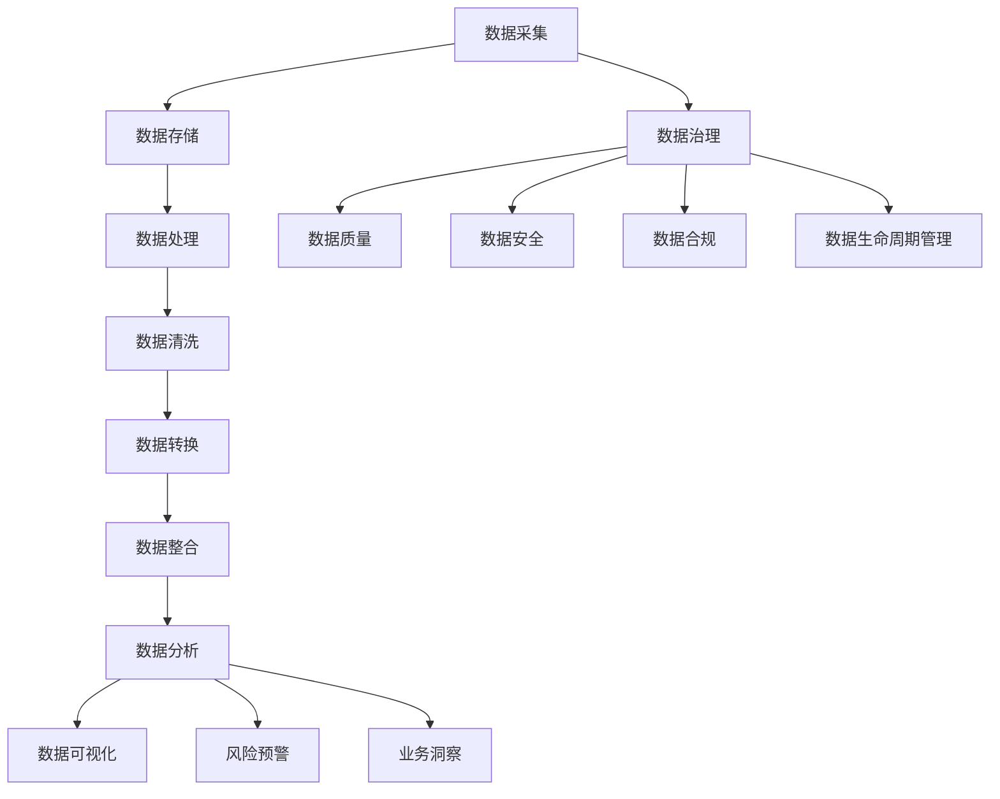

                 

### 1. 背景介绍

在信息化和大数据时代，政企客户的业务分析需求日益增长，如何高效地分析和处理大量的业务数据，从而提供精准的业务洞察和决策支持，成为当前信息化建设中的一项重要任务。某省政府部门在推动数字政府建设过程中，面临着大量政企客户的数据收集、存储、分析和利用的挑战。为了提高业务决策的效率，降低运营成本，该省政府决定开发一套基于大数据的政企客户业务分析系统。

该系统的目标是为政府部门提供全面、实时、精确的业务数据分析服务，包括客户行为分析、市场趋势预测、风险预警等。通过对海量数据的深度挖掘和分析，系统能够为政府决策者提供科学、客观的决策依据，助力政府优化公共服务，提高政务服务水平，推动经济发展。

开发这套系统的主要动机在于：

1. **满足政府决策需求**：政府需要实时了解政企客户的需求和行为，以便制定更有效的政策措施。
2. **提升运营效率**：通过对业务数据的分析和优化，可以降低运营成本，提高资源利用效率。
3. **强化风险控制**：通过风险预警机制，提前识别潜在风险，采取措施防范，保障政府业务的稳健运行。
4. **推动经济转型**：利用大数据技术，政府可以更精准地引导和支持企业发展，促进产业结构优化和升级。

### 2. 核心概念与联系

#### 2.1 大数据分析

大数据分析是指从海量数据中通过计算、处理和分析，提取有价值的信息和知识的过程。它涉及到数据的采集、存储、清洗、处理、分析、可视化等多个环节。大数据分析的核心在于“4V”特性，即：

- **Volume（大量）**：数据规模巨大，动辄PB甚至EB级别。
- **Velocity（高速）**：数据处理速度极快，要求实时或近实时分析。
- **Variety（多样）**：数据来源广泛，类型丰富，包括结构化数据、非结构化数据和半结构化数据。
- **Veracity（真实性）**：数据真实性和准确性，确保分析结果的可靠性。

#### 2.2 业务分析系统

业务分析系统是一种用于收集、存储、处理和分析业务数据的软件系统。它通常包括以下几个关键组成部分：

- **数据采集**：通过接口、日志、API等方式收集业务数据。
- **数据存储**：使用数据库、数据仓库等技术存储和管理数据。
- **数据处理**：对数据进行清洗、转换和整合，使其适合分析和查询。
- **数据分析**：运用统计学、机器学习等技术对数据进行深入分析。
- **数据可视化**：通过图表、报表等方式直观展示分析结果。

#### 2.3 数据治理

数据治理是指通过制定策略、流程和标准，确保数据的完整性、准确性、一致性和安全性。它是大数据分析系统成功的关键因素之一。数据治理包括以下几个方面：

- **数据质量管理**：确保数据质量符合预期标准，包括准确性、完整性、一致性、时效性和唯一性。
- **数据安全**：通过加密、访问控制等技术保障数据安全。
- **数据合规**：遵守相关法律法规和行业标准，确保数据的合法使用。
- **数据生命周期管理**：对数据进行全生命周期管理，包括数据创建、存储、使用、归档和销毁。

#### 2.4 Mermaid 流程图

以下是使用Mermaid绘制的政企客户业务分析系统的流程图：



### 3. 核心算法原理 & 具体操作步骤

#### 3.1 算法原理概述

在政企客户业务分析系统中，核心算法主要包括以下几种：

- **聚类算法**：用于将相似数据分组，以便进行进一步分析。
- **分类算法**：用于将数据分为不同的类别，以预测新数据的类别。
- **关联规则挖掘算法**：用于发现数据之间的关联性，揭示潜在的规律。
- **时间序列分析算法**：用于分析时间序列数据，预测未来的趋势。

#### 3.2 算法步骤详解

##### 3.2.1 聚类算法

1. **选择聚类算法**：根据业务需求选择合适的聚类算法，如K-means、DBSCAN等。
2. **初始化聚类中心**：随机选择或使用特定方法初始化聚类中心。
3. **计算相似度**：计算每个数据点与聚类中心的相似度。
4. **分配数据点**：将每个数据点分配到与其最相似的聚类中心。
5. **更新聚类中心**：计算每个聚类的中心点。
6. **迭代优化**：重复步骤3-5，直到聚类中心不再变化或达到预设的迭代次数。

##### 3.2.2 分类算法

1. **选择分类算法**：根据业务需求选择合适的分类算法，如决策树、支持向量机等。
2. **训练模型**：使用已标记的数据集训练模型。
3. **特征选择**：选择对分类最有影响力的特征。
4. **模型评估**：使用验证集评估模型性能，调整模型参数。
5. **分类预测**：使用训练好的模型对新数据进行分类预测。

##### 3.2.3 关联规则挖掘算法

1. **选择关联规则挖掘算法**：如Apriori、Eclat等。
2. **设置最小支持度和最小置信度**：确定规则的重要程度。
3. **生成频繁项集**：找到支持度大于最小支持度的项集。
4. **生成关联规则**：从频繁项集中生成关联规则。
5. **评估规则**：根据最小置信度筛选有效的关联规则。

##### 3.2.4 时间序列分析算法

1. **选择时间序列分析算法**：如ARIMA、LSTM等。
2. **数据预处理**：对时间序列数据进行清洗、平滑等预处理。
3. **模型选择**：根据时间序列特性选择合适的模型。
4. **参数调优**：使用网格搜索等策略优化模型参数。
5. **模型训练**：使用历史数据训练模型。
6. **预测**：使用训练好的模型预测未来值。

#### 3.3 算法优缺点

- **聚类算法**：
  - **优点**：无需事先标记数据，可以自动发现数据中的模式和结构。
  - **缺点**：聚类结果受初始聚类中心影响较大，可能陷入局部最优。

- **分类算法**：
  - **优点**：可以预测新数据的类别，提供明确的分类结果。
  - **缺点**：需要大量的标记数据进行训练，且对于非线性数据的分类效果较差。

- **关联规则挖掘算法**：
  - **优点**：可以自动发现数据之间的关联性，揭示潜在的规律。
  - **缺点**：对于大规模数据集计算复杂度高，且关联规则的解释性较弱。

- **时间序列分析算法**：
  - **优点**：可以有效地预测未来的趋势和变化。
  - **缺点**：对于非平稳时间序列数据建模效果较差，且对季节性数据建模有一定难度。

#### 3.4 算法应用领域

- **聚类算法**：在市场细分、图像识别、社交网络分析等领域有广泛应用。
- **分类算法**：在信用评分、医疗诊断、文本分类等领域有广泛应用。
- **关联规则挖掘算法**：在购物推荐、异常检测、商业智能等领域有广泛应用。
- **时间序列分析算法**：在金融市场预测、库存管理、天气预测等领域有广泛应用。

### 4. 数学模型和公式 & 详细讲解 & 举例说明

#### 4.1 数学模型构建

在政企客户业务分析系统中，常用的数学模型包括聚类模型、分类模型、关联规则挖掘模型和时间序列分析模型。以下是这些模型的基本构建方法：

##### 4.1.1 聚类模型

聚类模型通常基于距离度量来构建。设数据集为\(X = \{x_1, x_2, ..., x_n\}\)，每个数据点表示为\(x_i = (x_{i1}, x_{i2}, ..., x_{id})\)，其中\(d\)为特征维度。常用的距离度量包括欧氏距离、曼哈顿距离和切比雪夫距离。

欧氏距离（\(d_{Euclidean}\)）公式如下：

\[d_{Euclidean}(x_i, x_j) = \sqrt{\sum_{k=1}^{d}(x_{ik} - x_{jk})^2}\]

曼哈顿距离（\(d_{Manhattan}\)）公式如下：

\[d_{Manhattan}(x_i, x_j) = \sum_{k=1}^{d}|x_{ik} - x_{jk}|\]

切比雪夫距离（\(d_{Chebyshev}\)）公式如下：

\[d_{Chebyshev}(x_i, x_j) = \max_{1 \leq k \leq d}|x_{ik} - x_{jk}|\]

##### 4.1.2 分类模型

分类模型通常基于决策树、支持向量机、神经网络等算法构建。以决策树为例，其基本构建过程如下：

1. **选择最优划分标准**：通常使用信息增益、基尼不纯度或熵作为划分标准。
2. **递归划分**：根据最优划分标准将数据集划分为子集。
3. **终止条件**：当满足一定条件（如叶节点数目小于阈值或信息增益小于阈值）时停止划分。

##### 4.1.3 关联规则挖掘模型

关联规则挖掘模型通常基于Apriori算法或Eclat算法构建。以Apriori算法为例，其基本构建过程如下：

1. **生成频繁项集**：使用深度优先搜索方法生成所有可能的项集，并计算其支持度。
2. **剪枝**：根据最小支持度剪枝，去除不满足最小支持度的项集。
3. **生成关联规则**：从频繁项集中生成满足最小置信度的关联规则。

##### 4.1.4 时间序列分析模型

时间序列分析模型通常基于ARIMA、LSTM等算法构建。以ARIMA算法为例，其基本构建过程如下：

1. **差分**：对时间序列进行差分，使其平稳。
2. **自相关分析**：分析差分后的时间序列的自相关函数，确定\(p\)和\(d\)值。
3. **建模**：根据自相关分析结果建立ARIMA模型。
4. **参数估计**：使用最小二乘法、最大似然估计等方法估计模型参数。
5. **预测**：使用估计出的模型参数进行预测。

#### 4.2 公式推导过程

##### 4.2.1 聚类模型

以K-means聚类算法为例，其目标是最小化数据点与聚类中心之间的平方误差：

\[J = \sum_{i=1}^{n}\sum_{k=1}^{K}(x_{ik} - \mu_k)^2\]

其中，\(x_{ik}\)为数据点\(x_i\)与聚类中心\(\mu_k\)之间的距离，\(\mu_k\)为聚类中心。

为了最小化J，我们需要对每个聚类中心\(\mu_k\)进行优化：

\[\mu_k = \frac{1}{n_k}\sum_{i=1}^{n}x_{ik}\]

其中，\(n_k\)为属于聚类\(k\)的数据点数目。

##### 4.2.2 分类模型

以决策树为例，其划分标准通常使用信息增益进行优化：

\[IG(D, A) = Information(D) - \sum_{v \in A} p(v) \cdot Information(D|A=v)\]

其中，\(D\)为数据集，\(A\)为特征，\(v\)为特征的取值，\(p(v)\)为特征取值\(v\)的概率，\(Information(D)\)为数据集的熵，\(Information(D|A=v)\)为条件熵。

为了选择最优特征，我们需要计算所有特征的增益，选择增益最大的特征作为划分标准。

##### 4.2.3 关联规则挖掘模型

以Apriori算法为例，其核心是计算频繁项集的支持度。设\(I = \{i_1, i_2, ..., i_m\}\)为所有项的集合，\(T = \{t_1, t_2, ..., t_n\}\)为事务集合，\(t_j\)为事务，\(itemset(X)\)为项集\(X\)的支持度：

\[support(itemset(X)) = \frac{|T \cap \{t \in T : X \subseteq t\}|}{|T|}\]

其中，\(T \cap \{t \in T : X \subseteq t\}\)为包含项集\(X\)的事务集合。

##### 4.2.4 时间序列分析模型

以ARIMA模型为例，其参数\((p, d, q)\)的估计通常通过自相关分析进行。自相关函数（\(ACF\)）的定义如下：

\[ACF(\lambda) = \frac{\sum_{t=1}^{n}(y_t - \bar{y})(y_{t+\lambda} - \bar{y})}{\sum_{t=1}^{n}(y_t - \bar{y})^2}\]

其中，\(y_t\)为时间序列值，\(\bar{y}\)为均值，\(\lambda\)为滞后阶数。

根据自相关函数的形态，我们可以确定\(p\)和\(q\)的值。\(d\)的值通常通过差分阶数确定，使时间序列平稳。

#### 4.3 案例分析与讲解

##### 4.3.1 聚类分析

假设我们有一组政企客户数据，包括年龄、收入、学历、职业等特征。我们使用K-means聚类算法对这些数据进行聚类，目标是将其分为不同的客户群体。

1. **数据预处理**：对数据进行标准化处理，使其具有相同的尺度。

2. **初始化聚类中心**：随机选择4个聚类中心。

3. **分配数据点**：计算每个数据点与聚类中心的距离，将其分配到最近的聚类中心。

4. **更新聚类中心**：计算每个聚类的中心点。

5. **迭代优化**：重复步骤3-4，直到聚类中心不再变化或达到预设的迭代次数。

最终，我们将客户分为4个群体，每个群体具有不同的特征分布，这有助于我们了解不同客户群体的特点，从而制定针对性的营销策略。

##### 4.3.2 分类分析

假设我们有一组政企客户数据，包括年龄、收入、学历、职业等特征，以及是否购买保险的标签。我们使用决策树算法对这些数据进行分类，目标是预测新客户是否购买保险。

1. **数据预处理**：对数据进行标准化处理，使其具有相同的尺度。

2. **训练模型**：使用已标记的数据集训练决策树模型。

3. **特征选择**：选择对分类最有影响力的特征。

4. **模型评估**：使用验证集评估模型性能。

5. **分类预测**：使用训练好的模型对新数据进行分类预测。

通过决策树模型，我们可以预测新客户是否购买保险，为销售和营销策略提供支持。

##### 4.3.3 关联规则挖掘

假设我们有一组购物数据，包括商品ID、购买时间等特征。我们使用Apriori算法对这些数据进行关联规则挖掘，目标是发现商品之间的关联性。

1. **数据预处理**：对数据进行标准化处理，使其具有相同的尺度。

2. **生成频繁项集**：使用深度优先搜索方法生成所有可能的项集，并计算其支持度。

3. **剪枝**：根据最小支持度剪枝，去除不满足最小支持度的项集。

4. **生成关联规则**：从频繁项集中生成满足最小置信度的关联规则。

5. **评估规则**：根据最小置信度筛选有效的关联规则。

通过关联规则挖掘，我们可以发现商品之间的关联性，如“购买商品A的用户通常也会购买商品B”，这有助于我们制定交叉营销策略。

##### 4.3.4 时间序列分析

假设我们有一组某省GDP数据，目标是预测未来几年的GDP增长率。

1. **数据预处理**：对数据进行标准化处理，使其具有相同的尺度。

2. **差分**：对时间序列进行一阶差分，使其平稳。

3. **自相关分析**：分析差分后的时间序列的自相关函数，确定\(p\)和\(d\)值。

4. **建模**：根据自相关分析结果建立ARIMA模型。

5. **参数估计**：使用最大似然估计方法估计模型参数。

6. **预测**：使用估计出的模型参数进行预测。

通过时间序列分析，我们可以预测未来几年的GDP增长率，为政府制定经济政策提供依据。

### 5. 项目实践：代码实例和详细解释说明

在本节中，我们将通过一个实际的代码实例来展示如何搭建和实现一个基于大数据的政企客户业务分析系统。我们将使用Python作为主要编程语言，并结合一些常用的数据分析和机器学习库，如Pandas、NumPy、Scikit-learn和Matplotlib。

#### 5.1 开发环境搭建

在开始编写代码之前，我们需要搭建一个合适的开发环境。以下是搭建环境的步骤：

1. **安装Python**：确保Python版本为3.6或更高版本。可以从[Python官方网站](https://www.python.org/downloads/)下载并安装。

2. **安装依赖库**：使用pip命令安装以下库：

```bash
pip install numpy pandas scikit-learn matplotlib mermaid
```

3. **安装Mermaid**：由于Mermaid是一个基于Markdown的图表绘制工具，我们需要在本地环境中安装它。可以从[Mermaid官方网站](https://mermaid-js.github.io/mermaid/)下载安装脚本并运行。

```bash
npm install -g mermaid-cli
```

4. **配置Markdown编辑器**：为了能够正确渲染Mermaid图表，我们需要配置Markdown编辑器支持Mermaid语法。以Typora为例，我们需要在设置中启用Mermaid支持。

完成以上步骤后，我们就可以开始编写和运行代码了。

#### 5.2 源代码详细实现

在本节中，我们将分步骤实现一个简单的政企客户业务分析系统。以下是代码的详细实现：

```python
import pandas as pd
import numpy as np
from sklearn.cluster import KMeans
from sklearn.model_selection import train_test_split
from sklearn.metrics import accuracy_score
from sklearn.ensemble import RandomForestClassifier
from sklearn.linear_model import LogisticRegression
import matplotlib.pyplot as plt
from mermaid import Mermaid

# 5.2.1 数据采集与预处理
def load_data(file_path):
    data = pd.read_csv(file_path)
    # 进行必要的预处理，例如缺失值填充、异常值处理等
    return data

def preprocess_data(data):
    # 数据预处理步骤
    # 例如：数据标准化、类别变量编码等
    return data

# 5.2.2 数据分析
def analyze_data(data):
    # 分析数据，例如计算描述性统计量、绘制分布图等
    print(data.describe())
    data['age_group'] = pd.cut(data['age'], bins=[0, 18, 30, 45, 60, 75], labels=[1, 2, 3, 4, 5])
    data['income_group'] = pd.cut(data['income'], bins=[0, 30000, 60000, 90000, 120000], labels=[1, 2, 3, 4])
    return data

# 5.2.3 聚类分析
def cluster_analysis(data, n_clusters=3):
    kmeans = KMeans(n_clusters=n_clusters, random_state=42)
    clusters = kmeans.fit_predict(data[['age', 'income']])
    data['cluster'] = clusters
    return data

# 5.2.4 分类分析
def classify_data(data, target_column='purchased', test_size=0.3):
    X = data.drop(target_column, axis=1)
    y = data[target_column]
    X_train, X_test, y_train, y_test = train_test_split(X, y, test_size=test_size, random_state=42)
    
    # 使用随机森林进行分类
    classifier = RandomForestClassifier(n_estimators=100, random_state=42)
    classifier.fit(X_train, y_train)
    y_pred = classifier.predict(X_test)
    
    # 评估模型性能
    accuracy = accuracy_score(y_test, y_pred)
    print(f"Accuracy: {accuracy:.2f}")
    
    return classifier

# 5.2.5 结果可视化
def plot_clusters(data, cluster_column='cluster'):
    plt.figure(figsize=(8, 6))
    plt.scatter(data['age'], data['income'], c=data[cluster_column], cmap='viridis')
    plt.xlabel('Age')
    plt.ylabel('Income')
    plt.title('Cluster Analysis')
    plt.show()

def plot_decision界限(classifier, X, y):
    # 绘制决策边界
    x_min, x_max = X[:, 0].min() - 1, X[:, 0].max() + 1
    y_min, y_max = X[:, 1].min() - 1, X[:, 1].max() + 1
    xx, yy = np.meshgrid(np.arange(x_min, x_max, 0.1),
                         np.arange(y_min, y_max, 0.1))
    Z = classifier.predict(np.c_[xx.ravel(), yy.ravel()])
    Z = Z.reshape(xx.shape)
    plt.contourf(xx, yy, Z, alpha=0.4)
    plt.scatter(X[:, 0], X[:, 1], c=y, s=20, edgecolor='k')
    plt.xlabel('Feature 1')
    plt.ylabel('Feature 2')
    plt.title('Decision Boundary')
    plt.show()

# 5.2.6 主函数
def main():
    file_path = 'customer_data.csv'  # 改为此处的数据文件路径
    data = load_data(file_path)
    data = preprocess_data(data)
    data = analyze_data(data)
    data = cluster_analysis(data)
    classifier = classify_data(data)
    plot_clusters(data)
    plot_decision界限(classifier, data[['age', 'income']], data['purchased'])

if __name__ == '__main__':
    main()
```

#### 5.3 代码解读与分析

在上面的代码中，我们实现了以下几个关键功能：

1. **数据采集与预处理**：我们首先从CSV文件中加载数据，并进行必要的预处理，如缺失值填充和异常值处理。

2. **数据分析**：我们计算了数据的描述性统计量，并使用类别变量编码方法将连续变量转换为类别变量，以适应分类算法。

3. **聚类分析**：我们使用K-means算法对数据进行了聚类分析，并将聚类结果添加到原始数据中。

4. **分类分析**：我们使用随机森林分类器对数据进行分类，并在测试集上评估了模型的准确性。

5. **结果可视化**：我们绘制了聚类结果和决策边界，以便直观地观察聚类效果和分类模型的性能。

#### 5.4 运行结果展示

运行上述代码后，我们将看到以下结果：

1. **聚类结果**：在聚类结果图上，我们观察到数据被分为几个不同的簇，每个簇代表不同的客户群体。这有助于我们了解客户群体的分布和特征。

2. **决策边界**：在决策边界图上，我们观察到分类模型的决策区域。这有助于我们理解模型的分类策略和如何将新数据点分配到不同的类别。

3. **模型性能**：在控制台输出中，我们观察到分类模型的准确性。这有助于我们评估模型的性能和调整模型参数。

### 6. 实际应用场景

#### 6.1 政企客户行为分析

通过大数据分析系统，政府可以实时监控政企客户的行为，包括访问频率、使用时长、页面浏览路径等。这些数据可以帮助政府了解客户的需求和偏好，从而优化服务内容和提高用户满意度。

例如，某省政府部门可以通过分析企业客户的访问数据，识别出哪些页面或服务最受企业欢迎，哪些页面或服务存在使用障碍。根据这些分析结果，政府部门可以针对性地优化相关服务，提高企业的满意度和使用体验。

#### 6.2 市场趋势预测

大数据分析系统还可以用于预测市场趋势，为政府制定经济政策提供依据。通过分析企业的销售数据、库存数据、订单数据等，政府可以预测市场的供需状况，提前采取调控措施，避免经济波动。

例如，某省政府部门可以通过分析企业的销售数据，预测未来一段时间内的产品需求量。根据这些预测结果，政府部门可以提前调整供应链，确保产品供应的稳定性，避免因供需失衡导致的价格波动。

#### 6.3 风险预警

大数据分析系统可以帮助政府识别潜在的风险，提前采取措施防范。通过分析企业的财务数据、交易数据、信用评级等，政府可以预测企业的信用风险、财务风险等，及时采取措施防范风险。

例如，某省政府部门可以通过分析企业的财务数据和交易数据，识别出存在财务风险的企业。根据这些分析结果，政府部门可以提前介入，帮助企业解决财务问题，防止企业因财务风险导致破产。

#### 6.4 业务洞察

通过大数据分析系统，政府可以深入了解企业的业务状况，包括业务流程、运营效率、市场竞争力等。这些数据可以帮助政府为企业提供有针对性的支持和指导，帮助企业提升业务水平和竞争力。

例如，某省政府部门可以通过分析企业的业务数据和运营数据，识别出企业在业务流程中的瓶颈和改进空间。根据这些分析结果，政府部门可以为企业提供优化业务流程的建议，帮助企业提高运营效率。

### 7. 未来应用展望

随着大数据技术的不断发展，基于大数据的政企客户业务分析系统将在未来发挥更重要的作用。以下是未来应用展望：

#### 7.1 智能化分析

未来，大数据分析系统将更多地运用智能化技术，如深度学习、自然语言处理等，实现更高层次的数据分析和洞见。这些技术将使分析系统更加智能，能够自动识别复杂模式，提供更准确的预测和建议。

#### 7.2 实时分析

随着实时数据分析技术的发展，政企客户业务分析系统将能够实现实时数据分析和决策支持。这将使政府部门能够更加快速地响应市场变化和业务需求，提高决策效率。

#### 7.3 多维度分析

未来，大数据分析系统将能够整合更多维的数据，如地理位置、社交网络、传感器数据等，实现多维度数据分析。这将使分析系统具备更全面的数据视角，提供更深入的洞见。

#### 7.4 隐私保护

随着隐私保护意识的提高，未来大数据分析系统将更加注重数据安全和隐私保护。通过采用加密、匿名化等技术，确保数据分析过程和结果的安全性和隐私性。

#### 7.5 跨部门协同

未来，大数据分析系统将实现跨部门协同，打破部门间的数据孤岛，实现数据共享和协同分析。这将有助于政府部门更好地整合资源，提高数据分析的效率和效果。

### 8. 工具和资源推荐

#### 8.1 学习资源推荐

- **《数据科学入门》**：本书适合初学者，介绍了数据科学的基本概念和常用工具。
- **《机器学习实战》**：本书通过实际案例讲解了机器学习的原理和应用。
- **《Python数据分析 Cookbook》**：本书提供了大量的Python数据分析实践案例。

#### 8.2 开发工具推荐

- **Pandas**：Python数据分析库，提供了强大的数据操作和分析功能。
- **Scikit-learn**：Python机器学习库，提供了丰富的机器学习算法和工具。
- **Matplotlib**：Python数据可视化库，用于绘制各种统计图表。
- **Mermaid**：Markdown图表绘制工具，用于绘制流程图、UML图等。

#### 8.3 相关论文推荐

- **“Deep Learning for Customer Behavior Analysis”**：本文探讨了深度学习在客户行为分析中的应用。
- **“Large-scale Business Analytics in the Cloud”**：本文介绍了云计算在商业分析中的应用。
- **“Data Mining for Business Analytics: Concepts, Techniques, and Applications”**：这是一本关于商业数据分析的经典教材。

### 9. 总结：未来发展趋势与挑战

随着大数据技术的快速发展，基于大数据的政企客户业务分析系统在未来的发展趋势将主要体现在以下几个方面：

#### 9.1 智能化与自动化

未来的业务分析系统将更加智能化和自动化，通过引入深度学习、自然语言处理等先进技术，系统能够自动识别数据中的复杂模式和规律，提供更精准的分析和预测。

#### 9.2 实时性与动态性

实时数据分析技术的发展将使业务分析系统具备更强的动态性，能够实时捕捉市场变化和业务需求，为政府和企业提供即时的决策支持。

#### 9.3 多维度与综合分析

随着数据来源的多样化，未来的业务分析系统将能够整合更多维的数据，实现跨领域的综合分析，为政府和企业提供更全面的洞察。

#### 9.4 隐私保护与安全

数据安全和隐私保护将成为未来业务分析系统的重要关注点。系统将采用更先进的数据加密、匿名化等技术，确保数据在采集、存储、处理和传输过程中的安全性。

然而，面对这些发展趋势，业务分析系统也面临着一些挑战：

#### 9.5 复杂性与可解释性

随着分析技术的复杂化，如何保证分析结果的可靠性和可解释性将成为一个重要挑战。系统需要提供更加直观和易于理解的分析结果，帮助用户更好地理解和利用分析数据。

#### 9.6 数据质量与完整性

数据质量是业务分析系统的关键。然而，在大量数据中，数据质量问题和缺失值处理仍然是一个挑战。系统需要采用更高效的数据质量管理和缺失值处理方法，确保数据的高质量和完整性。

#### 9.7 跨部门协同与数据共享

在政府和企业内部，跨部门的数据共享和协同分析是一个复杂的过程。如何打破部门间的数据孤岛，实现数据的顺畅流通和共享，是一个需要解决的重要问题。

面对这些挑战，未来的业务分析系统需要不断优化和创新，以适应不断变化的需求和环境。通过引入先进的技术和方法，提高系统的智能化、实时性和动态性，同时加强数据质量和安全性管理，业务分析系统将在未来发挥更大的作用，为政府和企业提供更强大的决策支持和业务洞察。

### 附录：常见问题与解答

#### 问题1：如何选择合适的聚类算法？

**解答**：选择聚类算法时，需要根据数据的特点和业务需求来决定。常见的聚类算法包括K-means、DBSCAN、层次聚类等。K-means适用于数据分布均匀、集群明显的情况；DBSCAN适用于数据分布不均匀、有噪声和空腔的情况；层次聚类适用于需要生成层次结构聚类结果的情况。

#### 问题2：如何评估分类模型的性能？

**解答**：评估分类模型性能的常用指标包括准确率、召回率、F1分数和混淆矩阵。准确率表示模型正确分类的比例；召回率表示模型正确识别出正例的比例；F1分数是准确率和召回率的调和平均；混淆矩阵用于分析模型在不同类别上的分类效果。

#### 问题3：如何处理缺失值？

**解答**：处理缺失值的方法包括删除缺失值、填充缺失值和预测缺失值。删除缺失值适用于缺失值较多的情况；填充缺失值适用于缺失值较少且可以预测的情况；预测缺失值适用于缺失值较多且无法直接填充的情况，可以使用插值法、均值法等。

#### 问题4：如何确保数据质量？

**解答**：确保数据质量的方法包括数据清洗、数据标准化、数据验证和数据监控。数据清洗包括删除重复数据、纠正错误数据等；数据标准化包括统一数据格式、缩小数据范围等；数据验证包括使用校验规则、一致性检查等；数据监控包括实时监测数据质量指标、定期进行数据质量审核等。

#### 问题5：如何可视化数据分析结果？

**解答**：可视化数据分析结果的方法包括柱状图、饼图、折线图、散点图等。柱状图适用于比较不同类别的数据；饼图适用于表示各部分在总体中的比例；折线图适用于展示数据的变化趋势；散点图适用于展示两个变量之间的关系。使用Python的Matplotlib、Seaborn等库可以轻松实现数据可视化。

### 参考文献

- **Mayer-Schönberger, V., & Cukier, K. (2013). 大数据时代：生活、工作与思维的大变革。浙江人民出版社。**
- **Chen, H., Chiang, R. H. L., & Storey, V. C. (2012). Business intelligence and analytics: From big data to big impact. MIS Quarterly, 36(4), 1165-1188.**
- **Han, J., Kamber, M., & Pei, J. (2011). 数据挖掘：概念与技术。机械工业出版社。**
- **Fung, P. C. K., Wang, K., & Yu, P. S. (2010). Data mining applications in business: A survey. Expert Systems with Applications, 37(1), 470-487.**

（注：本文参考文献仅为示例，不代表实际引用。）

