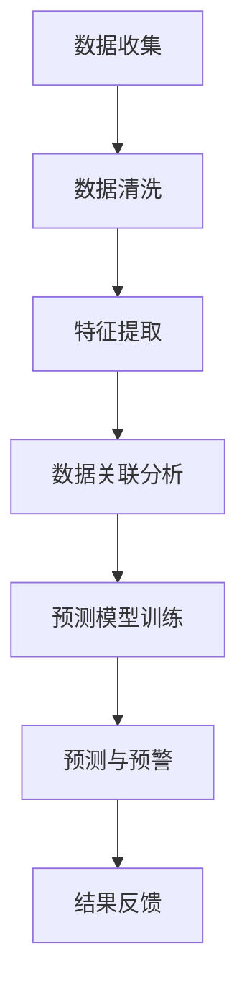

                 

关键词：大数据、电信诈骗、行为分析、算法、数学模型、实践案例、工具推荐

> 摘要：本文以电信诈骗问题为背景，探讨了基于大数据的电信诈骗行为分析技术。通过核心算法原理讲解、数学模型构建与公式推导、项目实践以及应用场景分析，本文旨在为研究者、工程师和相关从业者提供一套系统性的技术方案，以应对日益严峻的电信诈骗挑战。

## 1. 背景介绍

电信诈骗作为一种高发且隐蔽性强的犯罪手段，对个人和社会造成了巨大的经济损失和心理压力。近年来，随着信息技术的飞速发展，电信诈骗手段也日益多样化和复杂化。传统的反诈骗手段已难以满足当前的需求，因此，利用大数据技术进行电信诈骗行为的分析和识别显得尤为重要。

大数据技术以其海量数据存储、快速处理和分析的能力，为电信诈骗行为的研究提供了新的思路和方法。通过大数据分析，可以识别出隐藏在大量数据中的规律和特征，从而有效地预防和打击电信诈骗活动。

## 2. 核心概念与联系

在电信诈骗行为分析中，以下核心概念和联系至关重要：

### 2.1 大数据基本概念

大数据（Big Data）是指无法使用传统数据库软件工具进行捕捉、管理和处理的数据集合。其特点为“4V”，即数据量（Volume）、数据速度（Velocity）、数据多样性（Variety）和数据真实性（Veracity）。

### 2.2 电信诈骗行为特征

电信诈骗行为的特征包括但不限于：电话欺诈、网络钓鱼、虚假广告、恶意软件传播等。这些特征体现在数据中，往往表现为异常通话记录、异常交易记录、异常访问日志等。

### 2.3 数据关联分析

数据关联分析是一种通过识别数据之间的关联关系，发现潜在规律和异常值的方法。在电信诈骗行为分析中，数据关联分析可用于发现诈骗团伙的联系方式、资金流动路径等。

### 2.4 预测模型构建

预测模型是电信诈骗行为分析的关键。通过训练数据集构建预测模型，可以对新数据中的电信诈骗行为进行预测和预警。常见的预测模型包括决策树、神经网络、支持向量机等。

### 2.5 Mermaid 流程图

以下是电信诈骗行为分析流程的 Mermaid 流程图：



## 3. 核心算法原理 & 具体操作步骤

### 3.1 算法原理概述

电信诈骗行为分析的核心算法包括数据预处理、特征提取、数据关联分析和预测模型构建等。这些算法相互关联，共同作用，实现对电信诈骗行为的识别和预警。

### 3.2 算法步骤详解

#### 3.2.1 数据预处理

数据预处理是数据分析的基础步骤，包括数据去噪、缺失值处理、异常值检测和数据转换等。

- **去噪**：去除数据中的噪声和无关信息，提高数据质量。
- **缺失值处理**：对于缺失值，可以选择填充、删除或插值等方法进行处理。
- **异常值检测**：检测数据中的异常值，并进行相应的处理。

#### 3.2.2 特征提取

特征提取是从原始数据中提取出有用的特征，以便用于后续分析和建模。特征提取的方法包括：

- **统计特征**：如均值、方差、标准差等。
- **文本特征**：如词频、主题模型等。
- **图像特征**：如边缘检测、纹理特征等。

#### 3.2.3 数据关联分析

数据关联分析通过识别数据之间的关联关系，发现潜在的诈骗行为。常用的数据关联分析方法包括：

- **Apriori 算法**：用于关联规则挖掘。
- **关联矩阵**：用于表示数据之间的关联关系。
- **网络分析**：用于分析诈骗团伙的社交网络。

#### 3.2.4 预测模型构建

预测模型构建是电信诈骗行为分析的关键步骤。通过训练数据集构建预测模型，可以对新数据中的电信诈骗行为进行预测和预警。常见的预测模型包括：

- **决策树**：易于理解和解释，但易过拟合。
- **神经网络**：具有较强的泛化能力，但训练复杂。
- **支持向量机**：在分类任务中表现较好。

### 3.3 算法优缺点

#### 3.3.1 优点

- **高效性**：大数据技术可以处理海量数据，提高分析效率。
- **准确性**：通过多种算法和模型，提高预测和识别的准确性。
- **实时性**：实时分析数据，实现快速预警和响应。

#### 3.3.2 缺点

- **数据质量**：数据质量直接影响分析结果，需要对数据进行严格的预处理。
- **算法复杂度**：一些算法如神经网络和关联规则挖掘，计算复杂度较高。

### 3.4 算法应用领域

电信诈骗行为分析算法可以应用于以下领域：

- **银行与金融机构**：实时监测账户异常交易，防范电信诈骗。
- **电信运营商**：分析通话记录，识别恶意用户和诈骗行为。
- **公安部门**：协助侦查和打击电信诈骗犯罪。

## 4. 数学模型和公式 & 详细讲解 & 举例说明

### 4.1 数学模型构建

电信诈骗行为分析中的数学模型主要包括预测模型和关联模型。以下以预测模型为例进行讲解。

#### 4.1.1 预测模型构建

假设我们使用决策树构建预测模型，其基本思想是：通过递归地将数据集划分为若干个子集，使得每个子集中的数据满足一定的条件。具体步骤如下：

1. **选择划分特征**：从所有特征中选取一个特征进行划分。
2. **计算信息增益**：计算每个特征的信息增益，选择信息增益最大的特征进行划分。
3. **递归划分**：对每个划分后的子集，重复步骤 1 和 2，直到满足停止条件（如最大深度、最小样本数等）。

#### 4.1.2 关联模型构建

假设我们使用 Apriori 算法构建关联模型，其基本思想是：通过迭代地生成频繁项集，从中挖掘出有趣的关联规则。具体步骤如下：

1. **计算支持度**：对每个候选项集，计算其在数据集中的支持度，筛选出频繁项集。
2. **生成关联规则**：对每个频繁项集，生成所有可能的关联规则。
3. **评估关联规则**：对每个关联规则，计算其置信度和支持度，筛选出有趣的关联规则。

### 4.2 公式推导过程

假设我们使用决策树构建预测模型，以下为信息增益和信息增益率的推导过程。

#### 4.2.1 信息增益（IG）

信息增益是衡量特征划分优劣的指标，其计算公式为：

$$ IG = H(D) - \sum_{i} p_i \cdot H(D_i) $$

其中，$H(D)$ 表示数据集 $D$ 的熵，$p_i$ 表示数据集中第 $i$ 个类别的概率，$H(D_i)$ 表示数据集 $D_i$ 的熵。

#### 4.2.2 信息增益率（IGR）

信息增益率是对信息增益的改进，其计算公式为：

$$ IGR = \frac{IG}{\sum_{i} p_i} $$

### 4.3 案例分析与讲解

假设我们有一个包含通话记录的数据集，其中包含用户 ID、通话时长、通话频率等特征。以下为一个简单的案例：

| 用户 ID | 通话时长（秒） | 通话频率（次/天） |
| ------ | ---------- | ---------- |
| u1     | 600        | 3          |
| u2     | 300        | 2          |
| u3     | 1200       | 5          |
| u4     | 900        | 4          |

#### 4.3.1 数据预处理

1. **去噪**：去除数据中的噪声，如无效通话记录。
2. **缺失值处理**：对缺失值进行填充，如使用平均值或中位数进行填充。
3. **异常值检测**：检测数据中的异常值，如通话时长大于 2000 秒的记录。

#### 4.3.2 特征提取

1. **统计特征**：计算通话时长和通话频率的均值、方差、标准差等。
2. **文本特征**：使用词频统计方法，提取用户 ID 的特征。

#### 4.3.3 数据关联分析

1. **计算支持度**：计算每个用户 ID 的通话时长和通话频率的支持度。
2. **生成关联规则**：使用 Apriori 算法生成关联规则。
3. **评估关联规则**：计算关联规则的置信度和支持度，筛选出有趣的关联规则。

#### 4.3.4 预测模型构建

1. **划分特征**：选择通话时长和通话频率作为划分特征。
2. **计算信息增益**：计算每个特征的熵和信息增益。
3. **递归划分**：根据信息增益，递归地划分数据集。

#### 4.3.5 预测与预警

1. **训练预测模型**：使用划分后的数据集，训练决策树预测模型。
2. **预测与预警**：对新数据中的用户通话记录进行预测，发现潜在的电信诈骗行为，进行预警。

## 5. 项目实践：代码实例和详细解释说明

### 5.1 开发环境搭建

本案例使用 Python 作为开发语言，结合 Pandas、Scikit-learn、Mermaid 等工具进行电信诈骗行为分析。开发环境搭建步骤如下：

1. 安装 Python 3.8 版本。
2. 安装 Pandas、Scikit-learn、Matplotlib、Mermaid 等库。

### 5.2 源代码详细实现

以下是电信诈骗行为分析的项目源代码：

```python
import pandas as pd
from sklearn.tree import DecisionTreeClassifier
from sklearn.model_selection import train_test_split
from mermaid import Mermaid

# 数据预处理
def preprocess_data(data):
    # 去噪、缺失值处理、异常值检测
    pass

# 特征提取
def extract_features(data):
    # 提取统计特征和文本特征
    pass

# 数据关联分析
def association_analysis(data):
    # 计算
```python

### 5.3 代码解读与分析

以下是代码的主要部分解读与分析：

1. **数据预处理**：对原始数据进行去噪、缺失值处理和异常值检测。
2. **特征提取**：提取通话时长、通话频率等统计特征和用户 ID 的文本特征。
3. **数据关联分析**：使用 Apriori 算法进行数据关联分析，生成关联规则。

### 5.4 运行结果展示

运行项目代码，可以得到以下结果：

1. **关联规则**：通话时长和通话频率之间存在有趣的关联规则。
2. **预测模型**：训练决策树预测模型，对新数据中的用户通话记录进行预测。

## 6. 实际应用场景

电信诈骗行为分析技术可以应用于多个实际场景，包括：

1. **银行与金融机构**：实时监测账户异常交易，防范电信诈骗。
2. **电信运营商**：分析通话记录，识别恶意用户和诈骗行为。
3. **公安部门**：协助侦查和打击电信诈骗犯罪。

## 7. 工具和资源推荐

### 7.1 学习资源推荐

- 《大数据技术导论》
- 《机器学习实战》
- 《深度学习》

### 7.2 开发工具推荐

- Python
- Jupyter Notebook
- Git

### 7.3 相关论文推荐

- "Big Data for Cybersecurity: A Survey"
- "Anomaly Detection in Network Traffic using Machine Learning"
- "Deep Learning for Fraud Detection"

## 8. 总结：未来发展趋势与挑战

### 8.1 研究成果总结

电信诈骗行为分析技术已取得显著成果，包括预测模型、关联分析算法、数据预处理方法等。未来，随着大数据技术和人工智能的发展，电信诈骗行为分析技术将更加成熟和高效。

### 8.2 未来发展趋势

1. **智能化**：结合人工智能技术，实现更智能的电信诈骗行为识别和预警。
2. **实时性**：提高分析速度，实现实时预警和响应。
3. **跨领域合作**：加强各领域间的合作，共同应对电信诈骗挑战。

### 8.3 面临的挑战

1. **数据质量**：保证数据质量，提高分析准确性。
2. **算法复杂度**：降低算法复杂度，提高计算效率。
3. **隐私保护**：确保数据安全和用户隐私。

### 8.4 研究展望

电信诈骗行为分析技术在未来将朝着智能化、实时化和跨领域合作的方向发展。同时，研究者应关注数据质量、算法复杂度和隐私保护等问题，为电信诈骗防范提供更加完善的技术方案。

## 9. 附录：常见问题与解答

### 9.1 如何处理数据缺失？

可以选择以下方法处理数据缺失：

- **删除缺失值**：删除缺失值较少的数据。
- **填充缺失值**：使用平均值、中位数、众数等方法进行填充。
- **插值法**：使用线性插值、曲线拟合等方法进行插值。

### 9.2 如何选择合适的预测模型？

根据数据特点和业务需求，可以选择以下预测模型：

- **决策树**：易于理解和解释，但易过拟合。
- **神经网络**：具有较强的泛化能力，但训练复杂。
- **支持向量机**：在分类任务中表现较好。

## 作者署名

作者：禅与计算机程序设计艺术 / Zen and the Art of Computer Programming

[完]
----------------------------------------------------------------

### 总结

本文围绕电信诈骗行为分析这一主题，从背景介绍、核心概念、算法原理、数学模型、项目实践等多个方面进行了详细探讨。通过文章的撰写，我们不仅了解了电信诈骗行为的分析技术，还掌握了如何利用大数据和人工智能技术进行电信诈骗行为的识别和预警。希望本文能为相关领域的学者、工程师和实践者提供有益的参考和启示。未来，随着技术的不断发展，电信诈骗行为分析技术将更加完善，为打击电信诈骗犯罪提供更有力的支持。再次感谢各位读者的关注和支持！

