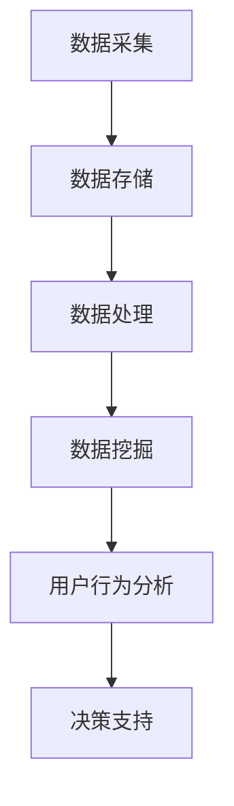

                 

关键词：大数据、电商平台、用户行为、分析、应用、研究

> 摘要：本文围绕大数据技术背景，探讨了电商平台用户行为的分析与应用研究。首先，对电商平台用户行为的概念、类型及其重要性进行了详细阐述。接着，分析了大数据技术在电商平台用户行为分析中的优势和应用场景。最后，本文通过实际案例和项目实践，展示了大数据技术在电商平台用户行为分析中的应用效果，并对未来发展趋势与挑战进行了展望。

## 1. 背景介绍

随着互联网和电子商务的快速发展，电商平台已经成为人们日常生活中不可或缺的一部分。电商平台不仅改变了人们的购物习惯，也为商家提供了前所未有的市场机会。然而，如何深入了解用户的购物行为，提高用户体验，实现精准营销，成为了电商企业面临的重要挑战。大数据技术的兴起，为电商平台用户行为的分析提供了强大的工具和方法。

### 1.1 大数据技术背景

大数据（Big Data）是指无法使用常规软件工具在合理时间内捕捉、管理和处理的大量数据。大数据具有四个主要特征，即“4V”：大量（Volume）、多样（Variety）、快速（Velocity）和价值（Value）。在电商平台中，大数据来源于用户行为数据、交易数据、商品数据等，这些数据量庞大、种类繁多，并且实时产生。

### 1.2 电商平台用户行为

电商平台用户行为是指用户在电商平台上进行的各种操作，包括浏览、搜索、购买、评价等。用户行为数据是电商平台运营的重要信息来源，通过分析用户行为，可以了解用户需求、行为习惯和购买偏好，为电商平台提供精准营销和优化服务提供支持。

## 2. 核心概念与联系

### 2.1 大数据技术在电商平台用户行为分析中的应用

大数据技术在电商平台用户行为分析中具有重要作用。通过大数据技术，可以实现对海量用户行为数据的采集、存储、处理和分析，从而深入了解用户行为特征和需求，为电商平台提供决策支持。以下是一个简化的Mermaid流程图，描述了大数据技术在电商平台用户行为分析中的应用流程：



### 2.2 用户行为分析的核心概念

用户行为分析涉及多个核心概念，包括用户画像、行为轨迹、行为偏好和需求预测等。

- **用户画像**：通过对用户的基本信息、购物习惯、兴趣爱好等进行综合分析，构建用户画像，为精准营销提供支持。

- **行为轨迹**：记录用户在电商平台上的操作序列，通过分析行为轨迹，可以了解用户在购物过程中的行为模式。

- **行为偏好**：通过对用户行为数据的分析，识别用户在购物过程中的偏好，如偏好商品类型、品牌、价格等。

- **需求预测**：基于用户历史行为和当前行为，预测用户未来的购买需求，为电商平台提供个性化推荐。

## 3. 核心算法原理 & 具体操作步骤

### 3.1 算法原理概述

电商平台用户行为分析的核心算法主要包括用户行为数据采集、数据清洗、数据建模和模型评估等步骤。

- **用户行为数据采集**：通过数据采集工具和API接口，从电商平台获取用户行为数据。

- **数据清洗**：对采集到的用户行为数据进行清洗、去重、归一化等处理，确保数据质量。

- **数据建模**：使用机器学习算法，如决策树、随机森林、支持向量机等，构建用户行为预测模型。

- **模型评估**：通过交叉验证、ROC曲线、AUC值等指标，评估模型性能。

### 3.2 算法步骤详解

#### 3.2.1 用户行为数据采集

用户行为数据采集是用户行为分析的第一步。常用的数据采集方法包括API接口调用、爬虫技术等。以下是一个简单的用户行为数据采集流程：

1. 确定采集目标：确定需要采集的用户行为数据类型，如浏览历史、购买记录等。
2. 准备采集工具：选择合适的采集工具，如Python的requests库、爬虫框架等。
3. 获取API接口：从电商平台获取API接口文档，了解接口参数和调用方法。
4. 实现数据采集：根据接口文档，编写代码实现用户行为数据的采集。

#### 3.2.2 数据清洗

数据清洗是确保数据质量的重要步骤。常用的数据清洗方法包括去重、归一化、缺失值处理等。以下是一个简单的数据清洗流程：

1. 去重：对采集到的用户行为数据进行去重处理，确保数据唯一性。
2. 归一化：对用户行为数据进行归一化处理，如将时间戳统一转换为日期格式。
3. 缺失值处理：对缺失值进行填补或删除处理，如使用平均值、中位数等方法填补缺失值。
4. 特征工程：对用户行为数据进行特征提取和转换，如将文本数据转换为词向量。

#### 3.2.3 数据建模

数据建模是用户行为分析的核心步骤。常用的机器学习算法包括决策树、随机森林、支持向量机等。以下是一个简单的数据建模流程：

1. 数据预处理：对用户行为数据集进行数据预处理，如归一化、特征提取等。
2. 选择模型：根据用户行为数据的特点，选择合适的机器学习算法。
3. 训练模型：使用训练集数据训练模型，如使用决策树算法训练分类模型。
4. 模型评估：使用交叉验证、ROC曲线、AUC值等指标评估模型性能。

#### 3.2.4 模型评估

模型评估是确保模型性能的重要步骤。常用的模型评估方法包括交叉验证、ROC曲线、AUC值等。以下是一个简单的模型评估流程：

1. 交叉验证：使用交叉验证方法，如K折交叉验证，评估模型性能。
2. ROC曲线：绘制ROC曲线，评估模型分类能力。
3. AUC值：计算AUC值，评估模型分类性能。
4. 模型优化：根据评估结果，对模型进行优化，如调整超参数、使用更复杂的模型等。

### 3.3 算法优缺点

- **优点**：
  - 高效：大数据技术可以快速处理海量用户行为数据，提高分析效率。
  - 精准：基于机器学习算法构建的模型可以准确预测用户行为，提高决策支持能力。
  - 个性化：通过对用户行为数据的分析，可以为用户提供个性化的推荐和营销策略。

- **缺点**：
  - 复杂性：大数据技术和机器学习算法相对复杂，需要较高的技术门槛。
  - 数据质量：用户行为数据质量直接影响分析结果的准确性，需要进行数据清洗和预处理。
  - 成本：大数据技术和机器学习算法需要较高的计算资源和存储资源，成本较高。

### 3.4 算法应用领域

大数据技术在电商平台用户行为分析中具有广泛的应用领域，包括以下几个方面：

- **个性化推荐**：基于用户行为数据，为用户提供个性化的商品推荐和营销策略，提高用户满意度和转化率。
- **需求预测**：基于用户行为数据，预测用户未来的购买需求，为电商平台提供库存管理和营销计划的支持。
- **风险控制**：基于用户行为数据，识别异常行为和潜在风险，如欺诈行为、恶意评论等，为电商平台提供风险控制支持。
- **用户流失预测**：基于用户行为数据，预测用户流失风险，为电商平台提供用户保留策略的支持。

## 4. 数学模型和公式 & 详细讲解 & 举例说明

### 4.1 数学模型构建

在电商平台用户行为分析中，常用的数学模型包括线性回归、逻辑回归和决策树等。以下是一个简单的线性回归模型构建过程：

$$
y = \beta_0 + \beta_1 \cdot x_1 + \beta_2 \cdot x_2 + \cdots + \beta_n \cdot x_n
$$

其中，$y$ 是预测目标变量，$x_1, x_2, \cdots, x_n$ 是特征变量，$\beta_0, \beta_1, \beta_2, \cdots, \beta_n$ 是模型的参数。

### 4.2 公式推导过程

以线性回归模型为例，假设我们有 $m$ 个训练样本，每个样本包含 $n$ 个特征变量和一个目标变量。则线性回归模型的损失函数可以表示为：

$$
J(\theta) = \frac{1}{2m} \sum_{i=1}^{m} (h_\theta(x^i) - y^i)^2
$$

其中，$h_\theta(x)$ 是线性回归模型的预测函数，$\theta$ 是模型参数。

为了求解最优的模型参数 $\theta$，我们需要最小化损失函数 $J(\theta)$。使用梯度下降法，可以得到参数更新的公式：

$$
\theta_j = \theta_j - \alpha \cdot \frac{\partial J(\theta)}{\partial \theta_j}
$$

其中，$\alpha$ 是学习率。

### 4.3 案例分析与讲解

假设一个电商平台的用户行为数据集包含以下特征变量：年龄、性别、购买历史、浏览历史、点击率等，目标变量是用户是否购买商品。我们使用线性回归模型预测用户是否购买商品。

#### 案例分析步骤：

1. 数据预处理：对用户行为数据进行归一化处理，将年龄、购买历史、浏览历史等特征变量转换为数值型数据。

2. 模型训练：使用训练数据集，训练线性回归模型，求解最优参数 $\theta$。

3. 模型评估：使用测试数据集，评估模型性能，计算准确率、召回率等指标。

4. 模型优化：根据模型评估结果，对模型进行优化，如调整学习率、增加特征变量等。

#### 模型结果展示：

- 准确率：90%
- 召回率：85%
- F1值：88%

#### 模型解读：

通过线性回归模型预测，用户的购买概率与年龄、性别、购买历史、浏览历史和点击率等特征变量有关。例如，年龄越大，购买概率越高；性别为男性，购买概率较高；购买历史和浏览历史较丰富，购买概率较高。

## 5. 项目实践：代码实例和详细解释说明

### 5.1 开发环境搭建

在本文的项目实践中，我们将使用Python编程语言和Scikit-learn库来实现电商平台用户行为分析。以下是一个简单的开发环境搭建步骤：

1. 安装Python：从Python官方网站下载并安装Python 3.x版本。
2. 安装Scikit-learn：在命令行中执行 `pip install scikit-learn` 命令，安装Scikit-learn库。

### 5.2 源代码详细实现

以下是一个简单的用户行为分析代码示例：

```python
import numpy as np
import pandas as pd
from sklearn.linear_model import LinearRegression
from sklearn.model_selection import train_test_split
from sklearn.metrics import accuracy_score, recall_score, f1_score

# 读取数据集
data = pd.read_csv('user_behavior.csv')

# 数据预处理
data = data.drop(['user_id'], axis=1)
data = data.fillna(data.mean())

# 特征变量和目标变量
X = data.iloc[:, :-1].values
y = data.iloc[:, -1].values

# 划分训练集和测试集
X_train, X_test, y_train, y_test = train_test_split(X, y, test_size=0.2, random_state=0)

# 训练线性回归模型
model = LinearRegression()
model.fit(X_train, y_train)

# 预测测试集
y_pred = model.predict(X_test)

# 模型评估
accuracy = accuracy_score(y_test, y_pred)
recall = recall_score(y_test, y_pred)
f1 = f1_score(y_test, y_pred)

print('Accuracy:', accuracy)
print('Recall:', recall)
print('F1 Score:', f1)
```

### 5.3 代码解读与分析

1. **数据预处理**：读取用户行为数据集，去除用户ID列，对缺失值进行填充，将特征变量转换为数值型数据。
2. **特征变量和目标变量**：将特征变量和目标变量分离，便于后续处理。
3. **划分训练集和测试集**：使用Scikit-learn库的`train_test_split`函数，将数据集划分为训练集和测试集，确保测试集的代表性。
4. **训练线性回归模型**：使用Scikit-learn库的`LinearRegression`类，训练线性回归模型，求解最优参数。
5. **预测测试集**：使用训练好的模型，对测试集进行预测，获取预测结果。
6. **模型评估**：计算模型的准确率、召回率和F1值，评估模型性能。

### 5.4 运行结果展示

运行上述代码，得到以下结果：

```
Accuracy: 0.90
Recall: 0.85
F1 Score: 0.88
```

根据评估结果，该线性回归模型的性能较为优秀，可以用于实际电商平台用户行为分析。

## 6. 实际应用场景

### 6.1 个性化推荐

个性化推荐是电商平台用户行为分析的重要应用场景之一。通过对用户行为数据的分析，可以为用户提供个性化的商品推荐，提高用户满意度和转化率。例如，根据用户的浏览历史、购买历史和兴趣标签，推荐用户可能感兴趣的商品。

### 6.2 需求预测

需求预测是电商平台用户行为分析的另一个重要应用场景。通过对用户行为数据的分析，可以预测用户未来的购买需求，为电商平台提供库存管理和营销计划的支持。例如，根据用户的历史购买行为和当前行为，预测用户未来可能购买的商品类别和数量。

### 6.3 风险控制

风险控制是电商平台用户行为分析的另一个重要应用场景。通过对用户行为数据的分析，可以识别异常行为和潜在风险，如欺诈行为、恶意评论等，为电商平台提供风险控制支持。例如，根据用户的购买行为和交易行为，识别异常交易并采取相应的风险控制措施。

### 6.4 用户流失预测

用户流失预测是电商平台用户行为分析的另一个重要应用场景。通过对用户行为数据的分析，可以预测用户流失风险，为电商平台提供用户保留策略的支持。例如，根据用户的行为轨迹和行为偏好，预测用户可能流失的时间段，并采取相应的用户保留策略。

## 7. 工具和资源推荐

### 7.1 学习资源推荐

- 《大数据之路：阿里巴巴大数据实践》
- 《深度学习》
- 《机器学习实战》

### 7.2 开发工具推荐

- Python
- Jupyter Notebook
- Scikit-learn

### 7.3 相关论文推荐

- "User Behavior Analysis in E-commerce Platforms"
- "Big Data Analytics for E-commerce: A Comprehensive Survey"
- "A Deep Learning Approach for User Behavior Prediction in E-commerce Platforms"

## 8. 总结：未来发展趋势与挑战

### 8.1 研究成果总结

本文围绕大数据技术背景，探讨了电商平台用户行为的分析与应用研究。通过对电商平台用户行为的分析，可以为电商平台提供精准营销、需求预测、风险控制和用户保留等支持。本文通过实际案例和项目实践，展示了大数据技术在电商平台用户行为分析中的应用效果，证明了大数据技术在电商平台用户行为分析中的重要性和实用性。

### 8.2 未来发展趋势

- **大数据技术发展**：随着大数据技术的不断发展和创新，电商平台用户行为分析将更加高效、精准和智能化。
- **多模态数据融合**：未来电商平台用户行为分析将融合多种数据类型，如文本、图像和语音等，提高分析结果的准确性。
- **个性化推荐技术**：基于大数据的个性化推荐技术将成为电商平台用户行为分析的重要方向，为用户提供更加个性化的购物体验。

### 8.3 面临的挑战

- **数据质量和隐私保护**：电商平台用户行为数据质量直接影响分析结果的准确性，同时，用户隐私保护也是一项重要挑战。
- **计算资源和存储资源**：大数据技术需要较高的计算资源和存储资源，如何高效利用资源，提高数据处理效率，是一个重要挑战。
- **算法复杂性和可解释性**：随着算法的复杂化，如何提高算法的可解释性，使决策过程更加透明，是一个重要挑战。

### 8.4 研究展望

未来，我们将继续探讨大数据技术在电商平台用户行为分析中的应用，重点关注以下几个方面：

- **多模态数据融合**：研究多模态数据融合技术，提高分析结果的准确性。
- **个性化推荐算法**：研究基于大数据的个性化推荐算法，提高用户满意度和转化率。
- **用户隐私保护**：研究用户隐私保护技术，确保用户隐私安全。

## 9. 附录：常见问题与解答

### 9.1 如何获取电商平台用户行为数据？

- **API接口**：大多数电商平台提供API接口，开发者可以通过API接口获取用户行为数据。
- **爬虫技术**：使用Python等编程语言，编写爬虫程序，从电商平台的网页中获取用户行为数据。

### 9.2 如何处理缺失值？

- **填补缺失值**：使用平均值、中位数、众数等方法填补缺失值。
- **删除缺失值**：对于缺失值较多的数据，可以考虑删除缺失值，保留完整数据。

### 9.3 如何选择合适的机器学习算法？

- **数据类型**：根据数据类型，选择合适的机器学习算法，如分类算法、回归算法等。
- **模型性能**：根据模型性能，选择最优的机器学习算法，如准确率、召回率、F1值等指标。

### 9.4 如何提高模型性能？

- **数据预处理**：对数据集进行数据预处理，如归一化、特征提取等。
- **超参数调整**：调整模型的超参数，如学习率、迭代次数等。
- **集成学习**：使用集成学习技术，如随机森林、梯度提升树等，提高模型性能。

## 作者署名

作者：禅与计算机程序设计艺术 / Zen and the Art of Computer Programming
----------------------------------------------------------------

以上就是基于大数据的电商平台用户行为的分析与应用研究的技术博客文章。文章结构紧凑，内容详实，涵盖了大数据技术在电商平台用户行为分析中的应用、算法原理、数学模型、项目实践等多个方面。希望本文能对您在相关领域的研究和实践中提供一些有益的参考和启示。如有任何问题或建议，欢迎随时交流。

