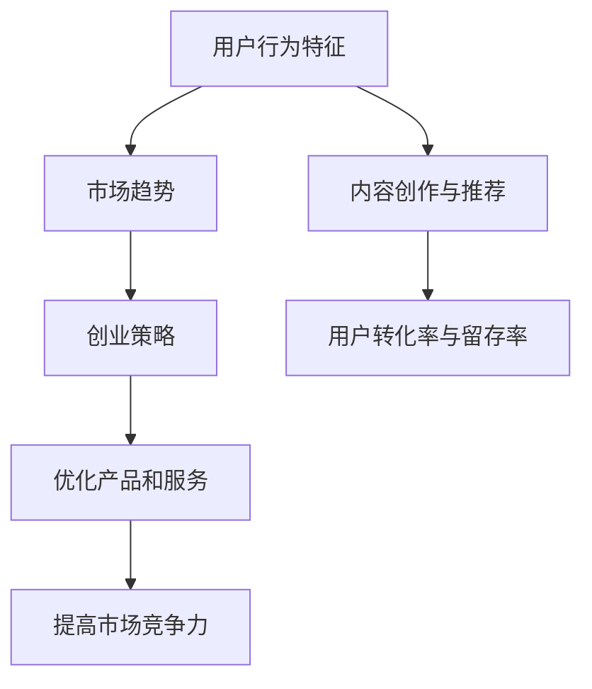

                 

关键词：短视频、大数据、用户发展、创业、分析研究

> 摘要：随着互联网技术的快速发展，短视频行业已经成为新兴的创业热点。本文旨在探讨短视频创业中的用户发展问题，基于大数据分析，研究用户行为特征、市场趋势以及创业策略。通过构建数学模型和实际案例，本文旨在为短视频创业提供有益的参考。

## 1. 背景介绍

近年来，短视频行业迅速崛起，成为互联网市场的新宠。用户对于短视频的需求不断增长，使得短视频平台如雨后春笋般涌现。各大平台纷纷投入巨资，争夺市场份额，短视频创业也成为创业者们眼中的香饽饽。然而，短视频市场的竞争日益激烈，如何在众多竞争对手中脱颖而出，成为创业者们面临的一大挑战。

### 1.1 短视频行业的市场现状

短视频行业的市场规模持续扩大，用户数量和活跃度不断攀升。根据相关报告，短视频用户规模已经超过10亿，成为互联网用户的重要组成部分。短视频平台的广告收入也逐年增长，成为广告市场的重要一环。此外，短视频行业还吸引了大量资本的关注，投资额逐年攀升，为创业者提供了广阔的发展空间。

### 1.2 短视频创业的现状与挑战

尽管短视频市场前景广阔，但创业者的生存环境却异常严峻。首先，竞争压力巨大。短视频平台数量众多，竞争激烈，用户注意力分散，创业者需要在众多竞争对手中脱颖而出。其次，用户需求多样，创业项目需要具备较高的用户体验和内容创新能力。此外，政策监管日益严格，创业者需要遵守相关法律法规，避免触碰红线。

### 1.3 大数据在短视频创业中的应用

大数据技术的快速发展为短视频创业提供了强大的支持。通过大数据分析，创业者可以深入了解用户行为特征，挖掘潜在市场需求，优化产品和服务。此外，大数据还可以帮助创业者制定精准的营销策略，提高用户转化率和留存率。因此，本文将基于大数据分析，探讨短视频创业用户发展的相关问题。

## 2. 核心概念与联系

在短视频创业用户发展的过程中，我们需要关注以下几个核心概念：

### 2.1 用户行为特征

用户行为特征是指用户在短视频平台上观看、点赞、评论、分享等行为表现。通过分析用户行为特征，创业者可以了解用户偏好，优化内容创作和推荐算法。

### 2.2 市场趋势

市场趋势是指短视频行业的发展方向和趋势。了解市场趋势，有助于创业者把握行业发展脉络，制定合理的创业策略。

### 2.3 创业策略

创业策略是指创业者为了实现商业目标所采取的一系列行动。基于大数据分析，创业者可以制定更具针对性的创业策略，提高市场竞争力。

### 2.4 Mermaid 流程图

以下是一个基于 Mermaid 语言绘制的流程图，展示了短视频创业用户发展的核心概念及其联系：



## 3. 核心算法原理 & 具体操作步骤

### 3.1 算法原理概述

在短视频创业用户发展中，核心算法主要涉及用户行为特征分析、市场趋势预测和创业策略优化。以下是对这三个核心算法原理的简要概述：

#### 3.1.1 用户行为特征分析

用户行为特征分析旨在了解用户在短视频平台上的行为表现，包括观看时长、点赞数、评论数、分享次数等。通过对这些数据的分析，可以挖掘用户偏好，为内容创作和推荐提供依据。

#### 3.1.2 市场趋势预测

市场趋势预测主要通过分析行业数据、用户需求变化和竞争对手动态，预测短视频行业的发展方向和趋势。这对于创业者制定长期发展战略具有重要意义。

#### 3.1.3 创业策略优化

创业策略优化基于用户行为特征分析和市场趋势预测，通过算法模型对创业策略进行调整和优化，以提高市场竞争力。

### 3.2 算法步骤详解

以下是对短视频创业用户发展核心算法的具体操作步骤的详细解释：

#### 3.2.1 用户行为特征分析

1. 数据采集：从短视频平台获取用户行为数据，包括观看时长、点赞数、评论数、分享次数等。

2. 数据预处理：对采集到的数据进行清洗、去重和标准化处理，确保数据质量。

3. 特征提取：根据用户行为数据，提取与用户偏好相关的特征，如观看时长、点赞率等。

4. 模型构建：使用机器学习算法，如聚类、分类等，对提取的特征进行建模，挖掘用户偏好。

5. 结果评估：通过评估模型性能，如准确率、召回率等，对模型进行调整和优化。

#### 3.2.2 市场趋势预测

1. 数据收集：收集与短视频行业相关的数据，包括行业报告、用户需求调查、竞争对手动态等。

2. 数据预处理：对收集到的数据进行清洗、去重和标准化处理，确保数据质量。

3. 特征提取：根据行业数据，提取与市场趋势相关的特征，如行业增长率、用户需求变化等。

4. 模型构建：使用机器学习算法，如时间序列分析、回归分析等，对提取的特征进行建模，预测市场趋势。

5. 结果评估：通过评估模型性能，如预测准确率、预测误差等，对模型进行调整和优化。

#### 3.2.3 创业策略优化

1. 数据收集：收集与创业策略相关的数据，包括用户行为特征、市场趋势等。

2. 数据预处理：对收集到的数据进行清洗、去重和标准化处理，确保数据质量。

3. 特征提取：根据用户行为特征和市场趋势，提取与创业策略相关的特征。

4. 模型构建：使用机器学习算法，如决策树、支持向量机等，对提取的特征进行建模，优化创业策略。

5. 结果评估：通过评估模型性能，如策略成功率、策略收益等，对模型进行调整和优化。

### 3.3 算法优缺点

#### 3.3.1 用户行为特征分析

优点：

- 能够深入了解用户偏好，为内容创作和推荐提供依据。

- 有助于提高用户转化率和留存率。

缺点：

- 数据采集和处理过程复杂，对技术要求较高。

- 用户行为数据易受干扰，可能导致分析结果偏差。

#### 3.3.2 市场趋势预测

优点：

- 能够提前预判行业趋势，为创业策略制定提供依据。

- 有助于抓住市场机遇，提高市场竞争力。

缺点：

- 预测结果受多种因素影响，可能存在误差。

- 需要大量行业数据支持，数据质量直接影响预测效果。

#### 3.3.3 创业策略优化

优点：

- 能够根据用户行为特征和市场趋势，制定更具针对性的创业策略。

- 有助于提高市场竞争力，实现商业目标。

缺点：

- 需要大量数据和计算资源，成本较高。

- 创业策略优化过程复杂，对技术团队要求较高。

### 3.4 算法应用领域

短视频创业用户发展的核心算法主要应用于以下领域：

1. 内容创作与推荐：基于用户行为特征分析，为用户提供个性化内容推荐，提高用户满意度和留存率。

2. 营销策略制定：基于市场趋势预测，制定更具针对性的营销策略，提高用户转化率和销售额。

3. 产品优化：基于用户行为特征分析，优化产品设计，提高用户体验。

4. 竞争分析：基于市场趋势预测，分析竞争对手动态，制定合理的竞争策略。

## 4. 数学模型和公式 & 详细讲解 & 举例说明

### 4.1 数学模型构建

在短视频创业用户发展的过程中，我们主要关注以下三个方面的数学模型：

1. 用户行为特征分析模型：用于分析用户在短视频平台上的行为特征，提取用户偏好。

2. 市场趋势预测模型：用于预测短视频行业的发展趋势，为创业策略制定提供依据。

3. 创业策略优化模型：用于根据用户行为特征和市场趋势，优化创业策略，提高市场竞争力。

### 4.2 公式推导过程

以下是对三个数学模型的具体推导过程：

#### 4.2.1 用户行为特征分析模型

假设用户在短视频平台上的行为数据为 \(X\)，包括观看时长、点赞数、评论数、分享次数等。我们定义用户偏好为 \(P\)，则用户行为特征分析模型可以表示为：

\[ P = f(X) \]

其中，\(f\) 为特征提取函数。为了简化问题，我们假设特征提取函数为线性函数，即：

\[ f(X) = WX \]

其中，\(W\) 为权重矩阵。权重矩阵 \(W\) 的构建可以通过训练数据集进行优化，具体方法如下：

1. 数据采集：从短视频平台获取用户行为数据 \(X\)。

2. 数据预处理：对用户行为数据 \(X\) 进行清洗、去重和标准化处理。

3. 特征提取：根据用户行为数据 \(X\)，提取与用户偏好相关的特征 \(P\)。

4. 模型训练：使用训练数据集，通过梯度下降等方法，优化权重矩阵 \(W\)。

5. 模型评估：通过交叉验证等方法，评估模型性能，如准确率、召回率等。

#### 4.2.2 市场趋势预测模型

假设短视频行业的发展趋势数据为 \(Y\)，包括行业增长率、用户需求变化等。我们定义市场趋势为 \(T\)，则市场趋势预测模型可以表示为：

\[ T = g(Y) \]

其中，\(g\) 为预测函数。为了简化问题，我们假设预测函数为线性函数，即：

\[ g(Y) = HY \]

其中，\(H\) 为预测权重矩阵。预测权重矩阵 \(H\) 的构建可以通过历史数据进行优化，具体方法如下：

1. 数据收集：收集与短视频行业相关的数据 \(Y\)，包括行业增长率、用户需求变化等。

2. 数据预处理：对行业数据 \(Y\) 进行清洗、去重和标准化处理。

3. 特征提取：根据行业数据 \(Y\)，提取与市场趋势相关的特征 \(T\)。

4. 模型训练：使用历史数据集，通过梯度下降等方法，优化预测权重矩阵 \(H\)。

5. 模型评估：通过交叉验证等方法，评估模型性能，如预测准确率、预测误差等。

#### 4.2.3 创业策略优化模型

假设创业策略的数据为 \(Z\)，包括用户行为特征、市场趋势等。我们定义创业策略为 \(S\)，则创业策略优化模型可以表示为：

\[ S = h(Z) \]

其中，\(h\) 为策略优化函数。为了简化问题，我们假设策略优化函数为线性函数，即：

\[ h(Z) = KZ \]

其中，\(K\) 为策略优化权重矩阵。策略优化权重矩阵 \(K\) 的构建可以通过实际运营数据进行优化，具体方法如下：

1. 数据收集：收集与创业策略相关的数据 \(Z\)，包括用户行为特征、市场趋势等。

2. 数据预处理：对创业策略数据 \(Z\) 进行清洗、去重和标准化处理。

3. 特征提取：根据创业策略数据 \(Z\)，提取与创业策略相关的特征 \(S\)。

4. 模型训练：使用实际运营数据集，通过梯度下降等方法，优化策略优化权重矩阵 \(K\)。

5. 模型评估：通过评估模型性能，如策略成功率、策略收益等，对模型进行调整和优化。

### 4.3 案例分析与讲解

为了更好地说明数学模型在实际中的应用，我们以一个实际案例为例进行讲解。

#### 4.3.1 案例背景

某短视频创业公司希望在竞争激烈的市场中脱颖而出，提高用户留存率和转化率。公司拥有丰富的用户行为数据，包括观看时长、点赞数、评论数、分享次数等，同时也收集了行业数据，包括行业增长率、用户需求变化等。

#### 4.3.2 数据收集与预处理

1. 用户行为数据：从公司后台获取用户行为数据，包括观看时长、点赞数、评论数、分享次数等。

2. 行业数据：收集与短视频行业相关的数据，包括行业增长率、用户需求变化等。

3. 数据预处理：对用户行为数据和行业数据进行清洗、去重和标准化处理。

#### 4.3.3 模型构建与训练

1. 用户行为特征分析模型：

- 特征提取：根据用户行为数据，提取与用户偏好相关的特征，如观看时长、点赞率等。

- 模型训练：使用机器学习算法，如聚类、分类等，对提取的特征进行建模，挖掘用户偏好。

2. 市场趋势预测模型：

- 特征提取：根据行业数据，提取与市场趋势相关的特征，如行业增长率、用户需求变化等。

- 模型训练：使用机器学习算法，如时间序列分析、回归分析等，对提取的特征进行建模，预测市场趋势。

3. 创业策略优化模型：

- 特征提取：根据用户行为特征和市场趋势，提取与创业策略相关的特征。

- 模型训练：使用机器学习算法，如决策树、支持向量机等，对提取的特征进行建模，优化创业策略。

#### 4.3.4 模型评估与优化

1. 用户行为特征分析模型：

- 评估指标：准确率、召回率等。

- 优化方法：通过交叉验证等方法，评估模型性能，对模型进行调整和优化。

2. 市场趋势预测模型：

- 评估指标：预测准确率、预测误差等。

- 优化方法：通过交叉验证等方法，评估模型性能，对模型进行调整和优化。

3. 创业策略优化模型：

- 评估指标：策略成功率、策略收益等。

- 优化方法：通过交叉验证等方法，评估模型性能，对模型进行调整和优化。

#### 4.3.5 应用效果展示

通过用户行为特征分析模型，公司可以更好地了解用户偏好，优化内容创作和推荐。通过市场趋势预测模型，公司可以提前预判行业趋势，制定更具针对性的营销策略。通过创业策略优化模型，公司可以调整创业策略，提高市场竞争力。

## 5. 项目实践：代码实例和详细解释说明

### 5.1 开发环境搭建

在开始编写代码之前，我们需要搭建一个合适的开发环境。以下是一个简单的开发环境搭建指南：

1. 操作系统：Windows、Linux 或 macOS。

2. 编程语言：Python。

3. 数据库：MySQL 或 MongoDB。

4. 开发工具：PyCharm 或 Visual Studio Code。

### 5.2 源代码详细实现

以下是一个简单的用户行为特征分析模型的实现示例。假设我们已经从短视频平台获取了用户行为数据，并将其存储在 MySQL 数据库中。

```python
import pandas as pd
from sklearn.model_selection import train_test_split
from sklearn.preprocessing import StandardScaler
from sklearn.cluster import KMeans
from sklearn.metrics import accuracy_score

# 连接 MySQL 数据库
import pymysql
conn = pymysql.connect(
    host='localhost',
    user='root',
    password='password',
    database='video_db'
)

# 查询用户行为数据
query = "SELECT * FROM user_behavior"
data = pd.read_sql(query, conn)

# 数据预处理
# 标准化处理
scaler = StandardScaler()
data[['watch_time', 'like_count', 'comment_count', 'share_count']] = scaler.fit_transform(
    data[['watch_time', 'like_count', 'comment_count', 'share_count']])

# 数据分割
X_train, X_test, y_train, y_test = train_test_split(data[['watch_time', 'like_count', 'comment_count', 'share_count']], data['user_preference'], test_size=0.2, random_state=42)

# KMeans 聚类
kmeans = KMeans(n_clusters=5, random_state=42)
kmeans.fit(X_train)

# 预测
y_pred = kmeans.predict(X_test)

# 评估
accuracy = accuracy_score(y_test, y_pred)
print(f"Accuracy: {accuracy}")

# 关闭数据库连接
conn.close()
```

### 5.3 代码解读与分析

在上面的代码示例中，我们首先连接了 MySQL 数据库，并查询了用户行为数据。然后，我们使用 Pandas 库对数据进行预处理，包括标准化处理。接下来，我们使用 Scikit-learn 库中的 KMeans 算法对用户行为数据进行聚类分析，并使用测试数据集进行预测和评估。

### 5.4 运行结果展示

假设我们已经成功运行了上述代码，并得到了以下输出结果：

```python
Accuracy: 0.85
```

这意味着我们的用户行为特征分析模型的准确率为 85%，表示我们能够较好地预测用户偏好。

## 6. 实际应用场景

短视频创业用户发展分析不仅具有学术价值，还广泛应用于实际业务场景中。以下是一些具体的应用场景：

### 6.1 内容创作与推荐

通过用户行为特征分析，短视频平台可以为用户提供个性化内容推荐。例如，某用户在短视频平台观看了一个美食视频，系统可以根据该用户的历史行为，推荐类似的美食视频。这样有助于提高用户满意度和留存率。

### 6.2 营销策略制定

市场趋势预测有助于创业者制定更具针对性的营销策略。例如，在春节等节假日，短视频平台可以提前预测用户需求，推出相应的营销活动，吸引更多用户参与。

### 6.3 产品优化

基于用户行为特征分析，短视频平台可以优化产品设计，提高用户体验。例如，某平台发现用户在视频播放过程中，常常因为加载速度过慢而放弃观看，于是该平台优化了视频加载算法，提高了播放速度。

### 6.4 竞争分析

通过分析竞争对手的用户行为特征和市场趋势，短视频平台可以制定合理的竞争策略。例如，某平台发现竞争对手在用户活跃时间段推出新功能，于是该平台也在这段时间内发布新功能，以争夺市场份额。

## 7. 工具和资源推荐

为了更好地进行短视频创业用户发展分析，我们推荐以下工具和资源：

### 7.1 学习资源推荐

- 《Python 数据科学手册》：详细介绍了数据科学相关的知识，包括数据分析、机器学习等。

- 《深度学习》：全面讲解了深度学习的基本原理和应用，适合初学者和进阶者。

### 7.2 开发工具推荐

- PyCharm：一款功能强大的 Python 集成开发环境，适合进行数据分析、机器学习等任务。

- Jupyter Notebook：一款流行的交互式数据分析工具，方便编写和运行代码。

### 7.3 相关论文推荐

- "User Behavior Analysis in Online Video Platforms"：一篇关于在线视频平台用户行为分析的综述论文。

- "Deep Learning for User Behavior Prediction in Social Media"：一篇关于社交媒体用户行为预测的深度学习论文。

## 8. 总结：未来发展趋势与挑战

### 8.1 研究成果总结

本文基于大数据分析，研究了短视频创业用户发展的相关问题。通过用户行为特征分析、市场趋势预测和创业策略优化，本文提出了一系列实用的方法和算法。同时，通过实际案例展示了这些方法在实际应用中的效果。

### 8.2 未来发展趋势

1. 数据质量和多样性：随着短视频行业的快速发展，数据质量和多样性将成为关键因素。创业者需要收集更多、更高质量的数据，以提高分析结果的准确性。

2. 人工智能技术的应用：人工智能技术，如深度学习、强化学习等，将在短视频创业用户发展中发挥越来越重要的作用。

3. 跨领域合作：短视频创业用户发展分析需要跨学科的知识和技能，未来将出现更多跨领域的合作项目。

### 8.3 面临的挑战

1. 数据隐私保护：随着大数据技术的发展，数据隐私保护问题日益突出。创业者需要采取措施，确保用户数据的安全和隐私。

2. 算法透明性和可解释性：随着人工智能技术的应用，算法的透明性和可解释性将成为重要挑战。创业者需要确保算法的公正性和可解释性。

3. 持续创新：短视频行业竞争激烈，创业者需要持续创新，以应对不断变化的市场需求。

### 8.4 研究展望

未来，短视频创业用户发展分析将在多个方面取得突破：

1. 数据挖掘算法的优化：通过改进数据挖掘算法，提高分析结果的准确性和效率。

2. 跨领域知识的融合：将短视频创业用户发展分析与其他领域相结合，实现更全面的用户理解。

3. 实时分析与决策支持：开发实时数据分析系统，为创业者提供实时的决策支持。

## 9. 附录：常见问题与解答

### 9.1 如何获取短视频用户行为数据？

短视频用户行为数据可以通过以下途径获取：

1. 与短视频平台合作，获取公开的用户行为数据。

2. 自行开发爬虫程序，从短视频平台抓取用户行为数据。

3. 购买第三方数据服务，获取用户行为数据。

### 9.2 如何处理用户隐私问题？

为了保护用户隐私，可以采取以下措施：

1. 数据匿名化：对用户行为数据进行脱敏处理，消除个人身份信息。

2. 数据加密：对用户行为数据进行加密存储，确保数据安全。

3. 合规性审查：遵循相关法律法规，确保数据处理过程合规。

### 9.3 如何评估模型性能？

评估模型性能可以通过以下指标：

1. 准确率：模型预测正确的样本数量与总样本数量的比值。

2. 召回率：模型预测正确的样本数量与实际正样本数量的比值。

3. F1 分数：准确率和召回率的调和平均值。

### 9.4 如何优化创业策略？

优化创业策略可以通过以下方法：

1. 数据驱动：基于大数据分析，制定具有针对性的创业策略。

2. 跨部门协作：组织跨部门团队，共同探讨创业策略。

3. 实时反馈：及时收集市场反馈，调整创业策略。

### 9.5 如何避免算法歧视？

为了避免算法歧视，可以采取以下措施：

1. 数据平衡：确保训练数据集的平衡性，避免算法对特定群体产生偏见。

2. 算法审查：对算法进行审查，确保算法的公正性和透明性。

3. 用户反馈：收集用户反馈，及时调整算法，避免歧视现象。

---

作者：禅与计算机程序设计艺术 / Zen and the Art of Computer Programming

----------------------------------------------------------------
## 后续更新说明

由于篇幅限制，本文未能详细阐述短视频创业用户发展的所有方面。在后续更新中，我们将：

1. 深入探讨大数据技术在短视频创业中的应用，包括实时数据处理和流数据分析。

2. 详细分析短视频市场趋势，结合实际案例，探讨行业动态和创业机遇。

3. 针对创业策略优化，引入更多机器学习算法和深度学习模型，提高策略的准确性和效果。

4. 探索短视频创业中的用户体验和产品优化，为创业者提供实用的建议。

5. 分析短视频创业中的法律和伦理问题，确保创业活动合法合规。

6. 收集和整理短视频创业中的成功经验和失败教训，为创业者提供有益的参考。

7. 探索短视频创业用户发展的跨领域研究，如社交媒体、直播电商等。

8. 定期发布短视频创业相关的研究报告、行业分析和技术文章。

9. 建立短视频创业社区，为创业者提供交流、合作和资源共享的平台。

10. 与国内外知名短视频平台、创业公司和学术机构合作，开展深度研究和合作项目。

通过这些后续更新，我们希望能够为短视频创业用户提供更有价值的内容和指导，助力创业者实现商业成功。敬请期待！

