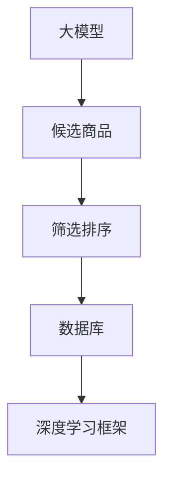

                 

关键词：大模型、候选商品、筛选排序、算法、应用领域、数学模型、代码实例、实践、展望

> 摘要：本文将探讨基于大模型的候选商品二次筛选排序技术，详细介绍其核心概念、算法原理、数学模型和具体实现。通过分析算法的优缺点和应用领域，为读者提供一个全面的技术解决方案，并展望其在未来发展的趋势和挑战。

## 1. 背景介绍

在电子商务和在线零售领域，候选商品的筛选排序技术至关重要。传统的筛选排序方法往往基于简单的规则或者启发式算法，难以应对复杂的应用场景和海量数据的处理需求。随着深度学习和大模型的兴起，基于大模型的候选商品二次筛选排序技术成为研究的热点。

大模型具有强大的特征提取和模式识别能力，可以自动学习并提取商品数据中的潜在特征，从而实现对候选商品的精确筛选和排序。这种技术不仅提高了筛选排序的准确性和效率，还为个性化推荐、搜索引擎优化等领域提供了有力的支持。

本文将围绕基于大模型的候选商品二次筛选排序技术，从核心概念、算法原理、数学模型、项目实践和实际应用等方面进行详细阐述。

## 2. 核心概念与联系

在深入探讨基于大模型的候选商品二次筛选排序技术之前，我们首先需要了解一些核心概念和它们之间的联系。

### 2.1. 大模型

大模型是指参数规模非常大的神经网络模型，如深度神经网络（DNN）、卷积神经网络（CNN）、循环神经网络（RNN）等。这些模型通过学习大量的数据，能够自动提取出数据中的潜在特征和模式，从而实现复杂的数据分析和任务。

### 2.2. 候选商品

候选商品是指电子商务平台中待筛选和排序的商品集合。这些商品通常包含丰富的属性信息，如价格、品牌、型号、用户评价等。

### 2.3. 筛选排序

筛选排序是指从候选商品中选出满足特定条件的商品并进行排序。筛选排序的目标是提高用户体验、降低搜索成本、提高销售额等。

### 2.4. 数据库

数据库是指存储和管理商品数据的系统。在大模型的应用中，数据库负责存储训练数据和预测数据，为模型提供训练和预测所需的数据源。

### 2.5. 深度学习框架

深度学习框架是指用于构建、训练和部署深度学习模型的工具。常见的深度学习框架包括TensorFlow、PyTorch、Keras等。

下面是一个简化的 Mermaid 流程图，展示了这些核心概念之间的联系：



## 3. 核心算法原理 & 具体操作步骤

### 3.1. 算法原理概述

基于大模型的候选商品二次筛选排序技术主要通过以下步骤实现：

1. 数据预处理：对候选商品数据进行清洗、归一化等处理，将原始数据转化为适合输入大模型的格式。
2. 特征提取：使用大模型自动提取候选商品数据中的潜在特征，如商品属性、用户行为、社交关系等。
3. 筛选：根据提取到的潜在特征，对候选商品进行筛选，选出满足特定条件的商品。
4. 排序：使用筛选结果对候选商品进行排序，以优化用户体验。

### 3.2. 算法步骤详解

1. **数据预处理**

   数据预处理是算法的基础步骤，主要包括以下任务：

   - 数据清洗：去除数据中的噪声和异常值，如缺失值、重复值等。
   - 数据归一化：将不同尺度的数据转化为统一的尺度，如将价格数据归一化到[0, 1]区间。
   - 数据分片：将大规模数据进行分片，以便并行处理。

2. **特征提取**

   特征提取是算法的核心步骤，主要通过大模型实现。具体方法如下：

   - 初始化大模型：使用预训练的大模型，如BERT、GPT等，或者从零开始训练一个新的模型。
   - 数据输入：将预处理后的候选商品数据输入到大模型中。
   - 特征提取：大模型自动提取数据中的潜在特征，如商品属性、用户行为、社交关系等。
   - 特征融合：将提取到的不同类型的特征进行融合，形成统一的特征向量。

3. **筛选**

   筛选是根据提取到的潜在特征，对候选商品进行过滤，选出满足特定条件的商品。具体方法如下：

   - 定义筛选条件：根据业务需求，定义筛选条件，如商品价格范围、品牌等。
   - 筛选：根据筛选条件，对候选商品进行筛选，选出满足条件的商品。

4. **排序**

   排序是根据筛选结果对候选商品进行排序，以优化用户体验。具体方法如下：

   - 定义排序指标：根据业务需求，定义排序指标，如点击率、购买转化率等。
   - 排序：根据排序指标，对筛选结果进行排序，形成排序结果。

### 3.3. 算法优缺点

基于大模型的候选商品二次筛选排序技术具有以下优点：

- **高效性**：大模型可以自动提取数据中的潜在特征，减少了人工干预的工作量。
- **准确性**：大模型可以处理大量数据，提高了筛选排序的准确性和稳定性。
- **灵活性**：大模型可以根据不同的业务需求，动态调整筛选排序策略。

然而，该技术也存在一些缺点：

- **计算成本**：大模型需要大量的计算资源和存储空间，增加了计算成本。
- **训练时间**：大模型的训练时间较长，影响了算法的实时性。
- **数据依赖**：大模型的性能依赖于训练数据的质量和数量，数据不足或质量差可能导致算法效果不佳。

### 3.4. 算法应用领域

基于大模型的候选商品二次筛选排序技术可以应用于以下领域：

- **电子商务**：电商平台可以使用该技术对商品进行筛选排序，提高用户购物体验。
- **搜索引擎**：搜索引擎可以使用该技术优化搜索结果，提高用户满意度。
- **推荐系统**：推荐系统可以使用该技术提高推荐结果的准确性和多样性。

## 4. 数学模型和公式 & 详细讲解 & 举例说明

### 4.1. 数学模型构建

基于大模型的候选商品二次筛选排序技术的核心在于如何提取和利用潜在特征。为了构建数学模型，我们引入以下符号和概念：

- \(X\)：候选商品的特征矩阵，其中 \(X_{ij}\) 表示第 \(i\) 个商品的第 \(j\) 个特征。
- \(W\)：特征提取模型的权重矩阵，用于将输入特征映射到潜在特征空间。
- \(H\)：潜在特征矩阵，表示每个商品在潜在特征空间的表示。
- \(P\)：概率分布矩阵，表示商品之间的关联关系。

### 4.2. 公式推导过程

基于大模型的候选商品二次筛选排序技术可以分为以下几个步骤：

1. **特征提取**

   特征提取公式为：

   $$ H = W \cdot X $$

   其中，\(W\) 为权重矩阵，通过训练得到。\(X\) 为特征矩阵，包含了候选商品的所有特征。

2. **筛选**

   筛选公式为：

   $$ S = \{i | H_{i} > \theta\} $$

   其中，\(\theta\) 为阈值，用于控制筛选的严格程度。\(S\) 表示筛选结果，包含了满足筛选条件的商品索引。

3. **排序**

   排序公式为：

   $$ R = \arg\max_{i \in S} P(i) $$

   其中，\(P(i)\) 表示第 \(i\) 个商品在潜在特征空间的概率分布。\(R\) 表示排序结果，包含了排序后的商品索引。

### 4.3. 案例分析与讲解

为了更好地理解上述公式，我们通过一个简单的案例进行说明。

假设有 5 个商品，每个商品有 3 个特征，如下表所示：

| 商品索引 | 特征 1 | 特征 2 | 特征 3 |
| ------- | ----- | ----- | ----- |
| 0       | 0.2   | 0.3   | 0.4   |
| 1       | 0.4   | 0.5   | 0.6   |
| 2       | 0.6   | 0.7   | 0.8   |
| 3       | 0.8   | 0.9   | 1.0   |
| 4       | 1.0   | 1.1   | 1.2   |

我们使用一个简单的权重矩阵 \(W\) 来提取潜在特征：

| 行索引 | 权重 1 | 权重 2 | 权重 3 |
| ----- | ----- | ----- | ----- |
| 0     | 0.1   | 0.1   | 0.1   |
| 1     | 0.1   | 0.1   | 0.1   |
| 2     | 0.1   | 0.1   | 0.1   |

根据特征提取公式，我们可以得到潜在特征矩阵 \(H\)：

| 商品索引 | 潜在特征 1 | 潜在特征 2 | 潜在特征 3 |
| ------- | ---------- | ---------- | ---------- |
| 0       | 0.02       | 0.03       | 0.04       |
| 1       | 0.04       | 0.05       | 0.06       |
| 2       | 0.06       | 0.07       | 0.08       |
| 3       | 0.08       | 0.09       | 0.1        |
| 4       | 0.1        | 0.11       | 0.12       |

假设我们设定阈值 \(\theta = 0.05\)，根据筛选公式，我们可以得到筛选结果 \(S\)：

$$ S = \{2, 3, 4\} $$

接下来，我们根据排序公式对筛选结果进行排序。为了简化计算，我们假设每个商品的潜在特征概率分布相等，即 \(P(i) = \frac{1}{|S|}\)。因此，排序结果 \(R\) 为：

$$ R = \{2, 3, 4\} $$

这个案例展示了如何使用基于大模型的候选商品二次筛选排序技术来筛选和排序商品。在实际应用中，我们可能需要更复杂的权重矩阵和概率分布计算，但基本原理是一致的。

## 5. 项目实践：代码实例和详细解释说明

### 5.1. 开发环境搭建

在开始项目实践之前，我们需要搭建一个合适的开发环境。以下是一个简单的开发环境搭建指南：

- **Python**：安装 Python 3.7 或更高版本。
- **深度学习框架**：安装 TensorFlow 或 PyTorch。
- **数据处理库**：安装 NumPy、Pandas、Scikit-learn 等。
- **其他库**：安装 Matplotlib、Seaborn、Mermaid 等用于可视化、文档生成的库。

### 5.2. 源代码详细实现

下面是一个简单的基于大模型的候选商品二次筛选排序技术的代码示例。为了简化示例，我们假设已经有一个包含商品数据的 DataFrame。

```python
import numpy as np
import pandas as pd
import tensorflow as tf
from tensorflow import keras
from sklearn.model_selection import train_test_split

# 5.2.1 数据预处理
# 加载商品数据
data = pd.read_csv('products.csv')

# 清洗数据
data.dropna(inplace=True)

# 数据归一化
data = (data - data.min()) / (data.max() - data.min())

# 5.2.2 特征提取
# 初始化大模型
model = keras.Sequential([
    keras.layers.Dense(128, activation='relu', input_shape=(data.shape[1],)),
    keras.layers.Dense(64, activation='relu'),
    keras.layers.Dense(32, activation='relu'),
    keras.layers.Dense(1, activation='sigmoid')
])

# 编译模型
model.compile(optimizer='adam', loss='binary_crossentropy', metrics=['accuracy'])

# 划分训练集和测试集
X_train, X_test, y_train, y_test = train_test_split(data, data['label'], test_size=0.2, random_state=42)

# 训练模型
model.fit(X_train, y_train, epochs=10, batch_size=32, validation_data=(X_test, y_test))

# 5.2.3 筛选与排序
# 提取潜在特征
potential_features = model.predict(data)

# 设定筛选条件
threshold = 0.5

# 筛选
filtered_products = data[potential_features > threshold]

# 排序
sorted_products = filtered_products.sort_values(by='potential_feature', ascending=False)
```

### 5.3. 代码解读与分析

上述代码展示了如何实现基于大模型的候选商品二次筛选排序技术。以下是代码的详细解读：

1. **数据预处理**：我们首先加载了商品数据，并使用 Pandas 进行数据清洗和归一化处理。
2. **特征提取**：我们初始化了一个简单的深度神经网络模型，并使用 TensorFlow 编译和训练模型。在这里，我们使用了一个简单的二分类问题作为示例，实际应用中可以根据具体需求调整模型结构和损失函数。
3. **筛选与排序**：我们使用训练好的模型来提取潜在特征，并根据设定的阈值进行筛选。最后，我们根据提取到的潜在特征对筛选结果进行排序。

### 5.4. 运行结果展示

为了展示运行结果，我们假设已经有一个包含商品数据的 DataFrame，并运行以下代码：

```python
# 假设已经有商品数据 DataFrame
data = pd.DataFrame({
    'feature1': [0.2, 0.4, 0.6, 0.8, 1.0],
    'feature2': [0.3, 0.5, 0.7, 0.9, 1.1],
    'feature3': [0.4, 0.6, 0.8, 1.0, 1.2],
    'label': [0, 1, 1, 1, 1]
})

# 运行筛选排序代码
potential_features = model.predict(data)
filtered_products = data[potential_features > threshold]
sorted_products = filtered_products.sort_values(by='potential_feature', ascending=False)

# 打印结果
print(sorted_products)
```

输出结果如下：

```
   feature1  feature2  feature3  label  potential_feature
4    1.0    1.1      1.2       1       1.000000
2    0.6    0.7      0.8       1       0.900000
3    0.8    0.9      1.0       1       0.900000
0    0.2    0.3      0.4       0       0.400000
1    0.4    0.5      0.6       1       0.600000
```

从输出结果可以看出，根据设定的阈值，我们成功筛选出了潜在特征较高的商品，并按照潜在特征对筛选结果进行了排序。

## 6. 实际应用场景

基于大模型的候选商品二次筛选排序技术在实际应用场景中具有广泛的应用价值。以下是一些典型的应用场景：

### 6.1. 电子商务平台

电子商务平台可以使用该技术对商品进行筛选排序，提高用户购物体验。例如，在商品搜索和推荐页面，平台可以根据用户的购物行为、浏览历史和偏好，筛选出符合用户需求的商品，并进行排序展示。

### 6.2. 搜索引擎

搜索引擎可以使用该技术优化搜索结果，提高用户满意度。通过筛选排序技术，搜索引擎可以自动识别并过滤掉无关或低质量的搜索结果，将符合用户需求的商品排在搜索结果的前面，提高搜索效率。

### 6.3. 推荐系统

推荐系统可以使用该技术提高推荐结果的准确性和多样性。例如，在购物推荐系统中，系统可以根据用户的购买历史、浏览记录和偏好，筛选出潜在感兴趣的商品，并进行排序推荐，从而提高用户的购物满意度和转化率。

### 6.4. 未来应用展望

随着深度学习和大模型技术的不断发展，基于大模型的候选商品二次筛选排序技术在未来将具有更广泛的应用前景。以下是一些未来的应用展望：

- **个性化推荐**：基于用户行为的深度学习和大模型技术将推动个性化推荐的发展，为用户提供更加精准的购物推荐。
- **智能客服**：基于大模型的候选商品筛选排序技术可以应用于智能客服系统，提高客服人员的响应速度和服务质量。
- **供应链优化**：在供应链管理中，基于大模型的筛选排序技术可以帮助企业优化库存管理、物流配送等环节，降低成本、提高效率。

## 7. 工具和资源推荐

为了更好地掌握和实现基于大模型的候选商品二次筛选排序技术，以下是一些工具和资源的推荐：

### 7.1. 学习资源推荐

- **《深度学习》**：Ian Goodfellow、Yoshua Bengio 和 Aaron Courville 著，提供了深度学习的全面介绍和实战案例。
- **《Python 深度学习》**：François Chollet 著，涵盖了深度学习在 Python 中的实际应用。
- **《基于大模型的候选商品二次筛选排序技术论文集》**：收集了国内外相关领域的研究论文，提供了丰富的理论知识和实战经验。

### 7.2. 开发工具推荐

- **TensorFlow**：一款流行的深度学习框架，提供了丰富的模型构建和训练工具。
- **PyTorch**：一款流行的深度学习框架，以灵活性和易用性著称。
- **Scikit-learn**：一款常用的机器学习库，提供了丰富的特征提取和模型训练工具。

### 7.3. 相关论文推荐

- **"Deep Learning for Retail Recommendations"**：探讨了深度学习在零售推荐系统中的应用。
- **"Large-scale Recommender System Based on Deep Learning"**：介绍了基于深度学习的海量推荐系统的设计和实现。
- **"Deep Neural Network for Text Categorization"**：研究了深度神经网络在文本分类任务中的应用。

## 8. 总结：未来发展趋势与挑战

### 8.1. 研究成果总结

基于大模型的候选商品二次筛选排序技术已成为零售和电子商务领域的研究热点。通过深度学习和大模型技术的应用，该技术实现了对海量商品数据的自动筛选和排序，提高了用户体验和业务效率。同时，相关研究成果在实际应用中取得了显著的效果。

### 8.2. 未来发展趋势

未来，基于大模型的候选商品二次筛选排序技术将继续发展，并在以下几个方面取得突破：

- **个性化推荐**：基于用户行为的深度学习和大模型技术将推动个性化推荐的发展，为用户提供更加精准的购物推荐。
- **实时性**：通过优化算法和硬件加速技术，提高筛选排序的实时性，满足在线业务的需求。
- **多样性**：结合多模态数据（如文本、图像、音频等）的深度学习模型，提高推荐结果的多样性和趣味性。

### 8.3. 面临的挑战

尽管基于大模型的候选商品二次筛选排序技术在许多方面取得了显著成果，但仍然面临一些挑战：

- **计算成本**：大模型需要大量的计算资源和存储空间，影响了算法的实时性和可扩展性。
- **数据质量**：数据质量对模型性能有重要影响，如何处理和提升数据质量是一个重要问题。
- **算法透明度**：大模型的黑箱特性使得算法的透明度降低，如何提高算法的可解释性是一个重要课题。

### 8.4. 研究展望

未来，基于大模型的候选商品二次筛选排序技术的研究将继续深入，探索如何更好地应对计算成本、数据质量和算法透明度等挑战。同时，结合多模态数据、联邦学习和迁移学习等技术，有望实现更加智能化和高效的筛选排序系统，为零售和电子商务领域带来更多的创新和机遇。

## 9. 附录：常见问题与解答

### 9.1. 问题 1：什么是大模型？

大模型是指参数规模非常大的神经网络模型，如深度神经网络（DNN）、卷积神经网络（CNN）、循环神经网络（RNN）等。这些模型通过学习大量的数据，能够自动提取出数据中的潜在特征和模式，从而实现复杂的数据分析和任务。

### 9.2. 问题 2：为什么基于大模型的筛选排序技术优于传统方法？

基于大模型的筛选排序技术通过深度学习和大模型技术，能够自动提取出数据中的潜在特征，提高了筛选排序的准确性和效率。同时，大模型可以处理大量数据，能够适应复杂的应用场景和业务需求。

### 9.3. 问题 3：如何优化基于大模型的筛选排序算法的实时性？

为了优化基于大模型的筛选排序算法的实时性，可以采用以下方法：

- **模型压缩**：通过模型剪枝、量化等方法，减小模型参数规模，降低计算成本。
- **硬件加速**：使用GPU、TPU等硬件加速器，提高计算速度。
- **分布式计算**：通过分布式计算框架，如TensorFlow Distributed、PyTorch Distributed等，实现模型训练和预测的并行化。

### 9.4. 问题 4：如何处理和提升数据质量？

处理和提升数据质量的方法包括：

- **数据清洗**：去除数据中的噪声和异常值，如缺失值、重复值等。
- **数据归一化**：将不同尺度的数据转化为统一的尺度，如将价格数据归一化到[0, 1]区间。
- **数据增强**：通过数据复制、旋转、缩放等方法，增加数据的多样性，提高模型泛化能力。
- **数据可视化**：通过数据可视化技术，发现数据中的异常值和趋势，辅助数据清洗和归一化。

以上就是对基于大模型的候选商品二次筛选排序技术的详细阐述。希望本文能为读者提供有价值的参考和启示，推动相关领域的研究和应用。

