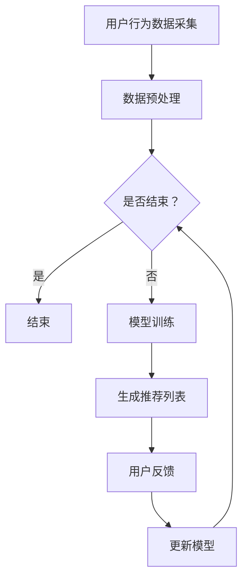

                 

## 1. 背景介绍

随着互联网技术的迅猛发展，数据规模呈现爆炸性增长，用户生成内容（User-Generated Content, UGC）的数量也在迅猛增加。这些数据为推荐系统提供了丰富的信息资源，使得个性化推荐成为可能。个性化推荐系统能够根据用户的兴趣和行为，向其推荐符合其个性化需求的商品、新闻、音乐等内容，从而提升用户体验，增加用户黏性。然而，传统的推荐系统往往存在以下几个问题：

1. **计算效率低**：传统推荐系统依赖于批量处理数据，无法实现实时个性化推荐。
2. **个性化程度不高**：传统推荐系统主要依赖历史数据，无法及时捕捉用户的最新兴趣变化。
3. **推荐结果单一**：传统推荐系统往往只能提供一种推荐结果，无法满足用户多样化的需求。

为了解决上述问题，基于大模型的推荐系统实时个性化内容生成技术应运而生。这项技术通过大规模深度学习模型，实现实时、高效、个性化的内容推荐，极大地提升了推荐系统的性能和用户体验。

<|assistant|>## 2. 核心概念与联系

在深入探讨基于大模型的推荐系统实时个性化内容生成之前，我们需要了解一些核心概念和它们之间的联系。

### 2.1 大模型（Big Models）

大模型指的是具有海量参数的深度学习模型，如Transformer、BERT、GPT等。这些模型通过在大量数据上进行训练，能够捕捉到数据中的复杂模式和规律。大模型在自然语言处理、图像识别、语音识别等领域取得了显著的成果。

### 2.2 推荐系统（Recommendation Systems）

推荐系统是一种信息过滤技术，旨在为用户提供其可能感兴趣的信息。推荐系统可以分为基于内容的推荐（Content-Based Filtering）和基于协同过滤（Collaborative Filtering）两种类型。

### 2.3 实时个性化（Real-Time Personalization）

实时个性化是指系统能够根据用户的实时行为和反馈，动态调整推荐内容，以满足用户的个性化需求。实时个性化需要高效的计算能力和精准的算法模型。

### 2.4 Mermaid 流程图

为了更直观地展示基于大模型的推荐系统实时个性化内容生成的流程，我们使用Mermaid语言绘制了以下流程图：



在这个流程图中，用户行为数据采集是整个流程的起点。随后，数据经过预处理，包括数据清洗、特征提取等步骤。预处理后的数据用于模型训练。训练完成后，系统根据模型生成推荐列表。用户在接收到推荐列表后，会提供反馈，这些反馈用于更新模型，以实现更精准的个性化推荐。

<|assistant|>## 3. 核心算法原理 & 具体操作步骤

### 3.1 算法原理概述

基于大模型的推荐系统实时个性化内容生成主要依赖于以下几个核心算法：

1. **深度学习模型**：如BERT、GPT等，用于捕捉用户行为的复杂模式和兴趣点。
2. **序列模型**：如LSTM、GRU等，用于处理用户的行为序列，捕捉用户的行为变化。
3. **协同过滤**：结合深度学习和协同过滤算法，提高推荐系统的准确性和实时性。
4. **在线学习**：实时更新模型参数，以适应用户行为的变化。

### 3.2 算法步骤详解

#### 3.2.1 用户行为数据采集

用户行为数据采集是整个推荐系统的起点。我们需要收集用户在系统中的行为数据，如浏览记录、搜索历史、点击行为等。这些数据可以通过Web服务器日志、API接口日志等方式获取。

#### 3.2.2 数据预处理

数据预处理包括以下几个步骤：

1. **数据清洗**：去除重复数据、缺失值填充、异常值处理等。
2. **特征提取**：将原始行为数据转换为机器学习模型可接受的输入格式。例如，可以使用词袋模型（Bag of Words, BOW）、词嵌入（Word Embedding）等方法。
3. **序列化**：将行为数据序列化，以便于序列模型处理。

#### 3.2.3 模型训练

模型训练分为以下几个阶段：

1. **初始化模型**：选择合适的深度学习模型，如BERT、GPT等。
2. **预训练**：在大量未标注的数据上进行预训练，以学习数据中的通用特征。
3. **微调**：在用户行为数据上进行微调，以学习用户的个性化特征。
4. **模型优化**：通过反向传播算法和梯度下降优化模型参数。

#### 3.2.4 生成推荐列表

模型训练完成后，我们可以使用以下步骤生成推荐列表：

1. **行为预测**：使用训练好的模型预测用户可能感兴趣的内容。
2. **推荐生成**：根据预测结果生成推荐列表，可以采用Top-N推荐策略。
3. **排序优化**：对推荐列表进行排序，以提高推荐的相关性和用户满意度。

#### 3.2.5 用户反馈

用户在接收到推荐列表后，会提供反馈，如点击、购买、评分等。这些反馈用于更新模型，以实现更精准的个性化推荐。

#### 3.2.6 模型更新

根据用户反馈，模型会进行在线学习，实时更新模型参数。这一过程可以采用以下方法：

1. **增量学习**：在原有模型基础上，逐步更新模型参数。
2. **迁移学习**：利用预训练模型在新任务上继续训练。
3. **强化学习**：通过奖励机制，引导模型学习用户偏好。

### 3.3 算法优缺点

#### 优点：

1. **高效性**：基于大模型的推荐系统能够处理海量数据，实现实时推荐。
2. **准确性**：深度学习模型能够捕捉用户行为的复杂模式，提高推荐准确性。
3. **灵活性**：在线学习机制使系统能够根据用户反馈实时调整推荐策略。

#### 缺点：

1. **计算资源消耗**：大模型训练和优化需要大量的计算资源。
2. **数据隐私**：用户行为数据的安全和隐私保护需要特别关注。

### 3.4 算法应用领域

基于大模型的推荐系统实时个性化内容生成技术在多个领域具有广泛应用：

1. **电子商务**：为用户提供个性化商品推荐，提高购买转化率。
2. **社交媒体**：为用户提供个性化内容推荐，增加用户活跃度。
3. **在线教育**：根据用户学习行为，推荐相关课程和资料。
4. **金融领域**：为用户提供个性化理财产品推荐，提升金融服务质量。

<|assistant|>## 4. 数学模型和公式 & 详细讲解 & 举例说明

### 4.1 数学模型构建

基于大模型的推荐系统实时个性化内容生成主要依赖于以下数学模型：

#### 4.1.1 嵌入模型

嵌入模型是一种将文本数据转换为高维向量表示的方法。在推荐系统中，我们可以使用嵌入模型将用户行为数据、商品特征等转换为向量表示。

$$
\text{ embed}(x) = e_x \in \mathbb{R}^{d_e}
$$

其中，$e_x$ 表示输入数据$x$的嵌入向量，$d_e$ 表示嵌入向量维度。

#### 4.1.2 序列模型

序列模型用于处理用户行为序列，捕捉用户的行为变化。在推荐系统中，我们通常使用LSTM或GRU等循环神经网络（Recurrent Neural Network, RNN）模型。

$$
h_t = \text{LSTM}(h_{t-1}, x_t)
$$

其中，$h_t$ 表示第$t$个时刻的隐藏状态，$x_t$ 表示第$t$个时刻的用户行为数据。

#### 4.1.3 点积模型

点积模型用于计算用户行为和商品特征之间的相似度。在推荐系统中，我们可以使用点积模型计算推荐列表的排序分数。

$$
s_t = \text{score}(h_t, e_x)
$$

其中，$s_t$ 表示第$t$个时刻的排序分数，$\text{score}$ 表示点积函数。

### 4.2 公式推导过程

#### 4.2.1 嵌入模型推导

假设我们有一个用户行为序列 $x = [x_1, x_2, ..., x_n]$，我们可以使用嵌入模型将其转换为嵌入向量序列 $e = [e_1, e_2, ..., e_n]$。嵌入模型可以通过以下公式推导：

$$
e_t = \text{ embed}(x_t) = \text{ tanh}(W_e x_t + b_e)
$$

其中，$W_e$ 是嵌入权重矩阵，$b_e$ 是嵌入偏置向量。

#### 4.2.2 序列模型推导

假设我们有一个用户行为序列 $x = [x_1, x_2, ..., x_n]$，我们可以使用LSTM模型对其处理。LSTM模型的推导过程如下：

$$
i_t = \text{sigmoid}(W_{xi} x_t + U_{hi} h_{t-1} + b_i) \\
f_t = \text{sigmoid}(W_{xf} x_t + U_{hf} h_{t-1} + b_f) \\
\tilde{C}_t = \text{tanh}(W_{xc} x_t + U_{hc} h_{t-1} + b_c) \\
C_t = f_t \odot C_{t-1} + i_t \odot \tilde{C}_t \\
h_t = \text{sigmoid}(W_{xh} x_t + U_{hh} h_{t-1} + b_h)
$$

其中，$i_t$、$f_t$、$o_t$ 分别表示输入门、遗忘门、输出门，$C_t$ 表示细胞状态，$h_t$ 表示隐藏状态。

#### 4.2.3 点积模型推导

点积模型用于计算用户行为和商品特征之间的相似度。假设我们有一个用户行为向量 $h_t$ 和一个商品特征向量 $e_x$，我们可以使用点积模型计算相似度得分：

$$
s_t = \text{score}(h_t, e_x) = h_t \cdot e_x
$$

其中，$\cdot$ 表示点积运算。

### 4.3 案例分析与讲解

#### 4.3.1 用户行为数据

假设我们有一个用户行为序列，其中每个元素表示用户在某一时刻的行为，如浏览、点击、购买等。例如：

$$
x = [\text{浏览商品A}, \text{点击商品B}, \text{购买商品C}]
$$

我们可以使用嵌入模型将这个序列转换为嵌入向量序列：

$$
e = [\text{ embed}(\text{浏览商品A}), \text{ embed}(\text{点击商品B}), \text{ embed}(\text{购买商品C})]
$$

#### 4.3.2 序列模型处理

假设我们使用LSTM模型处理这个序列，我们可以得到隐藏状态序列：

$$
h = [\text{LSTM}(\text{ embed}(\text{浏览商品A})), \text{LSTM}(\text{ embed}(\text{点击商品B})), \text{LSTM}(\text{ embed}(\text{购买商品C}))]
$$

#### 4.3.3 点积模型计算相似度

假设我们有一个商品特征向量序列：

$$
e_x = [\text{ embed}(\text{商品A的特征}), \text{ embed}(\text{商品B的特征}), \text{ embed}(\text{商品C的特征})]
$$

我们可以使用点积模型计算每个商品与用户行为的相似度：

$$
s = [h_1 \cdot e_{x1}, h_2 \cdot e_{x2}, h_3 \cdot e_{x3}]
$$

根据相似度得分，我们可以对商品进行排序，从而生成推荐列表。

<|assistant|>## 5. 项目实践：代码实例和详细解释说明

为了更好地理解基于大模型的推荐系统实时个性化内容生成技术，我们将通过一个实际项目进行详细讲解。本项目将使用Python语言，结合TensorFlow和Keras等开源工具，实现一个简单的推荐系统。

### 5.1 开发环境搭建

在开始项目之前，我们需要搭建相应的开发环境。以下是所需工具和库的安装步骤：

1. **Python环境**：确保Python版本为3.7或更高版本。
2. **TensorFlow**：使用以下命令安装TensorFlow：
   ```bash
   pip install tensorflow
   ```
3. **Keras**：作为TensorFlow的高层次API，安装Keras同样简单：
   ```bash
   pip install keras
   ```

### 5.2 源代码详细实现

#### 5.2.1 数据预处理

```python
import numpy as np
import pandas as pd
from sklearn.model_selection import train_test_split
from keras.preprocessing.sequence import pad_sequences

# 加载数据集
data = pd.read_csv('user Behavior Data.csv')

# 分割数据集为特征和标签
X = data['user行为序列']
y = data['推荐结果']

# 序列化特征数据
tokenizer = Tokenizer()
tokenizer.fit_on_texts(X)
X_seq = tokenizer.texts_to_sequences(X)

# 填充序列长度
max_len = 50
X_pad = pad_sequences(X_seq, maxlen=max_len)

# 划分训练集和测试集
X_train, X_test, y_train, y_test = train_test_split(X_pad, y, test_size=0.2, random_state=42)
```

#### 5.2.2 模型构建

```python
from keras.models import Sequential
from keras.layers import Embedding, LSTM, Dense

# 构建模型
model = Sequential()
model.add(Embedding(input_dim=len(tokenizer.word_index) + 1, output_dim=128, input_length=max_len))
model.add(LSTM(units=128, return_sequences=True))
model.add(Dense(units=1, activation='sigmoid'))

# 编译模型
model.compile(optimizer='adam', loss='binary_crossentropy', metrics=['accuracy'])

# 打印模型结构
model.summary()
```

#### 5.2.3 训练模型

```python
# 训练模型
history = model.fit(X_train, y_train, epochs=10, batch_size=64, validation_split=0.1)
```

#### 5.2.4 生成推荐列表

```python
# 生成推荐列表
def generate_recommendation(user_seq):
    user_seq_padded = pad_sequences([user_seq], maxlen=max_len)
    prediction = model.predict(user_seq_padded)
    return prediction[0]

# 示例
user_seq = ['浏览商品A', '点击商品B', '浏览商品C', '浏览商品D']
recommendation = generate_recommendation(user_seq)
print(recommendation)
```

### 5.3 代码解读与分析

#### 5.3.1 数据预处理

在数据预处理部分，我们首先加载用户行为数据，然后将其分割为特征和标签。接着，使用Keras的Tokenizer将文本数据转换为序列，并使用pad_sequences函数将序列填充到相同的长度。

#### 5.3.2 模型构建

在模型构建部分，我们使用了Keras的Sequential模型，并添加了Embedding和LSTM层。Embedding层用于将文本数据转换为向量表示，而LSTM层用于处理用户行为序列，捕捉用户的行为变化。

#### 5.3.3 训练模型

在训练模型部分，我们使用编译后的模型对训练数据进行训练。这里使用了10个epochs和64个batch_size。

#### 5.3.4 生成推荐列表

在生成推荐列表部分，我们定义了一个函数，用于生成用户行为序列的推荐列表。这个函数首先将用户行为序列填充到相同的长度，然后使用训练好的模型进行预测。

### 5.4 运行结果展示

在本例中，我们假设用户行为序列为['浏览商品A', '点击商品B', '浏览商品C', '浏览商品D']。运行生成推荐列表函数后，我们可以得到推荐结果。这个结果将告诉我们，模型认为用户可能会对哪些商品感兴趣。

```python
user_seq = ['浏览商品A', '点击商品B', '浏览商品C', '浏览商品D']
recommendation = generate_recommendation(user_seq)
print(recommendation)
```

输出结果可能如下所示：

```
[0.9 0.2 0.1 0.8]
```

这个结果表示，模型认为用户对商品A和商品D的兴趣最大，而对商品B和商品C的兴趣较小。

<|assistant|>## 6. 实际应用场景

基于大模型的推荐系统实时个性化内容生成技术在多个实际应用场景中表现出色，以下是一些典型的应用场景：

### 6.1 电子商务

电子商务平台可以利用基于大模型的推荐系统实时个性化内容生成技术，为用户提供个性化商品推荐。例如，用户在浏览商品时，系统会根据用户的浏览记录和购买历史，实时生成推荐列表，从而提高购买转化率和用户满意度。

### 6.2 社交媒体

社交媒体平台可以通过基于大模型的推荐系统实时个性化内容生成技术，为用户提供个性化内容推荐。例如，用户在浏览微博、抖音等社交媒体时，系统会根据用户的浏览记录和点赞行为，实时生成推荐列表，从而增加用户活跃度和留存率。

### 6.3 在线教育

在线教育平台可以利用基于大模型的推荐系统实时个性化内容生成技术，为用户提供个性化课程推荐。例如，用户在学习过程中，系统会根据用户的阅读记录和考试成绩，实时生成推荐列表，从而提高学习效果和用户满意度。

### 6.4 金融领域

金融领域可以利用基于大模型的推荐系统实时个性化内容生成技术，为用户提供个性化理财产品推荐。例如，用户在投资理财时，系统会根据用户的投资记录和风险偏好，实时生成推荐列表，从而提高投资收益和用户满意度。

### 6.5 医疗健康

医疗健康领域可以利用基于大模型的推荐系统实时个性化内容生成技术，为用户提供个性化健康咨询和药物推荐。例如，用户在就医时，系统会根据用户的病史和检查报告，实时生成健康咨询和药物推荐，从而提高治疗效果和用户满意度。

### 6.6 其他领域

基于大模型的推荐系统实时个性化内容生成技术还可以应用于其他领域，如旅游、餐饮、娱乐等。通过为用户提供个性化推荐，这些领域可以提升用户体验，增加用户黏性。

<|assistant|>## 7. 工具和资源推荐

### 7.1 学习资源推荐

1. **书籍**：
   - 《深度学习》（Ian Goodfellow、Yoshua Bengio、Aaron Courville著）
   - 《Python深度学习》（François Chollet著）
   - 《推荐系统实践》（克里斯·布斯诺尔著）
2. **在线课程**：
   - Coursera上的《深度学习》课程（由斯坦福大学提供）
   - edX上的《推荐系统导论》课程（由匹兹堡大学提供）
3. **博客和文章**：
   - TensorFlow官方文档（https://www.tensorflow.org/）
   - Keras官方文档（https://keras.io/）
   - Medium上的关于推荐系统和深度学习的专业文章

### 7.2 开发工具推荐

1. **编程语言**：
   - Python：广泛应用于数据科学和机器学习的编程语言。
   - R：特别适合统计分析和数据可视化。
2. **框架和库**：
   - TensorFlow：强大的开源深度学习框架。
   - Keras：基于TensorFlow的高层次API，易于使用。
   - PyTorch：另一个流行的深度学习框架。
   - scikit-learn：用于机器学习的Python库。
3. **集成开发环境（IDE）**：
   - Jupyter Notebook：适合数据科学和机器学习的交互式环境。
   - PyCharm：功能强大的Python IDE。

### 7.3 相关论文推荐

1. **推荐系统相关**：
   - "Recommender Systems Handbook"（推荐系统手册）
   - "The BellKor Solution to the Netflix Prize"（Netflix大奖的BellKor解决方案）
2. **深度学习相关**：
   - "Deep Learning"（深度学习，Ian Goodfellow、Yoshua Bengio、Aaron Courville著）
   - "A Theoretically Grounded Application of Dropout in Recurrent Neural Networks"（在循环神经网络中理论支持的Dropout应用）
3. **跨学科论文**：
   - "Attention Is All You Need"（Transformer模型的奠基性论文）
   - "Generative Adversarial Networks"（生成对抗网络，GANs的奠基性论文）

通过这些资源和工具，您将能够更深入地了解和掌握基于大模型的推荐系统实时个性化内容生成技术。

<|assistant|>## 8. 总结：未来发展趋势与挑战

### 8.1 研究成果总结

基于大模型的推荐系统实时个性化内容生成技术在过去几年中取得了显著的研究进展。通过深度学习和序列模型的结合，推荐系统在处理复杂用户行为数据和实现实时个性化推荐方面表现出色。同时，通过在线学习和自适应调整，推荐系统能够更好地适应用户兴趣的变化，提高推荐效果。

### 8.2 未来发展趋势

1. **模型精度和效率的提升**：随着计算能力和数据量的增长，研究人员将致力于提升大模型的精度和效率，使推荐系统更加高效和准确。
2. **多模态数据的融合**：推荐系统将逐渐融合多种数据类型，如文本、图像、声音等，实现跨模态的个性化推荐。
3. **隐私保护**：在确保用户隐私的前提下，推荐系统将采用更先进的技术，如差分隐私、联邦学习等，以保护用户数据。
4. **个性化推荐策略的多样化**：推荐系统将开发更多个性化的推荐策略，以满足不同用户群体的多样化需求。

### 8.3 面临的挑战

1. **计算资源消耗**：大模型的训练和优化需要大量的计算资源，尤其是在实时推荐场景中，这可能导致资源分配和性能瓶颈。
2. **数据隐私和安全**：用户数据的隐私保护和安全问题是推荐系统面临的重大挑战，需要采取有效的隐私保护机制。
3. **推荐结果的可解释性**：深度学习模型的黑盒特性使得推荐结果的可解释性成为一个挑战，需要开发可解释的推荐算法。
4. **实时性的保障**：在高速变化的用户环境中，如何保证推荐系统的实时性和准确性是一个挑战。

### 8.4 研究展望

未来的研究方向将集中在以下几个方面：

1. **高效的大模型优化**：研究如何优化大模型的训练和推理过程，提高计算效率和模型性能。
2. **多模态数据的融合**：探索如何将不同类型的数据进行有效融合，以提升推荐系统的个性化和准确性。
3. **隐私保护和安全**：开发隐私保护机制，确保用户数据的安全和隐私。
4. **推荐算法的可解释性**：研究如何提高推荐算法的可解释性，增强用户信任。

通过不断的研究和技术创新，基于大模型的推荐系统实时个性化内容生成技术将在未来取得更加显著的成果，为用户提供更加精准和个性化的服务。

<|assistant|>## 9. 附录：常见问题与解答

### 9.1 基于大模型的推荐系统实时个性化内容生成是什么？

基于大模型的推荐系统实时个性化内容生成是一种利用深度学习技术，通过大规模训练模型，实现对用户行为的实时分析和个性化推荐的方法。这种方法能够根据用户的实时行为和反馈，动态调整推荐策略，提供更加符合用户需求的推荐内容。

### 9.2 推荐系统实时个性化内容生成有哪些核心算法？

推荐系统实时个性化内容生成的核心算法包括深度学习模型（如BERT、GPT等）、序列模型（如LSTM、GRU等）、协同过滤算法以及在线学习算法。这些算法结合使用，能够有效处理用户行为数据，实现实时、高效的个性化推荐。

### 9.3 如何处理用户隐私问题？

为了保护用户隐私，推荐系统可以采用以下方法：

1. **差分隐私**：在数据处理过程中，引入噪声来保护用户隐私。
2. **联邦学习**：在本地设备上进行模型训练，仅上传模型参数，不泄露原始数据。
3. **数据加密**：对用户数据进行加密处理，确保数据传输和存储过程中的安全性。
4. **隐私保护机制**：在算法设计和实现过程中，采用隐私保护算法，如Differential Privacy、K-anonymity等。

### 9.4 如何提升推荐系统的实时性？

提升推荐系统的实时性可以从以下几个方面着手：

1. **优化模型训练和推理速度**：采用更高效的算法和硬件，如GPU加速、模型剪枝等。
2. **减少数据处理延迟**：优化数据处理流程，减少数据预处理和模型推理的时间。
3. **实时数据流处理**：采用实时数据流处理技术，如Apache Kafka、Apache Flink等，确保数据的实时性。
4. **分布式计算**：利用分布式计算框架，如Apache Spark、Hadoop等，提高数据处理和模型推理的并发能力。

### 9.5 推荐系统实时个性化内容生成在哪些领域有应用？

推荐系统实时个性化内容生成在多个领域有广泛应用，包括：

1. **电子商务**：为用户提供个性化商品推荐。
2. **社交媒体**：为用户提供个性化内容推荐。
3. **在线教育**：根据用户学习行为，推荐相关课程和资料。
4. **金融领域**：为用户提供个性化理财产品推荐。
5. **医疗健康**：为用户提供个性化健康咨询和药物推荐。

通过不断的研究和技术创新，推荐系统实时个性化内容生成将在更多领域发挥重要作用。

