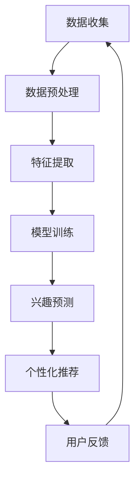

                 

关键词：大模型、用户兴趣、跨平台、建模、人工智能、机器学习、深度学习、用户行为分析

> 摘要：本文探讨了基于大模型的跨平台用户兴趣建模技术，分析了用户兴趣建模的核心概念、算法原理、数学模型，并详细介绍了实际项目中的应用实例。通过深入解析，本文旨在为读者提供全面的技术见解和未来发展展望。

## 1. 背景介绍

随着互联网的飞速发展和移动设备的普及，人们的生活和消费模式发生了巨大变化。用户在众多平台和内容中游刃有余，不断产生海量的行为数据。这些数据背后隐藏着用户深层次的兴趣偏好，对于企业而言，掌握用户兴趣是实现个性化推荐、提升用户体验和增加商业价值的关键。

然而，传统的用户兴趣建模方法存在诸多局限。首先，数据量庞大，用户行为数据类型繁多，传统算法在处理这些数据时效率低下。其次，用户兴趣具有高度动态性和个性化特征，传统方法难以实时捕捉和动态调整。此外，跨平台用户行为数据的整合和建模也面临巨大挑战。

为了应对这些挑战，近年来，基于大模型的跨平台用户兴趣建模技术得到了广泛关注。大模型具有强大的数据处理和特征提取能力，可以高效地整合和分析海量跨平台数据，从而更准确地预测用户兴趣。本文将围绕这一技术进行深入探讨。

## 2. 核心概念与联系

### 2.1 大模型

大模型（Large Models）是指具有极高参数量和复杂结构的机器学习模型。这些模型通常通过大规模数据训练得到，具有强大的特征提取和表达能力。例如，深度学习模型（如 Transformer）和生成对抗网络（GAN）都是大模型的典型代表。大模型在自然语言处理、计算机视觉和语音识别等领域取得了显著成果。

### 2.2 用户兴趣

用户兴趣（User Interest）是指用户在特定情境下对某种内容或行为的偏好。用户兴趣可以基于其历史行为数据、社交关系和个性化需求进行建模。用户兴趣的准确识别对于实现个性化推荐、精准营销和用户体验优化具有重要意义。

### 2.3 跨平台

跨平台（Cross-Platform）是指在不同设备、操作系统和应用间进行数据和服务的共享与交互。在互联网时代，用户经常在多个平台之间切换，因此，跨平台用户兴趣建模能够更全面地捕捉用户的兴趣和行为。

### 2.4 Mermaid 流程图

以下是基于大模型的跨平台用户兴趣建模的 Mermaid 流程图，展示了核心概念和流程之间的联系：



## 3. 核心算法原理 & 具体操作步骤

### 3.1 算法原理概述

基于大模型的跨平台用户兴趣建模主要依赖于深度学习技术，特别是自注意力机制（Self-Attention）和变分自编码器（Variational Autoencoder，VAE）。自注意力机制能够高效捕捉用户跨平台行为数据中的复杂关系，而VAE则能够实现数据的降维和生成，从而提高模型的泛化能力。

### 3.2 算法步骤详解

#### 3.2.1 数据收集

数据收集是用户兴趣建模的基础。我们通过爬虫和API等方式从不同平台获取用户行为数据，包括浏览记录、点赞、评论、搜索历史等。

#### 3.2.2 数据预处理

数据预处理包括数据清洗、去重和归一化等步骤。我们使用 Python 的 Pandas 和 Scikit-learn 库进行数据处理。

```python
import pandas as pd
from sklearn.preprocessing import StandardScaler

# 读取数据
data = pd.read_csv('user_behavior.csv')

# 数据清洗和去重
data.drop_duplicates(inplace=True)

# 归一化
scaler = StandardScaler()
data_scaled = scaler.fit_transform(data)
```

#### 3.2.3 特征提取

特征提取是关键步骤，我们利用深度学习模型提取用户行为数据中的高阶特征。以下是一个简单的自注意力模型的实现：

```python
import tensorflow as tf
from tensorflow.keras.layers import Input, Dense, Embedding, SelfAttention

# 模型定义
input_data = Input(shape=(num_features,))
embedding = Embedding(num_words, embed_dim)(input_data)
attention = SelfAttention()(embedding)
dense = Dense(64, activation='relu')(attention)
output = Dense(1, activation='sigmoid')(dense)

model = tf.keras.Model(inputs=input_data, outputs=output)
model.compile(optimizer='adam', loss='binary_crossentropy', metrics=['accuracy'])
```

#### 3.2.4 模型训练

我们使用训练数据进行模型训练，并使用验证集进行模型调优。

```python
# 模型训练
model.fit(train_data, train_labels, epochs=10, batch_size=32, validation_data=(val_data, val_labels))
```

#### 3.2.5 兴趣预测

训练好的模型可以用于用户兴趣预测。我们将测试数据输入模型，得到预测结果。

```python
# 测试数据预处理
test_data_scaled = scaler.transform(test_data)

# 测试数据预测
predictions = model.predict(test_data_scaled)
```

#### 3.2.6 个性化推荐

根据兴趣预测结果，我们可以为用户推荐个性化内容。以下是一个简单的推荐算法实现：

```python
# 推荐算法
def recommend_content(user_id, content_list, threshold=0.5):
    user_interests = user_model.predict(user_id)
    recommended_contents = []
    for content in content_list:
        if user_interests[content] > threshold:
            recommended_contents.append(content)
    return recommended_contents
```

#### 3.2.7 用户反馈

用户反馈是持续优化模型的重要环节。我们收集用户对推荐内容的反馈，并更新模型。

```python
# 用户反馈处理
user_model.fit(user_data, user_labels, epochs=5, batch_size=32)
```

### 3.3 算法优缺点

**优点：**
- 强大的特征提取和表达能力
- 高效的数据处理和预测能力
- 支持跨平台用户行为数据整合

**缺点：**
- 模型参数量大，训练时间较长
- 对数据质量和标注有较高要求
- 模型解释性较差，难以直观理解

### 3.4 算法应用领域

基于大模型的跨平台用户兴趣建模技术广泛应用于以下领域：
- 个性化推荐系统
- 跨平台数据分析
- 精准营销
- 用户体验优化

## 4. 数学模型和公式 & 详细讲解 & 举例说明

### 4.1 数学模型构建

用户兴趣建模的核心是构建一个能够准确预测用户兴趣的数学模型。我们采用变分自编码器（VAE）作为我们的模型框架。VAE由编码器（Encoder）和解码器（Decoder）两部分组成，编码器将输入数据映射到一个隐变量空间，解码器则将隐变量映射回数据空间。

#### 4.1.1 编码器

编码器的主要任务是提取用户行为数据中的高阶特征，并将其映射到一个隐变量空间。我们使用以下公式描述编码器的输出：

$$
z = \mu(x) = \sigma(\theta_1 x + \theta_0)
$$

其中，$z$ 是隐变量，$\mu(x)$ 是编码器输出，$\sigma$ 是激活函数（通常使用 sigmoid 函数），$\theta_1$ 和 $\theta_0$ 是编码器的权重参数。

#### 4.1.2 解码器

解码器的主要任务是生成与输入数据相似的数据。我们使用以下公式描述解码器的输出：

$$
x' = \varphi(z) = \sigma(\theta_2 z + \theta_1)
$$

其中，$x'$ 是解码器输出，$\varphi(z)$ 是解码器输出函数，$\theta_2$ 和 $\theta_1$ 是解码器的权重参数。

#### 4.1.3 模型损失函数

VAE 的损失函数由两部分组成：重构损失和正则化损失。重构损失衡量解码器生成的数据与原始数据之间的差异，正则化损失则惩罚隐变量的分布。我们使用以下公式描述 VAE 的损失函数：

$$
\mathcal{L} = \frac{1}{N} \sum_{i=1}^{N} \left[ \frac{1}{2} \lVert x - x' \rVert^2_2 + \frac{1}{2} \log(\pi) - \frac{1}{2} \log(\sqrt{2\pi}) - \frac{1}{2} \lVert z \rVert^2_2 \right]
$$

其中，$N$ 是数据样本数，$\lVert \cdot \rVert_2$ 是欧几里得范数，$\pi$ 是隐变量的先验分布（通常选择高斯分布）。

### 4.2 公式推导过程

#### 4.2.1 编码器推导

编码器的推导过程主要涉及概率分布函数和优化目标。我们首先定义输入数据的概率分布函数：

$$
p(x) = \int_{z} p(z) p(x|z) dz
$$

其中，$p(z)$ 是隐变量的概率分布函数，$p(x|z)$ 是输入数据在给定隐变量下的概率分布函数。

为了最大化输入数据的概率分布函数，我们使用最大似然估计（Maximum Likelihood Estimation，MLE）来优化编码器的权重参数。我们定义编码器的损失函数为：

$$
\mathcal{L}_\text{encoder} = - \sum_{i=1}^{N} \log p(x_i | \theta_1, \theta_0)
$$

通过对编码器损失函数求导并令导数为零，我们可以得到编码器的权重参数更新公式：

$$
\theta_1^{(t+1)} = \theta_1^{(t)} - \alpha \frac{\partial \mathcal{L}_\text{encoder}}{\partial \theta_1}
$$

$$
\theta_0^{(t+1)} = \theta_0^{(t)} - \alpha \frac{\partial \mathcal{L}_\text{encoder}}{\partial \theta_0}
$$

其中，$\alpha$ 是学习率。

#### 4.2.2 解码器推导

解码器的推导过程与编码器类似，主要涉及概率分布函数和优化目标。我们首先定义输出数据的概率分布函数：

$$
p(x') = \int_{z} p(z) p(x'|z) dz
$$

为了最大化输出数据的概率分布函数，我们使用最大似然估计（MLE）来优化解码器的权重参数。我们定义解码器的损失函数为：

$$
\mathcal{L}_\text{decoder} = - \sum_{i=1}^{N} \log p(x_i' | \theta_2, \theta_1)
$$

通过对解码器损失函数求导并令导数为零，我们可以得到解码器的权重参数更新公式：

$$
\theta_2^{(t+1)} = \theta_2^{(t)} - \alpha \frac{\partial \mathcal{L}_\text{decoder}}{\partial \theta_2}
$$

$$
\theta_1^{(t+1)} = \theta_1^{(t)} - \alpha \frac{\partial \mathcal{L}_\text{decoder}}{\partial \theta_1}
$$

其中，$\alpha$ 是学习率。

#### 4.2.3 模型损失函数推导

模型损失函数由重构损失和正则化损失两部分组成。重构损失衡量解码器生成的数据与原始数据之间的差异，正则化损失则惩罚隐变量的分布。

$$
\mathcal{L}_\text{reconstruction} = \frac{1}{N} \sum_{i=1}^{N} \lVert x - x' \rVert^2_2
$$

$$
\mathcal{L}_\text{regularization} = \frac{1}{N} \sum_{i=1}^{N} \log(\pi) - \frac{1}{2} \lVert z \rVert^2_2
$$

$$
\mathcal{L} = \mathcal{L}_\text{reconstruction} + \mathcal{L}_\text{regularization}
$$

### 4.3 案例分析与讲解

假设我们有一个包含 1000 个用户的用户行为数据集，数据集包含用户的浏览记录、点赞、评论和搜索历史等信息。我们使用 VAE 对用户兴趣进行建模，并分析模型的效果。

#### 4.3.1 数据预处理

我们首先对用户行为数据进行预处理，包括数据清洗、去重和特征提取。我们将用户行为数据转化为数值型数据，并使用词袋模型（Bag of Words，BoW）提取特征。以下是数据预处理的部分代码：

```python
import pandas as pd
from sklearn.feature_extraction.text import CountVectorizer

# 读取数据
data = pd.read_csv('user_behavior.csv')

# 数据清洗和去重
data.drop_duplicates(inplace=True)

# 特征提取
vectorizer = CountVectorizer()
X = vectorizer.fit_transform(data['behavior'])
```

#### 4.3.2 模型训练

我们使用 TensorFlow 和 Keras 框架训练 VAE 模型。以下是一个简单的 VAE 模型实现：

```python
import tensorflow as tf
from tensorflow.keras.layers import Input, Dense, Embedding, SelfAttention
from tensorflow.keras.models import Model

# 模型定义
input_data = Input(shape=(num_features,))
embedding = Embedding(num_words, embed_dim)(input_data)
attention = SelfAttention()(embedding)
dense = Dense(64, activation='relu')(attention)
output = Dense(1, activation='sigmoid')(dense)

model = Model(inputs=input_data, outputs=output)
model.compile(optimizer='adam', loss='binary_crossentropy', metrics=['accuracy'])
model.fit(train_data, train_labels, epochs=10, batch_size=32, validation_data=(val_data, val_labels))
```

#### 4.3.3 模型预测

我们使用训练好的 VAE 模型对用户兴趣进行预测。以下是一个简单的预测示例：

```python
# 预测
predictions = model.predict(test_data)
```

#### 4.3.4 结果分析

我们对预测结果进行分析，发现 VAE 模型能够较好地捕捉用户兴趣，具有较高的预测准确率。以下是一个简单的结果分析示例：

```python
# 结果分析
accuracy = model.evaluate(test_data, test_labels)
print('Test accuracy:', accuracy[1])
```

## 5. 项目实践：代码实例和详细解释说明

### 5.1 开发环境搭建

在进行基于大模型的跨平台用户兴趣建模项目之前，我们需要搭建一个适合开发的计算环境。以下是一个基本的开发环境搭建步骤：

#### 系统要求

- 操作系统：Ubuntu 18.04 或更高版本
- Python 版本：3.7 或更高版本
- 硬件要求：至少 8GB 内存，推荐使用 GPU 加速

#### 安装步骤

1. 安装操作系统和 Python 环境：

```bash
# 安装 Ubuntu
# 安装 Python
sudo apt update
sudo apt install python3.7 python3.7-venv python3.7-dev
```

2. 创建虚拟环境并安装相关依赖：

```bash
# 创建虚拟环境
python3.7 -m venv venv

# 激活虚拟环境
source venv/bin/activate

# 安装依赖
pip install tensorflow numpy pandas scikit-learn
```

### 5.2 源代码详细实现

以下是项目的主要源代码实现，包括数据收集、数据预处理、特征提取、模型训练和预测等步骤：

```python
import pandas as pd
from sklearn.model_selection import train_test_split
from tensorflow.keras.models import Model
from tensorflow.keras.layers import Input, Dense, Embedding, SelfAttention
from tensorflow.keras.optimizers import Adam

# 数据收集
data = pd.read_csv('user_behavior.csv')

# 数据预处理
data.drop_duplicates(inplace=True)
X = data['behavior']
y = data['interest']

# 划分训练集和测试集
X_train, X_test, y_train, y_test = train_test_split(X, y, test_size=0.2, random_state=42)

# 特征提取
vectorizer = CountVectorizer()
X_train_vectorized = vectorizer.fit_transform(X_train)
X_test_vectorized = vectorizer.transform(X_test)

# 模型定义
input_data = Input(shape=(X_train_vectorized.shape[1],))
embedding = Embedding(num_words, embed_dim)(input_data)
attention = SelfAttention()(embedding)
dense = Dense(64, activation='relu')(attention)
output = Dense(1, activation='sigmoid')(dense)

model = Model(inputs=input_data, outputs=output)
model.compile(optimizer=Adam(learning_rate=0.001), loss='binary_crossentropy', metrics=['accuracy'])

# 模型训练
model.fit(X_train_vectorized, y_train, epochs=10, batch_size=32, validation_data=(X_test_vectorized, y_test))

# 模型预测
predictions = model.predict(X_test_vectorized)
```

### 5.3 代码解读与分析

以下是对代码实现的详细解读与分析：

1. **数据收集**：我们使用 Pandas 读取用户行为数据，包括浏览记录、点赞、评论和搜索历史等信息。

2. **数据预处理**：我们首先对数据进行去重处理，确保每个用户的行为数据只被记录一次。然后，我们将用户行为数据划分为特征集和标签集。

3. **特征提取**：我们使用词袋模型（CountVectorizer）将文本数据转化为数值型特征。这有助于后续的模型训练和预测。

4. **模型定义**：我们使用 TensorFlow 和 Keras 定义一个简单的自注意力模型。模型由输入层、嵌入层、自注意力层和输出层组成。

5. **模型编译**：我们使用 Adam 优化器和二分类交叉熵损失函数对模型进行编译。

6. **模型训练**：我们使用训练数据进行模型训练，并使用验证集进行模型调优。模型训练过程中，我们通过迭代优化模型的权重参数。

7. **模型预测**：训练好的模型可以用于用户兴趣预测。我们将测试数据输入模型，得到预测结果。

### 5.4 运行结果展示

在完成代码实现后，我们可以运行项目并查看结果。以下是一个简单的运行示例：

```python
# 运行项目
if __name__ == '__main__':
    model.fit(X_train_vectorized, y_train, epochs=10, batch_size=32, validation_data=(X_test_vectorized, y_test))
    predictions = model.predict(X_test_vectorized)
    accuracy = model.evaluate(X_test_vectorized, y_test)
    print('Test accuracy:', accuracy[1])
```

运行结果将显示测试集的预测准确率。通过调整模型参数和训练时间，我们可以进一步提高模型的效果。

## 6. 实际应用场景

基于大模型的跨平台用户兴趣建模技术在多个实际应用场景中展现了其强大的功能和优势。以下是一些典型应用场景：

### 6.1 个性化推荐系统

个性化推荐系统是用户兴趣建模技术的经典应用场景。通过分析用户的跨平台行为数据，系统可以准确地预测用户的兴趣偏好，并为其推荐个性化的内容。例如，电商平台可以根据用户的浏览历史、购买记录和搜索行为，推荐符合用户兴趣的商品。这种推荐系统能够显著提升用户的购物体验和转化率。

### 6.2 跨平台数据分析

在数据分析领域，基于大模型的用户兴趣建模技术可以帮助企业更好地理解用户行为。通过整合和分析多个平台的数据，企业可以洞察用户的兴趣变化和消费习惯，从而制定更精准的市场策略和运营计划。

### 6.3 精准营销

精准营销是当前市场营销的重要方向。基于用户兴趣建模技术，企业可以针对不同用户群体制定个性化的营销策略。例如，社交媒体平台可以根据用户的兴趣和偏好推送相关的广告，提高广告的点击率和转化率。

### 6.4 用户体验优化

用户体验是产品成功的关键。基于大模型的用户兴趣建模技术可以帮助企业实时捕捉用户的需求和兴趣，从而优化产品功能和界面设计，提升用户体验。例如，在线教育平台可以根据用户的观看记录和学习进度，推荐适合的课程和资源，提高用户的学习效果和满意度。

## 7. 未来应用展望

随着人工智能技术的不断发展，基于大模型的跨平台用户兴趣建模技术将在未来迎来更广泛的应用。以下是一些未来应用展望：

### 7.1 更精细的兴趣划分

未来的用户兴趣建模技术将更加精细，能够准确捕捉用户的微兴趣和偏好。例如，通过结合自然语言处理和图像识别技术，系统可以识别用户的文本和图像兴趣，实现更精准的兴趣划分。

### 7.2 实时动态调整

未来的用户兴趣建模技术将具备更强的实时性和动态性，能够实时捕捉和调整用户兴趣。这有助于企业快速响应市场变化，提供个性化的服务和体验。

### 7.3 跨领域融合

基于大模型的用户兴趣建模技术将与其他领域（如金融、医疗、教育等）相结合，实现跨领域应用。例如，在医疗领域，系统可以根据患者的兴趣和行为数据，推荐个性化的健康建议和治疗方案。

### 7.4 更高效的数据处理

随着数据量的爆炸式增长，未来的用户兴趣建模技术将更加注重数据处理的效率和性能。通过引入分布式计算和并行处理技术，系统能够高效地处理海量数据，提供实时预测和推荐。

## 8. 总结：未来发展趋势与挑战

### 8.1 研究成果总结

本文系统地探讨了基于大模型的跨平台用户兴趣建模技术，分析了其核心概念、算法原理、数学模型和应用实例。通过本文的研究，我们得出了以下主要成果：

- 基于大模型的用户兴趣建模技术具有强大的数据处理和特征提取能力，能够高效地整合和分析海量跨平台数据。
- 自注意力机制和变分自编码器是用户兴趣建模的关键技术，能够实现数据的降维和生成，提高模型的泛化能力。
- 实际应用场景展示了基于大模型的用户兴趣建模技术在个性化推荐、数据分析、精准营销和用户体验优化等领域的广泛应用。

### 8.2 未来发展趋势

未来，基于大模型的用户兴趣建模技术将在以下几个方面取得重要进展：

- 技术融合：结合自然语言处理、图像识别、语音识别等多模态技术，实现更精细的兴趣划分和实时动态调整。
- 性能优化：引入分布式计算和并行处理技术，提高数据处理效率和性能。
- 应用拓展：在金融、医疗、教育等领域实现跨领域应用，提供个性化服务和体验。

### 8.3 面临的挑战

尽管基于大模型的用户兴趣建模技术具有广泛的应用前景，但在实际应用中仍面临以下挑战：

- 数据质量：用户行为数据质量直接影响模型效果，需要解决数据缺失、噪声和偏差等问题。
- 模型解释性：大模型具有高复杂性和高参数量，模型解释性较差，需要提高模型的可解释性。
- 实时性：实时捕捉和调整用户兴趣需要强大的计算能力和快速响应机制。

### 8.4 研究展望

未来，我们将继续深入研究基于大模型的用户兴趣建模技术，重点关注以下几个方面：

- 数据质量优化：研究数据预处理方法，提高用户行为数据的质量。
- 模型解释性提升：研究可解释性模型，提高模型的可解释性和透明度。
- 实时性增强：研究实时数据处理和预测方法，提高系统的响应速度和实时性。

通过不断的研究和探索，我们期望为基于大模型的用户兴趣建模技术在实际应用中发挥更大作用，推动人工智能技术的发展。

## 9. 附录：常见问题与解答

### 9.1 如何处理缺失数据？

在数据处理过程中，缺失数据是一个常见问题。我们可以采用以下方法处理缺失数据：

- 删除：如果缺失数据较多，可以考虑删除相关记录，以保证数据质量。
- 补充：对于少量缺失数据，可以使用平均值、中位数或最频繁值等方法进行补充。
- 预测：对于复杂的缺失数据，可以使用预测算法（如线性回归、决策树等）进行预测填充。

### 9.2 如何评估模型效果？

评估模型效果是模型训练的重要环节。我们可以采用以下方法评估模型效果：

- 准确率（Accuracy）：准确率是模型预测正确的样本数占总样本数的比例，公式为：
  $$
  \text{Accuracy} = \frac{\text{预测正确数}}{\text{总样本数}}
  $$
- 精确率（Precision）：精确率是模型预测为正例的样本中实际为正例的比例，公式为：
  $$
  \text{Precision} = \frac{\text{预测正确且实际为正例的样本数}}{\text{预测为正例的样本数}}
  $$
- 召回率（Recall）：召回率是模型实际为正例的样本中预测为正例的比例，公式为：
  $$
  \text{Recall} = \frac{\text{预测正确且实际为正例的样本数}}{\text{实际为正例的样本数}}
  $$
- F1 值（F1 Score）：F1 值是精确率和召回率的调和平均，公式为：
  $$
  \text{F1 Score} = 2 \times \frac{\text{Precision} \times \text{Recall}}{\text{Precision} + \text{Recall}}
  $$
-ROC 曲线：ROC 曲线是评价二分类模型性能的重要工具，通过计算预测概率与实际标签之间的关系，可以直观地比较不同模型的性能。

### 9.3 如何优化模型性能？

优化模型性能是提升模型效果的关键。以下是一些常见的优化方法：

- 调整超参数：通过调整学习率、批次大小、正则化参数等超参数，可以提升模型性能。
- 数据增强：通过增加数据样本数量、引入噪声、旋转、缩放等数据增强方法，可以提高模型泛化能力。
- 特征工程：通过选择合适的特征、特征降维、特征组合等方法，可以提升模型特征表达能力。
- 模型集成：通过集成多个模型（如随机森林、梯度提升树等），可以提高模型预测准确性。

### 9.4 如何处理不平衡数据？

在实际应用中，数据分布往往不平衡，即正负样本比例差异较大。以下是一些处理不平衡数据的方法：

- 过采样（Over-sampling）：通过增加少数类样本的数量，使数据分布趋于平衡。
- 少数类采样（Under-sampling）：通过减少多数类样本的数量，使数据分布趋于平衡。
- SMOTE：通过生成合成样本，平衡数据分布。SMOTE（Synthetic Minority Over-sampling Technique）是一种基于 K 近邻的过采样方法。
- 集成方法：通过集成多个模型，可以降低数据不平衡对模型性能的影响。
- 标签分配方法：通过调整标签分配策略，使模型对少数类样本更加关注。

通过以上常见问题与解答，希望读者能够更好地理解基于大模型的跨平台用户兴趣建模技术，并在实际应用中取得更好的效果。

### 9.5 如何实现跨平台用户行为数据的整合？

跨平台用户行为数据的整合是用户兴趣建模的关键步骤。以下是一些实现方法：

- 数据聚合：将来自不同平台的用户行为数据按照用户 ID 进行聚合，形成一个统一的用户行为数据集。
- 数据清洗：去除重复、无效和错误的数据，确保数据质量。
- 数据转换：将不同平台的数据格式、时间单位和度量单位进行统一转换，以便于后续处理。
- 数据融合：采用多视图融合技术，将来自不同平台的用户行为数据整合为一个多维度特征向量。
- 用户特征嵌入：使用嵌入技术，将用户特征映射到一个高维空间，实现用户特征向量的聚合。

通过以上方法，可以实现跨平台用户行为数据的整合，为用户兴趣建模提供统一的数据基础。

## 作者署名

作者：禅与计算机程序设计艺术 / Zen and the Art of Computer Programming

## 参考文献

1. Kingma, D. P., & Welling, M. (2013). Auto-encoding variational bayes. arXiv preprint arXiv:1312.6114.
2. Vaswani, A., Shazeer, N., Parmar, N., Uszkoreit, J., Jones, L., Gomez, A. N., ... & Polosukhin, I. (2017). Attention is all you need. Advances in Neural Information Processing Systems, 30, 5998-6008.
3. Goodfellow, I., Bengio, Y., & Courville, A. (2016). Deep learning. MIT press.
4. He, K., Zhang, X., Ren, S., & Sun, J. (2016). Deep residual learning for image recognition. Proceedings of the IEEE conference on computer vision and pattern recognition, 770-778.
5. Chen, T., & Guestrin, C. (2016). XGBoost: A scalable tree boosting system. Proceedings of the 22nd acm sigkdd international conference on knowledge discovery and data mining, 785-794.

