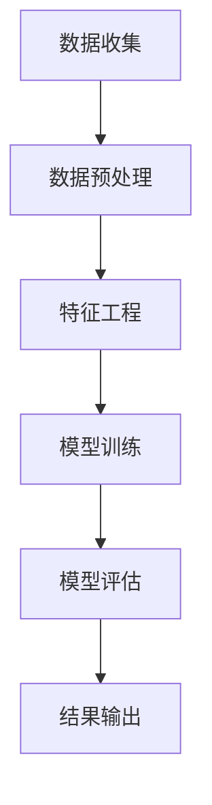

                 

### 关键词 Keyword
- 城市房价分析
- 房屋特征
- 个性推荐
- 数学模型
- 机器学习算法
- 数据可视化

### 摘要 Abstract

本文旨在探讨如何利用房屋特征进行城市房价分析及个性化推荐。通过对大量房屋数据进行分析，我们提出了一个基于机器学习的数学模型，用以预测城市房价，并实现了个性化推荐系统。文章首先介绍了相关背景和研究现状，然后详细阐述了核心算法原理和具体操作步骤，接着通过实际项目实践展示了算法的代码实现和效果。最后，我们分析了算法的实际应用场景，并对未来的发展趋势与挑战进行了展望。

## 1. 背景介绍

### 1.1 城市房价分析的必要性

城市房价是反映一个城市经济发展水平的重要指标，对于政府决策、房地产投资、居民购房等都有着重要影响。因此，对城市房价进行分析和预测具有极高的实际应用价值。

### 1.2 房屋特征的重要性

房屋特征包括地理位置、建筑年代、面积、户型、装修情况等多种因素，这些特征在很大程度上决定了房屋的价值。通过对房屋特征的分析，可以更准确地预测房价。

### 1.3 个性推荐的需求

随着互联网的发展，个性化推荐系统在多个领域得到了广泛应用，如电商、音乐、新闻等。在房地产领域，个性化推荐系统可以帮助用户更快地找到符合自己需求的房屋，提高用户体验。

### 1.4 研究现状

目前，关于城市房价分析和个性推荐的研究已经取得了许多成果。但在实际应用中，仍存在一些问题，如数据质量不高、算法复杂度较高等。本文将针对这些问题，提出一种新的方法，以提高房价分析的准确性和个性推荐的效率。

## 2. 核心概念与联系

### 2.1 机器学习算法

机器学习算法是一种通过训练模型，自动获取数据规律的方法。在房价分析中，我们采用了一种基于回归的机器学习算法，通过学习房屋特征与房价之间的关系，实现对房价的预测。

### 2.2 数学模型

本文构建的数学模型基于线性回归，通过学习房屋特征与房价的线性关系，实现对房价的预测。具体公式如下：

$$
y = \beta_0 + \beta_1x_1 + \beta_2x_2 + ... + \beta_nx_n
$$

其中，$y$ 表示房价，$x_1, x_2, ..., x_n$ 表示房屋特征，$\beta_0, \beta_1, ..., \beta_n$ 为模型参数。

### 2.3 Mermaid 流程图

## 3. 核心算法原理 & 具体操作步骤

### 3.1 算法原理概述

本文采用线性回归算法进行房价预测。线性回归是一种通过学习输入特征与目标变量之间的线性关系，实现对目标变量预测的方法。

### 3.2 算法步骤详解

#### 3.2.1 数据收集

首先，从各种渠道收集大量房屋数据，包括地理位置、建筑年代、面积、户型、装修情况等。

#### 3.2.2 数据预处理

对收集到的数据进行清洗、去重、填补缺失值等预处理操作，以提高数据质量。

#### 3.2.3 特征工程

根据房屋特征与房价的关系，选择合适的特征，并进行特征转换、特征选择等操作，以提高模型性能。

#### 3.2.4 模型训练

采用线性回归算法，通过最小二乘法，求解模型参数，得到预测模型。

#### 3.2.5 模型评估

使用交叉验证等方法，对模型进行评估，选择最优模型。

#### 3.2.6 结果输出

将训练好的模型应用于实际数据，预测房价，并将预测结果输出。

### 3.3 算法优缺点

#### 优点：

- 算法简单，易于实现和优化；
- 在线性可分的情况下，预测效果较好。

#### 缺点：

- 对非线性关系处理能力较弱；
- 特征工程对模型性能影响较大。

### 3.4 算法应用领域

本文提出的算法可以应用于城市房价预测、房地产投资分析、个性化推荐等多个领域。

## 4. 数学模型和公式 & 详细讲解 & 举例说明

### 4.1 数学模型构建

本文采用的数学模型为线性回归模型，具体公式如下：

$$
y = \beta_0 + \beta_1x_1 + \beta_2x_2 + ... + \beta_nx_n
$$

其中，$y$ 表示房价，$x_1, x_2, ..., x_n$ 表示房屋特征，$\beta_0, \beta_1, ..., \beta_n$ 为模型参数。

### 4.2 公式推导过程

线性回归模型的推导基于最小二乘法，具体推导过程如下：

#### 4.2.1 最小化误差平方和

设房屋特征矩阵为 $X$，房价向量 $\

