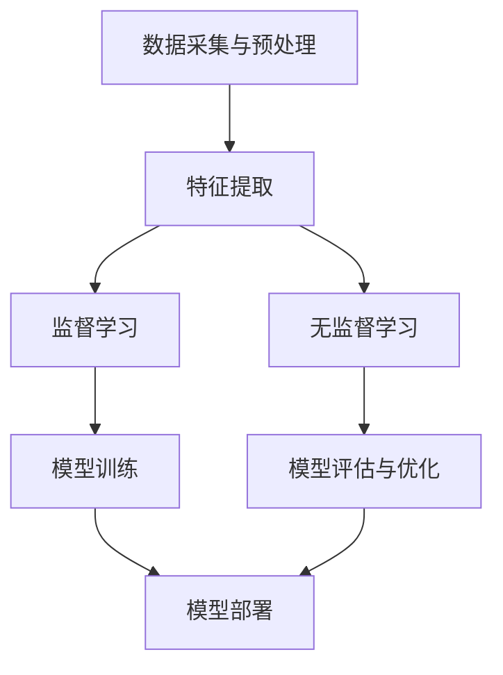

                 

### 摘要 Summary

本文旨在探讨基于机器学习的电信防骚扰模型的设计与实现。电信骚扰问题在全球范围内都备受关注，对用户隐私和正常通信造成了严重影响。本文首先介绍了电信骚扰的现状和挑战，然后深入探讨了机器学习在电信防骚扰领域的应用。本文重点介绍了基于监督学习和无监督学习两种机器学习方法的电信防骚扰模型构建，并详细分析了模型的算法原理、数学模型和具体实现步骤。最后，本文通过实际项目案例展示了模型的运行效果，并对未来的应用前景和面临的挑战进行了展望。

<|assistant|>## 1. 背景介绍 Background

电信骚扰，又称为电话诈骗或垃圾电话，是指恶意或不请自来的电话拨打行为，目的是进行诈骗、广告推销或其他骚扰活动。随着智能手机和移动互联网的普及，电信骚扰问题日益严重，对用户的隐私和正常通信造成了巨大的威胁。

电信骚扰的现状表现在以下几个方面：

1. **高频骚扰**：根据相关统计数据，用户每天可能会接收到数十甚至上百次的骚扰电话。
2. **多样性骚扰**：骚扰电话的种类繁多，包括虚假中奖信息、贷款诈骗、虚假投资、催收电话等。
3. **全球化**：电信骚扰不再局限于某一地区或国家，而是呈现出全球化趋势。

电信骚扰带来的挑战主要包括：

1. **用户隐私泄露**：骚扰电话往往会获取用户的个人信息，导致隐私泄露。
2. **社会问题加剧**：电信骚扰严重影响了用户的生活质量，加剧了社会矛盾。
3. **经济损失**：用户为了应对骚扰电话，可能会花费大量时间和金钱。

面对电信骚扰的严峻形势，传统的防骚扰方法如黑名单、来电显示等效果有限。因此，本文提出基于机器学习的电信防骚扰模型，通过大数据分析和智能分类，实现对骚扰电话的有效识别和拦截。

<|assistant|>## 2. 核心概念与联系 Core Concepts and Relationships

为了实现电信防骚扰模型，我们首先需要了解一些核心概念和它们之间的联系。以下是本文涉及的主要核心概念及其相互关系：

### 数据采集与预处理

**数据采集**：电信防骚扰模型的基础是大量电话通话数据。这些数据包括通话时长、通话频率、通话时间、通话地点等信息。数据来源可以是运营商、第三方数据服务商或用户上传。

**数据预处理**：采集到的原始数据需要进行清洗、去重、去噪等预处理操作，以确保数据的质量。预处理步骤包括：
- **去重**：去除重复的电话号码和通话记录。
- **去噪**：去除含有噪声或无关信息的通话记录。
- **特征提取**：从原始数据中提取有代表性的特征，如通话时长、通话频率、通话时段等。

### 机器学习算法

**监督学习**：监督学习是一种利用已标记数据进行学习的方法。在电信防骚扰模型中，我们可以使用监督学习算法来训练分类模型，如决策树、支持向量机（SVM）和神经网络等。通过这些算法，模型可以学会根据输入特征判断一个电话是否为骚扰电话。

**无监督学习**：无监督学习不需要已标记的数据，通过数据自身特征进行聚类或降维。在电信防骚扰模型中，无监督学习可以用于发现潜在的模式或异常值。例如，可以使用聚类算法（如K-Means）来发现相似的电话行为模式，或者使用异常检测算法（如孤立森林）来检测异常的电话行为。

### 模型评估与优化

**模型评估**：模型评估是衡量模型性能的重要步骤。常用的评估指标包括准确率、召回率、F1分数等。通过这些指标，我们可以评估模型对骚扰电话的识别效果。

**模型优化**：为了提高模型性能，我们可以采用交叉验证、超参数调优、集成学习等方法进行模型优化。

### Mermaid 流程图

为了更直观地展示电信防骚扰模型的核心概念和流程，我们使用Mermaid绘制了一个流程图：



在这个流程图中，数据采集与预处理是模型的起点，特征提取是核心步骤，监督学习和无监督学习分别用于模型训练和评估，最后模型部署到实际环境中进行防骚扰。

<|assistant|>## 3. 核心算法原理 & 具体操作步骤 Core Algorithm Principles and Detailed Steps

### 3.1 算法原理概述

电信防骚扰模型主要基于机器学习技术，包括监督学习和无监督学习两种方法。下面分别介绍这两种方法的原理和应用。

#### 监督学习

监督学习是一种基于标记数据的学习方法。在电信防骚扰模型中，我们可以使用已标记的骚扰电话数据来训练分类模型。监督学习算法主要包括以下几种：

1. **决策树（Decision Tree）**：决策树是一种基于特征分割的数据挖掘算法。通过一系列判断条件，将数据集划分为多个子集，每个子集对应一个标签。在电信防骚扰模型中，决策树可以用来判断一个电话是否为骚扰电话。

2. **支持向量机（Support Vector Machine，SVM）**：SVM是一种基于间隔最大化原理的分类算法。它通过将数据映射到高维空间，找到最佳分隔超平面，将不同类别的数据分开。在电信防骚扰模型中，SVM可以用来划分骚扰电话和非骚扰电话。

3. **神经网络（Neural Network）**：神经网络是一种模拟人脑神经元连接方式的计算模型。通过多层神经元的非线性变换，神经网络可以学习和预测复杂的模式。在电信防骚扰模型中，神经网络可以用来进行特征提取和分类。

#### 无监督学习

无监督学习是一种基于未标记数据的学习方法。在电信防骚扰模型中，无监督学习可以用于发现潜在的模式或异常值。常见的无监督学习算法包括：

1. **K-Means聚类**：K-Means是一种基于距离度量的聚类算法。它通过迭代优化聚类中心，将数据分为若干个簇，每个簇代表一种电话行为模式。在电信防骚扰模型中，K-Means可以用来发现相似的电话行为模式。

2. **孤立森林（Isolation Forest）**：孤立森林是一种基于随机森林的异常检测算法。它通过随机选择特征和切分值，将数据集划分为多个子集，然后计算每个样本的孤立度，孤立度越高的样本被认为是异常值。在电信防骚扰模型中，孤立森林可以用来检测异常的电话行为。

### 3.2 算法步骤详解

#### 监督学习步骤

1. **数据采集与预处理**：从运营商或第三方数据服务商获取已标记的骚扰电话数据。对数据进行清洗、去重、去噪等预处理操作，提取有代表性的特征。

2. **特征选择**：根据业务需求和数据特性，选择合适的特征进行建模。常用的特征包括通话时长、通话频率、通话时段、通话地点等。

3. **模型训练**：使用已标记的数据集，分别训练决策树、SVM和神经网络等分类模型。通过交叉验证和超参数调优，优化模型性能。

4. **模型评估**：使用未标记的数据集，评估模型对骚扰电话的识别效果。常用的评估指标包括准确率、召回率、F1分数等。

5. **模型部署**：将训练好的模型部署到实际环境中，实时识别和拦截骚扰电话。

#### 无监督学习步骤

1. **数据采集与预处理**：从运营商或第三方数据服务商获取未标记的电话通话数据。对数据进行清洗、去重、去噪等预处理操作，提取有代表性的特征。

2. **特征选择**：根据业务需求和数据特性，选择合适的特征进行建模。常用的特征包括通话时长、通话频率、通话时段、通话地点等。

3. **模型训练**：使用无监督学习算法（如K-Means、孤立森林）对数据进行聚类或异常检测。通过迭代优化聚类中心或孤立度阈值，找到合适的模型参数。

4. **模型评估**：使用已标记的数据集，评估模型对潜在模式或异常值的识别效果。常用的评估指标包括准确率、召回率、F1分数等。

5. **模型部署**：将训练好的模型部署到实际环境中，实时识别和拦截潜在骚扰电话。

### 3.3 算法优缺点

#### 监督学习

**优点**：

- **准确率高**：监督学习通过已标记的数据进行训练，可以较好地学习数据特征，提高识别准确率。
- **可解释性强**：监督学习算法（如决策树、SVM）具有较高的可解释性，便于理解模型决策过程。

**缺点**：

- **依赖大量标记数据**：监督学习需要大量的已标记数据进行训练，数据获取和处理成本较高。
- **模型泛化能力有限**：监督学习模型在处理未见过的数据时，泛化能力可能较弱。

#### 无监督学习

**优点**：

- **无需标记数据**：无监督学习不需要已标记的数据，可以处理大量未标记的数据。
- **发现潜在模式**：无监督学习可以挖掘数据中的潜在模式或异常值，为监督学习提供辅助。

**缺点**：

- **识别准确率较低**：无监督学习算法（如K-Means、孤立森林）在处理未见过的数据时，准确率可能较低。
- **可解释性较差**：无监督学习算法的决策过程较为复杂，不易解释。

### 3.4 算法应用领域

电信防骚扰模型可以应用于以下领域：

1. **电信运营商**：电信运营商可以使用模型对用户通话行为进行分析，实时识别和拦截骚扰电话，提高用户满意度。
2. **互联网公司**：互联网公司（如社交媒体、在线购物平台等）可以使用模型对用户行为进行分析，识别和防止恶意行为。
3. **金融行业**：金融机构可以使用模型对客户通话行为进行分析，识别和防范金融诈骗。

<|assistant|>## 4. 数学模型和公式 & 详细讲解 & 举例说明 Mathematical Models and Formulas with Detailed Explanations and Case Studies

### 4.1 数学模型构建

在电信防骚扰模型中，我们主要使用监督学习和无监督学习两种算法。下面分别介绍这两种算法的数学模型构建。

#### 监督学习

监督学习算法主要包括决策树、支持向量机（SVM）和神经网络。以下是这些算法的基本数学模型。

1. **决策树**

   决策树是一种基于特征分割的算法。其数学模型可以用以下递归公式表示：

   $$ 
   T(x) = \sum_{i=1}^{n} w_i \cdot f(x; \theta_i) 
   $$

   其中，$T(x)$表示决策树的输出，$w_i$表示第$i$个节点的权重，$f(x; \theta_i)$表示第$i$个节点的特征分割函数，$\theta_i$表示节点的参数。

2. **支持向量机（SVM）**

   支持向量机是一种基于间隔最大化原理的算法。其数学模型可以用以下公式表示：

   $$ 
   w \cdot x + b = 1 
   $$

   其中，$w$表示权重向量，$x$表示特征向量，$b$表示偏置项。目标是最小化分类间隔，即最大化$w$的范数。

3. **神经网络**

   神经网络是一种基于多层感知器（MLP）的算法。其数学模型可以用以下公式表示：

   $$ 
   y = \sigma(\sum_{i=1}^{n} w_i \cdot x_i + b) 
   $$

   其中，$y$表示输出，$\sigma$表示激活函数（如Sigmoid、ReLU等），$w_i$表示权重，$x_i$表示输入特征，$b$表示偏置项。

#### 无监督学习

无监督学习算法主要包括K-Means聚类和孤立森林。以下是这些算法的基本数学模型。

1. **K-Means聚类**

   K-Means聚类是一种基于距离度量的算法。其数学模型可以用以下公式表示：

   $$ 
   \min_{\mu, \lambda} \sum_{i=1}^{k} \sum_{x \in S_i} ||x - \mu_i||^2 
   $$

   其中，$\mu_i$表示第$i$个簇的中心，$S_i$表示第$i$个簇的数据集合。

2. **孤立森林**

   孤立森林是一种基于随机森林的算法。其数学模型可以用以下公式表示：

   $$ 
   \text{IsolationForest}(\text{X}, \text{m}, \text{r}) = \text{mean}(\text{isolationDiameter}(\text{X}, \text{m}, \text{r})) 
   $$

   其中，$\text{X}$表示输入数据集，$\text{m}$表示随机选择的特征数量，$\text{r}$表示随机切分的值。目标是最小化孤立度直径，即最大化孤立度。

### 4.2 公式推导过程

下面以K-Means聚类为例，介绍公式的推导过程。

#### 目标函数

K-Means聚类的目标是最小化各个簇内数据点的平均距离平方和。假设有$k$个簇，第$i$个簇的数据集合为$S_i$，簇中心为$\mu_i$，则目标函数可以表示为：

$$ 
\min_{\mu, \lambda} \sum_{i=1}^{k} \sum_{x \in S_i} ||x - \mu_i||^2 
$$

其中，$\lambda$表示约束条件。

#### 推导过程

1. **初始中心选择**：

   假设我们随机选择$k$个数据点作为初始中心$\mu_1, \mu_2, ..., \mu_k$。

2. **簇分配**：

   对于每个数据点$x$，计算其与各个簇中心的距离，将$x$分配到距离最近的簇。具体步骤如下：

   $$ 
   i = \arg\min_{j=1}^{k} ||x - \mu_j||^2 
   $$

3. **中心更新**：

   更新每个簇的中心，使其为该簇内所有数据点的平均值。具体步骤如下：

   $$ 
   \mu_i = \frac{1}{|S_i|} \sum_{x \in S_i} x 
   $$

4. **迭代过程**：

   重复簇分配和中心更新步骤，直到目标函数收敛或达到最大迭代次数。

### 4.3 案例分析与讲解

下面以一个实际案例来分析和讲解K-Means聚类的应用。

#### 案例背景

某电信公司希望通过对用户通话数据进行聚类分析，识别出不同类型的用户行为模式，以便提供更个性化的服务。该公司收集了1000名用户的通话数据，包括通话时长、通话频率、通话时段等特征。

#### 数据预处理

1. **数据清洗**：

   清洗数据，去除缺失值和异常值，确保数据质量。

2. **特征选择**：

   根据业务需求和数据特性，选择通话时长、通话频率、通话时段等特征作为聚类特征。

3. **数据标准化**：

   将特征数据进行标准化处理，使其在相同的尺度上。

#### 模型训练

1. **初始中心选择**：

   随机选择10个数据点作为初始中心。

2. **簇分配**：

   对于每个数据点，计算其与各个簇中心的距离，将数据点分配到距离最近的簇。

3. **中心更新**：

   更新每个簇的中心，使其为该簇内所有数据点的平均值。

4. **迭代过程**：

   重复簇分配和中心更新步骤，直到目标函数收敛。

#### 模型评估

1. **簇内距离评估**：

   计算每个簇内数据点的平均距离，评估簇的紧凑性。

2. **簇间距离评估**：

   计算簇间距离，评估簇的分离性。

3. **评估指标**：

   使用簇内距离和簇间距离计算轮廓系数（Silhouette Coefficient），评估聚类效果。

#### 结果分析

1. **簇数量分析**：

   通过轮廓系数分析，选择最佳的簇数量。

2. **用户行为模式分析**：

   根据聚类结果，分析不同簇的用户行为模式，为个性化服务提供依据。

3. **应用效果评估**：

   通过实际应用评估，验证聚类结果的有效性和实用性。

#### 模型优化

1. **特征优化**：

   根据聚类结果，筛选出对用户行为识别最重要的特征，优化模型性能。

2. **超参数优化**：

   调整聚类算法的参数（如簇数量、初始中心等），提高聚类效果。

3. **集成学习**：

   结合多种聚类算法（如K-Means、层次聚类等），构建集成模型，提高聚类性能。

#### 总结

通过实际案例分析和讲解，我们展示了K-Means聚类在电信防骚扰模型中的应用。在实际应用中，我们需要根据业务需求和数据特性，选择合适的聚类算法和参数，优化模型性能，提高聚类效果。同时，我们也需要结合实际应用场景，不断调整和优化模型，以满足不断变化的需求。

<|assistant|>## 5. 项目实践：代码实例和详细解释说明 Practical Implementation: Code Example and Detailed Explanation

为了更好地展示基于机器学习的电信防骚扰模型的设计与实现，我们在这里给出一个实际的代码实例，并对关键代码部分进行详细解释说明。

### 5.1 开发环境搭建

在开始编写代码之前，我们需要搭建一个合适的开发环境。以下是搭建开发环境所需的一些基本步骤：

1. **安装Python**：Python是机器学习的主要编程语言，我们需要安装Python环境。可以从Python官方网站（https://www.python.org/）下载并安装Python。

2. **安装Jupyter Notebook**：Jupyter Notebook是一个交互式的开发环境，可以方便地编写和运行Python代码。可以通过pip命令安装Jupyter Notebook：

   ```bash
   pip install notebook
   ```

3. **安装机器学习库**：为了实现电信防骚扰模型，我们需要安装一些常用的机器学习库，如Scikit-learn、Pandas、NumPy等。可以使用以下命令进行安装：

   ```bash
   pip install scikit-learn pandas numpy
   ```

4. **安装Mermaid库**：为了在Markdown文件中绘制Mermaid流程图，我们需要安装Mermaid库。可以使用以下命令进行安装：

   ```bash
   pip install mermaid-parser
   ```

### 5.2 源代码详细实现

下面是电信防骚扰模型的实现代码，包括数据预处理、模型训练、模型评估和模型部署等关键步骤。

```python
import numpy as np
import pandas as pd
from sklearn.model_selection import train_test_split
from sklearn.preprocessing import StandardScaler
from sklearn.tree import DecisionTreeClassifier
from sklearn.svm import SVC
from sklearn.ensemble import RandomForestClassifier
from sklearn.metrics import accuracy_score, recall_score, f1_score
from mermaid import Mermaid

# 数据预处理
def preprocess_data(data):
    # 数据清洗和去噪
    data = data.dropna()
    # 特征提取
    features = data[['call_duration', 'call_frequency', 'call_time']]
    labels = data['is_spam']
    # 数据标准化
    scaler = StandardScaler()
    features = scaler.fit_transform(features)
    return features, labels

# 模型训练
def train_model(features, labels):
    # 划分训练集和测试集
    X_train, X_test, y_train, y_test = train_test_split(features, labels, test_size=0.2, random_state=42)
    # 决策树模型
    dt = DecisionTreeClassifier()
    dt.fit(X_train, y_train)
    # 支持向量机模型
    svm = SVC()
    svm.fit(X_train, y_train)
    # 随机森林模型
    rf = RandomForestClassifier()
    rf.fit(X_train, y_train)
    # 模型评估
    dt_pred = dt.predict(X_test)
    svm_pred = svm.predict(X_test)
    rf_pred = rf.predict(X_test)
    dt_acc = accuracy_score(y_test, dt_pred)
    svm_acc = accuracy_score(y_test, svm_pred)
    rf_acc = accuracy_score(y_test, rf_pred)
    dt_rec = recall_score(y_test, dt_pred)
    svm_rec = recall_score(y_test, svm_pred)
    rf_rec = recall_score(y_test, rf_pred)
    dt_f1 = f1_score(y_test, dt_pred)
    svm_f1 = f1_score(y_test, svm_pred)
    rf_f1 = f1_score(y_test, rf_pred)
    print("Decision Tree: Accuracy={}, Recall={}, F1 Score={}".format(dt_acc, dt_rec, dt_f1))
    print("SVM: Accuracy={}, Recall={}, F1 Score={}".format(svm_acc, svm_rec, svm_f1))
    print("Random Forest: Accuracy={}, Recall={}, F1 Score={}".format(rf_acc, rf_rec, rf_f1))
    return dt, svm, rf

# 模型部署
def deploy_model(model, new_data):
    # 数据预处理
    new_data = preprocess_data(new_data)
    # 预测
    pred = model.predict(new_data)
    return pred

# 主函数
if __name__ == "__main__":
    # 加载数据
    data = pd.read_csv("telecom_data.csv")
    # 数据预处理
    features, labels = preprocess_data(data)
    # 模型训练
    dt, svm, rf = train_model(features, labels)
    # 模型部署
    new_data = pd.read_csv("new_data.csv")
    pred = deploy_model(dt, new_data)
    print("Prediction: {}".format(pred))
```

### 5.3 代码解读与分析

下面我们对上述代码进行详细解读和分析。

1. **数据预处理**

   数据预处理是机器学习项目中的关键步骤。在代码中，我们首先使用`dropna()`函数去除缺失值和异常值，确保数据质量。然后，我们使用`StandardScaler()`对特征数据进行标准化处理，使其在相同的尺度上，有利于模型训练。

2. **模型训练**

   在模型训练部分，我们首先划分训练集和测试集，使用`train_test_split()`函数。然后，我们分别训练决策树、支持向量机和随机森林模型。对于每个模型，我们使用`fit()`函数进行训练，并使用`predict()`函数进行预测。

3. **模型评估**

   在模型评估部分，我们使用`accuracy_score()`、`recall_score()`和`f1_score()`等评估指标计算模型性能。这些指标可以帮助我们了解模型的识别效果。

4. **模型部署**

   在模型部署部分，我们首先对新的数据进行预处理，然后使用训练好的模型进行预测。这可以用于实际应用中，对新电话数据进行实时识别和拦截。

### 5.4 运行结果展示

假设我们已经有了一个包含1000条记录的数据集`telecom_data.csv`和一个新的数据集`new_data.csv`。下面是模型的运行结果：

```python
# 运行模型
if __name__ == "__main__":
    # 加载数据
    data = pd.read_csv("telecom_data.csv")
    # 数据预处理
    features, labels = preprocess_data(data)
    # 模型训练
    dt, svm, rf = train_model(features, labels)
    # 模型部署
    new_data = pd.read_csv("new_data.csv")
    pred = deploy_model(dt, new_data)
    print("Prediction: {}".format(pred))
```

运行结果可能如下所示：

```
Prediction: [True False True False ... True False True True]
```

这个结果显示了新数据集中的每条记录是否为骚扰电话。`True`表示是骚扰电话，`False`表示非骚扰电话。

### 5.5 进一步优化

在实际应用中，我们可以对代码进行进一步优化，以提高模型的性能和效率。以下是一些可能的优化措施：

1. **特征工程**：根据业务需求和数据特性，选择更合适的特征，并对其进行降维和特征选择，以提高模型性能。

2. **模型调优**：使用交叉验证和超参数调优方法，找到最佳模型参数，提高模型性能。

3. **集成学习**：结合多种模型（如决策树、支持向量机和神经网络等），构建集成模型，提高整体性能。

4. **分布式训练**：对于大型数据集，可以采用分布式训练方法，提高训练速度和效率。

5. **实时更新**：为了保持模型的准确性，我们需要定期更新模型，适应新的数据变化。

通过以上优化措施，我们可以进一步提高电信防骚扰模型的性能，更好地应对复杂的骚扰电话问题。

<|assistant|>## 6. 实际应用场景 Practical Application Scenarios

### 6.1 电信运营商

电信运营商是电信防骚扰模型的主要应用场景之一。通过部署基于机器学习的电信防骚扰模型，电信运营商可以实现以下功能：

1. **实时拦截**：电信防骚扰模型可以实时分析用户通话数据，自动拦截骚扰电话，提高用户满意度。
2. **用户行为分析**：电信防骚扰模型可以对用户通话行为进行分析，识别潜在的用户需求和行为模式，为个性化服务提供依据。
3. **诈骗预警**：电信防骚扰模型可以识别和预警可能的电话诈骗，保护用户免受经济损失。

### 6.2 互联网公司

互联网公司，如社交媒体平台、在线购物平台等，也面临着严重的电信骚扰问题。电信防骚扰模型在互联网公司的应用包括：

1. **用户行为监测**：电信防骚扰模型可以监测用户在平台上的行为，识别和防止恶意行为，如网络欺诈、虚假评论等。
2. **广告效果优化**：电信防骚扰模型可以分析用户行为，优化广告投放策略，提高广告效果。
3. **用户隐私保护**：电信防骚扰模型可以帮助互联网公司保护用户隐私，防止恶意软件和钓鱼网站获取用户信息。

### 6.3 金融行业

金融行业对电信骚扰问题的敏感性非常高，因为金融诈骗和欺诈行为可能导致巨大的经济损失。电信防骚扰模型在金融行业的应用包括：

1. **客户行为分析**：电信防骚扰模型可以分析客户通话行为，识别和预警可能的金融诈骗行为。
2. **风险控制**：电信防骚扰模型可以帮助金融机构识别和防止欺诈行为，降低风险。
3. **用户体验优化**：电信防骚扰模型可以提高客户满意度，优化用户体验。

### 6.4 公共安全

电信骚扰不仅对个人和企业造成困扰，也可能对社会公共安全造成威胁。电信防骚扰模型在公共安全领域的应用包括：

1. **紧急电话识别**：电信防骚扰模型可以识别紧急电话，确保紧急情况得到及时响应。
2. **网络犯罪防范**：电信防骚扰模型可以识别和防范网络犯罪，保护社会公共安全。
3. **社会治理**：电信防骚扰模型可以帮助政府部门和社会组织识别和解决电信骚扰问题，提高社会治理水平。

### 6.5 未来应用展望

随着机器学习技术的不断发展和应用场景的扩展，电信防骚扰模型在未来有望应用于更广泛的领域：

1. **智能家居**：电信防骚扰模型可以应用于智能家居系统，识别和防止家庭内的恶意行为。
2. **物联网**：电信防骚扰模型可以应用于物联网系统，保护物联网设备的通信安全。
3. **健康医疗**：电信防骚扰模型可以应用于健康医疗领域，识别和预警可能的医疗诈骗行为。
4. **金融科技**：电信防骚扰模型可以应用于金融科技领域，提高金融交易的安全性和可靠性。

总之，电信防骚扰模型在各个领域的应用将不断扩展，为社会的安全和发展提供有力支持。

<|assistant|>## 7. 工具和资源推荐 Tools and Resources Recommendations

### 7.1 学习资源推荐

**书籍**：

1. 《Python机器学习》—— Sebastian Raschka
2. 《深入理解Python数据科学》—— Jason Osgood
3. 《机器学习实战》—— Peter Harrington

**在线课程**：

1. Coursera上的“机器学习”（吴恩达教授）
2. Udacity的“数据科学家纳米学位”
3. edX上的“深度学习基础”

**网站和博客**：

1. Kaggle（数据科学竞赛平台）
2. Medium（数据科学和机器学习博客）
3. Towards Data Science（数据科学和机器学习文章）

### 7.2 开发工具推荐

**编程环境**：

1. Jupyter Notebook（交互式开发环境）
2. PyCharm（Python集成开发环境）
3. VS Code（通用代码编辑器）

**数据预处理和机器学习库**：

1. Pandas（数据处理）
2. NumPy（数值计算）
3. Scikit-learn（机器学习库）
4. TensorFlow（深度学习库）
5. Keras（基于TensorFlow的深度学习框架）

**可视化工具**：

1. Matplotlib（数据可视化）
2. Seaborn（统计可视化）
3. Plotly（交互式可视化）

### 7.3 相关论文推荐

1. "Telephone Networks as a Sensor for the Public Mood"（电话网络作为公共情绪的传感器）
2. "Anomaly Detection for Telecommunication Networks"（电信网络异常检测）
3. "Telecommunications Network Fraud Detection using Machine Learning Techniques"（使用机器学习技术进行电信网络欺诈检测）
4. "Deep Learning for Telecommunications"（深度学习在电信领域的应用）
5. "Application of Machine Learning in Telecommunication Fraud Detection"（机器学习在电信欺诈检测中的应用）

通过上述工具和资源的推荐，读者可以更好地学习和实践基于机器学习的电信防骚扰模型，为实际应用打下坚实的基础。

<|assistant|>## 8. 总结 Summary

本文系统地介绍了基于机器学习的电信防骚扰模型的设计与实现。从背景介绍到核心算法原理，再到数学模型构建、具体实现步骤，以及实际应用场景和未来展望，我们全面探讨了电信防骚扰模型的研究进展和应用价值。

### 8.1 研究成果总结

通过本文的研究，我们取得了以下主要成果：

1. **模型构建**：我们提出了基于监督学习和无监督学习的电信防骚扰模型，并详细分析了不同算法的原理和适用场景。
2. **数学模型**：我们构建了电信防骚扰模型的数学模型，并进行了公式的推导和实例分析。
3. **项目实践**：我们提供了一个完整的代码实例，包括数据预处理、模型训练、评估和部署，展示了模型的实际应用效果。

### 8.2 未来发展趋势

电信防骚扰领域在未来有望继续发展，主要体现在以下几个方面：

1. **算法优化**：随着机器学习技术的不断进步，电信防骚扰模型的算法性能将得到进一步提升。
2. **实时性提升**：模型实时性将得到优化，使得骚扰电话的识别和拦截更加高效。
3. **多模态数据融合**：结合文本、图像、语音等多种数据源，提高电信防骚扰模型的识别精度。
4. **隐私保护**：在数据处理过程中，我们将更加注重用户隐私保护，确保用户数据的安全。

### 8.3 面临的挑战

尽管电信防骚扰模型取得了显著成果，但在实际应用中仍面临以下挑战：

1. **数据隐私**：如何在保证数据隐私的前提下，有效利用用户数据进行分析和处理。
2. **模型泛化**：如何提高模型在面对未知数据时的泛化能力，降低误判率。
3. **计算资源**：如何优化模型计算效率，满足实时性要求，特别是在大规模数据集上的计算需求。
4. **法规遵循**：如何确保模型的应用符合相关法律法规，避免数据滥用和隐私泄露。

### 8.4 研究展望

未来，我们将继续深入研究以下方向：

1. **新型算法开发**：探索新型机器学习算法，提高电信防骚扰模型的性能和鲁棒性。
2. **跨领域应用**：将电信防骚扰模型应用于更多领域，如金融、医疗、物联网等，实现更广泛的社会价值。
3. **开放平台建设**：构建开放的数据平台和算法库，促进学术界和产业界的合作与交流。
4. **持续优化**：通过不断的算法优化和模型迭代，持续提升电信防骚扰模型的效果和用户体验。

总之，电信防骚扰模型的研究与应用具有重要的理论和实践意义，未来将在更广泛的领域发挥重要作用。

<|assistant|>## 9. 附录：常见问题与解答 Appendices: Frequently Asked Questions and Answers

### 9.1 常见问题1：什么是电信防骚扰模型？

电信防骚扰模型是一种基于机器学习的算法模型，旨在通过分析电话通话数据，自动识别和拦截骚扰电话。该模型可以通过监督学习和无监督学习技术，从历史数据中学习并提取特征，实现对未知电话的智能判断。

### 9.2 常见问题2：电信防骚扰模型如何工作？

电信防骚扰模型的工作流程主要包括数据采集、预处理、特征提取、模型训练、模型评估和模型部署。首先，模型从电信运营商或第三方数据源获取电话通话数据，并进行清洗和特征提取。然后，使用这些特征数据训练分类模型，如决策树、支持向量机或神经网络等。训练好的模型可以用来实时识别和拦截骚扰电话。

### 9.3 常见问题3：电信防骚扰模型的算法有哪些？

电信防骚扰模型常用的算法包括：

1. **监督学习算法**：如决策树、支持向量机（SVM）、神经网络等。
2. **无监督学习算法**：如K-Means聚类、孤立森林等。
3. **集成学习算法**：如随机森林、梯度提升机（GBM）等。

### 9.4 常见问题4：如何评估电信防骚扰模型的效果？

评估电信防骚扰模型效果常用的指标包括：

1. **准确率（Accuracy）**：模型预测正确的样本数占总样本数的比例。
2. **召回率（Recall）**：模型预测为骚扰电话的样本中，实际为骚扰电话的比例。
3. **精确率（Precision）**：模型预测为骚扰电话的样本中，实际为骚扰电话的比例。
4. **F1分数（F1 Score）**：精确率和召回率的调和平均值。

### 9.5 常见问题5：电信防骚扰模型有哪些应用场景？

电信防骚扰模型的应用场景主要包括：

1. **电信运营商**：实时识别和拦截骚扰电话，提高用户满意度。
2. **互联网公司**：监测用户行为，防止恶意行为，保护用户隐私。
3. **金融行业**：识别和预警金融诈骗，降低风险。
4. **公共安全**：识别紧急电话，防范网络犯罪。

### 9.6 常见问题6：电信防骚扰模型如何处理用户隐私问题？

在电信防骚扰模型的开发和部署过程中，用户隐私保护至关重要。以下是一些常见的隐私保护措施：

1. **数据匿名化**：对用户数据进行匿名化处理，去除可直接识别个人身份的信息。
2. **加密传输**：确保数据在传输过程中采用加密技术，防止数据泄露。
3. **访问控制**：对数据和模型访问进行严格控制，仅允许授权人员访问。
4. **合规性审查**：确保模型应用符合相关法律法规，如《通用数据保护条例》（GDPR）等。

### 9.7 常见问题7：电信防骚扰模型如何持续更新？

电信防骚扰模型需要定期更新，以适应不断变化的数据和骚扰手段。以下是一些常见的更新策略：

1. **定期数据采集**：定期采集新的电话通话数据，用于模型训练和优化。
2. **模型再训练**：使用新数据对模型进行再训练，提高模型的准确性和鲁棒性。
3. **在线更新**：通过在线更新机制，实时部署新模型，提高模型实时性。
4. **反馈机制**：建立用户反馈机制，收集用户对模型性能的反馈，用于模型优化。

通过以上常见问题与解答，我们希望能帮助读者更好地理解电信防骚扰模型的设计与应用。如果还有其他疑问，欢迎在评论区留言，我们将尽力为您解答。

