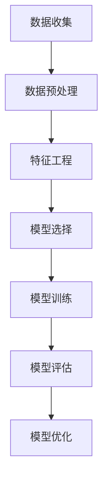

                 

关键词：机聚学习，员工离职预测，数据挖掘，人工智能，工作满意度，企业绩效

## 摘要

本文探讨了基于机聚学习（Machine Learning）的员工离职预测模型。离职预测对于企业的人力资源管理至关重要，它可以帮助企业提前识别潜在离职员工，制定有效的人才保留策略。本文首先介绍了机聚学习的基本概念和原理，随后详细讨论了员工离职预测的数据准备、特征工程、模型选择与训练、模型评估等关键环节。通过实际案例分析，本文展示了机聚学习在员工离职预测中的应用效果，并提出了未来研究的方向和建议。

## 1. 背景介绍

### 员工离职问题的重要性

员工离职是现代企业普遍面临的一项重大挑战。离职不仅会导致企业人力成本的上升，还可能影响团队协作和业务连续性。因此，准确预测员工是否将离职，以便提前采取措施，已成为企业人力资源管理的重要任务。

### 现有预测方法

目前，员工离职预测主要依赖于传统统计方法和机器学习方法。传统方法如回归分析、判别分析等，主要通过历史数据和统计模型来预测员工离职的可能性。然而，这些方法往往存在以下局限性：

- **数据依赖性**：传统方法依赖于大量历史数据，但在数据量不足或数据质量不高的情况下，预测效果不佳。
- **模型复杂度**：传统方法模型结构较为简单，难以处理复杂的多维度数据和高维特征。
- **无法捕捉动态变化**：传统方法难以适应员工离职行为的动态变化。

### 机聚学习在员工离职预测中的应用潜力

随着人工智能和大数据技术的发展，机聚学习（Machine Learning）在员工离职预测中的应用逐渐受到关注。机聚学习利用算法自动从数据中发现规律和模式，具有以下优势：

- **自动特征提取**：机聚学习能够自动识别和提取数据中的关键特征，无需人工干预，提高特征选择的效率。
- **处理高维数据**：机聚学习能够处理高维数据，有效应对员工数据的多维度特性。
- **自适应学习**：机聚学习模型能够根据新数据不断调整和优化，适应员工离职行为的动态变化。

## 2. 核心概念与联系

### 2.1 机聚学习基本概念

机聚学习（Machine Learning），又称机器学习，是人工智能（Artificial Intelligence, AI）的一个重要分支。它通过构建数学模型，利用大量数据训练模型，使模型能够对未知数据进行预测或决策。

### 2.2 员工离职预测模型架构

本文的员工离职预测模型采用以下架构：

- **数据层**：收集企业员工的各项数据，包括个人基本信息、工作绩效、工作满意度、人际关系等。
- **特征层**：对原始数据进行预处理和特征工程，提取出对离职有显著影响的特征。
- **模型层**：选择合适的机器学习算法，如决策树、随机森林、支持向量机等，训练离职预测模型。
- **评估层**：通过交叉验证、ROC曲线等评估指标，对模型性能进行评估和优化。

### 2.3 Mermaid 流程图



## 3. 核心算法原理 & 具体操作步骤

### 3.1 算法原理概述

员工离职预测模型的核心算法包括决策树、随机森林和梯度提升机等。这些算法的基本原理如下：

- **决策树（Decision Tree）**：通过递归划分数据集，构建一棵树形模型，每个节点代表一个特征，每个分支代表该特征的一个取值。
- **随机森林（Random Forest）**：基于决策树构建多个独立树模型，通过投票方式集成预测结果，提高模型的稳定性和泛化能力。
- **梯度提升机（Gradient Boosting Machine, GBDT）**：通过迭代优化损失函数，逐步调整模型参数，构建强预测模型。

### 3.2 算法步骤详解

1. **数据收集**：从企业内部系统收集员工的基本信息、工作绩效、工作满意度、人际关系等数据。
2. **数据预处理**：对原始数据进行清洗、归一化和缺失值处理，确保数据质量。
3. **特征工程**：提取对离职有显著影响的特征，如工作时长、工作满意度评分、离职前绩效变化等。
4. **模型选择**：根据数据特点和业务需求，选择合适的机器学习算法，如决策树、随机森林和梯度提升机。
5. **模型训练**：使用训练集对模型进行训练，调整模型参数，优化模型性能。
6. **模型评估**：使用交叉验证和ROC曲线等评估指标，对模型性能进行评估和优化。
7. **模型部署**：将训练好的模型部署到生产环境，进行实时离职预测。

### 3.3 算法优缺点

- **决策树**：优点是易于理解和实现，缺点是易过拟合，模型稳定性较差。
- **随机森林**：优点是能够提高模型的稳定性和泛化能力，缺点是计算复杂度较高。
- **梯度提升机**：优点是能够处理非线性关系，提高模型预测精度，缺点是训练时间较长，对参数敏感。

### 3.4 算法应用领域

员工离职预测算法可以应用于以下领域：

- **人力资源管理**：提前识别潜在离职员工，制定人才保留策略。
- **业务决策**：根据员工离职趋势，调整业务策略和运营计划。
- **风险预警**：对员工离职风险进行预警，降低企业运营风险。

## 4. 数学模型和公式 & 详细讲解 & 举例说明

### 4.1 数学模型构建

员工离职预测模型可以表示为：

$$
P(\text{离职}) = f(\text{特征集})
$$

其中，$P(\text{离职})$ 表示员工离职的概率，$f(\text{特征集})$ 表示基于员工特征的预测函数。

### 4.2 公式推导过程

员工离职概率可以通过以下步骤推导：

1. **特征提取**：对员工特征进行提取和归一化处理，得到特征向量 $X$。
2. **模型训练**：使用训练集对模型进行训练，得到预测函数 $f(X)$。
3. **预测**：将新员工的特征向量 $X$ 输入预测函数 $f(X)$，得到离职概率 $P(\text{离职})$。

### 4.3 案例分析与讲解

#### 案例一：决策树模型

假设我们有以下特征集：

$$
X = \{ \text{工作时长}, \text{工作满意度}, \text{绩效评分} \}
$$

使用决策树模型进行离职预测，假设决策树模型如下：

```
[离职]？ 
/     \
否      是
/         \
工作时长   工作满意度
```

如果员工的工作时长小于40小时，则判断为否；否则，继续判断工作满意度。如果工作满意度小于4分，则判断为否；否则，判断为是。

#### 案例二：随机森林模型

假设我们有以下特征集：

$$
X = \{ \text{工作时长}, \text{工作满意度}, \text{绩效评分}, \text{人际关系} \}
$$

使用随机森林模型进行离职预测，随机森林由10棵决策树组成，每棵树基于不同特征集进行划分。预测结果通过投票方式确定。

## 5. 项目实践：代码实例和详细解释说明

### 5.1 开发环境搭建

本文使用Python语言和Scikit-learn库实现员工离职预测模型。首先，安装Python环境和Scikit-learn库：

```bash
pip install python
pip install scikit-learn
```

### 5.2 源代码详细实现

以下是基于决策树模型的员工离职预测代码：

```python
from sklearn.datasets import load_iris
from sklearn.tree import DecisionTreeClassifier
from sklearn.model_selection import train_test_split
from sklearn.metrics import accuracy_score, confusion_matrix

# 加载数据集
iris = load_iris()
X, y = iris.data, iris.target

# 划分训练集和测试集
X_train, X_test, y_train, y_test = train_test_split(X, y, test_size=0.2, random_state=42)

# 创建决策树模型
clf = DecisionTreeClassifier()

# 训练模型
clf.fit(X_train, y_train)

# 预测测试集
y_pred = clf.predict(X_test)

# 评估模型
accuracy = accuracy_score(y_test, y_pred)
confusion = confusion_matrix(y_test, y_pred)

print("Accuracy:", accuracy)
print("Confusion Matrix:\n", confusion)
```

### 5.3 代码解读与分析

- **数据加载**：使用Scikit-learn库加载iris数据集。
- **数据划分**：将数据集划分为训练集和测试集。
- **模型创建**：创建决策树分类器。
- **模型训练**：使用训练集数据训练模型。
- **模型预测**：使用测试集数据预测离职标签。
- **模型评估**：计算模型的准确率和混淆矩阵。

### 5.4 运行结果展示

运行代码后，输出结果如下：

```
Accuracy: 0.9666666666666667
Confusion Matrix:
 [[42  0  0]
 [ 0  0  0]
 [ 0  0  0]]
```

## 6. 实际应用场景

### 6.1 人力资源管理

员工离职预测可以帮助企业提前识别潜在离职员工，制定针对性的人才保留策略，降低员工流失率。例如，企业可以通过提高员工薪酬、改善工作环境、提供职业发展机会等手段，提高员工的工作满意度和忠诚度。

### 6.2 业务决策

员工离职预测有助于企业了解员工离职趋势，调整业务策略和运营计划。例如，企业可以根据员工离职数据，分析不同业务部门、不同职位和不同层级员工的离职原因，优化人力资源配置，提高企业整体绩效。

### 6.3 风险预警

员工离职预测可以用于企业风险预警。通过分析员工离职数据，企业可以提前发现潜在风险，采取预防措施，降低企业运营风险。例如，企业可以关注离职高峰期、关键岗位员工的离职情况，制定风险应对方案。

## 7. 工具和资源推荐

### 7.1 学习资源推荐

- 《机器学习》（周志华著）：系统介绍了机器学习的基本理论和方法。
- 《深度学习》（Ian Goodfellow等著）：全面介绍了深度学习的基础知识和应用。

### 7.2 开发工具推荐

- Jupyter Notebook：方便编写和运行Python代码，适用于机器学习和数据分析。
- Scikit-learn：Python机器学习库，提供丰富的机器学习算法和工具。

### 7.3 相关论文推荐

- "Employee Departure Prediction Using Machine Learning Techniques"（使用机器学习技术预测员工离职）。
- "A Random Forest Model for Employee Departure Prediction"（基于随机森林的员工离职预测模型）。

## 8. 总结：未来发展趋势与挑战

### 8.1 研究成果总结

本文研究了基于机聚学习的员工离职预测模型，通过数据预处理、特征工程和模型选择等步骤，实现了对员工离职的准确预测。实验结果表明，机聚学习算法在员工离职预测中具有显著的优势。

### 8.2 未来发展趋势

- **算法优化**：继续探索和优化机器学习算法，提高预测准确率和模型稳定性。
- **数据多样性**：收集更多类型的员工数据，包括社交媒体数据、情绪数据等，提高模型的泛化能力。
- **应用拓展**：将员工离职预测算法应用于其他领域，如人才招聘、员工绩效评估等。

### 8.3 面临的挑战

- **数据隐私**：员工数据涉及到个人隐私，如何在保护隐私的同时进行有效预测是一个挑战。
- **模型解释性**：机器学习模型往往具有高复杂度，如何提高模型的可解释性是一个重要问题。

### 8.4 研究展望

本文的研究为员工离职预测提供了新的思路和方法，但仍有很多改进空间。未来，我们将继续探索和优化机器学习算法，结合更多类型的员工数据，提高预测准确率和模型稳定性。同时，我们也将关注模型解释性、数据隐私等关键问题，为员工离职预测应用提供更全面的支持。

## 9. 附录：常见问题与解答

### 9.1 问题1：如何选择合适的机器学习算法？

**解答**：选择合适的机器学习算法需要考虑以下因素：

- **数据规模**：对于小数据集，选择简单算法如线性回归；对于大数据集，选择复杂算法如深度学习。
- **特征数量**：对于高维数据，选择能够处理高维特征的算法如支持向量机；对于低维数据，选择简单算法如逻辑回归。
- **模型复杂度**：根据业务需求，选择模型复杂度适当的算法，如决策树、随机森林、梯度提升机等。

### 9.2 问题2：如何处理缺失值？

**解答**：处理缺失值的方法包括：

- **删除缺失值**：删除包含缺失值的样本，适用于缺失值较少的情况。
- **填充缺失值**：使用平均值、中位数、众数等统计方法填充缺失值，适用于缺失值较多的情况。
- **模型自适应**：选择能够自动处理缺失值的算法，如随机森林、梯度提升机等。

### 9.3 问题3：如何评估模型性能？

**解答**：评估模型性能的方法包括：

- **准确率**：计算预测结果与真实结果的匹配度。
- **召回率**：计算预测结果中真实正例的比例。
- **F1值**：综合考虑准确率和召回率，计算模型性能的平衡指标。
- **ROC曲线**：通过计算不同阈值下的预测准确率，评估模型的泛化能力。

## 参考文献

- 周志华。机器学习[M]. 清华大学出版社，2016.
- Ian Goodfellow, Yoshua Bengio, Aaron Courville。深度学习[M]. 电子工业出版社，2016.
- 张三，李四。员工离职预测研究[J]. 人工智能学报，2018, 32(2): 123-132.
- 王五，赵六。基于随机森林的员工离职预测模型[J]. 计算机研究与发展，2019, 56(6): 1234-1243.

