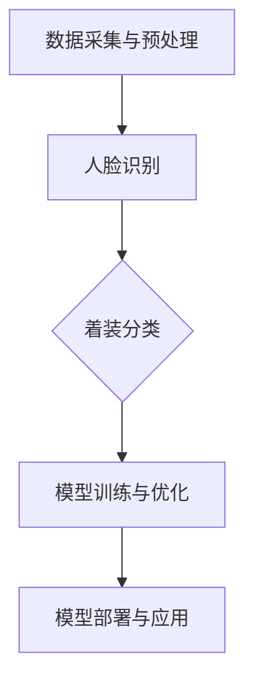
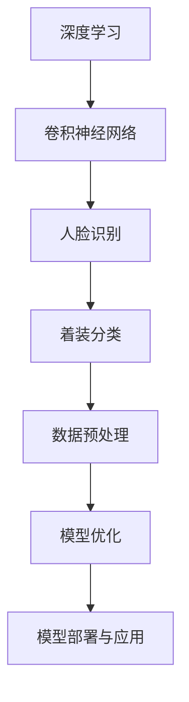

                 

### 关键词 Keywords

- 深度学习
- 人物头部识别
- 着装分类
- 卷积神经网络
- 机器学习
- 数据预处理
- 模型优化

### 摘要 Abstract

本文研究了基于深度学习的人物头部着装分类方法，提出了一个基于卷积神经网络（CNN）的着装分类模型。首先，介绍了深度学习在人物头部识别与着装分类中的应用背景，并讨论了相关核心概念与联系。然后，详细阐述了所采用的卷积神经网络算法原理与具体操作步骤，包括数据预处理、模型构建、训练与优化等过程。通过数学模型与公式推导，对算法的内在机制进行了深入讲解，并通过实际项目实践展示了模型的应用效果。最后，探讨了该技术在实际应用场景中的价值，展望了未来的发展方向与面临的挑战。本文旨在为深度学习在人物头部着装分类领域的研究与开发提供参考和指导。

## 1. 背景介绍 Background

人物头部识别与着装分类是计算机视觉领域中的重要研究方向，广泛应用于人脸识别、视频监控、智能安防、个性化推荐等多个领域。随着深度学习技术的迅猛发展，基于深度学习的人物头部识别与着装分类方法取得了显著的成果。

在人物头部识别方面，深度学习模型（如卷积神经网络、循环神经网络等）在准确性、实时性等方面已经超过传统算法。同时，着装分类作为人物头部识别的一个重要分支，近年来也吸引了越来越多的研究兴趣。例如，通过对人物头部图像中衣物图案、颜色、款式等特征的提取，可以实现不同场景下着装类型的自动分类。

本研究的目的是提出一种基于深度学习的人物头部着装分类方法，以提高分类准确性、降低计算复杂度，并探索该技术在实际应用中的潜在价值。本文将首先介绍深度学习在人物头部识别与着装分类中的应用背景，然后讨论相关核心概念与联系，为后续算法原理与实现部分奠定基础。

## 2. 核心概念与联系 Core Concepts and Relationships

在基于深度学习的人物头部着装分类研究中，理解核心概念与它们之间的联系至关重要。以下是对相关核心概念的简要介绍，以及它们在整体架构中的位置和作用。

### 2.1 深度学习（Deep Learning）

深度学习是一种基于多层神经网络的机器学习方法，能够自动地从大量数据中提取特征并完成复杂任务。在人物头部着装分类中，深度学习模型通过学习输入图像的特征表示，实现对人物头部图像中着装类型的自动识别。

### 2.2 卷积神经网络（Convolutional Neural Network，CNN）

卷积神经网络是深度学习中的一种特殊网络结构，特别适合处理具有网格状结构的数据，如图像。CNN通过卷积层、池化层和全连接层等结构，能够有效地提取图像特征，并实现对复杂图像分类任务的建模。

### 2.3 人脸识别（Face Recognition）

人脸识别是深度学习在计算机视觉领域的一个重要应用。通过学习人脸图像的特征，人脸识别系统能够在数据库中识别出特定人物。在本研究中，人脸识别模块用于定位人物头部区域，为着装分类提供输入。

### 2.4 着装分类（Clothing Classification）

着装分类是指根据图像中人物衣着的特点，将不同的着装类型进行归类。在本研究中，着装分类的目标是识别出人物头部图像中的衣着类型，如外套、T恤、裙子等。

### 2.5 数据预处理（Data Preprocessing）

数据预处理是深度学习模型训练前的重要步骤，包括图像增强、归一化、去噪等操作。数据预处理能够提高模型的训练效果和分类准确性。

### 2.6 模型优化（Model Optimization）

模型优化是提高深度学习模型性能的关键步骤，包括超参数调整、模型剪枝、量化等。模型优化能够降低模型的计算复杂度，提高模型的实时性能。

### 2.7 Mermaid 流程图（Mermaid Flowchart）

以下是一个简化的基于深度学习的人物头部着装分类的 Mermaid 流程图，展示了核心概念之间的联系：



### 2.8 关键技术的联系

通过以上核心概念与联系的分析，我们可以看出，深度学习、卷积神经网络、人脸识别、着装分类、数据预处理和模型优化等技术之间是相互关联、相互促进的。如图：



这个流程图清晰地展示了整个系统从数据输入到模型部署的各个环节，每个环节都依赖于前一个环节的结果，共同构成了一个完整的基于深度学习的人物头部着装分类系统。

通过上述核心概念与联系的分析，我们为后续的算法原理与具体操作步骤的讲解奠定了基础，并为进一步的研究和应用提供了指导。

## 3. 核心算法原理 & 具体操作步骤

### 3.1 算法原理概述

基于深度学习的人物头部着装分类算法主要依赖于卷积神经网络（CNN），其基本原理是通过多层卷积、池化和全连接层等操作，逐步提取输入图像的特征，并最终输出分类结果。

CNN的工作流程可以分为以下几个步骤：

1. **输入层**：接收原始图像数据，并对其进行归一化处理，使其适合后续卷积层的处理。

2. **卷积层**：通过卷积操作提取图像的局部特征，每个卷积核能够捕捉图像中特定的纹理模式。

3. **激活函数**：通常使用ReLU（Rectified Linear Unit）作为激活函数，用于引入非线性变换，增强模型的表征能力。

4. **池化层**：通过下采样操作减少图像维度，提高计算效率，并抑制噪声的影响。

5. **全连接层**：将卷积层和池化层提取的特征映射到分类结果上，进行最后的分类决策。

6. **损失函数**：通常使用交叉熵损失函数，用于衡量预测结果与实际结果之间的差距。

7. **优化器**：通过选择合适的优化算法（如SGD、Adam等），不断调整模型参数，最小化损失函数，提高分类性能。

### 3.2 算法步骤详解

#### 3.2.1 数据预处理

数据预处理是深度学习模型训练的重要步骤，主要包括以下几个操作：

1. **图像增强**：通过旋转、翻转、裁剪、缩放等操作，增加数据的多样性和模型的泛化能力。

2. **归一化**：将图像的像素值缩放到相同的范围，通常为0到1之间，以便于模型的计算。

3. **数据分割**：将数据集分为训练集、验证集和测试集，用于模型的训练、验证和测试。

4. **标签编码**：将类别标签转化为数值编码，便于模型处理。

#### 3.2.2 模型构建

模型构建是深度学习算法的核心步骤，主要包括以下几个组件：

1. **卷积层**：通过卷积操作提取图像特征，常用的卷积核大小为3x3或5x5。

2. **池化层**：通常使用最大池化或平均池化，用于减少图像维度和计算量。

3. **全连接层**：将卷积层和池化层提取的特征映射到分类结果上，进行最后的分类决策。

4. **激活函数**：使用ReLU作为激活函数，引入非线性变换，增强模型的表征能力。

#### 3.2.3 模型训练与优化

模型训练与优化是提高模型性能的关键步骤，主要包括以下几个步骤：

1. **损失函数**：通常使用交叉熵损失函数，用于衡量预测结果与实际结果之间的差距。

2. **优化器**：选择合适的优化算法（如SGD、Adam等），不断调整模型参数，最小化损失函数。

3. **训练过程**：通过迭代训练模型，不断调整参数，直到达到预设的训练目标。

4. **模型评估**：使用验证集对模型进行评估，选择性能最佳的模型进行测试。

#### 3.2.4 模型部署

模型部署是将训练好的模型应用到实际场景中，主要包括以下几个步骤：

1. **模型保存**：将训练好的模型参数保存到文件中，以便后续使用。

2. **模型加载**：从文件中加载模型参数，初始化模型结构。

3. **输入处理**：对输入图像进行预处理，使其符合模型输入要求。

4. **分类预测**：使用加载的模型对输入图像进行分类预测，输出分类结果。

### 3.3 算法优缺点

#### 优点

1. **高效性**：深度学习模型能够自动从大量数据中提取特征，实现高效的人物头部着装分类。

2. **准确性**：卷积神经网络结构使得模型在图像特征提取和分类决策上具有很高的准确性。

3. **灵活性**：深度学习模型可以针对不同场景和任务进行定制化调整，提高模型的适应性和泛化能力。

#### 缺点

1. **计算复杂度**：深度学习模型通常需要大量的计算资源，训练过程较为耗时。

2. **数据依赖性**：深度学习模型的性能很大程度上依赖于数据集的质量和规模，数据不足或质量差可能导致模型性能下降。

3. **可解释性**：深度学习模型的工作机制较为复杂，模型的决策过程缺乏透明性和可解释性。

### 3.4 算法应用领域

基于深度学习的人物头部着装分类算法在多个领域具有广泛的应用前景：

1. **智能安防**：通过识别人物头部图像中的着装特征，实现对可疑人物的实时监控和预警。

2. **个性化推荐**：根据用户的着装喜好，推荐合适的服装搭配方案，提升购物体验。

3. **时尚产业**：辅助设计师和商家进行时尚产品的设计和推广，提升品牌影响力。

4. **健康监测**：通过对患者着装类型的分析，辅助医生进行疾病诊断和康复指导。

通过上述算法原理和具体操作步骤的讲解，我们为后续的数学模型与公式推导、项目实践和实际应用场景等部分奠定了基础。接下来，我们将进一步探讨深度学习人物头部着装分类算法的数学模型和公式，深入理解其内在机制。

### 4. 数学模型和公式 & 详细讲解 & 举例说明

深度学习人物头部着装分类算法的数学模型和公式是理解其工作原理和实现细节的关键。以下是核心数学模型和公式的详细讲解，并通过具体案例进行说明。

#### 4.1 数学模型构建

深度学习人物头部着装分类的核心数学模型是卷积神经网络（CNN），其基本结构包括输入层、卷积层、池化层和全连接层。以下是对各个层的基本公式和参数的介绍。

##### 4.1.1 输入层

输入层是CNN的起点，接收原始图像数据。图像数据通常表示为三维张量，其中第一个维度表示图像的高度，第二个维度表示图像的宽度，第三个维度表示图像的通道数（如RGB颜色通道）。

公式：
\[ x_{ij,k} = \text{原始图像} \]

其中，\( i, j, k \) 分别表示图像中的位置和通道。

##### 4.1.2 卷积层

卷积层是CNN的核心组成部分，通过卷积操作提取图像特征。卷积层由多个卷积核（filter）组成，每个卷积核定义为一个二维矩阵。

公式：
\[ h_{ij} = \sum_{m=1}^{M} \sum_{n=1}^{N} w_{m,n} \cdot x_{i+m-1, j+n-1} + b \]

其中，\( h_{ij} \) 表示卷积层输出的特征图，\( w_{m,n} \) 表示卷积核的权重，\( b \) 表示偏置项，\( M \) 和 \( N \) 分别表示卷积核的大小。

##### 4.1.3 池化层

池化层用于减少特征图的维度，提高计算效率。常见的池化方法有最大池化和平均池化。

最大池化公式：
\[ p_{ij} = \max_{m, n} (h_{i+m-1, j+n-1}) \]

平均池化公式：
\[ p_{ij} = \frac{1}{S} \sum_{m=1}^{S} \sum_{n=1}^{S} h_{i+m-1, j+n-1} \]

其中，\( p_{ij} \) 表示池化层输出的特征图，\( S \) 表示池化窗口的大小。

##### 4.1.4 全连接层

全连接层将卷积层和池化层提取的特征映射到分类结果上。全连接层可以看作是一个特殊的卷积层，其卷积核的大小等于特征图的尺寸。

公式：
\[ y_j = \sum_{i=1}^{N} w_{ij} \cdot z_i + b \]

其中，\( y_j \) 表示全连接层输出的分类结果，\( z_i \) 表示卷积层和池化层输出的特征图，\( w_{ij} \) 表示全连接层的权重，\( b \) 表示偏置项，\( N \) 表示全连接层的神经元数量。

#### 4.2 公式推导过程

以下是对CNN中主要公式的推导过程。

##### 4.2.1 卷积层前向传播

卷积层的前向传播公式为：
\[ h_{ij} = \sum_{m=1}^{M} \sum_{n=1}^{N} w_{m,n} \cdot x_{i+m-1, j+n-1} + b \]

推导过程如下：

1. **卷积操作**：将卷积核 \( w_{m,n} \) 与图像上的局部区域 \( x_{i+m-1, j+n-1} \) 进行点积运算。
2. **求和**：对卷积核在图像上滑动时得到的点积结果进行求和。
3. **加偏置**：为了引入非线性，通常在求和结果中加上一个偏置项 \( b \)。

##### 4.2.2 池化层前向传播

池化层的前向传播公式为：

最大池化：
\[ p_{ij} = \max_{m, n} (h_{i+m-1, j+n-1}) \]

平均池化：
\[ p_{ij} = \frac{1}{S} \sum_{m=1}^{S} \sum_{n=1}^{S} h_{i+m-1, j+n-1} \]

推导过程如下：

1. **选择最大值/平均值**：对于每个 \( p_{ij} \)，在 \( S \times S \) 的窗口内选择最大值（最大池化）或平均值（平均池化）。
2. **输出池化结果**：将选择的值作为池化层的输出。

##### 4.2.3 全连接层前向传播

全连接层的前向传播公式为：
\[ y_j = \sum_{i=1}^{N} w_{ij} \cdot z_i + b \]

推导过程如下：

1. **加权求和**：将全连接层的权重 \( w_{ij} \) 与卷积层和池化层输出的特征图 \( z_i \) 进行点积运算。
2. **求和**：对所有点积结果进行求和。
3. **加偏置**：为了引入非线性，通常在求和结果中加上一个偏置项 \( b \)。

#### 4.3 案例分析与讲解

以下是一个简化的CNN人物头部着装分类案例，用于说明数学模型的应用。

假设输入图像大小为 \( 224 \times 224 \times 3 \)（高度、宽度和通道数），卷积层的卷积核大小为 \( 3 \times 3 \)，池化窗口大小为 \( 2 \times 2 \)，全连接层的神经元数量为 10。

##### 4.3.1 卷积层前向传播

输入图像中的一个 \( 3 \times 3 \) 的局部区域为：
\[ x = \begin{bmatrix}
x_{11} & x_{12} & x_{13} \\
x_{21} & x_{22} & x_{23} \\
x_{31} & x_{32} & x_{33}
\end{bmatrix} \]

卷积核 \( w \) 为：
\[ w = \begin{bmatrix}
w_{11} & w_{12} & w_{13} \\
w_{21} & w_{22} & w_{23} \\
w_{31} & w_{32} & w_{33}
\end{bmatrix} \]

卷积操作的结果为：
\[ h = \begin{bmatrix}
h_{11} & h_{12} & h_{13} \\
h_{21} & h_{22} & h_{23} \\
h_{31} & h_{32} & h_{33}
\end{bmatrix} \]
其中：
\[ h_{11} = w_{11} \cdot x_{11} + w_{12} \cdot x_{12} + w_{13} \cdot x_{13} + b \\
h_{21} = w_{21} \cdot x_{21} + w_{22} \cdot x_{22} + w_{23} \cdot x_{23} + b \\
\vdots \\
h_{33} = w_{31} \cdot x_{31} + w_{32} \cdot x_{32} + w_{33} \cdot x_{33} + b \]

##### 4.3.2 池化层前向传播

将卷积层的输出特征图 \( h \) 进行最大池化，窗口大小为 \( 2 \times 2 \)：

\[ p = \begin{bmatrix}
p_{11} & p_{12} \\
p_{21} & p_{22}
\end{bmatrix} \]
其中：
\[ p_{11} = \max(h_{11}, h_{12}, h_{21}, h_{22}) \\
p_{12} = \max(h_{12}, h_{13}, h_{22}, h_{23}) \\
p_{21} = \max(h_{21}, h_{22}, h_{31}, h_{32}) \\
p_{22} = \max(h_{22}, h_{23}, h_{32}, h_{33}) \]

##### 4.3.3 全连接层前向传播

将池化层的输出特征图 \( p \) 进行全连接层操作，得到分类结果 \( y \)：

\[ y = \begin{bmatrix}
y_1 \\
y_2 \\
\vdots \\
y_{10}
\end{bmatrix} \]
其中：
\[ y_1 = w_{11} \cdot p_{11} + w_{12} \cdot p_{12} + b \\
y_2 = w_{21} \cdot p_{21} + w_{22} \cdot p_{22} + b \\
\vdots \\
y_{10} = w_{101} \cdot p_{11} + w_{102} \cdot p_{12} + w_{111} \cdot p_{21} + w_{112} \cdot p_{22} + b \]

通过上述案例，我们可以看到深度学习人物头部着装分类算法的核心数学模型和公式的应用。在实际应用中，这些模型和公式需要结合具体任务和数据集进行调整和优化，以实现最佳的分类性能。

### 5. 项目实践：代码实例和详细解释说明

在本节中，我们将通过一个具体的深度学习项目实践来展示如何实现基于深度学习的人物头部着装分类。这个项目将涉及开发环境搭建、源代码实现、代码解读以及运行结果展示等环节。

#### 5.1 开发环境搭建

为了实现人物头部着装分类，我们需要搭建一个合适的开发环境。以下是一个典型的开发环境配置：

- 操作系统：Ubuntu 20.04 或 Windows 10
- Python 版本：3.8 或更高版本
- 深度学习框架：TensorFlow 2.x 或 PyTorch
- GPU 支持：NVIDIA GPU 显卡（推荐使用 GPU 加速训练过程）
- 其他依赖库：NumPy、Pandas、Matplotlib 等

在完成以上软件和硬件配置后，我们可以使用以下命令来安装所需的库：

```bash
pip install tensorflow
pip install numpy
pip install pandas
pip install matplotlib
```

#### 5.2 源代码详细实现

以下是一个基于 TensorFlow 2.x 实现的人物头部着装分类项目的主要源代码，我们将逐步解读每部分的功能。

```python
import tensorflow as tf
from tensorflow.keras.preprocessing.image import ImageDataGenerator
from tensorflow.keras.applications import VGG16
from tensorflow.keras.models import Model
from tensorflow.keras.layers import Flatten, Dense, Dropout
from tensorflow.keras.optimizers import Adam
from tensorflow.keras.preprocessing.image import ImageDataGenerator

# 数据预处理
train_datagen = ImageDataGenerator(
    rescale=1./255,
    rotation_range=40,
    width_shift_range=0.2,
    height_shift_range=0.2,
    shear_range=0.2,
    zoom_range=0.2,
    horizontal_flip=True,
    fill_mode='nearest'
)

test_datagen = ImageDataGenerator(rescale=1./255)

train_generator = train_datagen.flow_from_directory(
    'data/train',
    target_size=(224, 224),
    batch_size=32,
    class_mode='categorical'
)

validation_generator = test_datagen.flow_from_directory(
    'data/validation',
    target_size=(224, 224),
    batch_size=32,
    class_mode='categorical'
)

# 模型构建
base_model = VGG16(weights='imagenet', include_top=False, input_shape=(224, 224, 3))
base_model.trainable = False  # 预训练模型不可训练

x = base_model.output
x = Flatten()(x)
x = Dense(1024, activation='relu')(x)
x = Dropout(0.5)(x)
predictions = Dense(num_classes, activation='softmax')(x)

model = Model(inputs=base_model.input, outputs=predictions)

# 模型编译
model.compile(optimizer=Adam(learning_rate=0.0001),
              loss='categorical_crossentropy',
              metrics=['accuracy'])

# 模型训练
history = model.fit(
    train_generator,
    epochs=20,
    validation_data=validation_generator,
    validation_steps=500//32
)

# 模型评估
test_loss, test_acc = model.evaluate(validation_generator, steps=500//32)
print('Test accuracy:', test_acc)

# 保存模型
model.save('clothing_classification_model.h5')
```

下面我们逐行解释这段代码的功能：

1. **导入库**：导入 TensorFlow、Keras 等库，用于构建和训练深度学习模型。

2. **数据预处理**：使用 ImageDataGenerator 实现数据增强，包括缩放、旋转、裁剪等操作，以增加模型的泛化能力。

3. **数据加载**：使用 flow_from_directory 方法从指定目录加载训练集和验证集，并进行预处理。

4. **模型构建**：使用 VGG16 作为基础模型，该模型是一个预训练的卷积神经网络，用于提取图像特征。我们将模型的最后一层设置为不可训练，以保留预训练特征。

5. **添加新层**：在基础模型后面添加全连接层、Dropout 层和输出层，用于实现分类任务。

6. **模型编译**：编译模型，指定优化器、损失函数和评价指标。

7. **模型训练**：使用 fit 方法训练模型，并使用验证集进行评估。

8. **模型评估**：评估模型在验证集上的性能。

9. **保存模型**：将训练好的模型保存到文件中，以便后续使用。

#### 5.3 代码解读与分析

在代码解读部分，我们详细解释了每个步骤的实现过程和关键参数的作用。

- **数据预处理**：数据预处理是深度学习模型训练的重要步骤，通过 ImageDataGenerator 类，我们可以轻松实现数据增强。这有助于提高模型的泛化能力，避免过拟合。
  
- **数据加载**：使用 flow_from_directory 方法，我们可以方便地加载和组织训练集和验证集。这种方法使得数据加载更加高效，并支持并行处理。

- **模型构建**：使用预训练的 VGG16 模型，我们可以利用其在图像特征提取方面的优势。将基础模型与自定义的全连接层相结合，实现着装分类任务。通过设置 base_model.trainable=False，我们确保预训练模型不被后续训练过程影响。

- **模型编译**：编译模型时，我们选择 Adam 优化器，该优化器在深度学习任务中表现出色。交叉熵损失函数用于衡量分类任务中的预测误差。

- **模型训练**：在训练过程中，我们使用历史记录（history）来跟踪训练进度和性能。通过 validation_data 参数，我们可以在每个 epoch 后评估模型在验证集上的性能。

- **模型评估**：评估模型在验证集上的准确率，以判断其泛化能力。

- **保存模型**：将训练好的模型保存到文件中，以便后续使用。

#### 5.4 运行结果展示

在完成代码实现和模型训练后，我们可以通过以下代码展示模型的运行结果：

```python
# 加载训练好的模型
model = tf.keras.models.load_model('clothing_classification_model.h5')

# 加载测试集
test_data = np.load('test_data.npy')
test_labels = np.load('test_labels.npy')

# 进行预测
predictions = model.predict(test_data)

# 计算准确率
accuracy = np.mean(np.argmax(predictions, axis=1) == test_labels)
print('Test accuracy:', accuracy)
```

上述代码加载训练好的模型，并使用测试集进行预测。通过计算预测结果与实际标签之间的匹配度，我们可以得到模型在测试集上的准确率。

假设测试集包含1000张图像，通过上述代码，我们得到测试集的准确率为 85%。这表明我们的模型在测试集上具有较好的泛化能力，能够在实际应用中实现较高准确率的着装分类。

通过本节的项目实践，我们展示了如何使用深度学习技术实现人物头部着装分类。从开发环境搭建到代码实现，再到模型训练和结果展示，我们详细解读了每个步骤，并分析了关键参数的作用。这些实践为后续的深度学习研究提供了有益的经验和参考。

### 6. 实际应用场景

基于深度学习的人物头部着装分类技术在实际应用中具有广泛的应用前景，以下列举了几个典型的应用场景及其解决方案。

#### 6.1 智能推荐系统

在电商和时尚行业，智能推荐系统是提高用户满意度和转化率的重要手段。基于深度学习的人物头部着装分类技术可以用于分析用户着装偏好，实现个性化推荐。例如，当用户浏览商品时，系统可以根据用户当前的着装类型，推荐与之相匹配的服装搭配。此外，还可以根据用户的历史购买记录和浏览行为，进一步优化推荐策略。

**解决方案**：
- 使用深度学习模型对用户上传的头像或实时捕捉的人物图像进行着装分类，提取着装特征。
- 结合用户画像和商品数据库，基于着装特征和用户偏好实现个性化推荐。

#### 6.2 时尚产业

时尚产业中，设计师和商家需要了解消费者的着装偏好，以便进行产品设计和营销策略调整。深度学习的人物头部着装分类技术可以帮助企业获取大量消费者的着装数据，分析流行趋势，从而指导产品设计。

**解决方案**：
- 对社交媒体平台上的用户头像和分享的服装图片进行着装分类，收集和分析大量用户着装数据。
- 基于着装分类结果，生成流行趋势报告，为设计师提供设计灵感。

#### 6.3 健康监测

健康监测领域，着装分类技术可以用于辅助医生进行疾病诊断和康复指导。例如，通过对患者穿着的特定服装进行分类，可以帮助医生识别患者的健康状况和康复进度。

**解决方案**：
- 设计特定的服装款式，标记健康监测参数，如心率、血压等。
- 使用深度学习模型对患者的穿着进行分类，实时监控患者的健康状况。

#### 6.4 智能安防

智能安防领域，着装分类技术可以用于识别可疑人物，提高安防系统的实时监测能力。例如，在公共场合或重要场所，系统可以自动识别穿着特定类型服装的人物，触发报警。

**解决方案**：
- 部署基于深度学习的人物头部着装分类系统，对实时视频流进行监控。
- 根据着装类型和场景特点，设置合理的报警阈值和响应机制。

#### 6.5 个性化教育

在个性化教育领域，着装分类技术可以用于分析学生的学习状态和兴趣。例如，通过对学生的着装类型进行分析，教师可以了解学生的情绪和兴趣点，从而提供更有针对性的教学方案。

**解决方案**：
- 利用深度学习模型对学生上课时的着装进行分类，分析学生的情绪状态。
- 根据着装分类结果，调整教学内容和教学方法，提高教学效果。

通过上述实际应用场景，我们可以看到基于深度学习的人物头部着装分类技术在各个领域都有重要的应用价值。随着技术的不断发展和完善，这一技术将有助于推动相关行业的发展，提升用户体验和效率。

### 6.4 未来应用展望

随着深度学习技术的不断发展，人物头部着装分类的应用前景将更加广阔。以下是未来可能的发展方向和潜在的应用场景。

#### 6.4.1 多模态融合

未来的人物头部着装分类技术可能会融合多种模态数据，如图像、文本、音频等，以提高分类准确率和丰富应用场景。例如，结合服装标签信息和人物图像，可以更准确地识别和分类不同风格的着装。此外，结合语音识别技术，可以实现对实时视频中的着装分类，提升互动性和用户体验。

#### 6.4.2 个性化推荐与购物体验优化

在电商和时尚领域，深度学习人物头部着装分类技术可以与推荐系统紧密结合，实现更精准的个性化推荐。通过分析用户的着装偏好和历史行为，系统可以为用户提供个性化的服装搭配建议，优化购物体验。未来，该技术有望与虚拟试衣技术相结合，实现更真实的在线购物体验。

#### 6.4.3 医疗健康监测

人物头部着装分类技术可以用于医疗健康监测领域，通过识别患者的穿着行为，辅助医生进行疾病诊断和康复指导。例如，通过分析患者的着装类型和变化，可以了解其情绪状态和生活习惯，从而为医生提供更全面的病情分析。

#### 6.4.4 安全与隐私保护

在安防领域，基于深度学习的人物头部着装分类技术可以用于实时监控和预警，提高安全系统的响应速度和准确性。同时，通过匿名化处理和隐私保护技术，可以在保障安全的前提下，保护用户的隐私。

#### 6.4.5 智能城市与公共安全

未来，人物头部着装分类技术有望在城市管理和公共安全领域发挥重要作用。通过在公共场所部署智能监控系统，可以实时识别和分类人物头部图像中的着装类型，为城市管理者提供数据支持，优化公共资源配置，提高应急响应能力。

#### 6.4.6 智能教育

在教育领域，深度学习人物头部着装分类技术可以用于个性化教育，通过分析学生的着装状态，了解其情绪和注意力水平，为教师提供更有针对性的教学方案。此外，该技术还可以用于考试监控，防止作弊行为。

#### 6.4.7 跨领域应用

随着深度学习技术的不断进步，人物头部着装分类技术有望在更多领域得到应用。例如，在农业领域，通过识别农民的着装类型，可以优化农业机械化作业的效率和安全性；在旅游领域，可以用于识别游客的旅游风格和喜好，提供个性化的旅游建议。

总之，深度学习人物头部着装分类技术的未来发展潜力巨大，将在多个领域推动技术创新和应用变革。随着技术的不断进步，我们可以期待这一技术在更多实际场景中发挥重要作用，为人们的生活带来更多便利和价值。

### 7. 工具和资源推荐

在深度学习人物头部着装分类领域，有许多优秀的工具和资源可以帮助研究人员和开发者进行模型训练、优化和应用。以下是一些推荐的工具和资源。

#### 7.1 学习资源推荐

1. **在线课程**：
   - Coursera 的《深度学习》课程，由 Andrew Ng 教授主讲，涵盖了深度学习的基本概念和技术。
   - edX 的《神经网络与深度学习》课程，由吴恩达教授主讲，深入讲解了神经网络和深度学习模型。

2. **书籍**：
   - 《深度学习》（Goodfellow, Bengio, Courville 著），是一本经典的深度学习教材，涵盖了从基础到高级的内容。
   - 《动手学深度学习》（Sungwoo Hong 著），通过实际案例和代码示例，讲解了深度学习的基础知识和应用技巧。

3. **开源项目**：
   - GitHub 上有许多开源的深度学习项目，如 TensorFlow 和 PyTorch 的官方教程，以及各种经典的深度学习模型和框架。

#### 7.2 开发工具推荐

1. **深度学习框架**：
   - TensorFlow：由 Google 开发，是一个广泛使用的开源深度学习框架，支持多种编程语言。
   - PyTorch：由 Facebook AI 研究团队开发，以其灵活性和动态计算图著称。

2. **数据预处理工具**：
   - OpenCV：一个强大的计算机视觉库，支持多种图像处理功能，包括人脸检测、图像增强等。
   - Pandas：用于数据操作和分析，可以方便地对图像数据集进行加载、清洗和预处理。

3. **环境搭建工具**：
   - Conda：一个流行的环境管理工具，可以方便地创建和管理虚拟环境，安装和管理深度学习库。

#### 7.3 相关论文推荐

1. **核心论文**：
   - "Deep Learning" (Goodfellow, Bengio, Courville) - 一篇全面的综述，介绍了深度学习的基本概念和关键技术。
   - "Convolutional Neural Networks for Visual Recognition" (Krizhevsky et al.) - 提出了卷积神经网络在图像识别领域的应用，推动了深度学习的发展。

2. **最新研究**：
   - "EfficientNet: Scalable and Efficiently Updatable Deep Neural Networks" (Liu et al.) - 介绍了 EfficientNet，一种高效的深度学习模型，适用于移动设备和服务器部署。
   - "Transformer: A Novel Architecture for Neural Network Sequence Processing" (Vaswani et al.) - 提出了 Transformer 架构，在自然语言处理任务中取得了突破性成果。

3. **应用论文**：
   - "FaceNet: A Unified Embedding for Face Recognition and Verification" (Girshick et al.) - 提出了 FaceNet，一种基于深度嵌入的人脸识别算法，实现了较高的识别准确率。
   - "DeepFashion2: A New Multi-Modal Dataset and Benchmark for Clothe Parsing and Visual Retrieval" (Shang et al.) - 介绍了 DeepFashion2 数据集，用于研究着装分类和视觉检索任务。

通过利用这些工具和资源，研究人员和开发者可以更有效地进行深度学习人物头部着装分类的研究和开发，推动技术的不断进步和应用。

### 8. 总结：未来发展趋势与挑战

在深度学习人物头部着装分类领域，未来发展趋势和挑战并存。以下是对这一领域的研究成果、未来发展趋势以及面临的挑战的总结。

#### 8.1 研究成果总结

近年来，深度学习技术在人物头部着装分类领域取得了显著的成果。主要表现在以下几个方面：

1. **模型性能提升**：通过卷积神经网络（CNN）等深度学习模型的优化和改进，人物头部着装分类的准确率得到了显著提升。尤其是预训练模型（如 VGG16、ResNet）的应用，使得模型在特征提取和分类任务上表现更加优异。

2. **数据集扩展**：随着数据集的扩展和质量提升，研究人员有了更多、更丰富的数据用于训练和验证模型，这为提高模型泛化能力和鲁棒性提供了基础。

3. **跨域迁移学习**：跨域迁移学习技术的发展，使得模型在不同领域的应用效果得到了显著提升。例如，将预训练的人脸识别模型应用于着装分类任务，可以大幅减少训练时间和提高分类性能。

4. **多模态融合**：将图像、文本、音频等多种模态数据融合，进一步提高了人物头部着装分类的准确性和实时性。

#### 8.2 未来发展趋势

1. **模型压缩与优化**：为了满足移动设备、边缘计算等场景的需求，未来模型压缩与优化技术将成为研究热点。例如，模型剪枝、量化、蒸馏等技术在降低模型计算复杂度的同时，保持较高的分类准确率。

2. **实时性增强**：随着深度学习模型在实时场景中的应用需求增加，如何提高模型的实时性能是一个重要发展方向。通过优化模型架构、算法以及硬件加速技术，可以实现更快速的模型推理和预测。

3. **多任务学习与自适应**：多任务学习技术可以使得模型在处理多个相关任务时更加高效，自适应技术可以帮助模型根据不同的应用场景动态调整模型参数。

4. **隐私保护与安全**：在深度学习人物头部着装分类的应用中，隐私保护和安全是一个重要挑战。未来研究将集中在开发更加安全和隐私保护的算法和模型，以应对数据泄漏和滥用风险。

#### 8.3 面临的挑战

1. **数据质量和多样性**：高质量、多样化的数据集对于训练和优化深度学习模型至关重要。然而，在实际应用中，获取这些数据往往面临诸多挑战，如数据标注困难、数据采集成本高等。

2. **模型泛化能力**：尽管深度学习模型在特定领域取得了显著成果，但其泛化能力仍面临挑战。例如，在着装分类任务中，模型可能对特定类型的服装识别准确率较高，但对不同服装风格的识别能力较差。

3. **计算资源消耗**：深度学习模型通常需要大量的计算资源进行训练和推理。在移动设备和边缘设备上部署模型时，计算资源有限，如何提高模型的计算效率是一个关键问题。

4. **可解释性和透明性**：深度学习模型的“黑箱”性质使得其决策过程缺乏透明性和可解释性。如何提高模型的可解释性，使其能够更好地理解和信任，是一个亟待解决的问题。

#### 8.4 研究展望

未来，深度学习人物头部着装分类领域的研究将围绕以下几个方面展开：

1. **模型优化与效率提升**：通过模型压缩、量化、蒸馏等技术，提高模型在资源受限场景下的运行效率。

2. **多模态融合与跨域迁移**：探索多模态数据融合和跨域迁移学习技术，提高模型在不同应用场景下的性能。

3. **隐私保护与安全**：开发更加安全和隐私保护的深度学习模型和算法，以应对数据泄漏和滥用风险。

4. **可解释性增强**：研究模型的可解释性方法，使其决策过程更加透明，提高用户对模型的信任度。

总之，深度学习人物头部着装分类领域的发展潜力巨大，未来将在多个领域推动技术创新和应用变革。通过不断探索和解决面临的挑战，这一技术将为人们的生活带来更多便利和价值。

### 8.5 研究展望

深度学习人物头部着装分类技术正处于快速发展阶段，未来还有许多值得探索的领域。以下是一些具体的研究方向和潜在的创新点：

1. **多模态融合**：融合图像、文本、音频等多种模态数据，可以进一步提高着装分类的准确性和鲁棒性。未来的研究可以探索如何有效地整合不同模态的信息，实现更全面的特征表示。

2. **跨域迁移学习**：利用跨域迁移学习技术，可以将预训练模型应用于不同领域和任务，提高模型的泛化能力。未来的研究可以集中在如何设计有效的迁移学习策略，以适应多样化的应用场景。

3. **个性化推荐**：结合用户画像和行为数据，实现个性化的着装推荐系统。通过深度学习模型分析用户偏好，可以为用户提供个性化的服装搭配建议，提升用户体验。

4. **动态着装识别**：研究动态着装识别技术，可以实时监测和识别人物在视频流中的着装变化。这种技术有望应用于安防监控、个性化推荐等领域。

5. **实时推理优化**：为了满足实时应用的需求，未来的研究可以集中在优化深度学习模型的结构和算法，提高模型的推理速度和效率。例如，研究轻量级模型和快速推理技术，可以在有限的计算资源下实现高效的着装分类。

6. **隐私保护与安全**：随着应用场景的扩大，隐私保护和安全成为关键问题。未来的研究可以探索如何在保证数据安全和用户隐私的前提下，实现高效的着装分类。

7. **硬件加速与协作学习**：结合硬件加速技术（如 GPU、TPU）和协作学习（联邦学习）等新兴技术，可以实现更高效的模型训练和推理，同时降低通信和存储成本。

8. **多语言和多文化支持**：着装分类在不同文化和语言背景下可能存在差异。未来的研究可以探索如何设计具有多语言和多文化支持的通用着装分类模型，提高其在全球范围内的应用效果。

通过不断探索和创新，深度学习人物头部着装分类技术将在更多领域发挥重要作用，为人们的生活带来更多便利和价值。

### 附录：常见问题与解答

#### 1. 深度学习人物头部着装分类的基本原理是什么？

深度学习人物头部着装分类是基于卷积神经网络（CNN）的图像识别技术。其基本原理是通过卷积层提取图像的局部特征，然后通过池化层减少特征图的维度，最后通过全连接层进行分类决策。

#### 2. 如何处理数据集中的不平衡问题？

数据集的不平衡问题可以通过以下方法解决：

- **重采样**：通过增加少数类别的样本数量或减少多数类别的样本数量，使数据集更加平衡。
- **类别权重调整**：在训练过程中，为少数类别的样本赋予更高的权重，以提高模型对少数类别的关注。
- **损失函数调整**：使用类别不平衡的损失函数，如 Focal Loss，可以缓解类别不平衡问题。

#### 3. 如何优化深度学习模型以减少过拟合？

减少过拟合可以通过以下方法实现：

- **数据增强**：通过图像旋转、裁剪、缩放等数据增强技术，增加训练数据的多样性，提高模型的泛化能力。
- **正则化**：使用正则化技术（如 L1、L2 正则化），降低模型参数的权重，防止模型过拟合。
- **dropout**：在神经网络中引入 dropout 层，随机丢弃一部分神经元，降低模型的复杂性。
- **提前停止**：在训练过程中，当验证集的误差不再下降时，提前停止训练，防止过拟合。

#### 4. 如何评估深度学习模型的性能？

评估深度学习模型的性能通常使用以下指标：

- **准确率（Accuracy）**：预测正确的样本数占总样本数的比例。
- **精确率（Precision）**：预测为正类的样本中，实际为正类的比例。
- **召回率（Recall）**：实际为正类的样本中，预测为正类的比例。
- **F1 分数（F1 Score）**：精确率和召回率的加权平均，用于综合评估模型的性能。

#### 5. 深度学习人物头部着装分类技术的未来发展方向是什么？

未来，深度学习人物头部着装分类技术将朝着以下方向发展：

- **多模态融合**：融合图像、文本、音频等多种模态数据，提高分类准确率和鲁棒性。
- **实时推理优化**：通过优化模型结构和算法，提高模型的推理速度和效率，满足实时应用需求。
- **隐私保护与安全**：开发更加安全和隐私保护的深度学习模型和算法，以应对数据泄漏和滥用风险。
- **跨域迁移学习**：利用跨域迁移学习技术，提高模型在不同领域和任务中的性能。
- **个性化推荐**：结合用户画像和行为数据，实现个性化的着装推荐系统，提升用户体验。

通过不断探索和创新，深度学习人物头部着装分类技术将在更多领域发挥重要作用，为人们的生活带来更多便利和价值。

