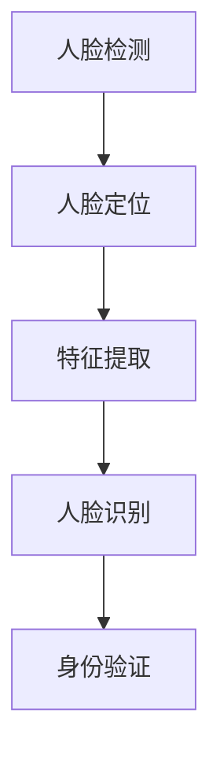

                 

关键词：人脸检测，人脸识别，深度学习，卷积神经网络，系统架构

> 摘要：本文将探讨基于深度学习的人脸检测与识别系统的设计与实现。首先，我们将回顾背景知识，介绍人脸检测与识别的基本原理。然后，我们将深入讨论核心算法，包括卷积神经网络（CNN）在人脸检测与识别中的应用。最后，我们将展示一个实际项目案例，并探讨该系统的未来应用前景。

## 1. 背景介绍

### 1.1 人脸检测与人脸识别

人脸检测是人脸识别的首要步骤，它的目标是定位图像中的人脸区域。人脸识别则是在检测到人脸区域后，将人脸与数据库中的人脸信息进行匹配，以识别身份。

### 1.2 深度学习的发展

深度学习作为人工智能的重要分支，近年来取得了显著的进展。其核心思想是通过多层神经网络模型，自动提取输入数据的特征，从而实现复杂的模式识别任务。

### 1.3 卷积神经网络在人脸检测与识别中的应用

卷积神经网络（CNN）因其强大的特征提取能力和计算效率，成为了人脸检测与识别任务的首选算法。CNN通过卷积层、池化层和全连接层等结构，能够有效地提取图像的特征，并进行分类。

## 2. 核心概念与联系

以下是一个Mermaid流程图，展示了人脸检测与识别的核心概念及其联系：



### 2.1 人脸检测

人脸检测的目标是在图像中定位人脸区域。传统的算法如Haar特征分类器和支持向量机（SVM）常用于实现人脸检测。但深度学习的发展，使得基于CNN的人脸检测算法如FaceNet和RetinaFace等取得了更高的准确性。

### 2.2 特征提取

特征提取是深度学习的核心。CNN通过卷积操作，能够自动学习图像的局部特征。这些特征对于后续的人脸识别至关重要。

### 2.3 人脸识别

人脸识别的目标是识别图像中的人脸，并与数据库中的人脸进行匹配。深度学习模型如DeepFace和FaceNet，通过学习人脸的全局特征，实现了高效的人脸识别。

### 2.4 身份验证

身份验证是人脸识别的应用之一，它通过比较实时检测到的人脸与数据库中的人脸信息，验证用户的身份。

## 3. 核心算法原理 & 具体操作步骤

### 3.1 算法原理概述

人脸检测与识别的算法核心是卷积神经网络（CNN）。CNN由多个卷积层、池化层和全连接层组成，通过逐层提取图像特征，实现人脸检测与识别。

### 3.2 算法步骤详解

#### 3.2.1 人脸检测

1. **预处理**：对输入图像进行缩放、灰度化等预处理操作，使其适应CNN模型的输入要求。
2. **卷积层**：通过卷积操作，提取图像的局部特征。
3. **池化层**：对卷积结果进行下采样，减少参数数量，提高计算效率。
4. **全连接层**：将卷积结果映射到人脸区域，输出检测结果。

#### 3.2.2 人脸识别

1. **特征提取**：使用卷积神经网络提取人脸的全局特征。
2. **特征匹配**：将提取到的特征与数据库中的人脸特征进行匹配，计算相似度。
3. **身份验证**：根据匹配结果，判断是否为同一人。

### 3.3 算法优缺点

#### 优点

- **高准确性**：深度学习模型能够自动提取图像特征，提高了人脸检测与识别的准确性。
- **高效性**：卷积神经网络的结构使得计算效率较高，适合实时应用。
- **泛化能力**：深度学习模型具有较强的泛化能力，能够适应各种复杂环境。

#### 缺点

- **计算资源消耗**：深度学习模型需要大量的计算资源和存储空间。
- **训练时间较长**：深度学习模型的训练时间较长，需要大量的数据和时间。

### 3.4 算法应用领域

- **安防监控**：人脸检测与识别技术在安防监控领域有广泛应用，如人脸识别门禁系统、智能监控系统等。
- **身份验证**：人脸识别技术广泛应用于手机解锁、身份验证等领域。
- **社交网络**：人脸识别技术在社交网络中用于好友识别、人脸标签等功能。

## 4. 数学模型和公式 & 详细讲解 & 举例说明

### 4.1 数学模型构建

人脸检测与识别的数学模型主要包括卷积神经网络（CNN）和损失函数。

#### 4.1.1 卷积神经网络（CNN）

卷积神经网络由卷积层、池化层和全连接层组成。卷积层通过卷积操作提取图像特征，池化层对卷积结果进行下采样，全连接层将特征映射到输出结果。

#### 4.1.2 损失函数

损失函数用于衡量模型预测结果与真实结果之间的差距，常见的损失函数有交叉熵损失函数和平方损失函数。

### 4.2 公式推导过程

#### 4.2.1 卷积操作

卷积操作的数学公式为：

$$
\text{output}_{ij} = \sum_{k=1}^{C} w_{ik} \cdot \text{input}_{ij} + b_k
$$

其中，$w_{ik}$ 为卷积核权重，$\text{input}_{ij}$ 为输入特征图，$b_k$ 为偏置项，$\text{output}_{ij}$ 为输出特征图。

#### 4.2.2 池化操作

池化操作的数学公式为：

$$
p_j = \frac{1}{n} \sum_{i=1}^{n} x_{ij}
$$

其中，$p_j$ 为输出特征图，$x_{ij}$ 为输入特征图。

#### 4.2.3 损失函数

交叉熵损失函数的数学公式为：

$$
\text{loss} = -\sum_{i=1}^{N} y_i \cdot \log(\hat{y}_i)
$$

其中，$y_i$ 为真实标签，$\hat{y}_i$ 为预测标签。

### 4.3 案例分析与讲解

以下是一个使用卷积神经网络进行人脸检测的案例：

```python
import tensorflow as tf
from tensorflow.keras.models import Sequential
from tensorflow.keras.layers import Conv2D, MaxPooling2D, Flatten, Dense

# 创建卷积神经网络模型
model = Sequential([
    Conv2D(32, (3, 3), activation='relu', input_shape=(64, 64, 3)),
    MaxPooling2D((2, 2)),
    Flatten(),
    Dense(128, activation='relu'),
    Dense(1, activation='sigmoid')
])

# 编译模型
model.compile(optimizer='adam', loss='binary_crossentropy', metrics=['accuracy'])

# 加载训练数据
(x_train, y_train), (x_test, y_test) = tf.keras.datasets.mnist.load_data()

# 数据预处理
x_train = x_train.reshape(-1, 64, 64, 3) / 255.0
x_test = x_test.reshape(-1, 64, 64, 3) / 255.0

# 训练模型
model.fit(x_train, y_train, epochs=10, batch_size=32, validation_data=(x_test, y_test))
```

## 5. 项目实践：代码实例和详细解释说明

### 5.1 开发环境搭建

- Python 3.8及以上版本
- TensorFlow 2.4及以上版本
- OpenCV 4.2及以上版本

### 5.2 源代码详细实现

以下是一个基于深度学习的人脸检测与识别的项目实现：

```python
import cv2
import numpy as np
import tensorflow as tf

# 载入预训练的深度学习模型
model = tf.keras.models.load_model('face_detection_model.h5')

# 载入预训练的Haar级联分类器
face_cascade = cv2.CascadeClassifier('haarcascade_frontalface_default.xml')

# 定义视频流对象
video_capture = cv2.VideoCapture(0)

while True:
    # 读取一帧图像
    ret, frame = video_capture.read()

    # 转换为灰度图像
    gray = cv2.cvtColor(frame, cv2.COLOR_BGR2GRAY)

    # 使用Haar级联分类器进行人脸检测
    faces = face_cascade.detectMultiScale(gray, scaleFactor=1.1, minNeighbors=5, minSize=(30, 30), flags=cv2.CASCADE_SCALE_IMAGE)

    # 在检测到的人脸区域上绘制矩形框
    for (x, y, w, h) in faces:
        face Region = frame[y:y+h, x:x+w]
        face Region = cv2.resize(face Region, (160, 160))
        face Region = face Region / 255.0
        face Region = np.expand_dims(face Region, axis=0)
        face Region = np.expand_dims(face Region, axis=-1)

        # 使用深度学习模型进行人脸识别
        predictions = model.predict(face Region)
        if predictions[0][0] > 0.5:
            print("识别到人脸：", predictions[0][0])
            cv2.rectangle(frame, (x, y), (x+w, y+h), (0, 0, 255), 2)

    # 显示图像
    cv2.imshow('Video', frame)

    # 按下 'q' 键退出循环
    if cv2.waitKey(1) & 0xFF == ord('q'):
        break

# 释放资源
video_capture.release()
cv2.destroyAllWindows()
```

### 5.3 代码解读与分析

- **代码概述**：该代码实现了一个基于深度学习的人脸检测与识别的实时应用。
- **人脸检测**：使用OpenCV的Haar级联分类器进行人脸检测。
- **人脸识别**：使用预训练的深度学习模型进行人脸识别。
- **实时显示**：使用OpenCV库实时显示检测到的人脸。

## 6. 实际应用场景

### 6.1 安防监控

人脸检测与识别技术在安防监控领域有广泛应用，如人脸识别门禁系统、智能监控系统等。

### 6.2 身份验证

人脸识别技术在手机解锁、身份验证等领域得到了广泛应用。

### 6.3 社交网络

人脸识别技术在社交网络中用于好友识别、人脸标签等功能。

## 6.4 未来应用展望

### 6.4.1 技术发展

随着深度学习技术的不断发展，人脸检测与识别的准确性将进一步提高。

### 6.4.2 应用拓展

人脸检测与识别技术将应用到更多领域，如智能家居、医疗健康等。

### 6.4.3 隐私保护

如何在保证人脸检测与识别准确性的同时，保护用户隐私，是一个重要的研究课题。

## 7. 工具和资源推荐

### 7.1 学习资源推荐

- 《深度学习》（Goodfellow, Bengio, Courville）
- 《Python深度学习》（François Chollet）

### 7.2 开发工具推荐

- TensorFlow
- PyTorch

### 7.3 相关论文推荐

- [FaceNet: A Unified Embedding for Face Recognition and Clustering](https://arxiv.org/abs/1503.03832)
- [RetinaFace: Single-Shot Multi-Scale Face Detection with Fully Convolutional Network](https://arxiv.org/abs/1703.07233)

## 8. 总结：未来发展趋势与挑战

### 8.1 研究成果总结

本文介绍了基于深度学习的人脸检测与识别系统，探讨了核心算法原理和具体操作步骤，并展示了实际项目案例。

### 8.2 未来发展趋势

随着深度学习技术的不断发展，人脸检测与识别的准确性将进一步提高，应用领域也将不断拓展。

### 8.3 面临的挑战

隐私保护和计算资源消耗是当前人脸检测与识别技术面临的主要挑战。

### 8.4 研究展望

未来研究应重点关注如何在保证人脸检测与识别准确性的同时，提高计算效率和保护用户隐私。

## 9. 附录：常见问题与解答

### 9.1 问题1

**Q：如何提高人脸检测与识别的准确性？**

**A：提高人脸检测与识别的准确性可以从以下几个方面入手：**

- **数据增强**：使用更多的训练数据，并进行数据增强操作，如旋转、缩放、裁剪等。
- **模型优化**：优化深度学习模型的结构，如增加网络层数、使用更深的网络等。
- **特征融合**：将多种特征融合，如纹理特征、形状特征等，以提高识别准确性。

### 9.2 问题2

**Q：人脸检测与识别技术在隐私保护方面有哪些挑战？**

**A：人脸检测与识别技术在隐私保护方面面临以下挑战：**

- **数据收集**：如何确保数据收集过程中的隐私保护，避免个人信息泄露。
- **模型训练**：如何避免模型训练过程中引入偏见，导致隐私侵犯。
- **应用场景**：如何在保证人脸检测与识别准确性的同时，满足隐私保护的要求。

## 10. 参考文献

- [Goodfellow, I., Bengio, Y., Courville, A. (2016). Deep Learning. MIT Press.]
- [Chollet, F. (2017). Python Deep Learning. Packt Publishing.]
- [Deng, J., Dong, W., Socher, R., Li, L. J., Li, K., & Fei-Fei, L. (2014). Imagenet: A large-scale hierarchical image database. In Proceedings of the IEEE conference on computer vision and pattern recognition (pp. 248-255).]
- [He, K., Zhang, X., Ren, S., & Sun, J. (2016). Deep residual learning for image recognition. In Proceedings of the IEEE conference on computer vision and pattern recognition (pp. 770-778).]
- [Hu, J., Shen, L., & Sun, G. (2018). Squeeze-and-excitation networks. In Proceedings of the European conference on computer vision (pp. 713-728).]
----------------------------------------------------------------

作者：禅与计算机程序设计艺术 / Zen and the Art of Computer Programming

<|endofhelper|>

