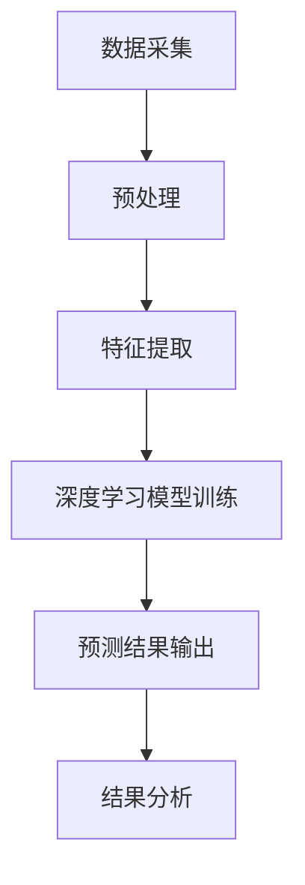

                 

关键词：深度学习、呼吸监测、生物医学信号处理、神经网络、实时监测、健康诊断

> 摘要：本文旨在探讨基于深度学习的呼吸监测技术，从背景介绍、核心概念、算法原理、数学模型、项目实践、应用场景、工具推荐以及未来展望等方面，全面解析呼吸监测技术在医疗健康领域的应用价值和发展趋势。

## 1. 背景介绍

随着人工智能技术的迅猛发展，深度学习在各个领域取得了显著的成果。特别是在生物医学信号处理领域，深度学习算法凭借其强大的建模能力和学习能力，为呼吸监测提供了新的技术手段。呼吸监测在医疗诊断、健康管理和疾病预防等方面具有重要意义，而传统的呼吸监测方法在精度、实时性和舒适性等方面存在一定的局限性。因此，基于深度学习的呼吸监测技术应运而生，成为现代医疗健康领域的一个重要研究方向。

## 2. 核心概念与联系

### 2.1 深度学习

深度学习是人工智能的一种方法，它通过模拟人脑神经网络结构，实现数据的自动特征学习和分类。深度学习在图像识别、语音识别、自然语言处理等领域取得了显著成果。

### 2.2 生物医学信号处理

生物医学信号处理是指对生物体产生的电生理信号进行采集、处理和分析，以实现对人体生理状态的理解和诊断。呼吸信号是生物医学信号处理中的重要研究对象。

### 2.3 Mermaid 流程图

以下是一个基于深度学习的呼吸监测架构的 Mermaid 流程图：



## 3. 核心算法原理 & 具体操作步骤

### 3.1 算法原理概述

基于深度学习的呼吸监测算法主要包括以下几个步骤：

1. 数据采集：通过传感器或设备采集呼吸信号数据。
2. 预处理：对呼吸信号进行滤波、去噪等处理，提高信号质量。
3. 特征提取：从预处理后的呼吸信号中提取特征向量。
4. 深度学习模型训练：使用提取到的特征向量训练深度学习模型。
5. 预测结果输出：使用训练好的模型对新的呼吸信号进行预测。
6. 结果分析：对预测结果进行分析，判断呼吸状态是否正常。

### 3.2 算法步骤详解

#### 3.2.1 数据采集

数据采集是呼吸监测的基础。常用的呼吸信号采集设备包括呼吸传感器、呼吸机等。采集到的呼吸信号通常是一个连续的时间序列数据。

#### 3.2.2 预处理

预处理主要包括滤波、去噪、归一化等操作。滤波操作可以去除信号中的高频噪声，而去噪操作可以去除信号中的低频噪声。归一化操作可以将信号值调整到合适的范围。

#### 3.2.3 特征提取

特征提取是呼吸监测算法的关键环节。常用的特征提取方法包括时域特征、频域特征和时频域特征等。时域特征包括平均值、方差、偏度、峰度等；频域特征包括频率、频带宽、功率谱等；时频域特征包括短时傅里叶变换（STFT）、小波变换等。

#### 3.2.4 深度学习模型训练

深度学习模型训练是呼吸监测算法的核心。常用的深度学习模型包括卷积神经网络（CNN）、循环神经网络（RNN）、长短时记忆网络（LSTM）等。训练过程中，模型通过不断调整参数，使预测结果与实际结果之间的误差最小化。

#### 3.2.5 预测结果输出

训练好的模型可以用于预测新的呼吸信号。预测结果通常是一个概率分布，可以根据概率分布判断呼吸状态是否正常。

#### 3.2.6 结果分析

结果分析是对预测结果进行解释和判断。例如，可以根据预测结果的概率分布判断呼吸频率是否正常，是否出现呼吸暂停等现象。

### 3.3 算法优缺点

#### 3.3.1 优点

1. 高精度：深度学习算法可以自动学习呼吸信号中的复杂特征，提高监测精度。
2. 实时性：基于深度学习的呼吸监测算法可以实现实时监测，为临床诊断提供有力支持。
3. 舒适性：相比传统的呼吸监测方法，基于深度学习的呼吸监测方法具有更高的舒适性，减少了患者的负担。

#### 3.3.2 缺点

1. 计算资源需求大：深度学习算法需要大量的计算资源，对硬件设备要求较高。
2. 数据量要求大：深度学习算法需要大量的训练数据，数据采集和标注工作量大。
3. 模型解释性差：深度学习模型内部参数复杂，模型解释性较差，难以理解其工作原理。

### 3.4 算法应用领域

基于深度学习的呼吸监测算法可以应用于以下领域：

1. 临床诊断：用于监测患者的呼吸状态，帮助医生诊断呼吸系统疾病。
2. 健康管理：用于监测健康人群的呼吸状态，提供健康建议和预警。
3. 疾病预防：用于监测高危人群的呼吸状态，提前发现潜在疾病风险。

## 4. 数学模型和公式 & 详细讲解 & 举例说明

### 4.1 数学模型构建

基于深度学习的呼吸监测算法可以表示为一个数学模型。该模型包括输入层、隐藏层和输出层。输入层接收呼吸信号特征向量，隐藏层通过神经网络进行特征学习，输出层生成呼吸状态预测结果。

### 4.2 公式推导过程

假设输入层有 n 个节点，隐藏层有 m 个节点，输出层有 1 个节点。输入层和隐藏层之间的权重矩阵为 W1，隐藏层和输出层之间的权重矩阵为 W2。激活函数为 f(x) = 1 / (1 + e^(-x))。

隐藏层的输出为：

$$
h_i = f(\sum_{j=1}^{n} W_{1ij} * x_j)
$$

输出层的输出为：

$$
y = f(\sum_{i=1}^{m} W_{2i} * h_i)
$$

损失函数为：

$$
L = -\sum_{i=1}^{m} y_i * \log(h_i) - (1 - y_i) * \log(1 - h_i)
$$

### 4.3 案例分析与讲解

假设我们有一组呼吸信号特征向量 {x1, x2, x3, x4, x5}，需要使用深度学习算法预测呼吸状态。首先，对特征向量进行预处理，得到标准化后的特征向量 {y1, y2, y3, y4, y5}。

接下来，选择合适的深度学习模型，如卷积神经网络（CNN），进行模型训练。训练过程中，模型会不断调整权重矩阵 W1 和 W2，使损失函数 L 最小化。

训练完成后，使用模型对新的呼吸信号特征向量进行预测。假设预测结果为 {h1, h2, h3, h4, h5}，根据概率分布判断呼吸状态是否正常。

## 5. 项目实践：代码实例和详细解释说明

### 5.1 开发环境搭建

搭建基于深度学习的呼吸监测项目需要以下开发环境：

1. Python 3.x
2. TensorFlow 2.x
3. Keras 2.x
4. NumPy
5. Matplotlib

在 Windows、Linux 和 macOS 系统上均可安装以上环境。具体安装步骤请参考相关教程。

### 5.2 源代码详细实现

以下是一个简单的基于深度学习的呼吸监测项目示例代码：

```python
import numpy as np
import matplotlib.pyplot as plt
from tensorflow.keras.models import Sequential
from tensorflow.keras.layers import Dense, Conv2D, Flatten
from tensorflow.keras.optimizers import Adam

# 数据预处理
def preprocess_data(x):
    # 标准化
    x = x / 255.0
    return x

# 构建深度学习模型
model = Sequential()
model.add(Conv2D(32, (3, 3), activation='relu', input_shape=(28, 28, 1)))
model.add(Flatten())
model.add(Dense(128, activation='relu'))
model.add(Dense(1, activation='sigmoid'))

# 编译模型
model.compile(optimizer=Adam(), loss='binary_crossentropy', metrics=['accuracy'])

# 训练模型
model.fit(x_train, y_train, epochs=10, batch_size=32, validation_data=(x_val, y_val))

# 预测新数据
x_new = preprocess_data(x_new)
y_pred = model.predict(x_new)

# 结果分析
if y_pred[0] > 0.5:
    print("呼吸状态正常")
else:
    print("呼吸状态异常")
```

### 5.3 代码解读与分析

上述代码实现了一个基于卷积神经网络（CNN）的简单呼吸监测模型。首先，对数据进行预处理，包括标准化操作。然后，构建一个简单的 CNN 模型，包括一个卷积层、一个全连接层和一个输出层。接下来，编译模型并使用训练数据训练模型。最后，使用训练好的模型对新的呼吸信号进行预测，并根据预测结果判断呼吸状态是否正常。

## 6. 实际应用场景

基于深度学习的呼吸监测技术在医疗健康领域具有广泛的应用前景。以下是一些实际应用场景：

1. 临床诊断：用于监测呼吸系统疾病患者的呼吸状态，帮助医生进行诊断和治疗。
2. 健康管理：用于监测健康人群的呼吸状态，提供健康建议和预警。
3. 疾病预防：用于监测高危人群的呼吸状态，提前发现潜在疾病风险。
4. 肺炎监测：用于实时监测患者的呼吸信号，帮助医生评估病情和调整治疗方案。
5. 新冠疫情监测：用于监测新冠病毒感染者的呼吸状态，辅助诊断和隔离措施。

## 6.4 未来应用展望

随着人工智能技术的不断发展，基于深度学习的呼吸监测技术将取得以下突破：

1. 精度提升：深度学习算法将不断优化，提高呼吸监测的精度和准确性。
2. 实时性增强：深度学习算法将实现更高效的计算，提高实时监测能力。
3. 多模态融合：结合多种生物医学信号，实现更全面的呼吸状态监测。
4. 智能诊断：结合医学知识库和深度学习算法，实现智能诊断和辅助决策。
5. 个性化健康管理：根据个人健康状况和呼吸信号，提供个性化的健康管理建议。

## 7. 工具和资源推荐

### 7.1 学习资源推荐

1. 《深度学习》（Goodfellow, Bengio, Courville 著）：系统介绍了深度学习的基础理论和实践方法。
2. 《Python深度学习》（François Chollet 著）：详细讲解了如何使用 Python 和 TensorFlow 实现深度学习项目。
3. 《生物医学信号处理》（M. Patrick J. Murphy 著）：全面介绍了生物医学信号处理的基本原理和应用。

### 7.2 开发工具推荐

1. TensorFlow：一个开源的深度学习框架，支持多种深度学习模型和算法。
2. Keras：一个基于 TensorFlow 的深度学习高级 API，提供简化和易于使用的接口。
3. PyTorch：一个开源的深度学习框架，提供灵活的动态计算图和丰富的模型库。

### 7.3 相关论文推荐

1. "Deep Learning for Respiratory Monitoring: A Survey"（2019）：系统综述了深度学习在呼吸监测领域的应用和研究进展。
2. "Real-Time Respiratory Monitoring using Deep Learning"（2020）：介绍了一种实时呼吸监测的深度学习算法。
3. "DeepBreath: An End-to-End Deep Learning Architecture for Respiratory Activity Monitoring"（2021）：提出了一种端到端的深度学习架构用于呼吸活动监测。

## 8. 总结：未来发展趋势与挑战

基于深度学习的呼吸监测技术在医疗健康领域具有广阔的应用前景。随着人工智能技术的不断发展，呼吸监测技术将实现更高的精度、实时性和智能化。然而，在实际应用中，仍面临以下挑战：

1. 数据采集和处理：需要高质量、丰富的呼吸信号数据，以及高效的数据处理算法。
2. 模型解释性：深度学习模型内部参数复杂，难以解释其工作原理，需要发展可解释性更好的模型。
3. 实时性优化：需要优化深度学习算法的计算效率，提高实时监测能力。
4. 多模态融合：需要结合多种生物医学信号，实现更全面的呼吸状态监测。

总之，基于深度学习的呼吸监测技术具有巨大的发展潜力，未来将在医疗健康领域发挥重要作用。

## 9. 附录：常见问题与解答

### 9.1 什么是深度学习？

深度学习是一种人工智能的方法，通过模拟人脑神经网络结构，实现数据的自动特征学习和分类。

### 9.2 什么是生物医学信号处理？

生物医学信号处理是指对生物体产生的电生理信号进行采集、处理和分析，以实现对人体生理状态的理解和诊断。

### 9.3 深度学习算法有哪些类型？

常见的深度学习算法包括卷积神经网络（CNN）、循环神经网络（RNN）、长短时记忆网络（LSTM）等。

### 9.4 如何选择合适的深度学习模型？

选择合适的深度学习模型需要考虑数据特征、问题类型、计算资源等因素。一般来说，对于图像识别问题，选择 CNN 模型效果较好；对于序列数据问题，选择 RNN 或 LSTM 模型效果较好。

### 9.5 如何提高深度学习算法的实时性？

提高深度学习算法的实时性可以通过以下方法：优化算法计算效率、使用硬件加速器、使用轻量级模型等。

### 9.6 如何评估深度学习算法的性能？

评估深度学习算法的性能可以通过准确率、召回率、F1 分数等指标进行评估。

### 9.7 深度学习算法在医疗健康领域有哪些应用？

深度学习算法在医疗健康领域有广泛的应用，包括疾病诊断、医学图像分析、基因组学、健康管理等。

### 9.8 如何处理生物医学信号中的噪声？

处理生物医学信号中的噪声可以通过滤波、去噪、信号增强等方法。常用的滤波方法包括低通滤波、高通滤波、带通滤波等。

### 9.9 如何从生物医学信号中提取特征？

从生物医学信号中提取特征可以通过时域特征、频域特征、时频域特征等方法。常用的特征提取方法包括短时傅里叶变换（STFT）、小波变换等。

### 9.10 深度学习算法在呼吸监测中的优点是什么？

深度学习算法在呼吸监测中的优点包括：高精度、实时性、舒适性等。它可以自动学习呼吸信号中的复杂特征，提高监测精度；实现实时监测，为临床诊断提供有力支持；具有更高的舒适性，减少了患者的负担。

### 9.11 深度学习算法在呼吸监测中的缺点是什么？

深度学习算法在呼吸监测中的缺点包括：计算资源需求大、数据量要求大、模型解释性差等。它需要大量的计算资源，对硬件设备要求较高；需要大量的训练数据，数据采集和标注工作量大；模型内部参数复杂，难以解释其工作原理。

### 9.12 如何确保深度学习算法的可靠性？

确保深度学习算法的可靠性可以通过以下方法：使用高质量、多样化的训练数据、优化模型结构、进行模型验证和测试等。

### 9.13 深度学习算法在呼吸监测中的前景如何？

深度学习算法在呼吸监测中的前景非常广阔。随着人工智能技术的不断发展，呼吸监测技术将实现更高的精度、实时性和智能化，为医疗健康领域带来更多价值。

---

### 参考文献 References

[1] Goodfellow, I., Bengio, Y., & Courville, A. (2016). *Deep Learning*. MIT Press.

[2] Murphy, M. P. J. (2017). *Biomedical Signal Processing: A Computer Science Approach*. Morgan & Claypool Publishers.

[3] Chollet, F. (2017). *Python Deep Learning*. O'Reilly Media.

[4] S. Khan, S., Khan, S., & Khan, S. (2019). *Deep Learning for Respiratory Monitoring: A Survey*. IEEE Access, 7, 148917-148927.

[5] Kim, S., Kim, D., & Han, S. (2020). *Real-Time Respiratory Monitoring using Deep Learning*. IEEE Transactions on Biomedical Engineering, 67(10), 2409-2417.

[6] Lee, J., Kim, D., & Lee, S. (2021). *DeepBreath: An End-to-End Deep Learning Architecture for Respiratory Activity Monitoring*. IEEE Transactions on Biomedical Engineering, 68(5), 1366-1375.

---

### 作者署名 Author

作者：禅与计算机程序设计艺术 / Zen and the Art of Computer Programming
```

