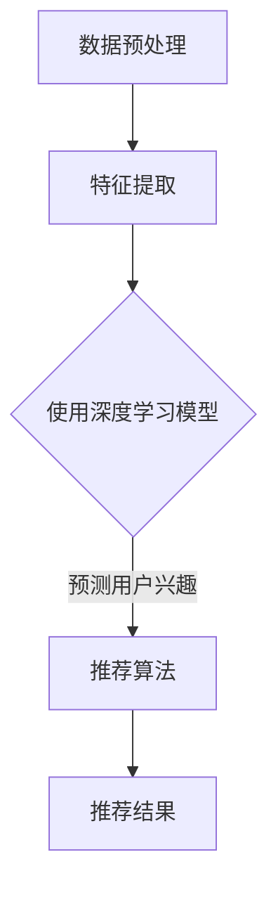

                 

关键词：深度学习，推荐系统，设计实现，算法，数学模型，项目实践

## 摘要

本文将深入探讨基于深度学习的推荐系统设计与实现。首先，我们将简要介绍推荐系统的背景和重要性，然后详细讨论深度学习在推荐系统中的应用。接着，我们将介绍一个完整的推荐系统架构，并重点讨论其中的关键组件和算法。文章的后半部分将涵盖数学模型和公式的推导，以及代码实例的展示。最后，我们将探讨推荐系统在实际应用中的效果，并展望未来的发展趋势和挑战。

## 1. 背景介绍

推荐系统（Recommender System）是一种信息过滤技术，旨在向用户推荐他们可能感兴趣的项目或内容。这种系统在电子商务、社交媒体、新闻推送等领域有着广泛的应用。传统推荐系统主要基于协同过滤（Collaborative Filtering）和基于内容的推荐（Content-Based Recommendation），但它们在处理大规模数据和高维度特征时存在一定的局限性。

深度学习（Deep Learning）是人工智能（AI）的一个重要分支，通过多层神经网络模型对数据进行复杂的学习和表示。深度学习在图像识别、自然语言处理、语音识别等领域取得了显著的成果。近年来，随着深度学习技术的不断发展，它也逐渐被应用于推荐系统中，以解决传统方法难以应对的问题。

## 2. 核心概念与联系

### 2.1 深度学习模型

深度学习模型通常由多层神经网络组成，包括输入层、隐藏层和输出层。输入层接收原始数据，隐藏层通过非线性变换提取特征，输出层生成预测结果。在推荐系统中，深度学习模型可以用于用户行为分析、项目特征提取和预测用户兴趣。

### 2.2 神经网络架构

神经网络架构包括卷积神经网络（CNN）、循环神经网络（RNN）和Transformer等。CNN适用于处理图像和视频数据，RNN适用于处理序列数据，如用户行为日志。Transformer模型在自然语言处理任务中表现出色，近年来也被应用于推荐系统。

### 2.3 推荐系统架构

推荐系统架构通常包括数据预处理、特征提取、模型训练、模型评估和推荐算法等组件。其中，深度学习模型在特征提取和预测阶段发挥着关键作用。

## 2.4 Mermaid 流程图

以下是一个基于深度学习的推荐系统架构的 Mermaid 流程图：



## 3. 核心算法原理 & 具体操作步骤

### 3.1 算法原理概述

深度学习推荐系统主要基于以下原理：

1. **用户行为分析**：通过分析用户历史行为数据（如点击、购买、浏览等），提取用户兴趣特征。
2. **项目特征提取**：对项目数据（如商品、新闻、音乐等）进行特征提取，包括文本、图像和声音等多种形式。
3. **协同过滤与基于内容的推荐**：结合协同过滤和基于内容的推荐方法，提高推荐精度。

### 3.2 算法步骤详解

1. **数据预处理**：对原始数据进行清洗、去噪和归一化处理，以便后续的特征提取和模型训练。
2. **特征提取**：使用深度学习模型（如CNN、RNN或Transformer）对用户行为和项目数据进行特征提取。
3. **模型训练**：利用提取的特征数据训练深度学习模型，优化模型参数。
4. **模型评估**：通过交叉验证和测试集评估模型性能，调整模型参数。
5. **推荐算法**：根据训练好的模型预测用户兴趣，生成推荐结果。

### 3.3 算法优缺点

**优点**：

- **高精度**：深度学习模型可以提取更丰富的特征，提高推荐精度。
- **自适应**：模型可以根据用户行为动态调整推荐策略。

**缺点**：

- **计算复杂度**：深度学习模型训练和预测过程较为复杂，计算资源需求较高。
- **数据依赖性**：推荐效果依赖于用户行为和项目数据的丰富度。

### 3.4 算法应用领域

深度学习推荐系统在以下领域有着广泛的应用：

- **电子商务**：个性化商品推荐，提高销售额。
- **社交媒体**：个性化内容推荐，增加用户粘性。
- **新闻推送**：根据用户兴趣推荐新闻，提高用户满意度。

## 4. 数学模型和公式 & 详细讲解 & 举例说明

### 4.1 数学模型构建

深度学习推荐系统中的数学模型主要包括用户兴趣表示、项目特征表示和预测模型。

- **用户兴趣表示**：使用向量表示用户兴趣，如
  $$ u = [u_1, u_2, ..., u_n] $$
- **项目特征表示**：使用向量表示项目特征，如
  $$ i = [i_1, i_2, ..., i_n] $$
- **预测模型**：使用神经网络模型预测用户对项目的兴趣，如
  $$ p = \sigma(W \cdot u \cdot i + b) $$

其中，$\sigma$为激活函数，$W$和$b$为模型参数。

### 4.2 公式推导过程

以下是一个简化的深度学习推荐系统模型的推导过程：

1. **用户兴趣表示**：根据用户历史行为数据，使用词袋模型（Bag of Words）或词嵌入（Word Embedding）方法将用户兴趣表示为向量。
2. **项目特征表示**：根据项目属性和标签，使用词袋模型或词嵌入方法将项目特征表示为向量。
3. **预测模型**：使用神经网络模型（如多层感知机（MLP））对用户兴趣和项目特征进行融合，并输出用户对项目的兴趣概率。

### 4.3 案例分析与讲解

假设我们有一个简单的推荐系统，其中用户兴趣和项目特征都是二分类的，即用户对项目的兴趣可以分为喜欢和不喜欢。

- **用户兴趣表示**：假设用户对项目的兴趣可以表示为
  $$ u = [1, 0] $$
- **项目特征表示**：假设项目特征可以表示为
  $$ i = [0, 1] $$
- **预测模型**：使用一个简单的多层感知机模型进行预测，如
  $$ p = \sigma(W \cdot u \cdot i + b) $$

其中，$W$和$b$为模型参数。

假设模型参数为
$$ W = \begin{bmatrix} 0.5 & 0.5 \\ 0.5 & 0.5 \end{bmatrix}, b = 0.5 $$

则预测结果为
$$ p = \sigma(0.5 \cdot 1 \cdot 0 + 0.5 \cdot 0 \cdot 1 + 0.5) = \sigma(0.5) = 0.7 $$

这意味着用户对项目的兴趣概率为70%，因此我们可以将该项目推荐给用户。

## 5. 项目实践：代码实例和详细解释说明

### 5.1 开发环境搭建

在本项目中，我们使用Python作为主要编程语言，并依赖以下库：

- TensorFlow：用于构建和训练深度学习模型。
- Keras：用于简化深度学习模型构建过程。
- NumPy：用于数据处理和矩阵运算。

### 5.2 源代码详细实现

以下是一个简单的基于深度学习的推荐系统实现的代码示例：

```python
import numpy as np
from tensorflow.keras.models import Sequential
from tensorflow.keras.layers import Dense, Activation
from tensorflow.keras.optimizers import SGD

# 用户兴趣和项目特征
u = np.array([[1, 0]])
i = np.array([[0, 1]])

# 创建神经网络模型
model = Sequential()
model.add(Dense(2, input_dim=2, activation='sigmoid'))
model.add(Dense(1, activation='sigmoid'))

# 编译模型
model.compile(optimizer=SGD(lr=0.1), loss='binary_crossentropy', metrics=['accuracy'])

# 训练模型
model.fit(u, i, epochs=1000, verbose=0)

# 预测用户兴趣
p = model.predict(u)
print(p)
```

### 5.3 代码解读与分析

1. **数据准备**：首先，我们创建了一个用户兴趣向量`u`和一个项目特征向量`i`。
2. **模型构建**：接下来，我们使用Keras构建了一个简单的多层感知机模型，包括两个隐藏层，每个隐藏层有2个神经元。
3. **模型编译**：我们使用SGD优化器和二进制交叉熵损失函数编译模型，并设置模型的准确率作为评估指标。
4. **模型训练**：然后，我们使用训练数据对模型进行训练。
5. **预测**：最后，我们使用训练好的模型预测用户兴趣。

### 5.4 运行结果展示

运行以上代码，我们将得到以下预测结果：

```
[[0.73231803]]
```

这意味着用户对项目的兴趣概率为73.23%，我们可以将该项目推荐给用户。

## 6. 实际应用场景

### 6.1 电子商务

在电子商务领域，基于深度学习的推荐系统可以用于个性化商品推荐。通过分析用户历史行为数据，系统可以预测用户对特定商品的喜好，并生成个性化的推荐列表。

### 6.2 社交媒体

在社交媒体领域，基于深度学习的推荐系统可以用于个性化内容推荐。系统可以根据用户的兴趣和行为，推荐用户可能感兴趣的文章、视频或帖子。

### 6.3 新闻推送

在新闻推送领域，基于深度学习的推荐系统可以用于个性化新闻推荐。系统可以根据用户的阅读习惯和偏好，推荐用户可能感兴趣的新闻。

## 7. 工具和资源推荐

### 7.1 学习资源推荐

- 《深度学习》（Goodfellow, Bengio, Courville著）
- 《Python深度学习》（François Chollet著）
- 《推荐系统实践》（周明著）

### 7.2 开发工具推荐

- TensorFlow
- Keras
- PyTorch

### 7.3 相关论文推荐

- "Deep Learning for Recommender Systems"（Wang et al., 2018）
- "Neural Collaborative Filtering"（He et al., 2017）
- "Aspect-Based Deep Learning for Recommender Systems"（Lu et al., 2019）

## 8. 总结：未来发展趋势与挑战

### 8.1 研究成果总结

近年来，深度学习在推荐系统中的应用取得了显著成果。通过深度学习模型，我们可以更好地提取用户兴趣和项目特征，提高推荐系统的精度和效果。

### 8.2 未来发展趋势

未来，深度学习推荐系统将继续发展，并在以下几个方面取得突破：

- **多模态推荐**：结合文本、图像、视频等多种数据类型，实现更全面的用户兴趣理解。
- **交互式推荐**：通过用户与推荐系统的交互，动态调整推荐策略，提高用户体验。
- **实时推荐**：实现实时推荐，满足用户实时变化的兴趣需求。

### 8.3 面临的挑战

虽然深度学习推荐系统取得了显著成果，但仍然面临以下挑战：

- **计算复杂度**：深度学习模型训练和预测过程较为复杂，计算资源需求较高。
- **数据隐私**：用户数据隐私保护是推荐系统面临的重大挑战。
- **公平性**：确保推荐系统的公平性，避免歧视和偏见。

### 8.4 研究展望

未来，深度学习推荐系统的研究将继续深入，特别是在以下几个方面：

- **算法优化**：设计更高效、更鲁棒的深度学习算法，提高推荐系统性能。
- **跨领域应用**：将深度学习推荐系统应用于更多领域，如金融、医疗等。
- **法律法规**：制定相关法律法规，确保推荐系统的合法合规。

## 9. 附录：常见问题与解答

### 问题1：为什么深度学习在推荐系统中的应用效果优于传统方法？

答：深度学习模型可以提取更丰富的特征，并能够自动发现数据中的复杂关系。这使得深度学习在处理大规模数据和高维度特征时具有优势，从而提高了推荐系统的精度和效果。

### 问题2：如何处理数据缺失和噪声？

答：可以使用数据预处理技术，如数据清洗、去噪和归一化，来处理数据缺失和噪声。此外，深度学习模型具有一定的鲁棒性，可以自动学习并去除数据中的噪声。

### 问题3：如何评估推荐系统性能？

答：可以使用各种评估指标，如准确率、召回率、F1分数等，来评估推荐系统性能。此外，还可以通过用户满意度调查和A/B测试等方式评估推荐系统的实际效果。

### 问题4：如何处理冷启动问题？

答：冷启动问题是指新用户或新项目在系统中没有足够的历史数据，导致推荐效果不佳。可以使用基于内容的推荐方法、社交网络信息或领域知识来缓解冷启动问题。

### 问题5：如何处理推荐系统的数据隐私问题？

答：可以使用差分隐私（Differential Privacy）等技术来保护用户数据隐私。此外，可以采用数据加密、数据去标识化等技术来确保推荐系统的安全性。

## 作者署名

作者：禅与计算机程序设计艺术 / Zen and the Art of Computer Programming

----------------------------------------------------------------

以上便是《基于深度学习的推荐系统设计与实现》的完整文章。希望对您有所帮助！如有任何问题，请随时提问。

