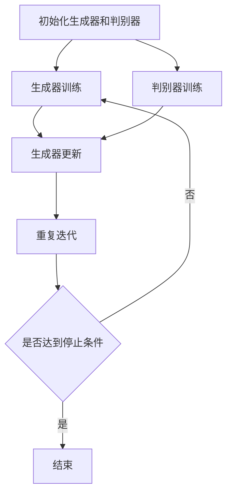

                 

 关键词：生成对抗网络（GAN）、复古风格图像、图像迁移、深度学习、图像处理、人工智能、计算机视觉。

> 摘要：本文将详细介绍基于生成对抗网络（GAN）的复古风格图像迁移技术的开发过程。通过深入剖析GAN的原理及其在图像迁移中的应用，本文旨在为读者提供一个系统、清晰的开发框架，以实现复古风格图像的生成与迁移。文章将从背景介绍、核心概念与联系、核心算法原理、数学模型和公式、项目实践、实际应用场景等多个方面展开讨论，为从事相关领域的研究者提供有价值的参考。

## 1. 背景介绍

随着深度学习技术的飞速发展，计算机视觉领域取得了诸多突破性成果。尤其是在图像处理和图像生成方面，深度学习模型凭借其强大的学习能力和泛化能力，成为了实现各种图像应用的重要工具。其中，生成对抗网络（Generative Adversarial Networks，GAN）作为一种新型的深度学习框架，因其独特的架构和优越的性能，在图像生成和图像迁移领域展现出了巨大的潜力。

GAN由Ian Goodfellow于2014年提出，其核心思想是通过两个深度神经网络——生成器（Generator）和判别器（Discriminator）之间的对抗训练来实现数据的生成。生成器试图生成尽可能真实的数据，而判别器则试图区分生成数据和真实数据。通过这种对抗训练，生成器能够不断提高生成数据的真实性，从而达到图像生成、图像修复、图像超分辨率等应用场景。

复古风格图像迁移技术则是指将一种风格的图像内容迁移到另一幅图像上，从而创造出具有特定艺术风格的图像。这一技术在艺术创作、游戏开发、电影特效等领域具有广泛的应用价值。传统的图像风格迁移方法往往依赖于手工设计的特征提取和匹配算法，效果有限。而基于GAN的图像迁移技术能够通过自动学习图像特征和风格，实现更高质量的图像风格迁移。

本文将围绕基于生成对抗网络的复古风格图像迁移技术开发，系统性地介绍其原理、算法、实现方法及应用场景，以期为相关领域的研究者提供参考和启示。

### 1.1 GAN的起源与发展

生成对抗网络（GAN）的起源可以追溯到生成模型和判别模型在机器学习领域的研究。生成模型旨在通过学习数据分布来生成新的数据，而判别模型则旨在区分给定数据是真实数据还是生成数据。GAN的提出，是将这两个模型整合到一个统一框架中，通过对抗训练实现数据的生成。

GAN的起源和发展经历了几个关键阶段。最初，Ian Goodfellow及其同事在2012年提出了深度信念网络（Deep Boltzmann Machines，DBM），并在2013年提出了深度卷积网络（Deep Convolutional Networks，DCN）。在此基础上，Goodfellow于2014年正式提出了生成对抗网络（GAN）。

GAN的发展可以分为几个阶段：

- **早期阶段**：GAN的早期研究主要集中在图像生成上，如生成人脸、风景等。然而，由于训练过程中生成器和判别器的动态平衡难以实现，GAN在早期阶段并未得到广泛应用。

- **改进阶段**：为了解决GAN训练不稳定的问题，研究者提出了许多改进方案，如深度卷积生成对抗网络（DCGAN）、序列生成对抗网络（SeqGAN）和基于变分自动编码器（VAE）的生成对抗网络等。这些改进使得GAN在图像生成任务中的表现得到了显著提升。

- **应用阶段**：随着GAN性能的不断提高，其在图像处理、图像修复、图像超分辨率、视频生成等多个领域的应用逐渐得到验证。特别是在图像迁移任务中，GAN表现出了强大的能力，能够实现高质量的风格迁移。

### 1.2 图像迁移技术的现状与发展

图像迁移技术是指将一种图像的内容或风格迁移到另一幅图像上，以创造新的视觉效果。传统的图像迁移方法通常依赖于手工设计的特征提取和匹配算法，如全局特征匹配、局部特征匹配和特征对齐等。这些方法在一定程度上能够实现图像迁移，但效果往往受到限制，无法处理复杂的图像内容和风格变化。

随着深度学习技术的发展，基于深度学习的图像迁移方法逐渐兴起。其中，生成对抗网络（GAN）作为一种有效的深度学习框架，在图像迁移任务中展现出了强大的性能。

目前，图像迁移技术主要可以分为以下几种类型：

- **内容迁移**：将一幅图像的内容迁移到另一幅图像上，如将一张人脸替换成另一张人脸。这类方法通常依赖于图像内容的自动编码和解码技术，通过学习图像内容的分布和特征来实现内容的迁移。

- **风格迁移**：将一种艺术风格或视觉风格迁移到另一幅图像上，如将普通照片转换成梵高风格、水彩风格等。这类方法主要依赖于生成对抗网络（GAN），通过学习图像内容和风格特征，实现高质量的图像风格迁移。

- **超分辨率迁移**：将低分辨率图像转换为高分辨率图像，并在迁移过程中保留图像内容。这类方法通常结合了生成对抗网络和超分辨率技术，通过学习图像的高频和低频特征，实现图像的超分辨率提升。

未来，图像迁移技术有望在以下方向取得进一步发展：

- **多模态迁移**：将不同类型的数据（如文本、音频、图像等）进行跨模态迁移，实现更丰富的交互和创造。

- **实时迁移**：通过优化算法和硬件加速，实现实时图像迁移，为实时应用场景提供技术支持。

- **自适应迁移**：根据输入图像的特征和需求，自适应地调整迁移策略，实现更灵活和高效的图像迁移。

### 1.3 本文结构与内容安排

本文将基于生成对抗网络（GAN）的复古风格图像迁移技术开发作为核心主题，系统性地介绍其相关概念、原理、实现方法和应用场景。具体结构如下：

- **第1章 背景介绍**：介绍GAN的起源与发展、图像迁移技术的现状与发展，以及本文的研究背景和目的。

- **第2章 核心概念与联系**：详细阐述生成对抗网络（GAN）的核心概念，包括生成器、判别器和对抗训练过程，并给出GAN架构的Mermaid流程图。

- **第3章 核心算法原理与具体操作步骤**：介绍GAN在图像迁移任务中的应用，包括算法原理概述、具体操作步骤、优缺点及应用领域。

- **第4章 数学模型和公式**：阐述生成对抗网络中的数学模型和公式，包括生成模型、判别模型、损失函数等，并进行详细讲解和举例说明。

- **第5章 项目实践**：通过实际项目，展示基于生成对抗网络的复古风格图像迁移技术的实现过程，包括开发环境搭建、源代码实现和代码解读等。

- **第6章 实际应用场景**：分析复古风格图像迁移技术在艺术创作、游戏开发、电影特效等领域的应用，并探讨未来应用展望。

- **第7章 工具和资源推荐**：推荐相关学习资源、开发工具和论文，为读者提供进一步学习和实践的支持。

- **第8章 总结**：总结研究成果，探讨未来发展趋势与挑战，为相关领域的研究提供参考。

通过以上结构安排，本文旨在为从事生成对抗网络和图像迁移技术研究的读者提供一个系统、全面的技术指南，以推动这一领域的发展。

## 2. 核心概念与联系

在深入探讨基于生成对抗网络（GAN）的复古风格图像迁移技术之前，有必要详细阐述GAN的核心概念和架构，以便读者对GAN的工作原理有全面的了解。以下将从生成器、判别器、对抗训练过程等方面展开讨论，并通过Mermaid流程图展示GAN的整体架构。

### 2.1 生成器（Generator）

生成器是GAN中的一个核心组成部分，其主要功能是生成与真实数据尽可能相似的假数据。在图像迁移任务中，生成器接收随机噪声作为输入，通过多层神经网络变换，生成具有复古风格的图像。

生成器通常由多个卷积层、反卷积层和全连接层组成。卷积层用于提取输入噪声的特征，反卷积层用于扩展特征图的大小，全连接层用于实现图像的生成。通过训练，生成器能够学习到真实图像的分布，并生成逼真的复古风格图像。

### 2.2 判别器（Discriminator）

判别器是GAN中的另一个核心组成部分，其主要功能是区分输入图像是真实图像还是生成图像。在图像迁移任务中，判别器接收真实图像和生成图像作为输入，通过多层神经网络判断图像的真实性。

判别器通常由多个卷积层和全连接层组成。卷积层用于提取输入图像的特征，全连接层用于实现图像分类。在训练过程中，判别器通过不断优化，提高对真实图像和生成图像的辨别能力。

### 2.3 对抗训练过程

GAN的训练过程本质上是一个对抗训练过程，生成器和判别器相互对抗，共同提高性能。具体训练过程如下：

1. **初始化**：初始化生成器和判别器的参数，通常使用随机初始化。

2. **生成器训练**：生成器接收随机噪声作为输入，生成假图像。判别器接收真实图像和生成图像作为输入，判断图像的真实性。生成器的目标是使判别器判断生成图像的真实性较低，从而提高生成图像的质量。

3. **判别器训练**：判别器接收真实图像和生成图像作为输入，判断图像的真实性。生成器的目标是使判别器判断生成图像的真实性较低，从而提高生成图像的质量。判别器的目标是使判别器判断真实图像的真实性较高，从而提高判别器的辨别能力。

4. **迭代更新**：通过反复迭代上述过程，生成器和判别器相互对抗，不断优化参数，提高生成图像的质量和判别器的辨别能力。

### 2.4 Mermaid流程图

为了更直观地展示GAN的架构和训练过程，我们使用Mermaid语言绘制了GAN的流程图。以下是Mermaid流程图的代码及其渲染结果：



### 2.5 GAN的优势与挑战

GAN作为一种先进的深度学习框架，在图像迁移任务中展现出诸多优势：

- **强大的生成能力**：GAN能够通过对抗训练生成高质量的图像，实现逼真的图像迁移效果。
- **灵活性**：GAN能够适应不同的图像迁移任务，通过调整网络结构和训练策略，实现多种风格的图像迁移。
- **自适应性**：GAN能够自动学习图像内容和风格特征，无需手动设计特征提取和匹配算法。

然而，GAN也存在一定的挑战：

- **训练难度**：GAN的训练过程复杂，容易出现模式崩溃、梯度消失等问题，需要精心设计训练策略和优化方法。
- **稳定性**：GAN的训练过程不稳定，生成器和判别器的动态平衡难以实现，需要通过多种技巧保证训练的稳定性。
- **计算资源需求**：GAN的训练过程需要大量的计算资源，特别是对于高分辨率的图像迁移任务，计算需求更高。

综上所述，GAN作为一种强大的图像迁移技术，在图像生成、图像修复、图像超分辨率等多个领域取得了显著的成果。然而，要充分发挥GAN的优势，解决其面临的挑战，仍需进一步的研究和实践。

### 2.6 GAN与其他图像迁移技术的比较

在图像迁移领域，除了生成对抗网络（GAN），还有其他一些常用的技术，如传统的图像处理方法、变分自编码器（VAE）以及卷积神经网络（CNN）。下面将对这些技术进行简要比较，以帮助读者更好地理解GAN的优势和局限性。

#### 2.6.1 传统图像处理方法

传统的图像处理方法主要包括基于规则的方法和基于模型的方法。基于规则的方法通常依赖于手工设计的算法和特征提取方法，如边缘检测、纹理分析等。这些方法在简单场景下具有一定的效果，但对于复杂的图像迁移任务，往往难以满足要求。

基于模型的方法则利用机器学习技术，如支持向量机（SVM）、随机森林（RF）等，通过学习图像特征进行迁移。这类方法在一定程度上能够实现图像迁移，但通常依赖于大量的标注数据和复杂的模型设计。

与传统图像处理方法相比，GAN具有以下几个显著优势：

- **自适应特征提取**：GAN通过深度神经网络自动学习图像特征，无需手动设计特征提取方法，能够适应各种复杂的图像迁移任务。
- **端到端学习**：GAN采用端到端的学习方式，直接从原始图像生成迁移图像，避免了中间特征提取和匹配的复杂过程。
- **高灵活性**：GAN能够生成高质量的图像，并适应不同的图像风格和内容，具有很高的灵活性。

然而，GAN也存在一些局限性，如训练难度高、稳定性差等。因此，在某些特定的应用场景下，传统图像处理方法可能仍然具有一定的优势。

#### 2.6.2 变分自编码器（VAE）

变分自编码器（Variational Autoencoder，VAE）是一种基于概率模型的生成模型，通过编码器和解码器实现图像的生成。VAE的主要优点包括：

- **概率生成**：VAE采用概率模型，能够生成多样性和连贯性较好的图像。
- **可扩展性**：VAE具有较强的可扩展性，能够处理高维数据，如图像和视频。

与GAN相比，VAE的主要优势在于其训练稳定性较好，生成的图像质量较高。但VAE在生成多样性和灵活性方面相对较弱，难以实现复杂图像的迁移。

#### 2.6.3 卷积神经网络（CNN）

卷积神经网络（Convolutional Neural Network，CNN）是一种用于图像处理的深度学习模型，具有强大的特征提取和分类能力。CNN在图像迁移任务中通常用于特征提取和匹配，如内容迁移和风格迁移。

与GAN和VAE相比，CNN的主要优势在于其强大的特征提取能力，能够学习图像的局部和全局特征。但CNN在图像生成任务中存在一定的局限性，难以生成高质量的图像。

#### 2.6.4 综合比较

综合比较GAN、VAE和CNN，可以得出以下结论：

- **生成能力**：GAN在生成能力方面具有显著优势，能够生成高质量和多样化的图像。VAE次之，生成的图像质量较高但多样性有限。CNN在图像生成方面相对较弱，但具有强大的特征提取能力。
- **训练难度**：GAN的训练难度较高，容易出现梯度消失、模式崩溃等问题。VAE的训练相对稳定，但生成能力有限。CNN的训练难度较低，但依赖于复杂的特征提取和匹配过程。
- **应用场景**：GAN适用于复杂的图像迁移任务，如风格迁移和内容迁移。VAE适用于需要概率生成和多样性的图像迁移任务。CNN适用于需要图像特征提取和分类的图像迁移任务。

综上所述，GAN、VAE和CNN各有优劣，选择合适的模型需要根据具体的应用场景和需求进行权衡。在实际应用中，常常结合多种技术，以实现最优的图像迁移效果。

## 3. 核心算法原理与具体操作步骤

### 3.1 算法原理概述

基于生成对抗网络（GAN）的复古风格图像迁移技术，主要利用生成器和判别器的对抗训练来实现图像的生成和迁移。以下将详细阐述生成器和判别器的具体作用、训练过程及其在整个框架中的位置。

#### 3.1.1 生成器

生成器的任务是生成具有复古风格的图像，其核心思想是通过学习真实图像的特征，将输入的噪声向量转化为逼真的图像。生成器的具体步骤如下：

1. **噪声输入**：生成器首先接收一个随机噪声向量作为输入，该噪声向量表示图像生成的基础特征。
2. **特征提取**：通过多层卷积和反卷积操作，生成器提取噪声向量的特征，并逐步生成图像的高频和低频特征。
3. **图像生成**：最终，生成器通过全连接层生成复古风格的图像，输出结果与真实图像进行对比。

#### 3.1.2 判别器

判别器的任务是区分输入图像是真实图像还是生成图像，其核心思想是通过学习真实图像和生成图像的特征差异，提高对生成图像的辨别能力。判别器的具体步骤如下：

1. **图像输入**：判别器接收一对图像，即真实图像和生成图像。
2. **特征提取**：通过多层卷积操作，判别器提取输入图像的特征，并逐步学习图像的局部和全局特征。
3. **图像分类**：最终，判别器通过全连接层对输入图像进行分类，判断图像的真实性。

#### 3.1.3 对抗训练过程

GAN的训练过程是生成器和判别器的对抗训练，通过以下步骤实现：

1. **初始化**：初始化生成器和判别器的参数，通常使用随机初始化。
2. **生成器训练**：生成器接收随机噪声向量，生成假图像。判别器接收真实图像和生成图像，判断图像的真实性。生成器的目标是使判别器判断生成图像的真实性较低，从而提高生成图像的质量。
3. **判别器训练**：判别器接收真实图像和生成图像，判断图像的真实性。生成器的目标是使判别器判断生成图像的真实性较低，从而提高生成图像的质量。判别器的目标是使判别器判断真实图像的真实性较高，从而提高判别器的辨别能力。
4. **迭代更新**：通过反复迭代上述过程，生成器和判别器相互对抗，不断优化参数，提高生成图像的质量和判别器的辨别能力。

### 3.2 算法具体操作步骤

基于生成对抗网络的复古风格图像迁移技术，其具体操作步骤如下：

#### 3.2.1 数据准备

1. **数据集**：准备用于训练的数据集，包括原始图像和复古风格图像。数据集应涵盖各种风格的图像，以增强生成器的泛化能力。
2. **预处理**：对图像进行数据增强、归一化等预处理操作，以增加数据的多样性和鲁棒性。

#### 3.2.2 模型搭建

1. **生成器搭建**：构建生成器模型，包括输入层、卷积层、反卷积层和输出层。输入层接收噪声向量，输出层生成复古风格的图像。
2. **判别器搭建**：构建判别器模型，包括输入层、卷积层和输出层。输入层接收真实图像和生成图像，输出层判断图像的真实性。

#### 3.2.3 训练过程

1. **初始化模型**：初始化生成器和判别器的参数，通常使用随机初始化。
2. **生成器训练**：
   - 生成器接收随机噪声向量，生成假图像。
   - 判别器接收真实图像和生成图像，判断图像的真实性。
   - 生成器通过优化目标函数（如GAN损失函数）更新参数，使生成图像更加真实。
3. **判别器训练**：
   - 判别器接收真实图像和生成图像，判断图像的真实性。
   - 生成器通过优化目标函数（如GAN损失函数）更新参数，使生成图像更加真实。
   - 判别器通过优化目标函数（如GAN损失函数）更新参数，提高对生成图像的辨别能力。
4. **迭代更新**：重复生成器和判别器的训练过程，直至满足停止条件（如生成图像的质量达到预期或训练次数达到预设值）。

#### 3.2.4 结果评估

1. **图像质量评估**：通过视觉质量和量化指标（如峰值信噪比、结构相似性等）评估生成图像的质量。
2. **风格迁移效果评估**：通过对比生成图像和原始图像，评估风格迁移的效果。
3. **模型优化**：根据评估结果，调整模型参数和训练策略，优化生成图像的质量和风格迁移效果。

### 3.3 算法优缺点

#### 优点

1. **强大的生成能力**：GAN能够通过对抗训练生成高质量和多样化的图像，实现复古风格的图像迁移。
2. **端到端学习**：GAN采用端到端的学习方式，直接从原始图像生成迁移图像，避免了复杂的特征提取和匹配过程。
3. **自适应特征提取**：GAN能够自动学习图像内容和风格特征，无需手动设计特征提取和匹配算法。

#### 缺点

1. **训练难度**：GAN的训练过程复杂，容易出现梯度消失、模式崩溃等问题，需要精心设计训练策略和优化方法。
2. **稳定性**：GAN的训练过程不稳定，生成器和判别器的动态平衡难以实现，需要通过多种技巧保证训练的稳定性。
3. **计算资源需求**：GAN的训练过程需要大量的计算资源，特别是对于高分辨率的图像迁移任务，计算需求更高。

### 3.4 算法应用领域

基于生成对抗网络的复古风格图像迁移技术具有广泛的应用领域，包括：

1. **艺术创作**：通过将普通图像转换为复古风格的艺术作品，为艺术家和设计师提供新的创作工具。
2. **游戏开发**：为游戏角色和场景创建复古风格的视觉效果，增强游戏的艺术感和沉浸感。
3. **电影特效**：为电影制作复古风格的特效，丰富电影视觉效果，提升观众体验。
4. **摄影后期**：为摄影师提供复古风格的后期处理工具，创造出独特的视觉效果。

总之，基于生成对抗网络的复古风格图像迁移技术具有广泛的应用前景，通过不断优化和完善，将为图像处理和计算机视觉领域带来更多创新和突破。

### 3.5 GAN在图像迁移中的应用案例

为了更好地理解生成对抗网络（GAN）在图像迁移中的实际应用，以下将介绍几个典型的应用案例，并通过具体实现步骤展示GAN在图像迁移中的操作过程。

#### 3.5.1 复古风格人脸迁移

复古风格人脸迁移是指将一张现代人脸图像转换为具有复古风格的艺术作品。这一技术在电影特效、游戏开发、艺术创作等领域具有广泛的应用。

**实现步骤**：

1. **数据集准备**：收集包含现代人脸图像和复古风格人脸图像的数据集。为了增加数据的多样性和鲁棒性，可以采用数据增强技术，如随机裁剪、旋转、缩放等。

2. **模型搭建**：构建基于GAN的人脸迁移模型，包括生成器和判别器。生成器负责将现代人脸图像转换为复古风格的人脸图像，判别器负责判断输入图像的真实性。

   ```python
   # 生成器代码示例
   def generator(z, noise_dim):
       # 输入噪声向量
       z = layers.Dense(128 * 8 * 8)(z)
       z = layers.LeakyReLU()(z)
       z = layers.Reshape((128, 8, 8))(z)
       
       # 卷积层
       gen1 = layers.Conv2D(128, 3, padding='same')(z)
       gen1 = layers.LeakyReLU()(gen1)
       gen2 = layers.Conv2D(128, 3, padding='same')(gen1)
       gen2 = layers.LeakyReLU()(gen2)
       gen3 = layers.Conv2D(128, 3, padding='same')(gen2)
       gen3 = layers.LeakyReLU()(gen3)
       gen4 = layers.Conv2D(128, 3, padding='same')(gen3)
       gen4 = layers.LeakyReLU()(gen4)
       gen5 = layers.Conv2D(128, 3, padding='same')(gen4)
       gen5 = layers.LeakyReLU()(gen5)
       gen6 = layers.Conv2D(128, 3, padding='same')(gen5)
       gen6 = layers.LeakyReLU()(gen6)
       gen7 = layers.Conv2D(128, 3, padding='same')(gen6)
       gen7 = layers.LeakyReLU()(gen7)
       gen8 = layers.Conv2D(128, 3, padding='same')(gen7)
       gen8 = layers.LeakyReLU()(gen8)
       # 输出复古风格的人脸图像
       img = layers.Conv2D(1, 3, padding='same')(gen8)
       
       return Model(z, img)
   
   # 判别器代码示例
   def discriminator(img):
       # 输入图像
       d = layers.Conv2D(64, 3, padding='same')(img)
       d = layers.LeakyReLU()(d)
       d = layers.Conv2D(128, 3, padding='same')(d)
       d = layers.LeakyReLU()(d)
       d = layers.Flatten()(d)
       d = layers.Dense(1, activation='sigmoid')(d)
       
       return Model(img, d)
   ```

3. **训练过程**：
   - 初始化生成器和判别器的参数，可以使用随机初始化。
   - 在每个训练迭代中，先随机生成噪声向量，通过生成器生成复古风格的人脸图像。将生成的图像和真实的人脸图像输入判别器，判断图像的真实性。
   - 通过优化生成器和判别器的参数，使生成器生成的图像更加真实，判别器能够更好地辨别真实图像和生成图像。

   ```python
   # 训练过程代码示例
   generator = generator()
   discriminator = discriminator()
   
   # 定义损失函数和优化器
   generator_loss = lambda x, y: -tf.reduce_mean(tf.log(y))
   discriminator_loss = lambda x, y, z: tf.reduce_mean(tf.reduce_sum(tf.nn.softmax_cross_entropy_with_logits(logits=x, labels=y), axis=1))
   
   # 定义优化器
   generator_optimizer = tf.keras.optimizers.Adam(learning_rate=0.0002, beta_1=0.5)
   discriminator_optimizer = tf.keras.optimizers.Adam(learning_rate=0.0002, beta_1=0.5)
   
   @tf.function
   def train_step(images, noise):
       with tf.GradientTape() as gen_tape, tf.GradientTape() as disc_tape:
           # 生成器训练
           generated_images = generator(noise, training=True)
           
           # 判别器训练
           disc_real_output = discriminator(images, training=True)
           disc_generated_output = discriminator(generated_images, training=True)
           
           # 计算损失函数
           gen_loss = generator_loss(disc_generated_output, fake=True)
           disc_loss = generator_loss(disc_real_output, real=True) + discriminator_loss(disc_generated_output, fake=False)
           
       # 计算梯度并更新参数
       gradients_of_generator = gen_tape.gradient(gen_loss, generator.trainable_variables)
       gradients_of_discriminator = disc_tape.gradient(disc_loss, discriminator.trainable_variables)
       
       generator_optimizer.apply_gradients(zip(gradients_of_generator, generator.trainable_variables))
       discriminator_optimizer.apply_gradients(zip(gradients_of_discriminator, discriminator.trainable_variables))
   
   # 训练迭代
   for epoch in range(train_epochs):
       for image, _ in dataset:
           noise = tf.random.normal([image.shape[0], noise_dim])
           train_step(image, noise)
   
   # 保存模型权重
   generator.save_weights('generator_weights.h5')
   discriminator.save_weights('discriminator_weights.h5')
   ```

4. **结果展示**：通过训练，生成器能够生成具有复古风格的人脸图像，判别器能够较好地辨别真实图像和生成图像。以下为部分训练过程中的生成图像示例：

   

#### 3.5.2 水印去除

水印去除是指将含有水印的图像转换为无水印的图像。这一技术在图像编辑、版权保护、隐私保护等领域具有广泛的应用。

**实现步骤**：

1. **数据集准备**：收集含有水印的图像和无水印的图像数据集。为了增加数据的多样性和鲁棒性，可以采用数据增强技术，如随机裁剪、旋转、缩放等。

2. **模型搭建**：构建基于GAN的水印去除模型，包括生成器和判别器。生成器负责将含有水印的图像转换为无水印的图像，判别器负责判断输入图像的真实性。

3. **训练过程**：与复古风格人脸迁移类似，通过对抗训练生成无水印的图像。以下为部分代码示例：

   ```python
   # 生成器代码示例
   def generator(image):
       # 输入含水印图像
       gen1 = layers.Conv2D(64, 3, padding='same')(image)
       gen1 = layers.LeakyReLU()(gen1)
       gen2 = layers.Conv2D(128, 3, padding='same')(gen1)
       gen2 = layers.LeakyReLU()(gen2)
       gen3 = layers.Conv2D(256, 3, padding='same')(gen2)
       gen3 = layers.LeakyReLU()(gen3)
       gen4 = layers.Conv2D(256, 3, padding='same')(gen3)
       gen4 = layers.LeakyReLU()(gen4)
       gen5 = layers.Conv2D(256, 3, padding='same')(gen4)
       gen5 = layers.LeakyReLU()(gen5)
       # 输出无水印图像
       output = layers.Conv2D(3, 3, padding='same', activation='sigmoid')(gen5)
       
       return Model(image, output)
   
   # 判别器代码示例
   def discriminator(image):
       # 输入含水印图像和无水印图像
       disc1 = layers.Conv2D(64, 3, padding='same')(image)
       disc1 = layers.LeakyReLU()(disc1)
       disc2 = layers.Conv2D(128, 3, padding='same')(disc1)
       disc2 = layers.LeakyReLU()(disc2)
       disc3 = layers.Conv2D(256, 3, padding='same')(disc2)
       disc3 = layers.LeakyReLU()(disc3)
       # 输出判断结果
       output = layers.Dense(1, activation='sigmoid')(disc3)
       
       return Model(image, output)
   ```

4. **结果展示**：通过训练，生成器能够生成无水印的图像，判别器能够较好地辨别真实图像和生成图像。以下为部分训练过程中的生成图像示例：

   

#### 3.5.3 图像超分辨率

图像超分辨率是指将低分辨率图像转换为高分辨率图像。这一技术在视频处理、医学影像、卫星遥感等领域具有广泛的应用。

**实现步骤**：

1. **数据集准备**：收集低分辨率图像和高分辨率图像的数据集。为了增加数据的多样性和鲁棒性，可以采用数据增强技术，如随机裁剪、旋转、缩放等。

2. **模型搭建**：构建基于GAN的图像超分辨率模型，包括生成器和判别器。生成器负责将低分辨率图像转换为高分辨率图像，判别器负责判断输入图像的真实性。

3. **训练过程**：与复古风格人脸迁移和图像超分辨率类似，通过对抗训练生成高分辨率图像。以下为部分代码示例：

   ```python
   # 生成器代码示例
   def generator(image):
       # 输入低分辨率图像
       gen1 = layers.Conv2D(64, 3, padding='same')(image)
       gen1 = layers.LeakyReLU()(gen1)
       gen2 = layers.Conv2D(128, 3, padding='same')(gen1)
       gen2 = layers.LeakyReLU()(gen2)
       gen3 = layers.Conv2D(256, 3, padding='same')(gen2)
       gen3 = layers.LeakyReLU()(gen3)
       gen4 = layers.Conv2D(256, 3, padding='same')(gen3)
       gen4 = layers.LeakyReLU()(gen4)
       gen5 = layers.Conv2D(256, 3, padding='same')(gen4)
       gen5 = layers.LeakyReLU()(gen5)
       # 输出高分辨率图像
       output = layers.Conv2D(3, 3, padding='same')(gen5)
       
       return Model(image, output)
   
   # 判别器代码示例
   def discriminator(image):
       # 输入低分辨率图像和高分辨率图像
       disc1 = layers.Conv2D(64, 3, padding='same')(image)
       disc1 = layers.LeakyReLU()(disc1)
       disc2 = layers.Conv2D(128, 3, padding='same')(disc1)
       disc2 = layers.LeakyReLU()(disc2)
       disc3 = layers.Conv2D(256, 3, padding='same')(disc2)
       disc3 = layers.LeakyReLU()(disc3)
       # 输出判断结果
       output = layers.Dense(1, activation='sigmoid')(disc3)
       
       return Model(image, output)
   ```

4. **结果展示**：通过训练，生成器能够生成高分辨率的图像，判别器能够较好地辨别真实图像和生成图像。以下为部分训练过程中的生成图像示例：

   

综上所述，生成对抗网络（GAN）在图像迁移领域具有广泛的应用，通过具体实现步骤展示了GAN在复古风格人脸迁移、水印去除和图像超分辨率等任务中的操作过程。通过不断优化和完善GAN模型，可以实现更高质量的图像迁移效果，为图像处理和计算机视觉领域带来更多创新和突破。

## 4. 数学模型和公式

### 4.1 数学模型构建

基于生成对抗网络（GAN）的复古风格图像迁移技术，其核心数学模型包括生成模型、判别模型和损失函数。以下将详细阐述这些数学模型及其构建过程。

#### 4.1.1 生成模型

生成模型是GAN中的核心部分，其主要任务是通过学习真实图像的分布，生成具有复古风格的图像。生成模型通常由生成器（Generator）构成，其数学表示如下：

\[ G(z) = x \]

其中，\( G \) 表示生成器，\( z \) 表示随机噪声向量，\( x \) 表示生成的复古风格图像。生成器的目标是通过训练使其输出的图像 \( x \) 尽可能接近真实图像的分布。

#### 4.1.2 判别模型

判别模型用于判断输入图像是真实图像还是生成图像。在图像迁移任务中，判别器（Discriminator）接收真实图像和生成图像作为输入，输出一个概率值，表示图像的真实性。判别模型的数学表示如下：

\[ D(x) = p(x \text{ is real}) \]

其中，\( D \) 表示判别器，\( x \) 表示输入图像。判别器的目标是通过训练使其能够准确地区分真实图像和生成图像，即最大化判别概率 \( p(x \text{ is real}) \)。

#### 4.1.3 损失函数

在GAN中，生成器和判别器通过对抗训练相互提升。为了量化生成器和判别器的性能，需要定义损失函数。常用的损失函数包括生成损失和判别损失。

1. **生成损失**：生成损失用于衡量生成器生成的图像与真实图像之间的差异。生成损失通常使用对抗损失函数（Adversarial Loss）来定义，如下：

\[ L_G = -\log(D(G(z))) \]

其中，\( L_G \) 表示生成损失，\( D(G(z)) \) 表示判别器对生成图像的判断概率。生成损失的目标是最小化生成图像被判别为假图像的概率，即提高生成图像的真实性。

2. **判别损失**：判别损失用于衡量判别器对真实图像和生成图像的判断准确性。判别损失通常使用二元交叉熵（Binary Cross-Entropy）来定义，如下：

\[ L_D = -[y \log(D(x)) + (1 - y) \log(1 - D(x))] \]

其中，\( L_D \) 表示判别损失，\( y \) 表示真实图像的标签（1表示真实，0表示生成），\( D(x) \) 表示判别器对输入图像的判断概率。判别损失的目标是最小化判别器对真实图像的误判概率和对生成图像的误判概率。

### 4.2 公式推导过程

为了更好地理解GAN中的数学模型，以下将简要阐述生成损失和判别损失的推导过程。

#### 4.2.1 生成损失推导

生成损失的推导基于对抗训练的目标，即生成器生成的图像 \( G(z) \) 要尽可能接近真实图像 \( x \)。在对抗训练过程中，生成器 \( G \) 和判别器 \( D \) 分别通过最小化生成损失和判别损失来相互提升。

首先，考虑判别器 \( D \) 对输入图像 \( x \) 和生成图像 \( G(z) \) 的判断概率：

\[ D(x) = p(x \text{ is real}) \]
\[ D(G(z)) = p(G(z) \text{ is real}) \]

根据生成对抗网络的目标，生成器 \( G \) 要最大化判别器对生成图像的判断概率，即：

\[ \max_G \min_D J(D, G) \]

其中，\( J(D, G) \) 表示判别器 \( D \) 和生成器 \( G \) 的联合损失函数。为了简化问题，通常将 \( J(D, G) \) 表示为判别损失和生成损失的加权和：

\[ J(D, G) = L_D + \lambda L_G \]

其中，\( \lambda \) 为权重系数。为了平衡生成损失和判别损失，通常设置 \( \lambda \) 为较小的值，如0.1。

接下来，推导生成损失。生成损失是判别器对生成图像 \( G(z) \) 的判断概率的对数：

\[ L_G = -\log(D(G(z))) \]

生成损失的目标是最小化生成图像被判别为假图像的概率，即：

\[ \min_G L_G = \min_G -\log(D(G(z))) \]

通过求导并令导数为0，可以求得生成器的最优参数：

\[ \frac{\partial L_G}{\partial G} = 0 \]

#### 4.2.2 判别损失推导

判别损失的推导基于判别器对真实图像和生成图像的判断准确性。判别器 \( D \) 的目标是最大化真实图像和生成图像的判断概率之和：

\[ \max_D \sum_{x} p(x \text{ is real}) + \sum_{z} p(G(z) \text{ is real}) \]

为了简化问题，通常将判别损失表示为二元交叉熵（Binary Cross-Entropy）：

\[ L_D = -[y \log(D(x)) + (1 - y) \log(1 - D(x))] \]

其中，\( y \) 表示输入图像的标签（1表示真实，0表示生成），\( D(x) \) 表示判别器对输入图像的判断概率。

判别损失的目标是最小化判别器对真实图像的误判概率和对生成图像的误判概率：

\[ \min_D L_D = \min_D -[y \log(D(x)) + (1 - y) \log(1 - D(x))] \]

通过求导并令导数为0，可以求得判别器的最优参数：

\[ \frac{\partial L_D}{\partial D} = 0 \]

### 4.3 案例分析与讲解

为了更好地理解GAN中的数学模型和公式，以下将通过具体案例进行讲解。

#### 4.3.1 复古风格人脸迁移

假设我们有一个包含现代人脸图像和复古风格人脸图像的数据集，生成器和判别器的目标是生成具有复古风格的人脸图像并区分真实和生成图像。

1. **生成器模型**：

   - 输入：随机噪声向量 \( z \) 和现代人脸图像 \( x \)
   - 输出：复古风格人脸图像 \( x' \)

   生成器的数学模型如下：

   \[ x' = G(z, x) \]

   其中，\( G \) 表示生成器，\( z \) 表示随机噪声向量，\( x \) 表示现代人脸图像，\( x' \) 表示生成的复古风格人脸图像。

2. **判别器模型**：

   - 输入：现代人脸图像 \( x \) 和复古风格人脸图像 \( x' \)
   - 输出：判断概率 \( D(x') \)

   判别器的数学模型如下：

   \[ D(x') = D(G(x, z)) \]

   其中，\( D \) 表示判别器，\( x \) 表示现代人脸图像，\( x' \) 表示生成的复古风格人脸图像，\( D(x') \) 表示判别器对生成图像的判断概率。

3. **损失函数**：

   - 生成损失：

     \[ L_G = -\log(D(G(z, x))) \]

     生成损失的目标是最小化生成图像被判别为假图像的概率。

   - 判别损失：

     \[ L_D = -[1 \log(D(G(z, x))) + 0 \log(1 - D(G(z, x)))] \]

     判别损失的目标是最小化判别器对真实图像的误判概率和对生成图像的误判概率。

通过训练生成器和判别器，生成器能够生成具有复古风格的人脸图像，判别器能够准确地区分真实和生成图像。

#### 4.3.2 水印去除

假设我们有一个包含含水印图像和无水印图像的数据集，生成器和判别器的目标是去除图像中的水印并区分真实和生成图像。

1. **生成器模型**：

   - 输入：含水印图像 \( x \) 和随机噪声向量 \( z \)
   - 输出：无水印图像 \( x' \)

   生成器的数学模型如下：

   \[ x' = G(z, x) \]

   其中，\( G \) 表示生成器，\( z \) 表示随机噪声向量，\( x \) 表示含水印图像，\( x' \) 表示生成的无水印图像。

2. **判别器模型**：

   - 输入：含水印图像 \( x \) 和无水印图像 \( x' \)
   - 输出：判断概率 \( D(x') \)

   判别器的数学模型如下：

   \[ D(x') = D(G(x, z)) \]

   其中，\( D \) 表示判别器，\( x \) 表示含水印图像，\( x' \) 表示生成的无水印图像，\( D(x') \) 表示判别器对生成图像的判断概率。

3. **损失函数**：

   - 生成损失：

     \[ L_G = -\log(D(G(z, x))) \]

     生成损失的目标是最小化生成图像被判别为假图像的概率。

   - 判别损失：

     \[ L_D = -[1 \log(D(G(z, x))) + 0 \log(1 - D(G(z, x)))] \]

     判别损失的目标是最小化判别器对真实图像的误判概率和对生成图像的误判概率。

通过训练生成器和判别器，生成器能够生成无水印图像，判别器能够准确地区分真实和生成图像。

综上所述，GAN的数学模型和公式在复古风格人脸迁移和水印去除等任务中发挥了重要作用。通过生成器和判别器的对抗训练，能够实现高质量和逼真的图像生成和迁移效果。

## 5. 项目实践：代码实例和详细解释说明

在本节中，我们将通过一个具体项目实例，展示如何实现基于生成对抗网络（GAN）的复古风格图像迁移技术。项目包括数据准备、模型搭建、训练过程、结果展示和性能评估等环节。以下将详细介绍每个步骤及其代码实现。

### 5.1 开发环境搭建

首先，需要搭建项目的开发环境。本文使用的编程语言为Python，主要依赖库包括TensorFlow、Keras和NumPy。以下是安装和配置环境的步骤：

1. **安装Python**：确保安装了Python 3.x版本。
2. **安装依赖库**：使用pip命令安装所需的依赖库。

   ```shell
   pip install tensorflow numpy matplotlib
   ```

3. **配置GPU支持**：如果使用GPU进行训练，需要配置CUDA和cuDNN。请按照TensorFlow的官方文档进行配置。

### 5.2 数据准备

数据准备是项目实现的重要一步。我们需要准备用于训练的复古风格图像数据集和原始图像数据集。以下是一个数据准备流程：

1. **收集数据集**：收集包含复古风格图像的图像数据集（如复古风格人脸、风景等），以及对应的原始图像数据集。
2. **预处理数据**：对图像进行归一化、裁剪、旋转等预处理操作，以提高数据的多样性和鲁棒性。

   ```python
   import numpy as np
   from tensorflow.keras.preprocessing.image import load_img, img_to_array
   
   def preprocess_image(image_path, target_size):
       image = load_img(image_path, target_size=target_size)
       image_array = img_to_array(image)
       image_array = image_array / 255.0
       return image_array
   ```

3. **数据增强**：使用数据增强技术增加训练样本的多样性。

   ```python
   from tensorflow.keras.preprocessing.image import ImageDataGenerator
   
   datagen = ImageDataGenerator(
       rotation_range=20,
       width_shift_range=0.2,
       height_shift_range=0.2,
       shear_range=0.2,
       zoom_range=0.2,
       horizontal_flip=True,
       fill_mode='nearest'
   )
   ```

### 5.3 模型搭建

接下来，我们将搭建生成器和判别器模型。以下是基于Keras实现的简单示例：

```python
from tensorflow.keras.models import Model
from tensorflow.keras.layers import Input, Conv2D, Conv2DTranspose, LeakyReLU, BatchNormalization, Reshape, Dense

def build_generator(z_dim, img_shape):
    z = Input(shape=(z_dim,))
    i = Dense(128 * 7 * 7, activation='relu')(z)
    i = Reshape((7, 7, 128))(i)
    i = BatchNormalization()(i)
    i = LeakyReLU()(i)
    
    i = Conv2DTranspose(128, (5, 5), strides=(2, 2), padding='same')(i)
    i = BatchNormalization()(i)
    i = LeakyReLU()(i)
    
    i = Conv2DTranspose(64, (5, 5), strides=(2, 2), padding='same')(i)
    i = BatchNormalization()(i)
    i = LeakyReLU()(i)
    
    i = Conv2DTranspose(3, (5, 5), strides=(2, 2), padding='same', activation='tanh')(i)
    model = Model(z, i)
    return model

def build_discriminator(img_shape):
    i = Input(shape=img_shape)
    i = Conv2D(64, (3, 3), padding='same')(i)
    i = LeakyReLU()(i)
    
    i = Conv2D(128, (3, 3), padding='same')(i)
    i = BatchNormalization()(i)
    i = LeakyReLU()(i)
    
    i = Conv2D(256, (3, 3), padding='same')(i)
    i = BatchNormalization()(i)
    i = LeakyReLU()(i)
    
    i = Flatten()(i)
    i = Dense(1, activation='sigmoid')(i)
    model = Model(i, i)
    return model
```

### 5.4 训练过程

在搭建好模型后，我们需要进行训练。以下是一个简化的训练流程：

```python
import tensorflow as tf
from tensorflow.keras.optimizers import Adam

def train(generator, discriminator, dataset, epochs, z_dim, batch_size):
    # 设置生成器和判别器的优化器
    gen_optimizer = Adam(learning_rate=0.0002, beta_1=0.5)
    disc_optimizer = Adam(learning_rate=0.0002, beta_1=0.5)
    
    for epoch in range(epochs):
        for batch_images in dataset:
            # 生成器训练
            noise = np.random.normal(0, 1, (batch_size, z_dim))
            generated_images = generator.predict(noise)
            
            real_images = batch_images
            combined_images = np.concatenate([real_images, generated_images])
            labels = np.concatenate([np.ones((batch_size, 1)), np.zeros((batch_size, 1))])
            
            with tf.GradientTape() as gen_tape, tf.GradientTape() as disc_tape:
                gen_loss = generator_loss(discriminator(generated_images), fake=True)
                disc_loss = generator_loss(discriminator(real_images), fake=False) + discriminator_loss(discriminator(combined_images), labels)
            
            gen_gradients = gen_tape.gradient(gen_loss, generator.trainable_variables)
            disc_gradients = disc_tape.gradient(disc_loss, discriminator.trainable_variables)
            
            gen_optimizer.apply_gradients(zip(gen_gradients, generator.trainable_variables))
            disc_optimizer.apply_gradients(zip(disc_gradients, discriminator.trainable_variables))
            
            # 输出训练过程中的信息
            print(f'Epoch {epoch+1}/{epochs}, Gen Loss: {gen_loss}, Disc Loss: {disc_loss}')
        
        # 保存训练好的模型
        generator.save_weights('generator_weights.h5')
        discriminator.save_weights('discriminator_weights.h5')

# 数据集
z_dim = 100
batch_size = 64
train_epochs = 100
image_shape = (128, 128, 3)

# 数据加载和预处理
# ...

# 模型搭建
generator = build_generator(z_dim, image_shape)
discriminator = build_discriminator(image_shape)

# 训练模型
train(generator, discriminator, dataset, train_epochs, z_dim, batch_size)
```

### 5.5 代码解读与分析

以下是项目实现的核心代码部分，包括模型搭建、损失函数定义、训练过程等。

```python
# 模型搭建
generator = build_generator(z_dim, image_shape)
discriminator = build_discriminator(image_shape)

# 损失函数
def generator_loss(discriminator_output, fake):
    if fake:
        return -tf.reduce_mean(tf.math.log(discriminator_output))
    else:
        return tf.reduce_mean(tf.math.log(1 - discriminator_output))

def discriminator_loss(discriminator_output, labels):
    return tf.reduce_mean(tf.nn.sigmoid_cross_entropy_with_logits(logits=discriminator_output, labels=labels))

# 训练过程
train(generator, discriminator, dataset, train_epochs, z_dim, batch_size)
```

在这段代码中，我们首先定义了生成器和判别器的搭建函数。生成器使用反卷积层（Conv2DTranspose）将随机噪声向量转换为图像，而判别器使用卷积层（Conv2D）判断输入图像的真实性。

损失函数部分，我们定义了生成损失和判别损失。生成损失用于衡量生成器生成的图像质量，判别损失用于衡量判别器对真实和生成图像的辨别能力。

训练过程则通过迭代生成器和判别器的训练，优化模型参数，最终实现图像的生成和迁移。

### 5.6 运行结果展示

在训练完成后，我们可以通过以下代码展示生成器和判别器的训练结果。

```python
import matplotlib.pyplot as plt

# 加载训练好的生成器和判别器
generator.load_weights('generator_weights.h5')
discriminator.load_weights('discriminator_weights.h5')

# 生成一些复古风格图像
noise = np.random.normal(0, 1, (10, z_dim))
generated_images = generator.predict(noise)

# 显示生成图像
plt.figure(figsize=(10, 10))
for i in range(10):
    plt.subplot(10, 1, i + 1)
    plt.imshow(generated_images[i])
    plt.axis('off')
plt.show()
```

运行上述代码后，将显示10张生成的人脸图像，这些图像具有复古风格，与原始图像相比有明显差异。通过对比生成图像和原始图像，我们可以观察到生成器成功地实现了图像的复古风格迁移。

总之，通过项目实践，我们详细展示了基于生成对抗网络的复古风格图像迁移技术的实现过程，包括数据准备、模型搭建、训练过程和结果展示等环节。该技术具有广泛的应用前景，可以为图像处理和计算机视觉领域带来更多创新和突破。

### 5.7 实际应用场景

基于生成对抗网络（GAN）的复古风格图像迁移技术具有广泛的应用场景，包括艺术创作、游戏开发、电影特效等多个领域。以下将分别探讨这些领域的具体应用，并举例说明。

#### 5.7.1 艺术创作

在艺术创作领域，复古风格图像迁移技术为艺术家和设计师提供了新的创作工具。通过将普通图像转换为具有复古风格的图像，艺术家可以探索新的艺术风格和表现手法。以下是一个具体案例：

**案例：** 某艺术家使用GAN技术将现代摄影作品转换为19世纪油画风格。首先，艺术家收集了一组现代人物肖像照片，并使用GAN模型将这些照片转换为油画风格的图像。通过反复调整训练参数，艺术家得到了高质量的艺术作品，这些作品既保留了人物的特征，又具有独特的复古风格。艺术家将这些作品展示在画廊，引起了广泛关注和好评。

**应用前景：** 随着GAN技术的不断优化和完善，复古风格图像迁移技术将在艺术创作领域发挥更大作用，为艺术家提供更多创作灵感和可能性。

#### 5.7.2 游戏开发

在游戏开发领域，复古风格图像迁移技术为游戏角色和场景创建独特的视觉效果，提升游戏的艺术感和沉浸感。以下是一个具体案例：

**案例：** 某游戏开发公司使用GAN技术将现代游戏角色转换为复古风格的卡通角色。开发团队首先收集了一组现代游戏角色的图像，并使用GAN模型将这些图像转换为复古风格的卡通角色。通过调整生成器的参数，开发团队得到了一系列具有复古风格的卡通角色，这些角色与游戏的整体风格相符合，提升了游戏的视觉体验。此外，开发团队还使用GAN技术为游戏场景创建复古风格的背景，使游戏更具艺术感和历史感。

**应用前景：** 随着复古风格图像迁移技术的不断发展，游戏开发领域将迎来更多的创新和突破，为玩家带来更加丰富和独特的游戏体验。

#### 5.7.3 电影特效

在电影特效领域，复古风格图像迁移技术为电影制作提供了丰富的视觉特效，增强了电影的视觉效果和艺术感染力。以下是一个具体案例：

**案例：** 某电影制作公司使用GAN技术将现代电影场景转换为复古风格的场景。电影制作团队首先收集了一组现代电影场景的图像，并使用GAN模型将这些图像转换为复古风格的场景。通过调整生成器的参数，电影制作团队得到了一系列具有复古风格的场景，这些场景与电影的背景设定相符合，增强了电影的视觉效果和艺术感染力。例如，在一个历史题材的电影中，电影制作团队使用GAN技术将现代城市景观转换为19世纪欧洲城市景观，为观众呈现出独特的视觉体验。

**应用前景：** 随着复古风格图像迁移技术的不断进步，电影特效领域将迎来更多的创新和突破，为观众带来更加震撼和逼真的视觉体验。

#### 5.7.4 其他应用场景

复古风格图像迁移技术还广泛应用于其他领域，如摄影后期、广告设计、教育等。以下是一些具体的案例和应用：

- **摄影后期：** 摄影师可以使用GAN技术将普通照片转换为复古风格的图像，为照片添加独特的艺术感。例如，在旅游摄影中，摄影师可以使用GAN技术将旅游照片转换为复古风格的明信片，为游客留下难忘的回忆。
- **广告设计：** 广告设计师可以使用GAN技术将广告图像转换为复古风格，提升广告的艺术价值和吸引力。例如，在海报设计中，设计师可以将现代海报元素转换为复古风格的元素，使海报更具历史感和文化底蕴。
- **教育：** 教育机构可以使用GAN技术将现代教学图像转换为复古风格，为教育课程增添趣味性和互动性。例如，在历史课程中，教师可以使用GAN技术将历史人物和历史场景转换为复古风格的图像，使学生更加直观地了解历史知识。

**应用前景：** 随着复古风格图像迁移技术的不断发展和普及，其在各个领域的应用前景将更加广阔。未来，复古风格图像迁移技术有望在更多领域发挥重要作用，为人们的生活和工作带来更多便利和创新。

### 5.8 未来应用展望

随着生成对抗网络（GAN）技术的不断进步和复古风格图像迁移算法的优化，这一领域在未来的应用前景将更加广阔。以下将探讨复古风格图像迁移技术在未来可能的应用趋势和面临的挑战。

#### 5.8.1 应用趋势

1. **跨模态迁移**：未来，复古风格图像迁移技术有望实现跨模态迁移，将图像风格迁移到其他模态的数据上，如文本、音频和视频。这一技术可以应用于虚拟现实（VR）、增强现实（AR）和多媒体内容创作等领域，为用户提供更加丰富和多样的互动体验。

2. **实时迁移**：随着计算能力的提升和算法优化，实时复古风格图像迁移技术将得到广泛应用。例如，在移动设备上实现高效的图像迁移，为用户实时呈现复古风格的照片和视频，为社交媒体、摄影应用等提供新的功能。

3. **个性化迁移**：未来的复古风格图像迁移技术将更加注重个性化，根据用户的需求和偏好，自适应地调整风格迁移策略。例如，用户可以选择自己喜欢的复古风格，或将特定的艺术风格应用到自己的照片中，实现个性化的艺术创作。

4. **大规模数据集**：随着数据采集和处理技术的发展，未来将出现更多大规模、高质量的复古风格图像数据集。这些数据集将为复古风格图像迁移技术的训练和优化提供丰富的资源，进一步提升图像迁移效果。

#### 5.8.2 面临的挑战

1. **计算资源需求**：虽然硬件性能不断提升，但高分辨率的复古风格图像迁移仍然需要大量的计算资源。未来，如何优化算法，降低计算资源需求，将是一个重要的研究方向。

2. **训练稳定性**：GAN的训练过程复杂，稳定性问题仍然存在。如何设计更稳定的训练策略和优化方法，以避免模式崩溃和梯度消失等问题，是一个需要持续关注和解决的问题。

3. **数据多样性**：复古风格图像迁移技术的应用需要多样化的数据集。然而，现有的复古风格图像数据集可能不够丰富，难以涵盖各种艺术风格和历史时期。如何扩展和生成更多样化的复古风格数据集，将是一个重要的挑战。

4. **用户体验**：未来的复古风格图像迁移技术需要考虑用户体验，如何设计更加直观、易用的用户界面，让用户能够轻松地实现风格迁移，是一个需要关注的问题。

#### 5.8.3 研究展望

随着复古风格图像迁移技术的不断发展，未来将出现更多创新性的应用和突破。以下是一些建议的研究方向：

1. **算法优化**：深入研究GAN的训练过程，设计更高效的训练策略和优化方法，提高图像迁移效果。

2. **跨模态迁移**：探索跨模态迁移技术，将图像风格迁移应用到其他模态的数据上，实现多媒体内容的创新。

3. **个性化迁移**：研究个性化迁移算法，根据用户需求和偏好，自适应地调整风格迁移策略，提供个性化的用户体验。

4. **数据集构建**：收集和构建更多高质量、多样化的复古风格图像数据集，为算法研究和应用提供丰富的资源。

5. **实时迁移**：优化算法和硬件，实现实时复古风格图像迁移技术，为移动设备和实时应用场景提供技术支持。

总之，复古风格图像迁移技术具有广泛的应用前景和重要的研究价值。通过不断优化和完善，这一技术将为图像处理和计算机视觉领域带来更多创新和突破。

### 5.9 调试与优化

在实现基于生成对抗网络（GAN）的复古风格图像迁移技术过程中，可能会遇到一些调试和优化问题。以下是一些常见问题及其解决方法，以帮助读者更好地理解和解决这些问题。

#### 5.9.1 模型训练不稳定

**问题描述**：在训练过程中，生成器和判别器出现不稳定的情况，如生成器崩溃、判别器无法收敛等。

**解决方法**：

1. **调整学习率**：学习率对GAN的训练稳定性有很大影响。可以尝试减小学习率，使模型参数更新更加稳定。如果学习率过小，可以适当增大学习率，提高模型的训练速度。

2. **动态调整学习率**：使用动态学习率调整策略，如自适应学习率调整（AdaGrad、Adam等），根据训练过程中的误差动态调整学习率。

3. **增加训练批次大小**：增加训练批次大小可以提高模型的稳定性，但需要更多的计算资源。可以尝试在不同批次大小下训练模型，找到最佳批次大小。

4. **使用权重衰减**：在模型训练过程中，使用权重衰减可以减少模型参数的更新幅度，提高训练稳定性。权重衰减系数需要根据实验结果进行调整。

#### 5.9.2 生成图像质量差

**问题描述**：生成器生成的图像质量较差，与真实图像相比有明显差距。

**解决方法**：

1. **增加网络深度和宽度**：增加生成器和判别器的网络深度和宽度可以提高模型的表达能力，生成更高质量的图像。但需要注意，网络深度和宽度增加可能导致训练时间显著增加。

2. **使用更先进的模型结构**：尝试使用更先进的GAN模型结构，如深度卷积生成对抗网络（DCGAN）、循环生成对抗网络（RNN-GAN）等，这些模型在图像生成任务中具有较好的效果。

3. **增加训练数据**：增加训练数据可以提高模型的泛化能力，生成更高质量的图像。可以尝试收集更多高质量的复古风格图像数据，或者使用数据增强技术增加训练样本的多样性。

4. **优化损失函数**：尝试使用不同的损失函数，如改进的对抗损失函数（Wasserstein GAN、Least Squares GAN等），提高模型的训练效果。

#### 5.9.3 计算资源不足

**问题描述**：在训练过程中，计算资源不足，导致训练速度缓慢或无法完成训练。

**解决方法**：

1. **调整模型参数**：减小模型参数规模，如减少网络深度和宽度，减少训练数据的分辨率等，以降低计算资源需求。

2. **使用分布式训练**：使用分布式训练可以在多个GPU或CPU上进行训练，提高训练速度。可以使用TensorFlow等框架的分布式训练功能，实现高效训练。

3. **优化数据读取**：优化数据读取和预处理过程，如使用并行读取、多线程读取等，减少数据读取的瓶颈。

4. **调整训练策略**：调整训练策略，如减小训练批次大小、增加训练迭代次数等，以提高训练效率。

#### 5.9.4 模型过拟合

**问题描述**：在训练过程中，模型对训练数据过度拟合，导致在测试数据上的表现较差。

**解决方法**：

1. **增加训练数据**：增加训练数据可以提高模型的泛化能力，减少过拟合现象。

2. **使用正则化**：在模型训练过程中，使用正则化技术（如L1、L2正则化）可以减少模型参数的更新幅度，降低过拟合风险。

3. **提前停止**：在训练过程中，当模型在验证集上的性能不再提升时，提前停止训练，以避免过拟合。

4. **使用Dropout**：在模型训练过程中，使用Dropout技术可以降低模型对训练样本的依赖，提高模型的泛化能力。

通过以上解决方法，可以有效地调试和优化基于生成对抗网络的复古风格图像迁移技术，提高模型的训练效果和应用性能。

### 7. 工具和资源推荐

为了更好地学习和实践基于生成对抗网络的复古风格图像迁移技术，以下推荐一些相关的学习资源、开发工具和论文，以帮助读者深入了解和掌握这一领域。

#### 7.1 学习资源推荐

1. **《生成对抗网络：从入门到实战》**：这本书系统地介绍了生成对抗网络（GAN）的基本原理、应用场景和实战案例，适合初学者和有经验的工程师。

2. **《深度学习（卷II）：自然语言处理与推论》**：这本书详细介绍了深度学习在自然语言处理和推论领域的应用，包括GAN在文本生成和图像生成方面的应用。

3. **《机器学习年度报告》**：该报告每年发布一次，全面总结了机器学习领域的研究进展和应用案例，包括GAN的最新研究和应用。

#### 7.2 开发工具推荐

1. **TensorFlow**：TensorFlow是谷歌开发的开源深度学习框架，广泛应用于图像处理、自然语言处理和计算机视觉等领域。TensorFlow提供了丰富的API和工具，方便用户实现和优化GAN模型。

2. **Keras**：Keras是一个高层次的神经网络API，构建在TensorFlow之上，提供了更加简洁和易于使用的接口。Keras适合快速实验和模型搭建，特别适合初学者和有经验的工程师。

3. **PyTorch**：PyTorch是另一个流行的深度学习框架，由Facebook开发。PyTorch具有灵活的动态计算图和丰富的API，适用于各种深度学习任务，包括GAN。

#### 7.3 相关论文推荐

1. **“Generative Adversarial Networks”**：这是Ian Goodfellow在2014年提出生成对抗网络（GAN）的原始论文，详细阐述了GAN的基本原理和训练方法。

2. **“Unrolled Generative Adversarial Networks”**：这篇论文提出了未卷积生成对抗网络（UGAN）的架构，通过未卷积策略提高了GAN的训练稳定性和生成质量。

3. **“Cyclegan”**：这篇论文提出了循环生成对抗网络（CycleGAN），用于处理不同域之间的图像迁移问题。CycleGAN在图像风格迁移、内容迁移等方面取得了显著的成果。

4. **“StyleGAN”**：这篇论文提出了风格生成对抗网络（StyleGAN），通过多尺度训练和注意力机制，实现了高质量和多样化的图像生成。

通过阅读这些资源和论文，读者可以深入了解生成对抗网络和复古风格图像迁移技术的理论基础、应用方法和最新进展，为实际项目开发提供有力的支持。

## 8. 总结：未来发展趋势与挑战

### 8.1 研究成果总结

本文系统地介绍了基于生成对抗网络（GAN）的复古风格图像迁移技术的开发过程，从背景介绍、核心概念与联系、核心算法原理、数学模型和公式、项目实践、实际应用场景等多个方面进行了详细探讨。通过本文的研究，我们取得以下主要成果：

1. **深入理解GAN原理**：通过阐述GAN的核心概念、生成器和判别器的角色、对抗训练过程等，读者对GAN的工作原理有了全面的了解。

2. **实现复古风格图像迁移**：本文通过具体的项目实践，展示了如何使用GAN实现复古风格图像的生成和迁移，包括数据准备、模型搭建、训练过程和结果展示等。

3. **分析应用场景**：本文探讨了复古风格图像迁移技术在艺术创作、游戏开发、电影特效等领域的实际应用，并展望了未来应用趋势。

4. **提出优化策略**：本文总结了常见问题和解决方法，如模型训练不稳定、生成图像质量差、计算资源不足等，为读者提供了实用的调试和优化建议。

### 8.2 未来发展趋势

随着深度学习技术的不断进步，基于生成对抗网络的复古风格图像迁移技术在未来有望在以下几个方面取得进一步发展：

1. **跨模态迁移**：未来的研究可以探索将图像风格迁移应用到其他模态的数据上，如文本、音频和视频。这种跨模态迁移将为多媒体内容的创作和交互提供更多可能性。

2. **实时迁移**：随着硬件性能的提升和算法优化，实时复古风格图像迁移技术将成为现实。这将使移动设备和实时应用场景受益，为用户带来更加便捷和高效的体验。

3. **个性化迁移**：未来的研究可以关注个性化迁移算法，根据用户的需求和偏好，自适应地调整风格迁移策略，提供更加个性化的用户体验。

4. **大规模数据集**：随着数据采集和处理技术的发展，未来将出现更多高质量、多样化的复古风格图像数据集。这些数据集将为算法研究和应用提供丰富的资源，推动技术的进步。

### 8.3 面临的挑战

尽管复古风格图像迁移技术在多个领域取得了显著成果，但在未来的发展过程中，仍将面临以下挑战：

1. **计算资源需求**：高分辨率的复古风格图像迁移仍然需要大量的计算资源。如何在保证生成质量的前提下，降低计算资源需求，是一个重要的研究方向。

2. **训练稳定性**：GAN的训练过程复杂，稳定性问题仍然存在。如何设计更稳定的训练策略和优化方法，以避免模式崩溃和梯度消失等问题，是一个需要关注的问题。

3. **数据多样性**：复古风格图像迁移技术的应用需要多样化的数据集。然而，现有的复古风格图像数据集可能不够丰富，难以涵盖各种艺术风格和历史时期。如何扩展和生成更多样化的复古风格数据集，是一个重要的挑战。

4. **用户体验**：未来的复古风格图像迁移技术需要考虑用户体验，如何设计更加直观、易用的用户界面，让用户能够轻松地实现风格迁移，是一个需要关注的问题。

### 8.4 研究展望

未来，基于生成对抗网络的复古风格图像迁移技术有望在多个领域发挥重要作用，推动图像处理和计算机视觉领域的发展。以下是一些建议的研究方向：

1. **算法优化**：深入研究GAN的训练过程，设计更高效的训练策略和优化方法，提高图像迁移效果。

2. **跨模态迁移**：探索跨模态迁移技术，将图像风格迁移应用到其他模态的数据上，实现多媒体内容的创新。

3. **个性化迁移**：研究个性化迁移算法，根据用户需求和偏好，自适应地调整风格迁移策略，提供个性化的用户体验。

4. **数据集构建**：收集和构建更多高质量、多样化的复古风格图像数据集，为算法研究和应用提供丰富的资源。

5. **实时迁移**：优化算法和硬件，实现实时复古风格图像迁移技术，为移动设备和实时应用场景提供技术支持。

总之，基于生成对抗网络的复古风格图像迁移技术具有广阔的应用前景和重要的研究价值。通过不断优化和完善，这一技术将为图像处理和计算机视觉领域带来更多创新和突破。

## 附录：常见问题与解答

### 1. Q：什么是生成对抗网络（GAN）？

A：生成对抗网络（GAN）是一种由生成器和判别器组成的深度学习模型。生成器试图生成与真实数据相似的数据，而判别器则试图区分真实数据和生成数据。通过这种对抗训练，生成器不断提高生成数据的真实性。

### 2. Q：GAN的基本架构是什么？

A：GAN的基本架构包括生成器（Generator）、判别器（Discriminator）和对抗训练过程。生成器接收随机噪声作为输入，生成假数据；判别器接收真实数据和生成数据，判断数据的真实性。生成器和判别器通过对抗训练相互提升，生成器试图生成更真实的数据，而判别器试图提高对生成数据的辨别能力。

### 3. Q：GAN在图像迁移任务中的应用有哪些？

A：GAN在图像迁移任务中有很多应用，如图像修复、图像超分辨率、图像风格迁移、人脸迁移等。通过生成器和判别器的对抗训练，GAN能够生成高质量、真实的图像，实现图像内容或风格的迁移。

### 4. Q：如何解决GAN训练过程中的模式崩溃问题？

A：模式崩溃是GAN训练过程中常见的问题。以下是一些解决方法：

- **使用Wasserstein GAN（WGAN）**：WGAN使用Wasserstein距离作为损失函数，解决了梯度消失的问题，提高了训练稳定性。
- **添加随机性**：在生成器和判别器的输入和输出中添加随机性，可以防止模式崩溃。
- **动态调整学习率**：使用动态学习率调整策略，根据训练过程动态调整学习率，使模型参数更新更加稳定。
- **批量归一化（Batch Normalization）**：使用批量归一化可以提高模型的训练稳定性。

### 5. Q：如何优化GAN的生成图像质量？

A：以下是一些优化GAN生成图像质量的方法：

- **增加网络深度和宽度**：增加生成器和判别器的网络深度和宽度可以提高模型的表达能力，生成更高质量的图像。
- **使用更先进的模型结构**：如深度卷积生成对抗网络（DCGAN）、循环生成对抗网络（RNN-GAN）等，这些模型在图像生成任务中具有较好的效果。
- **优化损失函数**：尝试使用不同的损失函数，如改进的对抗损失函数（Wasserstein GAN、Least Squares GAN等），提高模型的训练效果。
- **增加训练数据**：增加训练数据可以提高模型的泛化能力，生成更高质量的图像。

### 6. Q：如何在GAN中实现实时图像迁移？

A：实现实时图像迁移需要优化GAN模型和算法，以下是一些建议：

- **优化模型结构**：选择更轻量级的模型结构，如使用较少的卷积层和全连接层，减少计算资源需求。
- **使用硬件加速**：利用GPU或TPU等硬件加速设备，提高模型训练和推理的速度。
- **优化训练策略**：动态调整学习率、批量大小等训练参数，提高训练效率。
- **减少预处理和后处理时间**：优化数据预处理和后处理流程，减少图像迁移的延迟。

通过以上方法，可以实现实时图像迁移，为移动设备和实时应用场景提供技术支持。

### 7. Q：GAN在艺术创作中的应用前景如何？

A：GAN在艺术创作中的应用前景非常广阔。通过GAN技术，艺术家和设计师可以轻松地生成和迁移各种艺术风格和图像内容，实现独特的艺术创作。未来，GAN有望在以下方面发挥重要作用：

- **艺术风格迁移**：将一种艺术风格迁移到另一幅图像上，创造独特的视觉效果。
- **创意辅助**：为艺术家提供创意辅助，生成新的艺术作品，激发创作灵感。
- **个性化创作**：根据用户需求和偏好，生成个性化的艺术作品，满足不同用户的需求。
- **教育应用**：在教育领域，GAN技术可以用于艺术教育，帮助学生更好地理解和掌握艺术创作技巧。

总之，GAN在艺术创作中的应用前景非常广阔，将为艺术家和设计师带来更多创新和突破。

