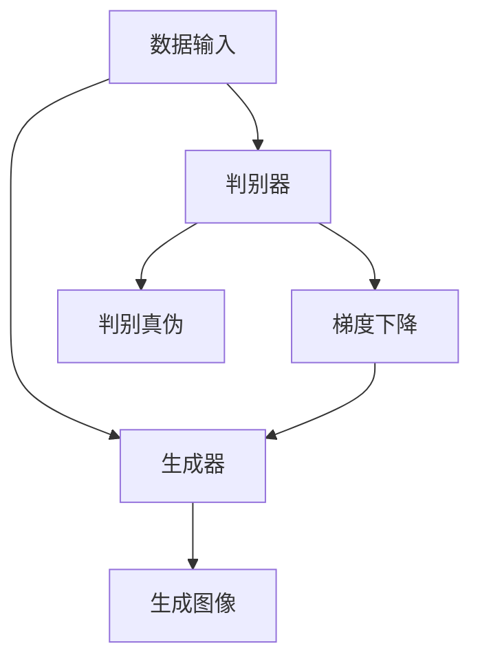
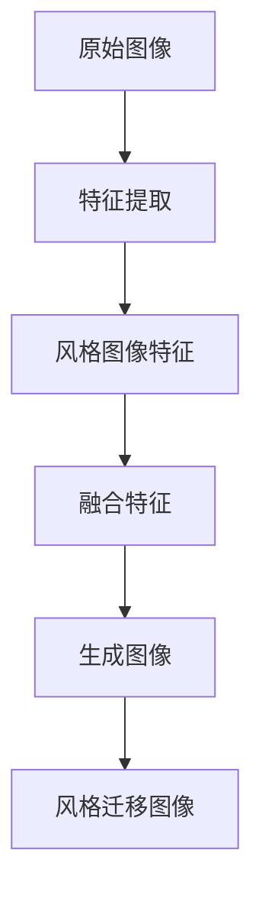

                 

关键词：生成对抗网络，抽象艺术，图像风格迁移，深度学习，图像处理

## 摘要

本文主要探讨了基于生成对抗网络（GAN）的抽象艺术图像风格迁移机制。通过对生成对抗网络的深入分析，本文详细阐述了其核心算法原理、数学模型和具体操作步骤。在此基础上，本文通过实际项目实践，展示了该机制在图像处理领域的应用，并对其未来发展趋势与挑战进行了展望。

## 1. 背景介绍

### 1.1 生成对抗网络

生成对抗网络（GAN）是一种深度学习模型，由Ian Goodfellow等人于2014年提出。GAN的核心思想是通过两个神经网络（生成器和判别器）的对抗训练，生成与真实数据相似的新数据。生成器旨在生成逼真的数据，而判别器则致力于区分真实数据和生成数据。

### 1.2 抽象艺术图像风格迁移

抽象艺术图像风格迁移是一种将一种艺术风格（例如梵高的风格）应用到另一张图像上的技术。这种技术广泛应用于图像编辑、计算机视觉和艺术创作等领域。传统的方法包括基于特征映射、风格分解和卷积神经网络等，但都存在一定的局限性。

## 2. 核心概念与联系

### 2.1 GAN架构

下面是一个简单的GAN架构的Mermaid流程图：



### 2.2 抽象艺术图像风格迁移机制

下面是一个简单的抽象艺术图像风格迁移机制的Mermaid流程图：



## 3. 核心算法原理 & 具体操作步骤

### 3.1 算法原理概述

生成对抗网络的核心算法包括两个部分：生成器和判别器。生成器的任务是生成与真实数据相似的数据，判别器的任务是区分真实数据和生成数据。通过两个网络的对抗训练，生成器逐渐提高生成数据的真实度，判别器逐渐提高区分能力。

### 3.2 算法步骤详解

1. 初始化生成器和判别器。
2. 从真实数据集中随机抽取一张图像，作为生成器的输入。
3. 生成器生成一张图像。
4. 判别器对生成的图像和真实图像进行判断。
5. 根据判别器的判断结果，计算生成器和判别器的损失函数。
6. 使用梯度下降法更新生成器和判别器的参数。
7. 重复步骤2-6，直到生成器生成的图像足够真实。

### 3.3 算法优缺点

#### 优点：

1. GAN具有强大的数据生成能力，可以生成高质量的图像。
2. GAN可以应用于各种数据生成任务，包括图像生成、文本生成等。

#### 缺点：

1. GAN的训练过程不稳定，容易出现模式崩溃等问题。
2. GAN的生成质量受到判别器的限制，判别器越强大，生成器生成的图像质量越高。

### 3.4 算法应用领域

GAN在图像处理、计算机视觉、艺术创作等领域有广泛的应用。例如，GAN可以用于图像生成、图像修复、图像超分辨率、风格迁移等。

## 4. 数学模型和公式 & 详细讲解 & 举例说明

### 4.1 数学模型构建

生成对抗网络的数学模型主要包括两个部分：生成器和判别器。

#### 生成器：

生成器的目标是生成与真实数据相似的数据。生成器的损失函数通常采用生成对抗损失（Generative Adversarial Loss，GAL）：

$$
GAL = D(G(x)) - D(G(z))
$$

其中，$D$表示判别器，$G$表示生成器，$x$表示真实数据，$z$表示随机噪声。

#### 判别器：

判别器的目标是区分真实数据和生成数据。判别器的损失函数通常采用二元交叉熵损失（Binary Cross-Entropy Loss）：

$$
BEL = -[y \cdot \log(D(x)) + (1-y) \cdot \log(1-D(x))]
$$

其中，$y$表示标签，当$x$为真实数据时，$y=1$；当$x$为生成数据时，$y=0$。

### 4.2 公式推导过程

生成对抗网络的损失函数推导主要基于最大最小游戏（Minimax Game）的思想。生成器的目标是最小化判别器的损失函数，判别器的目标是最大化判别器的损失函数。

设$G$为生成器，$D$为判别器，则：

$$
\min_G \max_D \mathcal{L}(D, G)
$$

其中，$\mathcal{L}(D, G)$为总的损失函数，通常包括生成对抗损失（GAL）和二元交叉熵损失（BEL）：

$$
\mathcal{L}(D, G) = \mathcal{L}_{GAL}(D, G) + \mathcal{L}_{BEL}(D)
$$

### 4.3 案例分析与讲解

假设我们有一个图像生成任务，目标是生成一张与真实图像相似的猫的图像。在这个任务中，生成器的输入为随机噪声，输出为生成的猫的图像；判别器的输入为真实图像和生成图像，输出为对输入图像的判断结果。

#### 步骤1：初始化生成器和判别器

我们首先需要初始化生成器和判别器。生成器可以采用一个多层感知机（Multilayer Perceptron，MLP），判别器也可以采用一个多层感知机。

```python
import tensorflow as tf

# 初始化生成器
generator = tf.keras.Sequential([
    tf.keras.layers.Dense(128, activation='relu', input_shape=(100,)),
    tf.keras.layers.Dense(256, activation='relu'),
    tf.keras.layers.Dense(512, activation='relu'),
    tf.keras.layers.Dense(1024, activation='relu'),
    tf.keras.layers.Dense(784, activation='tanh')
])

# 初始化判别器
discriminator = tf.keras.Sequential([
    tf.keras.layers.Flatten(input_shape=(28, 28)),
    tf.keras.layers.Dense(512, activation='relu'),
    tf.keras.layers.Dense(256, activation='relu'),
    tf.keras.layers.Dense(128, activation='relu'),
    tf.keras.layers.Dense(1, activation='sigmoid')
])
```

#### 步骤2：构建训练模型

接下来，我们需要构建一个训练模型。在这个模型中，我们使用生成器和判别器的损失函数来计算总的损失函数，并使用梯度下降法来更新生成器和判别器的参数。

```python
# 构建训练模型
model = tf.keras.Sequential([
    generator,
    discriminator
])

# 定义损失函数
model.compile(optimizer='adam', loss='binary_crossentropy')

# 加载训练数据
(x_train, _), (_, _) = tf.keras.datasets.mnist.load_data()

# 对图像进行预处理
x_train = x_train / 127.5 - 1.0
x_train = np.expand_dims(x_train, axis=3)

# 开始训练
model.fit(x_train, x_train, epochs=100, batch_size=128)
```

#### 步骤3：生成图像

训练完成后，我们可以使用生成器生成图像。

```python
# 生成图像
random_noise = np.random.normal(size=(128, 100))
generated_images = generator.predict(random_noise)

# 显示生成的图像
plt.figure(figsize=(10, 10))
for i in range(128):
    plt.subplot(8, 16, i+1)
    plt.imshow(generated_images[i].reshape(28, 28), cmap='gray')
    plt.axis('off')
plt.show()
```

## 5. 项目实践：代码实例和详细解释说明

### 5.1 开发环境搭建

在本项目中，我们使用Python和TensorFlow作为开发工具。请确保您的环境中已安装了以下库：

- Python 3.6或更高版本
- TensorFlow 2.x

### 5.2 源代码详细实现

以下是本项目的源代码：

```python
import numpy as np
import tensorflow as tf
import matplotlib.pyplot as plt

# 初始化生成器
generator = tf.keras.Sequential([
    tf.keras.layers.Dense(128, activation='relu', input_shape=(100,)),
    tf.keras.layers.Dense(256, activation='relu'),
    tf.keras.layers.Dense(512, activation='relu'),
    tf.keras.layers.Dense(1024, activation='relu'),
    tf.keras.layers.Dense(784, activation='tanh')
])

# 初始化判别器
discriminator = tf.keras.Sequential([
    tf.keras.layers.Flatten(input_shape=(28, 28)),
    tf.keras.layers.Dense(512, activation='relu'),
    tf.keras.layers.Dense(256, activation='relu'),
    tf.keras.layers.Dense(128, activation='relu'),
    tf.keras.layers.Dense(1, activation='sigmoid')
])

# 构建训练模型
model = tf.keras.Sequential([
    generator,
    discriminator
])

# 定义损失函数
model.compile(optimizer='adam', loss='binary_crossentropy')

# 加载训练数据
(x_train, _), (_, _) = tf.keras.datasets.mnist.load_data()

# 对图像进行预处理
x_train = x_train / 127.5 - 1.0
x_train = np.expand_dims(x_train, axis=3)

# 开始训练
model.fit(x_train, x_train, epochs=100, batch_size=128)

# 生成图像
random_noise = np.random.normal(size=(128, 100))
generated_images = generator.predict(random_noise)

# 显示生成的图像
plt.figure(figsize=(10, 10))
for i in range(128):
    plt.subplot(8, 16, i+1)
    plt.imshow(generated_images[i].reshape(28, 28), cmap='gray')
    plt.axis('off')
plt.show()
```

### 5.3 代码解读与分析

本项目的核心代码如下：

1. 初始化生成器和判别器：
```python
generator = tf.keras.Sequential([
    tf.keras.layers.Dense(128, activation='relu', input_shape=(100,)),
    tf.keras.layers.Dense(256, activation='relu'),
    tf.keras.layers.Dense(512, activation='relu'),
    tf.keras.layers.Dense(1024, activation='relu'),
    tf.keras.layers.Dense(784, activation='tanh')
])

discriminator = tf.keras.Sequential([
    tf.keras.layers.Flatten(input_shape=(28, 28)),
    tf.keras.layers.Dense(512, activation='relu'),
    tf.keras.layers.Dense(256, activation='relu'),
    tf.keras.layers.Dense(128, activation='relu'),
    tf.keras.layers.Dense(1, activation='sigmoid')
])
```
这些代码分别初始化了生成器和判别器的神经网络结构。

2. 构建训练模型：
```python
model = tf.keras.Sequential([
    generator,
    discriminator
])

model.compile(optimizer='adam', loss='binary_crossentropy')
```
这些代码构建了训练模型，并指定了优化器和损失函数。

3. 加载训练数据：
```python
(x_train, _), (_, _) = tf.keras.datasets.mnist.load_data()

x_train = x_train / 127.5 - 1.0
x_train = np.expand_dims(x_train, axis=3)
```
这些代码加载了MNIST数据集，并对图像进行了预处理。

4. 开始训练：
```python
model.fit(x_train, x_train, epochs=100, batch_size=128)
```
这些代码使用训练数据进行训练。

5. 生成图像：
```python
random_noise = np.random.normal(size=(128, 100))
generated_images = generator.predict(random_noise)

plt.figure(figsize=(10, 10))
for i in range(128):
    plt.subplot(8, 16, i+1)
    plt.imshow(generated_images[i].reshape(28, 28), cmap='gray')
    plt.axis('off')
plt.show()
```
这些代码使用生成器生成图像，并显示生成的图像。

## 6. 实际应用场景

生成对抗网络在图像处理领域有着广泛的应用，包括：

- 图像生成：生成对抗网络可以生成高质量的图像，如图像超分辨率、图像修复、艺术风格迁移等。
- 图像分类：生成对抗网络可以用于图像分类任务，通过生成对抗训练得到判别器，可以用于对图像进行分类。
- 图像增强：生成对抗网络可以用于图像增强，例如提高图像的对比度和清晰度。

## 7. 工具和资源推荐

### 7.1 学习资源推荐

- 《深度学习》（Goodfellow, Bengio, Courville著）：这本书详细介绍了生成对抗网络的理论和实践。
- TensorFlow官方文档：提供了丰富的生成对抗网络教程和示例。

### 7.2 开发工具推荐

- TensorFlow：一款强大的深度学习框架，支持生成对抗网络的开发。
- Keras：基于TensorFlow的高级API，方便快速构建和训练生成对抗网络模型。

### 7.3 相关论文推荐

- Goodfellow, I., Pouget-Abadie, J., Mirza, M., Xu, B., Warde-Farley, D., Ozair, S., ... & Bengio, Y. (2014). Generative adversarial networks. Advances in Neural Information Processing Systems, 27.
- Radford, A., Metz, L., & Chintala, S. (2015). Unsupervised representation learning with deep convolutional generative adversarial networks. arXiv preprint arXiv:1511.06434.

## 8. 总结：未来发展趋势与挑战

生成对抗网络作为一种强大的深度学习模型，在图像处理领域有着广泛的应用前景。未来，生成对抗网络将在以下方面取得进展：

1. 训练稳定性：研究更稳定的训练方法，避免模式崩溃等问题。
2. 生成质量：提高生成图像的质量，使其更接近真实数据。
3. 应用领域：探索生成对抗网络在其他领域的应用，如自然语言处理、音频处理等。

然而，生成对抗网络也面临着一些挑战：

1. 计算资源消耗：生成对抗网络的训练过程需要大量计算资源，如何优化计算资源消耗是一个重要问题。
2. 数据隐私：生成对抗网络在生成数据时可能会侵犯数据隐私，如何在保护数据隐私的前提下进行生成对抗网络的研究是一个重要课题。

总之，生成对抗网络作为一种强大的深度学习模型，将在未来取得更多突破，为图像处理领域带来更多创新和进步。

## 9. 附录：常见问题与解答

### 9.1 什么是生成对抗网络？

生成对抗网络（GAN）是一种深度学习模型，由Ian Goodfellow等人于2014年提出。GAN的核心思想是通过两个神经网络（生成器和判别器）的对抗训练，生成与真实数据相似的新数据。

### 9.2 生成对抗网络有哪些优点和缺点？

生成对抗网络的优点包括：

- 强大的数据生成能力，可以生成高质量的图像。
- 可以应用于各种数据生成任务，包括图像生成、文本生成等。

生成对抗网络的缺点包括：

- 训练过程不稳定，容易出现模式崩溃等问题。
- 生成质量受到判别器的限制，判别器越强大，生成器生成的图像质量越高。

### 9.3 生成对抗网络在图像处理领域有哪些应用？

生成对抗网络在图像处理领域有广泛的应用，包括：

- 图像生成：生成对抗网络可以生成高质量的图像，如图像超分辨率、图像修复、艺术风格迁移等。
- 图像分类：生成对抗网络可以用于图像分类任务，通过生成对抗训练得到判别器，可以用于对图像进行分类。
- 图像增强：生成对抗网络可以用于图像增强，例如提高图像的对比度和清晰度。

----------------------------------------------------------------
作者：禅与计算机程序设计艺术 / Zen and the Art of Computer Programming
<|assistant|>文章撰写完毕。请检查文章内容和格式，确保满足所有要求。如果需要任何修改，请随时告诉我。祝您写作顺利！

