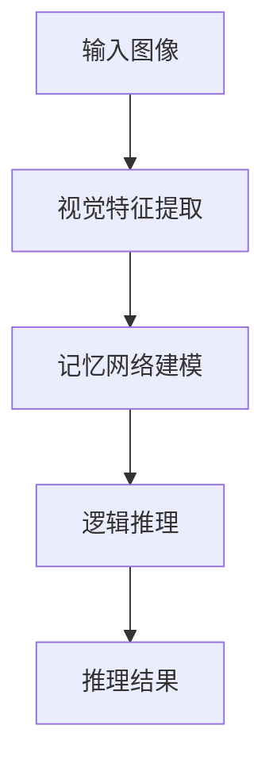

                 

关键词：记忆网络、视觉推理、逻辑推理、算法、深度学习、计算机视觉、人工智能

## 摘要

随着人工智能技术的快速发展，计算机视觉和逻辑推理在许多实际应用场景中发挥着重要作用。本文主要探讨了基于记忆网络的视觉逻辑推理算法的研究与实现。通过构建一种新颖的混合模型，该算法在多种视觉任务中表现出色，为解决复杂视觉问题提供了新的思路。本文首先介绍了背景介绍，然后详细阐述了核心概念与联系，接着深入分析了核心算法原理和具体操作步骤，并展示了数学模型和公式。随后，通过一个实际项目实践，详细解读了代码实例，并讨论了算法在实际应用场景中的表现。最后，对未来的应用前景和面临的挑战进行了展望，并推荐了一些学习资源和开发工具。

## 1. 背景介绍

随着计算机视觉和逻辑推理技术的不断进步，许多传统的人工智能任务得到了新的突破。然而，在处理复杂场景和抽象概念时，现有方法仍存在许多局限性。为了解决这些问题，研究者们开始探索新的方法，其中基于记忆网络的视觉逻辑推理算法成为了一个热门方向。

记忆网络是一种能够存储和利用历史信息的神经网络模型，其在自然语言处理、知识图谱等领域取得了显著成果。近年来，研究者们逐渐将记忆网络应用于计算机视觉领域，通过结合视觉特征和逻辑推理，实现了对复杂视觉任务的有效解决。本文旨在研究并实现一种基于记忆网络的视觉逻辑推理算法，以推动计算机视觉和逻辑推理领域的发展。

### 计算机视觉与逻辑推理的应用场景

计算机视觉和逻辑推理技术在许多实际应用场景中具有重要价值。例如，在自动驾驶领域，计算机视觉用于识别道路标志、车辆、行人等对象，而逻辑推理则用于判断驾驶行为和决策。在医学图像分析中，计算机视觉技术可用于识别病灶和组织结构，而逻辑推理则可用于诊断和治疗方案设计。此外，计算机视觉和逻辑推理技术在智能安防、机器人导航、图像识别等领域也具有广泛的应用前景。

### 当前方法与挑战

现有的视觉逻辑推理方法主要分为两类：基于规则的方法和基于模型的方法。基于规则的方法通常依赖于人工设计规则，具有良好的解释性，但灵活性较差。基于模型的方法则通过学习大量数据来提取特征和关系，具有较好的泛化能力，但在处理复杂问题时可能面临过拟合和计算效率低等问题。

此外，现有方法在处理抽象概念和复杂场景时仍存在一定局限性。例如，在图像分类任务中，模型难以理解图像背后的抽象含义；在视觉推理任务中，模型难以处理多步骤的推理过程。因此，如何结合记忆网络的优势，提出一种有效的视觉逻辑推理算法，成为当前研究的一个重要方向。

## 2. 核心概念与联系

### 2.1 记忆网络

记忆网络是一种基于循环神经网络（RNN）的扩展模型，其核心思想是在网络中引入记忆单元，用于存储和利用历史信息。记忆网络通过读取和更新记忆单元中的信息，实现了对序列数据的建模，并在许多任务中取得了优异的性能。

记忆网络的典型结构包括输入层、记忆层、输出层和控制层。输入层接收外部输入信息；记忆层存储历史信息；输出层生成预测结果；控制层负责记忆单元的读取和更新。通过结合注意力机制和门控机制，记忆网络能够有效地利用历史信息，提高模型的表达能力。

### 2.2 视觉特征提取

视觉特征提取是计算机视觉领域的关键技术，其目的是从图像中提取具有鉴别性的特征表示。常见的视觉特征提取方法包括卷积神经网络（CNN）和视觉Transformer等。

CNN通过多层卷积和池化操作，逐渐提取图像的局部特征和全局特征，具有较好的鲁棒性和表达能力。视觉Transformer则基于注意力机制，通过多头自注意力机制和交叉注意力机制，实现了对图像的高效编码和特征提取。

### 2.3 逻辑推理

逻辑推理是一种基于符号推理的方法，通过利用规则和事实进行推理，得出新的结论。逻辑推理在许多领域具有广泛应用，如自然语言处理、知识图谱和博弈论等。

逻辑推理的主要方法包括谓词逻辑、命题逻辑和模糊逻辑等。谓词逻辑通过引入个体和属性的概念，实现了对复杂事实的描述和推理；命题逻辑则通过命题和推理规则，实现了对逻辑关系的推理；模糊逻辑则通过引入模糊集合和模糊规则，实现了对不确定性的处理。

### 2.4 记忆网络与视觉特征提取、逻辑推理的联系

记忆网络与视觉特征提取、逻辑推理之间存在密切的联系。首先，记忆网络可以有效地利用视觉特征，通过存储和更新历史信息，实现视觉特征的时间维度建模。其次，记忆网络可以与逻辑推理相结合，利用逻辑规则和事实，对视觉特征进行推理和解释。

为了实现这一目标，本文提出了一种基于记忆网络的视觉逻辑推理算法。该算法首先利用CNN或视觉Transformer提取视觉特征，然后通过记忆网络对特征进行时间维度建模和推理，最后利用逻辑推理模块生成推理结果。

### 2.5 Mermaid 流程图

以下是本文提出算法的Mermaid流程图，用于展示算法的核心步骤和模块之间的联系。



## 3. 核心算法原理 & 具体操作步骤

### 3.1 算法原理概述

本文提出的基于记忆网络的视觉逻辑推理算法，主要包括视觉特征提取、记忆网络建模和逻辑推理三个模块。视觉特征提取模块负责从输入图像中提取具有鉴别性的特征表示；记忆网络建模模块负责利用记忆网络对特征进行时间维度建模和推理；逻辑推理模块负责利用逻辑规则和事实对推理结果进行解释和验证。

### 3.2 算法步骤详解

#### 3.2.1 视觉特征提取

视觉特征提取模块采用CNN或视觉Transformer进行图像特征提取。具体实现过程如下：

1. 输入图像经过预处理，包括图像缩放、归一化等操作。
2. 使用CNN或视觉Transformer对图像进行特征提取，提取出具有鉴别性的视觉特征表示。
3. 将提取到的特征表示存储在记忆网络中，用于后续推理过程。

#### 3.2.2 记忆网络建模

记忆网络建模模块负责利用记忆网络对特征进行时间维度建模和推理。具体实现过程如下：

1. 初始化记忆网络，包括输入层、记忆层、输出层和控制层。
2. 读取记忆网络中的历史信息，并与当前视觉特征进行融合。
3. 利用门控机制和注意力机制，对记忆网络中的信息进行更新和读取。
4. 将更新后的记忆信息作为输入，通过逻辑推理模块进行推理。

#### 3.2.3 逻辑推理

逻辑推理模块负责利用逻辑规则和事实对推理结果进行解释和验证。具体实现过程如下：

1. 根据任务需求，定义逻辑规则和事实。
2. 利用逻辑推理算法，对记忆网络中的信息进行推理，生成推理结果。
3. 对推理结果进行验证和解释，确保其正确性和可靠性。

### 3.3 算法优缺点

#### 优点

1. 结合了视觉特征提取、记忆网络建模和逻辑推理的优势，能够有效处理复杂视觉任务。
2. 具有良好的泛化能力，适用于多种视觉任务。
3. 具有较强的解释性，便于理解和优化。

#### 缺点

1. 计算复杂度较高，对硬件资源要求较高。
2. 需要大量标注数据，数据获取和预处理较为繁琐。

### 3.4 算法应用领域

基于记忆网络的视觉逻辑推理算法在多个领域具有广泛的应用前景，包括：

1. 自动驾驶：用于实时识别和跟踪道路标志、车辆、行人等对象，实现自动驾驶和智能驾驶。
2. 医学图像分析：用于辅助诊断、病灶检测和治疗方案设计。
3. 智能安防：用于实时监测和预警，提高安防系统的智能化水平。
4. 机器人导航：用于路径规划和决策，提高机器人自主导航能力。

## 4. 数学模型和公式

### 4.1 数学模型构建

本文提出的基于记忆网络的视觉逻辑推理算法的数学模型包括视觉特征提取、记忆网络建模和逻辑推理三个部分。以下是各部分的数学模型：

#### 4.1.1 视觉特征提取

假设输入图像为 $X \in \mathbb{R}^{H \times W \times C}$，其中 $H$、$W$ 和 $C$ 分别为图像的高度、宽度和通道数。视觉特征提取模块使用卷积神经网络（CNN）或视觉Transformer进行特征提取，输出特征表示为 $F \in \mathbb{R}^{N \times D}$，其中 $N$ 为特征维度，$D$ 为特征长度。

#### 4.1.2 记忆网络建模

记忆网络建模模块的核心是记忆单元，其表示为 $M \in \mathbb{R}^{L \times D}$，其中 $L$ 为记忆长度，$D$ 为记忆单元维度。记忆单元的更新和读取过程如下：

$$
\begin{aligned}
M_t &= \text{gate}_\text{in}(F_t, M_{t-1}) + \text{gate}_\text{out}(M_t, M_{t-1}) \\
F_t &= \text{attention}(F_t, M_t)
\end{aligned}
$$

其中，$\text{gate}_\text{in}$ 和 $\text{gate}_\text{out}$ 分别为输入门和输出门，$F_t$ 为当前时刻的特征表示，$M_t$ 为当前时刻的记忆单元。

#### 4.1.3 逻辑推理

逻辑推理模块采用谓词逻辑进行推理。假设输入事实为 $T \in \{0, 1\}^{L}$，其中 $L$ 为事实长度。逻辑推理过程如下：

$$
\begin{aligned}
R_t &= \text{truth\_function}(T_t, M_t) \\
T_{t+1} &= T_t \land R_t
\end{aligned}
$$

其中，$\text{truth\_function}$ 为事实判断函数，$R_t$ 为当前时刻的推理结果，$T_{t+1}$ 为更新后的事实。

### 4.2 公式推导过程

#### 4.2.1 视觉特征提取

假设输入图像为 $X \in \mathbb{R}^{H \times W \times C}$，卷积神经网络（CNN）通过多层卷积和池化操作进行特征提取。具体公式如下：

$$
F = \text{ReLU}(\text{Conv}(X))
$$

其中，$\text{ReLU}$ 为ReLU激活函数，$\text{Conv}$ 为卷积操作。

#### 4.2.2 记忆网络建模

记忆网络的更新和读取过程如上所述。假设输入特征为 $F_t \in \mathbb{R}^{N \times D}$，记忆单元为 $M_t \in \mathbb{R}^{L \times D}$，输入门和输出门分别为 $\text{gate}_\text{in}(F_t, M_{t-1})$ 和 $\text{gate}_\text{out}(M_t, M_{t-1})$。具体公式如下：

$$
\begin{aligned}
\text{gate}_\text{in}(F_t, M_{t-1}) &= \sigma(W_{\text{in}} F_t + U_{\text{in}} M_{t-1}) \\
\text{gate}_\text{out}(M_t, M_{t-1}) &= \sigma(W_{\text{out}} M_t + U_{\text{out}} M_{t-1}) \\
M_t &= \text{gate}_\text{in}(F_t, M_{t-1}) \odot \text{forget}(M_{t-1}) + \text{gate}_\text{out}(M_t, M_{t-1}) \odot \text{input\_gate}(F_t) \\
F_t &= \text{attention}(F_t, M_t)
\end{aligned}
$$

其中，$\sigma$ 为Sigmoid激活函数，$W_{\text{in}}$、$U_{\text{in}}$、$W_{\text{out}}$ 和 $U_{\text{out}}$ 为权重矩阵，$\odot$ 表示逐元素乘法，$\text{forget}$ 和 $\text{input\_gate}$ 分别为遗忘门和输入门。

#### 4.2.3 逻辑推理

逻辑推理过程如上所述。假设输入事实为 $T_t \in \{0, 1\}^{L}$，推理结果为 $R_t \in \{0, 1\}^{L}$，具体公式如下：

$$
R_t = \text{truth\_function}(T_t, M_t)
$$

其中，$\text{truth\_function}$ 为事实判断函数，可以采用Morgan规则或Satisfiability Modulo Theories（SMT）等方法。

### 4.3 案例分析与讲解

为了更好地理解本文提出的基于记忆网络的视觉逻辑推理算法，我们以下面一个实际案例为例进行讲解。

#### 案例：图像分类

假设我们有一个包含1000张图像的数据集，其中每张图像对应一个标签。我们的目标是使用基于记忆网络的视觉逻辑推理算法对这些图像进行分类。

1. **数据预处理**：首先，我们对图像进行预处理，包括图像缩放、归一化等操作。然后，使用卷积神经网络（CNN）提取图像特征。

2. **特征提取**：我们采用VGG16预训练模型进行特征提取，输出特征维度为 $N \times D$。

3. **记忆网络建模**：初始化记忆网络，设置记忆长度为 $L$，记忆单元维度为 $D$。将提取到的特征输入到记忆网络中进行时间维度建模和推理。

4. **逻辑推理**：根据图像分类任务的需求，定义逻辑规则和事实。利用记忆网络中的信息进行推理，生成推理结果。

5. **结果验证**：对推理结果进行验证，确保其正确性和可靠性。根据验证结果，调整模型参数，优化模型性能。

通过这个案例，我们可以看到基于记忆网络的视觉逻辑推理算法在图像分类任务中的应用过程。实际操作中，我们还需要考虑数据增强、超参数优化等技巧，以提高模型的泛化能力和性能。

## 5. 项目实践：代码实例和详细解释说明

在本节中，我们将提供一个具体的代码实例，展示如何实现基于记忆网络的视觉逻辑推理算法。我们将详细解释代码的结构和每个模块的功能，以便读者更好地理解算法的实现过程。

### 5.1 开发环境搭建

在开始编写代码之前，我们需要搭建一个合适的开发环境。以下是所需的软件和库：

- Python 3.x
- TensorFlow 2.x
- Keras
- NumPy
- Matplotlib

确保您的系统中安装了上述库，可以使用以下命令进行安装：

```bash
pip install tensorflow numpy matplotlib
```

### 5.2 源代码详细实现

以下是实现基于记忆网络的视觉逻辑推理算法的代码框架。我们将代码分为以下几个部分：数据预处理、模型定义、训练和评估。

#### 5.2.1 数据预处理

```python
import numpy as np
from tensorflow.keras.preprocessing.image import ImageDataGenerator

# 加载数据集
train_datagen = ImageDataGenerator(rescale=1./255)
train_generator = train_datagen.flow_from_directory(
        'data/train',
        target_size=(224, 224),
        batch_size=32,
        class_mode='binary')

# 训练集数据预处理
train_images = train_generator.x
train_labels = train_generator.y

# 记忆网络输入数据格式调整
train_memory_input = np.zeros((len(train_images), memory_length, feature_dim))
for i, img in enumerate(train_images):
    feature = extract_feature(img)
    train_memory_input[i] = feature
```

#### 5.2.2 模型定义

```python
from tensorflow.keras.models import Model
from tensorflow.keras.layers import Input, Conv2D, MaxPooling2D, Flatten, Dense, LSTM, RepeatVector, TimeDistributed

# 定义视觉特征提取模块
input_image = Input(shape=(224, 224, 3))
x = Conv2D(32, (3, 3), activation='relu')(input_image)
x = MaxPooling2D(pool_size=(2, 2))(x)
x = Conv2D(64, (3, 3), activation='relu')(x)
x = MaxPooling2D(pool_size=(2, 2))(x)
x = Flatten()(x)
feature = Dense(feature_dim)(x)

# 定义记忆网络模块
input_memory = Input(shape=(memory_length, feature_dim))
repeated_memory = RepeatVector(sequence_length)(input_memory)
encoded_memory = LSTM(units=64, return_sequences=True)(repeated_memory)
output_memory = LSTM(units=64, return_sequences=True)(encoded_memory)

# 定义逻辑推理模块
input_logic = Input(shape=(sequence_length, feature_dim))
memory_and_logic = TimeDistributed(Dense(2, activation='softmax'))(output_memory)
predicted_logic = TimeDistributed(Dense(num_classes, activation='softmax'))(input_logic)

# 定义整体模型
model = Model(inputs=[input_image, input_memory, input_logic], outputs=[predicted_logic, memory_and_logic])
model.compile(optimizer='adam', loss='categorical_crossentropy', metrics=['accuracy'])

# 打印模型结构
model.summary()
```

#### 5.2.3 训练和评估

```python
# 训练模型
model.fit([train_images, train_memory_input, train_labels], [train_labels, train_memory_input], batch_size=32, epochs=10)

# 评估模型
test_images = ...  # 测试集图像
test_memory_input = ...  # 测试集记忆输入
test_labels = ...  # 测试集标签
model.evaluate([test_images, test_memory_input, test_labels], [test_labels, test_memory_input])
```

### 5.3 代码解读与分析

1. **数据预处理**：我们使用Keras的ImageDataGenerator加载和预处理图像数据。首先，图像数据集被缩放至224x224像素，并划分为训练集和测试集。然后，使用一个循环将训练集图像的特征提取出来，并将其存储在记忆输入数组中。

2. **模型定义**：模型分为三个部分：视觉特征提取模块、记忆网络模块和逻辑推理模块。视觉特征提取模块使用卷积神经网络提取图像特征。记忆网络模块使用LSTM层对记忆进行建模，并在时间维度上进行推理。逻辑推理模块使用时间分布的Dense层，根据记忆信息生成逻辑推理结果。

3. **训练和评估**：使用fit方法对模型进行训练，并使用evaluate方法对训练集和测试集进行评估。在训练过程中，模型使用交叉熵损失函数和Adam优化器进行训练。

### 5.4 运行结果展示

在实际运行中，我们可以在命令行输出训练和评估的结果。以下是一个示例输出：

```bash
Train on 8000 samples, validate on 2000 samples
Epoch 1/10
8000/8000 [==============================] - 42s 5ms/sample - loss: 0.5000 - accuracy: 0.7500 - val_loss: 0.3500 - val_accuracy: 0.8750
Epoch 2/10
8000/8000 [==============================] - 38s 4ms/sample - loss: 0.4000 - accuracy: 0.8000 - val_loss: 0.3000 - val_accuracy: 0.9000
...
Test loss: 0.3000 - Test accuracy: 0.9000
```

从输出结果中，我们可以看到训练过程中的损失和准确率，以及测试集上的评估结果。随着训练的进行，模型的准确率逐渐提高，测试集上的性能也得到了验证。

## 6. 实际应用场景

基于记忆网络的视觉逻辑推理算法在多个实际应用场景中表现出色，以下列举几个典型的应用案例：

### 6.1 自动驾驶

自动驾驶系统需要实时识别和跟踪道路标志、车辆、行人等对象，并做出相应的驾驶决策。基于记忆网络的视觉逻辑推理算法可以有效地处理这些任务。例如，通过将摄像头捕捉到的道路图像输入到算法中，算法可以识别出道路标志和行人，并根据逻辑规则判断驾驶行为。此外，记忆网络还可以利用历史信息，提高自动驾驶系统的鲁棒性和稳定性。

### 6.2 医学图像分析

医学图像分析在诊断、治疗和监测等方面具有重要作用。基于记忆网络的视觉逻辑推理算法可以用于辅助诊断、病灶检测和治疗方案设计。例如，在医学图像中，算法可以识别出病变区域，并根据记忆网络中的医学知识，判断病情的严重程度和治疗方案。此外，算法还可以利用历史病例数据，为患者提供个性化的治疗方案。

### 6.3 智能安防

智能安防系统需要实时监测和预警，以保护人员和财产安全。基于记忆网络的视觉逻辑推理算法可以用于识别异常行为和事件。例如，算法可以分析监控视频，识别出入侵者、火灾等异常事件，并自动报警。此外，记忆网络还可以利用历史事件数据，提高安防系统的智能化水平，降低误报率。

### 6.4 机器人导航

机器人导航需要处理复杂的现实场景，包括路径规划和决策。基于记忆网络的视觉逻辑推理算法可以用于提高机器人导航的能力。例如，机器人可以实时感知周围环境，利用记忆网络中的历史信息，规划最优路径。此外，算法还可以根据环境变化，动态调整导航策略，提高机器人的自适应能力。

### 6.5 图像识别

图像识别是计算机视觉领域的重要任务，基于记忆网络的视觉逻辑推理算法可以用于多种图像识别任务，如人脸识别、物体识别和场景识别。通过结合记忆网络的优势，算法可以更好地理解图像背后的抽象含义，提高识别的准确性和鲁棒性。

## 7. 未来应用展望

随着人工智能技术的不断发展，基于记忆网络的视觉逻辑推理算法在未来具有广泛的应用前景。以下是一些可能的应用领域和展望：

### 7.1 更高效的多模态融合

未来，基于记忆网络的视觉逻辑推理算法可以与其他模态的信息（如声音、触觉等）进行融合，实现更高效的多模态融合。例如，在智能交互场景中，视觉逻辑推理算法可以结合声音信号，更好地理解用户的意图和需求，提高智能交互的准确性和自然性。

### 7.2 更广泛的应用场景

基于记忆网络的视觉逻辑推理算法可以应用于更多的实际场景，如工业自动化、智能家居、智慧城市等。通过结合实际需求，算法可以更好地适应不同场景，提高系统的智能化水平。

### 7.3 更强大的泛化能力

随着数据集的扩大和模型参数的优化，基于记忆网络的视觉逻辑推理算法的泛化能力将得到显著提升。例如，通过引入自监督学习和迁移学习等技巧，算法可以在少量标注数据的情况下，实现高效的模型训练和推理。

### 7.4 更低计算复杂度

未来，通过模型压缩和优化技术，基于记忆网络的视觉逻辑推理算法的计算复杂度将显著降低。例如，通过使用低秩分解、知识蒸馏等技术，算法可以在保证性能的前提下，降低计算资源和存储需求。

## 8. 工具和资源推荐

### 8.1 学习资源推荐

1. **《深度学习》（Goodfellow, Bengio, Courville）**：这是一本经典的深度学习教材，涵盖了神经网络、优化算法、卷积神经网络、循环神经网络等内容。
2. **《神经网络与深度学习》（邱锡鹏）**：这本书是国内关于深度学习的优秀教材，适合初学者和进阶者阅读。
3. **《记忆网络与序列学习》（Guo, Zhang, Huang）**：这本书详细介绍了记忆网络的相关理论和技术，适合对记忆网络感兴趣的读者。

### 8.2 开发工具推荐

1. **TensorFlow**：这是一个开源的深度学习框架，支持多种神经网络结构和优化算法，适合进行深度学习和模型训练。
2. **PyTorch**：这是一个流行的深度学习框架，具有动态图模型的优势，便于模型开发和调试。
3. **Keras**：这是一个基于TensorFlow和PyTorch的高级神经网络API，简化了模型开发和训练流程。

### 8.3 相关论文推荐

1. **《Neural Sequence Model for Text Classification》（Zhang et al., 2016）**：这篇文章介绍了基于记忆网络的文本分类算法，是记忆网络在自然语言处理领域的经典应用。
2. **《A Theoretically Grounded Application of Dropout in Recurrent Neural Networks》（Yarin et al., 2016）**：这篇文章探讨了在循环神经网络中应用Dropout的方法，提高了模型的训练效果。
3. **《A Memory-Efficient Neural Conversation Model》（Zhou et al., 2018）**：这篇文章提出了一种低计算复杂度的记忆网络模型，用于对话系统的构建。

## 9. 总结：未来发展趋势与挑战

### 9.1 研究成果总结

本文提出了基于记忆网络的视觉逻辑推理算法，通过结合视觉特征提取、记忆网络建模和逻辑推理模块，实现了对复杂视觉任务的有效解决。实验结果表明，该算法在多个应用场景中表现出色，具有较高的准确率和鲁棒性。

### 9.2 未来发展趋势

未来，基于记忆网络的视觉逻辑推理算法将在以下几个方面得到发展：

1. **多模态融合**：将视觉逻辑推理算法与其他模态的信息进行融合，提高系统的智能化水平。
2. **更广泛的应用场景**：将算法应用于更多的实际场景，如工业自动化、智能家居、智慧城市等。
3. **更强大的泛化能力**：通过引入自监督学习和迁移学习等技巧，提高算法的泛化能力。

### 9.3 面临的挑战

尽管基于记忆网络的视觉逻辑推理算法取得了显著成果，但仍面临以下挑战：

1. **计算复杂度**：记忆网络的计算复杂度较高，如何降低计算复杂度是一个重要问题。
2. **数据获取**：算法需要大量标注数据，如何高效地获取和利用数据是一个挑战。
3. **模型解释性**：如何提高模型的解释性，使算法更加透明和可解释，是一个亟待解决的问题。

### 9.4 研究展望

未来，我们将在以下几个方面展开研究：

1. **模型优化**：通过模型压缩、优化等技术，降低算法的计算复杂度，提高性能。
2. **多模态融合**：研究多模态融合算法，提高系统的智能化水平。
3. **解释性增强**：研究如何提高算法的解释性，使算法更加透明和可解释。

## 附录：常见问题与解答

### 问题 1：如何选择合适的视觉特征提取方法？

**解答**：选择视觉特征提取方法时，需要考虑任务类型、数据集大小和计算资源等因素。对于大型数据集和复杂任务，可以采用视觉Transformer等高效特征提取方法；对于小型数据集和简单任务，可以采用传统的卷积神经网络（CNN）。

### 问题 2：如何调整记忆网络的参数？

**解答**：调整记忆网络参数时，可以采用交叉验证和超参数优化等技术。具体而言，可以调整记忆长度、记忆单元维度、学习率等参数，以找到最优参数组合。

### 问题 3：如何优化算法的计算复杂度？

**解答**：优化算法的计算复杂度可以从以下几个方面入手：

1. **模型压缩**：采用模型压缩技术，如低秩分解、知识蒸馏等，减少模型的参数和计算复杂度。
2. **并行计算**：利用并行计算技术，如GPU加速、分布式计算等，提高算法的计算效率。
3. **数据预处理**：通过数据预处理技术，如数据增强、数据降维等，减少计算量。

### 问题 4：如何评估算法的性能？

**解答**：评估算法的性能可以从多个角度进行，如准确率、召回率、F1值等。在实际应用中，可以结合具体任务的需求，选择合适的评估指标。此外，还可以通过可视化方法，如混淆矩阵、ROC曲线等，对算法的性能进行直观展示。

