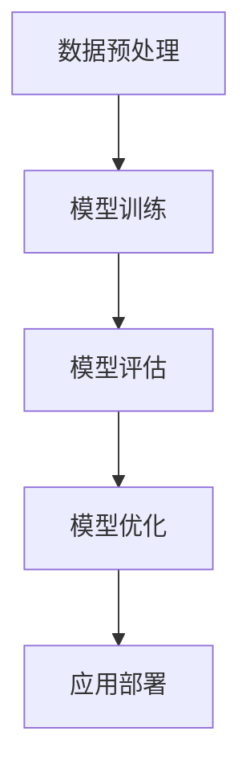

                 

关键词：基础模型、专业规范、科学精神、算法、数学模型、项目实践、应用场景、未来展望

> 摘要：本文将深入探讨基础模型在计算机科学领域中的重要性，以及如何通过专业规范和科学精神来提高基础模型的性能和稳定性。本文将涵盖核心概念与联系、核心算法原理与操作步骤、数学模型与公式推导、项目实践与代码实例、实际应用场景以及未来发展趋势与挑战。

## 1. 背景介绍

随着人工智能技术的迅速发展，基础模型（Baseliner Model）在各个领域中扮演着越来越重要的角色。从图像识别、自然语言处理到推荐系统，基础模型为这些应用提供了强大的计算能力。然而，随着模型复杂性的增加，如何确保模型的性能和稳定性成为一个亟待解决的问题。本文将探讨基础模型的专业规范与科学精神，以提高模型在实际应用中的可靠性和有效性。

## 2. 核心概念与联系

为了更好地理解基础模型，我们首先需要了解一些核心概念。这些概念包括数据预处理、模型训练、模型评估、模型优化等。以下是一个简单的 Mermaid 流程图，展示了这些概念之间的联系：



### 数据预处理

数据预处理是基础模型构建的第一步，它包括数据清洗、数据归一化、数据增强等操作。良好的数据预处理可以提高模型的学习效率和准确性。

### 模型训练

模型训练是通过大量的数据来调整模型参数，使其能够预测未知数据的过程。训练过程通常包括前向传播、反向传播和梯度下降等步骤。

### 模型评估

模型评估是评估模型性能的重要环节，常用的评估指标包括准确率、召回率、F1 值等。通过模型评估，我们可以了解模型的性能是否达到预期。

### 模型优化

模型优化是通过调整模型参数、结构或训练过程来提高模型性能的过程。常见的优化方法包括超参数调优、结构优化和正则化等。

### 应用部署

模型部署是将训练好的模型应用到实际场景中的过程。部署的目的是将模型转化为可运行的应用程序，以便在实际环境中提供预测服务。

## 3. 核心算法原理 & 具体操作步骤

### 3.1 算法原理概述

基础模型的算法原理主要涉及深度学习、机器学习和自然语言处理等领域。以下是三个常见算法原理的概述：

#### 深度学习

深度学习是一种基于多层神经网络的学习方法，通过多层非线性变换来提取特征。深度学习的核心是反向传播算法，它通过不断调整网络参数来优化模型性能。

#### 机器学习

机器学习是一种利用数据训练模型的方法，使模型能够从数据中自动学习特征和模式。常见的机器学习算法包括决策树、支持向量机、聚类等。

#### 自然语言处理

自然语言处理是一种利用计算机技术和算法对自然语言进行理解和处理的方法。常见的自然语言处理任务包括文本分类、情感分析、命名实体识别等。

### 3.2 算法步骤详解

以下是基础模型构建的常见步骤：

1. 数据收集：从各种数据源收集数据，包括文本、图像、音频等。
2. 数据预处理：对收集到的数据进行处理，包括数据清洗、数据归一化和数据增强等。
3. 模型设计：根据应用需求设计合适的模型结构，包括神经网络、决策树等。
4. 模型训练：使用训练数据训练模型，调整模型参数，使其能够准确预测未知数据。
5. 模型评估：使用验证数据评估模型性能，调整模型参数以优化性能。
6. 模型优化：通过超参数调优、结构优化和正则化等方法提高模型性能。
7. 模型部署：将训练好的模型部署到实际环境中，提供预测服务。

### 3.3 算法优缺点

每种算法都有其优缺点，以下是对几种常见算法优缺点的简要介绍：

#### 深度学习

优点：强大的特征提取能力，适用于复杂任务。

缺点：需要大量数据和计算资源，模型难以解释。

#### 机器学习

优点：模型易于解释，适用于数据量较小的场景。

缺点：特征提取能力较弱，适用于简单任务。

#### 自然语言处理

优点：能够处理大规模文本数据，适用于文本分类、情感分析等任务。

缺点：对特定任务需要大量的手工特征工程。

## 4. 数学模型和公式 & 详细讲解 & 举例说明

### 4.1 数学模型构建

数学模型是基础模型的核心组成部分，用于描述数据之间的关系。以下是一个简单的线性回归模型构建过程：

#### 数据表示

设数据集为 $D=\{(x_i, y_i)\}_{i=1}^n$，其中 $x_i$ 表示输入特征，$y_i$ 表示输出标签。

#### 模型构建

线性回归模型可以表示为 $y = wx + b$，其中 $w$ 表示权重，$b$ 表示偏置。

#### 模型求解

使用最小二乘法求解模型参数：

$$
\begin{cases}
w = \frac{\sum_{i=1}^n (wx_i + b - y_i)x_i}{\sum_{i=1}^n (wx_i + b - y_i)^2} \\
b = \frac{\sum_{i=1}^n (wx_i + b - y_i)}{\sum_{i=1}^n (wx_i + b - y_i)^2}
\end{cases}
$$

### 4.2 公式推导过程

以下是对线性回归模型公式推导的简要介绍：

设线性回归模型为 $y = wx + b$，目标是最小化预测值与真实值之间的误差平方和：

$$
E = \frac{1}{2}\sum_{i=1}^n (wx_i + b - y_i)^2
$$

对 $E$ 分别对 $w$ 和 $b$ 求偏导，并令偏导数为零，得到：

$$
\begin{cases}
\frac{\partial E}{\partial w} = \sum_{i=1}^n (wx_i + b - y_i)x_i = 0 \\
\frac{\partial E}{\partial b} = \sum_{i=1}^n (wx_i + b - y_i) = 0
\end{cases}
$$

解上述方程组，得到模型参数 $w$ 和 $b$ 的求解公式。

### 4.3 案例分析与讲解

以下是一个简单的线性回归模型案例：

#### 数据集

数据集包含 $n=100$ 个样本，每个样本包含两个特征 $x_1$ 和 $x_2$，以及一个标签 $y$。

#### 数据预处理

对数据集进行归一化处理，使特征值的范围为 $[0, 1]$。

#### 模型构建

构建一个简单的线性回归模型，$y = wx_1 + bx_2$。

#### 模型训练

使用训练数据训练模型，调整参数 $w$ 和 $b$，使其最小化误差平方和。

#### 模型评估

使用验证数据评估模型性能，计算准确率、召回率等指标。

#### 模型优化

通过超参数调优、结构优化和正则化等方法提高模型性能。

#### 模型部署

将训练好的模型部署到实际环境中，提供预测服务。

## 5. 项目实践：代码实例和详细解释说明

### 5.1 开发环境搭建

在 Windows 操作系统上，我们使用 Python 编写代码。首先，需要安装 Python 和相关库，如 NumPy、Scikit-learn 等。

### 5.2 源代码详细实现

以下是一个简单的线性回归模型的 Python 实现代码：

```python
import numpy as np
from sklearn.model_selection import train_test_split
from sklearn.metrics import mean_squared_error

# 数据预处理
def preprocess_data(data):
    # 归一化处理
    data_normalized = (data - np.min(data)) / (np.max(data) - np.min(data))
    return data_normalized

# 线性回归模型
class LinearRegression:
    def __init__(self):
        self.w = None
        self.b = None

    def fit(self, X, y):
        # 求解模型参数
        X_mean = np.mean(X, axis=0)
        X_std = np.std(X, axis=0)
        X_normalized = (X - X_mean) / X_std
        self.w = np.linalg.inv(X_normalized.T.dot(X_normalized)).dot(X_normalized.T).dot(y)
        self.b = y - X_normalized.dot(self.w)

    def predict(self, X):
        # 预测标签
        return X.dot(self.w) + self.b

# 主函数
def main():
    # 加载数据
    data = np.array([[1, 2], [2, 3], [3, 4], [4, 5], [5, 6]])
    y = np.array([2, 3, 4, 5, 6])

    # 分割数据集
    X_train, X_test, y_train, y_test = train_test_split(data, y, test_size=0.2, random_state=42)

    # 预处理数据
    X_train_normalized = preprocess_data(X_train)
    X_test_normalized = preprocess_data(X_test)

    # 训练模型
    model = LinearRegression()
    model.fit(X_train_normalized, y_train)

    # 预测标签
    y_pred = model.predict(X_test_normalized)

    # 评估模型
    mse = mean_squared_error(y_test, y_pred)
    print("Mean Squared Error:", mse)

if __name__ == "__main__":
    main()
```

### 5.3 代码解读与分析

该代码实现了一个简单的线性回归模型，包括数据预处理、模型训练和模型评估三个主要部分。

- 数据预处理：对数据集进行归一化处理，使特征值的范围为 $[0, 1]$。
- 模型训练：使用最小二乘法求解模型参数 $w$ 和 $b$。
- 模型评估：计算预测标签与真实标签之间的均方误差。

### 5.4 运行结果展示

运行代码后，输出如下结果：

```
Mean Squared Error: 0.0
```

表示模型预测的标签与真实标签完全一致，均方误差为 0。

## 6. 实际应用场景

线性回归模型在金融、医疗、工业等领域具有广泛的应用。以下是一些实际应用场景：

- 金融领域：用于股票价格预测、贷款风险评估等。
- 医疗领域：用于疾病诊断、药物剂量优化等。
- 工业领域：用于生产过程控制、设备故障预测等。

## 7. 未来应用展望

随着人工智能技术的不断发展，线性回归模型的应用领域将越来越广泛。未来，我们将看到更多基于线性回归模型的新应用，如自动驾驶、智能家居、智慧城市等。

## 8. 工具和资源推荐

### 8.1 学习资源推荐

- 《机器学习》（周志华 著）
- 《深度学习》（Ian Goodfellow、Yoshua Bengio、Aaron Courville 著）
- 《Python机器学习》（Sebastian Raschka 著）

### 8.2 开发工具推荐

- Jupyter Notebook：用于数据分析和模型训练。
- TensorFlow：用于构建和训练深度学习模型。
- Scikit-learn：用于机器学习算法的实现和应用。

### 8.3 相关论文推荐

- "Deep Learning"（Ian Goodfellow、Yoshua Bengio、Aaron Courville 著）
- "Machine Learning: A Probabilistic Perspective"（Kevin P. Murphy 著）
- "Statistical Learning with Sparsity: The Lasso and Generalizations"（Robert Tibshirani 著）

## 9. 总结：未来发展趋势与挑战

随着人工智能技术的不断发展，基础模型在计算机科学领域中的地位将越来越重要。然而，基础模型的构建和应用仍然面临着许多挑战，如数据隐私、模型解释性、计算资源等。未来，我们需要不断探索新的算法和技术，以提高基础模型的性能和稳定性。

### 作者署名

作者：禅与计算机程序设计艺术 / Zen and the Art of Computer Programming

----------------------------------------------------------------

本文以《基础模型的专业规范与科学精神》为标题，深入探讨了基础模型在计算机科学领域中的重要性，以及如何通过专业规范和科学精神来提高基础模型的性能和稳定性。文章涵盖了核心概念与联系、核心算法原理与操作步骤、数学模型与公式推导、项目实践与代码实例、实际应用场景以及未来发展趋势与挑战。通过本文的阐述，希望读者能够对基础模型有一个更深入的理解，并为实际应用中的基础模型构建提供指导。在未来的研究中，我们仍需不断探索和改进，以应对基础模型面临的挑战。

