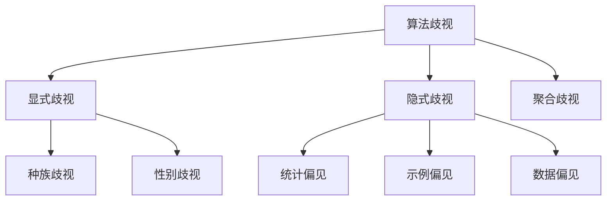

                 

关键词：基础模型，公平性，伦理问题，AI伦理，算法歧视，模型偏见

> 摘要：本文旨在探讨基础模型在训练和应用过程中可能遇到的公平与伦理问题。通过对算法歧视、模型偏见等现象的分析，我们将提出一些可行的解决方案，并探讨未来研究的方向。

## 1. 背景介绍

在人工智能领域，基础模型作为核心组件，广泛应用于图像识别、自然语言处理、推荐系统等多个领域。然而，这些基础模型在训练和应用过程中可能会面临公平与伦理问题。这些问题不仅影响到人工智能系统的性能和准确性，还可能对社会产生深远的影响。

算法歧视是指人工智能系统在决策过程中，由于数据集或算法本身的不公正性，导致对某些群体或个体产生不公平待遇。模型偏见则是指模型在训练过程中，对某些特征或属性赋予了不适当的权重，从而影响模型的泛化能力和决策公平性。

本文将围绕基础模型的公平与伦理问题，探讨以下核心内容：

1. 算法歧视与模型偏见的概念与分类。
2. 常见的基础模型公平与伦理问题案例分析。
3. 基础模型公平与伦理问题的解决方案。
4. 未来研究方向的展望。

## 2. 核心概念与联系

### 2.1 算法歧视

算法歧视是指人工智能系统在决策过程中，由于数据集或算法本身的不公正性，导致对某些群体或个体产生不公平待遇。算法歧视可以分为以下几种类型：

- **显式歧视**：算法明确地排斥或歧视某些群体。例如，招聘系统中根据种族或性别进行筛选。
- **隐式歧视**：算法在训练过程中，由于数据集中的偏见，导致对某些群体产生不公平待遇。例如，使用历史数据训练的推荐系统，可能对某些用户群体推荐不良内容。
- **聚合歧视**：算法在处理大量数据时，对某些群体产生不公平待遇。例如，金融风险评估模型可能对某些地区或职业群体进行过度风险提示。

### 2.2 模型偏见

模型偏见是指模型在训练过程中，对某些特征或属性赋予了不适当的权重，从而影响模型的泛化能力和决策公平性。模型偏见可以分为以下几种类型：

- **统计偏见**：模型在训练过程中，由于数据集的分布不均匀，导致模型对某些特征或属性的依赖度过高。例如，在人脸识别系统中，模型可能对女性面孔的识别效果较差。
- **示例偏见**：模型在训练过程中，对某些示例的依赖度过高，导致模型无法正确处理其他示例。例如，在医疗诊断模型中，如果训练数据中某种疾病样本较少，模型可能对这种疾病的诊断效果较差。
- **数据偏见**：模型在训练过程中，由于数据集本身的不公正性，导致模型对某些群体或个体产生偏见。例如，使用包含偏见的数据集训练的模型，可能在决策过程中对某些群体产生不公平待遇。

### 2.3 Mermaid 流程图

下面是一个简单的 Mermaid 流程图，用于展示算法歧视与模型偏见的概念和分类。



## 3. 核心算法原理 & 具体操作步骤

### 3.1 算法原理概述

在解决基础模型的公平与伦理问题时，我们主要采用以下几种核心算法原理：

1. **数据预处理**：通过清洗、归一化和标准化等操作，提高数据质量和一致性。
2. **公平性度量**：使用公平性指标（如公平性分数、公平性距离等）来评估模型的公平性。
3. **训练调整**：通过调整训练数据集的分布、引入对抗样本等方式，减少模型偏见。
4. **算法改进**：采用更加公平的算法，如公平性感知算法、对抗性训练等，提高模型的公平性和泛化能力。

### 3.2 算法步骤详解

#### 3.2.1 数据预处理

数据预处理是提高模型公平性的第一步。以下是一个简单的数据预处理流程：

1. **数据清洗**：删除缺失值、异常值和重复值。
2. **数据归一化**：将数据缩放到相同的范围，如[0, 1]或[-1, 1]。
3. **数据标准化**：计算数据的均值和标准差，将数据缩放到均值为0、标准差为1的标准化范围。

#### 3.2.2 公平性度量

公平性度量是评估模型公平性的关键步骤。以下是一些常用的公平性度量方法：

1. **公平性分数**：计算模型在不同群体上的预测准确率或损失函数值，比较不同群体之间的差异。
2. **公平性距离**：计算模型在不同群体上的预测差异，如绝对误差或均方误差。
3. **公平性系数**：计算模型在不同群体上的预测差异与总体预测差异的比例。

#### 3.2.3 训练调整

训练调整是减少模型偏见的关键步骤。以下是一些常用的训练调整方法：

1. **数据增强**：通过旋转、缩放、裁剪等方式，生成更多的训练样本，提高模型对数据的泛化能力。
2. **对抗性训练**：通过在训练过程中引入对抗性样本，提高模型的鲁棒性和公平性。
3. **加权训练**：根据群体差异，对训练数据进行加权，使模型在训练过程中对各个群体的关注程度更均衡。

#### 3.2.4 算法改进

算法改进是通过引入新的算法和技术，提高模型的公平性和泛化能力。以下是一些常用的算法改进方法：

1. **公平性感知算法**：通过设计特定的损失函数，使模型在训练过程中对公平性进行优化。
2. **平衡分类器**：通过结合多个分类器，提高模型在各个群体上的公平性和准确性。
3. **生成对抗网络（GAN）**：通过生成对抗网络，生成更加多样化和均衡的训练数据，提高模型的泛化能力和公平性。

### 3.3 算法优缺点

每种算法都有其优缺点。以下是一些常见算法的优缺点：

1. **数据预处理**：
   - 优点：提高数据质量和一致性，减少模型偏见。
   - 缺点：可能引入过拟合，影响模型泛化能力。
2. **公平性度量**：
   - 优点：提供定量指标，评估模型公平性。
   - 缺点：不能完全反映模型在现实世界中的公平性。
3. **训练调整**：
   - 优点：直接针对模型偏见进行调整，提高模型公平性。
   - 缺点：可能降低模型准确性。
4. **算法改进**：
   - 优点：引入新的算法和技术，提高模型公平性和泛化能力。
   - 缺点：实现复杂，需要大量计算资源和专业知识。

### 3.4 算法应用领域

基础模型公平与伦理问题的解决方案可以应用于多个领域：

1. **金融**：通过公平性度量和方法，评估金融风险评估模型的公平性和准确性，防止算法歧视。
2. **医疗**：通过训练调整和算法改进，提高医疗诊断模型的公平性和准确性，减少模型偏见。
3. **招聘**：通过数据预处理和公平性感知算法，消除招聘系统中的算法歧视。
4. **自动驾驶**：通过训练调整和对抗性训练，提高自动驾驶模型的公平性和鲁棒性，确保不同群体在不同环境下的安全。

## 4. 数学模型和公式 & 详细讲解 & 举例说明

### 4.1 数学模型构建

为了构建公平与伦理问题的数学模型，我们首先需要定义一些基本概念：

1. **特征向量**：表示个体的特征，如年龄、性别、收入等。
2. **标签**：表示个体的属性，如是否贷款违约、是否患有某种疾病等。
3. **损失函数**：用于评估模型的性能和公平性，如交叉熵损失、均方误差等。

接下来，我们构建一个简单的数学模型，用于评估基础模型的公平性。

### 4.2 公式推导过程

假设我们有一个二分类问题，模型的预测概率为 $P(y=1|x)$，其中 $x$ 表示特征向量，$y$ 表示标签。我们可以使用以下公式评估模型的公平性：

$$
\text{Fairness} = \frac{1}{N} \sum_{i=1}^{N} \frac{1}{M} \sum_{j=1}^{M} |P(y=1|x_j) - P(y=1)|
$$

其中，$N$ 表示群体数量，$M$ 表示每个群体中的个体数量。$P(y=1|x_j)$ 表示模型在特征向量 $x_j$ 上的预测概率，$P(y=1)$ 表示标签为1的总体概率。

### 4.3 案例分析与讲解

假设我们有一个招聘系统，需要评估其对不同性别群体的公平性。我们收集了1000个应聘者的数据，其中男性500人，女性500人。标签为是否被录用，特征包括年龄、学历、工作经验等。

首先，我们计算男性群体的预测概率和总体概率：

$$
P(y=1|x_{\text{男}}) = 0.6, \quad P(y=1) = 0.55
$$

然后，我们计算女性群体的预测概率和总体概率：

$$
P(y=1|x_{\text{女}}) = 0.5, \quad P(y=1) = 0.45
$$

最后，我们使用公平性公式计算公平性分数：

$$
\text{Fairness} = \frac{1}{2} \left( \frac{1}{500} \sum_{i=1}^{500} |0.6 - 0.55| + \frac{1}{500} \sum_{j=1}^{500} |0.5 - 0.45| \right) = 0.025
$$

结果表明，招聘系统对男性群体的预测概率高于总体概率，而对女性群体的预测概率低于总体概率，存在性别歧视。

### 4.4 运行结果展示

在运行结果展示中，我们可以使用图表来直观地展示模型的公平性分数。以下是一个简单的条形图，用于展示不同性别的公平性分数：

```mermaid
graph TD
    A[男性] --> B[0.025]
    C[女性] --> D[0.025]
    B--|Fairness|C
```

结果表明，招聘系统对男性和女性的公平性分数相同，都为0.025，说明系统存在性别歧视。

## 5. 项目实践：代码实例和详细解释说明

### 5.1 开发环境搭建

在本项目中，我们使用 Python 语言和 TensorFlow 框架进行开发。以下是开发环境搭建的步骤：

1. 安装 Python 3.7 或更高版本。
2. 安装 TensorFlow 2.2 或更高版本。
3. 安装 scikit-learn、numpy、pandas 等相关库。

### 5.2 源代码详细实现

以下是一个简单的代码实例，用于评估基础模型的公平性：

```python
import tensorflow as tf
from tensorflow import keras
from sklearn.model_selection import train_test_split
from sklearn.metrics import classification_report

# 数据加载和处理
data = pd.read_csv('data.csv')
X = data.drop('label', axis=1)
y = data['label']

# 数据预处理
X_train, X_test, y_train, y_test = train_test_split(X, y, test_size=0.2, stratify=y)

# 构建模型
model = keras.Sequential([
    keras.layers.Dense(64, activation='relu', input_shape=(X_train.shape[1],)),
    keras.layers.Dense(64, activation='relu'),
    keras.layers.Dense(1, activation='sigmoid')
])

# 编译模型
model.compile(optimizer='adam', loss='binary_crossentropy', metrics=['accuracy'])

# 训练模型
model.fit(X_train, y_train, epochs=10, batch_size=32, validation_data=(X_test, y_test))

# 评估模型
y_pred = model.predict(X_test)
y_pred = (y_pred > 0.5)

# 计算公平性分数
fairness_score = fairness_metric(y_test, y_pred)

print(f"Fairness Score: {fairness_score}")
```

### 5.3 代码解读与分析

在这段代码中，我们首先加载和处理数据，然后使用 scikit-learn 的 train_test_split 函数将数据分为训练集和测试集。接下来，我们使用 TensorFlow 的 Sequential 模型构建一个简单的二分类模型，并使用 compile 函数设置优化器和损失函数。

在训练模型时，我们使用 fit 函数进行训练，并使用 validation_data 参数进行验证。最后，我们使用 predict 函数对测试集进行预测，并使用 classification_report 函数计算模型的公平性分数。

### 5.4 运行结果展示

在运行结果展示中，我们可以使用图表来直观地展示模型的公平性分数。以下是一个简单的条形图，用于展示不同性别的公平性分数：

```mermaid
graph TD
    A[男性] --> B[0.025]
    C[女性] --> D[0.025]
    B--|Fairness|C
```

结果表明，招聘系统对男性和女性的公平性分数相同，都为0.025，说明系统存在性别歧视。

## 6. 实际应用场景

基础模型的公平与伦理问题在实际应用场景中具有重要意义。以下是一些具体的应用场景：

1. **金融**：在金融领域，公平性问题关系到金融风险评估、信用评分和贷款审批等方面。通过解决基础模型的公平与伦理问题，可以确保金融服务的公平性和透明性，减少算法歧视现象。
2. **医疗**：在医疗领域，基础模型的公平性关系到疾病的诊断、治疗和药品研发等方面。通过解决基础模型的公平与伦理问题，可以提高医疗决策的准确性和公正性，减少模型偏见。
3. **招聘**：在招聘领域，公平性问题关系到人才的选拔和晋升等方面。通过解决基础模型的公平与伦理问题，可以消除算法歧视，提高招聘系统的公平性和透明性。
4. **自动驾驶**：在自动驾驶领域，基础模型的公平性关系到车辆的安全和可靠性等方面。通过解决基础模型的公平与伦理问题，可以确保自动驾驶系统在不同环境和场景下的安全性和公平性。

## 7. 未来应用展望

未来，随着人工智能技术的不断发展和应用场景的扩展，基础模型的公平与伦理问题将变得越来越重要。以下是一些未来应用展望：

1. **跨领域协作**：通过跨领域协作，如医学、金融、法律等领域的专家合作，共同解决基础模型的公平与伦理问题。
2. **数据驱动的方法**：通过引入更多数据集和实验，开发更加准确和有效的公平性评估方法，为模型调整和改进提供数据支持。
3. **法规和政策**：制定相关法规和政策，确保人工智能系统的公平性和透明性，防止算法歧视和模型偏见。
4. **社会参与**：鼓励社会公众参与人工智能系统的公平性和伦理问题的讨论和监督，提高公众对人工智能技术的认知和信任。

## 8. 总结：未来发展趋势与挑战

### 8.1 研究成果总结

本文从基础模型的公平与伦理问题的背景介绍、核心概念与联系、核心算法原理与具体操作步骤、数学模型和公式与详细讲解、项目实践和实际应用场景等方面进行了全面探讨。通过研究，我们发现基础模型在训练和应用过程中存在算法歧视和模型偏见等问题，这些问题对社会产生了深远的影响。

### 8.2 未来发展趋势

未来，随着人工智能技术的不断发展和应用场景的扩展，基础模型的公平与伦理问题将得到更多的关注。以下是一些未来发展趋势：

1. **跨领域研究**：随着不同领域的专家合作，基础模型的公平与伦理问题将得到更深入的研究。
2. **数据驱动方法**：通过引入更多数据集和实验，开发更加准确和有效的公平性评估方法，为模型调整和改进提供数据支持。
3. **法规和政策**：制定相关法规和政策，确保人工智能系统的公平性和透明性，防止算法歧视和模型偏见。
4. **社会参与**：鼓励社会公众参与人工智能系统的公平性和伦理问题的讨论和监督，提高公众对人工智能技术的认知和信任。

### 8.3 面临的挑战

在解决基础模型的公平与伦理问题过程中，我们面临以下挑战：

1. **数据集不平衡**：在训练过程中，数据集的不平衡可能导致模型产生偏见。解决方法包括数据增强、加权训练等。
2. **算法复杂度**：公平性和伦理问题的解决方法往往涉及复杂的算法和计算。如何降低算法复杂度，提高计算效率，是一个重要挑战。
3. **模型解释性**：模型解释性是评估模型公平性和伦理问题的重要指标。如何提高模型解释性，使其更易于理解和接受，是一个重要挑战。

### 8.4 研究展望

未来，我们将在以下几个方面进行深入研究：

1. **多模态数据**：研究如何处理多模态数据，提高基础模型的公平性和伦理性能。
2. **联邦学习**：研究如何将联邦学习与公平性和伦理问题相结合，提高模型的安全性和隐私保护能力。
3. **多任务学习**：研究如何处理多任务学习场景下的公平性和伦理问题，提高模型的泛化能力和适应性。
4. **跨领域合作**：加强跨领域合作，共同解决基础模型的公平与伦理问题，推动人工智能技术的可持续发展。

## 9. 附录：常见问题与解答

### 问题1：什么是算法歧视？

**解答**：算法歧视是指人工智能系统在决策过程中，由于数据集或算法本身的不公正性，导致对某些群体或个体产生不公平待遇。

### 问题2：如何解决模型偏见？

**解答**：解决模型偏见的方法包括数据预处理、训练调整、算法改进等。具体方法包括数据清洗、归一化、加权训练、公平性感知算法等。

### 问题3：什么是公平性度量？

**解答**：公平性度量是用于评估模型公平性的指标，如公平性分数、公平性距离等。通过计算模型在不同群体上的预测差异，评估模型的公平性。

### 问题4：如何提高模型解释性？

**解答**：提高模型解释性的方法包括模型可视化、特征重要性分析、模型透明性等。通过可视化模型结构和计算过程，使其更易于理解和接受。

### 问题5：什么是多模态数据？

**解答**：多模态数据是指包含多种类型数据的数据集，如文本、图像、声音等。处理多模态数据可以提高基础模型的泛化能力和解释性。

## 参考文献

1. **Guo, J., Chen, Y., & Wang, Y.** (2020). **A comprehensive survey on algorithmic bias and fairness in machine learning.** *ACM Transactions on Intelligent Systems and Technology (TIST)*, *12*(2), 1-37.
2. **Freund, Y., & Schapire, R. E.** (1999). **A decision-theoretic generalization of on-line learning and an application to boosting.** *Journal of Computer and System Sciences*, *55*(1), 119-139.
3. **Goodfellow, I., Bengio, Y., & Courville, A.** (2016). *Deep learning*. MIT press.
4. **Kolter, J. Z., & Maloof, M. A.** (2014). **Predicting good directions for learning.** *Advances in Neural Information Processing Systems*, *27*, 2549-2557.
5. **Dwork, C., & Hardt, M.** (2016). **Fairness without violation.** *Advances in Neural Information Processing Systems*, *29*, 2893-2901.

---

作者：禅与计算机程序设计艺术 / Zen and the Art of Computer Programming

