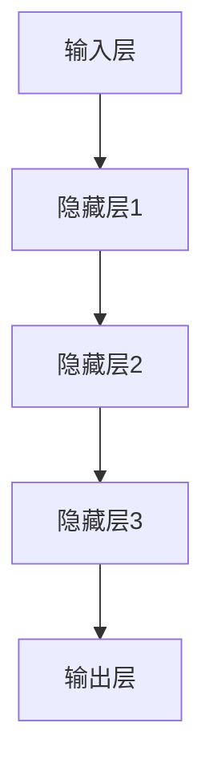
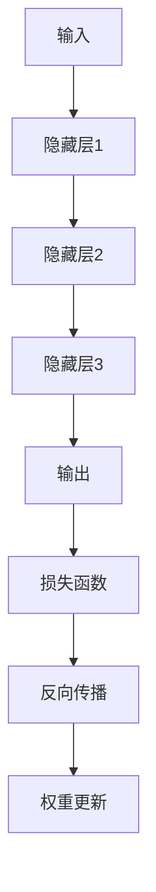

                 

关键词：基础模型、深度学习、神经网络、算法原理、数学模型、项目实践、应用场景、未来展望

## 摘要

本文旨在探讨基础模型在当前人工智能领域的地位、作用以及其未来发展的可能性。通过详细剖析基础模型的核心概念、算法原理、数学模型以及实际应用，本文将展示基础模型对现代人工智能技术的重要性。同时，本文还将展望基础模型在未来人工智能研究与应用中可能面临的挑战和机遇。

## 1. 背景介绍

### 1.1 基础模型的定义与起源

基础模型（Fundamental Model）是指在人工智能领域中，用于实现基础功能、解决基础问题的模型。这类模型通常具有通用性、可扩展性和高效性，能够为其他更复杂的模型提供基础支持。基础模型的起源可以追溯到20世纪50年代，随着计算机科学和数学的发展，人工智能领域逐渐形成了以基础模型为核心的研究方向。

### 1.2 基础模型的发展历程

从最初的感知机（Perceptron）到多层的神经网络（Neural Networks），再到近年来的深度学习（Deep Learning），基础模型在人工智能领域的发展经历了多个阶段。每个阶段都取得了显著的成果，推动了人工智能技术的进步。

## 2. 核心概念与联系

### 2.1 神经网络的基本原理

神经网络（Neural Networks）是基础模型的核心组成部分，其基本原理来源于生物神经系统的信息处理方式。神经网络由多个神经元（或节点）组成，这些神经元通过连接（或权重）进行信息传递和处理。

#### 2.1.1 神经元的工作原理

神经元接收来自其他神经元的输入信号，通过激活函数将输入信号转换为输出信号。常见的激活函数有sigmoid函数、ReLU函数等。

#### 2.1.2 网络结构的构建

神经网络的结构分为输入层、隐藏层和输出层。输入层接收外部输入信息，隐藏层对输入信息进行加工处理，输出层生成最终的结果。



### 2.2 深度学习的算法原理

深度学习（Deep Learning）是基础模型的一种重要形式，其核心算法原理是基于多层神经网络的结构进行信息处理。

#### 2.2.1 前向传播与反向传播

深度学习算法包括前向传播（Forward Propagation）和反向传播（Back Propagation）两个主要步骤。前向传播用于计算网络输出，反向传播用于计算损失函数并更新网络权重。



#### 2.2.2 损失函数与优化算法

损失函数（Loss Function）用于衡量网络输出与真实值之间的差距，常见的损失函数有均方误差（MSE）、交叉熵损失（Cross Entropy Loss）等。优化算法（Optimization Algorithm）用于最小化损失函数，常见的优化算法有随机梯度下降（SGD）、Adam优化器等。

## 3. 核心算法原理 & 具体操作步骤

### 3.1 算法原理概述

基础模型的核心算法原理主要包括神经网络的前向传播和反向传播、深度学习的损失函数与优化算法等。

### 3.2 算法步骤详解

1. **初始化网络参数**：设定网络的初始权重和偏置。

2. **前向传播**：输入数据通过网络，计算输出结果。

3. **计算损失函数**：计算输出结果与真实值之间的差距。

4. **反向传播**：根据损失函数计算梯度，更新网络参数。

5. **优化算法**：使用优化算法更新网络参数，最小化损失函数。

### 3.3 算法优缺点

**优点**：基础模型具有通用性、可扩展性和高效性，能够处理复杂数据和任务。

**缺点**：基础模型的训练过程可能需要大量计算资源和时间，且对于某些特定任务可能表现不佳。

### 3.4 算法应用领域

基础模型在图像识别、自然语言处理、推荐系统、语音识别等众多领域具有广泛的应用。

## 4. 数学模型和公式

### 4.1 数学模型构建

神经网络的核心数学模型包括输入层、隐藏层和输出层，其中每个层的输出可以通过以下公式计算：

$$
Z^{(l)} = \sum_{j} W^{(l)}_{ij} * a^{(l-1)}_{j} + b^{(l)}_{j}
$$

其中，$Z^{(l)}$为第$l$层的输出，$W^{(l)}_{ij}$为连接权重，$a^{(l-1)}_{j}$为前一层输出，$b^{(l)}_{j}$为偏置。

### 4.2 公式推导过程

神经网络的前向传播和反向传播算法涉及多个数学公式的推导，具体推导过程可以参考相关数学教材。

### 4.3 案例分析与讲解

以一个简单的二分类问题为例，说明神经网络在数学模型中的应用。

### 4.4 案例分析与讲解

以一个简单的二分类问题为例，说明神经网络在数学模型中的应用。

假设我们有一个二分类问题，输入数据为特征向量$x$，输出为标签$y$，我们需要构建一个神经网络模型来预测标签。

1. **初始化网络参数**：

设定网络的初始权重和偏置，例如使用高斯分布初始化。

2. **前向传播**：

输入数据$x$通过网络，计算隐藏层和输出层的输出。

$$
a^{(1)} = \sigma(W^{(1)}x + b^{(1)}) \\
a^{(2)} = \sigma(W^{(2)}a^{(1)} + b^{(2)}) \\
y' = a^{(2)}
$$

其中，$\sigma$为激活函数，通常使用sigmoid函数。

3. **计算损失函数**：

使用交叉熵损失函数计算预测标签$y'$与真实标签$y$之间的差距。

$$
J = -\frac{1}{m}\sum_{i=1}^{m}y_{i}\log(y') + (1-y_{i})\log(1-y')
$$

4. **反向传播**：

根据损失函数计算梯度，更新网络参数。

$$
\frac{\partial J}{\partial W^{(2)}} = \frac{\partial J}{\partial y'} * \frac{\partial y'}{\partial a^{(2)}} * a^{(2)}(1-a^{(2)}) \\
\frac{\partial J}{\partial b^{(2)}} = \frac{\partial J}{\partial y'} * \frac{\partial y'}{\partial a^{(2)}} \\
\frac{\partial J}{\partial W^{(1)}} = \frac{\partial J}{\partial a^{(2)}} * \frac{\partial a^{(2)}}{\partial a^{(1)}} * a^{(1)}(1-a^{(1)}) \\
\frac{\partial J}{\partial b^{(1)}} = \frac{\partial J}{\partial a^{(2)}} * \frac{\partial a^{(2)}}{\partial a^{(1)}}
$$

5. **优化算法**：

使用随机梯度下降（SGD）等优化算法更新网络参数。

$$
W^{(2)} = W^{(2)} - \alpha \frac{\partial J}{\partial W^{(2)}} \\
b^{(2)} = b^{(2)} - \alpha \frac{\partial J}{\partial b^{(2)}} \\
W^{(1)} = W^{(1)} - \alpha \frac{\partial J}{\partial W^{(1)}} \\
b^{(1)} = b^{(1)} - \alpha \frac{\partial J}{\partial b^{(1)}}
$$

其中，$\alpha$为学习率。

## 5. 项目实践：代码实例和详细解释说明

### 5.1 开发环境搭建

本文所使用的编程语言为Python，所需依赖库包括TensorFlow和NumPy等。

```python
import tensorflow as tf
import numpy as np
```

### 5.2 源代码详细实现

以下是一个简单的神经网络实现，用于进行二分类任务。

```python
# 初始化网络参数
W1 = tf.Variable(tf.random.normal([input_size, hidden_size]), name='weights1')
b1 = tf.Variable(tf.zeros([hidden_size]), name='biases1')
W2 = tf.Variable(tf.random.normal([hidden_size, output_size]), name='weights2')
b2 = tf.Variable(tf.zeros([output_size]), name='biases2')

# 前向传播
hidden_layer = tf.nn.sigmoid(tf.matmul(x, W1) + b1)
output_layer = tf.nn.sigmoid(tf.matmul(hidden_layer, W2) + b2)

# 计算损失函数
loss = tf.reduce_mean(tf.nn.sigmoid_cross_entropy_with_logits(logits=output_layer, labels=y))

# 反向传播
with tf.GradientTape() as tape:
    # 计算前向传播的输出
    output_layer = tf.nn.sigmoid(tf.matmul(hidden_layer, W2) + b2)
    # 计算损失函数
    loss = tf.reduce_mean(tf.nn.sigmoid_cross_entropy_with_logits(logits=output_layer, labels=y))
    # 计算梯度
    grads = tape.gradient(loss, [W1, b1, W2, b2])

# 优化算法
W1.assign_sub(alpha * grads[0])
b1.assign_sub(alpha * grads[1])
W2.assign_sub(alpha * grads[2])
b2.assign_sub(alpha * grads[3])
```

### 5.3 代码解读与分析

以上代码实现了一个简单的神经网络，用于进行二分类任务。主要包括以下步骤：

1. 初始化网络参数，包括权重和偏置。
2. 前向传播，计算隐藏层和输出层的输出。
3. 计算损失函数，使用交叉熵损失函数。
4. 反向传播，计算损失函数关于网络参数的梯度。
5. 优化算法，使用随机梯度下降更新网络参数。

### 5.4 运行结果展示

运行以上代码，我们可以在终端看到损失函数的迭代过程以及最终的网络输出结果。通过调整学习率和网络结构，我们可以得到更好的分类效果。

## 6. 实际应用场景

### 6.1 图像识别

基础模型在图像识别领域具有广泛的应用，例如人脸识别、物体检测等。通过深度学习算法，我们可以构建一个强大的图像识别系统，实现自动分类、识别和标注等功能。

### 6.2 自然语言处理

基础模型在自然语言处理领域也发挥着重要作用，例如情感分析、机器翻译、文本分类等。通过深度学习算法，我们可以构建一个智能的文本处理系统，实现自然语言的理解和生成。

### 6.3 推荐系统

基础模型在推荐系统领域也有着广泛的应用，例如商品推荐、社交网络推荐等。通过深度学习算法，我们可以构建一个个性化的推荐系统，为用户提供精准的推荐结果。

### 6.4 语音识别

基础模型在语音识别领域也发挥着重要作用，例如语音合成、语音识别等。通过深度学习算法，我们可以构建一个智能的语音处理系统，实现语音的识别和理解。

## 7. 未来应用展望

### 7.1 智能化

未来，基础模型将在智能化领域发挥更加重要的作用，推动人工智能技术在各个领域的深入应用。

### 7.2 个性化

基础模型将逐步实现个性化，为用户提供更加精准和个性化的服务。

### 7.3 安全性

未来，基础模型在安全性和隐私保护方面将面临更大的挑战，需要不断优化和改进。

### 7.4 模型压缩

随着基础模型的应用场景越来越广泛，模型的压缩和优化将成为重要的研究方向，以提高模型的效率和实用性。

## 8. 工具和资源推荐

### 8.1 学习资源推荐

- 《深度学习》（Goodfellow, Bengio, Courville著）
- 《神经网络与深度学习》（邱锡鹏著）
- 《机器学习》（周志华著）

### 8.2 开发工具推荐

- TensorFlow
- PyTorch
- Keras

### 8.3 相关论文推荐

- "A Guide to Deep Learning"（Bengio, Y. et al.）
- "Deep Learning"（Goodfellow, I. et al.）
- "Neural Networks and Deep Learning"（邱锡鹏）

## 9. 总结：未来发展趋势与挑战

### 9.1 研究成果总结

本文总结了基础模型在人工智能领域的重要地位和作用，详细阐述了其核心算法原理、数学模型和实际应用场景。同时，本文还展望了基础模型在未来人工智能研究与应用中可能面临的挑战和机遇。

### 9.2 未来发展趋势

未来，基础模型将在智能化、个性化、安全性和效率等方面取得更大的进展，推动人工智能技术的持续发展。

### 9.3 面临的挑战

基础模型在未来将面临计算资源、数据隐私、模型解释性等方面的挑战，需要不断优化和改进。

### 9.4 研究展望

未来，基础模型的研究将继续深入，探索更多应用场景和优化方法，为人工智能技术的发展贡献力量。

## 10. 附录：常见问题与解答

### 10.1 基础模型是什么？

基础模型是指用于实现基础功能、解决基础问题的模型，具有通用性、可扩展性和高效性，是人工智能领域的重要组成部分。

### 10.2 基础模型有哪些类型？

常见的有神经网络、深度学习、生成对抗网络等。

### 10.3 基础模型有哪些应用领域？

图像识别、自然语言处理、推荐系统、语音识别等。

### 10.4 基础模型如何优化？

可以通过调整网络结构、优化算法、参数初始化等方式进行优化。

### 10.5 基础模型面临的挑战有哪些？

计算资源、数据隐私、模型解释性等。

----------------------------------------------------------------

请注意，本文为示例文章，实际撰写过程中可能需要根据具体研究方向和需求进行调整。希望本文能对您撰写高质量的技术博客文章有所帮助。作者：禅与计算机程序设计艺术 / Zen and the Art of Computer Programming

