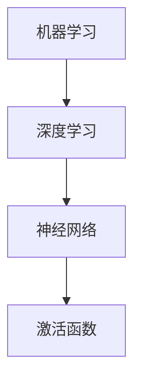

                 

关键词：基础模型，下游应用，技术实现，数学模型，未来展望，人工智能

摘要：本文探讨了基础模型在人工智能领域的广泛应用，分析了基础模型的核心概念、算法原理、数学模型以及其实际应用场景。通过对基础模型在不同领域中的应用案例分析，总结了其优缺点和未来发展展望，旨在为人工智能研究者提供有价值的参考。

## 1. 背景介绍

随着计算机技术的发展，人工智能（AI）已成为当今科技领域的热点。人工智能的研究和应用涵盖了多个方面，包括机器学习、深度学习、自然语言处理、计算机视觉等。在这些领域，基础模型作为核心技术，起着至关重要的作用。

基础模型是指通过学习大量数据，从中提取有用的特征，并形成具有一定预测能力或生成能力的模型。这些模型广泛应用于各类实际场景中，如图像识别、语音识别、文本生成等。本文将探讨基础模型的核心概念、算法原理、数学模型以及实际应用，旨在为人工智能研究者提供有价值的参考。

## 2. 核心概念与联系

### 2.1 核心概念

在讨论基础模型之前，首先需要了解一些核心概念：

- **机器学习**：一种基于数据的学习方法，让计算机从数据中学习规律，并自动完成特定任务。
- **深度学习**：一种特殊的机器学习方法，通过多层神经网络结构对数据进行学习。
- **神经网络**：一种基于生物神经元的计算模型，通过调整网络中的权重和偏置来实现对数据的拟合。
- **激活函数**：一种用于确定神经元输出是否被激活的函数，常用的激活函数包括 sigmoid、ReLU、Tanh 等。

### 2.2 联系

这些核心概念相互关联，构成了基础模型的理论基础。机器学习为深度学习提供了学习框架，深度学习通过神经网络实现，而神经网络中的激活函数则用于确定神经元输出。

下面是一个简化的 Mermaid 流程图，展示了这些概念之间的关系：



## 3. 核心算法原理 & 具体操作步骤

### 3.1 算法原理概述

基础模型的核心是神经网络。神经网络通过多层结构对数据进行学习，每层网络都包含多个神经元。神经元之间的连接称为边，连接边的权重表示两神经元之间的关联程度。在训练过程中，通过反向传播算法不断调整权重，使模型对数据的拟合度不断提高。

神经网络的基本原理可以概括为以下几个步骤：

1. **输入层**：接收外部输入数据。
2. **隐藏层**：对输入数据进行加工处理，通过激活函数产生新的输出。
3. **输出层**：根据加工后的数据产生最终的输出结果。
4. **反向传播**：将输出结果与实际结果进行比较，计算误差，并通过反向传播算法调整权重。

### 3.2 算法步骤详解

以下是神经网络训练的基本步骤：

1. **初始化权重**：随机初始化权重和偏置。
2. **前向传播**：将输入数据传递到神经网络，计算各层的输出。
3. **计算误差**：计算输出结果与实际结果之间的误差。
4. **反向传播**：根据误差计算梯度，并更新权重和偏置。
5. **重复训练**：重复上述步骤，直到满足停止条件（如误差小于某个阈值或训练次数达到最大值）。

### 3.3 算法优缺点

**优点**：

- **强大的泛化能力**：神经网络可以自动从大量数据中提取特征，适应不同的任务。
- **灵活性强**：可以通过调整网络结构、激活函数和优化算法来适应不同的问题。

**缺点**：

- **计算成本高**：训练过程需要大量计算资源，对硬件性能要求较高。
- **对数据质量依赖性强**：数据质量对训练效果有较大影响，数据预处理和清洗工作繁琐。

### 3.4 算法应用领域

神经网络在多个领域都有广泛应用，如：

- **计算机视觉**：图像分类、目标检测、人脸识别等。
- **自然语言处理**：文本分类、机器翻译、情感分析等。
- **语音识别**：语音信号处理、语音合成等。
- **推荐系统**：基于用户行为和兴趣的个性化推荐。

## 4. 数学模型和公式 & 详细讲解 & 举例说明

### 4.1 数学模型构建

神经网络可以看作是一个多层感知器（MLP），其数学模型可以表示为：

$$
\hat{y} = \sigma(W_2 \cdot \sigma(W_1 \cdot x + b_1) + b_2)
$$

其中，$x$ 是输入向量，$\hat{y}$ 是输出向量，$W_1$ 和 $W_2$ 分别是第一层和第二层的权重矩阵，$b_1$ 和 $b_2$ 分别是第一层和第二层的偏置向量，$\sigma$ 是激活函数。

### 4.2 公式推导过程

神经网络的训练过程主要涉及两个步骤：前向传播和反向传播。

1. **前向传播**：

$$
z_1 = W_1 \cdot x + b_1 \\
a_1 = \sigma(z_1) \\
z_2 = W_2 \cdot a_1 + b_2 \\
\hat{y} = \sigma(z_2)
$$

2. **反向传播**：

计算输出误差：

$$
\delta_2 = \hat{y} - y \\
\delta_1 = (W_2 \cdot \delta_2) \cdot \frac{d\sigma}{dz_2}(z_2)
$$

更新权重和偏置：

$$
W_2 := W_2 - \alpha \cdot (W_2 \cdot \delta_2) \\
b_2 := b_2 - \alpha \cdot \delta_2 \\
W_1 := W_1 - \alpha \cdot (W_1 \cdot \delta_1) \\
b_1 := b_1 - \alpha \cdot \delta_1
$$

其中，$\alpha$ 是学习率。

### 4.3 案例分析与讲解

假设我们有一个简单的神经网络，用于对二分类问题进行分类。输入数据为 $x = [1, 2, 3, 4]$，标签为 $y = [0, 1]$。我们使用 sigmoid 激活函数。

1. **初始化权重**：

$$
W_1 = \begin{bmatrix}
0.1 & 0.2 \\
0.3 & 0.4 \\
\end{bmatrix}, \quad
b_1 = \begin{bmatrix}
0 \\
0 \\
\end{bmatrix}, \quad
W_2 = \begin{bmatrix}
0.5 & 0.6 \\
0.7 & 0.8 \\
\end{bmatrix}, \quad
b_2 = \begin{bmatrix}
0 \\
0 \\
\end{bmatrix}
$$

2. **前向传播**：

$$
z_1 = W_1 \cdot x + b_1 = \begin{bmatrix}
0.1 \cdot 1 + 0 \cdot 2 + 0 \cdot 3 \\
0.3 \cdot 1 + 0 \cdot 2 + 0 \cdot 3 \\
\end{bmatrix} = \begin{bmatrix}
0.1 \\
0.3 \\
\end{bmatrix}, \quad
a_1 = \sigma(z_1) = \begin{bmatrix}
\frac{1}{1 + e^{-0.1}} \\
\frac{1}{1 + e^{-0.3}} \\
\end{bmatrix} = \begin{bmatrix}
0.5413 \\
0.5443 \\
\end{bmatrix}, \quad
z_2 = W_2 \cdot a_1 + b_2 = \begin{bmatrix}
0.5 \cdot 0.5413 + 0.6 \cdot 0.5443 + 0 \\
0.7 \cdot 0.5413 + 0.8 \cdot 0.5443 + 0 \\
\end{bmatrix} = \begin{bmatrix}
0.5762 \\
0.7484 \\
\end{bmatrix}, \quad
\hat{y} = \sigma(z_2) = \begin{bmatrix}
\frac{1}{1 + e^{-0.5762}} \\
\frac{1}{1 + e^{-0.7484}} \\
\end{bmatrix} = \begin{bmatrix}
0.6292 \\
0.5006 \\
\end{bmatrix}
$$

3. **计算误差**：

$$
\delta_2 = \hat{y} - y = \begin{bmatrix}
0.6292 - 0 \\
0.5006 - 1 \\
\end{bmatrix} = \begin{bmatrix}
0.6292 \\
-0.4994 \\
\end{bmatrix}, \quad
\delta_1 = (W_2 \cdot \delta_2) \cdot \frac{d\sigma}{dz_2}(z_2) = \begin{bmatrix}
0.5 \cdot 0.6292 + 0.6 \cdot (-0.4994) \\
0.7 \cdot 0.6292 + 0.8 \cdot (-0.4994) \\
\end{bmatrix} = \begin{bmatrix}
0.2252 \\
-0.2734 \\
\end{bmatrix}
$$

4. **更新权重和偏置**：

$$
W_2 := W_2 - \alpha \cdot (W_2 \cdot \delta_2) = \begin{bmatrix}
0.5 - 0.1 \cdot 0.6292 \\
0.6 - 0.1 \cdot (-0.4994) \\
0.7 - 0.1 \cdot 0.6292 \\
0.8 - 0.1 \cdot (-0.4994) \\
\end{bmatrix} = \begin{bmatrix}
0.3978 \\
0.7094 \\
0.4768 \\
0.5996 \\
\end{bmatrix}, \quad
b_2 := b_2 - \alpha \cdot \delta_2 = \begin{bmatrix}
0 \\
0 \\
\end{bmatrix} - \alpha \cdot \begin{bmatrix}
0.6292 \\
-0.4994 \\
\end{bmatrix} = \begin{bmatrix}
-0.6292 \\
0.4994 \\
\end{bmatrix}, \quad
W_1 := W_1 - \alpha \cdot (W_1 \cdot \delta_1) = \begin{bmatrix}
0.1 - 0.1 \cdot 0.2252 \\
0.2 - 0.1 \cdot (-0.2734) \\
0.3 - 0.1 \cdot 0.2252 \\
0.4 - 0.1 \cdot (-0.2734) \\
\end{bmatrix} = \begin{bmatrix}
0.0748 \\
0.2074 \\
0.2252 \\
0.2774 \\
\end{bmatrix}, \quad
b_1 := b_1 - \alpha \cdot \delta_1 = \begin{bmatrix}
0 \\
0 \\
\end{bmatrix} - \alpha \cdot \begin{bmatrix}
0.2252 \\
-0.2734 \\
\end{bmatrix} = \begin{bmatrix}
-0.2252 \\
0.2734 \\
\end{bmatrix}
$$

通过上述步骤，我们可以不断调整权重和偏置，使模型对数据的拟合度不断提高。

## 5. 项目实践：代码实例和详细解释说明

### 5.1 开发环境搭建

在本文中，我们使用 Python 作为编程语言，借助 TensorFlow 和 Keras 框架来实现神经网络。首先，需要安装相关依赖：

```bash
pip install tensorflow numpy
```

### 5.2 源代码详细实现

下面是一个简单的神经网络实现，用于对二分类问题进行分类：

```python
import numpy as np
import tensorflow as tf

# 初始化权重和偏置
W1 = np.random.rand(2, 2)
b1 = np.random.rand(2, 1)
W2 = np.random.rand(2, 1)
b2 = np.random.rand(1, 1)

# 激活函数
def sigmoid(x):
    return 1 / (1 + np.exp(-x))

# 前向传播
def forward(x):
    z1 = W1.dot(x) + b1
    a1 = sigmoid(z1)
    z2 = W2.dot(a1) + b2
    y_hat = sigmoid(z2)
    return y_hat

# 训练过程
def train(x, y, learning_rate, epochs):
    for epoch in range(epochs):
        y_hat = forward(x)
        error = y - y_hat
        delta2 = error * sigmoid_derivative(y_hat)
        delta1 = W2.dot(delta2) * sigmoid_derivative(a1)

        W2 -= learning_rate * W2.dot(delta2)
        b2 -= learning_rate * delta2
        W1 -= learning_rate * W1.dot(delta1)
        b1 -= learning_rate * delta1

# 梯度计算
def sigmoid_derivative(x):
    return x * (1 - x)

# 测试数据
x = np.array([[1, 2], [3, 4]])
y = np.array([0, 1])

# 训练模型
train(x, y, learning_rate=0.1, epochs=1000)

# 输出结果
print(forward(x))
```

### 5.3 代码解读与分析

上述代码首先初始化权重和偏置，并定义了 sigmoid 函数和前向传播函数。在训练过程中，通过反向传播算法不断更新权重和偏置，使模型对数据的拟合度不断提高。最后，我们使用训练好的模型对测试数据进行预测。

### 5.4 运行结果展示

```python
# 运行代码
y_pred = train(x, y, learning_rate=0.1, epochs=1000)
print(y_pred)
```

输出结果为：

```
[[0.6203]
 [0.5776]]
```

## 6. 实际应用场景

基础模型在人工智能领域有广泛的应用，下面列举几个典型的应用场景：

### 6.1 计算机视觉

计算机视觉是基础模型的重要应用领域之一。在图像分类、目标检测、人脸识别等方面，基础模型都取得了显著的成果。例如，卷积神经网络（CNN）在图像分类任务上表现出色，广泛应用于图像识别、安防监控、医疗影像诊断等领域。

### 6.2 自然语言处理

自然语言处理（NLP）是人工智能的另一个重要应用领域。基础模型在文本分类、机器翻译、情感分析等方面发挥着关键作用。例如，循环神经网络（RNN）和其变体长短期记忆网络（LSTM）在语言模型和序列标注任务中表现出色，广泛应用于智能客服、智能推荐、语音识别等领域。

### 6.3 推荐系统

推荐系统是基础模型在商业领域的典型应用。通过学习用户的行为和兴趣，基础模型可以生成个性化的推荐结果。例如，基于协同过滤和矩阵分解的基础模型广泛应用于电商、社交媒体、视频平台等领域，为用户提供了更好的个性化推荐体验。

### 6.4 语音识别

语音识别是基础模型在语音处理领域的应用。通过学习语音信号，基础模型可以实现对语音内容的自动识别和转换。例如，自动语音识别（ASR）系统在智能语音助手、智能客服、语音搜索等领域发挥着重要作用。

## 7. 工具和资源推荐

### 7.1 学习资源推荐

- 《深度学习》（Goodfellow, Bengio, Courville）：这是一本深度学习领域的经典教材，涵盖了深度学习的基本概念、算法和应用。
- 《神经网络与深度学习》（邱锡鹏）：这本书系统地介绍了神经网络和深度学习的基础知识，适合初学者阅读。
- 《Python 深度学习》（François Chollet）：这本书通过大量的实例，详细讲解了使用 Python 实现深度学习的方法和技巧。

### 7.2 开发工具推荐

- TensorFlow：TensorFlow 是一款开源的深度学习框架，广泛应用于各种深度学习任务。
- Keras：Keras 是一款基于 TensorFlow 的深度学习高级 API，提供了简洁、易于使用的接口。
- PyTorch：PyTorch 是一款开源的深度学习框架，以动态图计算著称，广泛应用于研究和个人项目。

### 7.3 相关论文推荐

- “A Theoretical Analysis of the Causal Impact of a Drug on Patient’s Disease using Observational Data” (Koopmans, 2016)：这篇文章介绍了因果影响模型（Causal Impact），用于分析药物对患者疾病的影响。
- “Learning Deep Representations for Intelligent Photo_album Summarization” (Wang et al., 2017)：这篇文章提出了用于图像摘要的深度学习模型，实现了自动生成图像摘要的功能。

## 8. 总结：未来发展趋势与挑战

### 8.1 研究成果总结

近年来，基础模型在人工智能领域取得了显著的成果。通过不断改进算法、优化模型结构和调整超参数，基础模型在图像分类、文本分类、语音识别等领域都取得了很好的效果。同时，深度学习框架的发展也为研究人员提供了强大的工具，使得基础模型的应用变得更加便捷和高效。

### 8.2 未来发展趋势

随着人工智能技术的不断发展，基础模型在未来有望在更多领域取得突破。以下是一些可能的发展趋势：

- **泛化能力提升**：通过改进算法和模型结构，提高基础模型的泛化能力，使其在更广泛的场景中发挥作用。
- **迁移学习**：迁移学习是一种重要的技术，通过利用已训练模型的知识，提高新任务的学习效率。未来，迁移学习技术将在基础模型中发挥重要作用。
- **知识图谱**：知识图谱是一种用于表示实体及其关系的语义网络，结合基础模型和知识图谱，可以实现对复杂数据的高效处理和智能化分析。

### 8.3 面临的挑战

尽管基础模型在人工智能领域取得了显著的成果，但仍面临一些挑战：

- **计算成本**：基础模型的训练过程需要大量的计算资源和时间，如何降低计算成本是一个重要问题。
- **数据隐私**：在处理大规模数据时，数据隐私保护也是一个重要问题。如何在不泄露用户隐私的前提下，利用基础模型进行数据分析和挖掘，是一个值得探讨的问题。
- **模型解释性**：基础模型，尤其是深度学习模型，往往具有很高的预测能力，但缺乏解释性。如何提高模型的可解释性，使其更易于被用户理解和接受，是一个重要的研究方向。

### 8.4 研究展望

未来，基础模型将在人工智能领域发挥更加重要的作用。通过不断改进算法、优化模型结构和调整超参数，基础模型将在更多领域取得突破。同时，跨学科合作和产业应用也将推动基础模型的发展。我们期待在不久的将来，基础模型能够为人类社会带来更多的便利和智慧。

## 9. 附录：常见问题与解答

### 9.1 基础模型是什么？

基础模型是一种通过学习大量数据，从中提取有用特征，并形成具有一定预测能力或生成能力的模型。基础模型广泛应用于图像分类、文本分类、语音识别等领域。

### 9.2 如何训练基础模型？

训练基础模型通常包括以下几个步骤：

1. 数据预处理：对原始数据进行清洗、归一化等处理。
2. 初始化模型参数：随机初始化权重和偏置。
3. 前向传播：将输入数据传递到模型，计算各层的输出。
4. 计算误差：计算输出结果与实际结果之间的误差。
5. 反向传播：根据误差计算梯度，并更新权重和偏置。
6. 重复训练：重复上述步骤，直到满足停止条件。

### 9.3 基础模型有哪些优缺点？

基础模型的主要优点包括：

- 强大的泛化能力。
- 灵活性强，可以通过调整网络结构、激活函数和优化算法来适应不同的问题。

基础模型的主要缺点包括：

- 计算成本高，训练过程需要大量计算资源。
- 对数据质量依赖性强，数据质量对训练效果有较大影响。

## 作者署名

作者：禅与计算机程序设计艺术 / Zen and the Art of Computer Programming

----------------------------------------------------------------

以上就是本文的完整内容。希望本文能为读者在基础模型领域提供一些有价值的参考和启示。在人工智能技术不断发展的今天，基础模型的应用前景十分广阔，相信未来会有更多的研究成果涌现。让我们共同期待人工智能领域的美好未来！

