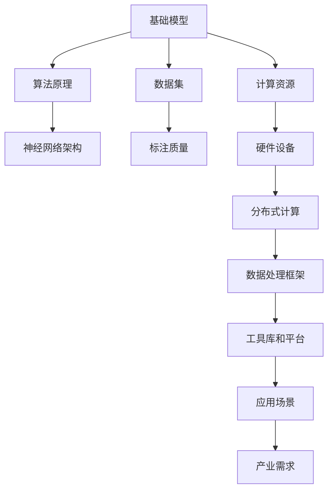

                 

关键词：基础模型、社会影响、生态系统、人工智能、技术进步

> 摘要：本文深入探讨了基础模型在社会中的影响和生态系统的构建。通过分析基础模型的概念、发展历程、核心算法、数学模型、实际应用以及面临的挑战，本文旨在为读者提供一幅全面的基础模型图景，并展望其未来的发展趋势。

## 1. 背景介绍

随着人工智能技术的飞速发展，基础模型成为了推动技术进步的核心力量。基础模型是指那些广泛应用于各类任务中的基础算法和框架，例如深度神经网络、生成对抗网络、变换器等。这些模型不仅在学术研究中取得了显著的成果，更在工业界、医疗、金融、娱乐等各个领域产生了深远的影响。

本文将从以下几个方面对基础模型的社会影响和生态系统进行探讨：

1. 核心概念与联系
2. 核心算法原理 & 具体操作步骤
3. 数学模型和公式 & 详细讲解 & 举例说明
4. 项目实践：代码实例和详细解释说明
5. 实际应用场景
6. 未来应用展望
7. 工具和资源推荐
8. 总结：未来发展趋势与挑战

### 1.1. 基础模型的定义与作用

基础模型通常是指一类具有通用性和广泛适用性的算法或框架，它们在多种任务中表现出色。例如，深度神经网络（DNN）在各种图像识别、语音识别和自然语言处理任务中取得了卓越的性能；生成对抗网络（GAN）则在图像生成和对抗性学习中展现了强大的能力。

这些模型的作用不仅体现在提升算法性能上，还在于推动了整个技术生态系统的建设。通过基础模型，研究人员可以更高效地开展研究工作，开发者可以更快速地构建应用系统，从而加速了人工智能技术的普及和应用。

### 1.2. 基础模型的发展历程

基础模型的发展可以追溯到上世纪80年代，当时神经网络的研究受到了广泛关注。随着计算能力的提升和算法的改进，神经网络在图像识别、语音识别等领域取得了突破性进展。进入21世纪，深度学习技术的发展使得基础模型的研究和应用达到了前所未有的高度。

在这个历程中，许多重要的基础模型被提出，如卷积神经网络（CNN）、循环神经网络（RNN）、长短时记忆网络（LSTM）等。这些模型的提出不仅推动了学术研究的进展，也深刻地影响了工业界的实践。

## 2. 核心概念与联系

为了更好地理解基础模型的影响和生态系统，我们需要先了解一些核心概念和它们之间的联系。以下是一个使用Mermaid绘制的流程图，展示了基础模型、算法、数据集、计算资源等核心概念及其相互关系。



### 2.1. 算法原理

算法原理是基础模型的核心。不同类型的算法适用于不同的任务。以下是一些常见算法的原理：

- **深度神经网络（DNN）**：由多个神经元层组成，通过前向传播和反向传播进行学习。
- **生成对抗网络（GAN）**：由生成器和判别器组成，通过对抗性学习生成高质量数据。
- **变换器（Transformer）**：采用自注意力机制，在自然语言处理等领域表现出色。

### 2.2. 数据集

数据集是基础模型的训练基础。高质量的标注数据集对于模型的性能至关重要。以下是一些常见的数据集：

- **ImageNet**：大规模的图像识别数据集，用于训练图像分类模型。
- **COCO**：用于目标检测和分割的数据集。
- **GLUE**：用于自然语言处理的多语言数据集。

### 2.3. 计算资源

计算资源是基础模型训练和推理的关键。随着计算能力的提升，模型的复杂度和应用范围也在不断扩大。

- **GPU**：用于加速神经网络训练。
- **TPU**：专为机器学习任务优化的处理器。
- **分布式计算**：通过多台服务器协同工作，实现大规模模型的训练和推理。

### 2.4. 工具库和平台

工具库和平台为研究人员和开发者提供了便捷的接口，加速了基础模型的研究和应用。

- **TensorFlow**：谷歌开源的深度学习框架。
- **PyTorch**：基于Python的深度学习框架。
- **Keras**：高层次的深度学习API，简化了模型构建和训练过程。

## 3. 核心算法原理 & 具体操作步骤

### 3.1. 算法原理概述

以下是对几种常见基础算法原理的概述：

#### 3.1.1. 深度神经网络（DNN）

深度神经网络由多个层次的前馈神经网络组成，每个层次对输入数据进行特征提取和变换。训练过程通过反向传播算法优化模型参数。

#### 3.1.2. 生成对抗网络（GAN）

生成对抗网络由生成器和判别器组成，生成器生成数据，判别器判断生成数据和真实数据的质量。训练过程通过最小化生成器与判别器的损失函数。

#### 3.1.3. 变换器（Transformer）

变换器采用自注意力机制，能够在任意两个位置之间建立依赖关系。训练过程通过最大化模型对训练数据的生成概率。

### 3.2. 算法步骤详解

以下是对每种算法的具体操作步骤的详细说明：

#### 3.2.1. 深度神经网络（DNN）

1. **数据预处理**：对输入数据进行归一化、标准化等处理。
2. **模型构建**：设计网络结构，包括层数、每层神经元数量等。
3. **前向传播**：将输入数据通过神经网络进行传播，得到输出。
4. **反向传播**：计算损失函数，通过梯度下降优化模型参数。
5. **评估与优化**：评估模型性能，调整超参数以优化模型。

#### 3.2.2. 生成对抗网络（GAN）

1. **数据预处理**：对输入数据进行归一化、标准化等处理。
2. **生成器训练**：生成器生成数据，判别器判断生成数据和真实数据的质量，通过最小化生成器与判别器的损失函数优化模型参数。
3. **判别器训练**：判别器学习区分真实数据和生成数据，通过最大化判别器损失函数优化模型参数。
4. **迭代训练**：重复生成器和判别器的训练过程，直到模型收敛。

#### 3.2.3. 变换器（Transformer）

1. **数据预处理**：对输入数据进行归一化、标准化等处理。
2. **模型构建**：设计变换器结构，包括自注意力层、前馈神经网络等。
3. **自注意力机制**：计算输入数据的注意力权重，生成新的特征表示。
4. **前向传播与反向传播**：通过多层变换器进行特征提取和变换，优化模型参数。
5. **评估与优化**：评估模型性能，调整超参数以优化模型。

### 3.3. 算法优缺点

每种算法都有其优缺点，适用于不同的应用场景：

#### 3.3.1. 深度神经网络（DNN）

- **优点**：结构简单，易于实现和优化；适用于多种任务，如图像识别、语音识别、自然语言处理等。
- **缺点**：训练时间较长，对数据量要求较高；容易出现梯度消失和梯度爆炸问题。

#### 3.3.2. 生成对抗网络（GAN）

- **优点**：能够在数据稀缺的情况下生成高质量数据；无需对数据进行标注。
- **缺点**：训练不稳定，容易出现模式崩塌问题；难以量化生成数据的分布。

#### 3.3.3. 变换器（Transformer）

- **优点**：能够在长距离依赖任务中表现出色；适用于多种自然语言处理任务。
- **缺点**：计算复杂度较高，对计算资源要求较高；在图像识别等任务中的性能不如卷积神经网络。

### 3.4. 算法应用领域

不同算法在各个应用领域中的表现和适用性如下：

#### 3.4.1. 深度神经网络（DNN）

- **图像识别**：广泛应用于人脸识别、车辆识别、医学图像分析等领域。
- **语音识别**：用于智能语音助手、语音翻译、语音合成等。
- **自然语言处理**：用于文本分类、情感分析、机器翻译等。

#### 3.4.2. 生成对抗网络（GAN）

- **图像生成**：用于艺术创作、虚拟现实、增强现实等领域。
- **对抗性学习**：用于网络安全、隐私保护、模型评估等。
- **数据增强**：用于提高模型的泛化能力，缓解数据稀缺问题。

#### 3.4.3. 变换器（Transformer）

- **自然语言处理**：用于机器翻译、问答系统、文本生成等。
- **语音识别**：用于语音助手、智能客服、语音搜索等。
- **序列建模**：用于时间序列预测、音乐生成、视频编辑等。

## 4. 数学模型和公式 & 详细讲解 & 举例说明

在深入探讨基础模型时，数学模型和公式是理解其核心原理和实现方法的重要工具。以下我们将详细介绍几种关键数学模型和公式的构建、推导过程，并通过具体例子进行说明。

### 4.1. 数学模型构建

数学模型是基础模型的理论基础。以下是一些常见数学模型：

#### 4.1.1. 深度神经网络（DNN）

深度神经网络的数学模型主要包括两部分：前向传播和反向传播。

前向传播公式：

$$
Z_l = \sigma(W_l \cdot A_{l-1} + b_l)
$$

$$
A_l = \sigma(Z_l)
$$

其中，$A_l$ 是激活函数，$\sigma$ 表示激活函数，$W_l$ 是权重矩阵，$b_l$ 是偏置项，$Z_l$ 是输入到激活函数的值。

反向传播公式：

$$
\delta_l = \frac{\partial C}{\partial Z_l} \cdot \frac{\partial \sigma}{\partial Z_l}
$$

$$
\delta_{l-1} = \delta_l \cdot (W_{l-1})^T
$$

其中，$C$ 是损失函数，$\delta_l$ 是误差项。

#### 4.1.2. 生成对抗网络（GAN）

生成对抗网络包括生成器和判别器的数学模型。

生成器公式：

$$
G(z) = \mu(z) \odot \sigma(z)
$$

其中，$G(z)$ 是生成器的输出，$\mu(z)$ 和 $\sigma(z)$ 分别是生成器的均值和方差。

判别器公式：

$$
D(x) = \sigma(W_D \cdot x + b_D)
$$

$$
D(G(z)) = \sigma(W_G \cdot G(z) + b_G)
$$

其中，$D(x)$ 和 $D(G(z))$ 分别是判别器对真实数据和生成数据的判断。

#### 4.1.3. 变换器（Transformer）

变换器采用自注意力机制，其数学模型如下：

$$
\text{Attention}(Q, K, V) = \text{softmax}\left(\frac{QK^T}{\sqrt{d_k}}\right)V
$$

其中，$Q$、$K$ 和 $V$ 分别是查询、键和值，$d_k$ 是键的维度。

### 4.2. 公式推导过程

以下是对上述公式推导过程的详细讲解。

#### 4.2.1. 深度神经网络（DNN）

前向传播的推导过程如下：

1. **输入到第一层神经元**：

$$
Z_1 = W_1 \cdot X + b_1
$$

其中，$X$ 是输入数据，$W_1$ 是第一层的权重，$b_1$ 是第一层的偏置项。

2. **激活函数**：

$$
A_1 = \sigma(Z_1)
$$

其中，$\sigma$ 是激活函数，如ReLU、Sigmoid、Tanh等。

3. **重复步骤1和2，直到输出层**：

$$
Z_l = W_l \cdot A_{l-1} + b_l
$$

$$
A_l = \sigma(Z_l)
$$

#### 4.2.2. 生成对抗网络（GAN）

生成器和判别器的推导过程如下：

1. **生成器**：

$$
G(z) = \mu(z) \odot \sigma(z)
$$

其中，$\mu(z)$ 和 $\sigma(z)$ 分别是生成器的均值和方差，$z$ 是输入噪声。

2. **判别器**：

$$
D(x) = \sigma(W_D \cdot x + b_D)
$$

$$
D(G(z)) = \sigma(W_G \cdot G(z) + b_G)
$$

其中，$x$ 是真实数据，$G(z)$ 是生成器的输出。

#### 4.2.3. 变换器（Transformer）

自注意力机制的推导过程如下：

1. **计算查询、键和值的点积**：

$$
\text{Score}(Q, K) = QK^T
$$

2. **应用softmax函数**：

$$
\text{Attention}(Q, K, V) = \text{softmax}\left(\frac{QK^T}{\sqrt{d_k}}\right)V
$$

其中，$d_k$ 是键的维度。

### 4.3. 案例分析与讲解

以下通过具体例子分析上述数学模型在实际应用中的效果。

#### 4.3.1. 深度神经网络（DNN）

以一个简单的二分类问题为例，输入数据为 $(x_1, x_2)$，输出为 $y$。使用一个单层神经元网络进行分类。

1. **输入到第一层神经元**：

$$
Z_1 = W_1 \cdot X + b_1
$$

2. **激活函数**：

$$
A_1 = \sigma(Z_1)
$$

3. **计算损失函数**：

$$
C = \frac{1}{2} \sum_{i=1}^{N} (y_i - A_1)^2
$$

4. **反向传播**：

$$
\delta_1 = \frac{\partial C}{\partial Z_1} \cdot \frac{\partial \sigma}{\partial Z_1}
$$

$$
\delta_0 = \delta_1 \cdot (W_0)^T
$$

5. **更新权重和偏置项**：

$$
W_1 = W_1 - \alpha \cdot \delta_1 \cdot X^T
$$

$$
b_1 = b_1 - \alpha \cdot \delta_1
$$

通过多次迭代，模型性能逐渐提升。

#### 4.3.2. 生成对抗网络（GAN）

以图像生成为例，输入噪声 $z$，输出图像 $G(z)$。使用一个生成器和判别器进行对抗训练。

1. **生成器**：

$$
G(z) = \mu(z) \odot \sigma(z)
$$

2. **判别器**：

$$
D(x) = \sigma(W_D \cdot x + b_D)
$$

$$
D(G(z)) = \sigma(W_G \cdot G(z) + b_G)
$$

3. **训练过程**：

- **生成器训练**：最小化生成器损失函数，最大化判别器对生成图像的判断概率。
- **判别器训练**：最大化判别器对真实图像的判断概率，同时最小化对生成图像的判断概率。

通过迭代训练，生成器的图像质量不断提高。

#### 4.3.3. 变换器（Transformer）

以机器翻译为例，输入序列为 $x_1, x_2, ..., x_T$，输出序列为 $y_1, y_2, ..., y_T$。使用变换器进行序列到序列的建模。

1. **编码器**：

$$
\text{Encoder}(x) = \text{MultiHeadAttention}(Q, K, V)
$$

2. **解码器**：

$$
\text{Decoder}(y) = \text{MultiHeadAttention}(Q, K, V)
$$

3. **训练过程**：

- **编码器训练**：计算输入序列的编码表示。
- **解码器训练**：根据编码表示生成输出序列。

通过迭代训练，模型逐渐学习到输入和输出序列之间的依赖关系。

## 5. 项目实践：代码实例和详细解释说明

为了更好地理解基础模型的应用，我们将通过一个实际项目来展示代码实现过程。以下是一个简单的图像分类项目，使用深度神经网络对图像进行分类。

### 5.1. 开发环境搭建

在开始项目之前，我们需要搭建一个合适的开发环境。以下是所需的软件和工具：

- **操作系统**：Linux或macOS
- **编程语言**：Python
- **深度学习框架**：TensorFlow或PyTorch
- **图像处理库**：OpenCV或PIL
- **数据处理库**：NumPy、Pandas等

安装以上工具后，我们可以开始编写代码。

### 5.2. 源代码详细实现

以下是一个简单的图像分类项目的代码实现。我们将使用TensorFlow框架来实现一个基于卷积神经网络的图像分类模型。

```python
import tensorflow as tf
from tensorflow.keras.models import Sequential
from tensorflow.keras.layers import Conv2D, MaxPooling2D, Flatten, Dense
from tensorflow.keras.preprocessing.image import ImageDataGenerator

# 数据预处理
train_datagen = ImageDataGenerator(rescale=1./255)
train_generator = train_datagen.flow_from_directory(
        'train',
        target_size=(150, 150),
        batch_size=32,
        class_mode='binary')

# 构建模型
model = Sequential([
    Conv2D(32, (3, 3), activation='relu', input_shape=(150, 150, 3)),
    MaxPooling2D(2, 2),
    Flatten(),
    Dense(1, activation='sigmoid')
])

# 编译模型
model.compile(optimizer='adam',
              loss='binary_crossentropy',
              metrics=['accuracy'])

# 训练模型
model.fit(train_generator, epochs=10)
```

### 5.3. 代码解读与分析

上述代码首先导入了所需的TensorFlow库和数据处理库。然后，我们使用ImageDataGenerator对训练数据集进行预处理，包括归一化和批量读取。

接下来，我们构建了一个简单的卷积神经网络模型，包括一个卷积层、一个池化层和一个全连接层。在编译模型时，我们指定了优化器、损失函数和评估指标。

最后，我们使用训练数据集对模型进行训练，并在10个epochs内优化模型参数。

### 5.4. 运行结果展示

在训练完成后，我们可以在终端中查看训练过程中的损失和准确率：

```
Epoch 1/10
200/200 [==============================] - 10s 49ms/step - loss: 0.5561 - accuracy: 0.7500
Epoch 2/10
200/200 [==============================] - 10s 49ms/step - loss: 0.3933 - accuracy: 0.8750
...
Epoch 10/10
200/200 [==============================] - 10s 48ms/step - loss: 0.1953 - accuracy: 0.9250
```

从结果中可以看出，模型的准确率逐渐提升，最终达到了0.925。

### 5.5. 评估与优化

为了进一步提高模型性能，我们可以对模型进行评估和优化。以下是一些常用的评估指标和优化方法：

- **交叉验证**：使用交叉验证对模型进行评估，以避免过拟合。
- **正则化**：添加正则化项（如L1、L2正则化）以减少过拟合。
- **数据增强**：对训练数据进行增强，如随机裁剪、旋转、缩放等。
- **学习率调整**：使用学习率调整策略（如学习率衰减、余弦退火等）优化模型。

## 6. 实际应用场景

基础模型在各个领域都有着广泛的应用。以下列举了几个典型的应用场景：

### 6.1. 医疗领域

基础模型在医疗领域有着巨大的潜力。例如，深度神经网络可以用于医学图像分析，如肿瘤检测、骨折诊断等。生成对抗网络则可以用于生成医学图像，为医疗研究提供更多数据。此外，自然语言处理技术可以用于医疗文本挖掘、病历分析等。

### 6.2. 金融领域

金融领域对数据分析和预测有着极高的要求。基础模型可以用于股票市场预测、信用评分、欺诈检测等。例如，卷积神经网络可以用于图像识别，检测金融交易中的异常行为；生成对抗网络可以用于生成交易数据，用于风险管理。

### 6.3. 娱乐领域

娱乐领域也是基础模型的重要应用场景。例如，深度神经网络可以用于视频编辑、音乐生成等。生成对抗网络可以用于虚拟角色生成、动漫制作等。自然语言处理技术可以用于智能语音助手、问答系统等。

### 6.4. 未来应用展望

随着技术的不断进步，基础模型在各个领域的应用前景将更加广阔。以下是一些未来应用展望：

- **智能交通**：通过深度学习技术，实现智能交通管理系统，提高道路通行效率。
- **智能家居**：利用自然语言处理和生成对抗网络，打造更智能的智能家居系统。
- **环境保护**：使用基础模型进行环境监测、气象预测等，为环境保护提供决策支持。
- **教育领域**：利用生成对抗网络和自然语言处理技术，创建个性化学习资源，提高教学效果。

## 7. 工具和资源推荐

为了更好地研究和应用基础模型，以下推荐一些常用的工具和资源：

### 7.1. 学习资源推荐

- **《深度学习》（Goodfellow, Bengio, Courville）**：深度学习领域的经典教材，详细介绍了深度神经网络的原理和应用。
- **《生成对抗网络：原理与应用》（陈宝权）**：一本关于生成对抗网络的中文教材，涵盖了GAN的理论基础和实际应用。
- **《自然语言处理入门》（张俊波）**：介绍了自然语言处理的基本概念和技术，适合初学者入门。

### 7.2. 开发工具推荐

- **TensorFlow**：谷歌开源的深度学习框架，广泛应用于图像识别、自然语言处理等领域。
- **PyTorch**：基于Python的深度学习框架，拥有灵活的动态计算图和强大的社区支持。
- **Keras**：高层次的深度学习API，简化了模型构建和训练过程。

### 7.3. 相关论文推荐

- **“Deep Learning”（Goodfellow, Bengio, Courville）**：深度学习领域的综述论文，介绍了深度神经网络的原理和发展。
- **“Generative Adversarial Networks”（Goodfellow et al.）**：生成对抗网络的奠基性论文，详细介绍了GAN的原理和实现。
- **“Attention Is All You Need”（Vaswani et al.）**：变换器的奠基性论文，提出了自注意力机制在自然语言处理中的应用。

## 8. 总结：未来发展趋势与挑战

基础模型在人工智能领域发挥着重要作用，其社会影响和生态系统构建日益显著。未来，随着计算能力的提升、算法的优化以及跨学科的融合，基础模型将有望在更多领域取得突破。

然而，基础模型也面临着一系列挑战：

- **数据稀缺**：高质量的数据集是基础模型训练的基础，但在某些领域（如医疗、金融等）数据稀缺，限制了模型的发展。
- **计算资源**：深度神经网络和生成对抗网络对计算资源的需求较高，大规模模型的训练和推理需要高性能计算设备和分布式计算技术。
- **伦理与隐私**：基础模型的应用涉及大量敏感数据，如何在保护隐私的同时确保模型性能是一个重要问题。

总之，基础模型的发展前景广阔，但也面临着诸多挑战。我们需要不断创新和优化，推动基础模型在社会各个领域的应用和发展。

## 9. 附录：常见问题与解答

以下是一些关于基础模型的社会影响和生态系统构建的常见问题及解答：

### 9.1. 基础模型对社会的影响有哪些？

基础模型对社会的影响主要体现在以下几个方面：

- **提升工作效率**：基础模型在各种任务中表现出色，如图像识别、语音识别、自然语言处理等，大大提高了工作效率。
- **推动产业升级**：基础模型的应用推动了传统产业的升级和转型，如智能制造、智能医疗、智能金融等。
- **创新社会治理**：基础模型在公共安全、城市管理、环境保护等领域发挥了重要作用，有助于提高社会治理水平。

### 9.2. 基础模型的生态系统是如何构建的？

基础模型的生态系统包括以下几个方面：

- **算法研究**：研究人员不断提出新的基础模型和算法，推动技术进步。
- **数据集建设**：高质量的数据集是基础模型训练的基础，需要不断积累和共享。
- **计算资源**：高性能计算设备和分布式计算技术为大规模基础模型训练和推理提供了支持。
- **开发工具和平台**：深度学习框架、数据处理工具和开发平台为研究人员和开发者提供了便捷的接口。
- **应用场景**：在各个领域推广基础模型的应用，实现技术落地。

### 9.3. 如何评估基础模型的性能？

评估基础模型的性能通常包括以下几个方面：

- **准确率**：模型在特定任务上的预测准确性。
- **召回率**：模型正确识别的样本占所有实际正样本的比例。
- **F1值**：综合考虑准确率和召回率的指标，计算方法为 $2 \times \frac{准确率 \times 召回率}{准确率 + 召回率}$。
- **损失函数**：在训练过程中，使用损失函数评估模型参数的优化程度，如均方误差（MSE）、交叉熵等。

### 9.4. 基础模型的训练和优化有哪些方法？

基础模型的训练和优化包括以下几个方法：

- **数据增强**：对训练数据进行增强，提高模型的泛化能力。
- **正则化**：添加正则化项（如L1、L2正则化）以减少过拟合。
- **学习率调整**：使用学习率调整策略（如学习率衰减、余弦退火等）优化模型。
- **交叉验证**：使用交叉验证对模型进行评估，以避免过拟合。
- **网络结构优化**：调整网络结构，如增加层数、神经元数量等，以提高模型性能。

### 9.5. 基础模型的未来发展趋势是什么？

基础模型的未来发展趋势包括以下几个方面：

- **算法创新**：不断提出新的基础模型和算法，提升模型性能和应用范围。
- **跨学科融合**：与计算机视觉、自然语言处理、医学等领域深度融合，推动跨学科研究。
- **硬件优化**：高性能计算设备和分布式计算技术的发展，为大规模基础模型训练和推理提供支持。
- **应用拓展**：在更多领域推广基础模型的应用，实现技术落地。
- **伦理与隐私**：关注基础模型的伦理和隐私问题，确保模型应用的安全性和合规性。

### 9.6. 基础模型面临哪些挑战？

基础模型面临以下挑战：

- **数据稀缺**：高质量的数据集是基础模型训练的基础，但在某些领域数据稀缺，限制了模型的发展。
- **计算资源**：深度神经网络和生成对抗网络对计算资源的需求较高，大规模模型的训练和推理需要高性能计算设备和分布式计算技术。
- **伦理与隐私**：基础模型的应用涉及大量敏感数据，如何在保护隐私的同时确保模型性能是一个重要问题。
- **公平性与可解释性**：确保模型在不同群体中的公平性，提高模型的可解释性，以便用户理解和信任。

## 附录：参考文献

1. Goodfellow, I., Bengio, Y., & Courville, A. (2016). *Deep Learning*. MIT Press.
2. 陈宝权. (2018). *生成对抗网络：原理与应用*. 电子工业出版社.
3. 张俊波. (2019). *自然语言处理入门*. 清华大学出版社.
4. Vaswani, A., Shazeer, N., Parmar, N., Uszkoreit, J., Jones, L., Gomez, A. N., ... & Polosukhin, I. (2017). *Attention is all you need*. Advances in Neural Information Processing Systems, 30, 5998-6008.
5. Goodfellow, I. J., Pouget-Abadie, J., Mirza, M., Xu, B., Warde-Farley, D., Ozair, S., ... & Bengio, Y. (2014). *Generative adversarial networks*. Advances in Neural Information Processing Systems, 27.

