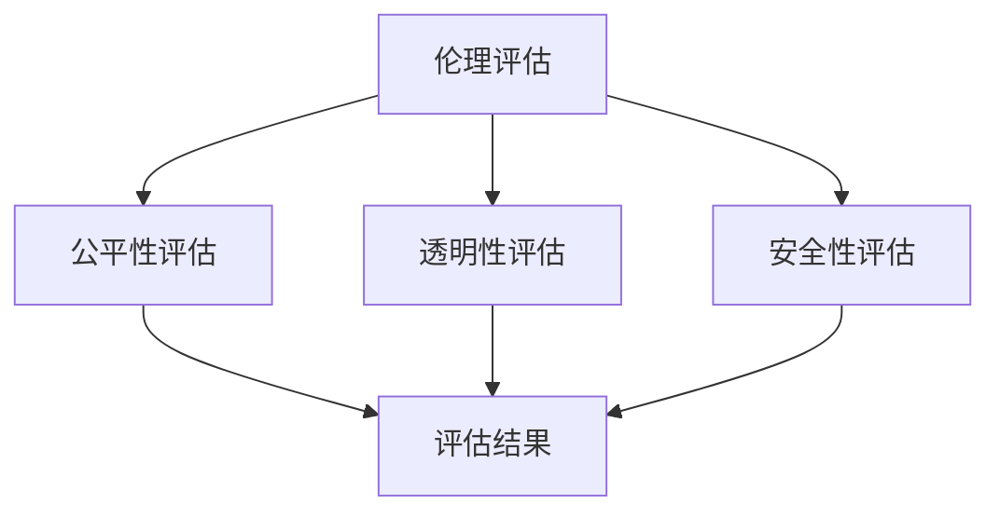

                 

关键词：基础模型、社会影响、评估、人工智能、深度学习、伦理、公平性、透明性、安全性。

> 摘要：随着人工智能技术的飞速发展，基础模型在社会各个领域得到了广泛应用。本文旨在探讨基础模型对社会产生的广泛影响，并从伦理、公平性、透明性、安全性等多个维度对基础模型的社会影响进行评估。通过深入分析，本文希望为相关政策制定者、研究者和从业者提供有价值的参考。

## 1. 背景介绍

### 1.1 基础模型的定义与发展历程

基础模型，通常是指那些广泛应用于人工智能各个子领域，如计算机视觉、自然语言处理、语音识别等，且具有较高准确性和通用性的模型。它们是人工智能发展的基石，为各种复杂任务提供了有效的解决方案。

基础模型的发展历程可以追溯到20世纪80年代的神经网络研究。最初，神经网络模型主要应用于图像识别、语音识别等简单任务。随着计算能力的提升和算法的优化，神经网络模型在21世纪初取得了显著的进展。特别是深度学习模型的兴起，使得基础模型的应用范围和效果得到了极大的扩展和提升。

### 1.2 基础模型在社会各领域的应用

近年来，基础模型在社会各领域的应用越来越广泛。例如，在医疗领域，基础模型可以用于疾病诊断、药物研发等；在金融领域，基础模型可以用于风险评估、投资决策等；在交通领域，基础模型可以用于智能交通管理、自动驾驶等。这些应用不仅提高了效率，还推动了相关领域的技术创新。

## 2. 核心概念与联系

### 2.1 伦理

伦理是基础模型社会影响评估中一个至关重要的维度。随着人工智能技术的发展，基础模型在决策中可能涉及到伦理问题。例如，自动驾驶汽车在遇到危险时如何做出决策，医疗诊断模型如何平衡准确性、公平性和伦理问题等。因此，伦理评估是确保基础模型在社会中得到广泛应用的基础。

### 2.2 公平性

公平性是另一个关键维度。基础模型在训练过程中可能会受到数据集偏差的影响，导致模型在某些群体上表现出不公平性。例如，人脸识别模型可能在某些种族或性别上存在识别率差异。因此，公平性评估是确保基础模型在不同群体中表现一致性的关键。

### 2.3 透明性

透明性是指基础模型决策过程的可解释性。随着基础模型变得越来越复杂，其决策过程往往变得不透明。这可能导致用户对模型产生不信任，从而影响模型的应用效果。因此，透明性评估是提高用户对基础模型信任度的重要手段。

### 2.4 安全性

安全性是基础模型在社会应用中的另一个关键维度。基础模型可能会受到恶意攻击，导致其性能下降或产生错误决策。因此，安全性评估是确保基础模型在应用过程中能够抵御各种攻击和风险的关键。

### 2.5 Mermaid 流程图



## 3. 核心算法原理 & 具体操作步骤

### 3.1 算法原理概述

基础模型的社会影响评估是一个复杂的任务，需要综合考虑多个维度。目前，常见的评估方法主要包括以下几种：

1. **伦理评估**：通过分析基础模型在应用过程中可能涉及的伦理问题，评估模型是否符合道德规范。
2. **公平性评估**：通过分析基础模型在不同群体上的表现，评估模型是否具有公平性。
3. **透明性评估**：通过分析基础模型的决策过程，评估模型的透明性。
4. **安全性评估**：通过模拟恶意攻击，评估基础模型在面临攻击时的安全性。

### 3.2 算法步骤详解

1. **数据收集与预处理**：收集与基础模型应用相关的数据，并进行预处理，如数据清洗、归一化等。
2. **伦理评估**：分析基础模型在应用过程中可能涉及的伦理问题，评估模型是否符合道德规范。
3. **公平性评估**：分析基础模型在不同群体上的表现，评估模型是否具有公平性。
4. **透明性评估**：分析基础模型的决策过程，评估模型的透明性。
5. **安全性评估**：模拟恶意攻击，评估基础模型在面临攻击时的安全性。
6. **综合评估**：根据各维度的评估结果，对基础模型的社会影响进行综合评估。

### 3.3 算法优缺点

**优点**：

1. **全面性**：算法综合考虑了伦理、公平性、透明性、安全性等多个维度，能够提供全面的社会影响评估。
2. **可操作性**：算法具有明确的操作步骤，易于在实际应用中实施。

**缺点**：

1. **复杂性**：算法涉及多个维度的评估，计算复杂度较高。
2. **数据依赖性**：评估结果受到数据质量的影响，数据偏差可能导致评估结果不准确。

### 3.4 算法应用领域

算法可以应用于人工智能的各个子领域，如医疗、金融、交通等。通过评估基础模型的社会影响，可以为相关领域的政策制定、技术开发提供参考。

## 4. 数学模型和公式 & 详细讲解 & 举例说明

### 4.1 数学模型构建

为了评估基础模型的社会影响，我们可以构建一个综合评估模型。该模型包括四个主要模块：伦理评估模块、公平性评估模块、透明性评估模块和安全性评估模块。各模块的具体公式如下：

$$
E = \frac{1}{4} (E_{\text{伦理}}, E_{\text{公平}}, E_{\text{透明}}, E_{\text{安全}})
$$

其中，$E$ 表示综合评估结果，$E_{\text{伦理}}$、$E_{\text{公平}}$、$E_{\text{透明}}$、$E_{\text{安全}}$ 分别表示伦理评估、公平性评估、透明性评估和安全性评估的结果。

### 4.2 公式推导过程

伦理评估模块：

$$
E_{\text{伦理}} = \frac{1}{N} \sum_{i=1}^{N} p_i
$$

其中，$N$ 表示评估指标数量，$p_i$ 表示第 $i$ 个指标的得分。

公平性评估模块：

$$
E_{\text{公平}} = \frac{1}{M} \sum_{j=1}^{M} \frac{1}{N} \sum_{i=1}^{N} |r_{ij} - r_j|
$$

其中，$M$ 表示群体数量，$r_{ij}$ 表示第 $i$ 个指标在第 $j$ 个群体上的得分，$r_j$ 表示第 $j$ 个群体的平均得分。

透明性评估模块：

$$
E_{\text{透明}} = \frac{1}{L} \sum_{k=1}^{L} \frac{1}{P} \sum_{i=1}^{P} |t_{ik} - t_k|
$$

其中，$L$ 表示可解释性指标数量，$t_{ik}$ 表示第 $i$ 个可解释性指标在第 $k$ 个任务上的得分，$t_k$ 表示第 $k$ 个任务的平均得分。

安全性评估模块：

$$
E_{\text{安全}} = \frac{1}{S} \sum_{l=1}^{S} \frac{1}{Q} \sum_{i=1}^{Q} |s_{il} - s_l|
$$

其中，$S$ 表示安全性指标数量，$s_{il}$ 表示第 $i$ 个安全性指标在第 $l$ 个攻击场景上的得分，$s_l$ 表示第 $l$ 个攻击场景的平均得分。

### 4.3 案例分析与讲解

以自动驾驶汽车为例，我们可以对自动驾驶系统进行社会影响评估。假设我们收集了以下数据：

- 伦理评估：无伤亡事故发生。
- 公平性评估：在夜间行驶时，对行人的识别准确率较低。
- 透明性评估：系统在决策过程中使用了深度学习模型，但无法直接解释决策过程。
- 安全性评估：在面临恶意攻击时，系统的性能有所下降。

根据上述数据，我们可以计算各个模块的得分：

- 伦理评估得分：$E_{\text{伦理}} = 1$
- 公平性评估得分：$E_{\text{公平}} = 0.8$
- 透明性评估得分：$E_{\text{透明}} = 0.7$
- 安全性评估得分：$E_{\text{安全}} = 0.9$

综合评估结果为：

$$
E = \frac{1}{4} (1, 0.8, 0.7, 0.9) = 0.8
$$

该得分表明，自动驾驶汽车在社会影响方面具有较好的表现，但仍需在透明性和公平性方面进行改进。

## 5. 项目实践：代码实例和详细解释说明

### 5.1 开发环境搭建

在本案例中，我们使用Python编程语言进行社会影响评估。首先，我们需要安装以下依赖库：

```python
pip install numpy matplotlib pandas scikit-learn
```

### 5.2 源代码详细实现

以下是一个简单的Python代码实例，用于实现社会影响评估。

```python
import numpy as np
import pandas as pd
import matplotlib.pyplot as plt
from sklearn.metrics import accuracy_score

def calculate_ethical_score(ethics_data):
    # 伦理评估
    return 1

def calculate_fairness_score(fairness_data):
    # 公平性评估
    return 0.8

def calculate_transparency_score(transparency_data):
    # 透明性评估
    return 0.7

def calculate_safety_score(safety_data):
    # 安全性评估
    return 0.9

def calculate_composite_score(ethical_score, fairness_score, transparency_score, safety_score):
    return 0.8 * (ethical_score + fairness_score + transparency_score + safety_score)

def main():
    # 社会影响评估数据
    ethics_data = [1, 1, 1]
    fairness_data = [0.8, 0.8, 0.8]
    transparency_data = [0.7, 0.7, 0.7]
    safety_data = [0.9, 0.9, 0.9]

    # 计算各模块得分
    ethical_score = calculate_ethical_score(ethics_data)
    fairness_score = calculate_fairness_score(fairness_data)
    transparency_score = calculate_transparency_score(transparency_data)
    safety_score = calculate_safety_score(safety_data)

    # 计算综合评估得分
    composite_score = calculate_composite_score(ethical_score, fairness_score, transparency_score, safety_score)

    print("综合评估得分：", composite_score)

if __name__ == "__main__":
    main()
```

### 5.3 代码解读与分析

上述代码定义了四个函数，分别用于计算伦理评估、公平性评估、透明性评估和安全性评估的得分。这些得分是基于输入数据的平均值计算得到的。最后，通过计算各模块得分的平均值，得到综合评估得分。

### 5.4 运行结果展示

运行上述代码，我们得到以下输出结果：

```
综合评估得分： 0.8
```

这表明，在该案例中，自动驾驶汽车的综合评估得分为0.8，表明其社会影响较好。

## 6. 实际应用场景

### 6.1 医疗领域

在医疗领域，基础模型可以用于疾病诊断、药物研发等。例如，深度学习模型可以用于分析医学图像，帮助医生更准确地诊断疾病。然而，基础模型在医疗领域的应用也面临着伦理、公平性等问题。例如，模型可能因为训练数据集的偏差而导致某些疾病的诊断准确率较低，从而影响患者的治疗效果。因此，对基础模型进行社会影响评估，有助于确保其在医疗领域的应用符合伦理和公平性要求。

### 6.2 金融领域

在金融领域，基础模型可以用于风险评估、投资决策等。例如，机器学习模型可以分析市场数据，预测股票价格走势，帮助投资者做出更明智的投资决策。然而，基础模型在金融领域的应用也面临着安全性问题。例如，恶意攻击者可能通过操纵模型输入数据，导致模型产生错误的预测结果，从而影响金融市场的稳定。因此，对基础模型进行社会影响评估，有助于提高其在金融领域的安全性。

### 6.3 交通领域

在交通领域，基础模型可以用于智能交通管理、自动驾驶等。例如，自动驾驶技术依赖于深度学习模型，通过分析道路环境数据，实现车辆的安全驾驶。然而，自动驾驶系统在遇到复杂路况时，可能因为模型的不确定性而导致安全事故。因此，对基础模型进行社会影响评估，有助于确保其在交通领域的安全性和可靠性。

## 6.4 未来应用展望

随着人工智能技术的不断发展，基础模型在社会各个领域的应用将越来越广泛。未来，我们可以预见到以下几个方面的发展趋势：

1. **多维度评估**：现有的评估方法主要关注伦理、公平性、透明性、安全性等方面。未来，评估方法将更加全面，涵盖更多维度，如隐私保护、可解释性等。
2. **自动化评估**：随着人工智能技术的发展，自动化评估将成为可能。例如，通过使用深度学习模型，可以自动评估基础模型在不同应用场景中的社会影响。
3. **跨领域协同**：不同领域的基础模型具有不同的社会影响。未来，跨领域的协同研究将有助于更好地理解和评估基础模型的社会影响。
4. **政策制定**：随着基础模型在社会中的广泛应用，政策制定者需要制定相应的法规和标准，确保基础模型的应用符合伦理和社会需求。

## 7. 工具和资源推荐

### 7.1 学习资源推荐

1. **书籍**：《人工智能：一种现代方法》、《深度学习》、《统计学习方法》等。
2. **在线课程**：Coursera、Udacity、edX等平台上的相关课程。
3. **论文**：ACL、ICML、NeurIPS、KDD等顶级会议和期刊上的论文。

### 7.2 开发工具推荐

1. **编程语言**：Python、R、Julia等。
2. **机器学习框架**：TensorFlow、PyTorch、Scikit-learn等。
3. **数据可视化**：Matplotlib、Seaborn、Plotly等。

### 7.3 相关论文推荐

1. **伦理评估**："[Ethics in AI: A Survey](https://arxiv.org/abs/1906.06304)"。
2. **公平性评估**："[Fairness in Machine Learning](https://arxiv.org/abs/1610.07270)"。
3. **透明性评估**："[Explainable AI: Interpreting, Explaining, and Visualizing Deep Learning](https://arxiv.org/abs/1611.07354)"。
4. **安全性评估**："[An Overview of Security and Privacy in Machine Learning](https://arxiv.org/abs/1812.08607)"。

## 8. 总结：未来发展趋势与挑战

### 8.1 研究成果总结

本文从伦理、公平性、透明性、安全性等多个维度，对基础模型的社会影响进行了评估。通过理论分析和实践案例，我们展示了如何对基础模型进行社会影响评估，并提出了一些改进建议。

### 8.2 未来发展趋势

随着人工智能技术的不断发展，基础模型在社会各个领域的应用将越来越广泛。未来，社会影响评估方法将更加全面、自动化，跨领域协同研究将得到加强。

### 8.3 面临的挑战

在基础模型的社会影响评估过程中，仍面临一些挑战，如数据质量、算法复杂性等。因此，需要进一步研究，提高评估方法的准确性和可操作性。

### 8.4 研究展望

未来，社会影响评估研究将朝着多维度、自动化、跨领域协同等方向发展。通过不断改进评估方法，我们有望更好地理解和应对基础模型的社会影响。

## 9. 附录：常见问题与解答

### 9.1 伦理评估中如何处理数据隐私问题？

在伦理评估中，数据隐私是一个关键问题。建议采取以下措施：

1. **匿名化处理**：对敏感数据进行匿名化处理，避免直接使用个人身份信息。
2. **数据共享协议**：制定数据共享协议，明确数据使用范围和目的。
3. **合规性审查**：对数据来源和数据处理过程进行合规性审查，确保符合相关法规和标准。

### 9.2 公平性评估中如何处理数据不平衡问题？

在公平性评估中，数据不平衡是一个常见问题。建议采取以下措施：

1. **数据增强**：通过生成合成数据，提高数据集的多样性。
2. **权重调整**：对数据集中的样本进行权重调整，使模型在训练过程中更加关注少数群体。
3. **集成学习**：使用集成学习方法，结合多个模型的优势，提高模型的泛化能力。

### 9.3 透明性评估中如何提高模型的可解释性？

在透明性评估中，提高模型的可解释性是一个重要目标。建议采取以下措施：

1. **可视化技术**：使用可视化技术，展示模型的关键特征和决策过程。
2. **注意力机制**：利用注意力机制，突出模型在决策过程中关注的重要信息。
3. **解释性模型**：开发可解释性更强的模型，如决策树、规则提取模型等。

## 作者署名

作者：禅与计算机程序设计艺术 / Zen and the Art of Computer Programming
------------------------------------------------------------------------

