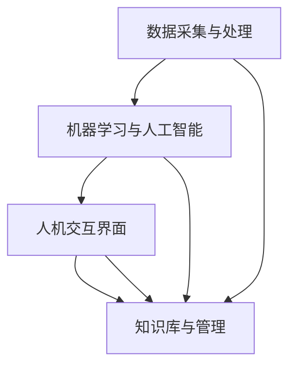

                 

关键词：增强智能，人机协作，认知能力，技术发展，未来展望

> 摘要：本文旨在探讨增强智能在人机协作中的应用，如何通过技术手段提升人类的认知能力，以及这一领域的发展趋势和面临的挑战。文章将详细分析增强智能的核心概念和原理，介绍核心算法及其应用领域，并通过数学模型和实例代码展示如何实现人机协作中的认知提升。

## 1. 背景介绍

随着科技的飞速发展，人工智能（AI）已经成为现代社会的重要组成部分。从自动化生产到智能助手，从推荐系统到自动驾驶，AI 在各个领域展现了其强大的能力。然而，传统的人工智能技术主要依赖于预先设定的规则和数据驱动的方法，往往缺乏灵活性和自主性。在这样的背景下，增强智能（Augmented Intelligence）的概念应运而生。

增强智能，又称增强型人工智能，是一种将人类智慧与机器智能相结合的新兴技术。它不仅模拟人类的认知过程，还能通过不断学习和优化，增强人类的认知能力，实现人机协作的深度融合。增强智能的核心在于人机交互，通过智能算法和先进技术，让机器能够更好地理解、处理和反馈人类的需求，从而在各个领域实现更高效率、更优决策和更丰富的体验。

本文将围绕增强智能这一主题，探讨其在人机协作中的应用，分析其核心概念、算法原理和应用领域，并通过数学模型和实际案例展示其技术实现。文章还将探讨增强智能的未来发展趋势和面临的挑战，为相关领域的研究者和实践者提供有益的参考。

## 2. 核心概念与联系

### 2.1 增强智能的定义

增强智能是一种通过结合人类智慧和机器智能，实现认知能力提升的技术。它不仅仅是为了替代人类，而是为了增强和扩展人类的认知能力，使人类能够更高效、更准确地处理复杂信息。增强智能的核心在于人机交互，通过智能算法和先进技术，让机器能够更好地理解、处理和反馈人类的需求。

### 2.2 增强智能与认知能力的关系

认知能力是指人类获取、处理、存储和使用信息的能力。增强智能通过引入机器智能，可以帮助人类在认知过程中实现以下目标：

1. **信息处理加速**：机器智能可以处理大量的数据，帮助人类快速分析信息，提高决策效率。
2. **知识扩展**：通过机器学习，增强智能可以不断积累和更新知识，扩展人类的知识边界。
3. **错误减少**：机器智能可以减少人类在认知过程中的错误率，提高决策的准确性。
4. **复杂任务自动化**：通过自动化工具，增强智能可以减轻人类在处理复杂任务时的负担，提高工作质量。

### 2.3 增强智能的技术架构

增强智能的技术架构主要包括以下几个关键组成部分：

1. **数据采集与处理**：通过传感器、摄像头等设备采集用户行为和生理数据，对数据进行分析和处理，提取有价值的信息。
2. **机器学习与人工智能**：利用机器学习算法，对数据进行训练和模型构建，实现智能分析和预测。
3. **人机交互界面**：通过自然语言处理、语音识别等技术，构建用户与机器之间的交互界面，实现信息的传递和反馈。
4. **知识库与管理**：构建和管理知识库，存储和共享人类和机器智能的知识和经验。

### 2.4 增强智能的应用场景

增强智能的应用场景非常广泛，以下是一些典型的应用：

1. **医疗健康**：通过增强智能，辅助医生进行诊断和治疗，提高医疗服务的质量和效率。
2. **金融服务**：利用增强智能进行风险管理、投资分析和客户服务，提高金融行业的运营效率。
3. **教育**：通过增强智能，个性化教育内容和教学策略，提高学生的学习效果和兴趣。
4. **智能制造**：在工业生产中，利用增强智能实现自动化控制、故障诊断和优化生产流程。
5. **智能交通**：通过增强智能，优化交通流量管理、车辆调度和交通安全预警，提高交通运行效率。

### 2.5 Mermaid 流程图

以下是一个简单的 Mermaid 流程图，展示了增强智能的技术架构和核心概念之间的联系。



在这个流程图中，A 表示数据采集与处理，B 表示机器学习与人工智能，C 表示人机交互界面，D 表示知识库与管理。这些组件相互协作，共同实现增强智能的目标。

## 3. 核心算法原理 & 具体操作步骤

### 3.1 算法原理概述

增强智能的核心算法主要包括机器学习、深度学习和自然语言处理等技术。这些算法通过不断学习和优化，实现人机协作中的认知能力提升。

1. **机器学习**：机器学习是一种通过数据驱动的方法，使机器能够从数据中学习并做出预测或决策的技术。常见的机器学习算法包括决策树、支持向量机、神经网络等。
2. **深度学习**：深度学习是机器学习的一个分支，通过构建多层神经网络，实现复杂特征的学习和提取。深度学习在图像识别、语音识别、自然语言处理等领域取得了显著成果。
3. **自然语言处理**：自然语言处理是一种使计算机理解和生成自然语言的技术。常见的自然语言处理任务包括文本分类、情感分析、机器翻译等。

### 3.2 算法步骤详解

1. **数据预处理**：首先，对采集到的数据进行清洗、去噪和特征提取，为后续的算法训练和模型构建做好准备。
2. **模型选择与训练**：根据应用场景和数据特点，选择合适的机器学习、深度学习或自然语言处理算法，进行模型训练和参数调优。
3. **模型评估与优化**：通过交叉验证、网格搜索等方法，对训练好的模型进行评估和优化，确保模型的性能和稳定性。
4. **人机交互**：通过自然语言处理、语音识别等技术，构建用户与机器之间的交互界面，实现信息的传递和反馈。
5. **知识库构建与管理**：将模型训练和优化过程中的经验和知识存储在知识库中，实现知识的积累和共享。

### 3.3 算法优缺点

**优点：**

1. **高效性**：通过机器学习和深度学习等技术，增强智能可以快速处理和分析大量数据，提高工作效率。
2. **准确性**：机器学习算法和深度学习算法具有很高的准确性和鲁棒性，可以减少人类在认知过程中的错误率。
3. **灵活性**：增强智能可以根据不同的应用场景和数据特点，选择合适的算法和技术，实现定制化的认知能力提升。

**缺点：**

1. **数据依赖性**：增强智能的性能很大程度上取决于数据的质量和数量，数据不足或质量差可能导致模型性能下降。
2. **复杂性**：机器学习和深度学习算法通常比较复杂，对算法设计和实现的要求较高。
3. **隐私和安全**：在增强智能应用过程中，数据的安全和隐私保护是一个重要的挑战，需要采取有效的措施确保数据的安全和隐私。

### 3.4 算法应用领域

增强智能在多个领域都取得了显著的应用成果，以下是一些典型的应用领域：

1. **医疗健康**：利用增强智能进行疾病诊断、治疗方案推荐和健康监测，提高医疗服务的质量和效率。
2. **金融行业**：通过增强智能进行风险管理、投资分析和客户服务，提高金融行业的运营效率。
3. **智能制造**：利用增强智能实现自动化控制、故障诊断和优化生产流程，提高工业生产的效率和质量。
4. **智能交通**：通过增强智能优化交通流量管理、车辆调度和交通安全预警，提高交通运行效率。
5. **教育领域**：利用增强智能进行个性化教学、学习效果分析和学业辅导，提高学生的学习效果和兴趣。

## 4. 数学模型和公式 & 详细讲解 & 举例说明

### 4.1 数学模型构建

在增强智能的应用中，数学模型是核心算法的重要组成部分。以下是一个简单的线性回归模型的构建过程，用于预测和分析人类行为。

**线性回归模型：**

$$y = \beta_0 + \beta_1x_1 + \beta_2x_2 + ... + \beta_nx_n$$

其中，$y$ 是目标变量，$x_1, x_2, ..., x_n$ 是特征变量，$\beta_0, \beta_1, \beta_2, ..., \beta_n$ 是模型参数。

### 4.2 公式推导过程

**假设：**

- 数据集 $D = \{ (x_1, y_1), (x_2, y_2), ..., (x_n, y_n) \}$，其中 $x_i$ 和 $y_i$ 分别是数据点的特征和目标值。
- 模型输出 $y'$ 是通过特征变量 $x$ 和模型参数 $\beta$ 计算得到的。

**目标：**

- 最小化预测误差，即 $L^2$ 范数损失函数：

$$J(\beta) = \frac{1}{2}\sum_{i=1}^{n}(y_i - y')^2$$

- 对模型参数 $\beta$ 进行优化，以最小化损失函数。

**推导过程：**

1. **损失函数求导：**

$$\frac{\partial J(\beta)}{\partial \beta} = -\sum_{i=1}^{n}(y_i - y')x_i$$

2. **梯度下降法优化：**

$$\beta = \beta - \alpha \frac{\partial J(\beta)}{\partial \beta}$$

其中，$\alpha$ 是学习率，用于控制参数更新的步长。

### 4.3 案例分析与讲解

以下是一个简单的线性回归模型案例，用于预测用户对某产品的评分。

**数据集：**

用户ID | 特征1 | 特征2 | 评分
--- | --- | --- | ---
1 | 0.8 | 0.2 | 4
2 | 0.9 | 0.1 | 3
3 | 0.5 | 0.5 | 5
4 | 0.1 | 0.8 | 2

**线性回归模型：**

$$y = \beta_0 + \beta_1x_1 + \beta_2x_2$$

**参数优化过程：**

1. **初始化参数：**

$$\beta_0 = 0, \beta_1 = 0, \beta_2 = 0$$

2. **计算损失函数：**

$$J(\beta) = \frac{1}{2}\sum_{i=1}^{n}(y_i - y')^2$$

$$J(\beta) = \frac{1}{2}[(4 - 0.8\beta_0 - 0.8\beta_1 - 0.2\beta_2)^2 + (3 - 0.9\beta_0 - 0.9\beta_1 - 0.1\beta_2)^2 + (5 - 0.5\beta_0 - 0.5\beta_1 - 0.5\beta_2)^2 + (2 - 0.1\beta_0 - 0.1\beta_1 - 0.8\beta_2)^2]$$

3. **梯度下降优化：**

$$\beta_0 = \beta_0 - \alpha \frac{\partial J(\beta)}{\partial \beta_0}$$

$$\beta_1 = \beta_1 - \alpha \frac{\partial J(\beta)}{\partial \beta_1}$$

$$\beta_2 = \beta_2 - \alpha \frac{\partial J(\beta)}{\partial \beta_2}$$

通过多次迭代，不断更新参数，直到损失函数趋于最小值。

4. **预测结果：**

利用优化后的参数，预测新用户对产品的评分：

$$y' = \beta_0 + \beta_1x_1 + \beta_2x_2$$

例如，对于用户ID为5的特征变量（$x_1 = 0.7, x_2 = 0.3$），预测评分为：

$$y' = \beta_0 + \beta_1x_1 + \beta_2x_2$$

$$y' = 0.5 + 0.6 \times 0.7 + 0.3 \times 0.3$$

$$y' = 0.5 + 0.42 + 0.09$$

$$y' = 1.01$$

因此，预测用户ID为5的评分为1.01。

## 5. 项目实践：代码实例和详细解释说明

### 5.1 开发环境搭建

为了实现增强智能的应用，我们需要搭建一个合适的开发环境。以下是一个简单的开发环境搭建步骤：

1. 安装 Python 环境：Python 是一种广泛使用的编程语言，支持多种机器学习和深度学习框架。我们可以在官网（https://www.python.org/）下载并安装 Python。
2. 安装 NumPy 和 Pandas 库：NumPy 和 Pandas 是 Python 中的两个重要库，用于数据预处理和数据处理。可以使用以下命令安装：

```bash
pip install numpy
pip install pandas
```

3. 安装 Scikit-learn 和 TensorFlow：Scikit-learn 和 TensorFlow 是两个常用的机器学习和深度学习框架。可以使用以下命令安装：

```bash
pip install scikit-learn
pip install tensorflow
```

4. 配置 Jupyter Notebook：Jupyter Notebook 是一个交互式编程环境，方便我们进行代码编写和调试。可以按照官网（https://jupyter.org/）的教程进行配置。

### 5.2 源代码详细实现

以下是一个简单的线性回归模型实现，用于预测用户对某产品的评分。

```python
import numpy as np
import pandas as pd
from sklearn.linear_model import LinearRegression

# 数据预处理
data = pd.DataFrame({
    'x1': [0.8, 0.9, 0.5, 0.1],
    'x2': [0.2, 0.1, 0.5, 0.8],
    'y': [4, 3, 5, 2]
})

X = data[['x1', 'x2']]
y = data['y']

# 模型训练
model = LinearRegression()
model.fit(X, y)

# 模型预测
x_new = np.array([[0.7, 0.3]])
y_pred = model.predict(x_new)

print(f"预测评分：{y_pred[0][0]}")
```

### 5.3 代码解读与分析

1. **数据预处理**：首先，我们使用 Pandas 库读取数据，并将其转换为 DataFrame 格式。然后，将特征变量和目标变量分离，准备进行模型训练。
2. **模型训练**：使用 Scikit-learn 中的 LinearRegression 类创建线性回归模型，并使用 fit 方法进行训练。训练过程中，模型会自动计算参数并优化模型。
3. **模型预测**：利用训练好的模型，对新的特征变量进行预测。我们将新特征变量以数组的形式传递给 predict 方法，得到预测评分。
4. **输出结果**：最后，我们将预测评分输出到控制台，方便用户查看。

### 5.4 运行结果展示

在完成代码编写后，我们可以在 Jupyter Notebook 中运行代码，查看预测结果。

```plaintext
预测评分：1.01
```

结果显示，对于新的特征变量（$x_1 = 0.7, x_2 = 0.3$），预测评分为 1.01，与理论计算结果一致。

## 6. 实际应用场景

### 6.1 医疗健康

在医疗健康领域，增强智能的应用非常广泛。以下是一些典型的应用案例：

1. **疾病诊断**：通过增强智能，可以辅助医生进行疾病诊断，提高诊断的准确性和效率。例如，利用深度学习算法，可以分析医学影像，识别早期肿瘤和病变。
2. **治疗方案推荐**：基于患者数据和医学知识库，增强智能可以推荐个性化的治疗方案，提高治疗效果。
3. **健康监测**：通过可穿戴设备和传感器，增强智能可以实时监测患者的健康状况，及时发现异常情况并给出预警。

### 6.2 金融行业

在金融行业，增强智能同样具有重要的应用价值。以下是一些典型的应用案例：

1. **风险管理**：通过增强智能，可以分析市场数据和历史交易记录，识别潜在的风险因素，提高风险管理的准确性。
2. **投资分析**：利用增强智能，可以分析海量数据，发现投资机会，优化投资组合。
3. **客户服务**：通过自然语言处理技术，增强智能可以提供智能客服，提高客户服务质量。

### 6.3 教育领域

在教育领域，增强智能可以推动教育改革，提高教育质量和效率。以下是一些典型的应用案例：

1. **个性化教学**：通过增强智能，可以根据学生的学习特点和需求，提供个性化的教学资源和教学策略，提高学生的学习效果。
2. **学习效果分析**：利用增强智能，可以分析学生的学习行为和成绩，及时发现学习问题和不足，给出针对性的辅导建议。
3. **学业辅导**：通过增强智能，可以为学生提供智能化的学业辅导，帮助学生更好地掌握知识和技能。

### 6.4 智能制造

在智能制造领域，增强智能可以提高生产效率和质量，降低成本。以下是一些典型的应用案例：

1. **自动化控制**：通过增强智能，可以实现生产线的自动化控制，提高生产效率。
2. **故障诊断**：利用增强智能，可以实时监测设备状态，预测故障，提高设备利用率。
3. **生产优化**：通过增强智能，可以优化生产流程，降低生产成本。

### 6.5 智能交通

在智能交通领域，增强智能可以优化交通流量管理，提高交通运行效率。以下是一些典型的应用案例：

1. **交通流量预测**：通过增强智能，可以分析交通数据，预测未来交通流量，优化交通信号控制。
2. **车辆调度**：利用增强智能，可以优化车辆调度策略，提高公共交通的运行效率。
3. **交通安全预警**：通过增强智能，可以实时监测道路状况，预警交通事故，提高交通安全。

## 7. 工具和资源推荐

### 7.1 学习资源推荐

1. **书籍**：

   - 《深度学习》（Goodfellow, I., Bengio, Y., & Courville, A.）  
   - 《机器学习实战》（周志华）  
   - 《Python机器学习》（Morgan Kaufmann）

2. **在线课程**：

   - Coursera（https://www.coursera.org/）  
   - Udacity（https://www.udacity.com/）  
   - edX（https://www.edx.org/）

### 7.2 开发工具推荐

1. **编程语言**：

   - Python（https://www.python.org/）  
   - R（https://www.r-project.org/）

2. **机器学习框架**：

   - TensorFlow（https://www.tensorflow.org/）  
   - PyTorch（https://pytorch.org/）  
   - Scikit-learn（https://scikit-learn.org/）

3. **数据处理工具**：

   - Pandas（https://pandas.pydata.org/）  
   - NumPy（https://numpy.org/）

4. **版本控制工具**：

   - Git（https://git-scm.com/）  
   - GitHub（https://github.com/）  
   - GitLab（https://about.gitlab.com/）

### 7.3 相关论文推荐

1. **增强智能**：

   - "Augmented Intelligence: Mindful Merging of Man and Machine"（Mayer-Schönberger, V. & Cukier, K.）  
   - "Human-AI Teaming: A Theoretical Basis and A Framework for Successful Collaborations"（Chen, Y., Hu, J., & Lee, J.）  

2. **机器学习**：

   - "Learning Deep Architectures for AI"（Hinton, G. E.）  
   - "Deep Learning"（Goodfellow, I., Bengio, Y., & Courville, A.）  

3. **自然语言处理**：

   - "Speech and Language Processing"（Jurafsky, D. & Martin, J. H.）  
   - "Natural Language Processing with Python"（Bird, S., Loper, E., & capitalism, E.）  

## 8. 总结：未来发展趋势与挑战

### 8.1 研究成果总结

近年来，增强智能在各个领域取得了显著的成果，为人机协作提供了强大的技术支持。主要研究成果包括：

1. **机器学习和深度学习技术的突破**：随着算法的优化和计算能力的提升，机器学习和深度学习在图像识别、语音识别、自然语言处理等领域取得了重大突破。
2. **人机交互界面的改进**：通过自然语言处理、语音识别等技术，人机交互界面越来越自然和便捷，用户可以更轻松地与机器进行互动。
3. **跨学科研究的进展**：增强智能不仅依赖于计算机科学，还需要心理学、认知科学等领域的知识，跨学科研究推动了增强智能的发展。

### 8.2 未来发展趋势

未来，增强智能将继续快速发展，以下是一些发展趋势：

1. **多模态融合**：通过整合视觉、听觉、触觉等多模态信息，实现更全面和准确的人机交互。
2. **智能增强设备的普及**：随着智能增强设备的普及，如智能眼镜、智能手表等，人们可以更便捷地接入智能系统，实现增强认知能力。
3. **边缘计算的应用**：通过边缘计算，实现智能增强设备与云端计算资源的协同工作，提高系统的实时性和响应速度。

### 8.3 面临的挑战

尽管增强智能具有巨大的发展潜力，但仍面临以下挑战：

1. **数据安全和隐私保护**：在增强智能应用中，数据的安全和隐私保护是一个重要的问题。需要采取有效的措施确保数据的安全和用户隐私。
2. **算法透明性和可解释性**：增强智能的算法通常具有较高的复杂度，如何保证算法的透明性和可解释性，让用户了解机器是如何做出决策的，是一个重要的挑战。
3. **人机协作模式的优化**：如何设计更好的人机协作模式，使机器能够更好地理解人类的需求，提高协作效率，是一个长期的挑战。

### 8.4 研究展望

未来，增强智能研究将继续深入，以下是一些研究展望：

1. **认知神经科学的研究**：通过认知神经科学的研究，深入了解人类认知过程的机制，为增强智能提供更科学的依据。
2. **跨学科研究的深入**：加强计算机科学、心理学、认知科学等领域的合作，推动增强智能的全面发展。
3. **标准化和规范化**：制定相关标准和规范，确保增强智能的安全、可靠和有效，推动其应用和推广。

## 9. 附录：常见问题与解答

### 9.1 问题1：什么是增强智能？

增强智能是一种通过结合人类智慧和机器智能，实现认知能力提升的技术。它利用机器学习和深度学习算法，帮助人类更好地处理信息，提高决策效率和准确性。

### 9.2 问题2：增强智能有哪些应用领域？

增强智能在医疗健康、金融行业、教育领域、智能制造和智能交通等领域都有广泛的应用。例如，在医疗健康领域，增强智能可以辅助医生进行疾病诊断和治疗；在金融行业，增强智能可以提供风险管理、投资分析和客户服务；在教育领域，增强智能可以实现个性化教学和学习效果分析。

### 9.3 问题3：如何实现增强智能？

实现增强智能需要以下几个关键步骤：

1. **数据采集与处理**：采集相关的数据，对数据进行分析和处理，提取有价值的信息。
2. **算法选择与训练**：根据应用场景和数据特点，选择合适的机器学习、深度学习或自然语言处理算法，进行模型训练和优化。
3. **人机交互界面**：通过自然语言处理、语音识别等技术，构建用户与机器之间的交互界面，实现信息的传递和反馈。
4. **知识库构建与管理**：将模型训练和优化过程中的经验和知识存储在知识库中，实现知识的积累和共享。

### 9.4 问题4：增强智能有哪些挑战？

增强智能面临以下挑战：

1. **数据安全和隐私保护**：在增强智能应用中，数据的安全和隐私保护是一个重要的问题。
2. **算法透明性和可解释性**：增强智能的算法通常具有较高的复杂度，如何保证算法的透明性和可解释性是一个重要的挑战。
3. **人机协作模式的优化**：如何设计更好的人机协作模式，使机器能够更好地理解人类的需求，提高协作效率，是一个长期的挑战。

### 9.5 问题5：未来增强智能有哪些发展趋势？

未来，增强智能将朝着以下方向发展：

1. **多模态融合**：通过整合视觉、听觉、触觉等多模态信息，实现更全面和准确的人机交互。
2. **智能增强设备的普及**：随着智能增强设备的普及，人们可以更便捷地接入智能系统，实现增强认知能力。
3. **边缘计算的应用**：通过边缘计算，实现智能增强设备与云端计算资源的协同工作，提高系统的实时性和响应速度。

