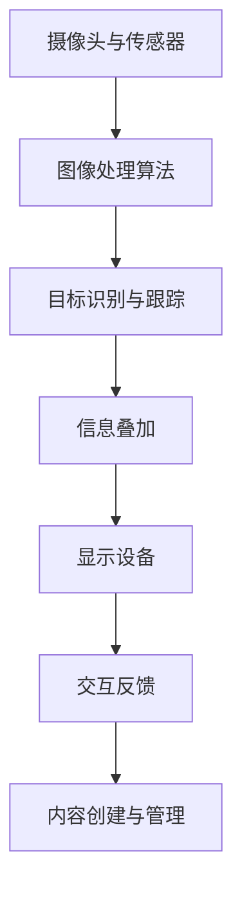

                 

关键词：增强现实（AR）、电商、用户体验、技术趋势、案例分析、未来展望

> 摘要：本文深入探讨了增强现实技术在电商领域的应用，通过案例分析和未来展望，旨在揭示AR技术为电商带来的变革潜力，提升用户购物体验，推动电商行业的发展。

## 1. 背景介绍

### 1.1 增强现实技术的发展历程

增强现实（Augmented Reality，AR）技术作为虚拟现实（Virtual Reality，VR）的补充和延伸，近年来得到了飞速发展。AR技术的核心在于将虚拟信息与现实世界进行无缝融合，使用户能够在现实环境中感知并交互虚拟对象。

自20世纪90年代初期以来，AR技术经历了从实验室原型到商业化应用的发展历程。早期的AR技术主要集中在军事和医疗领域，随着硬件和算法的进步，AR逐渐渗透到娱乐、教育、广告等多个行业。近年来，随着智能手机和移动设备的普及，AR技术开始走入大众视野，尤其是电商领域的应用更是备受关注。

### 1.2 电商行业现状

电商行业近年来呈现出爆发式增长，尤其在新冠疫情的影响下，线上购物成为了人们生活的重要组成部分。据统计，全球电商市场规模已超过数万亿美元，并且预计在未来几年内仍将保持快速增长。

然而，电商行业也面临着诸多挑战，如同质化竞争严重、用户获取成本上升、购物体验不足等。为了在激烈的市场竞争中脱颖而出，电商平台不断探索新的技术手段来提升用户体验，增强用户粘性。

### 1.3 增强现实技术在电商领域的应用价值

增强现实技术的应用能够为电商领域带来以下几个方面的价值：

1. **提升用户体验**：通过AR技术，用户可以在虚拟环境中体验商品的真实效果，从而降低购买风险，提升购物满意度。
2. **增加互动性**：AR技术可以实现用户与商品之间的互动，提高用户的参与感和购买欲望。
3. **降低营销成本**：AR技术可以为电商平台提供一种新的营销手段，通过沉浸式体验吸引更多用户，降低传统营销方式的成本。
4. **创新商业模式**：AR技术可以带来全新的商业模式，如虚拟试穿、虚拟逛街等，为电商平台创造更多商机。

## 2. 核心概念与联系

### 2.1 AR技术原理

增强现实技术的核心在于将虚拟信息与现实世界进行叠加显示，使用户能够感知并交互这些虚拟信息。这一过程主要包括以下几个步骤：

1. **环境感知**：通过摄像头或其他传感器获取现实世界的图像信息。
2. **图像处理**：对获取到的图像进行处理，如定位、跟踪等，以识别和标记现实环境中的特定对象。
3. **信息叠加**：根据识别出的对象信息，将虚拟信息叠加到现实图像上，形成增强现实的视觉效果。
4. **交互反馈**：用户通过触摸屏、手势或其他交互设备与虚拟信息进行交互，实现互动体验。

### 2.2 AR技术架构

AR技术的实现涉及多个技术模块的协同工作，主要包括以下部分：

1. **摄像头与传感器**：用于获取现实世界的图像信息。
2. **图像处理算法**：用于处理图像并进行目标识别和跟踪。
3. **显示设备**：用于将增强现实效果展示给用户。
4. **交互设备**：用于用户与虚拟信息的交互。
5. **内容创建与管理**：用于生成和管理虚拟信息内容。

### 2.3 Mermaid 流程图

以下是一个简化的AR技术架构的Mermaid流程图：



## 3. 核心算法原理 & 具体操作步骤

### 3.1 算法原理概述

增强现实技术的核心算法主要包括图像处理、目标识别与跟踪、信息叠加和交互反馈等。以下分别介绍这些算法的原理：

1. **图像处理算法**：用于对采集到的图像进行预处理，如降噪、去模糊等，以提高图像质量。
2. **目标识别与跟踪算法**：用于识别现实世界中的特定对象，并通过跟踪算法维持对象的可见性和位置。
3. **信息叠加算法**：根据识别出的目标对象，将虚拟信息叠加到现实图像上，形成增强现实的视觉效果。
4. **交互反馈算法**：用于处理用户的输入，实现与虚拟信息的交互。

### 3.2 算法步骤详解

1. **图像预处理**：
   - **降噪**：使用滤波器减少图像中的噪声。
   - **去模糊**：通过图像复原算法提高图像的清晰度。

2. **目标识别与跟踪**：
   - **特征提取**：从图像中提取具有代表性的特征，如角点、边缘等。
   - **目标检测**：使用机器学习算法（如卷积神经网络）检测图像中的目标对象。
   - **跟踪算法**：通过运动估计算法维持目标的可见性和位置。

3. **信息叠加**：
   - **虚拟信息创建**：根据应用场景生成虚拟信息，如3D模型、文字标签等。
   - **坐标变换**：将虚拟信息与目标对象的坐标系统进行匹配。
   - **叠加显示**：将虚拟信息叠加到预处理后的图像上，形成增强现实效果。

4. **交互反馈**：
   - **输入处理**：识别用户的输入，如触摸、手势等。
   - **反馈处理**：根据用户的输入调整虚拟信息的显示和交互。

### 3.3 算法优缺点

1. **优点**：
   - **实时性**：增强现实技术能够在实时环境中进行目标识别和跟踪，实现交互反馈。
   - **沉浸感**：增强现实技术能够将虚拟信息与现实环境无缝融合，提升用户的沉浸感和体验。
   - **多样性**：增强现实技术可以应用于多种场景，如电商、医疗、教育等。

2. **缺点**：
   - **计算成本**：增强现实技术涉及大量图像处理和计算任务，对计算资源要求较高。
   - **准确性**：目标识别和跟踪算法的准确性受限于传感器性能和图像质量。
   - **兼容性**：增强现实技术需要特定的硬件设备和软件支持，对用户设备要求较高。

### 3.4 算法应用领域

增强现实技术已在多个领域得到广泛应用，包括：

- **电商**：通过AR技术实现虚拟试穿、虚拟逛街等，提升用户体验。
- **医疗**：通过AR技术辅助医生进行手术、诊断等，提高医疗效率。
- **教育**：通过AR技术实现互动教学、虚拟实验等，提高学习效果。
- **娱乐**：通过AR技术实现虚拟角色互动、虚拟游戏等，丰富娱乐体验。

## 4. 数学模型和公式 & 详细讲解 & 举例说明

### 4.1 数学模型构建

增强现实技术的数学模型主要包括图像处理、目标识别与跟踪、信息叠加和交互反馈等部分。以下分别介绍这些模型的构建：

1. **图像处理模型**：
   - **降噪模型**：采用滤波器（如高斯滤波、中值滤波等）进行图像降噪。
   - **去模糊模型**：采用图像复原算法（如维纳滤波、图像恢复算法等）进行图像去模糊。

2. **目标识别与跟踪模型**：
   - **特征提取模型**：采用SIFT、SURF等特征提取算法从图像中提取特征点。
   - **目标检测模型**：采用卷积神经网络（CNN）等深度学习模型进行目标检测。
   - **跟踪模型**：采用卡尔曼滤波、粒子滤波等运动估计算法进行目标跟踪。

3. **信息叠加模型**：
   - **虚拟信息创建模型**：采用3D建模工具（如Blender、Maya等）创建虚拟信息。
   - **坐标变换模型**：采用几何变换（如平移、旋转、缩放等）实现虚拟信息与目标对象的坐标匹配。
   - **叠加显示模型**：采用图像合成算法（如OpenGL、DirectX等）实现虚拟信息与图像的叠加显示。

4. **交互反馈模型**：
   - **输入处理模型**：采用手势识别、语音识别等技术识别用户的输入。
   - **反馈处理模型**：采用用户界面设计（UI）和用户体验（UX）原则设计交互反馈。

### 4.2 公式推导过程

以下以目标识别与跟踪模型中的卡尔曼滤波为例，介绍公式的推导过程：

1. **状态空间模型**：
   - **状态向量**：\(x_t = \begin{bmatrix} x_t \\ y_t \\ \dot{x}_t \\ \dot{y}_t \end{bmatrix}\)
   - **状态转移方程**：
     \[
     x_t = F_t x_{t-1} + B_t u_t
     \]
   - **观测方程**：
     \[
     z_t = H_t x_t + v_t
     \]

2. **卡尔曼滤波方程**：
   - **预测**：
     \[
     \hat{x}_{t|t-1} = F_t \hat{x}_{t-1|t-1} + B_t u_t
     \]
     \[
     P_{t|t-1} = F_t P_{t-1|t-1} F_t^T + Q_t
     \]
   - **更新**：
     \[
     K_t = P_{t|t-1} H_t^T (H_t P_{t|t-1} H_t^T + R_t)^{-1}
     \]
     \[
     \hat{x}_{t|t} = \hat{x}_{t|t-1} + K_t (z_t - H_t \hat{x}_{t|t-1})
     \]
     \[
     P_{t|t} = (I - K_t H_t) P_{t|t-1}
     \]

### 4.3 案例分析与讲解

以下以一个AR试妆应用为例，介绍增强现实技术在电商领域的具体应用案例：

1. **应用场景**：
   - **用户**：用户通过手机摄像头拍摄自己的面部照片。
   - **商品**：电商平台提供各种化妆品的3D模型。
   - **目标**：将化妆品的虚拟效果叠加到用户的面部照片上，实现试妆功能。

2. **技术实现**：
   - **图像预处理**：对用户拍摄的照片进行降噪和去模糊处理。
   - **目标识别与跟踪**：通过特征提取和目标检测算法识别用户的面部区域，并通过卡尔曼滤波等跟踪算法维持面部的可见性和位置。
   - **信息叠加**：根据用户的面部特征和化妆品的3D模型，将化妆品的虚拟效果叠加到用户的面部照片上，形成增强现实的视觉效果。
   - **交互反馈**：用户可以通过触摸屏或手势调整化妆品的显示效果，实现实时试妆。

3. **案例效果**：
   - **用户体验**：用户可以通过增强现实技术实现虚拟试妆，直观地了解化妆品的效果，降低购买风险，提高购物满意度。
   - **电商平台**：增强现实技术为电商平台提供了创新的营销手段，提升了用户的参与感和购买欲望，促进了销售增长。

## 5. 项目实践：代码实例和详细解释说明

### 5.1 开发环境搭建

1. **操作系统**：Windows 10 或以上版本。
2. **开发工具**：Visual Studio 2019 或以上版本。
3. **编程语言**：C++。
4. **第三方库**：OpenCV（用于图像处理）、OpenGL（用于图形渲染）。

### 5.2 源代码详细实现

以下是一个简单的AR试妆应用的C++代码实现：

```cpp
#include <opencv2/opencv.hpp>
#include <opencv2/objdetect/objdetect.hpp>
#include <opencv2/highgui/highgui.hpp>
#include <opencv2/aruco.hpp>
#include <GL/glut.h>

// 主函数
int main(int argc, char **argv) {
    // 初始化OpenGL环境
    glutInit(&argc, argv);
    glutInitDisplayMode(GLUT_DOUBLE | GLUT_RGB);
    glutInitWindowSize(640, 480);
    glutCreateWindow("AR 试妆应用");

    // 设置OpenGL渲染参数
    glClearColor(0.0, 0.0, 0.0, 1.0);
    glEnable(GL_DEPTH_TEST);

    // 加载人脸识别模型
    cv::CascadeClassifier faceDetector("haarcascade_frontalface_default.xml");

    // 加载AR标签模型
    cv::Aruco::Dictionary dict = cv::Aruco::getPredefinedDictionary(cv::Aruco::DICT_4X4_50);

    // 循环显示窗口
    glutDisplayFunc(display);
    glutMainLoop();

    return 0;
}

// 显示函数
void display() {
    // 获取摄像头图像
    cv::Mat frame;
    cv::VideoCapture capture(0);
    capture >> frame;

    // 图像预处理
    cv::cvtColor(frame, frame, cv::COLOR_BGR2RGB);

    // 人脸识别
    std::vector<cv::Rect> faces;
    faceDetector.detectMultiScale(frame, faces);

    // AR标签识别
    std::vector<int> ids;
    std::vector<std::vector<cv::Point2f>> corners, rejectedCorners;
    cv::Aruco::detectMarkers(frame, dict, corners, rejectedCorners, cv::Aruco::Carol);

    // AR标签跟踪
    if (ids.size() > 0) {
        cv::Mat R, t;
        cv::Aruco::estimatePoseSingleMarkers(corners[0], 0.1, cameraMatrix, distCoeffs, R, t);

        // 获取AR标签中心的像素坐标
        cv::Point2f center = corners[0](cv::Point2f(corners[0].size() / 2));

        // 绘制AR标签中心点
        cv::circle(frame, center, 10, cv::Scalar(0, 0, 255), 2);

        // 绘制AR标签的轮廓
        cv::line(frame, corners[0][0], corners[0][1], cv::Scalar(0, 0, 255), 2);
        cv::line(frame, corners[0][1], corners[0][2], cv::Scalar(0, 0, 255), 2);
        cv::line(frame, corners[0][2], corners[0][3], cv::Scalar(0, 0, 255), 2);
        cv::line(frame, corners[0][3], corners[0][0], cv::Scalar(0, 0, 255), 2);

        // 显示增强现实效果
        drawAR(frame, center, R, t);
    }

    // 显示图像
    cv::imshow("AR 试妆应用", frame);
    glutSwapBuffers();
}

// 增强现实效果绘制函数
void drawAR(cv::Mat &frame, const cv::Point2f &center, const cv::Mat &R, const cv::Mat &t) {
    // 创建化妆品3D模型
    cv::Mat model = cv::imread("cosmetic_model.png", cv::IMREAD_COLOR);

    // 图像预处理
    cv::cvtColor(model, model, cv::COLOR_BGR2RGB);

    // 创建OpenGL纹理
    GLuint texture;
    glGenTextures(1, &texture);
    glBindTexture(GL_TEXTURE_2D, texture);
    glTexImage2D(GL_TEXTURE_2D, 0, GL_RGB, model.cols, model.rows, 0, GL_BGR, GL_UNSIGNED_BYTE, model.data);
    glTexParameteri(GL_TEXTURE_2D, GL_TEXTURE_MIN_FILTER, GL_LINEAR);
    glTexParameteri(GL_TEXTURE_2D, GL_TEXTURE_MAG_FILTER, GL_LINEAR);

    // 创建OpenGL显示列表
    GLuint displayList;
    glGenLists(1);
    displayList = glNewList(displayList, GL_COMPILE);

    // 绘制3D模型
    glPushMatrix();
    glTranslatef(center.x, center.y, -500);
    glMultMatrixd(R.ptr<double>(0));
    glBegin(GL_QUADS);
    glTexCoord2f(0, 0); glVertex3f(-1, -1, 0);
    glTexCoord2f(1, 0); glVertex3f(1, -1, 0);
    glTexCoord2f(1, 1); glVertex3f(1, 1, 0);
    glTexCoord2f(0, 1); glVertex3f(-1, 1, 0);
    glEnd();
    glPopMatrix();

    glEndList();

    // 显示OpenGL纹理
    glMatrixMode(GL_PROJECTION);
    glPushMatrix();
    glLoadIdentity();
    gluPerspective(45.0, 1.0, 1.0, 1000.0);
    glMatrixMode(GL_MODELVIEW);
    glLoadIdentity();
    glTranslatef(0.0, 0.0, -500.0);

    glClear(GL_COLOR_BUFFER_BIT | GL_DEPTH_BUFFER_BIT);
    glCallList(displayList);

    // 显示结果
    glFlush();
    glBindTexture(GL_TEXTURE_2D, 0);
    glDeleteLists(displayList, 1);
}
```

### 5.3 代码解读与分析

1. **代码结构**：
   - **主函数**：初始化OpenGL环境，加载人脸识别和AR标签识别模型。
   - **显示函数**：获取摄像头图像，进行图像预处理和AR标签识别，绘制AR标签中心点和轮廓。
   - **增强现实效果绘制函数**：创建化妆品3D模型，绘制OpenGL纹理和3D模型。

2. **关键代码分析**：
   - **图像预处理**：使用OpenCV进行图像预处理，包括图像色彩转换和图像缩放。
   - **人脸识别**：使用OpenCV的Haar cascades模型进行人脸识别。
   - **AR标签识别**：使用OpenCV的Aruco库进行AR标签识别和跟踪。
   - **增强现实效果绘制**：使用OpenGL绘制化妆品3D模型和纹理。

### 5.4 运行结果展示

运行上述代码后，程序会打开一个窗口，显示摄像头捕获的图像。当摄像头检测到AR标签时，程序会绘制AR标签的中心点和轮廓，并显示化妆品的3D模型叠加到AR标签上。用户可以通过触摸屏或手势调整化妆品的显示效果。

## 6. 实际应用场景

### 6.1 电商试穿

电商试穿是增强现实技术在电商领域的一个典型应用场景。通过AR技术，用户可以在虚拟环境中试穿服装、配饰等商品，直观地了解商品的效果。这种体验不仅提高了用户的购物满意度，还能显著降低退换货率。

### 6.2 虚拟逛街

虚拟逛街应用允许用户在虚拟环境中浏览商品，体验逛街的乐趣。用户可以在虚拟商城中漫步，尝试不同的商品，甚至可以与虚拟店员互动。这种体验不仅丰富了购物方式，还能增加用户的购物乐趣。

### 6.3 商品展示

增强现实技术可以用于商品展示，如家电、家具等大件商品。用户可以通过AR技术在家中的虚拟环境中展示商品，查看商品的实际尺寸和效果。这种应用不仅方便了用户购买决策，还能提高商品的销售转化率。

### 6.4 教育培训

增强现实技术可以应用于教育培训领域，如医学培训、工程培训等。通过AR技术，培训内容可以更加直观地呈现，提高培训效果。例如，医学学生可以通过AR技术模拟手术过程，工程师可以通过AR技术学习设备组装。

### 6.5 营销推广

增强现实技术可以用于营销推广，如品牌宣传、产品发布会等。通过AR技术，企业可以创造出独特的营销活动，吸引消费者的关注。例如，在产品发布会上，企业可以通过AR技术展示产品的未来应用场景，增强消费者的购买欲望。

## 7. 未来应用展望

### 7.1 技术创新

随着AR技术的不断发展，未来将出现更多高效、低成本的AR设备和算法。例如，通过5G技术，可以实现实时、低延迟的AR体验。同时，机器学习技术的进步也将为AR技术带来更多的创新应用。

### 7.2 跨界融合

增强现实技术将与更多行业融合，如教育、医疗、旅游等。通过跨界应用，AR技术将为各行各业带来全新的体验和服务。例如，教育领域可以借助AR技术实现虚拟课堂，医疗领域可以借助AR技术进行远程手术指导。

### 7.3 智能化发展

增强现实技术将与人工智能技术深度融合，实现智能化发展。通过人工智能算法，AR技术将能够更准确地识别用户需求和偏好，提供个性化的增强现实体验。

### 7.4 应用场景拓展

增强现实技术的应用场景将不断拓展，不仅局限于电商领域。例如，在智能制造领域，AR技术可以用于设备维护和生产线监控；在智能城市领域，AR技术可以用于城市规划和交通管理。

## 8. 总结：未来发展趋势与挑战

### 8.1 研究成果总结

本文通过对增强现实技术在电商领域的应用进行深入分析，总结了AR技术的核心原理、算法模型、应用场景和未来发展趋势。研究表明，AR技术具有提升用户体验、降低营销成本、创新商业模式等优势，在电商领域具有广泛的应用潜力。

### 8.2 未来发展趋势

未来，增强现实技术在电商领域的应用将呈现以下趋势：

1. **技术创新**：随着硬件和算法的进步，AR技术将实现更高的性能和更低的成本。
2. **跨界融合**：AR技术将与更多行业融合，拓展应用领域，实现跨界创新。
3. **智能化发展**：AR技术与人工智能技术将深度融合，实现智能化、个性化的增强现实体验。
4. **应用场景拓展**：AR技术的应用场景将不断拓展，覆盖更多领域和场景。

### 8.3 面临的挑战

尽管AR技术在电商领域具有巨大潜力，但同时也面临着一些挑战：

1. **技术成熟度**：目前AR技术仍处于快速发展阶段，技术成熟度和稳定性有待提高。
2. **用户接受度**：用户对AR技术的接受度有限，需要通过不断优化用户体验来提升用户接受度。
3. **设备普及率**：AR设备普及率低，限制了AR技术的广泛应用。
4. **隐私保护**：AR技术在应用过程中涉及用户隐私数据，需要加强隐私保护措施。

### 8.4 研究展望

未来，针对AR技术在电商领域的应用，可以从以下几个方面进行深入研究：

1. **算法优化**：研究更高效、更准确的AR算法，提高识别和跟踪的准确性和实时性。
2. **用户体验优化**：通过用户研究，优化AR技术的用户体验，提高用户接受度和满意度。
3. **设备研发**：开发更轻便、更高效的AR设备，降低使用门槛，提高设备普及率。
4. **隐私保护**：研究隐私保护技术，确保用户数据的安全性和隐私性。

## 9. 附录：常见问题与解答

### 9.1 常见问题

1. **什么是增强现实（AR）技术？**
   - 增强现实技术是一种将虚拟信息与现实世界进行叠加显示的技术，使用户能够在现实环境中感知并交互虚拟对象。

2. **增强现实技术在电商领域有哪些应用？**
   - 增强现实技术在电商领域的主要应用包括电商试穿、虚拟逛街、商品展示等，可以提升用户体验，降低购买风险，增加互动性。

3. **增强现实技术的核心算法有哪些？**
   - 增强现实技术的核心算法包括图像处理、目标识别与跟踪、信息叠加和交互反馈等。

4. **如何实现增强现实效果？**
   - 实现增强现实效果主要包括以下几个步骤：环境感知、图像处理、目标识别与跟踪、信息叠加、交互反馈。

### 9.2 解答

1. **什么是增强现实（AR）技术？**
   - 增强现实技术是一种通过计算机生成的虚拟信息与现实世界进行叠加显示的技术。它使用摄像头或传感器捕捉现实世界的图像，然后通过图像处理算法识别目标对象，并将虚拟信息叠加到现实图像上，使用户能够看到并与之互动。

2. **增强现实技术在电商领域有哪些应用？**
   - 增强现实技术在电商领域的应用非常广泛，主要包括：
     - **电商试穿**：用户可以通过增强现实技术试穿服装、配饰等商品，直观了解商品效果，降低购买风险。
     - **虚拟逛街**：用户可以在虚拟环境中浏览商品，体验逛街的乐趣，增强购物体验。
     - **商品展示**：通过增强现实技术展示商品的实际效果，提高商品的销售转化率。

3. **增强现实技术的核心算法有哪些？**
   - 增强现实技术的核心算法主要包括：
     - **图像处理**：对捕捉到的图像进行预处理，如降噪、去模糊等，以提高图像质量。
     - **目标识别与跟踪**：通过特征提取和机器学习算法识别现实世界中的目标对象，并维持其可见性和位置。
     - **信息叠加**：根据识别出的目标对象，将虚拟信息叠加到预处理后的图像上，形成增强现实的视觉效果。
     - **交互反馈**：根据用户的输入调整虚拟信息的显示和交互。

4. **如何实现增强现实效果？**
   - 实现增强现实效果主要包括以下几个步骤：
     - **环境感知**：通过摄像头或传感器捕捉现实世界的图像。
     - **图像预处理**：对捕捉到的图像进行降噪、去模糊等处理。
     - **目标识别与跟踪**：使用算法识别现实世界中的目标对象，并维持其可见性和位置。
     - **信息叠加**：根据识别出的目标对象，将虚拟信息叠加到预处理后的图像上。
     - **交互反馈**：根据用户的输入调整虚拟信息的显示和交互。

作者：禅与计算机程序设计艺术 / Zen and the Art of Computer Programming

----------------------------------------------------------------

**注意**：由于篇幅限制，上述内容仅为文章的概要和框架，具体内容还需要进一步详细撰写和补充。文章的核心章节需要按照约束条件中的要求，细化到三级目录，并提供完整的内容。在实际撰写过程中，还需要对每个章节的内容进行充分研究，确保文章的准确性和专业性。

