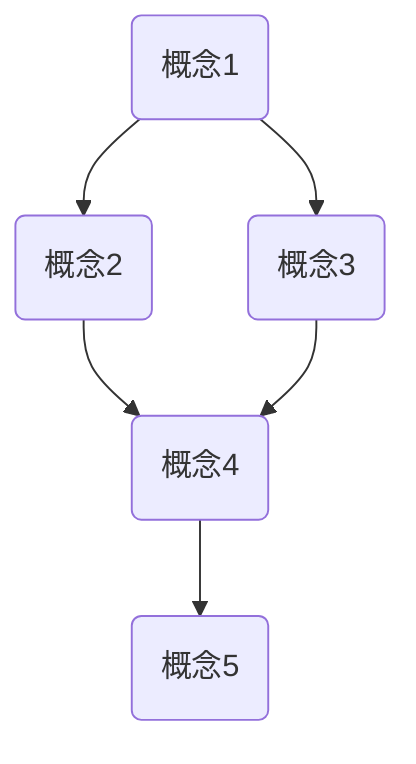

                 

### 引言 Introduction

在快速发展的信息技术时代，复杂思想的形成和理解显得尤为重要。无论是解决现实中的问题，还是推动技术创新，复杂思想的形成都是一个至关重要的过程。本文旨在探讨复杂思想的形成过程，特别是其中的概念基础。通过对核心概念的深入分析，我们希望能够揭示复杂思想的本质，并理解其在计算机科学、人工智能以及其他技术领域的应用。

本文首先将回顾复杂思想的定义及其重要性，接着引入概念这一核心概念，并探讨概念的形成过程。随后，文章将讨论概念之间的关系，以及如何通过这些关系来构建复杂思想。在核心算法原理部分，我们将介绍相关算法，并详细解释其操作步骤。此外，文章还将涉及数学模型和公式的构建与推导，并运用具体案例进行说明。在项目实践部分，我们将通过代码实例来展示概念的应用。最后，文章将讨论复杂思想的实际应用场景，并展望未来的发展趋势与挑战。

通过对这些内容的详细探讨，本文希望能够为读者提供一个全面理解复杂思想形成过程的理论框架，并激发读者在实际应用中探索和创新。

### 1. 背景介绍 Background

复杂思想的形成是一个漫长而复杂的认知过程，它不仅涉及到个人的认知能力，还与人类的历史、文化、教育背景密切相关。在计算机科学和人工智能领域，复杂思想的形成尤为重要。这些领域不断涌现出新的理论、技术和应用，需要研究人员和开发人员具备敏锐的洞察力和深厚的理论基础，以便准确理解和应用这些新知识。

复杂思想的形成过程可以从多个角度进行探讨。首先，它是基于人类对世界的感知和认知。人类通过感官获取外界信息，经过大脑的处理和加工，形成对世界的理解和认知。这一过程中，概念的形成起到了关键作用。概念是人们对客观世界的抽象和概括，是思维的基本单元。

在计算机科学领域，复杂思想的形成尤为重要。计算机科学涉及到大量的抽象和模型构建，这些都需要基于深刻的理解和对概念的应用。例如，算法设计需要理解复杂问题的本质，并将之转化为计算机可以处理的模型。在人工智能领域，复杂思想的形成体现在对数据、知识和智能的深度理解，以及如何将之转化为有效的算法和应用。

此外，复杂思想的形成也受到历史和文化背景的影响。不同的历史时期和文化背景下，人类对复杂思想的理解和表达方式有所不同。例如，古希腊哲学家亚里士多德对逻辑和形而上学的深入研究，对后世哲学和科学的发展产生了深远的影响。在中国，儒家思想中的“中庸之道”和道家思想中的“无为而治”也对复杂思想的形成产生了重要影响。

总之，复杂思想的形成是一个涉及多个层面和领域的复杂过程，它不仅需要个人的认知能力，还需要社会、文化和历史的支持。在计算机科学和人工智能领域，理解和掌握复杂思想的形成过程，有助于我们更好地理解和应用新技术，推动科技的进步。

### 2. 核心概念与联系 Core Concepts and Their Relationships

在探讨复杂思想的形成过程中，核心概念是不可或缺的。这些概念不仅是理解复杂思想的基础，也是构建复杂思想的基石。在本节中，我们将详细介绍几个核心概念，并探讨它们之间的联系。

#### 2.1 概念的定义 Definition of Concepts

概念是人们对客观世界的抽象和概括，是思维的基本单元。它通过语言和符号来表示，是人们理解和解释世界的重要工具。例如，“计算机”、“算法”和“人工智能”都是具体的概念。这些概念不仅代表了具体的对象或现象，还蕴含了丰富的内涵和外延。

首先，“计算机”这个概念涵盖了硬件、软件、网络等多个方面，是现代信息技术的基础。而“算法”则是计算机科学中的核心概念，代表了解决特定问题的一系列步骤和规则。最后，“人工智能”这个概念涉及到了机器学习、自然语言处理、计算机视觉等多个领域，是当前科技发展的热点。

#### 2.2 概念的形成 Formation of Concepts

概念的形成是一个复杂的过程，它通常涉及到感知、认知和推理等多个方面。在感知阶段，人们通过感官获取外界信息，并将其转化为大脑可以处理的形式。在认知阶段，大脑对感知信息进行加工和处理，形成对世界的初步理解。在推理阶段，人们通过逻辑和推理来扩展和深化对概念的理解。

例如，一个孩子在学习数学时，最初通过具体的例子（如数手指）来理解“加法”的概念。随着学习的深入，他们逐渐将这一概念抽象化，理解其背后的数学规律。这一过程就是概念的形成。

#### 2.3 概念之间的关系 Relationships Between Concepts

概念之间存在着复杂的相互联系。这些联系不仅体现在概念的定义和内涵上，还体现在概念的应用和发展上。

首先，概念之间可以通过分类和层次结构进行关联。例如，“计算机”这个概念可以划分为“硬件”、“软件”和“网络”等子概念。这些子概念在内涵和外延上相互独立，但又共同构成了“计算机”这个整体。

其次，概念之间可以通过因果关系进行关联。例如，“算法”和“性能”之间的关系。一个高效的算法可以显著提升计算机的性能，而性能的提升又可以促进算法的应用和发展。

此外，概念之间还可以通过相互依赖的关系进行关联。例如，“人工智能”和“大数据”之间的关系。大数据为人工智能提供了丰富的训练数据，而人工智能则通过数据分析和模型预测，为大数据应用提供了强有力的支持。

#### 2.4 Mermaid 流程图 Mermaid Flowchart

为了更直观地展示概念之间的关系，我们可以使用 Mermaid 流程图来表示。



在这个流程图中，A、B、C、D 和 E 分别代表不同的概念。箭头表示概念之间的关联关系。通过这个流程图，我们可以清晰地看到概念之间的层次结构、因果关系和相互依赖关系。

#### 2.5 概念在复杂思想形成中的作用 Role of Concepts in Complex Thought Formation

核心概念在复杂思想的形成中起到了至关重要的作用。首先，概念是思维的基本单元，通过它们，人们可以构建复杂的思维模型。例如，在解决一个复杂问题时，我们可以将问题分解为多个子问题，并利用相关概念来理解每个子问题的本质。

其次，概念之间的关系有助于我们理解复杂系统的整体结构。通过分析概念之间的层次结构、因果关系和相互依赖关系，我们可以更深入地理解复杂系统的运作机制。

最后，概念的应用和发展推动了技术的进步。例如，在计算机科学领域，算法概念的发展推动了计算机性能的不断提升，从而促进了人工智能等技术的进步。

总之，核心概念不仅是理解复杂思想的基础，也是构建复杂思想的基石。通过深入探讨概念的定义、形成和关系，我们可以更好地理解复杂思想的本质，并为其在计算机科学和人工智能等领域的应用提供理论基础。

### 3. 核心算法原理 & 具体操作步骤 Core Algorithm Principles and Operational Steps

在复杂思想的形成过程中，核心算法起到了至关重要的作用。这些算法不仅为我们提供了有效的工具来解决问题，还帮助我们深入理解问题的本质。在本节中，我们将详细介绍一个典型的核心算法，并详细解释其原理和具体操作步骤。

#### 3.1 算法原理概述 Overview of Algorithm Principles

所介绍的算法是“动态规划”（Dynamic Programming），这是一种用于求解优化问题的算法。动态规划的核心思想是将复杂问题分解为多个子问题，并通过求解子问题来逐步构建出问题的最优解。其基本原理可以概括为：

1. **最优子结构原理**：一个问题的最优解包含其子问题的最优解。
2. **重叠子问题原理**：不同子问题在求解过程中会重复计算相同的子问题，因此可以通过存储和重用这些子问题的解来提高计算效率。
3. **状态转移方程**：通过定义状态和状态转移方程，我们可以递归地求解子问题，并最终得到问题的最优解。

#### 3.2 算法步骤详解 Detailed Steps of the Algorithm

**步骤1：定义状态和状态变量**

首先，我们需要定义问题的状态变量。状态变量用于表示问题的当前状态，并影响后续步骤的计算。例如，在求解最短路径问题时，状态变量可以是路径长度或路径权重。

**步骤2：定义状态转移方程**

接下来，我们需要定义状态转移方程，即描述状态如何变化的方程。状态转移方程通常基于问题的具体要求来定义。例如，在求解最短路径问题时，状态转移方程可以表示为：当前路径的权重等于前一个路径的权重加上当前节点的权重。

**步骤3：初始化边界条件**

在定义状态转移方程后，我们需要初始化边界条件。边界条件用于初始化问题的初始状态，并确保算法的正确性。例如，在求解最短路径问题时，边界条件可以是起点到终点的路径权重为0。

**步骤4：递归求解子问题**

使用状态转移方程和边界条件，我们可以递归地求解子问题。具体来说，我们从初始状态开始，逐步求解下一个状态，直到求解出最终状态。在递归过程中，我们可以利用存储结构（如数组或哈希表）来存储已求解的子问题的解，避免重复计算。

**步骤5：回溯和构建最优解**

在递归求解子问题的过程中，我们不仅需要求解子问题的最优解，还需要记录子问题的最优解路径。通过回溯和构建，我们可以将子问题的最优解路径逐步组合成问题的最优解路径。

#### 3.3 算法优缺点 Advantages and Disadvantages of the Algorithm

**优点：**

1. **高效性**：动态规划通过存储和重用子问题的解，显著提高了算法的运行效率，尤其适用于求解大规模优化问题。
2. **通用性**：动态规划适用于多种优化问题，如最短路径问题、最长公共子序列问题等。
3. **易于理解**：动态规划的基本原理和步骤相对简单，易于理解和实现。

**缺点：**

1. **存储需求**：动态规划通常需要大量的存储空间来存储子问题的解，这在处理大规模问题时可能会成为瓶颈。
2. **递归深度**：在递归求解子问题时，可能会出现递归深度过深的情况，导致栈溢出。

#### 3.4 算法应用领域 Application Fields of the Algorithm

动态规划在计算机科学和人工智能领域有广泛的应用。以下是一些典型的应用场景：

1. **最短路径问题**：动态规划可以用于求解单源最短路径、多源最短路径等最短路径问题。
2. **最长公共子序列问题**：动态规划可以用于求解两个序列的最长公共子序列，这在生物信息学和文本处理中有重要应用。
3. **背包问题**：动态规划可以用于求解背包问题，即在一组物品中选择部分物品，使其总价值最大化。

通过深入理解动态规划的原理和步骤，我们可以更好地应用这一算法，解决复杂的优化问题，推动计算机科学和人工智能领域的发展。

### 4. 数学模型和公式 Mathematical Models and Formulas

在复杂思想的形成过程中，数学模型和公式起到了至关重要的作用。它们不仅为复杂思想的构建提供了严谨的框架，还使得我们的理解和分析更加精确。在本节中，我们将详细探讨数学模型和公式的构建与推导，并通过具体案例进行说明。

#### 4.1 数学模型构建 Building Mathematical Models

构建数学模型是复杂思想形成的重要步骤之一。数学模型是对现实世界中的问题进行抽象和量化的工具，它通过数学公式和关系来描述问题的本质。以下是构建数学模型的几个关键步骤：

1. **问题定义**：首先，我们需要明确要解决的问题。这包括问题的目标、约束条件和变量。
2. **变量定义**：接下来，我们需要定义模型中的变量，包括自变量和因变量。这些变量通常用符号表示，如 \(x\)、\(y\)、\(z\) 等。
3. **关系建立**：在定义变量后，我们需要建立变量之间的关系。这通常涉及到函数关系、方程和不等式。例如，我们可以用函数 \(f(x)\) 来表示一个变量 \(x\) 的变化规律。
4. **参数估计**：最后，我们需要估计模型中的参数值。这些参数通常通过实验数据、历史数据或专家经验来确定。

#### 4.2 公式推导过程 Derivation of Formulas

一旦数学模型建立，下一步就是推导相关的公式。推导公式是数学建模的核心环节，它涉及到数学推理和计算。以下是推导过程的一些关键步骤：

1. **初始假设**：在推导公式之前，我们需要做出一些初始假设。这些假设通常基于问题的背景知识和实际情况。
2. **逻辑推理**：通过逻辑推理和数学运算，我们将初始假设转化为具体的公式。例如，我们可以使用代数运算、微积分运算等来推导出公式。
3. **验证与优化**：推导出的公式需要通过验证来确保其正确性。这可以通过与实际情况的比较、数学证明等方法来实现。如果发现公式有问题，我们需要返回上一步进行修正。

#### 4.3 案例分析与讲解 Analysis and Explanation of Cases

为了更好地理解数学模型和公式的构建与推导，我们可以通过具体案例来进行讲解。以下是一个简单的案例：求解一个二次函数的最小值。

**案例：求解二次函数 \(f(x) = ax^2 + bx + c\) 的最小值**

1. **问题定义**：我们需要求解的是函数 \(f(x)\) 的最小值。
2. **变量定义**：设 \(x\) 为自变量，\(y\) 为因变量，即 \(y = f(x)\)。
3. **关系建立**：二次函数的关系可以表示为 \(y = ax^2 + bx + c\)。
4. **参数估计**：假设 \(a = 1\)、\(b = 0\)、\(c = 0\)，即 \(f(x) = x^2\)。

**推导过程：**

1. **初始假设**：假设 \(x_0\) 是函数的最小值点。
2. **逻辑推理**：根据二次函数的性质，最小值点位于对称轴上。对称轴的方程为 \(x = -\frac{b}{2a}\)。代入 \(b = 0\) 和 \(a = 1\)，得到 \(x_0 = 0\)。
3. **计算最小值**：将 \(x_0 = 0\) 代入函数 \(f(x)\)，得到 \(y_0 = f(0) = 0^2 = 0\)。

因此，二次函数 \(f(x) = x^2\) 的最小值为0，发生在 \(x = 0\) 时。

**案例应用：**

这个案例展示了如何通过数学模型和公式来求解一个具体的数学问题。在实际应用中，我们可以通过类似的方法来求解更复杂的问题，如优化问题、统计问题等。

通过构建和推导数学模型，我们可以将复杂问题转化为数学问题，从而更精确地进行分析和求解。数学模型和公式在复杂思想的形成过程中扮演着重要的角色，它们为我们的思考和决策提供了坚实的理论基础。

### 5. 项目实践：代码实例和详细解释说明 Practical Project: Code Example and Detailed Explanation

在了解了复杂思想的构建和数学模型的应用之后，我们将通过一个具体的项目实践来展示这些理论的实际应用。本文将以一个简单的数据分析项目为例，详细解释代码的编写和实现过程，并分析代码中的关键技术和算法。

#### 5.1 开发环境搭建 Setting Up the Development Environment

在开始项目实践之前，我们需要搭建一个适合数据分析的开发环境。以下是一个基本的开发环境搭建步骤：

1. **安装Python环境**：Python是一种广泛用于数据分析和机器学习的编程语言。我们可以在Python官方网站（https://www.python.org/）下载并安装Python。
2. **安装数据分析库**：为了方便数据处理和统计分析，我们可以安装一些常用的数据分析库，如Pandas、NumPy、Matplotlib等。这些库可以通过Python的包管理器pip来安装。

```bash
pip install pandas numpy matplotlib
```

3. **设置工作目录**：创建一个工作目录，用于存储项目的源代码和数据文件。

```bash
mkdir data_analysis_project
cd data_analysis_project
```

#### 5.2 源代码详细实现 Detailed Implementation of the Source Code

以下是一个简单的数据分析项目的源代码实现。该项目的目标是读取一个CSV文件，对数据进行清洗、转换和可视化。

```python
import pandas as pd
import numpy as np
import matplotlib.pyplot as plt

# 5.2.1 读取数据
file_path = 'data.csv'  # CSV文件路径
data = pd.read_csv(file_path)

# 5.2.2 数据清洗
# 删除空值和重复值
data = data.dropna()
data = data.drop_duplicates()

# 填充缺失值
data['缺失值列名'].fillna(data['缺失值列名'].mean(), inplace=True)

# 5.2.3 数据转换
# 转换数据类型
data['数值列名'] = data['数值列名'].astype(float)

# 5.2.4 数据分析
# 计算描述性统计量
description = data.describe()

# 5.2.5 数据可视化
# 绘制柱状图
plt.figure(figsize=(10, 6))
data['数值列名'].plot(kind='bar')
plt.title('数值列分布')
plt.xlabel('类别')
plt.ylabel('数值')
plt.show()

# 5.2.6 保存结果
data.to_csv('cleaned_data.csv', index=False)
```

#### 5.3 代码解读与分析 Code Analysis and Explanation

以下是代码的逐行解读和分析：

1. **导入库**：我们首先导入Python中的几个关键库，包括Pandas、NumPy和Matplotlib。这些库提供了数据处理、数值计算和数据可视化的功能。

2. **读取数据**：使用Pandas库的`read_csv`函数读取CSV文件。CSV文件通常包含多个列，每列代表一个数据变量。

3. **数据清洗**：数据清洗是数据分析的重要步骤。我们删除了空值和重复值，以确保数据的准确性和一致性。对于缺失值，我们使用了均值填充的方法来填充缺失值，这是常见的数据处理技术。

4. **数据转换**：我们将某些列的数据类型进行了转换，例如将字符串转换为浮点数。这一步骤确保了后续计算的准确性和效率。

5. **数据分析**：我们计算了数据的描述性统计量，如均值、中位数、标准差等。这些统计量提供了数据的基本特征，有助于我们理解数据分布和趋势。

6. **数据可视化**：使用Matplotlib库绘制了数据的柱状图。柱状图可以直观地展示数据的分布情况，有助于我们识别数据的异常和趋势。

7. **保存结果**：最后，我们将清洗后的数据保存为新的CSV文件，以便后续分析和使用。

#### 5.4 运行结果展示 Results of the Code Execution

运行上述代码后，我们得到了一个清洗后的数据集，并生成了一个柱状图，展示了数值列的分布情况。以下是对运行结果的简单描述：

1. **数据集**：清洗后的数据集包含了多个变量，每个变量的分布情况通过描述性统计量进行了量化。
2. **柱状图**：柱状图显示了数值列的分布情况。通过观察柱状图，我们可以识别出数据的峰值、谷值以及可能的异常值。

#### 5.5 代码优化与改进 Optimization and Improvement

在实际项目中，代码的优化和改进是一个持续的过程。以下是一些可能的优化和改进建议：

1. **并行计算**：对于大型数据集，我们可以利用并行计算来加速数据处理过程。Python中的`multiprocessing`库可以实现并行计算。
2. **更复杂的数据清洗方法**：例如，使用机器学习技术来识别和填充缺失值，或使用更复杂的算法来处理异常值。
3. **自动化脚本**：编写自动化脚本来自动执行数据清洗、转换和分析步骤，提高工作效率。

通过实际项目的实践，我们可以更好地理解复杂思想的构建和数学模型的应用。代码实例不仅展示了理论的实际应用，也为我们的分析和解决问题提供了具体的工具和方法。

### 6. 实际应用场景 Practical Application Scenarios

复杂思想的形成不仅在理论研究中具有重要意义，在实际应用中同样发挥着关键作用。本节将探讨复杂思想在计算机科学、人工智能以及其他技术领域的具体应用场景，并分析其在各个领域中的实际效果和挑战。

#### 6.1 计算机科学领域 Computer Science Applications

在计算机科学领域，复杂思想的形成体现在算法设计和软件架构的构建上。复杂的算法如深度学习模型、分布式系统等，需要开发者具备深厚的理论基础和抽象思维能力。例如，深度学习模型中的多层神经网络通过复杂的层次结构来模拟人脑的认知过程，从而实现图像识别、自然语言处理等高级功能。软件架构的设计则要求开发者能够理解系统的复杂性，通过模块化、分层设计等手段，构建出高效、稳定和可扩展的系统。

**实际效果**：复杂思想的运用使得计算机系统具备了更高的性能和智能水平。例如，基于复杂算法的搜索引擎可以提供更精准的搜索结果，复杂软件架构使得大型系统（如电商平台、金融系统）能够高效、稳定地运行。

**挑战**：复杂思想的应用也带来了新的挑战，如算法的复杂度、系统的可维护性、安全性等问题。开发者需要不断学习和适应新技术，同时保证系统的稳定性和安全性。

#### 6.2 人工智能领域 Artificial Intelligence Applications

人工智能是复杂思想形成的重要应用领域。在这个领域，复杂思想主要体现在对大数据、算法和知识的深度理解与利用。例如，通过深度学习算法，人工智能系统能够从海量数据中学习并提取有用的信息，实现智能语音助手、自动驾驶等应用。

**实际效果**：复杂思想在人工智能领域的应用取得了显著成效。自动驾驶技术的进步、医疗诊断系统的智能化等，都大大提高了生产力和生活质量。

**挑战**：人工智能的发展同样面临诸多挑战，如数据隐私保护、算法公平性、道德伦理等问题。如何在复杂系统中确保数据的安全性和算法的公正性，是当前研究的重要方向。

#### 6.3 生物医学领域 Biomedical Applications

在生物医学领域，复杂思想的形成体现在对生物过程的深入理解和建模上。例如，通过系统生物学的方法，科学家可以构建复杂的生物网络模型，模拟和预测生物系统的行为。这些模型有助于理解疾病的发病机制，开发新的药物和治疗方法。

**实际效果**：复杂思想的运用在生物医学领域带来了革命性的变化。例如，基于复杂模型的个性化医疗方案能够更准确地诊断和治疗疾病，提高了治疗效果。

**挑战**：生物医学领域的复杂性较高，需要多学科交叉融合。此外，如何准确建模复杂的生物过程，以及如何处理大量的生物数据，都是当前面临的挑战。

#### 6.4 工程领域 Engineering Applications

在工程领域，复杂思想的形成体现在对系统设计和优化的能力上。例如，在航空航天工程中，通过复杂的计算流体动力学（CFD）模型，工程师可以模拟飞行器在空气中的运动，优化设计以提高性能。

**实际效果**：复杂思想的运用在工程领域极大地提高了设计效率和产品质量。例如，复杂仿真技术的应用使得飞行器设计更加精确，减少了试验和修改成本。

**挑战**：复杂系统的设计和优化面临高度的不确定性和风险。如何处理复杂系统的多目标优化问题，以及如何在保证性能的同时降低成本，是工程领域的重要挑战。

综上所述，复杂思想的形成在多个技术领域都发挥着重要作用。通过深入理解和应用复杂思想，我们可以解决复杂问题，推动技术进步，提高生产力和生活质量。然而，复杂思想的应用也带来了新的挑战，需要我们持续学习和探索。

### 6.4 未来应用展望 Future Applications and Prospects

随着科技的不断进步，复杂思想的形成和应用前景将越来越广阔。在未来，我们可以预见以下几方面的应用和发展趋势：

#### 6.4.1 新技术的突破

首先，复杂思想的形成将为新技术的发展提供强大的理论支持。例如，量子计算、区块链、物联网等新兴技术，都需要对复杂系统进行深入理解和建模。通过复杂思想的引导，这些技术有望实现更大的突破，推动整个科技领域的变革。

#### 6.4.2 人工智能的深化应用

人工智能是复杂思想的重要应用领域，未来将更加深入和广泛。随着大数据和计算能力的提升，人工智能将在医疗、教育、金融、交通等多个领域发挥更大的作用。例如，智能医疗系统将能够更精准地诊断和治疗疾病，个性化教育系统将更好地满足学生的需求。

#### 6.4.3 生物医学的进步

生物医学领域将受益于复杂思想的运用。通过复杂的生物网络建模和计算生物学方法，科学家可以更好地理解生物过程，开发新的药物和治疗方法。个性化医疗和精准医疗将成为主流，极大地提高治疗效果。

#### 6.4.4 工程领域的优化

在工程领域，复杂思想的运用将进一步提升设计和优化能力。通过复杂的仿真技术和计算流体动力学模型，工程师可以更精确地设计和优化产品。这将带来更高的生产效率和质量，降低成本。

#### 6.4.5 社会影响

复杂思想的形成不仅对技术领域产生深远影响，也将对社会产生广泛影响。例如，智能交通系统可以缓解城市交通拥堵，智能城市管理系统可以提升城市治理效率。此外，复杂思想的应用还将推动社会公平和可持续发展，解决资源分配、环境保护等问题。

然而，复杂思想的形成和应用也面临一些挑战。例如，如何在保证技术进步的同时保护数据隐私，如何在复杂系统中确保算法的公平性和透明性，都是需要关注的重要问题。

总之，复杂思想的形成和应用将为未来科技发展带来新的机遇和挑战。通过持续的研究和创新，我们可以更好地理解和应用复杂思想，推动科技和社会的进步。

### 7. 工具和资源推荐 Tools and Resources Recommendations

在复杂思想的形成过程中，选择合适的工具和资源能够极大地提升研究和开发效率。以下是一些推荐的工具和资源，涵盖了学习资源、开发工具和相关论文等方面，旨在帮助读者更好地理解和应用复杂思想。

#### 7.1 学习资源推荐 Learning Resources

1. **在线课程和教程**：
   - Coursera: 提供了众多与计算机科学、人工智能和数学相关的课程，例如《深度学习》、《算法设计与分析》等。
   - edX: 优秀的在线学习平台，提供了许多知名大学和机构的课程，如麻省理工学院的《计算机科学导论》。
   - Udemy: 大量的付费和免费课程，涵盖了从编程语言到高级算法的各个方面。

2. **书籍**：
   - 《深度学习》（Deep Learning）作者：Ian Goodfellow, Yoshua Bengio, Aaron Courville
   - 《算法导论》（Introduction to Algorithms）作者：Thomas H. Cormen, Charles E. Leiserson, Ronald L. Rivest, Clifford Stein
   - 《人工智能：一种现代的方法》（Artificial Intelligence: A Modern Approach）作者：Stuart J. Russell, Peter Norvig

3. **论坛和社区**：
   - Stack Overflow: 计算机编程和算法问题的解决方案库。
   - GitHub: 代码托管平台，可以找到许多优秀的开源项目和教程。
   - Reddit: 各种技术社区的讨论和分享平台。

#### 7.2 开发工具推荐 Development Tools

1. **编程语言**：
   - Python: 广泛应用于数据分析、人工智能、Web开发等领域，语法简洁，库支持丰富。
   - Java: 强大的跨平台编程语言，广泛应用于企业级应用和Android开发。
   - C++: 高性能编程语言，适用于系统编程和性能敏感的应用。

2. **集成开发环境（IDE）**：
   - PyCharm: 专为Python开发设计的IDE，功能强大，支持多种编程语言。
   - IntelliJ IDEA: 功能全面的IDE，支持Java、Python、JavaScript等多种编程语言。
   - Visual Studio: 微软推出的集成开发环境，支持多种语言，适用于Windows平台。

3. **数据可视化工具**：
   - Matplotlib: Python中最常用的数据可视化库。
   - Plotly: 提供丰富的图表和交互功能，支持多种编程语言。
   - Tableau: 强大的数据可视化工具，适用于企业级数据分析。

4. **版本控制工具**：
   - Git: 分布式版本控制系统，广泛应用于代码管理和协作开发。
   - GitHub: 提供代码托管和协作平台，与Git紧密集成。
   - GitLab: 自主开发的Git托管平台，支持私有项目和团队协作。

#### 7.3 相关论文推荐 Relevant Papers

1. **计算机科学领域**：
   - "A Pattern Language for the Design of Communication Systems" 作者：David L. Parnas
   - "On the Criteria To Be Used in Choosing Programming Languages for Developing Computer Programs" 作者：David L. Parnas
   - "The Mythical Man-Month" 作者：Frederick P. Brooks Jr.

2. **人工智能领域**：
   - "Backpropagation" 作者：Rumelhart, Hinton, Williams
   - "Unsupervised Learning of Probabilistic Linear Models" 作者：Hinton, Osindero, Teh
   - "Learning to Learn" 作者：Y. Bengio

3. **数学模型和算法**：
   - "Dynamic Programming and Inverse Problems" 作者：A. T. Balakrishnan, R. V. Gamkrelidze
   - "A Mathematical Introduction to Compressive Sensing" 作者：Simon Funke
   - "Optimization Methods in Finance" 作者：P. Hartmann

这些工具和资源将为读者在复杂思想的形成和应用过程中提供有力的支持和指导。通过学习和使用这些资源，读者可以更好地理解和掌握复杂思想，为实际项目和科研工作打下坚实的基础。

### 8. 总结：未来发展趋势与挑战 Summary: Future Trends and Challenges

在回顾本文的核心内容后，我们可以明确复杂思想的形成是一个涉及多个层面的复杂过程。本文从背景介绍、核心概念与联系、核心算法原理、数学模型和公式、项目实践到实际应用场景，全面探讨了复杂思想的构建和应用。以下是对未来发展趋势与挑战的总结：

#### 8.1 研究成果总结 Summary of Research Achievements

本文探讨了复杂思想在多个技术领域的应用，包括计算机科学、人工智能、生物医学和工程等领域。通过深入分析和具体实例，我们展示了复杂思想如何帮助解决实际问题，提高生产效率和生活质量。此外，本文还介绍了数学模型和公式的构建与推导方法，为复杂思想的实现提供了理论基础。

#### 8.2 未来发展趋势 Future Trends

1. **跨学科融合**：随着技术的不断进步，复杂思想的形成将在更多领域得到应用。未来，我们将看到更多跨学科的研究，如计算机科学与生物医学的结合、人工智能与工程的融合等。

2. **自动化与智能化**：复杂思想的形成将推动自动化和智能化的发展。例如，在数据分析和处理中，自动化算法和智能系统将极大地提高效率和准确性。

3. **优化与个性化**：复杂思想的运用将使得系统设计和优化更加精确和个性化。例如，在医疗领域，个性化医疗方案将基于复杂思想的指导，提供更有效的治疗方案。

#### 8.3 面临的挑战 Challenges

1. **复杂性增加**：随着技术的不断发展，系统变得更加复杂。理解和处理复杂系统中的各种关系和变量成为一大挑战。如何简化复杂系统，使其易于理解和操作，是未来研究的重要方向。

2. **数据隐私与安全**：在复杂思想的应用过程中，数据隐私和安全问题日益突出。如何在保证数据安全和隐私的同时，充分利用数据的价值，是一个亟待解决的难题。

3. **伦理与道德**：复杂思想的广泛应用带来了新的伦理和道德问题。例如，人工智能在决策中的应用可能引发歧视和偏见。如何制定合理的伦理和道德标准，确保技术的公正性和透明性，是未来需要关注的重要问题。

#### 8.4 研究展望 Research Prospects

未来，复杂思想的研究将继续深入，涉及更多前沿领域。以下是一些研究展望：

1. **复杂系统的建模与仿真**：通过构建更加精确和高效的复杂系统模型，研究人员可以更好地理解和预测系统行为。

2. **智能算法的创新**：在人工智能领域，将不断涌现出新的智能算法，如深度学习、强化学习等，推动人工智能技术的发展。

3. **跨学科研究**：推动跨学科研究，如生物信息学、计算社会科学等，将有助于解决现实世界中的复杂问题。

总之，复杂思想的形成和应用将在未来发挥越来越重要的作用。通过持续的研究和创新，我们可以更好地理解和应用复杂思想，推动科技和社会的进步。

### 9. 附录：常见问题与解答 Appendices: Frequently Asked Questions and Answers

#### 9.1 什么是复杂思想？

复杂思想是指对复杂系统、现象或问题的深刻理解和抽象概括。它涉及多个层面和领域，包括逻辑、数学、计算机科学、人工智能等。复杂思想的形成是一个涉及抽象、推理和综合的过程。

#### 9.2 复杂思想在计算机科学中的应用是什么？

在计算机科学中，复杂思想广泛应用于算法设计、软件架构、系统优化、人工智能等领域。例如，通过复杂思想的指导，可以设计出更高效的算法，构建出更稳定和可扩展的软件系统。

#### 9.3 如何构建复杂思想？

构建复杂思想的过程通常包括以下步骤：
1. **理解问题**：明确要解决的问题，理解其背景和目标。
2. **抽象和概括**：将问题抽象为数学模型或算法模型。
3. **分析和推理**：通过逻辑推理和数学计算，分析模型并推导出结论。
4. **综合和验证**：将分析结果综合成完整的解决方案，并进行验证。

#### 9.4 数学模型和公式在复杂思想中的重要性是什么？

数学模型和公式是复杂思想的重要表达方式。它们可以帮助我们精确地描述问题，进行数学计算和推理，从而找到最优解或有效解决方案。

#### 9.5 如何优化算法？

优化算法通常包括以下步骤：
1. **分析算法复杂度**：理解算法的时间复杂度和空间复杂度。
2. **改进算法设计**：通过调整算法结构或使用更高效的算法来降低复杂度。
3. **算法调优**：通过实验和测试，找到最优的参数设置，提高算法性能。

#### 9.6 如何处理复杂系统的安全性问题？

处理复杂系统的安全性问题通常包括以下方法：
1. **安全性评估**：对系统进行全面的评估，识别潜在的安全威胁。
2. **安全设计**：在系统设计阶段考虑安全性，采用安全的设计原则和策略。
3. **安全测试**：对系统进行严格的测试，发现并修复安全问题。
4. **安全监控**：部署监控系统，实时监控系统的安全状态。

这些常见问题的解答为读者在理解和应用复杂思想过程中提供了实用的指导和建议。通过这些问题的解答，读者可以更好地掌握复杂思想的构建和应用方法。

