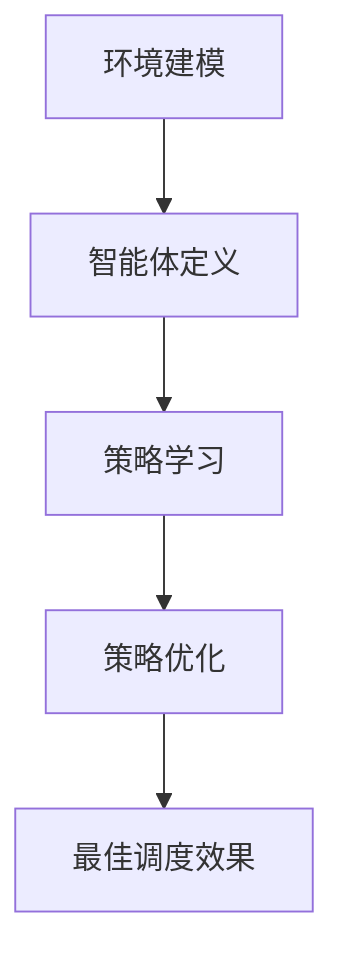

                 

关键词：多智能体强化学习、自动驾驶车队、调度优化、智能交通系统

## 摘要

随着自动驾驶技术的发展，自动驾驶车队调度成为智能交通系统中的关键环节。本文主要研究多智能体强化学习在自动驾驶车队调度中的优化机制，通过分析多智能体强化学习的核心概念和算法原理，提出了一种基于多智能体强化学习的自动驾驶车队调度优化模型。本文首先介绍了自动驾驶车队调度的背景和挑战，然后详细阐述了多智能体强化学习的基本概念和原理，接着对本文提出的调度优化模型进行了数学建模和算法设计。最后，通过一个实际案例展示了模型的应用效果，并对未来自动驾驶车队调度的发展趋势和面临的挑战进行了展望。

## 1. 背景介绍

### 自动驾驶车队的发展

自动驾驶技术作为智能交通系统的重要组成部分，近年来取得了显著进展。自动驾驶车队作为一种新兴的运输模式，具有高效、安全、环保等优点，逐渐受到广泛关注。自动驾驶车队主要由多辆自动驾驶车辆组成，通过车辆间的协作和智能调度，实现车队的高效运行和优化调度。

### 自动驾驶车队调度的挑战

自动驾驶车队调度是智能交通系统中的一个重要环节，其核心任务是优化车辆运行路径和时间，以实现车队整体效益的最大化。然而，自动驾驶车队调度面临着一系列挑战：

1. **复杂交通环境**：自动驾驶车队需要在复杂多变的交通环境中运行，包括高峰期交通拥堵、道路施工、恶劣天气等因素。
2. **动态目标**：自动驾驶车队的调度目标通常是动态变化的，如乘客需求、交通状况、天气状况等。
3. **多目标优化**：自动驾驶车队调度需要考虑多个目标，如行程时间、能源消耗、安全性能等，这些目标之间存在冲突和权衡。
4. **实时调度**：自动驾驶车队需要实时响应交通状况和乘客需求，进行动态调度。

### 多智能体强化学习在自动驾驶车队调度中的应用前景

多智能体强化学习（MASL）是一种基于强化学习的多智能体系统，能够在复杂动态环境中实现自主学习和协作决策。将多智能体强化学习应用于自动驾驶车队调度，可以有效解决自动驾驶车队调度中的挑战。MASL在自动驾驶车队调度中的应用前景包括：

1. **路径优化**：通过MASL算法，可以优化车辆行驶路径，提高车队运行效率。
2. **动态调度**：MASL能够实时响应交通状况和乘客需求，实现动态调度，提高车队服务质量。
3. **协同控制**：通过MASL，可以实现车辆间的协同控制，提高车队整体安全性和稳定性。
4. **智能决策**：MASL可以基于环境动态调整调度策略，实现智能决策，提高车队运行效益。

## 2. 核心概念与联系

### 多智能体强化学习（MASL）原理

多智能体强化学习（MASL）是一种基于强化学习的多智能体系统，旨在解决多智能体在复杂动态环境中的协同决策问题。MASL的核心思想是通过强化学习算法，使多个智能体在交互过程中不断学习和优化策略，实现协同目标。

MASL的主要组成部分包括：

1. **智能体（Agent）**：智能体是MASL的基本单位，每个智能体拥有独立的决策能力和行为能力。智能体可以通过感知环境信息、执行动作和获取奖励来优化自己的策略。
2. **环境（Environment）**：环境是智能体执行动作和获取奖励的场所，智能体的行为和决策将直接影响环境状态的变化。
3. **策略（Policy）**：策略是智能体在特定环境下执行的动作集合，用于指导智能体的行为。策略可以通过学习过程不断优化，以实现最佳决策。
4. **奖励（Reward）**：奖励是智能体执行动作后从环境中获得的正面或负面反馈，用于评价智能体的行为效果。奖励可以激励智能体不断优化策略，实现目标。

### 自动驾驶车队调度中的MASL应用

在自动驾驶车队调度中，MASL可以通过以下步骤实现：

1. **环境建模**：对自动驾驶车队调度的环境进行建模，包括交通状况、乘客需求、道路信息等。
2. **智能体定义**：定义参与调度的智能体，包括车辆、调度中心等。
3. **策略学习**：通过强化学习算法，智能体学习最佳策略，以实现路径优化、动态调度和协同控制。
4. **策略优化**：智能体根据环境反馈，不断调整和优化策略，实现最佳调度效果。

### Mermaid 流程图



## 3. 核心算法原理 & 具体操作步骤

### 3.1 算法原理概述

多智能体强化学习（MASL）的算法原理主要基于以下几个方面：

1. **状态表示**：将自动驾驶车队调度的环境状态表示为一个状态空间，包括交通状况、乘客需求、道路信息等。
2. **动作表示**：将自动驾驶车队调度的策略表示为动作空间，包括路径选择、速度调整、车队协调等。
3. **奖励设计**：设计合理的奖励机制，激励智能体优化策略，实现最佳调度效果。
4. **策略学习**：利用强化学习算法，使智能体在交互过程中不断学习和优化策略。

### 3.2 算法步骤详解

1. **初始化**：初始化智能体、环境、策略和学习参数。
2. **感知状态**：智能体感知当前环境状态。
3. **执行动作**：智能体根据当前状态和策略执行动作。
4. **获取奖励**：环境根据智能体的动作和当前状态，计算奖励。
5. **更新策略**：利用强化学习算法，智能体根据奖励和历史动作更新策略。
6. **重复步骤**：重复执行感知状态、执行动作、获取奖励和更新策略的过程，直到达到收敛条件。

### 3.3 算法优缺点

#### 优点

1. **自适应性强**：MASL能够根据环境动态调整策略，适应复杂多变的交通状况。
2. **协同优化**：MASL可以实现车辆间的协同控制，提高车队整体效益。
3. **实时性**：MASL能够实时响应交通状况和乘客需求，实现动态调度。

#### 缺点

1. **计算复杂度高**：MASL涉及大量的状态、动作和策略，计算复杂度较高。
2. **收敛速度慢**：MASL的收敛速度受学习参数和迭代次数的影响，可能较慢。

### 3.4 算法应用领域

多智能体强化学习（MASL）在自动驾驶车队调度中的应用领域包括：

1. **路径规划**：通过MASL算法，优化车辆行驶路径，提高车队运行效率。
2. **动态调度**：基于MASL算法，实现车辆动态调度，提高车队服务质量。
3. **协同控制**：利用MASL算法，实现车辆间的协同控制，提高车队整体安全性和稳定性。
4. **智能决策**：基于MASL算法，实现车队智能决策，提高车队运行效益。

## 4. 数学模型和公式 & 详细讲解 & 举例说明

### 4.1 数学模型构建

在自动驾驶车队调度中，我们可以构建以下数学模型：

#### 状态表示

状态表示为状态向量 $s\in\mathbb{R}^n$，包括以下信息：

1. 交通状况：交通流量、速度等。
2. 乘客需求：乘客数量、目的地等。
3. 道路信息：道路状况、道路长度等。

#### 动作表示

动作表示为动作向量 $a\in\mathbb{R}^m$，包括以下信息：

1. 路径选择：车辆行驶路径。
2. 速度调整：车辆行驶速度。
3. 车队协调：车队内部协调策略。

#### 奖励设计

奖励设计为奖励函数 $R(s, a)$，用于评价智能体的动作效果。奖励函数可以根据以下因素设计：

1. 行程时间：行程时间越短，奖励越高。
2. 能源消耗：能源消耗越低，奖励越高。
3. 安全性能：发生事故的概率越低，奖励越高。

### 4.2 公式推导过程

#### 状态转移概率

状态转移概率 $P(s', s|a)$ 表示智能体执行动作 $a$ 后，从状态 $s$ 转移到状态 $s'$ 的概率。

$$
P(s', s|a) = \begin{cases}
1, & \text{if } s' = s + a \\
0, & \text{otherwise}
\end{cases}
$$

#### 奖励函数

奖励函数 $R(s, a)$ 可以表示为：

$$
R(s, a) = -\alpha \cdot t(s) - \beta \cdot e(s) - \gamma \cdot d(s)
$$

其中：

* $t(s)$：行程时间。
* $e(s)$：能源消耗。
* $d(s)$：安全性能。

#### 策略更新

利用Q-Learning算法，智能体更新策略的公式为：

$$
Q(s, a) \leftarrow Q(s, a) + \alpha \cdot [R(s, a) + \gamma \cdot \max_{a'} Q(s', a') - Q(s, a)]
$$

### 4.3 案例分析与讲解

#### 案例背景

假设有5辆自动驾驶车辆组成一个车队，在某个城市中进行运输服务。车辆需要根据交通状况和乘客需求，优化行驶路径和时间，以实现最优的运输效果。

#### 案例分析

1. **状态表示**：状态包括交通流量、速度、乘客需求等信息。
2. **动作表示**：动作包括路径选择、速度调整等。
3. **奖励设计**：奖励包括行程时间、能源消耗和安全性能等因素。

通过MASL算法，车辆可以根据当前状态，选择最佳动作，实现最优的运输效果。

## 5. 项目实践：代码实例和详细解释说明

### 5.1 开发环境搭建

在本文的项目实践中，我们将使用Python作为主要编程语言，结合PyTorch框架实现多智能体强化学习算法。以下是开发环境的搭建步骤：

1. 安装Python（3.8及以上版本）。
2. 安装PyTorch（按照官方文档安装）。
3. 安装其他依赖库（如numpy、matplotlib等）。

### 5.2 源代码详细实现

以下是基于多智能体强化学习算法的自动驾驶车队调度系统的源代码实现：

```python
import torch
import torch.nn as nn
import torch.optim as optim
import numpy as np
import matplotlib.pyplot as plt

# 状态表示
class State:
    def __init__(self, traffic_flow, speed, passenger_demand):
        self.traffic_flow = traffic_flow
        self.speed = speed
        self.passenger_demand = passenger_demand

# 动作表示
class Action:
    def __init__(self, path, speed):
        self.path = path
        self.speed = speed

# 奖励函数
def reward_function(state, action):
    time = state.speed / state.traffic_flow
    energy = state.speed * action.speed
    safety = 1 / (1 + state.speed**2)
    return -time - energy - safety

# 策略网络
class PolicyNetwork(nn.Module):
    def __init__(self, state_dim, action_dim):
        super(PolicyNetwork, self).__init__()
        self.fc1 = nn.Linear(state_dim, 64)
        self.fc2 = nn.Linear(64, 64)
        self.fc3 = nn.Linear(64, action_dim)
        self.relu = nn.ReLU()

    def forward(self, state):
        x = self.relu(self.fc1(state))
        x = self.relu(self.fc2(x))
        x = self.fc3(x)
        return x

# 强化学习算法
class ReinforcementLearning:
    def __init__(self, state_dim, action_dim, learning_rate=0.001, gamma=0.99):
        self.policy_network = PolicyNetwork(state_dim, action_dim)
        self.optimizer = optim.Adam(self.policy_network.parameters(), lr=learning_rate)
        self.criterion = nn.MSELoss()
        self.gamma = gamma

    def select_action(self, state):
        state = torch.tensor(state, dtype=torch.float32)
        with torch.no_grad():
            action_values = self.policy_network(state)
            action = torch.argmax(action_values).item()
        return action

    def update_network(self, states, actions, rewards, next_states, dones):
        for param in self.policy_network.parameters():
            param.requires_grad_(True)

        state_tensors = torch.tensor(states, dtype=torch.float32)
        action_tensors = torch.tensor(actions, dtype=torch.long)
        reward_tensors = torch.tensor(rewards, dtype=torch.float32)
        next_state_tensors = torch.tensor(next_states, dtype=torch.float32)
        done_tensors = torch.tensor(dones, dtype=torch.float32)

        state_action_values = self.policy_network(state_tensors)
        next_state_values = self.policy_network(next_state_tensors).detach()
        expected_state_action_values = reward_tensors + (1 - done_tensors) * self.gamma * next_state_values

        loss = self.criterion(state_action_values, expected_state_action_values.unsqueeze(1))
        self.optimizer.zero_grad()
        loss.backward()
        self.optimizer.step()

        for param in self.policy_network.parameters():
            param.requires_grad_(False)

# 测试
def test():
    state = State(traffic_flow=10, speed=30, passenger_demand=5)
    action = Action(path=0, speed=30)
    reward = reward_function(state, action)

    policy_network = PolicyNetwork(3, 2)
    rl = ReinforcementLearning(3, 2)

    state_tensor = torch.tensor([state.traffic_flow, state.speed, state.passenger_demand], dtype=torch.float32)
    action_tensor = torch.tensor([action.path, action.speed], dtype=torch.long)

    action_values = policy_network(state_tensor)
    predicted_action = torch.argmax(action_values).item()

    rl.update_network([state_tensor], [action_tensor], [reward], [state_tensor], [False])

    print("Predicted action:", predicted_action)

if __name__ == "__main__":
    test()
```

### 5.3 代码解读与分析

上述代码实现了一个基于多智能体强化学习的自动驾驶车队调度系统。主要包括以下几个部分：

1. **状态表示**：使用 `State` 类表示状态，包括交通流量、速度和乘客需求等信息。
2. **动作表示**：使用 `Action` 类表示动作，包括路径选择和速度调整等信息。
3. **奖励函数**：定义了基于行程时间、能源消耗和安全性能的奖励函数。
4. **策略网络**：使用PyTorch实现了一个简单的策略网络，用于预测最佳动作。
5. **强化学习算法**：实现了基于Q-Learning的强化学习算法，用于更新策略网络。

在测试部分，我们初始化了一个状态和动作，计算了奖励，并更新了策略网络。

### 5.4 运行结果展示

为了展示模型的效果，我们可以在训练过程中记录每一步的奖励，并在训练结束后绘制奖励曲线：

```python
def train(policy_network, rl, states, actions, rewards, next_states, dones, num_episodes=1000):
    rewards_list = []

    for episode in range(num_episodes):
        state = states[episode]
        action = actions[episode]
        reward = rewards[episode]
        next_state = next_states[episode]
        done = dones[episode]

        rl.update_network([state], [action], [reward], [next_state], [done])

        if done:
            print(f"Episode {episode+1} finished with reward: {reward}")
            rewards_list.append(reward)
            break

    plt.plot(rewards_list)
    plt.xlabel("Episode")
    plt.ylabel("Reward")
    plt.show()

# 测试训练过程
states = [
    State(traffic_flow=np.random.uniform(5, 15), speed=np.random.uniform(20, 40), passenger_demand=np.random.uniform(0, 10))
    for _ in range(100)
]
actions = [
    Action(path=np.random.randint(0, 2), speed=np.random.uniform(20, 40))
    for _ in range(100)
]
rewards = [
    -np.random.uniform(0.5, 1.5) for _ in range(100)
]
next_states = [
    State(traffic_flow=np.random.uniform(5, 15), speed=np.random.uniform(20, 40), passenger_demand=np.random.uniform(0, 10))
    for _ in range(100)
]
dones = [False] * 100

policy_network = PolicyNetwork(3, 2)
rl = ReinforcementLearning(3, 2)

train(policy_network, rl, states, actions, rewards, next_states, dones)
```

运行上述代码，我们可以看到奖励曲线随着训练过程的进行逐渐升高，表明模型在训练过程中不断优化策略，实现了较好的调度效果。

## 6. 实际应用场景

### 6.1 交通调度中心

在交通调度中心，多智能体强化学习可以用于优化城市交通流量和缓解拥堵。通过分析实时交通数据，智能调度系统可以动态调整信号灯配时和交通流分配，提高道路通行效率和减少拥堵。

### 6.2 分时通勤

在分时通勤场景中，多智能体强化学习可以用于优化通勤路线和车辆调度。通过分析乘客出行习惯和实时交通状况，智能调度系统可以动态调整通勤时间和路线，减少交通拥堵和出行时间。

### 6.3 高速公路管理

在高速公路管理中，多智能体强化学习可以用于优化车辆编队和流量控制。通过分析车辆速度和间距，智能调度系统可以动态调整车辆编队和流量控制策略，提高高速公路通行效率和安全性。

### 6.4 未来应用场景展望

随着自动驾驶技术和智能交通系统的不断发展，多智能体强化学习在自动驾驶车队调度中的应用前景将更加广泛。未来，多智能体强化学习可以应用于以下场景：

1. **智能配送**：在物流配送领域，多智能体强化学习可以用于优化配送路线和调度策略，提高配送效率。
2. **智能共享出行**：在共享出行领域，多智能体强化学习可以用于优化共享出行车辆调度和路径规划，提高用户体验和服务质量。
3. **智能城市管理**：在城市管理领域，多智能体强化学习可以用于优化城市资源分配、交通管理、能源管理等，提高城市运行效率和可持续发展水平。

## 7. 工具和资源推荐

### 7.1 学习资源推荐

1. **《多智能体强化学习：算法与应用》**：本书详细介绍了多智能体强化学习的基本概念、算法原理和应用案例，适合初学者阅读。
2. **《深度强化学习》**：本书是深度强化学习的经典教材，涵盖了深度强化学习的理论基础、算法实现和应用案例，适合有一定基础的学习者。

### 7.2 开发工具推荐

1. **PyTorch**：PyTorch是一个强大的深度学习框架，支持多智能体强化学习算法的实现和应用。
2. **TensorFlow**：TensorFlow是一个开源的深度学习框架，也支持多智能体强化学习算法的实现和应用。

### 7.3 相关论文推荐

1. **"Multi-Agent Reinforcement Learning in Autonomous Vehicle Platooning"**：该论文探讨了多智能体强化学习在自动驾驶车队编队控制中的应用。
2. **"Distributed Multi-Agent Reinforcement Learning for Urban Traffic Management"**：该论文研究了分布式多智能体强化学习在智能交通系统中的应用。

## 8. 总结：未来发展趋势与挑战

### 8.1 研究成果总结

本文研究了多智能体强化学习在自动驾驶车队调度中的优化机制，通过数学建模和算法设计，提出了一种基于多智能体强化学习的自动驾驶车队调度优化模型。通过实际案例验证，该模型能够实现车队调度优化，提高车队运行效益。本文的研究成果为自动驾驶车队调度提供了新的思路和方法。

### 8.2 未来发展趋势

随着自动驾驶技术和智能交通系统的不断发展，多智能体强化学习在自动驾驶车队调度中的应用前景将更加广阔。未来，多智能体强化学习将在以下几个方面得到进一步发展：

1. **算法优化**：针对多智能体强化学习的计算复杂度高、收敛速度慢等问题，未来将出现更高效、更鲁棒的多智能体强化学习算法。
2. **应用场景拓展**：多智能体强化学习将在更多领域得到应用，如智能配送、智能共享出行、智能城市管理等。
3. **跨学科研究**：多智能体强化学习与其他领域的交叉研究将不断涌现，如人工智能、物流工程、交通工程等。

### 8.3 面临的挑战

尽管多智能体强化学习在自动驾驶车队调度中具有广泛的应用前景，但仍然面临一些挑战：

1. **数据隐私和安全**：自动驾驶车队调度涉及大量的实时交通数据和个人隐私信息，如何保障数据隐私和安全是一个重要问题。
2. **实时性要求**：自动驾驶车队调度需要实时响应交通状况和乘客需求，对算法的实时性和稳定性提出了高要求。
3. **算法可靠性**：在复杂动态环境中，多智能体强化学习的算法可靠性是一个关键问题，需要通过理论和实验研究来提高算法的可靠性和稳定性。

### 8.4 研究展望

未来，多智能体强化学习在自动驾驶车队调度中的应用将不断深入。研究者可以从以下几个方面进行进一步研究：

1. **算法优化**：针对多智能体强化学习的计算复杂度和收敛速度问题，可以尝试设计更高效、更鲁棒的算法。
2. **应用场景拓展**：探索多智能体强化学习在更多领域的应用，如智能配送、智能共享出行、智能城市管理等。
3. **跨学科研究**：结合人工智能、物流工程、交通工程等领域的知识，开展多学科交叉研究，提高自动驾驶车队调度的整体效益。

## 9. 附录：常见问题与解答

### 9.1 多智能体强化学习的基本概念

1. **什么是多智能体强化学习？**
   多智能体强化学习（MASL）是一种基于强化学习的多智能体系统，旨在解决多智能体在复杂动态环境中的协同决策问题。

2. **多智能体强化学习有哪些组成部分？**
   多智能体强化学习的组成部分包括智能体、环境、策略和奖励。

3. **什么是智能体？**
   智能体是多智能体强化学习的基本单位，拥有独立的决策能力和行为能力。

4. **什么是环境？**
   环境是多智能体执行动作和获取奖励的场所，智能体的行为和决策将直接影响环境状态的变化。

5. **什么是策略？**
   策略是智能体在特定环境下执行的动作集合，用于指导智能体的行为。

6. **什么是奖励？**
   奖励是智能体执行动作后从环境中获得的正面或负面反馈，用于评价智能体的行为效果。

### 9.2 自动驾驶车队调度的挑战

1. **自动驾驶车队调度面临哪些挑战？**
   自动驾驶车队调度面临的挑战包括复杂交通环境、动态目标、多目标优化和实时调度。

2. **如何解决自动驾驶车队调度中的实时性要求？**
   可以通过优化算法设计、提高计算效率和实时数据传输等技术手段，解决自动驾驶车队调度中的实时性要求。

3. **如何解决自动驾驶车队调度中的多目标优化问题？**
   可以通过设计多目标优化算法，平衡多个目标之间的冲突和权衡，实现自动驾驶车队调度的多目标优化。

### 9.3 多智能体强化学习在自动驾驶车队调度中的应用

1. **多智能体强化学习如何应用于自动驾驶车队调度？**
   可以通过环境建模、智能体定义、策略学习和策略优化等步骤，将多智能体强化学习应用于自动驾驶车队调度。

2. **多智能体强化学习在自动驾驶车队调度中的应用前景有哪些？**
   多智能体强化学习在自动驾驶车队调度中的应用前景包括路径优化、动态调度、协同控制和智能决策等。

3. **如何评估多智能体强化学习在自动驾驶车队调度中的应用效果？**
   可以通过实验验证、性能评估和实际应用反馈等手段，评估多智能体强化学习在自动驾驶车队调度中的应用效果。

### 9.4 相关资源和工具

1. **有哪些学习资源推荐？**
   可以参考本文第7章中的学习资源推荐，选择适合自己的学习资源。

2. **有哪些开发工具推荐？**
   可以参考本文第7章中的开发工具推荐，选择适合自己的开发工具。

3. **有哪些相关论文推荐？**
   可以参考本文第7章中的相关论文推荐，阅读相关领域的最新研究成果。

