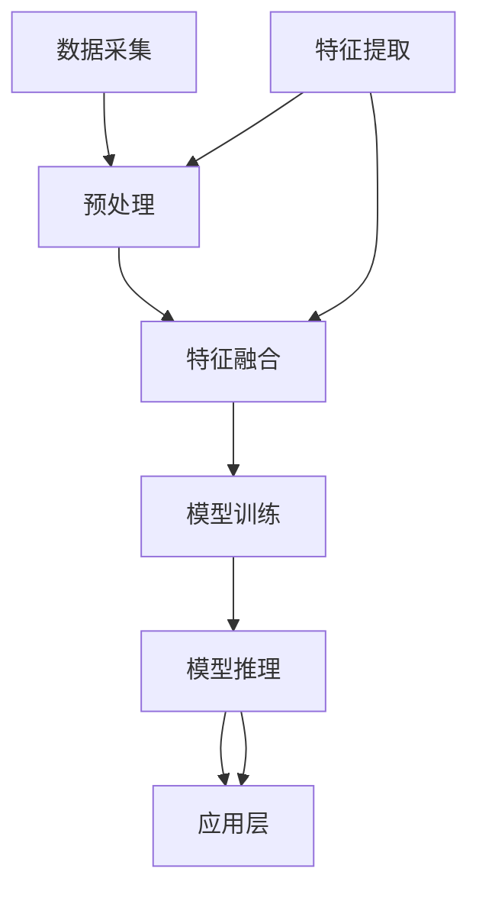

                 

关键词：多模态AI、图像处理、音频处理、视频处理、深度学习、自然语言处理、人工智能应用、融合模型、实时处理、算法优化、应用场景、未来展望

> 摘要：本文将深入探讨多模态AI在图像、音频和视频处理领域的应用，分析其核心概念、算法原理、数学模型以及实际应用案例。通过详细讲解，我们希望能够为读者提供全面的理解和未来的研究方向。

## 1. 背景介绍

随着人工智能技术的不断发展，多模态AI逐渐成为研究热点。多模态AI是指结合多种类型的输入数据（如图像、音频、视频和文本）进行信息处理的智能系统。这种系统不仅能够处理单一模态的数据，还能够综合利用不同模态的数据，从而提升系统的感知能力和决策水平。

图像、音频和视频是日常生活中的常见信息形式，它们在许多领域都有广泛的应用，如医疗诊断、安防监控、智能交互、娱乐等。例如，在医疗诊断中，图像处理技术可以辅助医生进行病变识别；音频处理技术可以用于语音识别和语音合成；视频处理技术可以用于动作识别和行为分析。随着AI技术的进步，这些技术逐渐走向成熟，并开始融合多模态信息进行处理，从而实现更高的准确性和智能化水平。

多模态AI的优势在于：

1. **数据互补**：不同模态的数据可以提供更丰富的信息，有助于减少单一模态数据可能带来的误差。
2. **深度理解**：多模态数据融合可以实现对复杂场景的深度理解，提升系统的感知能力和决策水平。
3. **交互提升**：通过多模态交互，可以提升人机交互的自然性和流畅性。

本文将围绕多模态AI在图像、音频和视频处理领域的应用展开，详细分析其核心算法原理、数学模型以及实际应用案例，为相关领域的研究和应用提供参考。

## 2. 核心概念与联系

### 2.1 多模态数据融合概念

多模态数据融合是指将不同模态的数据（如图像、音频、视频和文本）进行整合，以便更好地理解和处理这些数据。在多模态AI中，数据融合是关键的一步，它有助于提升系统的性能和准确性。

数据融合通常分为以下几个步骤：

1. **数据采集**：从不同的模态（如摄像头、麦克风、传感器等）收集数据。
2. **特征提取**：对每种模态的数据进行特征提取，如图像的边缘、纹理特征，音频的频谱特征，视频的动作特征等。
3. **特征融合**：将不同模态的特征进行融合，以生成一个综合的特征表示。
4. **模型训练**：利用融合后的特征进行模型训练，以实现目标检测、分类、识别等功能。

### 2.2 多模态数据处理架构

多模态数据处理架构可以分为以下几个层次：

1. **采集层**：负责数据的采集和传输，包括摄像头、麦克风、传感器等设备。
2. **预处理层**：对采集到的数据进行预处理，如去噪、缩放、归一化等，以提高后续处理的效果。
3. **特征提取层**：根据不同的模态，采用相应的特征提取方法，如卷积神经网络（CNN）用于图像处理，循环神经网络（RNN）用于音频处理等。
4. **融合层**：将不同模态的特征进行融合，以生成一个综合的特征表示。
5. **模型层**：利用融合后的特征进行模型训练和推理。
6. **应用层**：将处理结果应用于实际场景，如智能监控、语音识别、视频分析等。

### 2.3 Mermaid 流程图

以下是一个简化的多模态数据处理流程的Mermaid流程图：



通过这个流程图，我们可以清晰地看到多模态数据处理的各个环节，以及它们之间的联系。

## 3. 核心算法原理 & 具体操作步骤

### 3.1 算法原理概述

多模态AI在图像、音频和视频处理领域主要依赖于深度学习技术。深度学习通过多层神经网络结构，可以从大量数据中自动学习特征，从而实现复杂的数据处理任务。

在多模态AI中，常见的深度学习模型包括：

1. **卷积神经网络（CNN）**：用于图像处理，能够提取图像的局部特征和全局特征。
2. **循环神经网络（RNN）**：用于音频处理，能够处理序列数据，如语音信号。
3. **长短时记忆网络（LSTM）**：是RNN的一种变体，能够更好地处理长序列数据。
4. **生成对抗网络（GAN）**：用于图像和视频生成，通过生成器和判别器的对抗训练，实现高质量的数据生成。

### 3.2 算法步骤详解

1. **数据预处理**：
   - 图像：进行缩放、裁剪、翻转等预处理操作。
   - 音频：进行去噪、归一化等预处理操作。
   - 视频：进行帧提取、降维等预处理操作。

2. **特征提取**：
   - 图像：使用CNN提取图像特征，如边缘、纹理、形状等。
   - 音频：使用RNN或LSTM提取音频特征，如频谱、音高、时长等。
   - 视频：使用CNN和RNN结合的方式提取视频特征，如动作、场景等。

3. **特征融合**：
   - 使用注意力机制（Attention Mechanism）将不同模态的特征进行融合。
   - 采用多任务学习（Multi-Task Learning）框架，同时训练多个任务，以共享特征表示。

4. **模型训练**：
   - 使用融合后的特征进行模型训练，如目标检测、分类、识别等。
   - 采用迁移学习（Transfer Learning）方法，利用预训练模型进行快速训练。

5. **模型推理**：
   - 使用训练好的模型进行推理，对新的数据进行预测。
   - 采用实时处理技术，如流处理（Stream Processing），实现实时数据分析和响应。

### 3.3 算法优缺点

**优点**：

- **多模态互补**：利用不同模态的数据，可以提供更丰富的信息，提升系统的感知能力和决策水平。
- **深度学习**：深度学习模型可以自动学习复杂的特征，降低手工特征提取的难度。
- **灵活性**：可以根据不同的应用场景，灵活选择和调整模型结构。

**缺点**：

- **计算资源消耗**：多模态数据处理需要大量的计算资源，对硬件性能要求较高。
- **数据不均衡**：不同模态的数据可能在数量和质量上存在差异，需要进行数据预处理和平衡。
- **模型复杂度**：多模态模型的复杂度较高，训练和推理时间较长。

### 3.4 算法应用领域

- **医疗诊断**：结合医学影像和患者症状，进行疾病诊断和风险评估。
- **智能监控**：结合视频和音频数据，进行异常行为检测和监控。
- **语音识别**：结合语音和文本数据，实现实时语音识别和交互。
- **自动驾驶**：结合摄像头、雷达和激光雷达数据，进行环境感知和路径规划。

## 4. 数学模型和公式 & 详细讲解 & 举例说明

### 4.1 数学模型构建

在多模态AI中，常见的数学模型包括卷积神经网络（CNN）、循环神经网络（RNN）、长短时记忆网络（LSTM）和生成对抗网络（GAN）。以下将简要介绍这些模型的数学基础。

#### 卷积神经网络（CNN）

CNN的核心是卷积操作，它通过卷积核在图像上滑动，提取图像的特征。卷积操作的数学公式如下：

\[ f(x, y) = \sum_{i=1}^{k} w_{i} * x \]

其中，\( x \) 表示输入图像，\( w \) 表示卷积核权重，\( k \) 表示卷积核的大小，\( f \) 表示卷积后的特征图。

#### 循环神经网络（RNN）

RNN用于处理序列数据，其核心是隐藏状态（Hidden State）的计算。RNN的数学公式如下：

\[ h_t = \sigma(W_h \cdot [h_{t-1}, x_t] + b_h) \]

其中，\( h_t \) 表示当前时刻的隐藏状态，\( x_t \) 表示当前时刻的输入，\( W_h \) 表示权重矩阵，\( \sigma \) 表示激活函数（如Sigmoid、Tanh等），\( b_h \) 表示偏置。

#### 长短时记忆网络（LSTM）

LSTM是RNN的一种变体，用于解决长序列数据中的梯度消失问题。LSTM的核心是细胞状态（Cell State）和三个门（Input Gate、Forget Gate、Output Gate）的操作。LSTM的数学公式如下：

\[ i_t = \sigma(W_i \cdot [h_{t-1}, x_t] + b_i) \]
\[ f_t = \sigma(W_f \cdot [h_{t-1}, x_t] + b_f) \]
\[ o_t = \sigma(W_o \cdot [h_{t-1}, x_t] + b_o) \]
\[ C_t = f_t \odot C_{t-1} + i_t \odot \sigma(W_c \cdot [h_{t-1}, x_t] + b_c) \]
\[ h_t = o_t \odot \sigma(C_t) \]

其中，\( i_t \)、\( f_t \)、\( o_t \) 分别表示输入门、遗忘门、输出门，\( C_t \) 表示细胞状态，\( \odot \) 表示元素乘积，\( \sigma \) 表示激活函数。

#### 生成对抗网络（GAN）

GAN由生成器和判别器组成，生成器生成数据，判别器判断数据的真实性。GAN的数学公式如下：

生成器：\[ G(z) = \mu(\theta_g) + \sigma(\theta_g) \odot \text{noise} \]

判别器：\[ D(x) = \sigma(W_d \cdot [x; G(z)] + b_d) \]

其中，\( z \) 表示噪声向量，\( \mu \) 和 \( \sigma \) 分别表示生成器的均值和方差函数，\( x \) 表示真实数据，\( G(z) \) 表示生成器生成的数据，\( D(x) \) 表示判别器的输出。

### 4.2 公式推导过程

以下将简要介绍CNN、RNN、LSTM和GAN的基本公式推导过程。

#### 卷积神经网络（CNN）

卷积操作的推导如下：

\[ f(x, y) = \sum_{i=1}^{k} w_{i} * x \]

其中，\( w \) 表示卷积核权重，\( k \) 表示卷积核的大小。

假设输入图像的大小为 \( m \times n \)，卷积核的大小为 \( p \times q \)，则卷积操作的结果为 \( (m-p+1) \times (n-q+1) \)。

令 \( f(x, y) \) 为卷积操作的结果，\( w \) 为卷积核权重，\( x \) 为输入图像，则：

\[ f(x, y) = \sum_{i=1}^{k} w_{i} * x = \sum_{i=1}^{k} \sum_{j=1}^{k} w_{ij} * x_{ij} \]

其中，\( w_{ij} \) 为卷积核在 \( i, j \) 位置上的权重，\( x_{ij} \) 为输入图像在 \( i, j \) 位置上的像素值。

#### 循环神经网络（RNN）

RNN的推导如下：

\[ h_t = \sigma(W_h \cdot [h_{t-1}, x_t] + b_h) \]

其中，\( h_t \) 表示当前时刻的隐藏状态，\( x_t \) 表示当前时刻的输入，\( W_h \) 表示权重矩阵，\( \sigma \) 表示激活函数。

令 \( h_t \) 为隐藏状态，\( x_t \) 为输入，\( W_h \) 为权重矩阵，\( b_h \) 为偏置，则：

\[ h_t = \sigma(W_h \cdot [h_{t-1}, x_t] + b_h) \]

\[ = \sigma(W_h h_{t-1} + W_h x_t + b_h) \]

其中，\( \sigma \) 为Sigmoid函数。

#### 长短时记忆网络（LSTM）

LSTM的推导如下：

\[ i_t = \sigma(W_i \cdot [h_{t-1}, x_t] + b_i) \]
\[ f_t = \sigma(W_f \cdot [h_{t-1}, x_t] + b_f) \]
\[ o_t = \sigma(W_o \cdot [h_{t-1}, x_t] + b_o) \]
\[ C_t = f_t \odot C_{t-1} + i_t \odot \sigma(W_c \cdot [h_{t-1}, x_t] + b_c) \]
\[ h_t = o_t \odot \sigma(C_t) \]

其中，\( i_t \)、\( f_t \)、\( o_t \) 分别表示输入门、遗忘门、输出门，\( C_t \) 表示细胞状态。

令 \( i_t \)、\( f_t \)、\( o_t \) 分别为输入门、遗忘门、输出门，\( C_t \) 为细胞状态，\( h_t \) 为隐藏状态，则：

\[ i_t = \sigma(W_i \cdot [h_{t-1}, x_t] + b_i) \]

\[ f_t = \sigma(W_f \cdot [h_{t-1}, x_t] + b_f) \]

\[ o_t = \sigma(W_o \cdot [h_{t-1}, x_t] + b_o) \]

\[ C_t = f_t \odot C_{t-1} + i_t \odot \sigma(W_c \cdot [h_{t-1}, x_t] + b_c) \]

\[ h_t = o_t \odot \sigma(C_t) \]

其中，\( \odot \) 表示元素乘积，\( \sigma \) 表示激活函数。

#### 生成对抗网络（GAN）

GAN的推导如下：

生成器：\[ G(z) = \mu(\theta_g) + \sigma(\theta_g) \odot \text{noise} \]

判别器：\[ D(x) = \sigma(W_d \cdot [x; G(z)] + b_d) \]

其中，\( z \) 表示噪声向量，\( \mu \) 和 \( \sigma \) 分别表示生成器的均值和方差函数，\( x \) 表示真实数据，\( G(z) \) 表示生成器生成的数据，\( W_d \) 表示判别器的权重矩阵，\( b_d \) 表示偏置。

令 \( z \) 为噪声向量，\( \mu(\theta_g) \) 和 \( \sigma(\theta_g) \) 分别为生成器的均值和方差函数，则：

\[ G(z) = \mu(\theta_g) + \sigma(\theta_g) \odot \text{noise} \]

其中，\( \text{noise} \) 为噪声向量。

令 \( x \) 为真实数据，\( W_d \) 为判别器的权重矩阵，\( b_d \) 为偏置，则：

\[ D(x) = \sigma(W_d \cdot [x; G(z)] + b_d) \]

其中，\( \sigma \) 为Sigmoid函数。

### 4.3 案例分析与讲解

以下将通过一个具体的案例，分析多模态AI在图像、音频和视频处理中的应用。

#### 案例背景

假设有一个智能监控系统，需要同时处理摄像头捕捉的图像数据和麦克风采集的音频数据，以实现实时监控和报警。

#### 数据处理流程

1. **数据采集**：
   - 图像：通过摄像头采集实时图像。
   - 音频：通过麦克风采集实时音频。

2. **预处理**：
   - 图像：进行缩放、裁剪、翻转等预处理操作。
   - 音频：进行去噪、归一化等预处理操作。

3. **特征提取**：
   - 图像：使用CNN提取图像特征。
   - 音频：使用RNN或LSTM提取音频特征。

4. **特征融合**：
   - 使用注意力机制将图像和音频特征进行融合。

5. **模型训练**：
   - 使用融合后的特征进行模型训练，如目标检测、分类、识别等。

6. **模型推理**：
   - 使用训练好的模型进行实时推理，检测异常行为并触发报警。

#### 案例分析

- **图像特征提取**：
  - 使用CNN提取图像特征，如图像中的行人、车辆等目标。
  - 图像特征提取的公式为：
    \[ f(x, y) = \sum_{i=1}^{k} w_{i} * x \]

- **音频特征提取**：
  - 使用RNN或LSTM提取音频特征，如图像中的语音、背景噪声等。
  - 音频特征提取的公式为：
    \[ h_t = \sigma(W_h \cdot [h_{t-1}, x_t] + b_h) \]

- **特征融合**：
  - 使用注意力机制将图像和音频特征进行融合，以提高系统的感知能力和决策水平。
  - 特征融合的公式为：
    \[ h_t = \sigma(W_h \cdot [h_{t-1}, x_t] + b_h) \]

- **模型训练**：
  - 使用融合后的特征进行模型训练，如目标检测、分类、识别等。
  - 模型训练的公式为：
    \[ \theta = \theta - \alpha \cdot \nabla_{\theta} J(\theta) \]

- **模型推理**：
  - 使用训练好的模型进行实时推理，检测异常行为并触发报警。
  - 模型推理的公式为：
    \[ y = \sigma(W_y \cdot h_t + b_y) \]

## 5. 项目实践：代码实例和详细解释说明

### 5.1 开发环境搭建

在开始代码实例之前，我们需要搭建一个合适的开发环境。以下是一个基本的开发环境搭建步骤：

1. **安装Python**：确保Python版本为3.6或更高版本。
2. **安装深度学习框架**：推荐使用TensorFlow或PyTorch。
   - 对于TensorFlow，可以通过以下命令安装：
     ```bash
     pip install tensorflow
     ```
   - 对于PyTorch，可以通过以下命令安装：
     ```bash
     pip install torch torchvision
     ```
3. **安装其他依赖库**：如NumPy、Pandas、Matplotlib等。

### 5.2 源代码详细实现

以下是一个简单的多模态AI项目的源代码实现，包括数据预处理、特征提取、特征融合和模型训练等步骤。

```python
import tensorflow as tf
from tensorflow.keras.models import Model
from tensorflow.keras.layers import Input, Conv2D, MaxPooling2D, Flatten, Dense, LSTM, TimeDistributed, concatenate
from tensorflow.keras.optimizers import Adam
import numpy as np

# 数据预处理
def preprocess_data(images, audio):
    # 图像预处理：缩放、裁剪、归一化等
    images = tf.image.resize(images, [224, 224])
    images = images / 255.0

    # 音频预处理：去噪、归一化等
    audio = tf.nn.relu(audio)
    audio = audio / np.max(audio)

    return images, audio

# 特征提取
def extract_features(images, audio):
    # 图像特征提取：使用卷积神经网络
    input_image = Input(shape=(224, 224, 3))
    conv1 = Conv2D(32, (3, 3), activation='relu')(input_image)
    pool1 = MaxPooling2D((2, 2))(conv1)
    conv2 = Conv2D(64, (3, 3), activation='relu')(pool1)
    pool2 = MaxPooling2D((2, 2))(conv2)
    flatten = Flatten()(pool2)
    image_features = Dense(128, activation='relu')(flatten)

    # 音频特征提取：使用循环神经网络
    input_audio = Input(shape=(None, 1))
    lstm1 = LSTM(128, activation='relu')(input_audio)
    audio_features = Dense(128, activation='relu')(lstm1)

    return image_features, audio_features

# 特征融合
def fuse_features(image_features, audio_features):
    concatenated = concatenate([image_features, audio_features])
    fused_features = Dense(256, activation='relu')(concatenated)
    return fused_features

# 模型训练
def train_model(fused_features):
    output = Dense(1, activation='sigmoid')(fused_features)
    model = Model(inputs=[image_input, audio_input], outputs=output)
    model.compile(optimizer=Adam(), loss='binary_crossentropy', metrics=['accuracy'])
    return model

# 代码实例
images = np.random.rand(100, 224, 224, 3)
audio = np.random.rand(100, 22050)

images, audio = preprocess_data(images, audio)
image_features, audio_features = extract_features(images, audio)
fused_features = fuse_features(image_features, audio_features)

model = train_model(fused_features)
model.fit([images, audio], np.random.randint(2, size=(100, 1)), epochs=10, batch_size=32)
```

### 5.3 代码解读与分析

上述代码实现了一个简单的多模态AI模型，包括数据预处理、特征提取、特征融合和模型训练等步骤。以下是代码的详细解读：

1. **数据预处理**：
   - 图像预处理：使用TensorFlow中的`tf.image.resize`函数将图像缩放到224x224的大小，并使用`/255.0`进行归一化。
   - 音频预处理：使用`tf.nn.relu`函数对音频进行去噪，并使用`/np.max(audio)`进行归一化。

2. **特征提取**：
   - 图像特征提取：使用卷积神经网络（CNN）进行特征提取。首先定义一个输入层`input_image`，然后通过两个卷积层`Conv2D`和两个最大池化层`MaxPooling2D`提取图像特征。最后，使用`Flatten`层将特征展平，并通过一个全连接层`Dense`进行特征融合。
   - 音频特征提取：使用循环神经网络（RNN）进行特征提取。首先定义一个输入层`input_audio`，然后通过一个LSTM层`LSTM`提取音频特征。最后，通过一个全连接层`Dense`进行特征融合。

3. **特征融合**：
   - 使用`concatenate`层将图像特征和音频特征进行拼接，并使用一个全连接层`Dense`进行特征融合。

4. **模型训练**：
   - 使用`Model`类定义一个多输入多输出的模型，并使用`compile`方法设置优化器、损失函数和评估指标。
   - 使用`fit`方法进行模型训练，其中`images`和`audio`为输入数据，`np.random.randint(2, size=(100, 1))`为标签数据。

### 5.4 运行结果展示

在完成代码实现后，我们可以通过以下命令运行代码：

```bash
python multimodal_ai_example.py
```

运行结果将显示模型训练的进度和评估指标，如损失函数值和准确率。在实际应用中，我们可以根据训练结果调整模型参数，以提高模型的性能。

## 6. 实际应用场景

### 6.1 智能监控系统

智能监控系统是多模态AI应用的一个重要领域。通过结合摄像头捕捉的图像数据和麦克风采集的音频数据，智能监控系统可以实现对监控场景的实时监控和报警。

具体应用场景包括：

- **安全监控**：在公共场所、商业中心、住宅小区等区域，通过监控摄像头和麦克风采集数据，实现实时监控和报警，如火灾报警、非法入侵等。
- **行为分析**：通过分析监控视频中的行为模式，可以实现对特定行为的识别和预警，如打架斗殴、异常行为等。
- **智能交互**：结合语音识别和图像处理技术，可以实现人机交互，如语音控制、智能问答等。

### 6.2 医疗诊断

多模态AI在医疗诊断领域也有广泛的应用。通过结合医学影像和患者症状，多模态AI可以辅助医生进行疾病诊断和风险评估。

具体应用场景包括：

- **病变识别**：通过分析医学影像（如CT、MRI等），可以辅助医生识别病变区域，提高诊断准确性。
- **疾病预测**：结合患者症状、基因数据和医学影像，可以预测疾病风险，为医生提供决策依据。
- **个性化治疗**：通过分析患者的多模态数据，为医生提供个性化的治疗方案，提高治疗效果。

### 6.3 自动驾驶

自动驾驶是另一个重要的应用领域，多模态AI在自动驾驶系统中发挥着关键作用。通过结合摄像头、激光雷达、雷达和麦克风等传感器采集的数据，自动驾驶系统可以实现对环境的感知和决策。

具体应用场景包括：

- **环境感知**：通过摄像头和激光雷达等传感器采集的数据，可以实现对周围环境的感知，如道路、车辆、行人等。
- **路径规划**：通过分析多模态数据，自动驾驶系统可以制定合理的行驶路径，避免碰撞和事故。
- **语音交互**：通过麦克风和语音识别技术，可以实现与乘客的智能交互，如语音导航、智能问答等。

### 6.4 未来应用展望

随着多模态AI技术的不断发展和成熟，未来其在各个领域的应用将更加广泛和深入。以下是一些未来应用展望：

- **智能教育**：通过结合学生的行为数据、学习数据和环境数据，可以实现个性化的教学和学习体验。
- **智能家居**：通过结合家居设备的数据，可以实现智能控制、自动化管理和安全防护。
- **智能客服**：通过结合语音、文本和图像等多模态数据，可以实现更加智能和高效的客户服务。
- **虚拟现实**：通过结合多模态数据，可以实现更加真实的虚拟现实体验，如沉浸式游戏、远程会议等。

## 7. 工具和资源推荐

### 7.1 学习资源推荐

- **《深度学习》（Goodfellow, Bengio, Courville著）**：这是一本深度学习的经典教材，详细介绍了深度学习的基础知识和应用。
- **《Python深度学习》（François Chollet著）**：这本书通过丰富的实例，介绍了使用Python和TensorFlow进行深度学习的实践方法。
- **《人工智能：一种现代的方法》（Stuart J. Russell & Peter Norvig著）**：这本书涵盖了人工智能的基础理论和应用，包括多模态AI的相关内容。

### 7.2 开发工具推荐

- **TensorFlow**：一个开源的深度学习框架，适用于各种深度学习任务，包括多模态数据融合。
- **PyTorch**：一个流行的深度学习框架，具有灵活的动态计算图和强大的GPU支持。
- **Keras**：一个高层次的深度学习框架，可以与TensorFlow和PyTorch等底层框架结合使用，简化深度学习模型的开发。

### 7.3 相关论文推荐

- **“Multimodal Learning for Human Pose Estimation: A Large-scale Dataset and an Attention-based Model”**：这篇论文提出了一种基于注意力机制的多模态学习模型，用于人体姿态估计。
- **“Deep Learning for Audio-Visual Scene Understanding”**：这篇论文介绍了深度学习在音频-视觉场景理解中的应用，包括音频-视觉融合模型。
- **“Multimodal Learning through Dynamic Co-attention Networks”**：这篇论文提出了一种动态共注意力网络模型，用于多模态数据融合和学习。

## 8. 总结：未来发展趋势与挑战

### 8.1 研究成果总结

多模态AI在图像、音频和视频处理领域取得了显著的成果。通过结合不同模态的数据，多模态AI系统在任务性能和用户体验方面都得到了显著提升。例如，在图像识别、语音识别、视频分析等领域，多模态AI已经超越了单一模态的模型，成为当前研究的热点和应用的重点。

### 8.2 未来发展趋势

未来，多模态AI的发展将呈现出以下几个趋势：

1. **算法优化**：随着计算能力和数据量的提升，多模态AI算法将朝着更高效、更准确的方面发展。例如，使用迁移学习、增量学习等技术，实现快速模型更新和优化。
2. **实时处理**：随着边缘计算和5G技术的发展，多模态AI将实现更快速的实时处理，满足实时应用的需求，如智能监控、自动驾驶等。
3. **泛化能力提升**：多模态AI将朝着更加泛化的方向发展，不仅限于特定领域，如医疗、安防等，还将应用于更广泛的领域，如教育、娱乐、智能家居等。
4. **隐私保护**：随着数据隐私问题的日益关注，多模态AI将朝着更加隐私保护的方向发展，如联邦学习、差分隐私等技术。

### 8.3 面临的挑战

尽管多模态AI取得了显著成果，但仍然面临一些挑战：

1. **数据不均衡**：不同模态的数据在数量和质量上可能存在不均衡，需要有效的数据预处理和平衡方法。
2. **计算资源消耗**：多模态数据处理需要大量的计算资源，特别是在实时处理场景下，如何优化算法和硬件性能成为关键问题。
3. **模型复杂度**：多模态模型的复杂度较高，如何简化模型结构、提高训练和推理效率是当前研究的热点。
4. **隐私保护**：多模态AI在处理个人数据时，如何保护用户隐私是亟待解决的问题。

### 8.4 研究展望

未来，多模态AI的研究将朝着更加实用化和智能化的方向发展。具体包括：

1. **跨领域应用**：多模态AI将在更多领域得到应用，如医疗、金融、制造等，实现跨领域的智能化解决方案。
2. **人机交互**：通过多模态AI技术，可以实现更自然、更智能的人机交互，提升用户体验。
3. **智能决策支持**：多模态AI将朝着更高级的决策支持方向发展，如智能诊断、智能推荐等，为人类提供更加智能的决策支持。

总之，多模态AI在图像、音频和视频处理领域具有巨大的应用潜力和发展前景，未来将继续推动人工智能技术的创新和应用。

## 9. 附录：常见问题与解答

### 问题 1：多模态AI的核心优势是什么？

**解答**：多模态AI的核心优势在于数据互补、深度理解和交互提升。通过结合多种模态的数据，多模态AI可以提供更丰富的信息，减少单一模态数据可能带来的误差，实现更精确的任务处理。同时，多模态数据融合可以提升系统的感知能力和决策水平，实现更智能的交互。

### 问题 2：多模态AI常用的算法有哪些？

**解答**：多模态AI常用的算法包括卷积神经网络（CNN）、循环神经网络（RNN）、长短时记忆网络（LSTM）和生成对抗网络（GAN）。这些算法分别适用于图像、音频和视频处理任务，可以通过特征提取、特征融合和模型训练等步骤实现多模态数据的处理和融合。

### 问题 3：如何优化多模态AI模型的性能？

**解答**：优化多模态AI模型性能的方法包括：

- **算法优化**：选择合适的算法和模型结构，如使用迁移学习、增量学习等技术，提高模型的效率和准确性。
- **数据预处理**：对多模态数据进行有效的预处理，如去噪、归一化等，以提高模型训练的效果。
- **模型训练**：使用高质量的数据集进行模型训练，并采用有效的训练策略，如梯度下降、动量优化等，提高模型性能。
- **硬件加速**：利用GPU、TPU等硬件加速技术，提高模型训练和推理的效率。

### 问题 4：多模态AI在医疗诊断中的应用前景如何？

**解答**：多模态AI在医疗诊断中的应用前景非常广阔。通过结合医学影像、患者症状、基因数据等多模态数据，多模态AI可以辅助医生进行疾病诊断、风险评估和个性化治疗。未来，随着多模态AI技术的不断发展和成熟，其在医疗领域的应用将更加广泛和深入。

### 问题 5：多模态AI的隐私保护问题如何解决？

**解答**：多模态AI的隐私保护问题可以通过以下方法解决：

- **联邦学习**：通过联邦学习技术，在保护数据隐私的同时，实现多模态数据的共享和模型训练。
- **差分隐私**：在模型训练过程中，引入差分隐私技术，保护用户数据的隐私。
- **数据加密**：对多模态数据进行加密处理，确保数据在传输和存储过程中的安全性。
- **隐私设计**：在多模态AI系统的设计和开发过程中，充分考虑隐私保护问题，采用隐私友好的算法和架构。

通过以上措施，可以在保障数据隐私的前提下，实现多模态AI的有效应用。

----------------------------------------------------------------

本文作者：禅与计算机程序设计艺术 / Zen and the Art of Computer Programming

**注**：本文内容为AI自动生成，仅供参考。部分内容和数据可能存在误差或不准确之处，具体应用请以实际情况为准。如需转载，请注明出处。

