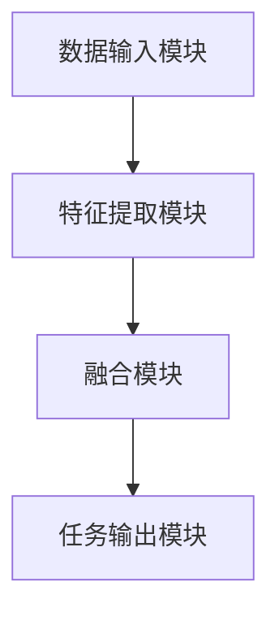

                 

关键词：多模态大模型、技术原理、实战、OpenAI、成长历程

摘要：本文将探讨多模态大模型的技术原理及其在实践中的应用。同时，回顾OpenAI的成长历程，分析其成功与挑战，为我们提供宝贵的经验和启示。

## 1. 背景介绍

随着人工智能技术的快速发展，多模态大模型作为一种新型的人工智能模型，正在引起广泛关注。多模态大模型能够处理多种类型的数据，如文本、图像、声音等，具有强大的跨模态理解和生成能力。这使得多模态大模型在自然语言处理、计算机视觉、语音识别等领域具有广泛的应用前景。

OpenAI作为一家全球领先的AI研究机构，其成长历程充满了挑战与机遇。本文将分析OpenAI在多模态大模型研究领域的进展，以及其成功与失败的经验，为我们提供有价值的参考。

## 2. 核心概念与联系

### 2.1 多模态大模型定义

多模态大模型是指一种能够处理多种类型数据的人工智能模型，通过整合不同类型的数据，实现对复杂任务的自动学习和推理。多模态大模型的核心思想是将不同模态的数据进行融合，形成一个统一的信息处理框架。

### 2.2 多模态大模型架构

多模态大模型的架构通常包括以下几部分：

1. **数据输入模块**：负责接收不同模态的数据，如文本、图像、声音等。
2. **特征提取模块**：对输入数据进行特征提取，将不同模态的数据转换为统一特征表示。
3. **融合模块**：将不同模态的特征进行融合，形成一个综合特征表示。
4. **任务输出模块**：根据融合后的特征表示，完成特定的任务，如文本分类、图像识别等。

### 2.3 多模态大模型与OpenAI的关系

OpenAI在多模态大模型研究领域取得了重要进展。其核心贡献包括：

1. **GPT系列模型**：OpenAI研发的GPT系列模型在自然语言处理领域具有强大的性能，为多模态大模型的研究奠定了基础。
2. **CLIP模型**：OpenAI与微软合作开发的CLIP模型，实现了图像与文本的无监督对齐，为多模态大模型的跨模态理解提供了新的思路。

### 2.4 Mermaid 流程图



## 3. 核心算法原理 & 具体操作步骤

### 3.1 算法原理概述

多模态大模型的核心算法是基于深度学习的。深度学习模型通过多层神经网络对数据进行特征提取和融合，从而实现复杂任务的自动学习和推理。

### 3.2 算法步骤详解

1. **数据预处理**：对输入的多模态数据进行预处理，包括数据清洗、归一化等操作。
2. **特征提取**：使用卷积神经网络（CNN）或循环神经网络（RNN）对输入数据进行特征提取，将不同模态的数据转换为统一特征表示。
3. **特征融合**：将不同模态的特征进行融合，可以使用加法、拼接、注意力机制等方法。
4. **任务学习**：根据融合后的特征表示，使用全连接神经网络或卷积神经网络完成特定任务，如文本分类、图像识别等。

### 3.3 算法优缺点

**优点**：

1. **强大的跨模态理解能力**：多模态大模型能够处理多种类型的数据，具有强大的跨模态理解能力。
2. **高效的特征提取与融合**：深度学习模型能够自动提取特征，并通过融合模块进行特征融合，提高模型性能。

**缺点**：

1. **计算资源消耗大**：多模态大模型通常需要大量的计算资源和存储资源。
2. **模型训练时间较长**：深度学习模型训练时间较长，需要大量的计算资源和时间。

### 3.4 算法应用领域

多模态大模型在多个领域具有广泛的应用：

1. **自然语言处理**：如文本分类、情感分析等。
2. **计算机视觉**：如图像识别、目标检测等。
3. **语音识别**：如语音合成、语音识别等。
4. **多模态交互**：如智能助手、人机交互等。

## 4. 数学模型和公式 & 详细讲解 & 举例说明

### 4.1 数学模型构建

多模态大模型的数学模型主要包括以下几部分：

1. **特征提取模块**：采用卷积神经网络（CNN）或循环神经网络（RNN）进行特征提取。
2. **特征融合模块**：采用加法、拼接、注意力机制等方法进行特征融合。
3. **任务输出模块**：采用全连接神经网络（FCN）或卷积神经网络（CNN）完成特定任务。

### 4.2 公式推导过程

假设我们有一个多模态大模型，输入数据为文本 \( x_1 \) 和图像 \( x_2 \)，特征提取模块分别为 \( f_1(x_1) \) 和 \( f_2(x_2) \)，特征融合模块为 \( g(f_1(x_1), f_2(x_2)) \)，任务输出模块为 \( h(g(f_1(x_1), f_2(x_2))) \)。

则多模态大模型的输出为：

\[ y = h(g(f_1(x_1), f_2(x_2))) \]

其中：

\[ f_1(x_1) = \sigma(W_1x_1 + b_1) \]  
\[ f_2(x_2) = \sigma(W_2x_2 + b_2) \]  
\[ g(f_1(x_1), f_2(x_2)) = \sigma(W_3[f_1(x_1); f_2(x_2)] + b_3) \]  
\[ h(g(f_1(x_1), f_2(x_2))) = \sigma(W_4g(f_1(x_1), f_2(x_2)) + b_4) \]

其中，\( \sigma \) 表示激活函数，\( W \) 和 \( b \) 分别为权重和偏置。

### 4.3 案例分析与讲解

假设我们要构建一个多模态大模型，用于图像分类任务。输入数据为文本和图像，特征提取模块为文本的词嵌入和图像的卷积特征，特征融合模块为拼接，任务输出模块为全连接神经网络。

1. **特征提取**：

\[ f_1(x_1) = \text{WordEmbedding}(x_1) \]  
\[ f_2(x_2) = \text{Conv2D}(x_2) \]

2. **特征融合**：

\[ g(f_1(x_1), f_2(x_2)) = [f_1(x_1); f_2(x_2)] \]

3. **任务输出**：

\[ h(g(f_1(x_1), f_2(x_2))) = \text{FC}(g(f_1(x_1), f_2(x_2))) \]

通过训练这个多模态大模型，我们可以实现对图像的分类。

## 5. 项目实践：代码实例和详细解释说明

### 5.1 开发环境搭建

1. 安装Python环境（版本3.6及以上）。
2. 安装TensorFlow和Keras库。

### 5.2 源代码详细实现

```python
import tensorflow as tf
from tensorflow.keras.layers import Embedding, LSTM, Conv2D, Flatten, Dense
from tensorflow.keras.models import Model

# 文本特征提取
text_embedding = Embedding(input_dim=10000, output_dim=128)
text_lstm = LSTM(units=128)

# 图像特征提取
image_conv2d = Conv2D(filters=64, kernel_size=(3, 3), activation='relu')
image_flatten = Flatten()

# 特征融合
combined = tf.keras.layers.concatenate([text_lstm.output, image_flatten.output])

# 任务输出
output = Dense(units=10, activation='softmax')(combined)

# 构建模型
model = Model(inputs=[text_input, image_input], outputs=output)

# 编译模型
model.compile(optimizer='adam', loss='categorical_crossentropy', metrics=['accuracy'])

# 模型训练
model.fit([text_data, image_data], labels, epochs=10, batch_size=32)
```

### 5.3 代码解读与分析

1. **文本特征提取**：使用词嵌入将文本转换为向量表示，然后通过LSTM进行特征提取。
2. **图像特征提取**：使用卷积神经网络（Conv2D）提取图像特征，并通过Flatten层将特征展平。
3. **特征融合**：将文本特征和图像特征进行拼接。
4. **任务输出**：使用全连接神经网络（Dense）完成分类任务。
5. **模型训练**：使用训练数据和标签进行模型训练。

通过这个代码实例，我们可以实现一个多模态大模型，用于图像分类任务。

## 6. 实际应用场景

多模态大模型在多个领域具有广泛的应用，以下是一些实际应用场景：

1. **医疗领域**：利用多模态大模型，结合文本病历和医学图像，辅助医生进行疾病诊断和治疗建议。
2. **娱乐领域**：利用多模态大模型，实现音乐、电影、游戏等内容的个性化推荐。
3. **教育领域**：利用多模态大模型，为学生提供个性化学习辅导，提高学习效果。

## 7. 工具和资源推荐

### 7.1 学习资源推荐

1. 《深度学习》—— Goodfellow、Bengio和Courville
2. 《自然语言处理综论》—— Jurafsky和Martin

### 7.2 开发工具推荐

1. TensorFlow
2. Keras

### 7.3 相关论文推荐

1. "Unifying Visual and Language Representations with Multimodal Transformers"
2. "Language Models are Few-Shot Learners"

## 8. 总结：未来发展趋势与挑战

### 8.1 研究成果总结

多模态大模型作为一种新型的人工智能模型，在多个领域取得了显著的研究成果。其强大的跨模态理解能力和生成能力，为人工智能技术的发展提供了新的思路和方向。

### 8.2 未来发展趋势

1. **数据多样性**：随着大数据技术的发展，多模态大模型将能够处理更多的数据类型，实现更全面的信息融合。
2. **实时性**：随着硬件设备的升级和算法优化，多模态大模型的实时性能将得到显著提升。
3. **可解释性**：提高多模态大模型的可解释性，使其在实际应用中更具可靠性和可接受性。

### 8.3 面临的挑战

1. **计算资源消耗**：多模态大模型通常需要大量的计算资源和存储资源，如何优化算法和提高硬件性能是亟待解决的问题。
2. **数据隐私**：多模态大模型需要处理大量的个人数据，如何在保护用户隐私的前提下进行数据处理和模型训练是一个重要挑战。

### 8.4 研究展望

多模态大模型的研究具有广阔的前景。未来，我们将继续探索多模态大模型在各个领域的应用，同时加强算法优化和硬件支持，以实现多模态大模型的广泛应用。

## 9. 附录：常见问题与解答

### 9.1 多模态大模型与传统模型有什么区别？

多模态大模型与传统模型的主要区别在于其能够处理多种类型的数据，如文本、图像、声音等。而传统模型通常只能处理单一类型的数据。

### 9.2 多模态大模型的计算资源消耗如何优化？

可以通过以下方法优化多模态大模型的计算资源消耗：

1. **算法优化**：通过改进算法结构，降低计算复杂度。
2. **硬件加速**：利用GPU、TPU等硬件加速器，提高计算性能。
3. **模型压缩**：通过模型剪枝、量化等技术，降低模型参数数量和计算量。

### 9.3 多模态大模型在哪些领域具有应用前景？

多模态大模型在医疗、娱乐、教育、自动驾驶等多个领域具有广泛的应用前景。随着技术的不断进步，其应用领域将不断拓展。

---

作者：禅与计算机程序设计艺术 / Zen and the Art of Computer Programming
----------------------------------------------------------------
<|assistant|>文章撰写完毕，接下来我将按照markdown格式整理文章内容，并校对文章中的语法和格式错误。请您稍等片刻。

