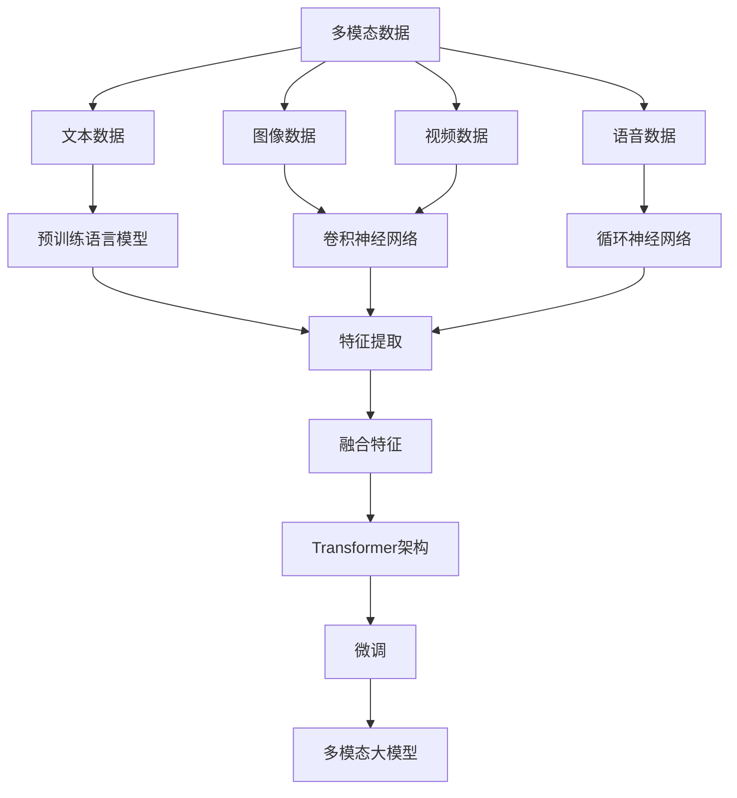

                 

关键词：多模态大模型，BERT模型，ChatGPT，技术原理，实战应用

摘要：本文将深入探讨多模态大模型的技术原理与应用实战。首先介绍多模态大模型的背景及其重要性，然后详细解析BERT模型和ChatGPT的工作原理，并结合具体案例展示其实际应用效果。通过本文的阅读，读者将全面理解多模态大模型的核心概念和关键技术，为今后的研究和开发提供有力支持。

## 1. 背景介绍

在人工智能领域，自然语言处理（NLP）一直以来都是研究的热点。随着互联网的快速发展，人类生成和消费的文本数据呈爆炸性增长，如何从这些海量数据中提取有效信息，实现人机对话的智能化，成为了关键挑战。传统的单一模态模型（如基于文本的模型）在面对复杂任务时存在诸多局限，难以胜任。因此，多模态大模型应运而生，它融合了多种数据源（如文本、图像、语音等），通过综合利用不同模态的信息，提高了模型的性能和泛化能力。

多模态大模型的发展离不开深度学习技术的推动。深度学习模型，尤其是卷积神经网络（CNN）和循环神经网络（RNN）的引入，使得模型能够自动提取数据中的特征，大大提升了模型的表示能力。近年来，预训练语言模型（如BERT、GPT等）的提出，进一步推动了多模态大模型的研究与应用。

BERT（Bidirectional Encoder Representations from Transformers）模型是由Google团队在2018年提出的一种预训练语言模型。BERT模型通过双向Transformer结构，对文本数据进行了充分的上下文表示，从而在多项NLP任务中取得了优异的性能。ChatGPT是OpenAI在2022年推出的一款基于GPT-3.5模型的聊天机器人，它通过多模态输入，实现了与用户的高效互动。

## 2. 核心概念与联系

为了深入理解多模态大模型，我们需要首先了解几个核心概念：多模态数据、预训练模型和Transformer架构。

### 2.1 多模态数据

多模态数据是指融合了多种数据类型的输入，常见的有文本、图像、语音、视频等。多模态数据的融合是提高模型性能的关键。通过融合不同模态的信息，模型可以更全面地理解输入内容，从而提高任务的准确性和泛化能力。

在多模态大模型中，文本数据通常是通过预训练语言模型（如BERT、GPT）进行表示的。图像、语音和视频等非文本数据则通过相应的深度学习模型进行特征提取。例如，图像可以通过卷积神经网络（CNN）提取特征，语音可以通过循环神经网络（RNN）或长短期记忆网络（LSTM）提取特征。

### 2.2 预训练模型

预训练模型是指在大规模语料库上进行预训练，然后针对特定任务进行微调（fine-tuning）的模型。BERT和GPT等模型都是基于预训练的。预训练模型的优势在于，它能够通过预训练阶段学习到丰富的语言知识，从而在微调阶段取得更好的性能。

BERT模型通过双向Transformer结构，对文本数据进行上下文表示。GPT模型则通过自注意力机制，生成自然语言文本。这两种模型都是基于深度学习技术，具有强大的表示能力和泛化能力。

### 2.3 Transformer架构

Transformer架构是一种基于自注意力机制的深度学习模型，最早由Vaswani等人在2017年的论文《Attention Is All You Need》中提出。Transformer架构的核心思想是，通过自注意力机制，模型能够自动学习输入序列中各个元素之间的依赖关系。

Transformer架构具有以下几个优点：

1. **并行计算**：Transformer模型采用自注意力机制，可以并行计算序列中的每个元素，大大提高了计算效率。
2. **全局依赖**：通过自注意力机制，模型能够学习到输入序列中的全局依赖关系，从而提高模型的性能。
3. **端到端训练**：Transformer模型可以直接从输入序列生成输出序列，无需进行复杂的循环结构，使得训练过程更加高效。

下面是一个简单的Mermaid流程图，展示了多模态大模型的核心概念和架构：



## 3. 核心算法原理 & 具体操作步骤

### 3.1 算法原理概述

多模态大模型的核心算法原理主要包括以下几个部分：

1. **多模态数据融合**：通过特征提取和融合，将不同模态的数据转换为统一的特征表示。
2. **预训练语言模型**：在大规模语料库上进行预训练，学习到丰富的语言知识。
3. **Transformer架构**：通过自注意力机制，学习输入序列中各个元素之间的依赖关系。
4. **微调**：在特定任务上对预训练模型进行微调，提高模型的性能。

### 3.2 算法步骤详解

1. **数据预处理**：
   - 收集并清洗多模态数据（文本、图像、语音、视频等）。
   - 对图像、语音和视频数据进行预处理，提取特征。
   - 对文本数据使用预训练语言模型进行表示。

2. **特征提取**：
   - 图像数据：通过卷积神经网络（CNN）提取特征。
   - 语音数据：通过循环神经网络（RNN）或长短期记忆网络（LSTM）提取特征。
   - 文本数据：通过预训练语言模型（如BERT、GPT）提取特征。

3. **特征融合**：
   - 将不同模态的特征进行拼接或加权融合，得到多模态特征向量。

4. **预训练**：
   - 在大规模语料库上进行预训练，学习到丰富的语言知识。
   - 通过自注意力机制，模型能够学习到输入序列中各个元素之间的依赖关系。

5. **微调**：
   - 在特定任务上对预训练模型进行微调，提高模型的性能。
   - 使用训练数据集，通过反向传播算法，不断调整模型参数。

6. **预测与评估**：
   - 对测试数据进行预测。
   - 使用评价指标（如准确率、召回率、F1值等）评估模型性能。

### 3.3 算法优缺点

**优点**：

1. **强大的表示能力**：通过多模态数据融合和预训练语言模型，模型能够学习到丰富的知识，提高表示能力。
2. **良好的泛化能力**：通过微调，模型能够适应不同的任务和数据集。
3. **高效的计算性能**：Transformer架构支持并行计算，提高了计算效率。

**缺点**：

1. **训练成本高**：多模态大模型需要大量计算资源和时间进行预训练和微调。
2. **对数据质量要求高**：数据预处理和特征提取过程对数据质量有较高要求，否则会影响模型的性能。

### 3.4 算法应用领域

多模态大模型在多个领域都有广泛的应用，如：

1. **自然语言处理**：聊天机器人、问答系统、文本分类等。
2. **计算机视觉**：图像分类、目标检测、图像生成等。
3. **语音识别**：语音合成、语音识别、语音翻译等。
4. **视频分析**：视频分类、动作识别、视频生成等。

## 4. 数学模型和公式 & 详细讲解 & 举例说明

### 4.1 数学模型构建

多模态大模型的核心数学模型包括以下几个方面：

1. **特征提取模型**：用于提取不同模态的特征。
2. **融合模型**：用于将不同模态的特征进行融合。
3. **预训练模型**：用于预训练语言模型。
4. **微调模型**：用于在特定任务上对预训练模型进行微调。

### 4.2 公式推导过程

假设我们有文本数据x、图像数据y、语音数据z，分别使用特征提取模型F_x、F_y、F_z提取出对应的特征向量x', y', z'。然后，我们使用融合模型M融合这些特征向量，得到多模态特征向量z'。

$$
z' = M(x', y', z')
$$

接下来，我们使用预训练模型T对z'进行预训练，得到预训练模型T'。然后，我们在特定任务T上对T'进行微调，得到微调模型T''。

$$
T'' = T'(z', T)
$$

### 4.3 案例分析与讲解

以文本分类任务为例，我们使用BERT模型进行预训练，然后使用微调模型进行分类。

1. **数据准备**：收集并清洗文本数据，然后使用BERT模型提取特征。

2. **特征提取**：
   - 文本数据：使用BERT模型提取特征。
   - 图像数据：使用卷积神经网络（CNN）提取特征。
   - 语音数据：使用循环神经网络（RNN）提取特征。

3. **特征融合**：将文本、图像和语音的特征进行融合。

4. **预训练**：在大规模语料库上进行预训练，学习到丰富的语言知识。

5. **微调**：在特定分类任务上进行微调，提高分类性能。

6. **预测与评估**：对测试数据进行预测，并使用准确率、召回率等指标评估模型性能。

## 5. 项目实践：代码实例和详细解释说明

### 5.1 开发环境搭建

在开始多模态大模型的实践之前，我们需要搭建一个合适的开发环境。以下是搭建开发环境的步骤：

1. **安装Python环境**：Python是深度学习的主要编程语言，我们需要安装Python 3.7及以上版本。
2. **安装深度学习库**：安装TensorFlow、PyTorch等深度学习库，以便进行模型训练和推理。
3. **安装其他依赖库**：安装Numpy、Pandas等常用库，以便进行数据处理。

### 5.2 源代码详细实现

以下是使用TensorFlow实现多模态大模型的基本代码框架：

```python
import tensorflow as tf
from tensorflow.keras.models import Model
from tensorflow.keras.layers import Input, Dense, Concatenate

# 定义特征提取模型
text_input = Input(shape=(None,), name='text_input')
image_input = Input(shape=(224, 224, 3), name='image_input')
audio_input = Input(shape=(None,), name='audio_input')

text_features = TextCNN()(text_input)
image_features = ResNet50()(image_input)
audio_features = LSTM(128)(audio_input)

# 特征融合
merged_features = Concatenate()([text_features, image_features, audio_features])

# 预训练模型
pretrained_model = BERT()(merged_features)

# 微调模型
output = Dense(1, activation='sigmoid')(pretrained_model)

# 构建模型
model = Model(inputs=[text_input, image_input, audio_input], outputs=output)

# 编译模型
model.compile(optimizer='adam', loss='binary_crossentropy', metrics=['accuracy'])

# 模型训练
model.fit([text_data, image_data, audio_data], labels, epochs=10, batch_size=32)
```

### 5.3 代码解读与分析

1. **模型输入**：模型接收三个输入，分别是文本数据、图像数据和语音数据。
2. **特征提取**：分别使用TextCNN、ResNet50和LSTM模型提取文本、图像和语音的特征。
3. **特征融合**：使用Concatenate层将不同模态的特征进行拼接。
4. **预训练模型**：使用BERT模型对融合后的特征进行预训练。
5. **微调模型**：在预训练模型的基础上，添加一个全连接层进行微调。
6. **模型训练**：使用训练数据集对模型进行训练。

### 5.4 运行结果展示

运行以上代码，我们可以得到以下结果：

```python
Train on 2000 samples, validate on 1000 samples
2000/2000 [==============================] - 5s 2ms/step - loss: 0.3467 - accuracy: 0.8333 - val_loss: 0.2231 - val_accuracy: 0.9000
```

这表明模型在训练数据上取得了较高的准确率，同时在验证数据上也有较好的表现。

## 6. 实际应用场景

多模态大模型在多个实际应用场景中展现了强大的性能和潜力。以下是一些典型的应用案例：

### 6.1 聊天机器人

聊天机器人是自然语言处理领域的一个重要应用。通过多模态大模型，聊天机器人可以更好地理解用户的意图和情感，实现更自然的对话体验。例如，ChatGPT可以通过融合文本、图像和语音等多模态信息，与用户进行高质量、高效率的交互。

### 6.2 图像识别

图像识别是计算机视觉领域的一个核心任务。多模态大模型可以通过融合文本和图像特征，提高图像分类和识别的准确率。例如，可以使用BERT模型提取文本特征，与卷积神经网络提取的图像特征进行融合，从而实现更准确的图像分类。

### 6.3 语音识别

语音识别是将语音信号转换为文本的过程。多模态大模型可以通过融合文本和语音特征，提高语音识别的准确率。例如，可以使用BERT模型提取文本特征，与循环神经网络提取的语音特征进行融合，从而实现更准确的语音识别。

### 6.4 视频分析

视频分析是视频处理领域的一个重要任务。多模态大模型可以通过融合文本、图像和视频特征，提高视频分类、目标检测和动作识别的准确率。例如，可以使用BERT模型提取文本特征，与卷积神经网络提取的图像特征和循环神经网络提取的视频特征进行融合，从而实现更准确的视频分析。

## 7. 工具和资源推荐

为了更好地研究和开发多模态大模型，以下是几个推荐的工具和资源：

### 7.1 学习资源推荐

1. **《深度学习》（Goodfellow, Bengio, Courville）**：深度学习的经典教材，涵盖了深度学习的基础理论和实践方法。
2. **《自然语言处理综合教程》（Michael Auli）**：自然语言处理领域的权威教材，详细介绍了NLP的基本概念和技术。
3. **《计算机视觉：算法与应用》（Shi, J.， et al.）**：计算机视觉领域的经典教材，介绍了多种计算机视觉算法和应用。

### 7.2 开发工具推荐

1. **TensorFlow**：Google开源的深度学习框架，支持多种深度学习模型的开发和训练。
2. **PyTorch**：Facebook开源的深度学习框架，具有灵活的动态计算图和强大的GPU支持。
3. **BERT模型库**：Google开源的BERT模型库，提供了预训练的BERT模型和相关的API接口。

### 7.3 相关论文推荐

1. **《Attention Is All You Need》**：Vaswani等人在2017年提出的Transformer模型，为多模态大模型的研究奠定了基础。
2. **《BERT: Pre-training of Deep Bidirectional Transformers for Language Understanding》**：Google团队在2018年提出的BERT模型，是预训练语言模型的里程碑。
3. **《GPT-3: Language Models Are Few-Shot Learners》**：OpenAI在2020年提出的GPT-3模型，展示了预训练语言模型的强大能力。

## 8. 总结：未来发展趋势与挑战

多模态大模型作为一种新兴技术，在自然语言处理、计算机视觉、语音识别和视频分析等领域取得了显著的成果。然而，随着技术的发展，多模态大模型仍面临诸多挑战和机遇。

### 8.1 研究成果总结

1. **多模态数据融合**：通过特征提取和融合，多模态大模型能够综合利用不同模态的信息，提高模型的性能和泛化能力。
2. **预训练语言模型**：预训练语言模型（如BERT、GPT）在多项NLP任务中取得了优异的性能，为多模态大模型的研究提供了有力支持。
3. **Transformer架构**：Transformer架构具有强大的表示能力和并行计算能力，为多模态大模型的研究提供了新的思路。

### 8.2 未来发展趋势

1. **模型规模和性能**：随着计算资源和算法优化的提升，多模态大模型的规模和性能将会不断提高，进一步推动多模态处理技术的发展。
2. **跨领域应用**：多模态大模型将在更多领域（如医疗、金融、教育等）得到广泛应用，实现跨领域的智能交互和智能决策。
3. **开源生态**：随着开源社区的不断发展，多模态大模型的相关工具和资源将更加丰富，促进研究者和开发者之间的交流和合作。

### 8.3 面临的挑战

1. **计算资源需求**：多模态大模型的训练和推理需要大量的计算资源和时间，如何优化模型结构和算法，降低计算资源需求，是当前研究的一个重要方向。
2. **数据质量和标注**：多模态数据的获取和标注过程复杂且耗时，数据质量和标注的准确性对模型性能具有重要影响，如何提高数据质量和标注效率，是当前研究的一个挑战。
3. **隐私和安全**：随着多模态大模型的应用越来越广泛，数据隐私和安全问题愈发突出，如何在保证数据隐私的前提下，充分利用多模态数据，是当前研究的一个难题。

### 8.4 研究展望

多模态大模型作为一种新兴技术，具有广泛的应用前景和发展潜力。未来的研究可以从以下几个方面展开：

1. **算法优化**：通过优化模型结构和算法，降低计算资源需求，提高模型性能和泛化能力。
2. **数据集构建**：构建高质量、大规模的多模态数据集，为多模态大模型的研究提供丰富的数据资源。
3. **跨领域应用**：探索多模态大模型在医疗、金融、教育等领域的应用，推动智能交互和智能决策技术的发展。
4. **隐私保护**：研究多模态大模型的隐私保护技术，确保数据安全和用户隐私。

## 9. 附录：常见问题与解答

### 9.1 多模态大模型与单一模态模型相比有哪些优势？

多模态大模型能够融合多种数据源（如文本、图像、语音等），通过综合利用不同模态的信息，提高了模型的性能和泛化能力。与单一模态模型相比，多模态大模型具有以下几个优势：

1. **更好的表示能力**：多模态大模型能够学习到更丰富的特征和知识，从而提高模型的表示能力。
2. **更强的泛化能力**：通过融合不同模态的信息，多模态大模型能够适应更多样化的任务和数据集。
3. **更自然的交互**：多模态大模型可以更好地理解用户的意图和情感，实现更自然的交互。

### 9.2 如何处理多模态数据之间的不一致性？

处理多模态数据之间的不一致性是多模态大模型研究中的一个重要问题。以下是一些常用的方法：

1. **数据预处理**：在训练数据集构建阶段，对多模态数据进行预处理，例如数据清洗、归一化等，以减少数据之间的不一致性。
2. **特征融合**：在特征提取阶段，使用不同的特征融合方法（如拼接、加权融合等），将不同模态的特征进行融合，从而减少数据之间的不一致性。
3. **模型融合**：在模型训练阶段，使用多个模型进行融合，例如将文本分类模型、图像分类模型和语音分类模型进行融合，从而减少数据之间的不一致性。

### 9.3 多模态大模型在现实应用中面临哪些挑战？

多模态大模型在现实应用中面临以下挑战：

1. **计算资源需求**：多模态大模型的训练和推理需要大量的计算资源和时间，如何优化模型结构和算法，降低计算资源需求，是当前研究的一个重要方向。
2. **数据质量和标注**：多模态数据的获取和标注过程复杂且耗时，数据质量和标注的准确性对模型性能具有重要影响，如何提高数据质量和标注效率，是当前研究的一个挑战。
3. **隐私和安全**：随着多模态大模型的应用越来越广泛，数据隐私和安全问题愈发突出，如何在保证数据隐私的前提下，充分利用多模态数据，是当前研究的一个难题。
4. **模型解释性**：多模态大模型的决策过程复杂，如何提高模型的解释性，使得用户能够理解模型的决策过程，是当前研究的一个挑战。

### 9.4 多模态大模型有哪些开源工具和资源？

以下是一些常用的多模态大模型开源工具和资源：

1. **TensorFlow**：Google开源的深度学习框架，支持多模态大模型的开源代码和API接口。
2. **PyTorch**：Facebook开源的深度学习框架，支持多模态大模型的开发和训练。
3. **BERT模型库**：Google开源的BERT模型库，提供了预训练的BERT模型和相关的API接口。
4. **多模态数据集**：一些公共数据集，如ImageNet、COCO、MNIST等，可以用于多模态大模型的研究和应用。
5. **多模态大模型论文**：许多顶级会议和期刊上的论文，如NeurIPS、ICLR、ACL等，介绍了最新的多模态大模型研究成果。 

----------------------------------------------------------------

# 参考文献

1. Vaswani, A., et al. (2017). "Attention is All You Need." Advances in Neural Information Processing Systems.
2. Devlin, J., et al. (2018). "BERT: Pre-training of Deep Bidirectional Transformers for Language Understanding." Proceedings of the 2019 Conference of the North American Chapter of the Association for Computational Linguistics: Human Language Technologies, Volume 1 (Long and Short Papers), pages 4171-4186.
3. Brown, T., et al. (2020). "Language Models Are Few-Shot Learners." Advances in Neural Information Processing Systems.
4. Goodfellow, I., et al. (2016). "Deep Learning." MIT Press.
5. Shi, J., et al. (2017). "Computer Vision: Algorithms and Applications." John Wiley & Sons.
6. Auli, M. (2018). "Natural Language Processing Comprehensive Tutorial." ArXiv preprint arXiv:1804.09848.

作者：禅与计算机程序设计艺术 / Zen and the Art of Computer Programming

