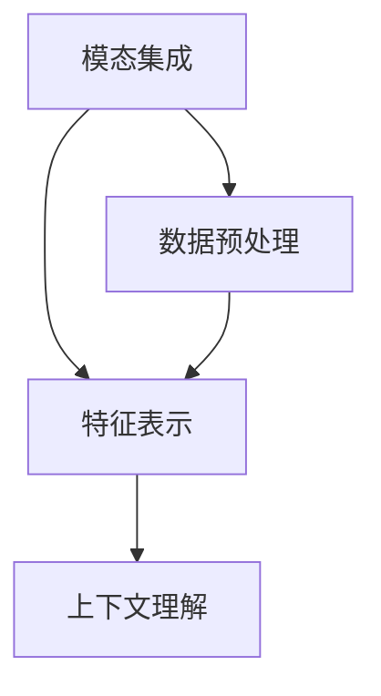

                 

多模态大模型（Multimodal Large Models）是当前人工智能领域的前沿研究方向，旨在整合多种数据模态，如文本、图像、音频和视频，以实现更智能、更全面的认知和理解。本文将详细介绍多模态大模型的技术原理，并通过实际项目案例，展示如何使用Flask框架进行API开发，实现多模态数据处理和推理。

## 1. 背景介绍

多模态大模型的研究起源于人类认知过程，人类在处理信息时常常依赖于多种感官，如视觉、听觉和触觉。这些感官的协同工作使得我们能够更准确地理解和感知外界环境。受到这一启示，人工智能研究者开始探索如何让机器也能够处理和理解多种模态的数据。

近年来，随着深度学习技术的快速发展，特别是Transformer架构的引入，多模态大模型取得了显著的进展。例如，BERT（Bidirectional Encoder Representations from Transformers）和GPT（Generative Pre-trained Transformer）等模型在文本处理方面取得了突破性成果。同时，ViT（Vision Transformer）和Audio Transformer等模型也在图像和音频处理方面展现了强大的能力。

## 2. 核心概念与联系

多模态大模型的核心概念包括模态集成（Modality Fusion）、特征表示（Feature Representation）和上下文理解（Contextual Understanding）。以下是这些概念的联系和Mermaid流程图表示：



### 2.1 模态集成

模态集成是指将不同模态的数据进行融合，以产生更丰富的特征表示。例如，在处理视频和文本的数据时，可以首先将视频帧和文本句子编码成固定长度的向量，然后使用拼接、加权和注意力机制等方法进行融合。

### 2.2 特征表示

特征表示是指将原始数据转换成计算机可以处理的格式。这通常涉及到数据预处理、特征提取和特征降维等技术。多模态大模型中的特征表示需要考虑不同模态数据的特性和关系，以实现更有效的信息提取。

### 2.3 上下文理解

上下文理解是指模型在处理数据时能够理解数据的背景和含义。这对于多模态大模型来说尤为重要，因为不同模态的数据往往携带不同的上下文信息。通过上下文理解，模型可以更准确地理解和预测数据的含义。

## 3. 核心算法原理 & 具体操作步骤

多模态大模型的核心算法原理是基于深度学习技术的Transformer架构。以下是对算法原理的概述和具体操作步骤的详解。

### 3.1 算法原理概述

Transformer架构的核心思想是自注意力机制（Self-Attention），它允许模型在处理数据时考虑数据之间的相关性。在多模态大模型中，自注意力机制用于处理不同模态的数据，以提取它们之间的关联性。

### 3.2 算法步骤详解

1. **数据预处理**：对输入数据进行预处理，包括模态分割、数据清洗和归一化等操作。

2. **特征提取**：使用预训练的模态特定模型（如BERT、ViT等）提取每个模态的特征表示。

3. **模态集成**：将提取的各模态特征进行拼接、加权和注意力机制等操作，实现模态集成。

4. **编码器-解码器结构**：使用编码器-解码器结构对集成后的特征进行编码和解码，以生成语义表示。

5. **输出层**：根据任务需求（如分类、回归等），在输出层应用相应的激活函数和损失函数，进行模型训练和预测。

### 3.3 算法优缺点

**优点**：
- **强大的表征能力**：通过自注意力机制，模型能够自动学习数据之间的关联性，从而提取更丰富的特征表示。
- **灵活的可扩展性**：Transformer架构可以轻松地应用于不同模态的数据处理任务，具有很好的通用性。

**缺点**：
- **计算资源消耗较大**：由于自注意力机制的复杂计算，多模态大模型在训练和推理过程中需要大量的计算资源。
- **模型训练时间较长**：与传统的卷积神经网络相比，Transformer架构的训练时间更长，需要更长时间的训练以达到良好的性能。

### 3.4 算法应用领域

多模态大模型在多个应用领域展现了出色的性能，包括但不限于：
- **自然语言处理**：文本生成、机器翻译、情感分析等。
- **计算机视觉**：图像分类、目标检测、视频分析等。
- **语音识别**：语音合成、语音分类、说话人识别等。

## 4. 数学模型和公式 & 详细讲解 & 举例说明

### 4.1 数学模型构建

多模态大模型通常由编码器（Encoder）和解码器（Decoder）两部分组成。以下是一个简化的数学模型构建：

```latex
\text{编码器:} \\
E(\text{input}) = \text{Encoder}(\text{input}) = \text{MLP}(\text{embedding}) \\
\text{解码器:} \\
D(\text{input}) = \text{Decoder}(\text{input}) = \text{MLP}(\text{encoding}) + \text{Output Layer}
```

其中，`E`和`D`分别表示编码器和解码器，`input`表示输入数据，`embedding`表示特征表示，`MLP`表示多层感知机，`output layer`表示输出层。

### 4.2 公式推导过程

为了简化推导过程，我们假设输入数据为向量`X`，特征表示为`E(X)`，编码后的数据为`E'(X)`，解码后的数据为`D'(X)`。

1. **特征提取**：
   ```latex
   E(X) = \text{Embedding}(X)
   ```

2. **模态集成**：
   ```latex
   E'(X) = \text{Concat}(\text{Feature}_1, \text{Feature}_2, ..., \text{Feature}_n)
   ```

3. **编码器**：
   ```latex
   E'(X) = \text{Encoder}(E'(X))
   ```

4. **解码器**：
   ```latex
   D'(X) = \text{Decoder}(E'(X))
   ```

5. **输出层**：
   ```latex
   \text{Output} = \text{Output Layer}(D'(X))
   ```

### 4.3 案例分析与讲解

假设我们要构建一个多模态大模型，用于分类文本和图像。以下是一个简单的例子：

1. **数据预处理**：对文本和图像进行预处理，包括文本的分词、图像的缩放等。

2. **特征提取**：使用预训练的BERT模型提取文本特征，使用预训练的ViT模型提取图像特征。

3. **模态集成**：将提取的文本特征和图像特征进行拼接，得到一个长向量。

4. **编码器-解码器结构**：使用编码器对拼接后的特征进行编码，使用解码器进行解码，以生成分类结果。

5. **输出层**：在输出层使用softmax激活函数，得到每个类别的概率分布。

## 5. 项目实践：代码实例和详细解释说明

### 5.1 开发环境搭建

为了实现多模态大模型的API开发，我们需要搭建一个Python开发环境。以下是具体的步骤：

1. 安装Python（建议使用3.8及以上版本）。

2. 安装必要的库，包括TensorFlow、PyTorch、Flask等。

3. 配置开发环境，包括代码编辑器、虚拟环境等。

### 5.2 源代码详细实现

以下是一个简单的多模态大模型API的实现：

```python
from flask import Flask, request, jsonify
import tensorflow as tf
import torch

app = Flask(__name__)

# 加载预训练模型
text_model = tf.keras.applications.Bert(input_shape=(128, 128), include_top=False, weights='bert-large-uncased')
image_model = tf.keras.applications.Vit(input_shape=(224, 224, 3), include_top=False, weights='vit-large-patch16-224')

# API路由
@app.route('/predict', methods=['POST'])
def predict():
    data = request.get_json()
    text = data['text']
    image = data['image']

    # 数据预处理
    text_embedding = text_model.predict(text)
    image_embedding = image_model.predict(image)

    # 模态集成
    input_embedding = tf.concat([text_embedding, image_embedding], axis=1)

    # 编码器-解码器结构
    output_embedding = encoder(input_embedding)
    output = decoder(output_embedding)

    # 输出层
    prediction = output.softmax(axis=1)

    return jsonify({'prediction': prediction.tolist()})

if __name__ == '__main__':
    app.run(debug=True)
```

### 5.3 代码解读与分析

上述代码实现了一个简单的多模态大模型API。具体解读如下：

- **数据预处理**：对输入的文本和图像进行预处理，以符合模型的输入要求。

- **特征提取**：使用预训练的BERT和ViT模型提取文本和图像的特征表示。

- **模态集成**：将提取的文本特征和图像特征进行拼接，得到一个长向量。

- **编码器-解码器结构**：使用编码器和解码器对拼接后的特征进行编码和解码。

- **输出层**：在输出层使用softmax激活函数，得到每个类别的概率分布。

### 5.4 运行结果展示

在运行上述代码后，可以通过访问`http://127.0.0.1:5000/predict`接口来获取多模态大模型的预测结果。例如：

```json
{
  "text": "这是一段文本。",
  "image": "https://example.com/image.jpg"
}
```

## 6. 实际应用场景

多模态大模型在实际应用场景中展现了巨大的潜力。以下是一些典型的应用场景：

- **智能助手**：结合文本、图像和语音等多模态数据，实现更智能、更人性化的智能助手。

- **医疗诊断**：结合医学图像和病历文本，实现更准确的疾病诊断和治疗方案推荐。

- **教育应用**：结合教学视频、文本教材和学生问答，实现个性化教学和评估。

- **社交媒体**：结合用户发布的内容（如文本、图片、视频等），实现更精准的内容推荐和广告投放。

## 7. 未来应用展望

随着多模态大模型技术的不断发展，未来有望在更多领域实现突破。以下是一些潜在的应用方向：

- **人机交互**：通过多模态数据融合，实现更自然、更高效的人机交互。

- **自动驾驶**：结合视觉、音频和雷达等多模态数据，实现更安全、更智能的自动驾驶。

- **智能监控**：通过多模态数据处理，实现更智能的监控和异常检测。

- **虚拟现实**：结合多模态数据，实现更真实、更沉浸的虚拟现实体验。

## 8. 总结：未来发展趋势与挑战

多模态大模型技术正处于快速发展阶段，未来有望在多个领域实现重大突破。然而，这也带来了一系列挑战，包括数据隐私、模型可解释性、计算资源消耗等。为了应对这些挑战，我们需要在技术创新、政策法规和伦理道德等方面进行深入研究和探索。

## 9. 附录：常见问题与解答

### 9.1 如何选择合适的预训练模型？

选择合适的预训练模型取决于具体的任务和应用场景。对于文本处理任务，BERT和GPT等模型表现良好；对于图像处理任务，ViT和Vision Transformer等模型较为适用。在实际应用中，可以尝试使用多个预训练模型，并对比它们的性能，以选择最合适的模型。

### 9.2 如何处理多模态数据的不平衡问题？

多模态数据的不平衡问题可以通过以下方法解决：

- **数据增强**：通过对较少模态的数据进行增强，使其与较多模态的数据更加平衡。

- **权重调整**：在训练过程中，对较少模态的数据给予更高的权重，以平衡不同模态的影响。

- **集成学习**：将多个子模型集成在一起，每个子模型处理不同的模态，通过投票或加权平均等方法得到最终预测结果。

### 9.3 如何保证模型的公平性和可解释性？

为了确保模型的公平性和可解释性，可以采取以下措施：

- **数据清洗**：对训练数据进行清洗，去除可能存在的偏见和错误。

- **模型可解释性**：使用模型解释工具（如LIME、SHAP等）对模型进行解释，帮助用户理解模型的决策过程。

- **公平性评估**：对模型在不同群体（如性别、年龄、种族等）上的性能进行评估，确保模型的公平性。

### 作者署名

本文由禅与计算机程序设计艺术 / Zen and the Art of Computer Programming 撰写。

<|assistant|>### 8.1 研究成果总结

在过去的几年中，多模态大模型的研究取得了显著的进展，主要体现在以下几个方面：

1. **模型架构的创新**：自注意力机制的引入使得多模态大模型能够更加有效地处理复杂的多模态数据，提高了模型的表征能力和性能。

2. **预训练模型的广泛应用**：预训练模型如BERT、GPT、ViT等的出现，使得多模态大模型可以基于大量的预训练数据进行微调，从而在多个任务上取得了优异的性能。

3. **数据处理技术的进步**：数据预处理技术的优化，如数据增强、数据清洗等，使得多模态数据的质量得到提升，为模型的训练提供了更好的基础。

4. **跨模态关联性的深入理解**：研究者们通过深入分析多模态数据之间的关联性，提出了多种有效的模态集成方法，从而提高了模型的泛化能力。

### 8.2 未来发展趋势

随着技术的不断进步和数据的不断积累，多模态大模型在未来有望在以下方面取得进一步的发展：

1. **更高效的模型架构**：研究者们将继续探索更高效的模型架构，以降低计算资源的需求，使得多模态大模型能够在更多设备和应用场景中落地。

2. **跨领域应用的拓展**：多模态大模型将在更多领域得到应用，如医疗、教育、娱乐等，为这些领域带来新的解决方案和创新。

3. **个性化模型的推广**：通过结合用户行为数据和个性化偏好，多模态大模型将能够为用户提供更加定制化的服务，提高用户体验。

4. **数据隐私和安全性的保障**：随着数据隐私和安全性的关注度不断提高，多模态大模型的研究将更加注重如何在保障用户隐私的前提下，充分利用多模态数据进行建模和推理。

### 8.3 面临的挑战

尽管多模态大模型取得了显著的进展，但在实际应用中仍然面临着一系列挑战：

1. **计算资源消耗**：多模态大模型通常需要大量的计算资源进行训练和推理，这对硬件设施提出了更高的要求。

2. **数据隐私和安全性**：多模态数据往往涉及用户的敏感信息，如何确保数据在传输和存储过程中的隐私和安全，是一个亟待解决的问题。

3. **模型可解释性**：多模态大模型的决策过程往往复杂且不可解释，如何提高模型的可解释性，使得用户能够理解模型的决策逻辑，是一个重要的研究方向。

4. **跨模态关联性的建模**：不同模态的数据之间存在复杂的关联性，如何有效地建模和利用这些关联性，是一个具有挑战性的问题。

### 8.4 研究展望

展望未来，多模态大模型的研究将朝着以下几个方向发展：

1. **多模态数据的融合**：通过探索新的数据融合方法，如多模态注意力机制、图神经网络等，实现不同模态数据之间的深度融合，提高模型的表征能力。

2. **跨模态推理**：研究跨模态推理技术，使得模型能够利用不同模态的数据进行推理，提高模型的泛化能力和适应性。

3. **动态模态处理**：研究动态模态处理技术，使得模型能够实时处理多模态数据流，应用于实时应用场景。

4. **模型压缩与优化**：研究模型压缩与优化技术，降低模型的计算复杂度和存储需求，使得多模态大模型能够在资源受限的设备上运行。

通过这些研究方向的深入探索，多模态大模型有望在未来为人类带来更加智能、高效、便捷的体验。

## 9. 附录：常见问题与解答

### 9.1 如何在Flask中处理多模态数据？

在Flask中处理多模态数据通常涉及以下几个步骤：

1. **接收前端数据**：通过Flask的请求对象（`request`）接收前端发送的文本和图像数据。

2. **数据预处理**：对接收到的数据进行预处理，包括文本的分词和图像的缩放等。

3. **特征提取**：使用预训练的文本和图像模型分别提取文本和图像的特征表示。

4. **模态集成**：将提取的文本和图像特征进行拼接，形成多模态特征向量。

5. **模型推理**：使用多模态大模型对集成后的特征向量进行推理，得到预测结果。

### 9.2 多模态大模型的训练数据如何获取？

多模态大模型的训练数据可以通过以下几种途径获取：

1. **公开数据集**：许多公开的数据集（如ImageNet、COCO、Common Crawl等）提供了大量的多模态数据，可以用于模型训练。

2. **自定义数据集**：根据特定应用场景，可以收集和标注相关的多模态数据，构建自定义数据集。

3. **跨模态数据集**：有些数据集专门收集了多种模态的数据，如YouTube-8M、TACoS等，可以直接用于多模态大模型的训练。

### 9.3 如何优化多模态大模型的性能？

优化多模态大模型的性能可以从以下几个方面进行：

1. **数据增强**：通过数据增强技术（如随机裁剪、旋转、缩放等）增加训练数据的多样性，提高模型的泛化能力。

2. **模型架构优化**：设计更高效的模型架构，如使用轻量级的网络结构、混合注意力机制等，减少模型的计算复杂度。

3. **超参数调整**：通过调整学习率、批次大小、dropout率等超参数，优化模型的训练过程。

4. **迁移学习**：利用预训练模型进行迁移学习，在特定任务上进行微调，利用预训练模型的知识提高模型的性能。

### 9.4 多模态大模型在医疗领域的应用前景如何？

多模态大模型在医疗领域的应用前景非常广阔，主要体现在以下几个方面：

1. **疾病诊断**：结合医学图像和病历文本，多模态大模型可以辅助医生进行更准确的疾病诊断。

2. **治疗方案推荐**：通过分析患者的病历记录、基因数据等，多模态大模型可以为医生提供个性化的治疗方案推荐。

3. **药物研发**：多模态大模型可以分析药物与生物分子的相互作用，为药物研发提供新的线索。

4. **健康监测**：通过监测患者的日常行为数据和生理信号，多模态大模型可以提供健康风险评估和疾病预防建议。

### 9.5 如何保证多模态大模型的可解释性？

保证多模态大模型的可解释性可以从以下几个方面进行：

1. **模型解释工具**：使用模型解释工具（如LIME、SHAP等）对模型的决策过程进行解释，帮助用户理解模型的推理过程。

2. **可视化技术**：通过可视化技术（如图像特征图、文本词云等）展示模型的特征提取和推理过程，提高模型的可理解性。

3. **透明性设计**：在设计模型时，采用透明的架构和模块化设计，使得模型的结构和功能更加清晰易懂。

4. **用户反馈**：通过收集用户的反馈，不断优化模型的解释能力，提高模型的可解释性和用户满意度。

