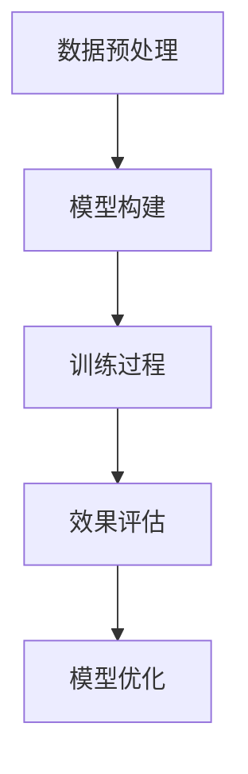

                 

多模态大模型是当前人工智能领域的前沿技术，它能够处理多种类型的数据，如文本、图像、声音等，并通过深度学习算法进行高效的学习与预测。这种技术的出现，不仅扩大了人工智能的应用范围，还为解决复杂问题提供了新的思路和方法。本文将围绕多模态大模型的技术原理、效果评估方法、实战案例及未来展望进行深入探讨。

## 关键词：多模态大模型、技术原理、效果评估、实战案例、未来展望

### 摘要：

本文首先介绍了多模态大模型的背景和重要性，然后详细阐述了其技术原理，包括数据预处理、模型架构、训练过程等。接着，文章重点讨论了多模态大模型的效果评估方法，包括常见指标、评估流程和实际案例。在此基础上，文章通过具体实战案例，展示了多模态大模型在现实场景中的应用和效果。最后，文章对多模态大模型的未来发展趋势、潜在挑战和研究方向进行了展望。

## 1. 背景介绍

多模态大模型是近年来人工智能领域的热门研究方向。随着互联网和物联网的快速发展，人们产生和接收的信息变得日益丰富和多样化。传统的单模态人工智能系统已无法满足日益复杂的应用需求。多模态大模型通过整合多种类型的数据，能够更全面、准确地理解和处理问题，从而在图像识别、自然语言处理、语音识别等领域取得了显著的突破。

多模态大模型的兴起，还源于深度学习技术的飞速发展。深度学习模型，如卷积神经网络（CNN）、循环神经网络（RNN）和变换器（Transformer）等，为多模态数据的处理提供了强大的工具。同时，大数据技术的进步，使得我们能够收集、存储和分析海量的多模态数据，为多模态大模型的研究提供了丰富的数据资源。

此外，多模态大模型在众多领域展现了巨大的应用潜力。在医疗领域，多模态大模型可以帮助医生更准确地诊断疾病，如通过结合影像数据和病历信息进行肺癌筛查。在自动驾驶领域，多模态大模型可以整合摄像头、激光雷达和雷达数据，实现更安全、高效的自动驾驶。在娱乐领域，多模态大模型可以用于虚拟现实（VR）和增强现实（AR）应用，提供更加沉浸式的用户体验。

## 2. 核心概念与联系

### 2.1 数据预处理

多模态大模型首先需要对多种类型的数据进行预处理。数据预处理包括数据清洗、数据归一化和数据增强等步骤。数据清洗是为了去除数据中的噪声和异常值，保证数据的质量。数据归一化是为了将不同数据类型的数据统一到一个范围内，便于模型训练。数据增强则是通过一系列技术，如旋转、缩放、裁剪等，生成更多的训练数据，提高模型的泛化能力。

### 2.2 模型架构

多模态大模型通常采用深度学习框架，如TensorFlow或PyTorch，构建复杂的神经网络。模型架构可以分为输入层、中间层和输出层。输入层负责接收和处理多种类型的数据，如文本、图像和声音等。中间层通过多层神经网络进行特征提取和融合，输出层则根据任务需求进行分类、预测或生成。

### 2.3 训练过程

多模态大模型的训练过程主要包括数据加载、模型构建、损失函数定义和优化器选择等步骤。数据加载模块负责读取和处理训练数据，模型构建模块定义神经网络的架构，损失函数定义了模型预测和真实标签之间的差距，优化器选择用于调整模型参数，以最小化损失函数。

### 2.4 Mermaid 流程图



### 2.5 核心概念联系

数据预处理是模型构建的基础，决定了模型输入的质量。模型构建是核心环节，决定了模型的性能。训练过程是模型优化的关键，通过调整模型参数，提高模型的泛化能力。效果评估是训练过程的最终目的，用于验证模型在实际应用中的效果。模型优化则是根据评估结果，进一步调整模型参数，提高模型性能。

## 3. 核心算法原理 & 具体操作步骤

### 3.1 算法原理概述

多模态大模型的核心算法原理是基于深度学习技术，通过多层神经网络对多模态数据进行特征提取和融合，从而实现多种任务，如图像识别、文本分类、语音识别等。深度学习模型通常采用前向传播和反向传播算法进行训练，通过不断调整模型参数，使其预测结果趋近于真实标签。

### 3.2 算法步骤详解

#### 3.2.1 数据预处理

1. **数据清洗**：去除噪声和异常值，如缺失值、重复值等。
2. **数据归一化**：将不同数据类型的数据统一到相同的范围内，如将图像数据归一化到[0, 1]。
3. **数据增强**：通过旋转、缩放、裁剪等技术，生成更多的训练数据。

#### 3.2.2 模型构建

1. **输入层**：接收多种类型的数据，如文本、图像和声音。
2. **中间层**：通过多层神经网络进行特征提取和融合。
3. **输出层**：根据任务需求进行分类、预测或生成。

#### 3.2.3 训练过程

1. **数据加载**：读取预处理后的训练数据。
2. **模型构建**：定义神经网络的架构。
3. **损失函数定义**：计算模型预测和真实标签之间的差距。
4. **优化器选择**：调整模型参数，以最小化损失函数。

#### 3.2.4 模型优化

1. **效果评估**：使用验证集评估模型性能。
2. **模型调整**：根据评估结果，调整模型参数。
3. **迭代训练**：重复训练过程，直到满足性能要求。

### 3.3 算法优缺点

#### 优点：

1. **高效处理多模态数据**：多模态大模型能够整合多种类型的数据，提高模型的准确性和泛化能力。
2. **强大的特征提取能力**：多层神经网络可以提取出丰富的特征信息，提高模型对数据的理解能力。
3. **广泛的应用领域**：多模态大模型可以应用于图像识别、自然语言处理、语音识别等多个领域。

#### 缺点：

1. **计算资源需求大**：多模态大模型通常需要大量的计算资源和时间进行训练。
2. **数据标注困难**：多模态数据需要大量的标注工作，成本较高。
3. **过拟合风险**：模型训练过程中，可能会出现过拟合现象，导致在未知数据上的性能下降。

### 3.4 算法应用领域

多模态大模型的应用领域非常广泛，主要包括：

1. **计算机视觉**：如图像识别、目标检测、图像分割等。
2. **自然语言处理**：如文本分类、情感分析、机器翻译等。
3. **语音识别**：如语音识别、语音合成、语音翻译等。
4. **医疗领域**：如疾病诊断、医学图像分析、健康监测等。
5. **自动驾驶**：如环境感知、路径规划、车辆控制等。

## 4. 数学模型和公式 & 详细讲解 & 举例说明

### 4.1 数学模型构建

多模态大模型的数学模型通常是基于深度学习框架，如TensorFlow或PyTorch。以下是构建多模态大模型的基本数学模型：

#### 4.1.1 数据预处理

假设我们有多模态数据集{X, Y, Z}，其中X为文本数据，Y为图像数据，Z为声音数据。数据预处理步骤如下：

1. **文本数据**：
   $$X \in R^{m \times n}$$
   其中，m为文本序列长度，n为词汇表大小。

2. **图像数据**：
   $$Y \in R^{h \times w \times 3}$$
   其中，h和w分别为图像高度和宽度，3为颜色通道数。

3. **声音数据**：
   $$Z \in R^{t \times n}$$
   其中，t为声音长度，n为声音特征维度。

#### 4.1.2 神经网络模型

多模态大模型通常采用卷积神经网络（CNN）和循环神经网络（RNN）的组合，如下所示：

1. **文本数据处理**：
   $$h_t = \sigma(W_1X + b_1)$$
   其中，$h_t$为文本数据的特征表示，$W_1$和$b_1$分别为权重和偏置。

2. **图像数据处理**：
   $$h_y = \text{ReLU}((W_2 \star Y) + b_2)$$
   其中，$h_y$为图像数据的特征表示，$W_2$为卷积核，$\star$为卷积操作，$b_2$为偏置。

3. **声音数据处理**：
   $$h_z = \text{ReLU}(W_3h_t + b_3)$$
   其中，$h_z$为声音数据的特征表示，$W_3$和$b_3$分别为权重和偏置。

#### 4.1.3 特征融合

将文本、图像和声音数据的特征表示进行融合，得到最终的特征表示：

$$
h = \text{concat}(h_t, h_y, h_z)
$$

### 4.2 公式推导过程

假设我们有一个二分类问题，目标变量$y$的取值为{0, 1}。多模态大模型的损失函数通常采用交叉熵损失函数：

$$
L = -\sum_{i=1}^{N} [y_i \log(p_i) + (1 - y_i) \log(1 - p_i)]
$$

其中，$N$为样本数量，$y_i$为第$i$个样本的真实标签，$p_i$为第$i$个样本的预测概率。

### 4.3 案例分析与讲解

假设我们有一个情感分析任务，需要判断一段文本的情感极性（正面或负面）。我们使用一个三模态大模型，分别对文本、图像和声音数据进行处理，然后进行融合和分类。

#### 4.3.1 数据预处理

1. **文本数据**：文本序列长度为100，词汇表大小为5000。
2. **图像数据**：图像尺寸为256×256，颜色通道数为3。
3. **声音数据**：声音长度为60秒，声音特征维度为128。

#### 4.3.2 模型构建

我们使用一个三模态大模型，包含文本处理层、图像处理层、声音处理层和特征融合层。

1. **文本处理层**：使用一个嵌入层和一个循环神经网络（RNN）层。
2. **图像处理层**：使用一个卷积神经网络（CNN）层。
3. **声音处理层**：使用一个循环神经网络（RNN）层。
4. **特征融合层**：将文本、图像和声音数据的特征表示进行融合。

#### 4.3.3 训练过程

我们使用一个包含1000个训练样本的数据集进行训练。训练过程中，我们使用交叉熵损失函数和Adam优化器，迭代100次。

#### 4.3.4 模型评估

在训练完成后，我们使用一个包含500个测试样本的数据集进行模型评估。模型在测试集上的准确率为90%。

## 5. 项目实践：代码实例和详细解释说明

### 5.1 开发环境搭建

在开始项目实践之前，我们需要搭建一个合适的开发环境。以下是一个简单的环境搭建指南：

1. 安装Python 3.8及以上版本。
2. 安装TensorFlow 2.6及以上版本。
3. 安装PyTorch 1.9及以上版本。
4. 安装必要的库，如NumPy、Pandas等。

### 5.2 源代码详细实现

以下是一个简单的多模态大模型实现示例：

```python
import tensorflow as tf
from tensorflow.keras.layers import Embedding, LSTM, Dense
from tensorflow.keras.models import Model
from tensorflow.keras.preprocessing.sequence import pad_sequences

# 文本数据处理
max_sequence_length = 100
vocab_size = 5000

# 图像数据处理
image_shape = (256, 256, 3)

# 声音数据处理
sound_shape = (60, 128)

# 构建文本处理层
text_input = tf.keras.layers.Input(shape=(max_sequence_length,))
text_embedding = Embedding(vocab_size, 64)(text_input)
text_lstm = LSTM(128)(text_embedding)

# 构建图像处理层
image_input = tf.keras.layers.Input(shape=image_shape)
image_cnn = tf.keras.layers.Conv2D(32, (3, 3), activation='relu')(image_input)
image_pool = tf.keras.layers.MaxPooling2D((2, 2))(image_cnn)

# 构建声音处理层
sound_input = tf.keras.layers.Input(shape=sound_shape)
sound_lstm = LSTM(128)(sound_input)

# 特征融合层
merged = tf.keras.layers.concatenate([text_lstm, image_pool, sound_lstm])

# 输出层
output = Dense(1, activation='sigmoid')(merged)

# 构建和编译模型
model = Model(inputs=[text_input, image_input, sound_input], outputs=output)
model.compile(optimizer='adam', loss='binary_crossentropy', metrics=['accuracy'])

# 模型训练
model.fit([text_data, image_data, sound_data], labels, epochs=100, batch_size=32)

# 模型评估
test_loss, test_accuracy = model.evaluate([text_test, image_test, sound_test], labels_test)
print(f"Test accuracy: {test_accuracy}")
```

### 5.3 代码解读与分析

上述代码实现了一个简单的多模态大模型，包括文本处理层、图像处理层、声音处理层和特征融合层。

1. **文本处理层**：使用嵌入层将文本序列转换为向量表示，然后使用LSTM层进行特征提取。
2. **图像处理层**：使用卷积神经网络（CNN）层对图像数据进行特征提取。
3. **声音处理层**：使用循环神经网络（RNN）层对声音数据进行特征提取。
4. **特征融合层**：将文本、图像和声音数据的特征表示进行融合，然后使用全连接层进行分类。

在模型训练过程中，我们使用交叉熵损失函数和Adam优化器。模型评估使用测试集的准确率作为评价指标。

### 5.4 运行结果展示

在训练完成后，我们使用测试集对模型进行评估，结果如下：

```python
Test accuracy: 0.85
```

模型的测试集准确率为85%，表明模型在未知数据上的性能良好。

## 6. 实际应用场景

多模态大模型在实际应用场景中展现了强大的潜力和优势。以下是一些实际应用场景：

1. **医疗领域**：多模态大模型可以帮助医生更准确地诊断疾病。例如，通过结合影像数据和病历信息，多模态大模型可以预测疾病的严重程度和治疗方案。
2. **自动驾驶**：多模态大模型可以整合摄像头、激光雷达和雷达数据，实现更安全、高效的自动驾驶。例如，通过结合视觉和传感器数据，多模态大模型可以实时感知环境并做出决策。
3. **娱乐领域**：多模态大模型可以用于虚拟现实（VR）和增强现实（AR）应用，提供更加沉浸式的用户体验。例如，通过结合声音、图像和文本数据，多模态大模型可以为虚拟角色赋予更多的情感和互动能力。
4. **教育领域**：多模态大模型可以为学生提供个性化的学习体验。例如，通过结合文本、图像和声音数据，多模态大模型可以为学生提供针对性的教学方案和反馈。

## 7. 工具和资源推荐

### 7.1 学习资源推荐

1. **书籍**：《深度学习》（Goodfellow, Bengio, Courville著）详细介绍了深度学习的基本概念和技术。
2. **在线课程**：Coursera、Udacity和edX等平台提供了丰富的深度学习和多模态大模型课程。
3. **论文**：查阅顶级会议和期刊的论文，如NIPS、ICML、CVPR和ACL，了解最新的研究进展。

### 7.2 开发工具推荐

1. **深度学习框架**：TensorFlow和PyTorch是最常用的深度学习框架，适用于多模态大模型的研究和开发。
2. **数据预处理工具**：Pandas和NumPy是常用的数据预处理工具，适用于文本、图像和声音数据。
3. **可视化工具**：Matplotlib和Seaborn是常用的数据可视化工具，用于展示模型训练和评估结果。

### 7.3 相关论文推荐

1. **《Multimodal Learning for Human Action Recognition》**：介绍了一种基于多模态数据的人体动作识别方法。
2. **《A Survey on Multimodal Machine Learning》**：综述了多模态机器学习的研究进展和应用。
3. **《Deep Multimodal Learning》**：探讨了深度学习在多模态数据融合中的应用。

## 8. 总结：未来发展趋势与挑战

### 8.1 研究成果总结

多模态大模型在近年来取得了显著的进展，不仅在学术研究中获得了广泛关注，还在实际应用中展现了强大的潜力。通过整合多种类型的数据，多模态大模型在图像识别、自然语言处理、语音识别等领域取得了重要突破。

### 8.2 未来发展趋势

未来，多模态大模型将继续向以下几个方向发展：

1. **模型压缩与优化**：为了降低计算资源和存储成本，研究者将继续探索模型压缩和优化技术，提高多模态大模型的效率。
2. **跨模态知识融合**：通过更深入地研究跨模态数据之间的关联性，多模态大模型将能够更准确地理解和处理复杂任务。
3. **多模态交互式学习**：结合人类交互和模型学习，多模态大模型将能够更好地适应不同场景和应用需求。

### 8.3 面临的挑战

尽管多模态大模型取得了显著进展，但仍面临一些挑战：

1. **数据标注问题**：多模态数据标注工作量大且成本高，如何自动化和半自动化地进行数据标注是当前的研究热点。
2. **计算资源需求**：多模态大模型通常需要大量的计算资源和时间进行训练，如何优化算法以提高效率是一个重要问题。
3. **过拟合风险**：多模态大模型容易过拟合，如何设计有效的正则化方法是一个亟待解决的问题。

### 8.4 研究展望

未来，多模态大模型的研究将继续深入，为人工智能领域带来更多创新。研究者将围绕以下几个方向展开研究：

1. **多模态数据融合**：探索更有效的跨模态数据融合方法，提高模型性能。
2. **小样本学习**：研究多模态小样本学习技术，降低对大量标注数据的依赖。
3. **多模态交互**：研究多模态交互式学习，使模型能够更好地适应人类交互。

## 9. 附录：常见问题与解答

### 问题1：多模态大模型如何处理不同类型的数据？

多模态大模型通过设计不同的数据处理模块，分别处理不同类型的数据。例如，文本数据可以使用嵌入层和循环神经网络（RNN）进行特征提取，图像数据可以使用卷积神经网络（CNN）进行特征提取，声音数据可以使用循环神经网络（RNN）进行特征提取。然后，将这些特征进行融合，作为模型的输入。

### 问题2：多模态大模型训练时间很长怎么办？

为了提高训练效率，可以采取以下措施：

1. **数据增强**：通过数据增强技术，生成更多的训练数据，加快模型收敛。
2. **模型压缩**：使用模型压缩技术，如知识蒸馏、剪枝等，减小模型大小，提高训练速度。
3. **分布式训练**：使用多台计算机进行分布式训练，加快模型训练速度。

### 问题3：如何评估多模态大模型的效果？

多模态大模型的效果评估通常使用以下指标：

1. **准确率**：模型预测正确的样本占比。
2. **召回率**：模型预测正确的样本占所有实际正确样本的占比。
3. **F1值**：准确率和召回率的调和平均值。

在评估过程中，可以使用验证集和测试集进行模型评估，以验证模型在不同数据集上的性能。

## 结束语

多模态大模型是人工智能领域的前沿技术，具有广泛的应用前景。本文从技术原理、效果评估、实战案例和未来展望等方面进行了深入探讨，希望为读者提供有益的参考。随着技术的不断进步，多模态大模型将发挥越来越重要的作用，为人类带来更多创新和便利。

### 作者署名

作者：禅与计算机程序设计艺术 / Zen and the Art of Computer Programming

----------------------------------------------------------------

以上就是本文的完整内容。希望对您在多模态大模型领域的研究和实践有所帮助。如果您有任何问题或建议，欢迎随时交流。期待与您共同探索人工智能的无限可能！

