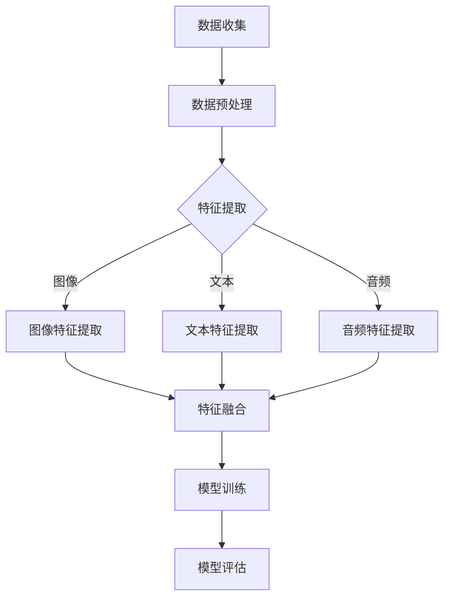

                 

关键词：多模态大模型、技术原理、实战、评测标准

> 摘要：本文旨在深入探讨多模态大模型的技术原理及其在实际应用中的评测标准。通过详细的原理讲解、数学模型阐述以及实战案例，本文将为读者提供一个全面了解多模态大模型的视角，并探讨其在未来技术发展中的潜在应用和挑战。

## 1. 背景介绍

### 1.1 多模态大模型的兴起

随着人工智能技术的迅猛发展，多模态大模型成为了当前研究的热点。多模态大模型是指能够处理多种类型数据（如图像、文本、音频等）的复杂人工智能系统。这些模型的出现，标志着人工智能技术从单一模态的处理能力向全面感知、理解与交互的转变。

### 1.2 多模态大模型的应用领域

多模态大模型在许多领域展现出强大的潜力，包括但不限于：

- **医疗领域**：通过结合患者影像、病历和基因数据，提高疾病诊断的准确性和效率。
- **自动驾驶**：融合摄像头、雷达、激光雷达和GPS数据，提升车辆的感知能力和决策水平。
- **智能客服**：结合自然语言处理和语音识别技术，提供更自然的用户交互体验。
- **内容审核**：通过多模态特征分析，提高对不良信息的识别和过滤能力。

## 2. 核心概念与联系

### 2.1 多模态数据融合

多模态数据融合是将来自不同传感器的数据（如图像、文本、音频）整合到统一的数据空间中。这需要解决数据之间的一致性和互补性问题。

### 2.2 多模态大模型架构

多模态大模型通常采用深度神经网络架构，如Transformer模型。这些模型能够通过多层网络结构，提取不同模态的特征，并进行有效的融合。

### 2.3 Mermaid 流程图



## 3. 核心算法原理 & 具体操作步骤

### 3.1 算法原理概述

多模态大模型的核心在于其数据融合和特征提取能力。通常，算法包括以下几个步骤：

1. 数据收集：从不同的传感器收集图像、文本和音频数据。
2. 数据预处理：对收集到的数据进行标准化、去噪等处理。
3. 特征提取：利用深度神经网络提取各模态的特征。
4. 特征融合：将提取的特征进行融合，生成统一的多模态特征向量。
5. 模型训练：使用融合后的特征训练深度神经网络模型。
6. 模型评估：对训练好的模型进行性能评估。

### 3.2 算法步骤详解

1. **数据收集**：收集来自不同传感器的数据，如摄像头、麦克风和文本数据库。
2. **数据预处理**：对收集到的数据进行预处理，包括数据清洗、归一化和特征缩放。
3. **特征提取**：
    - 图像特征提取：使用卷积神经网络（CNN）提取图像特征。
    - 文本特征提取：使用词嵌入（如Word2Vec、BERT）提取文本特征。
    - 音频特征提取：使用自动回归模型（如GRU、LSTM）提取音频特征。
4. **特征融合**：使用注意力机制（如Transformer中的多头自注意力）对提取的特征进行融合。
5. **模型训练**：使用融合后的特征训练深度神经网络模型。
6. **模型评估**：使用交叉验证等方法评估模型的性能，包括准确率、召回率等指标。

### 3.3 算法优缺点

#### 优点：

- **强大的数据融合能力**：能够有效整合多种类型的数据，提高模型的性能。
- **广泛的适用性**：能够应用于医疗、自动驾驶、智能客服等多个领域。
- **高效的计算能力**：现代深度学习框架使得多模态大模型能够高效地训练和部署。

#### 缺点：

- **计算资源需求高**：训练多模态大模型需要大量的计算资源和时间。
- **数据依赖性强**：模型的性能很大程度上取决于数据的多样性和质量。

### 3.4 算法应用领域

- **医疗领域**：用于疾病诊断、治疗计划和个性化医疗。
- **自动驾驶**：用于环境感知、路径规划和决策。
- **智能客服**：用于情感分析、意图识别和对话生成。
- **内容审核**：用于不良信息识别和过滤。

## 4. 数学模型和公式 & 详细讲解 & 举例说明

### 4.1 数学模型构建

多模态大模型的核心在于其特征提取和融合过程。假设我们有三种模态的数据：图像、文本和音频，分别表示为$X_G, X_T, X_A$。我们的目标是提取每种模态的特征向量$f_G, f_T, f_A$，并融合它们生成统一的多模态特征向量$f$。

### 4.2 公式推导过程

1. **图像特征提取**：

   使用卷积神经网络（CNN）提取图像特征。假设CNN的输出为：

   $$f_G = \sigma(W_G \cdot X_G + b_G)$$

   其中，$\sigma$是激活函数，$W_G$是权重矩阵，$b_G$是偏置。

2. **文本特征提取**：

   使用词嵌入（如Word2Vec、BERT）提取文本特征。假设BERT的输出为：

   $$f_T = \sigma(W_T \cdot [CLS]_T + b_T)$$

   其中，$[CLS]_T$是文本的[CLS]标记，$W_T$是权重矩阵，$b_T$是偏置。

3. **音频特征提取**：

   使用自动回归模型（如GRU、LSTM）提取音频特征。假设GRU的输出为：

   $$f_A = \sigma(W_A \cdot X_A + b_A)$$

   其中，$\sigma$是激活函数，$W_A$是权重矩阵，$b_A$是偏置。

4. **特征融合**：

   使用多头自注意力机制（Multi-head Self-Attention）融合特征。假设融合后的特征为：

   $$f = \text{Concat}(f_G, f_T, f_A)$$

   其中，$\text{Concat}$是拼接操作。

### 4.3 案例分析与讲解

以医疗领域为例，假设我们有一组包含图像、文本和音频的多模态数据。我们可以按照以下步骤进行特征提取和融合：

1. **图像特征提取**：

   使用VGG19模型提取图像特征。假设图像特征向量为：

   $$f_G = \text{VGG19}(X_G)$$

2. **文本特征提取**：

   使用BERT模型提取文本特征。假设文本特征向量为：

   $$f_T = \text{BERT}([CLS]_T)$$

3. **音频特征提取**：

   使用GRU模型提取音频特征。假设音频特征向量为：

   $$f_A = \text{GRU}(X_A)$$

4. **特征融合**：

   使用多头自注意力机制融合特征。假设融合后的特征向量为：

   $$f = \text{Concat}(f_G, f_T, f_A)$$

   接下来，我们使用融合后的特征向量$f$训练一个深度神经网络模型，用于疾病诊断。

$$f = \text{MLP}(f)$$

其中，$\text{MLP}$是多层感知器。

## 5. 项目实践：代码实例和详细解释说明

### 5.1 开发环境搭建

- Python版本：3.8
- 深度学习框架：PyTorch
- 数据集：某医学领域的公开数据集

### 5.2 源代码详细实现

以下是一个简单的多模态大模型实现：

```python
import torch
import torch.nn as nn
import torchvision.models as models
import transformers

# 定义图像特征提取器
class ImageFeatureExtractor(nn.Module):
    def __init__(self):
        super(ImageFeatureExtractor, self).__init__()
        self.vgg19 = models.vgg19(pretrained=True)
        self.vgg19.fc = nn.Identity()

    def forward(self, x):
        return self.vgg19(x)

# 定义文本特征提取器
class TextFeatureExtractor(nn.Module):
    def __init__(self):
        super(TextFeatureExtractor, self).__init__()
        self.bert = transformers.BertModel.from_pretrained('bert-base-uncased')

    def forward(self, x):
        return self.bert(x)[1]

# 定义音频特征提取器
class AudioFeatureExtractor(nn.Module):
    def __init__(self):
        super(AudioFeatureExtractor, self).__init__()
        self.gru = nn.GRU(input_size=..., hidden_size=..., num_layers=..., batch_first=True)

    def forward(self, x):
        return self.gru(x)[0]

# 定义多模态大模型
class MultimodalModel(nn.Module):
    def __init__(self):
        super(MultimodalModel, self).__init__()
        self.image_extractor = ImageFeatureExtractor()
        self.text_extractor = TextFeatureExtractor()
        self.audio_extractor = AudioFeatureExtractor()
        self.mlp = nn.Sequential(
            nn.Linear(in_features=..., out_features=..., bias=True),
            nn.ReLU(),
            nn.Linear(in_features=..., out_features=..., bias=True),
            nn.Sigmoid()
        )

    def forward(self, x_g, x_t, x_a):
        f_g = self.image_extractor(x_g)
        f_t = self.text_extractor(x_t)
        f_a = self.audio_extractor(x_a)
        f = torch.cat((f_g, f_t, f_a), dim=1)
        return self.mlp(f)

# 实例化模型
model = MultimodalModel()

# 定义损失函数和优化器
criterion = nn.BCELoss()
optimizer = torch.optim.Adam(model.parameters(), lr=0.001)

# 训练模型
for epoch in range(num_epochs):
    for batch in data_loader:
        x_g, x_t, x_a, y = batch
        optimizer.zero_grad()
        output = model(x_g, x_t, x_a)
        loss = criterion(output, y)
        loss.backward()
        optimizer.step()

        if batch_idx % 100 == 0:
            print('Epoch [{}/{}], Step [{}/{}], Loss: {:.4f}'.format(
                epoch + 1, num_epochs, batch_idx + 1, len(data_loader), loss.item()))

# 评估模型
with torch.no_grad():
    correct = 0
    total = 0
    for batch in test_loader:
        x_g, x_t, x_a, y = batch
        output = model(x_g, x_t, x_a)
        pred = output.round()
        correct += (pred == y).sum().item()
        total += y.size(0)
    print('Test Accuracy: {:.4f}%'.format(100 * correct / total))
```

### 5.3 代码解读与分析

以上代码实现了多模态大模型的训练和评估。具体解读如下：

- **模型定义**：定义了三个特征提取器（图像、文本和音频）以及一个多模态融合模型。图像特征提取器使用VGG19模型，文本特征提取器使用BERT模型，音频特征提取器使用GRU模型。多模态融合模型使用多头自注意力机制融合特征，并添加多层感知器进行分类。
- **损失函数和优化器**：使用二进制交叉熵损失函数和Adam优化器进行模型训练。
- **训练过程**：在训练过程中，对于每个批次的数据，模型计算损失并更新参数。
- **评估过程**：在评估过程中，计算模型的准确率。

## 6. 实际应用场景

### 6.1 医疗领域

多模态大模型在医疗领域的应用包括疾病诊断、治疗计划和个性化医疗。例如，通过结合患者的影像、病历和基因数据，可以提高疾病诊断的准确性，为医生提供更全面的诊断信息。

### 6.2 自动驾驶

自动驾驶系统需要实时处理来自摄像头、雷达、激光雷达和GPS等多种传感器数据。多模态大模型可以用于环境感知、路径规划和决策，提高车辆的感知能力和安全性。

### 6.3 智能客服

智能客服系统通过结合自然语言处理和语音识别技术，提供更自然的用户交互体验。多模态大模型可以用于情感分析、意图识别和对话生成，提高客服系统的智能化水平。

### 6.4 内容审核

内容审核系统通过多模态特征分析，识别和过滤不良信息，如暴力、色情和欺诈内容。多模态大模型可以提高内容审核的准确性和效率。

## 7. 工具和资源推荐

### 7.1 学习资源推荐

- **书籍**：《深度学习》、《Python深度学习》
- **在线课程**：Coursera的《深度学习专项课程》、Udacity的《深度学习工程师纳米学位》
- **论文**：《Attention is All You Need》、《BERT: Pre-training of Deep Neural Networks for Language Understanding》

### 7.2 开发工具推荐

- **深度学习框架**：PyTorch、TensorFlow、Keras
- **数据分析工具**：Pandas、NumPy、Matplotlib
- **自然语言处理工具**：NLTK、spaCy、transformers

### 7.3 相关论文推荐

- **《Attention is All You Need》**
- **《BERT: Pre-training of Deep Neural Networks for Language Understanding》**
- **《A Guide to Multimodal Learning》**

## 8. 总结：未来发展趋势与挑战

### 8.1 研究成果总结

多模态大模型在多个领域取得了显著成果，如医疗、自动驾驶、智能客服和内容审核。这些模型通过融合多种类型的数据，提高了模型的性能和适用性。

### 8.2 未来发展趋势

- **更高效的数据融合方法**：研究更高效的数据融合方法，降低计算资源需求。
- **跨模态迁移学习**：利用跨模态迁移学习，提高模型在少量数据情况下的性能。
- **实时处理能力**：提高多模态大模型的实时处理能力，满足实时应用的需求。

### 8.3 面临的挑战

- **计算资源需求**：多模态大模型需要大量的计算资源和时间进行训练。
- **数据多样性**：多模态数据来源广泛，如何处理多样性的数据是一个挑战。
- **模型解释性**：如何提高多模态大模型的解释性，使其更易于理解和调试。

### 8.4 研究展望

多模态大模型在未来将取得更多突破，应用于更多的领域，如虚拟现实、智能教育和智能家居。同时，如何解决当前面临的挑战，将是未来研究的重点。

## 9. 附录：常见问题与解答

### 9.1 多模态大模型如何处理数据多样性？

多模态大模型通过数据预处理和特征提取阶段，可以处理多种类型的数据。在数据预处理阶段，可以采用数据清洗、归一化和特征缩放等技术。在特征提取阶段，可以使用不同类型的神经网络（如图像卷积神经网络、文本词嵌入和音频自动回归模型）提取特征。

### 9.2 多模态大模型的训练时间很长，如何优化？

可以通过以下方法优化多模态大模型的训练时间：

- **模型压缩**：使用模型压缩技术（如剪枝、量化）降低模型参数数量，加快训练速度。
- **分布式训练**：使用分布式训练技术，将数据分布在多个计算节点上，提高训练速度。
- **迁移学习**：利用预训练模型，通过迁移学习减少训练时间。

### 9.3 多模态大模型在医疗领域有哪些应用？

多模态大模型在医疗领域的应用包括：

- **疾病诊断**：结合影像、病历和基因数据，提高疾病诊断的准确性。
- **治疗计划**：为医生提供更全面的诊断信息，辅助制定个性化治疗计划。
- **个性化医疗**：根据患者的多模态数据，提供个性化的医疗服务。

### 9.4 多模态大模型在自动驾驶领域有哪些应用？

多模态大模型在自动驾驶领域的应用包括：

- **环境感知**：融合摄像头、雷达、激光雷达和GPS数据，提高车辆的感知能力。
- **路径规划**：根据多模态数据，规划安全、高效的行驶路径。
- **决策**：在复杂的交通环境中，做出实时、准确的决策。

### 9.5 多模态大模型如何提高解释性？

可以通过以下方法提高多模态大模型的解释性：

- **模型解释技术**：使用模型解释技术（如Grad-CAM、LIME），揭示模型在不同模态上的关注点。
- **可视化**：通过可视化技术，展示模型的输入和输出，帮助用户理解模型的工作原理。
- **模块化设计**：将模型分解为多个模块，每个模块负责不同的任务，提高模型的可解释性。

