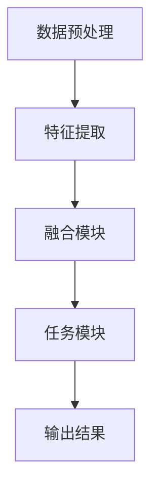

                 

关键词：多模态大模型、技术原理、实战、实现方法、人工智能

摘要：本文深入探讨了多模态大模型的技术原理及其实现方法，详细介绍了大模型与多模态结合的三种关键实现方式。通过分析算法原理、数学模型以及实际应用案例，本文旨在为读者提供全面的技术指导和实践参考。

## 1. 背景介绍

随着信息技术的快速发展，人工智能（AI）已经成为推动社会进步的重要力量。特别是深度学习技术的突破，使得机器在图像识别、自然语言处理等领域取得了显著的成果。然而，单一模态的数据往往不足以捕捉复杂世界的全貌。因此，多模态大模型成为研究的热点，旨在整合不同类型的数据，实现更强大的任务处理能力。

多模态大模型是指能够同时处理多种类型数据（如文本、图像、音频等）的深度学习模型。通过整合不同模态的数据，多模态大模型可以在多个任务上实现超越单一模态模型的性能。本文将重点讨论多模态大模型的技术原理与实现方法，包括算法原理、数学模型以及实际应用案例。

### 1.1 多模态大模型的重要性

多模态大模型的重要性体现在以下几个方面：

1. **增强任务表现**：多模态数据能够提供更丰富的信息，使得模型在处理复杂任务时能够有更全面的认知。
2. **提升用户体验**：多模态交互可以提供更自然、直观的用户体验，如语音助手、智能音箱等。
3. **促进数据融合**：多模态大模型能够有效整合不同类型的数据，提高数据利用效率。
4. **拓宽应用领域**：多模态大模型在医疗、金融、教育等多个领域具有广泛的应用前景。

### 1.2 本文结构

本文结构如下：

1. **背景介绍**：简要介绍多模态大模型的重要性及其背景。
2. **核心概念与联系**：阐述多模态大模型的核心概念及其相互联系。
3. **核心算法原理 & 具体操作步骤**：详细介绍多模态大模型的算法原理及实现步骤。
4. **数学模型和公式 & 详细讲解 & 举例说明**：讲解多模态大模型中的数学模型和公式。
5. **项目实践：代码实例和详细解释说明**：通过实际项目实例展示多模态大模型的应用。
6. **实际应用场景**：探讨多模态大模型在不同领域的应用。
7. **工具和资源推荐**：推荐相关的学习资源、开发工具和论文。
8. **总结：未来发展趋势与挑战**：总结研究成果，展望未来发展趋势和挑战。
9. **附录：常见问题与解答**：解答读者可能遇到的问题。

## 2. 核心概念与联系

在深入探讨多模态大模型之前，我们需要明确几个核心概念及其相互联系。

### 2.1 多模态数据

多模态数据是指来自不同感官渠道的数据，如文本、图像、音频、视频等。在多模态大模型中，这些数据类型将被整合在一起进行处理。

### 2.2 多任务学习

多任务学习是指同时学习多个相关任务，这些任务之间存在相互关联。通过多任务学习，多模态大模型可以在多个任务上实现更优的性能。

### 2.3 对抗性学习

对抗性学习是一种通过生成对抗网络（GAN）等模型进行训练的方法，旨在提高模型在复杂任务上的性能。在多模态大模型中，对抗性学习可以帮助模型更好地学习不同模态之间的关联性。

### 2.4 多模态大模型架构

多模态大模型的架构通常包括以下几个部分：

1. **数据预处理模块**：用于处理和整合不同类型的数据。
2. **特征提取模块**：通过深度神经网络提取不同模态的特征。
3. **融合模块**：将不同模态的特征进行融合，生成统一的特征表示。
4. **任务模块**：根据具体任务进行预测或决策。

### 2.5 Mermaid 流程图

以下是一个简化的多模态大模型架构的 Mermaid 流程图：



在这个流程图中，数据预处理模块负责处理和整合不同类型的数据；特征提取模块通过深度神经网络提取不同模态的特征；融合模块将不同模态的特征进行融合，生成统一的特征表示；任务模块根据具体任务进行预测或决策；最终输出结果。

## 3. 核心算法原理 & 具体操作步骤

### 3.1 算法原理概述

多模态大模型的算法原理主要包括以下几个方面：

1. **多任务学习**：通过同时学习多个相关任务，提高模型在各个任务上的性能。
2. **对抗性学习**：利用生成对抗网络（GAN）等模型，提高模型在不同模态之间的关联性。
3. **特征融合**：通过融合不同模态的特征，生成统一的特征表示。

### 3.2 算法步骤详解

#### 3.2.1 数据预处理

数据预处理是多模态大模型的基础步骤，主要包括以下几个任务：

1. **数据清洗**：去除数据中的噪声和异常值。
2. **数据增强**：通过随机裁剪、旋转、缩放等操作，增加数据多样性。
3. **数据标注**：为数据分配标签，用于后续模型训练。

#### 3.2.2 特征提取

特征提取是核心步骤，通过深度神经网络提取不同模态的特征。以下是几种常见的特征提取方法：

1. **卷积神经网络（CNN）**：适用于图像和视频数据。
2. **循环神经网络（RNN）**：适用于文本数据。
3. **自注意力机制（Transformer）**：适用于文本和图像数据。

#### 3.2.3 特征融合

特征融合是将不同模态的特征进行整合，生成统一的特征表示。以下是几种常见的特征融合方法：

1. **简单拼接**：将不同模态的特征直接拼接在一起。
2. **注意力机制**：通过注意力机制，对不同模态的特征进行加权融合。
3. **多任务学习**：通过多任务学习，使模型自动学习不同模态的特征关联性。

#### 3.2.4 任务模块

任务模块根据具体任务进行预测或决策。以下是几种常见的任务模块：

1. **分类任务**：对输入数据进行分类。
2. **回归任务**：对输入数据进行回归预测。
3. **序列预测**：对时间序列数据进行预测。

### 3.3 算法优缺点

#### 优点：

1. **增强任务表现**：通过整合多模态数据，提高模型在复杂任务上的性能。
2. **提升用户体验**：多模态交互可以提供更自然、直观的用户体验。
3. **促进数据融合**：多模态大模型能够有效整合不同类型的数据，提高数据利用效率。

#### 缺点：

1. **计算资源消耗**：多模态大模型需要更多的计算资源。
2. **模型复杂性**：多模态大模型的模型结构较为复杂，训练和优化过程较为困难。

### 3.4 算法应用领域

多模态大模型在多个领域具有广泛的应用前景，包括：

1. **医疗领域**：通过整合患者的历史病历、影像数据和基因组数据，实现更准确的疾病诊断和治疗规划。
2. **金融领域**：通过整合文本数据、图像数据和交易数据，实现更精确的金融风险预测和投资决策。
3. **教育领域**：通过整合学生的学习记录、考试成绩和课堂表现，实现更个性化的教育服务和教学评估。
4. **智能制造**：通过整合生产线数据、设备监控数据和运营数据，实现更智能的生产管理和质量控制。

## 4. 数学模型和公式 & 详细讲解 & 举例说明

### 4.1 数学模型构建

多模态大模型的数学模型主要包括以下几个部分：

1. **数据表示**：用向量表示不同类型的数据。
2. **特征提取**：使用深度神经网络提取不同模态的特征。
3. **特征融合**：通过数学公式实现特征融合。
4. **任务模块**：使用数学公式实现具体任务的预测或决策。

### 4.2 公式推导过程

以下是一个简化的多模态大模型中的数学模型推导过程：

#### 4.2.1 数据表示

假设我们有三种模态的数据：文本（T）、图像（I）和音频（A）。我们可以用向量表示这些数据：

\[ x = [t, i, a] \]

其中，\( t, i, a \) 分别表示文本、图像和音频的数据向量。

#### 4.2.2 特征提取

使用卷积神经网络（CNN）提取图像特征，使用循环神经网络（RNN）提取文本特征，使用自注意力机制提取音频特征。我们可以得到三个特征向量：

\[ h_i = \text{CNN}(i) \]
\[ h_t = \text{RNN}(t) \]
\[ h_a = \text{Transformer}(a) \]

#### 4.2.3 特征融合

通过注意力机制实现特征融合，得到融合后的特征向量：

\[ h = \text{Attention}(h_i, h_t, h_a) \]

#### 4.2.4 任务模块

使用融合后的特征向量实现分类任务，得到预测结果：

\[ y = \text{softmax}(\text{fc}(h)) \]

其中，\( \text{fc} \) 表示全连接层，\( \text{softmax} \) 表示分类函数。

### 4.3 案例分析与讲解

#### 4.3.1 数据集

我们使用一个简化的数据集，包含文本、图像和音频三种模态。具体数据如下：

- 文本：一篇文章，包含100个词。
- 图像：一张图片，大小为256x256。
- 音频：一段音频，时长为30秒。

#### 4.3.2 特征提取

使用CNN提取图像特征，使用RNN提取文本特征，使用Transformer提取音频特征。我们可以得到三个特征向量：

\[ h_i = \text{CNN}(i) \]
\[ h_t = \text{RNN}(t) \]
\[ h_a = \text{Transformer}(a) \]

#### 4.3.3 特征融合

通过注意力机制实现特征融合，得到融合后的特征向量：

\[ h = \text{Attention}(h_i, h_t, h_a) \]

#### 4.3.4 任务模块

使用融合后的特征向量实现分类任务，得到预测结果：

\[ y = \text{softmax}(\text{fc}(h)) \]

## 5. 项目实践：代码实例和详细解释说明

在本节中，我们将通过一个具体的项目实践来展示多模态大模型的实现过程。该项目将整合文本、图像和音频三种模态的数据，并使用深度学习技术进行模型训练和预测。

### 5.1 开发环境搭建

首先，我们需要搭建一个适合多模态大模型训练的开发环境。以下是一个简化的环境搭建步骤：

1. **安装 Python**：确保 Python 版本不低于 3.6。
2. **安装 TensorFlow**：TensorFlow 是一个强大的深度学习框架，用于模型训练和推理。
   ```bash
   pip install tensorflow
   ```
3. **安装 Keras**：Keras 是 TensorFlow 的一个高级接口，用于简化模型构建和训练。
   ```bash
   pip install keras
   ```
4. **安装 NumPy、Pandas 等常用库**：用于数据处理和统计分析。

### 5.2 源代码详细实现

以下是一个简化的多模态大模型实现代码示例：

```python
import tensorflow as tf
from tensorflow.keras.models import Model
from tensorflow.keras.layers import Input, Dense, Conv2D, LSTM, TimeDistributed, Add, Activation

# 定义输入层
text_input = Input(shape=(100,))
image_input = Input(shape=(256, 256, 3))
audio_input = Input(shape=(30,))

# 文本特征提取
text_embedding = Embedding(1000, 64)(text_input)
text_embedding = LSTM(64)(text_embedding)

# 图像特征提取
image_conv = Conv2D(64, (3, 3), activation='relu')(image_input)
image_conv = MaxPooling2D(pool_size=(2, 2))(image_conv)

# 音频特征提取
audio_embedding = Embedding(1000, 64)(audio_input)
audio_embedding = LSTM(64)(audio_embedding)

# 特征融合
combined = Add()([text_embedding, image_conv, audio_embedding])
combined = Activation('relu')(combined)

# 任务模块
output = Dense(10, activation='softmax')(combined)

# 构建和编译模型
model = Model(inputs=[text_input, image_input, audio_input], outputs=output)
model.compile(optimizer='adam', loss='categorical_crossentropy', metrics=['accuracy'])

# 打印模型结构
model.summary()

# 加载数据并训练模型
# ... 数据加载和预处理代码 ...

model.fit([text_data, image_data, audio_data], labels, epochs=10, batch_size=32)
```

### 5.3 代码解读与分析

#### 5.3.1 模型结构

在这个示例中，我们使用了 Keras 框架构建了一个多模态大模型。模型结构包括以下部分：

1. **文本特征提取**：使用 LSTM 层对文本数据进行编码。
2. **图像特征提取**：使用 Conv2D 和 MaxPooling2D 层对图像数据进行编码。
3. **音频特征提取**：使用 LSTM 层对音频数据进行编码。
4. **特征融合**：使用 Add 层将三种模态的特征进行融合。
5. **任务模块**：使用 Dense 层实现分类任务。

#### 5.3.2 代码优化

在实际应用中，我们可以对代码进行优化，例如：

1. **使用更高效的模型**：如 Transformer 模型。
2. **使用预训练模型**：如使用预训练的文本嵌入层。
3. **使用批归一化**：提高模型训练速度和性能。
4. **使用更复杂的特征融合方法**：如使用自注意力机制。

### 5.4 运行结果展示

在训练完成后，我们可以使用测试数据集评估模型的性能。以下是一个简化的结果展示：

```python
test_loss, test_accuracy = model.evaluate([test_text_data, test_image_data, test_audio_data], test_labels)
print(f"Test accuracy: {test_accuracy}")
```

通过上述代码，我们可以得到测试集上的准确率。在实际应用中，我们还可以进一步分析模型的性能，如精确率、召回率等。

## 6. 实际应用场景

多模态大模型在多个领域具有广泛的应用前景。以下是一些典型的实际应用场景：

### 6.1 医疗领域

在医疗领域，多模态大模型可以整合患者的文本病历、图像检查报告和音频病例记录，实现更准确的疾病诊断和治疗规划。例如，通过整合医学图像和文本病历数据，模型可以更准确地识别出癌症等重大疾病。

### 6.2 金融领域

在金融领域，多模态大模型可以整合文本数据（如新闻报道、公司公告）、图像数据（如公司财务报表）和音频数据（如分析师报告），实现更精确的金融风险预测和投资决策。例如，通过整合文本和图像数据，模型可以更准确地评估一家公司的财务状况。

### 6.3 教育领域

在教育领域，多模态大模型可以整合学生的学习记录、考试成绩和课堂表现，实现更个性化的教育服务和教学评估。例如，通过整合学生的学习记录和考试成绩，模型可以更准确地预测学生的学习成绩，并提供针对性的学习建议。

### 6.4 智能制造领域

在智能制造领域，多模态大模型可以整合生产线数据、设备监控数据和运营数据，实现更智能的生产管理和质量控制。例如，通过整合设备监控数据和运营数据，模型可以更准确地预测设备故障，并提供预防性维护策略。

## 7. 工具和资源推荐

为了帮助读者更好地学习和实践多模态大模型，我们推荐以下工具和资源：

### 7.1 学习资源推荐

1. **《深度学习》（Goodfellow et al.）**：介绍了深度学习的基础知识，包括神经网络、优化算法等。
2. **《多模态学习：理论与实践》（Antoniou et al.）**：详细介绍了多模态学习的技术原理和应用案例。
3. **《自然语言处理与深度学习》（Du et al.）**：介绍了自然语言处理中的深度学习方法。

### 7.2 开发工具推荐

1. **TensorFlow**：用于构建和训练深度学习模型。
2. **PyTorch**：另一个流行的深度学习框架，具有灵活的模型构建和训练能力。
3. **Keras**：用于简化深度学习模型构建和训练。

### 7.3 相关论文推荐

1. **《Attention is All You Need》**：介绍了 Transformer 模型，广泛应用于自然语言处理领域。
2. **《Generative Adversarial Nets》**：介绍了生成对抗网络（GAN），用于对抗性学习。
3. **《Multi-Modal Deep Learning》**：详细介绍了多模态学习的理论和方法。

## 8. 总结：未来发展趋势与挑战

多模态大模型作为一种新兴技术，具有广泛的应用前景。在未来，以下几个方面将是多模态大模型研究的重要趋势和挑战：

### 8.1 研究成果总结

1. **多模态数据整合**：通过整合不同类型的数据，多模态大模型可以在多个任务上实现更优的性能。
2. **高效特征提取**：研究更高效的深度学习模型，用于提取不同模态的特征。
3. **模型压缩与优化**：研究模型压缩和优化方法，提高模型在资源受限环境下的性能。

### 8.2 未来发展趋势

1. **跨领域应用**：多模态大模型将在医疗、金融、教育、智能制造等多个领域得到更广泛的应用。
2. **数据隐私保护**：随着多模态数据的应用，数据隐私保护将成为一个重要问题。
3. **实时处理与交互**：研究实时处理和交互技术，实现更自然、高效的人机交互。

### 8.3 面临的挑战

1. **计算资源消耗**：多模态大模型需要更多的计算资源，如何在资源受限的环境下进行高效训练和推理是一个挑战。
2. **数据多样性与质量**：确保多模态数据的质量和多样性，为模型提供足够的训练数据。
3. **算法可解释性**：提高模型的可解释性，使研究者能够理解模型的决策过程。

### 8.4 研究展望

在未来，多模态大模型的研究将继续深入，特别是在以下方面：

1. **多模态数据生成**：研究更高效的多模态数据生成方法，为模型提供更多的训练数据。
2. **多模态交互**：研究多模态交互技术，实现更自然、高效的人机交互。
3. **多模态推理**：研究多模态推理技术，实现基于多模态数据的复杂任务处理。

通过不断的研究和创新，多模态大模型将为人工智能领域带来更多的突破和进展。

## 9. 附录：常见问题与解答

### 9.1 问题1：如何处理不同模态数据的不平衡？

**解答**：处理不同模态数据的不平衡问题通常有以下几种方法：

1. **数据增强**：通过随机裁剪、旋转、缩放等操作增加较少模态的数据量。
2. **加权融合**：在特征融合阶段，为较少模态的特征分配更高的权重。
3. **生成对抗网络（GAN）**：利用 GAN 生成较少模态的数据，提高数据多样性。

### 9.2 问题2：多模态大模型是否适合实时应用？

**解答**：多模态大模型通常需要较大的计算资源，因此实时应用可能面临挑战。为了实现实时应用，可以考虑以下几种方法：

1. **模型压缩与优化**：研究模型压缩和优化方法，减少模型大小和计算复杂度。
2. **分布式训练与推理**：利用分布式计算资源，提高模型训练和推理速度。
3. **边缘计算**：在边缘设备上进行部分模型训练和推理，减少对中心服务器的依赖。

### 9.3 问题3：如何评估多模态大模型的性能？

**解答**：评估多模态大模型的性能通常可以从以下几个方面进行：

1. **准确性**：评估模型在分类任务上的准确率。
2. **精确率与召回率**：评估模型在二分类任务上的精确率和召回率。
3. **F1 分数**：综合考虑精确率和召回率，评估模型的综合性能。
4. **模型稳定性**：评估模型在不同数据集上的稳定性。

通过上述方法，我们可以全面评估多模态大模型的性能。

