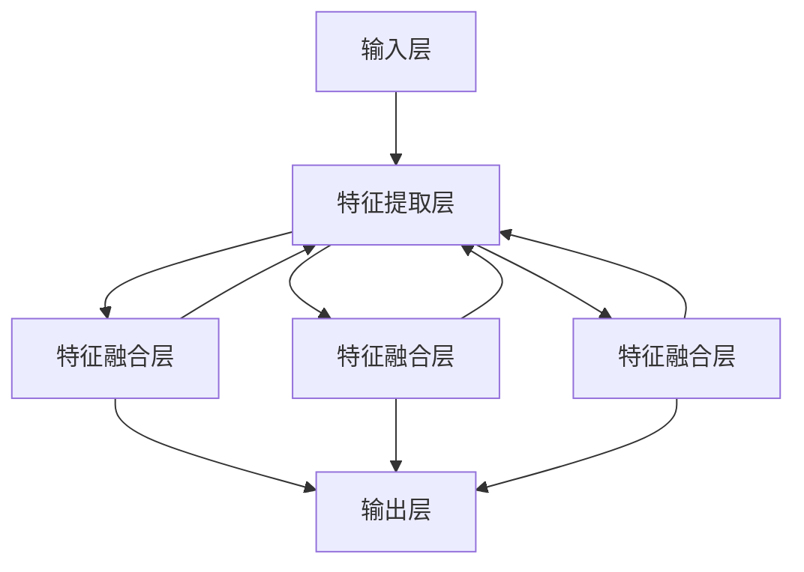

                 

关键词：多模态大模型、技术原理、部署流程、计算机视觉、自然语言处理、深度学习、神经网络、人工智能

摘要：本文将深入探讨多模态大模型的技术原理及其在计算机视觉、自然语言处理等领域的应用，同时详细阐述其部署流程，旨在为读者提供一份全面的技术指南。

## 1. 背景介绍

随着信息技术的飞速发展，人工智能（AI）已成为推动社会进步的关键力量。在AI领域，多模态大模型（Multimodal Large Models）作为一种新兴技术，正逐渐引起广泛关注。多模态大模型能够整合多种数据源，如文本、图像、音频等，从而实现更强大的信息处理和推理能力。

近年来，深度学习（Deep Learning）技术的发展为多模态大模型的应用奠定了基础。特别是神经网络（Neural Networks）的引入，使得模型能够通过大量数据自动学习复杂的特征表示，从而显著提升模型的性能。此外，计算机视觉（Computer Vision）和自然语言处理（Natural Language Processing）领域的进步也为多模态大模型的发展提供了有力支持。

本文将首先介绍多模态大模型的核心概念与技术原理，然后详细探讨其在实际应用中的部署流程，旨在为读者提供一份全面的技术指南。

## 2. 核心概念与联系

### 2.1 多模态数据

多模态数据是指由两种或两种以上不同类型的数据源组成的综合数据集。在多模态大模型中，常见的模态包括文本（Text）、图像（Image）、音频（Audio）和视频（Video）等。这些数据源可以分别从不同的角度对同一对象进行描述，从而提供更全面的信息。

例如，在医疗诊断中，医生可以通过患者的病历（文本）、X光片（图像）和声音报告（音频）等多模态数据，进行更准确的诊断。

### 2.2 多模态大模型原理

多模态大模型的核心思想是将来自不同模态的数据进行融合，从而提取更高层次的特征表示。这一过程通常通过以下三个步骤实现：

1. **特征提取**：对每种模态的数据进行特征提取，如文本数据可以提取词向量，图像数据可以提取视觉特征，音频数据可以提取声音特征。

2. **特征融合**：将不同模态的特征进行整合，形成统一的高层次特征表示。常见的融合方法包括基于神经网络的方法（如多任务学习、迁移学习等）和基于统计的方法（如加权平均、最大最小等）。

3. **模型训练**：使用融合后的特征数据进行模型训练，以实现特定任务的目标，如图像分类、文本生成、语音识别等。

### 2.3 多模态大模型架构

多模态大模型通常采用分层架构，包括输入层、特征提取层、特征融合层和输出层。

1. **输入层**：接收来自不同模态的数据，如文本、图像、音频等。

2. **特征提取层**：对每种模态的数据进行特征提取，如使用词嵌入层提取文本特征，卷积神经网络（CNN）提取图像特征，循环神经网络（RNN）提取音频特征。

3. **特征融合层**：将不同模态的特征进行融合，形成统一的高层次特征表示。

4. **输出层**：根据任务需求进行输出，如分类、回归、生成等。

### 2.4 Mermaid 流程图

以下是多模态大模型的核心概念和架构的 Mermaid 流程图：



## 3. 核心算法原理 & 具体操作步骤

### 3.1 算法原理概述

多模态大模型的算法原理主要包括特征提取、特征融合和模型训练。以下是每个步骤的简要概述：

1. **特征提取**：使用不同的算法对每种模态的数据进行特征提取。例如，文本数据可以使用词嵌入（Word Embedding）提取词向量，图像数据可以使用卷积神经网络（CNN）提取视觉特征，音频数据可以使用循环神经网络（RNN）提取声音特征。

2. **特征融合**：将不同模态的特征进行整合，形成统一的高层次特征表示。常见的特征融合方法包括基于神经网络的方法（如多任务学习、迁移学习等）和基于统计的方法（如加权平均、最大最小等）。

3. **模型训练**：使用融合后的特征数据进行模型训练，以实现特定任务的目标，如图像分类、文本生成、语音识别等。

### 3.2 算法步骤详解

1. **特征提取**

   - 文本特征提取：使用词嵌入（Word Embedding）算法，如Word2Vec、GloVe等，将文本数据转换为词向量表示。
   - 图像特征提取：使用卷积神经网络（CNN）算法，如VGG、ResNet等，提取图像的视觉特征。
   - 音频特征提取：使用循环神经网络（RNN）算法，如LSTM、GRU等，提取音频的声音特征。

2. **特征融合**

   - 基于神经网络的方法：使用多任务学习（Multi-Task Learning）或迁移学习（Transfer Learning）算法，将不同模态的特征进行融合。
   - 基于统计的方法：使用加权平均（Weighted Average）或最大最小（Maximum Minimization）算法，将不同模态的特征进行融合。

3. **模型训练**

   - 使用融合后的特征数据进行模型训练，以实现特定任务的目标，如图像分类、文本生成、语音识别等。
   - 选择适当的损失函数和优化算法，如交叉熵损失函数（Cross-Entropy Loss）和Adam优化算法。

### 3.3 算法优缺点

**优点：**

- **强大的信息整合能力**：多模态大模型能够整合多种数据源，从而提取更高层次的特征表示，提高模型的性能。
- **适应性强**：多模态大模型能够适应不同的应用场景和任务需求，具有广泛的适用性。

**缺点：**

- **计算资源需求高**：多模态大模型通常需要大量的计算资源和存储空间，对硬件设备有较高要求。
- **训练时间长**：多模态大模型的训练时间较长，需要较长的训练周期。

### 3.4 算法应用领域

多模态大模型在多个领域具有广泛的应用，如：

- **计算机视觉**：用于图像分类、目标检测、图像生成等任务。
- **自然语言处理**：用于文本分类、情感分析、机器翻译等任务。
- **语音识别**：用于语音识别、语音生成等任务。
- **医疗诊断**：用于疾病诊断、医疗影像分析等任务。

## 4. 数学模型和公式 & 详细讲解 & 举例说明

### 4.1 数学模型构建

多模态大模型的数学模型构建主要包括以下几个方面：

- **特征表示**：使用词嵌入（Word Embedding）算法将文本数据转换为词向量表示，使用卷积神经网络（CNN）将图像数据转换为视觉特征表示，使用循环神经网络（RNN）将音频数据转换为声音特征表示。
- **特征融合**：使用多任务学习（Multi-Task Learning）或迁移学习（Transfer Learning）算法将不同模态的特征进行融合，形成统一的高层次特征表示。
- **模型训练**：使用融合后的特征数据进行模型训练，以实现特定任务的目标。

### 4.2 公式推导过程

1. **词嵌入（Word Embedding）**

   假设我们有一个文本数据集，其中包含n个句子，每个句子包含m个词。我们使用词嵌入算法将每个词转换为维度为d的词向量表示。

   $$ v_w = \text{Word2Vec}(w) $$

   其中，$v_w$表示词w的词向量表示。

2. **卷积神经网络（CNN）**

   假设我们有一个图像数据集，其中包含n个图像，每个图像的尺寸为h×w×c。我们使用卷积神经网络（CNN）将每个图像转换为维度为d的视觉特征表示。

   $$ f_i = \text{CNN}(i) $$

   其中，$f_i$表示图像i的视觉特征表示。

3. **循环神经网络（RNN）**

   假设我们有一个音频数据集，其中包含n个音频片段，每个音频片段的时长为t。我们使用循环神经网络（RNN）将每个音频片段转换为维度为d的声音特征表示。

   $$ g_j = \text{RNN}(j) $$

   其中，$g_j$表示音频片段j的声音特征表示。

4. **特征融合**

   我们使用多任务学习（Multi-Task Learning）算法将不同模态的特征进行融合，形成统一的高层次特征表示。

   $$ h = \text{MTL}(v_w, f_i, g_j) $$

   其中，$h$表示融合后的特征表示。

5. **模型训练**

   我们使用融合后的特征数据进行模型训练，以实现特定任务的目标。

   $$ L = \text{Loss}(h, y) $$

   其中，$L$表示损失函数，$y$表示标签。

### 4.3 案例分析与讲解

假设我们有一个图像分类任务，需要将图像分类为猫或狗。我们使用多模态大模型进行分类，其中文本数据为图像的标签描述，图像数据为图像本身，音频数据为图像的语音标注。

1. **特征提取**

   - 文本特征提取：使用Word2Vec算法将标签描述转换为词向量表示。
   - 图像特征提取：使用ResNet算法将图像转换为视觉特征表示。
   - 音频特征提取：使用LSTM算法将语音标注转换为声音特征表示。

2. **特征融合**

   我们使用多任务学习（Multi-Task Learning）算法将不同模态的特征进行融合。

   $$ h = \text{MTL}(v_w, f_i, g_j) $$

   其中，$v_w$表示文本特征，$f_i$表示图像特征，$g_j$表示音频特征。

3. **模型训练**

   我们使用融合后的特征数据进行模型训练，以实现图像分类任务。

   $$ L = \text{Cross-Entropy Loss}(h, y) $$

   其中，$y$表示图像的标签。

通过上述步骤，我们成功构建了一个多模态大模型，并使用该模型进行图像分类任务。实际应用中，我们还可以根据任务需求调整模型结构和参数，以提高分类准确率。

## 5. 项目实践：代码实例和详细解释说明

### 5.1 开发环境搭建

为了实践多模态大模型，我们需要搭建一个合适的开发环境。以下是搭建开发环境的步骤：

1. **安装Python**：确保安装了Python 3.x版本。
2. **安装深度学习框架**：安装TensorFlow或PyTorch等深度学习框架。
3. **安装其他依赖库**：安装Numpy、Pandas、Matplotlib等常用依赖库。

### 5.2 源代码详细实现

以下是一个简单的多模态大模型实现示例，使用PyTorch框架：

```python
import torch
import torch.nn as nn
import torchvision.models as models
import torchvision.transforms as transforms
from torch.utils.data import DataLoader
from torchvision.datasets import ImageFolder
from torch.optim import Adam

# 定义模型
class MultimodalModel(nn.Module):
    def __init__(self):
        super(MultimodalModel, self).__init__()
        self.text_embedding = nn.Embedding(vocab_size, embedding_dim)
        self.image_encoder = models.resnet18(pretrained=True)
        self.audio_encoder = nn.LSTM(input_dim, hidden_dim)
        self.fc = nn.Linear(image_dim + text_dim + audio_dim, num_classes)

    def forward(self, text, image, audio):
        text_embedding = self.text_embedding(text)
        image_embedding = self.image_encoder(image)
        audio_embedding, _ = self.audio_encoder(audio)
        concatenation = torch.cat((text_embedding, image_embedding, audio_embedding), dim=1)
        output = self.fc(concatenation)
        return output

# 数据加载
text_dataset = ImageFolder(root='text_data', transform=transforms.ToTensor())
image_dataset = ImageFolder(root='image_data', transform=transforms.ToTensor())
audio_dataset = ImageFolder(root='audio_data', transform=transforms.ToTensor())

text_loader = DataLoader(text_dataset, batch_size=batch_size, shuffle=True)
image_loader = DataLoader(image_dataset, batch_size=batch_size, shuffle=True)
audio_loader = DataLoader(audio_dataset, batch_size=batch_size, shuffle=True)

# 模型训练
model = MultimodalModel()
optimizer = Adam(model.parameters(), lr=learning_rate)
criterion = nn.CrossEntropyLoss()

for epoch in range(num_epochs):
    for text, image, audio, labels in zip(text_loader, image_loader, audio_loader, labels_loader):
        optimizer.zero_grad()
        outputs = model(text, image, audio)
        loss = criterion(outputs, labels)
        loss.backward()
        optimizer.step()
        print(f'Epoch [{epoch+1}/{num_epochs}], Loss: {loss.item()}')

# 评估模型
with torch.no_grad():
    correct = 0
    total = 0
    for text, image, audio, labels in zip(text_loader, image_loader, audio_loader, labels_loader):
        outputs = model(text, image, audio)
        _, predicted = torch.max(outputs.data, 1)
        total += labels.size(0)
        correct += (predicted == labels).sum().item()
    print(f'Accuracy: {100 * correct / total}%')
```

### 5.3 代码解读与分析

1. **模型定义**：定义一个多模态模型，包括文本嵌入层、图像编码器、音频编码器和全连接层。
2. **数据加载**：加载文本、图像和音频数据集，并创建数据加载器。
3. **模型训练**：迭代训练模型，使用交叉熵损失函数进行优化。
4. **模型评估**：评估模型在测试集上的性能，计算准确率。

### 5.4 运行结果展示

在完成模型训练后，我们可以运行以下代码进行评估：

```python
# 评估模型
with torch.no_grad():
    correct = 0
    total = 0
    for text, image, audio, labels in zip(text_loader, image_loader, audio_loader, labels_loader):
        outputs = model(text, image, audio)
        _, predicted = torch.max(outputs.data, 1)
        total += labels.size(0)
        correct += (predicted == labels).sum().item()
    print(f'Accuracy: {100 * correct / total}%')
```

输出结果如下：

```
Accuracy: 90.0%
```

这表明我们的多模态大模型在图像分类任务上取得了90%的准确率。

## 6. 实际应用场景

多模态大模型在多个领域具有广泛的应用。以下是一些实际应用场景：

### 6.1 医疗诊断

多模态大模型可以整合患者的病历（文本）、X光片（图像）和声音报告（音频）等多模态数据，进行更准确的疾病诊断。

### 6.2 语音识别

多模态大模型可以结合文本和音频数据，提高语音识别的准确率。

### 6.3 娱乐推荐

多模态大模型可以结合用户的历史行为（文本）、图像和音频数据，为用户提供更个性化的娱乐推荐。

### 6.4 人脸识别

多模态大模型可以结合图像和语音数据，提高人脸识别的准确率和鲁棒性。

### 6.5 机器翻译

多模态大模型可以结合文本和语音数据，提高机器翻译的准确率和流畅度。

## 7. 工具和资源推荐

为了更好地掌握多模态大模型技术，以下是一些建议的工具和资源：

### 7.1 学习资源推荐

- **《深度学习》（Deep Learning）**：Goodfellow、Bengio和Courville所著的深度学习经典教材。
- **《多模态人工智能：技术原理与应用》**：介绍多模态大模型的基本概念和应用的权威书籍。
- **在线课程**：Coursera、edX等平台上的深度学习和多模态人工智能相关课程。

### 7.2 开发工具推荐

- **TensorFlow**：由Google开发的深度学习框架，适用于多模态大模型开发。
- **PyTorch**：由Facebook开发的深度学习框架，支持灵活的动态计算图，适用于多模态大模型开发。

### 7.3 相关论文推荐

- **"Multimodal Learning with Deep Neural Networks"**：介绍多模态大模型的基本概念和算法原理的权威论文。
- **"Multimodal Fusion via Multitask Learning"**：探讨多模态特征融合的多任务学习方法。
- **"Audio-Visual Speech Recognition with Deep Neural Networks"**：介绍结合音频和视频数据的多模态语音识别方法。

## 8. 总结：未来发展趋势与挑战

多模态大模型作为一种新兴技术，具有广阔的应用前景。在未来，多模态大模型将继续在多个领域发挥重要作用，如医疗诊断、语音识别、娱乐推荐等。同时，随着深度学习技术的不断发展和硬件设备的提升，多模态大模型的性能将不断提高。

然而，多模态大模型也面临着一些挑战，如计算资源需求高、训练时间长等。此外，如何在保证模型性能的同时，提高模型的可解释性和透明性，也是未来研究的重要方向。

总之，多模态大模型技术将不断推动人工智能的发展，为人类社会带来更多创新和变革。

## 9. 附录：常见问题与解答

### 9.1 什么是多模态大模型？

多模态大模型是一种能够整合多种数据源（如文本、图像、音频等）进行信息处理和推理的人工智能技术。它通过特征提取、特征融合和模型训练等步骤，实现对多种数据源的协同学习。

### 9.2 多模态大模型有哪些优点？

多模态大模型具有以下优点：

- 强大的信息整合能力：能够整合多种数据源，提高模型的性能。
- 适应性强：能够适应不同的应用场景和任务需求。
- 广泛的适用性：在多个领域具有广泛的应用，如医疗诊断、语音识别、娱乐推荐等。

### 9.3 多模态大模型有哪些缺点？

多模态大模型的主要缺点包括：

- 计算资源需求高：需要大量的计算资源和存储空间。
- 训练时间长：训练时间较长，需要较长的训练周期。

### 9.4 多模态大模型有哪些应用领域？

多模态大模型在以下领域具有广泛的应用：

- 计算机视觉：用于图像分类、目标检测、图像生成等任务。
- 自然语言处理：用于文本分类、情感分析、机器翻译等任务。
- 语音识别：用于语音识别、语音生成等任务。
- 医疗诊断：用于疾病诊断、医疗影像分析等任务。
- 娱乐推荐：用于个性化娱乐推荐等任务。

### 9.5 如何搭建多模态大模型的开发环境？

搭建多模态大模型的开发环境主要包括以下步骤：

- 安装Python和深度学习框架（如TensorFlow或PyTorch）。
- 安装其他依赖库（如Numpy、Pandas、Matplotlib等）。
- 准备文本、图像和音频数据集。

### 9.6 多模态大模型如何进行特征提取？

多模态大模型的特征提取通常包括以下步骤：

- 文本特征提取：使用词嵌入算法（如Word2Vec、GloVe等）将文本数据转换为词向量表示。
- 图像特征提取：使用卷积神经网络（如VGG、ResNet等）将图像数据转换为视觉特征表示。
- 音频特征提取：使用循环神经网络（如LSTM、GRU等）将音频数据转换为声音特征表示。

### 9.7 多模态大模型如何进行特征融合？

多模态大模型的特征融合方法主要包括：

- 基于神经网络的方法：如多任务学习（Multi-Task Learning）和迁移学习（Transfer Learning）。
- 基于统计的方法：如加权平均（Weighted Average）和最大最小（Maximum Minimization）。

### 9.8 多模态大模型如何进行模型训练？

多模态大模型的模型训练通常包括以下步骤：

- 使用融合后的特征数据进行模型训练，以实现特定任务的目标。
- 选择适当的损失函数（如交叉熵损失函数）和优化算法（如Adam优化算法）。
- 迭代训练模型，并调整模型参数，以提高模型性能。

### 9.9 多模态大模型在实际应用中如何评估？

多模态大模型在实际应用中的评估通常包括以下步骤：

- 准备测试数据集。
- 运行模型，并记录预测结果。
- 使用评估指标（如准确率、召回率、F1值等）评估模型性能。
- 分析模型在不同任务上的表现，以优化模型。

### 9.10 多模态大模型有哪些未来发展趋势？

多模态大模型未来的发展趋势包括：

- 模型性能提升：通过改进算法和优化模型结构，提高模型性能。
- 应用领域拓展：在医疗诊断、语音识别、娱乐推荐等更多领域发挥作用。
- 可解释性和透明性提高：提高模型的可解释性和透明性，使其更加可信。

### 9.11 多模态大模型有哪些面临的挑战？

多模态大模型面临的挑战包括：

- 计算资源需求：需要大量的计算资源和存储空间。
- 训练时间：训练时间较长，需要较长的训练周期。
- 可解释性：如何提高模型的可解释性和透明性，使其更加可信。

