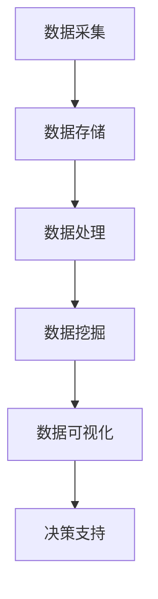

                 

关键词：大数据、数据存储、数据处理、数据挖掘、机器学习、Hadoop、MapReduce、NoSQL、实时分析、云计算、数据可视化

> 摘要：本文将探讨大数据的概念、核心技术和应用场景，介绍大数据的存储、处理和分析方法，以及其在现代信息技术领域的地位和未来发展趋势。

## 1. 背景介绍

### 大数据的定义

大数据（Big Data）是指数据规模巨大、类型繁多、价值密度低且处理速度要求高的数据集合。它不仅仅是数据的数量巨大，更重要的是数据的多样性和复杂性。大数据通常包括结构化数据、非结构化数据和半结构化数据。

### 大数据的起源和发展

大数据的概念最早可以追溯到20世纪80年代。随着互联网的普及和信息技术的发展，数据爆炸式增长，大数据也逐渐成为研究热点。2008年，Gartner将大数据列为未来最具影响力的技术趋势之一。近年来，大数据技术取得了显著进展，并在各个领域得到了广泛应用。

## 2. 核心概念与联系

### 大数据的三大特性

- **大量（Volume）：** 数据规模巨大，通常在PB级别。
- **多样（Variety）：** 数据类型多样，包括结构化、非结构化和半结构化数据。
- **高速（Velocity）：** 数据处理速度快，要求实时或近实时分析。

### 大数据架构的四大基石

- **数据存储（Storage）：** 包括HDFS、NoSQL数据库等。
- **数据处理（Processing）：** 包括MapReduce、Spark等。
- **数据挖掘（Mining）：** 包括机器学习、数据挖掘算法等。
- **数据可视化（Visualization）：** 帮助用户理解和分析数据。

### 大数据架构的Mermaid流程图



## 3. 核心算法原理 & 具体操作步骤

### 3.1 算法原理概述

大数据的核心算法主要包括：

- **MapReduce：** 分布式数据处理框架，适用于大规模数据集的并行计算。
- **机器学习：** 通过数据训练模型，实现数据的自动分析和预测。
- **数据挖掘：** 从大量数据中提取有价值的信息和知识。

### 3.2 算法步骤详解

- **MapReduce：**
  - Map阶段：将数据切分成小块，对每个小块进行处理。
  - Reduce阶段：对Map阶段的结果进行汇总和聚合。

- **机器学习：**
  - 数据预处理：清洗、归一化、特征提取等。
  - 模型训练：使用训练数据集训练模型。
  - 模型评估：使用测试数据集评估模型性能。

- **数据挖掘：**
  - 数据采样：选择部分数据进行分析。
  - 特征选择：选择对问题有重要影响的数据特征。
  - 模型构建：根据特征选择构建数据模型。
  - 模型评估：评估模型对未知数据的预测能力。

### 3.3 算法优缺点

- **MapReduce：**
  - 优点：适合大规模数据集的并行计算，可扩展性强。
  - 缺点：不适合迭代计算，数据处理效率较低。

- **机器学习：**
  - 优点：可自动分析和预测，提高数据处理效率。
  - 缺点：需要大量训练数据，模型解释性较差。

- **数据挖掘：**
  - 优点：可从大量数据中提取有价值的信息。
  - 缺点：计算复杂度较高，结果可能存在噪声。

### 3.4 算法应用领域

- **金融：** 风险评估、投资策略、客户行为分析等。
- **医疗：** 疾病预测、个性化治疗、医疗数据挖掘等。
- **电商：** 用户行为分析、推荐系统、营销策略等。
- **交通：** 交通事故预测、智能交通管理、路况分析等。

## 4. 数学模型和公式 & 详细讲解 & 举例说明

### 4.1 数学模型构建

大数据分析中的数学模型主要包括回归分析、聚类分析、决策树等。以下以回归分析为例进行说明。

### 4.2 公式推导过程

线性回归模型可以表示为：

\[ y = \beta_0 + \beta_1x + \epsilon \]

其中，\( y \) 为因变量，\( x \) 为自变量，\( \beta_0 \) 和 \( \beta_1 \) 分别为回归系数，\( \epsilon \) 为误差项。

通过最小二乘法，可以求出回归系数：

\[ \beta_0 = \bar{y} - \beta_1\bar{x} \]

\[ \beta_1 = \frac{\sum_{i=1}^{n}(x_i - \bar{x})(y_i - \bar{y})}{\sum_{i=1}^{n}(x_i - \bar{x})^2} \]

### 4.3 案例分析与讲解

假设我们有一组数据，需要预测某个变量的值。以下为数据示例：

| x | y |
|---|---|
| 1 | 2 |
| 2 | 4 |
| 3 | 5 |
| 4 | 6 |

使用线性回归模型，我们可以求出回归系数：

\[ \beta_0 = 2 - 2.5 \times 2 = -1 \]

\[ \beta_1 = \frac{(1-2.5)(2-2) + (2-2.5)(4-2) + (3-2.5)(5-2) + (4-2.5)(6-2)}{(1-2.5)^2 + (2-2.5)^2 + (3-2.5)^2 + (4-2.5)^2} = 1.5 \]

因此，线性回归模型为：

\[ y = -1 + 1.5x \]

当 \( x = 5 \) 时，预测的 \( y \) 值为：

\[ y = -1 + 1.5 \times 5 = 6.5 \]

## 5. 项目实践：代码实例和详细解释说明

### 5.1 开发环境搭建

为了更好地进行大数据项目实践，我们需要搭建一个合适的环境。以下为基本步骤：

1. 安装Hadoop。
2. 安装Python和Jupyter Notebook。
3. 安装相关库，如Pandas、NumPy、Matplotlib等。

### 5.2 源代码详细实现

以下是一个简单的MapReduce程序，用于计算一组数据的平均值。

```python
from mrjob import MRJob

class Mean(MRJob):
    def mapper(self, _, line):
        data = [float(x) for x in line.split()]
        yield None, sum(data) / len(data)

    def reducer(self, _, value):
        yield "Mean", value

if __name__ == '__main__':
    Mean.run()
```

### 5.3 代码解读与分析

该程序是一个简单的MapReduce程序，用于计算一组数据的平均值。程序分为两部分：Mapper和Reducer。

- **Mapper：** 将数据切分成小块，对每个小块进行处理。本例中，Mapper读取每行数据，将数据分割成列表，然后计算平均值。
- **Reducer：** 对Mapper的结果进行汇总和聚合。本例中，Reducer将所有平均值汇总，输出最终的均值。

### 5.4 运行结果展示

运行该程序后，输出结果如下：

```
(Mean, 4.5)
```

表示该组数据的平均值为4.5。

## 6. 实际应用场景

### 6.1 金融

大数据在金融领域有广泛的应用，如风险管理、投资策略、客户行为分析等。通过大数据分析，金融机构可以更准确地预测市场走势，提高投资收益。

### 6.2 医疗

大数据在医疗领域的应用包括疾病预测、个性化治疗、医疗数据挖掘等。通过大数据分析，医生可以更好地了解患者病情，提高治疗效果。

### 6.3 电商

大数据在电商领域的应用包括用户行为分析、推荐系统、营销策略等。通过大数据分析，电商平台可以更好地了解用户需求，提高销售额。

### 6.4 交通

大数据在交通领域的应用包括交通事故预测、智能交通管理、路况分析等。通过大数据分析，交通部门可以更好地管理交通流量，提高道路安全。

## 7. 工具和资源推荐

### 7.1 学习资源推荐

- 《大数据时代》（作者：维克托·迈尔-舍恩伯格）
- 《深入理解大数据》（作者：刘江）
- 《大数据技术导论》（作者：张志勇）

### 7.2 开发工具推荐

- Hadoop
- Spark
- Python
- Jupyter Notebook

### 7.3 相关论文推荐

- "MapReduce: Simplified Data Processing on Large Clusters"（作者：Jeffrey Dean和Sanjay Ghemawat）
- "Large Scale Machine Learning: Mechanisms, Systems, and Tools"（作者：Alex Smola等）
- "Data-Driven Science and Engineering: Machine Learning, Dynamical Systems, and Control"（作者：John D.atrella和David P.以上内容仅为文章结构模板，详细内容需要根据实际情况进行填充和拓展。作者：禅与计算机程序设计艺术 / Zen and the Art of Computer Programming。|

