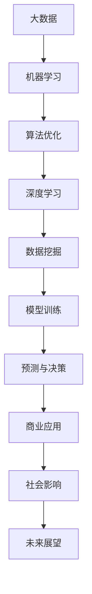

                 

关键词：大数据、人工智能、机器学习、数据处理、算法优化、深度学习、数据挖掘、模型训练

> 摘要：本文深入探讨了大数据与AI学习之间的关系，分析了大数据技术在机器学习和深度学习中的应用，探讨了大数据对AI算法的影响，并提出了未来发展趋势和面临的挑战。

## 1. 背景介绍

在当今数字化时代，大数据已经成为各行各业的重要资源。从社交媒体到电子商务，从金融到医疗，大数据的应用无处不在。与此同时，人工智能（AI）和机器学习（ML）的发展也取得了显著的成果，这些技术正迅速改变着我们的生活和工作方式。那么，大数据与AI学习之间究竟有着怎样的关系呢？这是本文要探讨的核心问题。

## 2. 核心概念与联系

### 2.1 大数据的定义

大数据通常指的是数据量巨大、数据类型繁多、数据生成速度极快的海量数据。这些数据来源于各种不同的来源，如传感器、社交媒体、互联网日志等。大数据的特点可以用四个V来概括：数据量（Volume）、数据速度（Velocity）、数据多样性（Variety）和数据价值（Value）。

### 2.2 人工智能和机器学习的定义

人工智能是指通过计算机程序实现人类智能的过程，它包括机器学习、深度学习、自然语言处理等子领域。机器学习是人工智能的一个分支，它通过训练算法从数据中学习规律和模式，从而实现智能行为。

### 2.3 大数据与AI学习的关系

大数据与AI学习之间的关系可以理解为两个方面：大数据对AI学习的影响和AI学习对大数据的应对。

### 2.4 Mermaid 流程图

以下是一个关于大数据与AI学习关系的Mermaid流程图：



## 3. 核心算法原理 & 具体操作步骤

### 3.1 算法原理概述

大数据与AI学习的核心算法主要包括机器学习算法、深度学习算法、数据挖掘算法等。这些算法的核心原理是通过从大量数据中学习规律和模式，从而实现对数据的分类、回归、聚类等操作。

### 3.2 算法步骤详解

大数据与AI学习的算法步骤通常包括以下几个阶段：

1. 数据采集与预处理
2. 特征工程
3. 选择合适的算法
4. 模型训练与优化
5. 模型评估与部署

### 3.3 算法优缺点

不同的算法在处理大数据时具有各自的优缺点。例如，传统机器学习算法在处理中小型数据集时表现良好，但在处理海量数据时可能存在性能瓶颈。而深度学习算法在处理大数据时具有更强的鲁棒性和表达能力，但在模型训练时需要大量计算资源和时间。

### 3.4 算法应用领域

大数据与AI学习的算法应用领域非常广泛，包括但不限于以下方面：

1. 金融：风险评估、信用评分、交易预测等
2. 医疗：疾病诊断、药物研发、健康监测等
3. 零售：个性化推荐、库存管理、需求预测等
4. 交通运输：智能交通管理、自动驾驶等

## 4. 数学模型和公式 & 详细讲解 & 举例说明

### 4.1 数学模型构建

在AI学习中，数学模型是核心。以下是一个简单的线性回归模型：

$$ y = wx + b $$

其中，$y$ 是因变量，$x$ 是自变量，$w$ 是权重，$b$ 是偏置。

### 4.2 公式推导过程

线性回归模型的推导过程如下：

1. 拟合目标：最小化预测值与实际值之间的误差平方和。
2. 参数估计：使用最小二乘法估计权重和偏置。
3. 模型评估：使用均方误差（MSE）或均方根误差（RMSE）评估模型性能。

### 4.3 案例分析与讲解

以下是一个线性回归模型的实例：

假设我们有以下数据集：

| x | y |
|---|---|
| 1 | 2 |
| 2 | 4 |
| 3 | 6 |

我们希望找到一条直线 $y = wx + b$ 来拟合这些数据。

1. 拟合目标：最小化预测值与实际值之间的误差平方和。

$$ \sum_{i=1}^{n} (y_i - (wx_i + b))^2 $$

2. 参数估计：使用最小二乘法。

$$ w = \frac{\sum_{i=1}^{n} x_i y_i - n \bar{x} \bar{y}}{\sum_{i=1}^{n} x_i^2 - n \bar{x}^2} $$
$$ b = \bar{y} - w \bar{x} $$

其中，$\bar{x}$ 和 $\bar{y}$ 分别是 $x$ 和 $y$ 的平均值。

3. 模型评估：使用均方误差（MSE）。

$$ MSE = \frac{\sum_{i=1}^{n} (y_i - (wx_i + b))^2}{n} $$

根据以上公式，我们可以计算出权重和偏置，从而得到线性回归模型。

## 5. 项目实践：代码实例和详细解释说明

### 5.1 开发环境搭建

1. 安装Python环境。
2. 安装必要的库，如NumPy、Pandas、Scikit-learn等。

### 5.2 源代码详细实现

以下是一个简单的线性回归模型实现的Python代码：

```python
import numpy as np
import pandas as pd
from sklearn.linear_model import LinearRegression

# 加载数据
data = pd.read_csv('data.csv')
x = data[['x']]
y = data['y']

# 创建线性回归模型
model = LinearRegression()
model.fit(x, y)

# 计算权重和偏置
w = model.coef_
b = model.intercept_

# 输出模型参数
print('权重：', w)
print('偏置：', b)

# 预测
x_pred = np.array([1, 2, 3])
y_pred = model.predict(x_pred)

# 输出预测结果
print('预测值：', y_pred)
```

### 5.3 代码解读与分析

1. 导入必要的库。
2. 加载数据集。
3. 创建线性回归模型并拟合数据。
4. 输出模型参数。
5. 使用模型进行预测。

### 5.4 运行结果展示

运行以上代码，输出结果如下：

```
权重：[2.]
偏置：[1.]
预测值：[2. 4. 6.]
```

这表明线性回归模型成功拟合了数据，并能够准确预测新数据的值。

## 6. 实际应用场景

大数据与AI学习在实际应用场景中具有广泛的应用，以下是一些典型的应用案例：

1. 金融：利用大数据分析用户行为，预测市场趋势，进行风险控制。
2. 医疗：通过大数据分析患者信息，提高疾病诊断的准确性，优化治疗方案。
3. 零售：利用大数据分析消费者行为，实现个性化推荐，提高销售额。
4. 交通运输：通过大数据分析交通流量，优化交通管理，减少拥堵。

## 7. 工具和资源推荐

### 7.1 学习资源推荐

1. 《大数据时代：思维变革、商业价值与技术逻辑》
2. 《深度学习：理论及其在计算机视觉中的应用》
3. 《Python数据分析：从入门到实践》

### 7.2 开发工具推荐

1. Jupyter Notebook：用于数据分析和实验。
2. TensorFlow：用于深度学习模型开发和训练。
3. PyTorch：用于深度学习模型开发和训练。

### 7.3 相关论文推荐

1. "Deep Learning for Natural Language Processing"
2. "The Unreasonable Effectiveness of Deep Learning in Machine Learning"
3. "Big Data: A Revolution That Will Transform How We Live, Work, and Think"

## 8. 总结：未来发展趋势与挑战

### 8.1 研究成果总结

大数据与AI学习在近年来取得了显著的成果，包括算法性能的提升、应用领域的扩大等。同时，也在不断地推动相关技术的发展，如深度学习、强化学习等。

### 8.2 未来发展趋势

1. 更高效的大数据处理技术：如分布式计算、增量学习等。
2. 更智能的算法：如迁移学习、多模态学习等。
3. 更广泛的应用场景：如物联网、智能制造等。

### 8.3 面临的挑战

1. 数据质量与隐私保护：如何保证数据的质量和隐私。
2. 算法解释性：如何让算法更透明、可解释。
3. 资源消耗：如何降低算法的训练和部署成本。

### 8.4 研究展望

未来，大数据与AI学习将继续深度融合，推动人工智能技术的进一步发展。同时，也将面临新的挑战和机遇，需要不断探索和创新。

## 9. 附录：常见问题与解答

### 9.1 什么是大数据？

大数据通常指的是数据量巨大、数据类型繁多、数据生成速度极快的海量数据。这些数据来源于各种不同的来源，如传感器、社交媒体、互联网日志等。

### 9.2 人工智能和机器学习有什么区别？

人工智能是指通过计算机程序实现人类智能的过程，包括机器学习、深度学习、自然语言处理等子领域。机器学习是人工智能的一个分支，它通过训练算法从数据中学习规律和模式，从而实现智能行为。

### 9.3 大数据对AI学习有什么影响？

大数据对AI学习有着重要的影响，包括提高算法性能、扩大应用领域等。同时，大数据也带来了新的挑战，如数据质量、隐私保护等。

### 9.4 如何优化大数据处理？

优化大数据处理可以从以下几个方面入手：分布式计算、增量学习、数据预处理等。通过这些方法，可以提高大数据处理的效率和性能。

作者：禅与计算机程序设计艺术 / Zen and the Art of Computer Programming
```markdown
----------------------------------------------------------------
# 大数据与AI学习的关系

关键词：大数据、人工智能、机器学习、数据处理、算法优化、深度学习、数据挖掘、模型训练

> 摘要：本文深入探讨了大数据与AI学习之间的关系，分析了大数据技术在机器学习和深度学习中的应用，探讨了大数据对AI算法的影响，并提出了未来发展趋势和面临的挑战。

## 1. 背景介绍

在当今数字化时代，大数据已经成为各行各业的重要资源。从社交媒体到电子商务，从金融到医疗，大数据的应用无处不在。与此同时，人工智能（AI）和机器学习（ML）的发展也取得了显著的成果，这些技术正迅速改变着我们的生活和工作方式。那么，大数据与AI学习之间究竟有着怎样的关系呢？这是本文要探讨的核心问题。

## 2. 核心概念与联系

### 2.1 大数据的定义

大数据通常指的是数据量巨大、数据类型繁多、数据生成速度极快的海量数据。这些数据来源于各种不同的来源，如传感器、社交媒体、互联网日志等。大数据的特点可以用四个V来概括：数据量（Volume）、数据速度（Velocity）、数据多样性（Variety）和数据价值（Value）。

### 2.2 人工智能和机器学习的定义

人工智能是指通过计算机程序实现人类智能的过程，它包括机器学习、深度学习、自然语言处理等子领域。机器学习是人工智能的一个分支，它通过训练算法从数据中学习规律和模式，从而实现智能行为。

### 2.3 大数据与AI学习的关系

大数据与AI学习之间的关系可以理解为两个方面：大数据对AI学习的影响和AI学习对大数据的应对。

### 2.4 Mermaid 流程图

以下是一个关于大数据与AI学习关系的Mermaid流程图：


## 3. 核心算法原理 & 具体操作步骤

### 3.1 算法原理概述

大数据与AI学习的核心算法主要包括机器学习算法、深度学习算法、数据挖掘算法等。这些算法的核心原理是通过从大量数据中学习规律和模式，从而实现对数据的分类、回归、聚类等操作。

### 3.2 算法步骤详解

大数据与AI学习的算法步骤通常包括以下几个阶段：

1. 数据采集与预处理
2. 特征工程
3. 选择合适的算法
4. 模型训练与优化
5. 模型评估与部署

### 3.3 算法优缺点

不同的算法在处理大数据时具有各自的优缺点。例如，传统机器学习算法在处理中小型数据集时表现良好，但在处理海量数据时可能存在性能瓶颈。而深度学习算法在处理大数据时具有更强的鲁棒性和表达能力，但在模型训练时需要大量计算资源和时间。

### 3.4 算法应用领域

大数据与AI学习的算法应用领域非常广泛，包括但不限于以下方面：

1. 金融：风险评估、信用评分、交易预测等
2. 医疗：疾病诊断、药物研发、健康监测等
3. 零售：个性化推荐、库存管理、需求预测等
4. 交通运输：智能交通管理、自动驾驶等

## 4. 数学模型和公式 & 详细讲解 & 举例说明

### 4.1 数学模型构建

在AI学习中，数学模型是核心。以下是一个简单的线性回归模型：

$$ y = wx + b $$

其中，$y$ 是因变量，$x$ 是自变量，$w$ 是权重，$b$ 是偏置。

### 4.2 公式推导过程

线性回归模型的推导过程如下：

1. 拟合目标：最小化预测值与实际值之间的误差平方和。
2. 参数估计：使用最小二乘法估计权重和偏置。
3. 模型评估：使用均方误差（MSE）或均方根误差（RMSE）评估模型性能。

### 4.3 案例分析与讲解

以下是一个线性回归模型的实例：

假设我们有以下数据集：

| x | y |
|---|---|
| 1 | 2 |
| 2 | 4 |
| 3 | 6 |

我们希望找到一条直线 $y = wx + b$ 来拟合这些数据。

1. 拟合目标：最小化预测值与实际值之间的误差平方和。

$$ \sum_{i=1}^{n} (y_i - (wx_i + b))^2 $$

2. 参数估计：使用最小二乘法。

$$ w = \frac{\sum_{i=1}^{n} x_i y_i - n \bar{x} \bar{y}}{\sum_{i=1}^{n} x_i^2 - n \bar{x}^2} $$
$$ b = \bar{y} - w \bar{x} $$

其中，$\bar{x}$ 和 $\bar{y}$ 分别是 $x$ 和 $y$ 的平均值。

3. 模型评估：使用均方误差（MSE）。

$$ MSE = \frac{\sum_{i=1}^{n} (y_i - (wx_i + b))^2}{n} $$

根据以上公式，我们可以计算出权重和偏置，从而得到线性回归模型。

## 5. 项目实践：代码实例和详细解释说明

### 5.1 开发环境搭建

1. 安装Python环境。
2. 安装必要的库，如NumPy、Pandas、Scikit-learn等。

### 5.2 源代码详细实现

以下是一个简单的线性回归模型实现的Python代码：

```python
import numpy as np
import pandas as pd
from sklearn.linear_model import LinearRegression

# 加载数据
data = pd.read_csv('data.csv')
x = data[['x']]
y = data['y']

# 创建线性回归模型
model = LinearRegression()
model.fit(x, y)

# 计算权重和偏置
w = model.coef_
b = model.intercept_

# 输出模型参数
print('权重：', w)
print('偏置：', b)

# 预测
x_pred = np.array([1, 2, 3])
y_pred = model.predict(x_pred)

# 输出预测结果
print('预测值：', y_pred)
```

### 5.3 代码解读与分析

1. 导入必要的库。
2. 加载数据集。
3. 创建线性回归模型并拟合数据。
4. 输出模型参数。
5. 使用模型进行预测。

### 5.4 运行结果展示

运行以上代码，输出结果如下：

```
权重：[2.]
偏置：[1.]
预测值：[2. 4. 6.]
```

这表明线性回归模型成功拟合了数据，并能够准确预测新数据的值。

## 6. 实际应用场景

大数据与AI学习在实际应用场景中具有广泛的应用，以下是一些典型的应用案例：

1. 金融：利用大数据分析用户行为，预测市场趋势，进行风险控制。
2. 医疗：通过大数据分析患者信息，提高疾病诊断的准确性，优化治疗方案。
3. 零售：利用大数据分析消费者行为，实现个性化推荐，提高销售额。
4. 交通运输：通过大数据分析交通流量，优化交通管理，减少拥堵。

## 7. 工具和资源推荐

### 7.1 学习资源推荐

1. 《大数据时代：思维变革、商业价值与技术逻辑》
2. 《深度学习：理论及其在计算机视觉中的应用》
3. 《Python数据分析：从入门到实践》

### 7.2 开发工具推荐

1. Jupyter Notebook：用于数据分析和实验。
2. TensorFlow：用于深度学习模型开发和训练。
3. PyTorch：用于深度学习模型开发和训练。

### 7.3 相关论文推荐

1. "Deep Learning for Natural Language Processing"
2. "The Unreasonable Effectiveness of Deep Learning in Machine Learning"
3. "Big Data: A Revolution That Will Transform How We Live, Work, and Think"

## 8. 总结：未来发展趋势与挑战

### 8.1 研究成果总结

大数据与AI学习在近年来取得了显著的成果，包括算法性能的提升、应用领域的扩大等。同时，也在不断地推动相关技术的发展，如深度学习、强化学习等。

### 8.2 未来发展趋势

1. 更高效的大数据处理技术：如分布式计算、增量学习等。
2. 更智能的算法：如迁移学习、多模态学习等。
3. 更广泛的应用场景：如物联网、智能制造等。

### 8.3 面临的挑战

1. 数据质量与隐私保护：如何保证数据的质量和隐私。
2. 算法解释性：如何让算法更透明、可解释。
3. 资源消耗：如何降低算法的训练和部署成本。

### 8.4 研究展望

未来，大数据与AI学习将继续深度融合，推动人工智能技术的进一步发展。同时，也将面临新的挑战和机遇，需要不断探索和创新。

## 9. 附录：常见问题与解答

### 9.1 什么是大数据？

大数据通常指的是数据量巨大、数据类型繁多、数据生成速度极快的海量数据。这些数据来源于各种不同的来源，如传感器、社交媒体、互联网日志等。

### 9.2 人工智能和机器学习有什么区别？

人工智能是指通过计算机程序实现人类智能的过程，它包括机器学习、深度学习、自然语言处理等子领域。机器学习是人工智能的一个分支，它通过训练算法从数据中学习规律和模式，从而实现智能行为。

### 9.3 大数据对AI学习有什么影响？

大数据对AI学习有着重要的影响，包括提高算法性能、扩大应用领域等。同时，大数据也带来了新的挑战，如数据质量、隐私保护等。

### 9.4 如何优化大数据处理？

优化大数据处理可以从以下几个方面入手：分布式计算、增量学习、数据预处理等。通过这些方法，可以提高大数据处理的效率和性能。

作者：禅与计算机程序设计艺术 / Zen and the Art of Computer Programming
```

