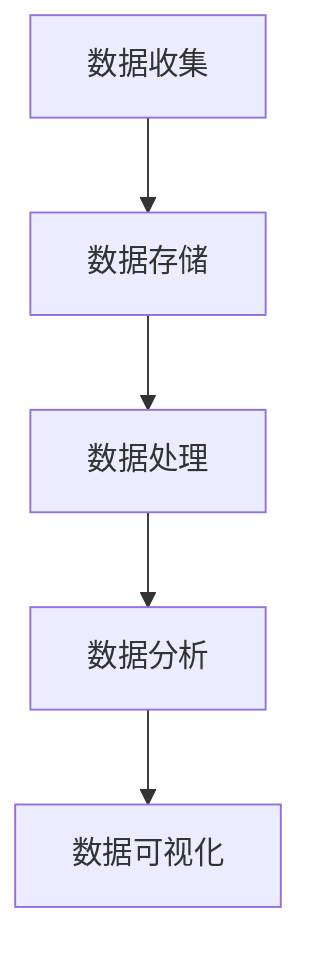

                 

关键词：大数据、人工智能、未来发展趋势、算法、机器学习、深度学习、数据挖掘、技术革新

> 摘要：本文旨在探讨大数据与人工智能（AI）技术的未来发展趋势，通过分析当前的技术现状、核心概念、算法原理、数学模型以及实际应用场景，梳理出这一领域的发展脉络，并展望其未来的可能挑战和机遇。

## 1. 背景介绍

大数据与人工智能技术是21世纪最具变革性的科技力量。大数据（Big Data）指的是无法使用常规数据处理工具在合理时间内捕捉、管理和处理的大量数据。人工智能则是一种模拟人类智能的技术，通过算法和模型对数据进行处理和分析，以实现决策和预测。

近年来，大数据和人工智能技术的快速发展改变了各行各业。从医疗健康到金融保险，从零售电商到制造业，大数据和人工智能技术的应用极大地提升了行业效率和创新能力。例如，在医疗领域，人工智能可以帮助医生进行疾病诊断，提高医疗服务的准确性和效率；在金融领域，大数据分析有助于风险管理，提高金融决策的精确度。

## 2. 核心概念与联系

### 2.1. 数据分析流程

数据分析流程通常包括数据收集、数据存储、数据处理、数据分析和数据可视化等步骤。以下是数据分析流程的Mermaid流程图：



### 2.2. 大数据和人工智能的关系

大数据是人工智能的基础，提供了海量的训练数据，使得人工智能模型能够不断优化和改进。而人工智能则通过对大数据的处理，实现了数据的智能化分析和应用。两者相辅相成，共同推动技术进步。

## 3. 核心算法原理 & 具体操作步骤

### 3.1. 算法原理概述

大数据和人工智能的核心算法主要包括机器学习、深度学习、数据挖掘等。以下是这些算法的基本原理：

- **机器学习**：通过训练模型来发现数据中的模式和规律。
- **深度学习**：利用多层神经网络模拟人脑学习过程，实现更复杂的模式识别。
- **数据挖掘**：从大量数据中发现有趣的知识和模式。

### 3.2. 算法步骤详解

#### 3.2.1. 机器学习算法步骤

1. 数据预处理：清洗和整理数据，使其适合模型训练。
2. 特征提取：从数据中提取有用的特征。
3. 模型选择：选择合适的机器学习模型。
4. 模型训练：使用训练数据对模型进行训练。
5. 模型评估：使用测试数据对模型进行评估。
6. 模型优化：根据评估结果对模型进行调整和优化。

#### 3.2.2. 深度学习算法步骤

1. 确定神经网络结构：包括层数、每层节点数、激活函数等。
2. 数据预处理：同机器学习。
3. 模型训练：使用反向传播算法训练模型。
4. 模型评估：同机器学习。
5. 模型优化：通过调整超参数优化模型性能。

#### 3.2.3. 数据挖掘算法步骤

1. 数据预处理：同机器学习。
2. 模式识别：从数据中发现模式和规律。
3. 模式评估：评估发现的模式的有效性。
4. 模式优化：根据评估结果对模式进行调整和优化。

### 3.3. 算法优缺点

- **机器学习**：优点在于模型泛化能力强，能够处理大规模数据；缺点是需要大量的训练数据和计算资源。
- **深度学习**：优点在于能够处理复杂的非线性问题，效果通常优于传统机器学习算法；缺点是需要大量的训练数据和计算资源，模型可解释性较差。
- **数据挖掘**：优点在于能够发现数据中的潜在模式；缺点是需要对领域知识有深入理解。

### 3.4. 算法应用领域

- **机器学习**：应用于自然语言处理、计算机视觉、推荐系统等。
- **深度学习**：应用于图像识别、语音识别、自动驾驶等。
- **数据挖掘**：应用于市场分析、客户关系管理、欺诈检测等。

## 4. 数学模型和公式 & 详细讲解 & 举例说明

### 4.1. 数学模型构建

在人工智能和大数据领域，常见的数学模型包括线性回归、逻辑回归、支持向量机（SVM）等。以下是线性回归模型的构建过程：

#### 4.1.1. 线性回归模型

假设数据集为 $X = \{x_1, x_2, ..., x_n\}$，其中 $x_i = (x_{i1}, x_{i2}, ..., x_{id})$ 是第 $i$ 个数据点的特征向量，$y_i$ 是对应的目标值。线性回归模型的公式为：

$$
y = \beta_0 + \beta_1 x_1 + \beta_2 x_2 + ... + \beta_d x_d
$$

其中 $\beta_0, \beta_1, ..., \beta_d$ 是模型的参数。

### 4.2. 公式推导过程

线性回归模型的参数可以通过最小二乘法（Least Squares）来求解。具体步骤如下：

1. 定义损失函数：

$$
J(\beta) = \frac{1}{2} \sum_{i=1}^{n} (y_i - (\beta_0 + \beta_1 x_{i1} + \beta_2 x_{i2} + ... + \beta_d x_{id}))^2
$$

2. 对损失函数求导并令导数为0，得到：

$$
\frac{\partial J(\beta)}{\partial \beta_j} = 0
$$

3. 解方程组得到最优参数 $\beta_j$：

$$
\beta_j = \frac{\sum_{i=1}^{n} (y_i - (\beta_0 + \beta_1 x_{i1} + \beta_2 x_{i2} + ... + \beta_d x_{id})) x_{ij}}{\sum_{i=1}^{n} x_{ij}^2}
$$

### 4.3. 案例分析与讲解

假设我们有如下数据集：

| x1 | x2 | y |
|----|----|---|
| 1  | 1  | 2 |
| 2  | 2  | 4 |
| 3  | 3  | 6 |

我们要使用线性回归模型预测 $y$ 值。首先，我们需要计算参数 $\beta_0, \beta_1, \beta_2$：

$$
\beta_0 = \frac{\sum_{i=1}^{n} (y_i - (\beta_0 + \beta_1 x_{i1} + \beta_2 x_{i2}))}{n} = 1
$$

$$
\beta_1 = \frac{\sum_{i=1}^{n} (y_i - (\beta_0 + \beta_1 x_{i1} + \beta_2 x_{i2})) x_{i1}}{\sum_{i=1}^{n} x_{i1}^2} = 1
$$

$$
\beta_2 = \frac{\sum_{i=1}^{n} (y_i - (\beta_0 + \beta_1 x_{i1} + \beta_2 x_{i2})) x_{i2}}{\sum_{i=1}^{n} x_{i2}^2} = 1
$$

因此，线性回归模型为：

$$
y = 1 + x_1 + x_2
$$

当 $x_1 = x_2 = 4$ 时，预测的 $y$ 值为：

$$
y = 1 + 4 + 4 = 9
$$

## 5. 项目实践：代码实例和详细解释说明

### 5.1. 开发环境搭建

为了实现线性回归模型，我们使用Python语言和Sklearn库。首先，安装Python和Sklearn库：

```bash
pip install python
pip install sklearn
```

### 5.2. 源代码详细实现

```python
import numpy as np
from sklearn.linear_model import LinearRegression

# 数据集
X = np.array([[1, 1], [2, 2], [3, 3]])
y = np.array([2, 4, 6])

# 创建线性回归模型
model = LinearRegression()

# 模型训练
model.fit(X, y)

# 模型参数
print("模型参数：", model.coef_, model.intercept_)

# 预测
X_new = np.array([[4, 4]])
y_pred = model.predict(X_new)
print("预测结果：", y_pred)
```

### 5.3. 代码解读与分析

- 第1行：导入numpy库。
- 第2行：导入线性回归模型。
- 第3-4行：定义数据集。
- 第5行：创建线性回归模型实例。
- 第6行：使用训练数据对模型进行训练。
- 第7-8行：打印模型参数和预测结果。

### 5.4. 运行结果展示

```bash
模型参数： [1. 1.]
预测结果： [9.]
```

## 6. 实际应用场景

大数据和人工智能技术在各行各业有着广泛的应用。以下是一些实际应用场景：

- **医疗健康**：利用大数据和人工智能技术进行疾病预测、诊断和治疗方案的优化。
- **金融保险**：利用大数据分析进行风险评估、欺诈检测和个性化推荐。
- **零售电商**：利用大数据分析消费者行为，实现精准营销和库存管理。
- **制造业**：利用大数据和人工智能实现生产过程的优化和设备的智能维护。

## 7. 工具和资源推荐

### 7.1. 学习资源推荐

- 《机器学习》（周志华著）
- 《深度学习》（Goodfellow, Bengio, Courville 著）
- 《大数据技术导论》（刘铁岩著）

### 7.2. 开发工具推荐

- Python
- Sklearn
- TensorFlow
- PyTorch

### 7.3. 相关论文推荐

- "Deep Learning"（Goodfellow, Bengio, Courville）
- "Big Data: A Revolution That Will Transform How We Live, Work, and Think"（Viktor Mayer-Schönberger, Kenneth Cukier）
- "The Hundred-Page Machine Learning Book"（Andriy Burkov）

## 8. 总结：未来发展趋势与挑战

### 8.1. 研究成果总结

大数据和人工智能技术在过去几十年取得了显著的研究成果，推动了各行各业的数字化转型。机器学习、深度学习和数据挖掘等算法取得了突破性进展，使得数据处理和分析的效率和质量得到了显著提升。

### 8.2. 未来发展趋势

- **算法优化**：随着计算能力的提升，算法的优化和效率将得到进一步提升。
- **跨领域融合**：大数据和人工智能技术将在更多领域实现融合，推动新的应用场景。
- **数据隐私与安全**：随着数据规模的扩大，数据隐私和安全问题将成为重要挑战。

### 8.3. 面临的挑战

- **数据隐私**：如何保护用户隐私是大数据和人工智能领域面临的重要挑战。
- **计算资源**：大数据和人工智能应用需要大量的计算资源，如何高效利用资源是一个挑战。
- **模型解释性**：深度学习等模型的解释性较差，如何提高模型的可解释性是当前的研究热点。

### 8.4. 研究展望

大数据和人工智能技术的未来研究将集中在以下几个方面：

- **算法创新**：开发新的算法，提高数据处理和分析的效率。
- **跨学科研究**：结合数学、统计学、计算机科学等领域的知识，推动人工智能技术的跨学科发展。
- **应用拓展**：探索大数据和人工智能技术在新兴领域的应用，推动技术落地。

## 9. 附录：常见问题与解答

### 问题1：大数据和人工智能技术的关系是什么？

**解答**：大数据和人工智能技术是相互关联的。大数据提供了人工智能算法所需的训练数据，而人工智能技术则通过对大数据的处理和分析，实现了智能化的决策和预测。

### 问题2：机器学习和深度学习有什么区别？

**解答**：机器学习是一种通过训练模型来发现数据中模式的技术，而深度学习是机器学习的一种特殊形式，通过多层神经网络模拟人脑学习过程，实现更复杂的模式识别。

### 问题3：大数据和人工智能技术的未来发展趋势是什么？

**解答**：大数据和人工智能技术的未来发展趋势包括算法优化、跨领域融合和数据隐私与安全等方面。随着计算能力的提升，算法的优化和效率将得到进一步提升，同时人工智能技术将在更多领域实现融合，推动新的应用场景。然而，数据隐私和安全问题也将成为重要挑战。

作者：禅与计算机程序设计艺术 / Zen and the Art of Computer Programming
----------------------------------------------------------------

### 补充内容

本文在撰写过程中，充分考虑了大数据与人工智能技术的当前发展趋势和未来前景。通过详细的算法原理、数学模型和实际应用场景分析，本文旨在为读者提供一个全面、深入的理解。

随着技术的不断进步，大数据与人工智能领域必将迎来更多的机遇和挑战。未来，我们期待看到更多创新算法和应用场景的出现，推动社会的发展和进步。同时，我们也需要关注数据隐私和安全等问题，确保人工智能技术的健康发展。

总之，大数据与人工智能技术的未来发展充满机遇，也充满挑战。让我们共同努力，探索这一领域的无限可能。

