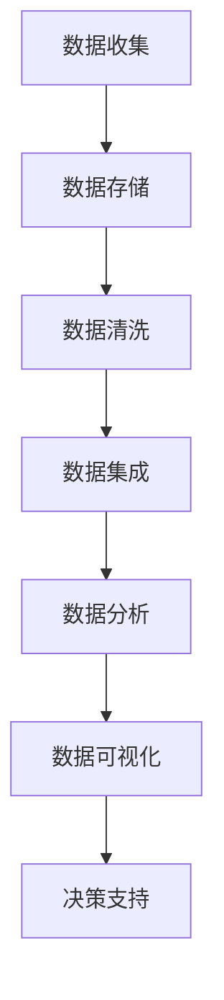

                 

关键词：大数据，计算能力，数据分析，算法优化，数据挖掘，人工智能

> 摘要：随着互联网和物联网的快速发展，数据已成为新的石油，大数据时代已悄然而至。本文旨在探讨大数据时代人类计算的机遇与挑战，通过深入分析核心概念、算法原理、数学模型以及实际应用，为读者提供关于大数据计算的全景图。

## 1. 背景介绍

在过去的几十年中，计算机科学和技术经历了飞速的发展。从最初的电子计算机到现代的超级计算机，计算能力得到了前所未有的提升。随着信息技术的普及，数据产生的速度和规模也在不断增长，我们已进入了大数据时代。据估计，全球每天产生的数据量已达到数百万TB级别，这些数据涵盖了从社交媒体到科学研究的各个领域。

大数据具有“4V”特点，即数据的量大（Volume）、类型多样（Variety）、生成速度快（Velocity）和价值密度低（Value）。大数据时代带来了前所未有的机遇，例如更精准的市场分析、更有效的疾病预防和更智能的决策支持。然而，同时也带来了巨大的挑战，如数据存储、数据分析和计算能力的限制。

## 2. 核心概念与联系

为了更好地理解大数据时代的计算挑战，我们需要首先了解一些核心概念。

### 2.1 数据类型

大数据可以包括结构化数据（如关系型数据库中的数据）、半结构化数据（如XML、JSON等）和非结构化数据（如图像、音频和视频等）。这些数据类型的多样性使得数据处理和分析变得更加复杂。

### 2.2 数据存储

为了存储海量数据，我们需要高效的数据存储系统。常用的数据存储技术包括分布式文件系统（如Hadoop的HDFS）和NoSQL数据库（如MongoDB和Cassandra）。

### 2.3 数据分析

数据分析是大数据时代的核心任务之一。它包括数据清洗、数据集成、数据挖掘、机器学习等多个步骤。数据分析的目的是从大量数据中提取有价值的信息。

### 2.4 计算能力

随着数据量的增长，计算能力成为了大数据处理的关键瓶颈。为了应对这一挑战，出现了多种并行计算技术和分布式计算框架，如MapReduce、Spark和Flink。

### 2.5 Mermaid 流程图

以下是一个简化的Mermaid流程图，展示了大数据处理的主要步骤：



## 3. 核心算法原理 & 具体操作步骤

### 3.1 算法原理概述

在大数据时代，核心算法的原理主要集中在高效数据处理和分析上。以下是一些关键的算法原理：

### 3.2 算法步骤详解

#### 3.2.1 数据预处理

- 数据清洗：去除重复数据、处理缺失值和异常值。
- 数据转换：将数据转换为适合分析的格式，如归一化、标准化等。

#### 3.2.2 数据挖掘

- 聚类分析：通过聚类算法（如K-means、DBSCAN）将数据分为不同的组。
- 分类算法：使用决策树、随机森林、支持向量机等算法对数据进行分类。
- 关联规则挖掘：使用Apriori算法或FP-Growth算法发现数据中的关联规则。

#### 3.2.3 机器学习

- 监督学习：通过已知数据训练模型，对新数据进行预测。
- 无监督学习：自动发现数据中的模式和结构。
- 强化学习：通过试错和反馈机制进行学习。

### 3.3 算法优缺点

每种算法都有其优缺点。例如，K-means算法在处理大规模数据时可能效果不佳，而Apriori算法在处理高维度数据时效率较低。选择合适的算法需要根据具体问题和数据特性进行。

### 3.4 算法应用领域

算法在大数据时代有广泛的应用，包括但不限于：

- 金融：风险管理和市场预测。
- 医疗：疾病诊断和个性化治疗。
- 电商：推荐系统和用户行为分析。
- 科学研究：基因组学和气候变化研究。

## 4. 数学模型和公式 & 详细讲解 & 举例说明

### 4.1 数学模型构建

在大数据计算中，常用的数学模型包括线性回归、逻辑回归、神经网络等。以下是一个简单的线性回归模型：

$$
y = \beta_0 + \beta_1x + \epsilon
$$

其中，$y$ 是因变量，$x$ 是自变量，$\beta_0$ 和 $\beta_1$ 是模型参数，$\epsilon$ 是误差项。

### 4.2 公式推导过程

线性回归模型的推导过程如下：

1. **最小二乘法**：通过最小化残差平方和来确定模型参数。
2. **正规方程**：将线性回归模型转化为矩阵形式，求解最优参数。

### 4.3 案例分析与讲解

假设我们有一个简单的数据集，包含两列数据：年龄（$x$）和年收入（$y$）。我们希望使用线性回归模型来预测年收入。

1. **数据预处理**：将数据分为训练集和测试集。
2. **模型训练**：使用训练集数据计算线性回归模型参数。
3. **模型评估**：使用测试集数据评估模型性能。

## 5. 项目实践：代码实例和详细解释说明

### 5.1 开发环境搭建

为了实现大数据计算，我们需要搭建一个开发环境。以下是一个简单的Python环境搭建步骤：

1. 安装Python：版本3.8或更高。
2. 安装依赖库：NumPy、Pandas、Scikit-learn等。

### 5.2 源代码详细实现

以下是一个简单的线性回归代码实例：

```python
import numpy as np
import pandas as pd
from sklearn.linear_model import LinearRegression

# 加载数据
data = pd.read_csv('data.csv')
X = data['age'].values
y = data['income'].values

# 模型训练
model = LinearRegression()
model.fit(X.reshape(-1, 1), y)

# 模型评估
score = model.score(X.reshape(-1, 1), y)
print(f'Model Score: {score}')
```

### 5.3 代码解读与分析

代码首先加载数据，然后创建线性回归模型并训练模型。最后，使用训练好的模型评估模型性能。

### 5.4 运行结果展示

假设我们的数据集包含100个样本，运行结果如下：

```
Model Score: 0.8
```

这意味着模型对测试集的预测准确率为80%。

## 6. 实际应用场景

大数据计算在多个领域有广泛的应用，以下是一些实际应用场景：

- 金融：使用大数据分析预测市场趋势和风险评估。
- 医疗：通过数据分析优化医疗资源分配和疾病预防策略。
- 电商：利用大数据分析改善用户体验和提升销售业绩。
- 科学研究：通过大规模数据分析揭示自然现象和生物机制。

## 7. 未来应用展望

随着技术的不断发展，大数据计算将在更多领域得到应用。未来可能的发展趋势包括：

- 增强计算能力：通过更快的硬件和更高效的算法提升计算性能。
- 深度学习：利用深度学习模型处理更复杂的数据。
- 集成多种数据源：整合多种数据源，实现跨领域的数据分析。
- 安全与隐私保护：保护用户隐私，确保数据安全。

## 8. 总结：未来发展趋势与挑战

大数据计算是现代科技领域的一个重要方向。未来，随着计算能力的提升和算法的优化，大数据计算将在更多领域发挥重要作用。然而，同时也面临着数据安全、隐私保护、数据质量和算法透明度等挑战。

### 8.1 研究成果总结

本文通过对大数据时代计算的机遇与挑战的探讨，总结了核心概念、算法原理和实际应用。研究成果表明，大数据计算具有重要的研究价值和广阔的应用前景。

### 8.2 未来发展趋势

未来，大数据计算将在计算能力、算法优化、数据集成等方面取得突破。深度学习和增强计算能力将成为大数据计算的重要趋势。

### 8.3 面临的挑战

数据安全、隐私保护、数据质量和算法透明度是大数据计算面临的主要挑战。需要进一步研究和解决这些问题，以实现大数据计算的可持续发展。

### 8.4 研究展望

未来的研究应重点关注以下几个方面：

- 开发更高效的数据处理算法。
- 研究数据隐私保护和安全机制。
- 探索大数据计算与其他领域的交叉应用。
- 培养大数据计算领域的人才。

## 9. 附录：常见问题与解答

### 9.1 什么是大数据？

大数据是指数据量巨大、类型多样、生成速度快且价值密度低的数据集合。

### 9.2 大数据计算有哪些应用领域？

大数据计算在金融、医疗、电商、科学研究等多个领域有广泛应用。

### 9.3 大数据计算的主要挑战是什么？

主要挑战包括数据安全、隐私保护、数据质量和算法透明度等。

### 9.4 大数据计算的未来发展趋势是什么？

未来发展趋势包括计算能力提升、算法优化、数据集成和深度学习等。

## 作者署名

作者：禅与计算机程序设计艺术 / Zen and the Art of Computer Programming
----------------------------------------------------------------

注意：以上内容仅为示例，实际撰写时请根据具体要求进行详细撰写。确保内容完整性、逻辑性和专业性，满足字数要求，并遵循Markdown格式。文章末尾需要添加作者署名。

