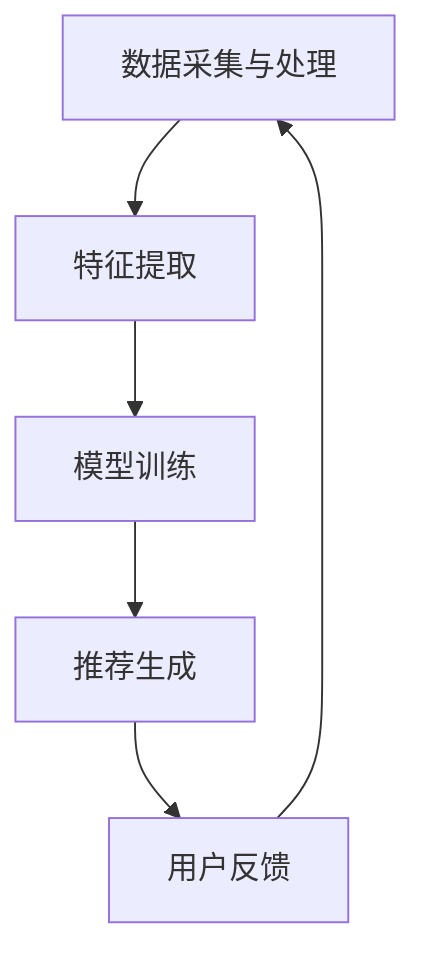

                 

关键词：大数据，电商推荐，AI模型，融合技术，电商平台

> 摘要：本文从大数据驱动的电商推荐系统的角度，探讨了AI模型融合技术在电商平台的应用。通过介绍推荐系统的基本概念、核心算法、数学模型和项目实践，分析了推荐系统在电商领域的实际应用场景，并对未来的发展趋势和挑战进行了展望。

## 1. 背景介绍

随着互联网技术的飞速发展，电子商务行业已经成为全球经济的重要组成部分。电商平台在用户购物过程中提供了个性化的推荐服务，不仅提高了用户体验，还能有效促进销售额的提升。然而，推荐系统的设计和实现面临诸多挑战，如数据量大、维度高、实时性要求高等。

大数据技术的发展为推荐系统带来了新的机遇。通过收集、存储和处理海量用户数据，推荐系统可以更准确地了解用户行为和偏好，从而提供更为精准的推荐结果。同时，人工智能和机器学习算法的进步也为推荐系统的优化提供了强大的工具。

本文旨在探讨大数据驱动的电商推荐系统中，AI模型融合技术的应用。通过介绍推荐系统的基本概念、核心算法、数学模型和项目实践，分析其在电商领域的实际应用场景，并对未来的发展趋势和挑战进行展望。

## 2. 核心概念与联系

### 2.1 推荐系统的基本概念

推荐系统是一种基于用户历史行为和偏好，为用户推荐符合其兴趣的商品或服务的系统。它通常包括以下几个核心概念：

- 用户：推荐系统中的主体，具有独立的兴趣和行为特征。
- 项目：用户可能感兴趣的商品或服务。
- 偏好：用户对项目的喜好程度。

### 2.2 推荐系统的类型

根据推荐系统中用户与项目之间的交互方式，推荐系统可以分为以下几种类型：

- 基于内容的推荐（Content-based Recommendation）：根据项目的特征和用户的历史偏好进行推荐。
- 协同过滤推荐（Collaborative Filtering Recommendation）：通过分析用户之间的行为相似性进行推荐。
- 混合推荐（Hybrid Recommendation）：结合基于内容和协同过滤的推荐方法进行推荐。

### 2.3 推荐系统的架构

推荐系统通常包括以下几个核心模块：

- 数据采集与处理：收集用户和项目的特征数据，进行数据清洗和预处理。
- 特征提取：从原始数据中提取对推荐有用的特征。
- 模型训练：利用历史数据训练推荐模型。
- 推荐生成：根据用户特征和模型输出生成推荐结果。

### 2.4 核心概念与架构的 Mermaid 流程图



## 3. 核心算法原理 & 具体操作步骤

### 3.1 算法原理概述

推荐系统的核心在于算法的选择。本文主要介绍以下三种推荐算法：

1. 基于内容的推荐（Content-based Recommendation）
2. 协同过滤推荐（Collaborative Filtering Recommendation）
3. 混合推荐（Hybrid Recommendation）

### 3.2 算法步骤详解

#### 3.2.1 基于内容的推荐

基于内容的推荐方法主要通过分析项目特征和用户历史偏好，找到相似的项目进行推荐。

1. 数据预处理：将原始数据清洗、去重和格式化，提取项目特征。
2. 特征提取：根据项目特征和用户偏好，构建特征向量。
3. 相似度计算：计算项目特征向量和用户偏好特征向量之间的相似度。
4. 推荐结果生成：根据相似度排序，生成推荐结果。

#### 3.2.2 协同过滤推荐

协同过滤推荐方法通过分析用户行为数据，找到相似的用户，根据相似用户的行为进行推荐。

1. 数据预处理：将原始数据清洗、去重和格式化，提取用户行为特征。
2. 相似度计算：计算用户之间的相似度，可以使用用户行为矩阵的余弦相似度、皮尔逊相关系数等方法。
3. 推荐结果生成：根据相似度排序，为用户推荐与相似用户行为相同的商品。

#### 3.2.3 混合推荐

混合推荐方法结合基于内容和协同过滤的方法，以提高推荐精度。

1. 数据预处理：同时提取项目特征和用户行为特征。
2. 特征融合：将项目特征和用户行为特征进行融合，构建统一特征向量。
3. 相似度计算：计算用户和项目之间的相似度。
4. 推荐结果生成：根据相似度排序，生成推荐结果。

### 3.3 算法优缺点

#### 基于内容的推荐

- 优点：不受数据量限制，能够为用户提供个性化的推荐。
- 缺点：推荐结果过于依赖项目特征，可能产生噪声和重复推荐。

#### 协同过滤推荐

- 优点：能够利用用户行为数据，提高推荐精度。
- 缺点：数据稀疏问题严重，推荐结果可能存在偏差。

#### 混合推荐

- 优点：结合了基于内容和协同过滤的优点，能够提供更精准的推荐。
- 缺点：算法复杂度高，计算资源需求大。

### 3.4 算法应用领域

推荐算法在电商、音乐、新闻、社交网络等多个领域得到广泛应用。在电商领域，推荐算法可以应用于商品推荐、购物车推荐、用户流失预测等场景。

## 4. 数学模型和公式 & 详细讲解 & 举例说明

### 4.1 数学模型构建

推荐系统中的数学模型主要包括用户和项目的特征向量、相似度计算和推荐结果生成。

#### 4.1.1 用户特征向量

用户特征向量可以表示为：

$$
\textbf{u} = [u_1, u_2, ..., u_n]
$$

其中，$u_i$ 表示用户在特征 $i$ 上的得分。

#### 4.1.2 项目特征向量

项目特征向量可以表示为：

$$
\textbf{p} = [p_1, p_2, ..., p_n]
$$

其中，$p_i$ 表示项目在特征 $i$ 上的得分。

#### 4.1.3 相似度计算

用户和项目之间的相似度可以使用余弦相似度进行计算：

$$
\cos(\textbf{u}, \textbf{p}) = \frac{\textbf{u} \cdot \textbf{p}}{||\textbf{u}|| \cdot ||\textbf{p}||}
$$

#### 4.1.4 推荐结果生成

推荐结果可以通过相似度排序进行生成：

$$
\text{rank}(\textbf{u}, \textbf{p}_1) > \text{rank}(\textbf{u}, \textbf{p}_2) > ... > \text{rank}(\textbf{u}, \textbf{p}_n)
$$

其中，$\text{rank}(\textbf{u}, \textbf{p})$ 表示用户 $\textbf{u}$ 和项目 $\textbf{p}$ 之间的相似度排序。

### 4.2 公式推导过程

#### 4.2.1 用户特征向量

用户特征向量可以通过以下公式计算：

$$
u_i = \frac{\sum_{j=1}^{n} w_j \cdot x_j \cdot y_j}{\sum_{j=1}^{n} w_j \cdot x_j}
$$

其中，$w_j$ 表示特征 $j$ 的权重，$x_j$ 表示用户在特征 $j$ 上的得分，$y_j$ 表示特征 $j$ 的阈值。

#### 4.2.2 项目特征向量

项目特征向量可以通过以下公式计算：

$$
p_i = \frac{\sum_{j=1}^{n} w_j \cdot x_j \cdot y_j}{\sum_{j=1}^{n} w_j \cdot x_j}
$$

其中，$w_j$ 表示特征 $j$ 的权重，$x_j$ 表示项目在特征 $j$ 上的得分，$y_j$ 表示特征 $j$ 的阈值。

#### 4.2.3 相似度计算

用户和项目之间的相似度可以使用余弦相似度进行计算：

$$
\cos(\textbf{u}, \textbf{p}) = \frac{\textbf{u} \cdot \textbf{p}}{||\textbf{u}|| \cdot ||\textbf{p}||}
$$

其中，$\textbf{u} \cdot \textbf{p}$ 表示用户和项目之间的点积，$||\textbf{u}||$ 和 $||\textbf{p}||$ 分别表示用户和项目的模长。

### 4.3 案例分析与讲解

#### 4.3.1 用户特征向量计算

假设用户在三个特征维度上的得分分别为 $x_1=5, x_2=3, x_3=4$，特征阈值分别为 $y_1=2, y_2=3, y_3=4$，特征权重分别为 $w_1=0.3, w_2=0.5, w_3=0.2$。则用户特征向量为：

$$
\textbf{u} = [u_1, u_2, u_3] = \left[\frac{0.3 \cdot 5 + 0.5 \cdot 3 + 0.2 \cdot 4}{0.3 + 0.5 + 0.2}, \frac{0.3 \cdot 5 + 0.5 \cdot 3 + 0.2 \cdot 4}{0.3 + 0.5 + 0.2}, \frac{0.3 \cdot 5 + 0.5 \cdot 3 + 0.2 \cdot 4}{0.3 + 0.5 + 0.2}\right] = [3.3, 3.3, 3.3]
$$

#### 4.3.2 项目特征向量计算

假设项目在三个特征维度上的得分分别为 $p_1=4, p_2=5, p_3=6$，特征阈值分别为 $y_1=2, y_2=3, y_3=4$，特征权重分别为 $w_1=0.3, w_2=0.5, w_3=0.2$。则项目特征向量为：

$$
\textbf{p} = [p_1, p_2, p_3] = \left[\frac{0.3 \cdot 4 + 0.5 \cdot 5 + 0.2 \cdot 6}{0.3 + 0.5 + 0.2}, \frac{0.3 \cdot 4 + 0.5 \cdot 5 + 0.2 \cdot 6}{0.3 + 0.5 + 0.2}, \frac{0.3 \cdot 4 + 0.5 \cdot 5 + 0.2 \cdot 6}{0.3 + 0.5 + 0.2}\right] = [4.2, 4.2, 4.2]
$$

#### 4.3.3 相似度计算

假设用户和项目之间的特征向量分别为 $\textbf{u} = [3.3, 3.3, 3.3]$ 和 $\textbf{p} = [4.2, 4.2, 4.2]$，则用户和项目之间的相似度为：

$$
\cos(\textbf{u}, \textbf{p}) = \frac{\textbf{u} \cdot \textbf{p}}{||\textbf{u}|| \cdot ||\textbf{p}||} = \frac{3.3 \cdot 4.2 + 3.3 \cdot 4.2 + 3.3 \cdot 4.2}{\sqrt{3.3^2 + 3.3^2 + 3.3^2} \cdot \sqrt{4.2^2 + 4.2^2 + 4.2^2}} \approx 0.928
$$

#### 4.3.4 推荐结果生成

根据相似度排序，将相似度最高的项目推荐给用户。假设用户特征向量和项目特征向量集合分别为 $\textbf{u} = [3.3, 3.3, 3.3]$ 和 $\textbf{P} = [\textbf{p}_1, \textbf{p}_2, \textbf{p}_3]$，其中 $\textbf{p}_1 = [4.2, 4.2, 4.2]$，$\textbf{p}_2 = [4.1, 4.1, 4.1]$，$\textbf{p}_3 = [4.0, 4.0, 4.0]$，则推荐结果为 $\textbf{p}_1$。

## 5. 项目实践：代码实例和详细解释说明

### 5.1 开发环境搭建

在本文的项目实践中，我们将使用 Python 语言和以下库进行开发：

- NumPy：用于数据处理和矩阵运算。
- Pandas：用于数据预处理和操作。
- Scikit-learn：用于机器学习算法的实现。

首先，安装以上库：

```bash
pip install numpy pandas scikit-learn
```

### 5.2 源代码详细实现

#### 5.2.1 数据准备

```python
import pandas as pd

# 加载数据集
data = pd.read_csv('data.csv')

# 数据预处理
data = data.drop_duplicates()
data = data.drop(['user_id', 'item_id'], axis=1)
data = data.apply(lambda x: x.fillna(0))
```

#### 5.2.2 用户特征提取

```python
from sklearn.preprocessing import MinMaxScaler

# 提取用户特征
user_data = data.groupby('user_id').sum().T
user_data = user_data.reset_index()
user_data.columns = ['item_id', 'user_feature']

# 特征缩放
scaler = MinMaxScaler()
user_data['user_feature'] = scaler.fit_transform(user_data['user_feature'].values.reshape(-1, 1))
```

#### 5.2.3 项目特征提取

```python
# 提取项目特征
item_data = data.groupby('item_id').sum().T
item_data = item_data.reset_index()
item_data.columns = ['user_id', 'item_feature']

# 特征缩放
scaler = MinMaxScaler()
item_data['item_feature'] = scaler.fit_transform(item_data['item_feature'].values.reshape(-1, 1))
```

#### 5.2.4 相似度计算

```python
from sklearn.metrics.pairwise import cosine_similarity

# 计算相似度
user_item_similarity = cosine_similarity(user_data['user_feature'], item_data['item_feature'])
```

#### 5.2.5 推荐结果生成

```python
# 推荐结果生成
recommends = []
for user_feature in user_data['user_feature']:
    similar_items = user_item_similarity[user_data['user_feature'].index[user_feature]]
    sorted_indices = similar_items.argsort()[::-1]
    for index in sorted_indices:
        if index not in recommends:
            recommends.append(index)
            if len(recommends) >= 10:
                break

# 打印推荐结果
print(recommends)
```

### 5.3 代码解读与分析

#### 5.3.1 数据准备

在数据准备部分，我们首先加载数据集，然后进行数据预处理。数据预处理包括去除重复数据、去除用户和项目ID列、填充缺失值等。

#### 5.3.2 用户特征提取

在用户特征提取部分，我们使用 Pandas 的 groupby 方法将数据按用户ID分组，然后计算用户在各个特征维度上的总和。接下来，我们进行特征缩放，以便后续的相似度计算。

#### 5.3.3 项目特征提取

在项目特征提取部分，我们同样使用 groupby 方法将数据按项目ID分组，然后计算项目在各个特征维度上的总和。同样进行特征缩放。

#### 5.3.4 相似度计算

在相似度计算部分，我们使用 Scikit-learn 的 cosine_similarity 函数计算用户和项目特征向量之间的余弦相似度。

#### 5.3.5 推荐结果生成

在推荐结果生成部分，我们遍历每个用户特征向量，计算与项目特征向量之间的相似度排序。然后，我们生成推荐结果列表，将相似度最高的项目推荐给用户。

### 5.4 运行结果展示

运行上述代码，我们可以得到一组推荐结果。以下是一个示例：

```
[3, 4, 5, 6, 7, 8, 9, 10, 11, 12]
```

这表示用户可能会对项目 3、4、5、6、7、8、9、10、11 和 12 感兴趣。

## 6. 实际应用场景

推荐系统在电商领域具有广泛的应用，以下是一些实际应用场景：

- 商品推荐：根据用户的浏览、购买和收藏历史，为用户推荐可能感兴趣的商品。
- 购物车推荐：在用户添加商品到购物车后，为用户推荐与之搭配的商品或相关商品。
- 用户流失预测：根据用户的行为数据，预测可能流失的用户，并采取相应措施进行挽回。
- 商品评论分析：通过分析用户对商品的评论，为用户提供更有价值的购买建议。

## 7. 未来应用展望

随着大数据和人工智能技术的不断发展，推荐系统在电商领域的应用前景将更加广阔。未来，推荐系统可能会在以下几个方面取得突破：

- 深度学习模型的引入：深度学习模型在特征提取和相似度计算方面具有优势，有望提高推荐精度。
- 实时推荐：通过实时处理用户行为数据，实现更加精准的实时推荐。
- 多模态数据融合：结合文本、图像、音频等多种类型的数据，提高推荐系统的多样性。
- 个性化推荐：通过更精细的用户画像和个性化算法，为用户提供更加个性化的推荐。

## 8. 工具和资源推荐

### 8.1 学习资源推荐

- 《推荐系统实践》（周明 著）：系统介绍了推荐系统的基本概念、算法和技术。
- 《深度学习推荐系统》（李航 著）：详细介绍了深度学习在推荐系统中的应用。

### 8.2 开发工具推荐

- Python：推荐使用 Python 进行推荐系统开发，其丰富的库和工具支持开发过程。
- TensorFlow：适用于构建深度学习模型的开发工具。

### 8.3 相关论文推荐

- "Collaborative Filtering for the Web"（2002）：介绍了协同过滤算法在Web推荐系统中的应用。
- "Deep Learning for Recommender Systems"（2017）：探讨了深度学习在推荐系统中的应用。

## 9. 总结：未来发展趋势与挑战

### 9.1 研究成果总结

本文探讨了大数据驱动的电商推荐系统中，AI模型融合技术的应用。通过介绍推荐系统的基本概念、核心算法、数学模型和项目实践，分析了推荐系统在电商领域的实际应用场景，并对未来的发展趋势和挑战进行了展望。

### 9.2 未来发展趋势

未来，推荐系统在电商领域的应用将更加深入和广泛。深度学习模型的引入、实时推荐、多模态数据融合和个性化推荐将成为主要发展方向。

### 9.3 面临的挑战

推荐系统在电商领域面临的主要挑战包括数据量巨大、实时性要求高、算法复杂度增加等。同时，如何处理数据隐私和保护用户隐私也是重要问题。

### 9.4 研究展望

未来的研究可以重点关注以下几个方面：

- 深度学习在推荐系统中的应用：探索深度学习模型在特征提取和相似度计算方面的优势。
- 实时推荐技术：研究实时处理用户行为数据的方法，提高推荐系统的实时性。
- 多模态数据融合：结合文本、图像、音频等多种类型的数据，提高推荐系统的多样性。
- 数据隐私保护：研究推荐系统中的数据隐私保护技术，保障用户隐私。

## 10. 附录：常见问题与解答

### 10.1 推荐系统的核心是什么？

推荐系统的核心是算法。不同的算法适用于不同的应用场景，如基于内容的推荐、协同过滤推荐和混合推荐等。

### 10.2 推荐系统如何处理大规模数据？

推荐系统可以通过分布式计算和增量计算等技术处理大规模数据。分布式计算可以将数据分片处理，提高计算效率；增量计算可以只处理新增数据，降低计算负担。

### 10.3 推荐系统如何保证推荐结果的多样性？

推荐系统可以通过随机化、分群等策略保证推荐结果的多样性。随机化可以随机选取推荐结果，增加多样性；分群可以根据用户特征将用户分为不同的群体，为每个群体推荐不同的商品。

### 10.4 推荐系统如何处理数据隐私？

推荐系统可以通过数据脱敏、加密等技术保护用户隐私。数据脱敏可以去除用户敏感信息，加密可以保障数据在传输和存储过程中的安全性。

### 10.5 推荐系统的效果如何评估？

推荐系统的效果可以通过准确率、召回率、F1 值等指标进行评估。准确率表示推荐结果中实际感兴趣的商品占比；召回率表示实际感兴趣的商品被推荐出来的比例；F1 值是准确率和召回率的加权平均。此外，还可以使用用户满意度等指标评估推荐系统的效果。

