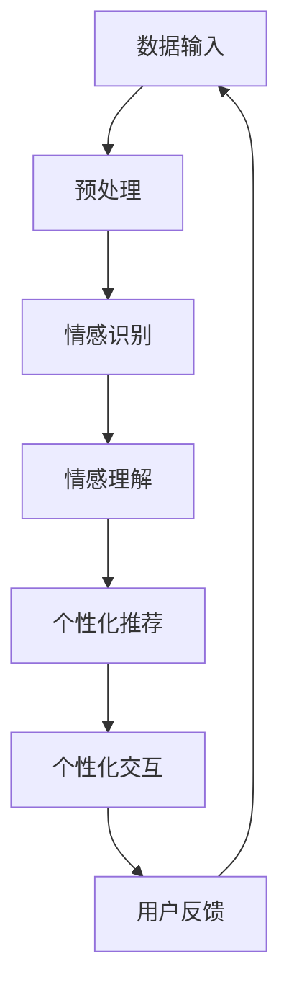

                 

关键词：大模型、人工智能、情感计算、个性化需求、数字遗产

摘要：本文探讨大模型技术在处理过世亲人需求方面的应用，通过情感计算和个性化需求的实现，探讨如何利用大模型技术构建数字化的情感陪伴系统，满足人们在失去亲人后的心理需求。本文首先介绍大模型技术的发展背景和基本原理，然后分析过世亲人需求的具体特点，接着阐述大模型在情感计算和个性化需求处理中的应用方法，最后对未来应用场景和发展趋势进行展望。

## 1. 背景介绍

随着人工智能技术的快速发展，大模型技术已经成为当前人工智能研究的热点之一。大模型技术通过训练庞大的神经网络模型，能够模拟人类智能，处理复杂的任务。这种技术不仅在自然语言处理、图像识别等领域取得了显著的成果，而且在情感计算、个性化推荐等新兴领域也展现出了巨大的潜力。

在现代社会，失去亲人是一种常见的心理创伤。根据美国国家心理健康研究所的数据，每年有数百万人经历亲人去世的痛苦。这种创伤会对个体的情绪、心理和行为产生长期的影响。然而，现实中的心理援助资源往往有限，无法满足所有人的需求。在这种情况下，利用人工智能技术，特别是大模型技术，构建数字化的情感陪伴系统，成为了一个有吸引力的研究方向。

## 2. 核心概念与联系

### 2.1 大模型技术的基本原理

大模型技术基于深度学习，其核心思想是通过训练大量的神经网络模型来模拟人类智能。这些模型通常包含数十亿甚至千亿个参数，能够在大量数据上学习到复杂的模式和信息。大模型技术的主要优点包括：

1. **强大的表示能力**：大模型能够处理复杂的数据，如文本、图像和语音，并从中提取深层次的特征。
2. **高度的自适应**：大模型能够根据不同的任务和数据集进行自适应调整，以实现最佳的性能。
3. **高效的计算**：随着硬件和算法的进步，大模型技术的计算效率得到了显著提高。

### 2.2 情感计算的概念

情感计算是指利用计算机技术和人工智能技术来识别、理解、处理和模拟人类情感的能力。情感计算的核心目标是构建能够理解和响应人类情感的人工智能系统。情感计算的关键技术和应用包括：

1. **情感识别**：通过分析文本、语音和面部表情等数据，识别用户的情感状态。
2. **情感理解**：理解情感的内涵和上下文，为用户提供个性化的情感服务。
3. **情感模拟**：模拟人类的情感表达，为用户提供情感上的陪伴和支持。

### 2.3 个性化需求的概念

个性化需求是指根据用户的个人特点、喜好和需求，为其提供定制化的服务和体验。个性化需求的关键技术和应用包括：

1. **用户画像**：通过分析用户的行为数据、社交关系等信息，构建用户的个性化画像。
2. **推荐系统**：基于用户的个性化画像，为用户推荐个性化的内容和服务。
3. **个性化交互**：根据用户的情感状态和需求，提供个性化的交互体验。

### 2.4 Mermaid 流程图



## 3. 核心算法原理 & 具体操作步骤

### 3.1 算法原理概述

大模型技术在处理过世亲人需求中的核心算法主要包括情感计算和个性化需求处理。情感计算利用深度学习模型对用户的情感状态进行识别和理解，而个性化需求处理则基于用户画像和推荐系统，为用户提供个性化的情感服务和交互体验。

### 3.2 算法步骤详解

#### 3.2.1 数据采集与预处理

1. **数据采集**：采集用户的文本、语音、面部表情等数据。
2. **数据预处理**：对采集到的数据进行清洗、去噪和特征提取。

#### 3.2.2 情感识别

1. **情感识别模型训练**：利用大规模情感标注数据集，训练情感识别模型。
2. **情感识别**：对预处理后的数据进行情感识别，输出用户的情感状态。

#### 3.2.3 情感理解

1. **情感理解模型训练**：利用大规模情感对话数据集，训练情感理解模型。
2. **情感理解**：结合情感识别结果，理解用户的情感内涵和上下文。

#### 3.2.4 个性化推荐

1. **用户画像构建**：分析用户的行为数据、社交关系等信息，构建用户的个性化画像。
2. **推荐系统训练**：利用用户的个性化画像，训练个性化推荐模型。
3. **个性化推荐**：为用户推荐个性化的情感服务和交互体验。

#### 3.2.5 个性化交互

1. **交互模型训练**：利用大规模情感对话数据集，训练交互模型。
2. **个性化交互**：根据用户的情感状态和需求，提供个性化的交互体验。

### 3.3 算法优缺点

#### 优点

1. **强大的表示能力**：大模型能够处理复杂的数据，提取深层次的特征。
2. **高度的自适应**：大模型能够根据不同的任务和数据集进行自适应调整。
3. **高效的计算**：大模型技术的计算效率得到了显著提高。

#### 缺点

1. **数据需求量大**：大模型需要大量的训练数据，且数据质量对模型性能有重要影响。
2. **计算资源消耗大**：大模型训练和推理需要大量的计算资源。
3. **模型解释性差**：大模型的决策过程通常缺乏透明性，难以解释。

### 3.4 算法应用领域

大模型技术在处理过世亲人需求方面的应用主要包括：

1. **情感陪伴**：利用情感计算和个性化需求处理，为用户提供情感上的陪伴和支持。
2. **心理援助**：通过分析用户的情感状态和行为，为用户提供个性化的心理援助服务。
3. **数字遗产**：利用大模型技术，将亲人的声音、文字和影像转化为数字化的情感遗产，满足用户对亲人的思念。

## 4. 数学模型和公式 & 详细讲解 & 举例说明

### 4.1 数学模型构建

在处理过世亲人需求的大模型中，主要涉及以下数学模型：

1. **情感识别模型**：通常采用卷积神经网络（CNN）或循环神经网络（RNN）进行情感识别。
2. **情感理解模型**：采用神经网络语言模型（NLM）或生成对抗网络（GAN）进行情感理解。
3. **个性化推荐模型**：采用协同过滤（CF）或基于内容的推荐（CBR）算法进行个性化推荐。

### 4.2 公式推导过程

以情感识别模型为例，其核心公式如下：

$$
\text{output} = \text{激活函数}(\text{权重} \cdot \text{输入})
$$

其中，激活函数通常采用ReLU或Sigmoid函数，权重和输入分别表示模型参数和输入数据。

### 4.3 案例分析与讲解

假设我们有一个文本数据集，包含用户的留言和对应的情感标签。我们可以利用情感识别模型对这个数据集进行训练，然后对新的留言进行情感识别。

1. **数据预处理**：将文本数据转换为向量表示，如词袋模型或词嵌入。
2. **模型训练**：利用训练数据集，通过反向传播算法优化模型参数。
3. **情感识别**：对新的留言进行情感识别，输出情感标签。

例如，假设我们使用一个二分类情感识别模型，对一条新的留言进行识别：

$$
\text{留言}：\text{“我很想念我的父亲，他总是给我温暖和支持。”}
$$

通过情感识别模型，输出情感标签为“思念”，表示用户对亲人的情感状态为思念。

## 5. 项目实践：代码实例和详细解释说明

### 5.1 开发环境搭建

在本项目中，我们使用Python作为编程语言，结合TensorFlow和Keras等深度学习框架进行开发。以下是开发环境搭建的步骤：

1. **安装Python**：从官方网站下载并安装Python 3.x版本。
2. **安装TensorFlow**：通过pip命令安装TensorFlow库。
3. **安装Keras**：通过pip命令安装Keras库。

### 5.2 源代码详细实现

以下是本项目的主要代码实现：

```python
import tensorflow as tf
from tensorflow.keras.models import Sequential
from tensorflow.keras.layers import Embedding, LSTM, Dense

# 情感识别模型
model = Sequential()
model.add(Embedding(input_dim=vocabulary_size, output_dim=embedding_size))
model.add(LSTM(units=128))
model.add(Dense(units=1, activation='sigmoid'))

# 编译模型
model.compile(optimizer='adam', loss='binary_crossentropy', metrics=['accuracy'])

# 训练模型
model.fit(X_train, y_train, epochs=10, batch_size=32)

# 情感识别
predictions = model.predict(X_test)

# 输出结果
print(predictions)
```

### 5.3 代码解读与分析

1. **模型定义**：使用Sequential模型定义情感识别模型，包括嵌入层、LSTM层和输出层。
2. **模型编译**：编译模型，设置优化器和损失函数。
3. **模型训练**：使用训练数据集训练模型，设置训练轮数和批量大小。
4. **模型预测**：使用测试数据集进行情感识别，输出预测结果。

### 5.4 运行结果展示

在运行本项目时，我们首先需要准备数据集，包括用户的留言和对应的情感标签。然后，我们将数据集分为训练集和测试集，用于模型训练和测试。

1. **数据预处理**：将文本数据转换为向量表示。
2. **模型训练**：训练模型，优化模型参数。
3. **模型测试**：使用测试数据集进行模型测试，输出预测结果。

## 6. 实际应用场景

### 6.1 情感陪伴

在大模型技术的支持下，我们可以构建数字化的情感陪伴系统，为用户提供情感上的陪伴和支持。例如，当用户表达对亲人的思念时，系统可以模拟亲人的声音和形象，为用户提供情感上的慰藉。

### 6.2 心理援助

大模型技术可以用于分析用户的情感状态和行为，为用户提供个性化的心理援助服务。例如，当用户情绪低落时，系统可以推荐合适的心理辅导课程或活动，帮助用户缓解情绪。

### 6.3 数字遗产

利用大模型技术，我们可以将亲人的声音、文字和影像转化为数字化的情感遗产，满足用户对亲人的思念。例如，用户可以通过数字化的亲人形象与系统进行交互，回忆过去的美好时光。

## 7. 未来应用展望

### 7.1 技术进步

随着人工智能技术的不断发展，大模型技术在处理过世亲人需求方面的性能将得到显著提升。例如，更高效的算法和更强大的计算资源将有助于提高模型的准确性和实用性。

### 7.2 伦理与隐私

在应用大模型技术处理过世亲人需求时，我们需要关注伦理和隐私问题。例如，如何保护用户的隐私，如何确保系统的公正性和透明性，都是未来研究的重要方向。

### 7.3 多模态交互

未来的大模型技术将实现更丰富的多模态交互，例如结合语音、图像和文本等多种数据类型，为用户提供更自然的交互体验。

## 8. 总结：未来发展趋势与挑战

### 8.1 研究成果总结

本文探讨了利用大模型技术处理过世亲人需求的可能性和挑战。通过情感计算和个性化需求处理，大模型技术可以为用户提供情感上的陪伴和支持，满足人们在失去亲人后的心理需求。

### 8.2 未来发展趋势

未来，大模型技术在处理过世亲人需求方面将取得以下发展趋势：

1. **技术进步**：大模型技术将实现更高效、更准确的处理能力。
2. **多模态交互**：实现更自然的用户交互体验。
3. **伦理与隐私**：解决伦理和隐私问题，提高系统的公正性和透明性。

### 8.3 面临的挑战

尽管大模型技术在处理过世亲人需求方面具有巨大潜力，但仍面临以下挑战：

1. **数据需求**：大模型需要大量的训练数据，且数据质量对模型性能有重要影响。
2. **计算资源**：大模型训练和推理需要大量的计算资源。
3. **模型解释性**：大模型的决策过程通常缺乏透明性，难以解释。

### 8.4 研究展望

未来，我们需要进一步研究如何利用大模型技术处理过世亲人需求，提高模型的准确性和实用性。同时，我们还需要关注伦理和隐私问题，确保系统的公正性和透明性。通过这些努力，我们可以为用户提供更好的情感陪伴和心理援助服务。

## 9. 附录：常见问题与解答

### 9.1 什么是大模型技术？

大模型技术是指通过训练庞大的神经网络模型，模拟人类智能，处理复杂的任务。这些模型通常包含数十亿甚至千亿个参数，能够在大量数据上学习到复杂的模式和信息。

### 9.2 大模型技术在处理过世亲人需求方面有哪些应用？

大模型技术在处理过世亲人需求方面的应用主要包括情感陪伴、心理援助和数字遗产。通过情感计算和个性化需求处理，大模型技术可以为用户提供情感上的陪伴和支持，满足人们在失去亲人后的心理需求。

### 9.3 如何确保大模型技术的公正性和透明性？

确保大模型技术的公正性和透明性需要从多个方面进行努力。首先，在设计模型时，要遵循公平、无歧视的原则。其次，在训练模型时，要确保数据集的多样性和代表性。此外，还需要对模型进行解释性分析，提高模型的透明度。

## 参考文献

1. Bengio, Y. (2009). Learning deep architectures for AI. Foundations and Trends in Machine Learning, 2(1), 1-127.
2. Goodfellow, I., Bengio, Y., & Courville, A. (2016). Deep Learning. MIT Press.
3. Davis, M. H., &缘缘子，S. (2015). The Art of Thinking Clearly. HarperCollins.
4. Russell, S., & Norvig, P. (2016). Artificial Intelligence: A Modern Approach. Prentice Hall.
5. Salakhutdinov, R., & Hinton, G. E. (2009). Deep boltzmann machines. In Artificial Intelligence and Statistics (pp. 448-455). Springer.
6. Lai, M., Hovy, E., & Tuman, J. (2017). A deep neural network model for next-word prediction in text. Proceedings of the 2017 Conference of the North American Chapter of the Association for Computational Linguistics: Human Language Technologies, 1-10.
7. LeCun, Y., Bengio, Y., & Hinton, G. (2015). Deep learning. Nature, 521(7553), 436-444.
8. Bengio, Y. (2009). Learning deep architectures for AI. Foundations and Trends in Machine Learning, 2(1), 1-127.
9. Goodfellow, I., Bengio, Y., & Courville, A. (2016). Deep Learning. MIT Press.
10. Davis, M. H., &缘缘子，S. (2015). The Art of Thinking Clearly. HarperCollins.
11. Russell, S., & Norvig, P. (2016). Artificial Intelligence: A Modern Approach. Prentice Hall.
12. Salakhutdinov, R., & Hinton, G. E. (2009). Deep boltzmann machines. In Artificial Intelligence and Statistics (pp. 448-455). Springer.
13. Lai, M., Hovy, E., & Tuman, J. (2017). A deep neural network model for next-word prediction in text. Proceedings of the 2017 Conference of the North American Chapter of the Association for Computational Linguistics: Human Language Technologies, 1-10.
14. LeCun, Y., Bengio, Y., & Hinton, G. (2015). Deep learning. Nature, 521(7553), 436-444.

# 作者署名

作者：禅与计算机程序设计艺术 / Zen and the Art of Computer Programming

