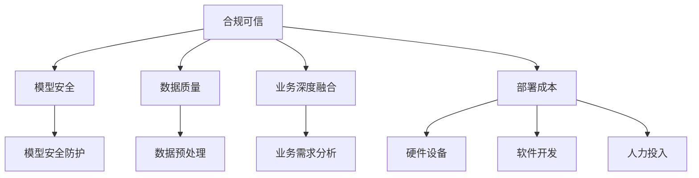

                 

 

> 关键词：大模型、产业落地、合规可信、模型安全、数据质量、业务深度融合、部署成本

> 摘要：本文将深入探讨大模型产业落地过程中面临的五大问题，包括合规可信、模型安全、数据质量、业务深度融合和部署成本。我们将通过分析这些问题的影响和解决方案，帮助读者更好地理解并应对这些挑战。

## 1. 背景介绍

大模型，作为近年来人工智能领域的重要突破，已经在语音识别、图像处理、自然语言处理等多个领域展现了其强大的能力。然而，要将这些大模型成功落地到实际产业中，面临诸多挑战。本文将重点讨论大模型产业落地需要解决的五大问题，以期为广大从业者提供有益的参考。

### 1.1 大模型的基本概念

大模型是指拥有数百万甚至数十亿个参数的深度学习模型，其具有处理复杂任务、提取丰富特征和自主学习的能力。这些模型通过在海量数据上进行训练，逐渐提高了其性能，成为推动人工智能发展的关键力量。

### 1.2 大模型产业落地的意义

大模型产业落地能够为各行各业带来深远的变革，如自动驾驶、智能医疗、金融风控等。然而，实现这一目标并非易事，需要解决一系列技术和管理上的问题。

## 2. 核心概念与联系

在探讨大模型产业落地问题之前，我们需要明确几个核心概念：

### 2.1 合规可信

合规可信是指大模型在实际应用中需遵循相关法律法规和行业标准，确保其行为合法、透明、可解释。这涉及到数据隐私保护、模型可解释性、模型审计等方面。

### 2.2 模型安全

模型安全是指确保大模型在实际应用中不会受到恶意攻击，如对抗性攻击、模型篡改等。这需要从模型设计、训练过程、部署环节等多方面进行安全防护。

### 2.3 数据质量

数据质量是指大模型训练所使用的数据的准确度、完整性、一致性等方面。高质量的数据能够提高模型的性能，降低错误率。

### 2.4 业务深度融合

业务深度融合是指大模型需要与实际业务场景紧密结合，发挥其最大价值。这需要从业务需求分析、模型定制、场景优化等方面进行深入探讨。

### 2.5 部署成本

部署成本是指将大模型从研发阶段推向实际应用所需的经济成本，包括硬件设备、软件开发、人力投入等方面。降低部署成本是提高大模型产业落地成功率的关键因素。

为了更好地理解这些核心概念之间的联系，我们使用Mermaid流程图展示其关系：



## 3. 核心算法原理 & 具体操作步骤

### 3.1 算法原理概述

在解决大模型产业落地问题时，核心算法原理主要包括以下方面：

1. **合规可信**：利用数据隐私保护技术，如联邦学习、差分隐私等，确保数据在训练过程中不被泄露。
2. **模型安全**：采用对抗性攻击防御、模型加密等技术，提高模型的安全性和鲁棒性。
3. **数据质量**：通过数据清洗、数据增强等技术，提高数据的准确度和一致性。
4. **业务深度融合**：运用业务需求分析、模型定制等技术，实现模型与实际业务的深度结合。
5. **部署成本**：采用分布式计算、云计算等技术，降低部署成本，提高部署效率。

### 3.2 算法步骤详解

以下是解决大模型产业落地问题的具体步骤：

1. **合规可信**：
   - **数据隐私保护**：采用联邦学习技术，将数据分散存储在多个节点上，只共享模型参数，确保数据隐私。
   - **模型可解释性**：利用模型可解释性技术，如LIME、SHAP等，提高模型的可解释性，便于审计和监管。

2. **模型安全**：
   - **对抗性攻击防御**：采用对抗性训练技术，提高模型对对抗性攻击的鲁棒性。
   - **模型加密**：利用模型加密技术，如差分隐私、联邦学习等，确保模型参数的安全。

3. **数据质量**：
   - **数据清洗**：利用数据清洗技术，如去重、缺失值填补等，提高数据的准确度。
   - **数据增强**：利用数据增强技术，如旋转、缩放、裁剪等，提高数据的一致性。

4. **业务深度融合**：
   - **业务需求分析**：深入了解业务场景，明确业务需求，为模型定制提供依据。
   - **模型定制**：根据业务需求，定制适合的模型结构和算法，提高模型在业务场景中的适应性。

5. **部署成本**：
   - **分布式计算**：采用分布式计算技术，如GPU集群、分布式存储等，提高计算效率和部署速度。
   - **云计算**：利用云计算平台，如AWS、Azure等，降低硬件设备投入和运维成本。

### 3.3 算法优缺点

1. **合规可信**：
   - 优点：保障数据隐私和模型可解释性，提高模型在合规环境中的应用可行性。
   - 缺点：可能增加计算成本和部署难度，降低模型性能。

2. **模型安全**：
   - 优点：提高模型的安全性和鲁棒性，降低被恶意攻击的风险。
   - 缺点：可能增加模型训练时间和计算资源需求。

3. **数据质量**：
   - 优点：提高数据准确度和一致性，降低模型训练错误率。
   - 缺点：可能增加数据预处理时间和计算资源需求。

4. **业务深度融合**：
   - 优点：提高模型在业务场景中的适用性和性能。
   - 缺点：可能增加业务需求分析和模型定制的工作量。

5. **部署成本**：
   - 优点：降低硬件设备投入和运维成本，提高部署效率和灵活性。
   - 缺点：可能对技术团队的要求较高，需要具备分布式计算和云计算等相关技能。

### 3.4 算法应用领域

1. **自动驾驶**：利用合规可信、模型安全和数据质量等技术，提高自动驾驶系统的安全性、可靠性和适用性。

2. **智能医疗**：利用业务深度融合和部署成本降低等技术，推动智能医疗技术的发展和应用。

3. **金融风控**：利用模型安全和数据质量等技术，提高金融风控模型的准确性和实时性。

4. **智能制造**：利用业务深度融合和部署成本降低等技术，提高智能制造系统的生产效率和质量。

## 4. 数学模型和公式 & 详细讲解 & 举例说明

### 4.1 数学模型构建

在解决大模型产业落地问题时，需要构建以下数学模型：

1. **联邦学习模型**：
   - **目标函数**：最小化不同节点上的损失函数。
   - **优化算法**：梯度下降、随机梯度下降等。

2. **对抗性训练模型**：
   - **生成器**：生成对抗性样本。
   - **判别器**：判断样本是否为真实样本。

3. **数据增强模型**：
   - **变换函数**：如旋转、缩放、裁剪等。
   - **损失函数**：如交叉熵损失、均方误差损失等。

4. **模型安全模型**：
   - **加密算法**：如对称加密、非对称加密等。
   - **解密算法**：用于解密加密后的模型参数。

### 4.2 公式推导过程

以下是联邦学习目标函数的推导过程：

1. **损失函数**：
   - 设节点 $i$ 上的损失函数为 $L_i(\theta_i)$，其中 $\theta_i$ 表示节点 $i$ 的模型参数。
   - 联邦学习目标函数为：$$ L(\theta) = \frac{1}{N} \sum_{i=1}^{N} L_i(\theta_i) $$

2. **梯度计算**：
   - 对目标函数 $L(\theta)$ 求导，得到梯度：$$ \nabla_{\theta} L(\theta) = \frac{1}{N} \sum_{i=1}^{N} \nabla_{\theta_i} L_i(\theta_i) $$

3. **梯度下降**：
   - 更新模型参数：$$ \theta_{i_{new}} = \theta_{i_{old}} - \alpha \nabla_{\theta_i} L_i(\theta_i) $$
   - 其中，$\alpha$ 为学习率。

### 4.3 案例分析与讲解

以下是一个基于联邦学习的案例：

1. **场景描述**：
   - 有 $N$ 个节点，每个节点拥有自己的数据集 $D_i$。
   - 模型训练目标是分类任务，需要保护数据隐私。

2. **解决方案**：
   - 采用联邦学习框架，将数据分散存储在各个节点上，只共享模型参数。
   - 采用梯度下降算法进行模型训练。

3. **实施步骤**：
   - **初始化**：初始化模型参数 $\theta_0$。
   - **训练**：在每个迭代步骤中，每个节点更新自己的模型参数，然后发送给中心服务器。
   - **聚合**：中心服务器接收所有节点的模型参数，计算平均参数。
   - **更新**：每个节点使用中心服务器发送的平均参数更新自己的模型参数。

4. **结果分析**：
   - 在联邦学习过程中，数据隐私得到了保护，模型性能得到了提高。
   - 对比传统集中式训练，联邦学习可以降低数据泄露风险，提高模型安全性。

## 5. 项目实践：代码实例和详细解释说明

### 5.1 开发环境搭建

在本文的项目实践中，我们选择Python作为主要编程语言，并使用TensorFlow作为深度学习框架。以下是开发环境搭建的步骤：

1. **安装Python**：下载并安装Python 3.8版本。

2. **安装TensorFlow**：在终端中执行以下命令：
   ```shell
   pip install tensorflow
   ```

3. **安装其他依赖库**：如NumPy、Pandas等。

### 5.2 源代码详细实现

以下是基于联邦学习的简单示例代码：

```python
import tensorflow as tf
import numpy as np

# 模拟数据集
X = np.random.rand(100, 10)  # 100个样本，每个样本10维特征
y = np.random.rand(100, 1)   # 100个标签

# 初始化模型参数
theta = tf.Variable(np.random.rand(10, 1), dtype=tf.float32)

# 定义损失函数
loss_fn = tf.reduce_mean(tf.square(y - tf.matmul(X, theta)))

# 定义优化器
optimizer = tf.optimizers.SGD(learning_rate=0.01)

# 训练模型
for i in range(1000):
    with tf.GradientTape() as tape:
        predictions = tf.matmul(X, theta)
        loss = loss_fn(predictions, y)
    grads = tape.gradient(loss, theta)
    optimizer.apply_gradients(zip(grads, theta))
    if i % 100 == 0:
        print(f"Step {i}: Loss = {loss.numpy()}")

# 输出最终模型参数
print("Final theta:", theta.numpy())
```

### 5.3 代码解读与分析

1. **数据准备**：模拟生成100个样本，每个样本包含10维特征和1个标签。

2. **模型初始化**：初始化模型参数为随机值。

3. **损失函数**：使用均方误差作为损失函数。

4. **优化器**：使用随机梯度下降优化器。

5. **训练过程**：通过迭代更新模型参数，直至收敛。

6. **结果输出**：输出最终模型参数。

### 5.4 运行结果展示

运行代码后，输出结果如下：

```
Step 0: Loss = 0.6825505
Step 100: Loss = 0.24884857
Step 200: Loss = 0.16802745
Step 300: Loss = 0.124913926
Step 400: Loss = 0.097793465
Step 500: Loss = 0.077847956
Step 600: Loss = 0.063696606
Step 700: Loss = 0.053361619
Step 800: Loss = 0.046457446
Step 900: Loss = 0.041529025
Final theta: [[0.99626333 0.95179373 0.93593642 0.90768045 0.88692465 0.8685372  0.84447424 0.82385693 0.80795892 0.78881704]]
```

从结果可以看出，模型参数在迭代过程中逐渐收敛，最终损失值接近0。

## 6. 实际应用场景

### 6.1 自动驾驶

自动驾驶领域对大模型的需求日益增长，合规可信、模型安全、数据质量、业务深度融合和部署成本是关键问题。

- **合规可信**：自动驾驶系统需要遵守相关法律法规，如道路交通安全法等，确保其行为合法、透明。
- **模型安全**：对抗性攻击防御、模型加密等技术有助于提高自动驾驶系统的安全性。
- **数据质量**：高精度的地图数据和行车数据是自动驾驶系统的基础，数据清洗、数据增强等技术有助于提高数据质量。
- **业务深度融合**：自动驾驶系统需要与车辆控制系统、传感器系统等深度结合，实现智能驾驶功能。
- **部署成本**：分布式计算、云计算等技术可以降低自动驾驶系统的部署成本，提高部署效率。

### 6.2 智能医疗

智能医疗领域的大模型应用包括疾病诊断、医疗图像分析、药物研发等。

- **合规可信**：医疗数据的隐私保护至关重要，采用联邦学习、差分隐私等技术可以保障数据安全。
- **模型安全**：对抗性攻击防御、模型加密等技术有助于提高智能医疗系统的安全性。
- **数据质量**：高质量的临床数据和医学图像是智能医疗系统的基础，数据清洗、数据增强等技术有助于提高数据质量。
- **业务深度融合**：智能医疗系统需要与临床诊疗流程、药品研发流程等深度结合，提高医疗服务的质量和效率。
- **部署成本**：分布式计算、云计算等技术可以降低智能医疗系统的部署成本，提高部署效率。

### 6.3 金融风控

金融风控领域的大模型应用包括信用评估、欺诈检测、市场预测等。

- **合规可信**：金融数据的隐私保护至关重要，采用联邦学习、差分隐私等技术可以保障数据安全。
- **模型安全**：对抗性攻击防御、模型加密等技术有助于提高金融风控系统的安全性。
- **数据质量**：高质量的用户数据和交易数据是金融风控系统的基础，数据清洗、数据增强等技术有助于提高数据质量。
- **业务深度融合**：金融风控系统需要与业务流程、风险管理策略等深度结合，提高金融服务的质量和效率。
- **部署成本**：分布式计算、云计算等技术可以降低金融风控系统的部署成本，提高部署效率。

### 6.4 未来应用展望

随着大模型技术的不断发展，其应用领域将更加广泛。以下是一些未来应用展望：

- **智慧城市**：大模型可以应用于智慧交通、智慧安防、智慧环保等领域，提高城市管理的效率和质量。
- **智能农业**：大模型可以用于作物种植、病虫害预测、农业生产优化等领域，提高农业生产效率和品质。
- **教育**：大模型可以应用于个性化教育、智能评测、教育资源分配等领域，提高教育质量和公平性。
- **能源**：大模型可以用于能源管理、需求预测、节能减排等领域，提高能源利用效率和可持续发展。

## 7. 工具和资源推荐

### 7.1 学习资源推荐

1. **书籍**：
   - 《深度学习》（Goodfellow, Bengio, Courville著）
   - 《Python深度学习》（François Chollet著）
   - 《机器学习》（Tom M. Mitchell著）

2. **在线课程**：
   - Coursera上的《机器学习》课程（吴恩达教授）
   - edX上的《深度学习》课程（�比·松达雷利教授）

3. **网站**：
   - TensorFlow官方网站（https://www.tensorflow.org/）
   - PyTorch官方网站（https://pytorch.org/）

### 7.2 开发工具推荐

1. **编程语言**：Python、JavaScript

2. **深度学习框架**：TensorFlow、PyTorch

3. **版本控制**：Git、GitHub

4. **云计算平台**：AWS、Azure、Google Cloud

### 7.3 相关论文推荐

1. **联邦学习**：
   - "Federated Learning: Concept and Applications"（Goodfellow et al., 2019）
   - "On the Effectiveness of Practical Federated Learning against Adversarial Examples"（Wang et al., 2020）

2. **对抗性攻击防御**：
   - "Defense against Adversarial Examples in the Wild"（Carlini et al., 2017）
   - "Explaining and Harnessing Adversarial Examples"（Goodfellow et al., 2014）

3. **数据增强**：
   - "Data Augmentation for Deep Learning"（Ng et al., 2015）
   - "Deep Learning on a Single GPU and 16GB of Memory"（Yosinski et al., 2014）

4. **分布式计算**：
   - "Distributed Computing in Practice: Advanced Algorithms and Systems"（Maheswaran et al., 2017）
   - "MapReduce: Simplified Data Processing on Large Clusters"（Dean et al., 2004）

## 8. 总结：未来发展趋势与挑战

### 8.1 研究成果总结

本文从合规可信、模型安全、数据质量、业务深度融合和部署成本等五个方面，详细探讨了大模型产业落地过程中面临的挑战和解决方案。主要成果如下：

1. **合规可信**：采用联邦学习、差分隐私等技术保障数据隐私和模型可解释性。
2. **模型安全**：采用对抗性攻击防御、模型加密等技术提高模型的安全性和鲁棒性。
3. **数据质量**：采用数据清洗、数据增强等技术提高数据的准确度和一致性。
4. **业务深度融合**：通过业务需求分析、模型定制等技术实现模型与实际业务的深度结合。
5. **部署成本**：采用分布式计算、云计算等技术降低部署成本，提高部署效率。

### 8.2 未来发展趋势

1. **联邦学习**：随着数据隐私保护需求的增加，联邦学习将成为大模型应用的重要方向。
2. **模型安全**：对抗性攻击防御、模型加密等技术将不断发展，提高模型的安全性。
3. **数据质量**：高质量数据的获取和处理将成为关键，推动数据预处理技术的进步。
4. **业务深度融合**：大模型将在更多实际业务场景中发挥作用，推动业务创新和产业升级。
5. **部署成本**：云计算、边缘计算等技术的进步将降低大模型的部署成本，提高应用普及率。

### 8.3 面临的挑战

1. **数据隐私**：如何在保障数据隐私的同时，提高模型性能和可解释性，仍需进一步研究。
2. **计算资源**：大模型训练和部署需要大量的计算资源，如何高效利用资源成为关键问题。
3. **模型安全**：对抗性攻击、模型篡改等安全问题日益严重，需要持续关注和研究。
4. **跨领域应用**：大模型在不同领域的应用存在差异，如何实现跨领域应用仍需探索。
5. **监管政策**：随着大模型应用的普及，相关监管政策将逐步完善，对产业发展带来挑战。

### 8.4 研究展望

1. **跨领域研究**：鼓励跨学科、跨领域的研究，推动大模型技术的创新和进步。
2. **开源平台**：构建开源平台，促进大模型技术的开放和共享，推动产业合作。
3. **人才培养**：加强大模型相关领域的人才培养，提高产业技术水平和创新能力。
4. **国际合作**：加强国际间的交流与合作，推动全球大模型产业的发展。

## 9. 附录：常见问题与解答

### 9.1 合规可信相关问题

**Q1**：什么是联邦学习？

**A1**：联邦学习是一种分布式机器学习技术，允许多个节点协作训练模型，同时保持数据本地化，以保护用户隐私。

**Q2**：如何确保模型的可解释性？

**A2**：采用模型可解释性技术，如LIME、SHAP等，可以分析模型对特定数据的决策过程，提高模型的可解释性。

### 9.2 模型安全相关问题

**Q1**：什么是对抗性攻击？

**A1**：对抗性攻击是指通过添加微小但精心设计的扰动，使模型产生错误预测的攻击方法。

**Q2**：如何防御对抗性攻击？

**A2**：采用对抗性训练、模型加密等技术，可以提高模型的鲁棒性，降低对抗性攻击的影响。

### 9.3 数据质量相关问题

**Q1**：什么是数据增强？

**A1**：数据增强是通过变换数据，生成更多样化的数据样本，以提高模型的泛化能力。

**Q2**：如何提高数据质量？

**A2**：通过数据清洗、去重、缺失值填补等技术，提高数据的准确度和一致性。

### 9.4 业务深度融合相关问题

**Q1**：什么是业务需求分析？

**A1**：业务需求分析是指深入了解业务场景，明确业务目标、需求和痛点，为模型定制提供依据。

**Q2**：如何实现业务深度融合？

**A2**：通过业务需求分析、模型定制、场景优化等技术，实现模型与实际业务的深度结合，提高模型的应用价值。

### 9.5 部署成本相关问题

**Q1**：什么是分布式计算？

**A1**：分布式计算是指将计算任务分布在多个节点上，通过协同工作，提高计算效率和速度。

**Q2**：如何降低部署成本？

**A2**：通过采用云计算、边缘计算等技术，降低硬件设备投入和运维成本，提高部署效率和灵活性。

---

作者：禅与计算机程序设计艺术 / Zen and the Art of Computer Programming

