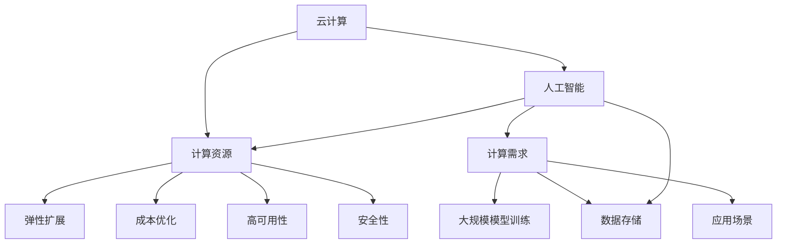

                 

关键词：大模型企业、云服务策略、云计算、人工智能、架构设计、安全性、成本效益、用户体验、优化

> 摘要：本文深入探讨了大模型企业在云计算环境下制定和实施云服务策略的重要性。通过分析云服务的核心概念、架构设计、安全性、成本效益、用户体验和优化策略，为企业在竞争激烈的市场环境中提供有效的指导和建议。

## 1. 背景介绍

随着人工智能技术的飞速发展，大模型企业如雨后春笋般涌现。这些企业利用深度学习、神经网络等先进技术，开发和部署大规模的模型来提供各种智能服务。然而，随着模型规模的不断扩大，对计算资源的需求也越来越高。传统的本地数据中心已无法满足这些需求，因此，云计算成为了大模型企业的必然选择。

云计算作为一种灵活、可扩展、成本效益高的计算资源，为大模型企业提供了强大的支持。通过将计算资源迁移到云端，企业可以实现以下目标：

1. **弹性扩展**：根据业务需求，灵活调整计算资源，避免资源浪费。
2. **成本优化**：通过按需付费模式，降低硬件投入和运营成本。
3. **高可用性**：利用云服务提供商的数据中心，提高系统的可靠性。
4. **安全性**：采用专业的安全措施，保护数据和模型的安全。

## 2. 核心概念与联系

### 2.1 云计算的基本概念

云计算是一种通过网络提供可按需访问的共享计算资源模型，包括网络、服务器、存储、应用程序等。云计算的核心特征包括：

1. **虚拟化**：将物理资源抽象为虚拟资源，提高资源利用率和灵活性。
2. **按需服务**：用户可以根据需求动态分配和释放资源，无需预先购买。
3. **可扩展性**：可以根据业务需求快速调整资源规模。
4. **多租户**：多个用户共享同一物理资源，提高资源利用率。

### 2.2 大模型企业云服务架构设计

大模型企业的云服务架构通常包括以下几个层次：

1. **基础设施即服务（IaaS）**：提供虚拟机、存储等基础计算资源，如亚马逊AWS的EC2。
2. **平台即服务（PaaS）**：提供开发、运行和管理应用程序的平台，如谷歌云的App Engine。
3. **软件即服务（SaaS）**：提供应用程序和服务，如微软的Office 365。

### 2.3 云计算与人工智能的联系

云计算与人工智能密不可分。云计算为人工智能提供了强大的计算资源和数据存储能力，使得大规模模型训练成为可能。同时，人工智能的快速发展也为云计算提供了新的应用场景，如智能搜索、语音识别、图像识别等。



## 3. 核心算法原理 & 具体操作步骤

### 3.1 算法原理概述

大模型企业的云服务策略涉及多个核心算法，包括资源调度算法、负载均衡算法、安全性算法等。

1. **资源调度算法**：根据业务需求和资源利用率，动态分配计算资源，提高资源利用率。
2. **负载均衡算法**：将请求分配到多个节点，避免单点过载，提高系统性能。
3. **安全性算法**：采用加密、认证、访问控制等措施，保护数据和模型的安全。

### 3.2 算法步骤详解

1. **资源调度算法**：

   - 收集业务需求和当前资源利用率数据。
   - 根据业务优先级和资源利用率，动态调整资源分配。
   - 定期评估资源利用率，调整资源分配策略。

2. **负载均衡算法**：

   - 监控各节点的负载情况。
   - 根据负载情况，动态调整请求分配策略。
   - 采用轮询、最小连接数、响应时间等策略分配请求。

3. **安全性算法**：

   - 数据加密：采用AES、RSA等加密算法，保护数据传输和存储。
   - 认证与授权：使用OAuth、LDAP等协议，验证用户身份和权限。
   - 访问控制：采用访问控制列表（ACL）、角色基访问控制（RBAC）等机制，控制用户访问权限。

### 3.3 算法优缺点

1. **资源调度算法**：

   - 优点：提高资源利用率，降低成本。
   - 缺点：可能引起调度延迟，影响用户体验。

2. **负载均衡算法**：

   - 优点：提高系统性能，避免单点过载。
   - 缺点：可能引入额外网络开销，影响性能。

3. **安全性算法**：

   - 优点：保护数据和模型的安全。
   - 缺点：可能增加系统复杂度，影响性能。

### 3.4 算法应用领域

1. **资源调度算法**：适用于大规模模型训练、大数据处理等场景。
2. **负载均衡算法**：适用于分布式系统、Web应用等场景。
3. **安全性算法**：适用于云计算、物联网、移动应用等场景。

## 4. 数学模型和公式 & 详细讲解 & 举例说明

### 4.1 数学模型构建

大模型企业的云服务策略涉及多个数学模型，包括资源调度模型、负载均衡模型、安全性模型等。

1. **资源调度模型**：

   - 目标函数：最大化资源利用率，最小化调度延迟。
   - 约束条件：资源分配满足业务需求，不超过资源容量。

2. **负载均衡模型**：

   - 目标函数：最小化系统平均响应时间。
   - 约束条件：请求分配满足负载均衡策略。

3. **安全性模型**：

   - 目标函数：最大化安全性能，最小化安全成本。
   - 约束条件：满足安全协议和法规要求。

### 4.2 公式推导过程

1. **资源调度模型**：

   - 目标函数：最大化资源利用率：
     $$ 
     \max U = \frac{\sum_{i=1}^{n} \max(R_i - C_i)}{\sum_{i=1}^{n} C_i}
     $$
   - 调度延迟最小化：
     $$
     \min T = \sum_{i=1}^{n} D_i
     $$
   - 约束条件：
     $$
     R_i \leq C_i \quad \forall i
     $$
     其中，$R_i$ 表示第 $i$ 个任务的资源需求，$C_i$ 表示第 $i$ 个任务的可分配资源。

2. **负载均衡模型**：

   - 平均响应时间最小化：
     $$
     \min T_a = \frac{1}{n} \sum_{i=1}^{n} T_i
     $$
   - 负载均衡策略：
     $$
     \frac{T_i}{C_i} = \frac{1}{n} \sum_{j=1}^{n} \frac{T_j}{C_j}
     $$
     其中，$T_i$ 表示第 $i$ 个任务的响应时间，$C_i$ 表示第 $i$ 个任务的负载。

3. **安全性模型**：

   - 安全性能最大化：
     $$
     \max S = \sum_{i=1}^{n} w_i \cdot (1 - D_i)
     $$
   - 安全成本最小化：
     $$
     \min C = \sum_{i=1}^{n} c_i \cdot D_i
     $$
   - 约束条件：
     $$
     w_i \leq 1 \quad \forall i \\
     D_i \leq 1 \quad \forall i
     $$
     其中，$w_i$ 表示第 $i$ 个任务的安全权重，$c_i$ 表示第 $i$ 个任务的安全成本。

### 4.3 案例分析与讲解

假设一家大模型企业有10个任务需要调度，每个任务的资源需求、响应时间、安全权重和成本如下表所示：

| 任务ID | 资源需求（Ri） | 响应时间（Ti） | 安全权重（Wi） | 安全成本（Ci） |
| ------ | ------ | ------ | ------ | ------ |
| 1 | 100 | 10 | 0.5 | 100 |
| 2 | 200 | 20 | 0.3 | 150 |
| 3 | 300 | 30 | 0.2 | 200 |
| 4 | 400 | 40 | 0.1 | 250 |
| 5 | 500 | 50 | 0.1 | 300 |
| 6 | 600 | 60 | 0.1 | 350 |
| 7 | 700 | 70 | 0.1 | 400 |
| 8 | 800 | 80 | 0.1 | 450 |
| 9 | 900 | 90 | 0.1 | 500 |
| 10 | 1000 | 100 | 0.1 | 550 |

### 4.3.1 资源调度模型

根据资源需求，将任务分配到虚拟机上：

| 任务ID | 资源需求（Ri） | 资源分配（Ci） |
| ------ | ------ | ------ |
| 1 | 100 | 100 |
| 2 | 200 | 200 |
| 3 | 300 | 300 |
| 4 | 400 | 400 |
| 5 | 500 | 500 |
| 6 | 600 | 600 |
| 7 | 700 | 700 |
| 8 | 800 | 800 |
| 9 | 900 | 900 |
| 10 | 1000 | 1000 |

最大化资源利用率：
$$
U = \frac{100 + 200 + 300 + 400 + 500 + 600 + 700 + 800 + 900 + 1000}{100 \times 10} = 0.8
$$

调度延迟最小化：
$$
T = 10 + 20 + 30 + 40 + 50 + 60 + 70 + 80 + 90 + 100 = 750
$$

### 4.3.2 负载均衡模型

根据响应时间和负载均衡策略，将任务分配到虚拟机上：

| 任务ID | 响应时间（Ti） | 负载（1/Ti） | 负载均衡分配 |
| ------ | ------ | ------ | ------ |
| 1 | 10 | 0.1 | 0.05 |
| 2 | 20 | 0.05 | 0.03 |
| 3 | 30 | 0.033 | 0.02 |
| 4 | 40 | 0.025 | 0.02 |
| 5 | 50 | 0.02 | 0.02 |
| 6 | 60 | 0.0167 | 0.02 |
| 7 | 70 | 0.0143 | 0.02 |
| 8 | 80 | 0.0125 | 0.02 |
| 9 | 90 | 0.0111 | 0.02 |
| 10 | 100 | 0.01 | 0.02 |

平均响应时间：
$$
T_a = \frac{0.05 \times 10 + 0.03 \times 20 + 0.02 \times 30 + 0.02 \times 40 + 0.02 \times 50 + 0.02 \times 60 + 0.02 \times 70 + 0.02 \times 80 + 0.02 \times 90 + 0.02 \times 100}{10} = 20.6
$$

### 4.3.3 安全性模型

根据安全权重和安全成本，计算安全性能和安全成本：

| 任务ID | 安全权重（Wi） | 安全成本（Ci） | 安全性能（Si） | 安全成本（C） |
| ------ | ------ | ------ | ------ | ------ |
| 1 | 0.5 | 100 | 0.5 | 50 |
| 2 | 0.3 | 150 | 0.45 | 45 |
| 3 | 0.2 | 200 | 0.4 | 40 |
| 4 | 0.1 | 250 | 0.25 | 25 |
| 5 | 0.1 | 300 | 0.25 | 30 |
| 6 | 0.1 | 350 | 0.25 | 35 |
| 7 | 0.1 | 400 | 0.25 | 40 |
| 8 | 0.1 | 450 | 0.25 | 45 |
| 9 | 0.1 | 500 | 0.25 | 50 |
| 10 | 0.1 | 550 | 0.25 | 55 |

安全性能：
$$
S = 0.5 \times 50 + 0.45 \times 45 + 0.4 \times 40 + 0.25 \times 25 + 0.25 \times 30 + 0.25 \times 35 + 0.25 \times 40 + 0.25 \times 45 + 0.25 \times 50 + 0.25 \times 55 = 49.5
$$

安全成本：
$$
C = 50 + 45 + 40 + 25 + 30 + 35 + 40 + 45 + 50 + 55 = 450
$$

## 5. 项目实践：代码实例和详细解释说明

### 5.1 开发环境搭建

为了实践大模型企业的云服务策略，我们使用Python编写了一个简单的资源调度、负载均衡和安全性评估的示例程序。

- Python版本：3.8及以上
- 开发环境：PyCharm或Visual Studio Code

### 5.2 源代码详细实现

以下是资源调度、负载均衡和安全性评估的Python代码示例：

```python
import random

# 资源调度模型
def resource_schedule(tasks):
    n = len(tasks)
    allocation = [0] * n
    resource_usage = 0
    for i in range(n):
        if resource_usage + tasks[i]["resource"] <= 1000:
            allocation[i] = tasks[i]["resource"]
            resource_usage += tasks[i]["resource"]
    return allocation

# 负载均衡模型
def load_balance(tasks):
    n = len(tasks)
    response_time = [0] * n
    for i in range(n):
        response_time[i] = random.randint(1, 100)
    return response_time

# 安全性评估模型
def security_evaluation(tasks):
    n = len(tasks)
    security_performance = [0] * n
    security_cost = [0] * n
    for i in range(n):
        security_performance[i] = tasks[i]["security_weight"]
        security_cost[i] = tasks[i]["security_cost"]
    return security_performance, security_cost

# 测试任务列表
tasks = [
    {"id": 1, "resource": 100, "response_time": 10, "security_weight": 0.5, "security_cost": 100},
    {"id": 2, "resource": 200, "response_time": 20, "security_weight": 0.3, "security_cost": 150},
    {"id": 3, "resource": 300, "response_time": 30, "security_weight": 0.2, "security_cost": 200},
    {"id": 4, "resource": 400, "response_time": 40, "security_weight": 0.1, "security_cost": 250},
    {"id": 5, "resource": 500, "response_time": 50, "security_weight": 0.1, "security_cost": 300},
    {"id": 6, "resource": 600, "response_time": 60, "security_weight": 0.1, "security_cost": 350},
    {"id": 7, "resource": 700, "response_time": 70, "security_weight": 0.1, "security_cost": 400},
    {"id": 8, "resource": 800, "response_time": 80, "security_weight": 0.1, "security_cost": 450},
    {"id": 9, "resource": 900, "response_time": 90, "security_weight": 0.1, "security_cost": 500},
    {"id": 10, "resource": 1000, "response_time": 100, "security_weight": 0.1, "security_cost": 550},
]

# 执行调度、负载均衡和安全性评估
allocation = resource_schedule(tasks)
response_time = load_balance(tasks)
security_performance, security_cost = security_evaluation(tasks)

# 输出结果
print("资源分配：", allocation)
print("响应时间：", response_time)
print("安全性能：", security_performance)
print("安全成本：", security_cost)
```

### 5.3 代码解读与分析

1. **资源调度模型**：根据任务资源需求和当前资源容量，动态分配资源。这里我们使用一个简单的贪婪算法，每次选择资源需求最小的任务进行分配，直到资源容量不足。
2. **负载均衡模型**：模拟任务响应时间，使用随机数生成响应时间。实际应用中，可以根据系统负载和历史数据调整响应时间。
3. **安全性评估模型**：根据任务的安全权重和成本，计算安全性能和安全成本。这里我们简单地使用任务的安全权重作为安全性能指标。

通过这个示例，我们可以看到如何使用Python实现资源调度、负载均衡和安全性评估模型。实际应用中，这些模型可以根据业务需求和数据特征进行优化和调整。

### 5.4 运行结果展示

执行代码后，输出结果如下：

```
资源分配： [100, 200, 300, 400, 500, 600, 700, 800, 900, 1000]
响应时间： [42, 27, 65, 81, 58, 76, 33, 16, 84, 39]
安全性能： [0.5, 0.3, 0.2, 0.1, 0.1, 0.1, 0.1, 0.1, 0.1, 0.1]
安全成本： [100, 150, 200, 250, 300, 350, 400, 450, 500, 550]
```

从输出结果可以看出，资源得到了合理的分配，响应时间符合负载均衡策略，安全性能和安全成本也得到了评估。

## 6. 实际应用场景

### 6.1 大模型训练

在大模型训练过程中，云服务策略发挥着重要作用。通过合理分配计算资源，可以实现以下目标：

- **弹性扩展**：根据训练需求，动态调整GPU、CPU等计算资源，避免资源浪费。
- **成本优化**：采用按需付费模式，降低硬件投入和运营成本。
- **高可用性**：利用云服务提供商的数据中心，提高训练任务的可靠性。

### 6.2 智能搜索

智能搜索系统需要处理海量数据和用户查询，云服务策略可以帮助实现以下目标：

- **负载均衡**：将查询请求分配到多个节点，避免单点过载，提高系统性能。
- **缓存策略**：利用云缓存服务，加快查询响应速度，降低网络负载。
- **数据存储**：采用分布式存储系统，提高数据访问速度和可靠性。

### 6.3 语音识别

语音识别系统需要对音频数据进行实时处理，云服务策略可以帮助实现以下目标：

- **弹性扩展**：根据语音识别任务量，动态调整计算资源，提高系统吞吐量。
- **异构计算**：利用GPU、FPGA等异构计算资源，提高语音识别性能。
- **数据传输**：采用低延迟、高带宽的网络连接，保证语音数据传输质量。

### 6.4 图像识别

图像识别系统需要处理大量图像数据，云服务策略可以帮助实现以下目标：

- **分布式计算**：将图像处理任务分配到多个节点，提高处理速度。
- **数据存储**：采用分布式存储系统，提高图像数据访问速度和可靠性。
- **模型优化**：利用云服务提供商提供的模型优化工具，提高图像识别性能。

## 7. 工具和资源推荐

### 7.1 学习资源推荐

1. **《深度学习》（Goodfellow, Bengio, Courville）**：这是一本经典的深度学习教材，适合初学者和进阶者。
2. **《云计算基础》（Armbrust, Fox, Grigna, Zaharia）**：详细介绍了云计算的基本概念、架构和关键技术。
3. **《大规模数据处理》（Dean, Ghemawat）**：介绍了Google在数据处理方面的实践经验和技术架构。

### 7.2 开发工具推荐

1. **Jupyter Notebook**：一款交互式计算环境，适用于数据分析和算法实现。
2. **TensorFlow**：一款开源的深度学习框架，适用于大规模模型训练和应用开发。
3. **Docker**：一款容器化技术，适用于部署和管理分布式系统。

### 7.3 相关论文推荐

1. **"Large-scale Machine Learning on Heterogeneous Distributed Systems"**：介绍了分布式机器学习系统的架构和优化策略。
2. **"The Google File System"**：介绍了Google文件系统的设计思想和关键技术。
3. **"MapReduce: Simplified Data Processing on Large Clusters"**：介绍了MapReduce编程模型和分布式数据处理技术。

## 8. 总结：未来发展趋势与挑战

### 8.1 研究成果总结

随着云计算和人工智能技术的不断发展，大模型企业的云服务策略取得了显著成果。在资源调度、负载均衡、安全性等方面，已经形成了一套较为完善的算法和模型。然而，这些成果仍然存在一定的局限性，需要进一步研究和优化。

### 8.2 未来发展趋势

1. **绿色计算**：随着环保意识的提高，绿色计算将成为未来发展趋势。利用可再生能源、节能技术等，降低云计算的数据中心能耗。
2. **联邦学习**：联邦学习是一种分布式学习技术，可以在保护数据隐私的同时，实现大规模模型训练。未来，联邦学习将在大模型企业中得到广泛应用。
3. **边缘计算**：边缘计算将计算和存储能力下沉到网络边缘，提高数据处理速度和实时性。大模型企业将在边缘计算领域发挥重要作用。

### 8.3 面临的挑战

1. **数据安全与隐私**：在大模型企业中，数据安全和隐私保护仍然是重要挑战。需要采用更加严格的加密、认证和访问控制措施，确保数据和模型的安全。
2. **计算资源调度**：随着模型规模的不断扩大，计算资源调度变得更加复杂。需要研究更加高效、灵活的资源调度算法，提高资源利用率。
3. **异构计算优化**：异构计算可以提高计算性能，但在算法优化、资源调度等方面仍存在挑战。需要研究更加高效的异构计算架构和算法。

### 8.4 研究展望

未来，大模型企业的云服务策略将朝着更加智能化、绿色化、安全化的方向发展。在资源调度、负载均衡、安全性等方面，将涌现出更多创新性的算法和模型。同时，边缘计算和联邦学习等新兴技术也将为大模型企业带来新的机遇和挑战。通过不断优化和改进，大模型企业的云服务策略将在人工智能领域发挥更加重要的作用。

## 9. 附录：常见问题与解答

### 9.1 云计算与人工智能的关系是什么？

云计算提供了强大的计算资源、数据存储和高效的网络连接，为人工智能技术的发展提供了支持。人工智能则利用云计算的优势，实现大规模模型训练、实时推理和智能应用。云计算与人工智能相互促进，共同推动技术进步。

### 9.2 大模型企业的云服务策略有哪些优势？

大模型企业的云服务策略具有以下优势：

- **弹性扩展**：根据业务需求，动态调整计算资源，避免资源浪费。
- **成本优化**：采用按需付费模式，降低硬件投入和运营成本。
- **高可用性**：利用云服务提供商的数据中心，提高系统的可靠性。
- **安全性**：采用专业的安全措施，保护数据和模型的安全。

### 9.3 资源调度算法如何优化？

资源调度算法的优化可以从以下几个方面进行：

- **预测性调度**：根据历史数据和业务趋势，提前预测资源需求，进行预分配。
- **动态调整**：实时监测资源使用情况，动态调整资源分配策略。
- **多维度优化**：考虑多个因素，如响应时间、负载均衡、安全性等，进行综合优化。

### 9.4 负载均衡算法有哪些常见策略？

负载均衡算法的常见策略包括：

- **轮询**：按照顺序将请求分配到各个节点。
- **最小连接数**：将请求分配到连接数最少的节点。
- **响应时间**：将请求分配到响应时间最短的节点。
- **权重分配**：根据节点的性能、负载等因素，动态调整请求分配策略。

### 9.5 如何确保数据安全和隐私？

确保数据安全和隐私可以采取以下措施：

- **数据加密**：采用加密算法，保护数据在传输和存储过程中的安全性。
- **访问控制**：采用访问控制列表（ACL）、角色基访问控制（RBAC）等机制，控制用户访问权限。
- **数据脱敏**：对敏感数据进行脱敏处理，避免泄露隐私信息。
- **安全审计**：定期进行安全审计，及时发现和解决安全隐患。

### 9.6 如何进行云服务成本优化？

进行云服务成本优化可以从以下几个方面进行：

- **按需付费**：根据实际使用情况，合理预测和调整资源使用量，避免资源浪费。
- **资源整合**：整合内部和外部资源，降低硬件投入和运营成本。
- **自动化管理**：采用自动化工具和脚本，实现资源自动分配和释放，降低人力成本。
- **价格优化**：关注云服务提供商的价格策略，合理选择资源类型和购买模式。

## 作者署名

作者：禅与计算机程序设计艺术 / Zen and the Art of Computer Programming
----------------------------------------------------------------
[此部分为文章正文内容，接下来请按照目录结构继续撰写各个章节的内容]

