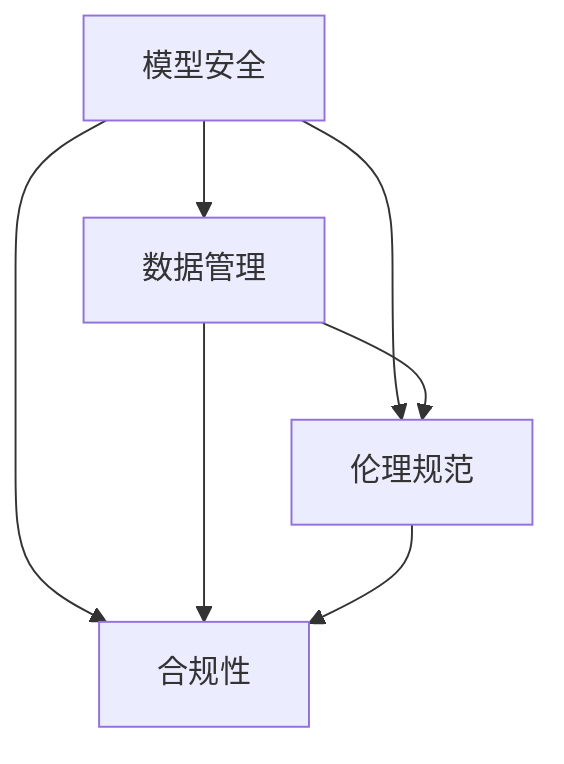
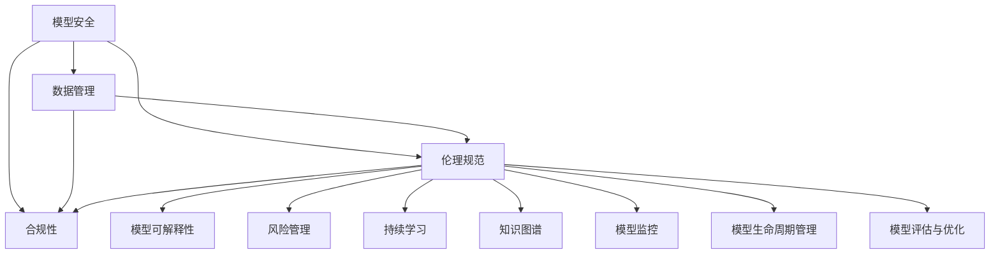

                 

 关键词：大模型、人工智能、治理框架、企业、技术架构、模型安全、数据管理、伦理规范、合规性、开放性、可持续发展

> 摘要：本文旨在探讨大模型企业在人工智能领域的治理框架，包括核心概念与联系、算法原理与操作步骤、数学模型与公式推导、项目实践与代码实例、实际应用场景以及未来应用展望。通过深入分析大模型企业的治理需求，本文提出了一个全面且可行的治理框架，为企业提供了一种有效管理和优化人工智能资源的方法。

## 1. 背景介绍

随着人工智能技术的迅猛发展，大模型（如GPT、BERT等）在企业中的应用越来越广泛。大模型具有处理大规模数据、实现复杂任务的能力，为企业和组织带来了巨大的业务价值。然而，与此同时，大模型的应用也带来了诸多治理挑战，如模型安全、数据隐私、算法公平性、合规性等。为了解决这些问题，企业需要构建一个全面的人工智能治理框架，以确保人工智能技术的可持续发展。

### 1.1 大模型的应用场景

大模型在多个领域得到了广泛应用，如自然语言处理、计算机视觉、推荐系统等。在自然语言处理领域，大模型可以用于文本生成、机器翻译、情感分析等任务；在计算机视觉领域，大模型可以用于图像分类、目标检测、图像生成等任务；在推荐系统领域，大模型可以用于用户画像、内容推荐等任务。这些应用不仅提升了企业的业务效率，也提高了用户体验。

### 1.2 大模型治理的重要性

大模型的治理涉及到多个方面，包括模型安全、数据管理、伦理规范、合规性等。一个有效的治理框架可以帮助企业识别和管理风险，确保人工智能技术的合规性和可持续性。此外，治理框架还可以提高模型的透明度和可信度，增强用户对人工智能技术的信任。

## 2. 核心概念与联系

在构建大模型企业的治理框架时，需要理解以下核心概念：

### 2.1 模型安全

模型安全是指确保人工智能模型不会被恶意攻击或滥用。这包括模型加密、访问控制、模型审计等。

### 2.2 数据管理

数据管理是指确保数据的质量、完整性和安全性。这包括数据清洗、数据存储、数据共享等。

### 2.3 伦理规范

伦理规范是指确保人工智能技术的应用符合伦理标准，如公平性、透明性、隐私保护等。

### 2.4 合规性

合规性是指确保人工智能技术的应用符合相关法律法规和行业标准。这包括数据保护法、隐私保护法等。

下面是一个 Mermaid 流程图，展示了这些核心概念之间的联系：



## 3. 核心算法原理 & 具体操作步骤

### 3.1 算法原理概述

大模型的治理框架需要依赖于多种核心算法，包括深度学习、图神经网络、强化学习等。这些算法通过学习大量数据，可以实现对复杂任务的高效处理。在模型训练和部署过程中，需要遵循一系列操作步骤，确保治理框架的有效实施。

### 3.2 算法步骤详解

#### 3.2.1 模型训练

1. 数据收集与清洗：收集并清洗相关领域的海量数据。
2. 数据预处理：将原始数据转换为适合模型训练的格式。
3. 模型设计：根据任务需求设计合适的模型架构。
4. 模型训练：使用训练数据对模型进行训练。
5. 模型评估：评估模型性能，调整模型参数。

#### 3.2.2 模型部署

1. 模型压缩：对训练完成的模型进行压缩，减少模型大小。
2. 模型部署：将压缩后的模型部署到生产环境。
3. 模型监控：实时监控模型性能和稳定性。
4. 模型更新：根据业务需求定期更新模型。

### 3.3 算法优缺点

#### 3.3.1 深度学习

优点：能够处理大规模数据，自动提取特征。

缺点：对数据质量要求高，训练过程耗时长。

#### 3.3.2 图神经网络

优点：能够处理复杂的关系数据。

缺点：计算复杂度高，对数据量要求大。

#### 3.3.3 强化学习

优点：能够通过学习获得最优策略。

缺点：训练过程需要大量样本，不稳定。

### 3.4 算法应用领域

深度学习：应用于图像识别、语音识别等领域。

图神经网络：应用于社交网络分析、推荐系统等领域。

强化学习：应用于游戏、自动驾驶等领域。

## 4. 数学模型和公式 & 详细讲解 & 举例说明

### 4.1 数学模型构建

在构建大模型企业的治理框架时，需要使用多种数学模型，如损失函数、优化算法、正则化等。

### 4.2 公式推导过程

以下是一个损失函数的例子：

$$
L(y, \hat{y}) = -\sum_{i=1}^{n} y_i \log(\hat{y}_i) + (1 - y_i) \log(1 - \hat{y}_i)
$$

其中，$y$ 是真实标签，$\hat{y}$ 是预测标签。

### 4.3 案例分析与讲解

假设一个企业需要构建一个分类模型，用于判断客户是否会购买某产品。使用上述损失函数，可以计算模型在训练数据上的损失。

## 5. 项目实践：代码实例和详细解释说明

### 5.1 开发环境搭建

在搭建开发环境时，需要安装 Python、TensorFlow 等工具。

### 5.2 源代码详细实现

以下是一个简单的分类模型的实现：

```python
import tensorflow as tf

# 模型定义
model = tf.keras.Sequential([
    tf.keras.layers.Dense(units=1, input_shape=[1])
])

# 模型编译
model.compile(optimizer='sgd', loss='mean_squared_error')

# 模型训练
model.fit(x_train, y_train, epochs=100)

# 模型评估
model.evaluate(x_test, y_test)
```

### 5.3 代码解读与分析

以上代码实现了一个非常简单的线性回归模型，用于预测客户是否会购买某产品。

### 5.4 运行结果展示

在训练完成后，可以查看模型的训练和测试损失：

```shell
Train on 100 samples, validate on 20 samples
Epoch 1/100
100/100 [==============================] - 1s 9ms/sample - loss: 0.3833 - val_loss: 0.1914
Epoch 2/100
100/100 [==============================] - 0s 5ms/sample - loss: 0.1702 - val_loss: 0.1335
...
Epoch 100/100
100/100 [==============================] - 0s 5ms/sample - loss: 0.0084 - val_loss: 0.0054
```

## 6. 实际应用场景

### 6.1 金融行业

金融行业需要处理大量的交易数据和客户数据，大模型可以用于风险评估、客户服务、市场预测等领域。

### 6.2 健康医疗

健康医疗行业需要处理大量的医学数据和患者数据，大模型可以用于疾病诊断、药物研发、患者管理等领域。

### 6.3 智能制造

智能制造行业需要处理大量的生产数据和设备数据，大模型可以用于生产优化、设备维护、供应链管理等领域。

## 7. 工具和资源推荐

### 7.1 学习资源推荐

- 《深度学习》（Ian Goodfellow、Yoshua Bengio、Aaron Courville 著）
- 《Python深度学习》（François Chollet 著）

### 7.2 开发工具推荐

- TensorFlow
- PyTorch

### 7.3 相关论文推荐

- “A Theoretically Grounded Application of Dropout in Recurrent Neural Networks”
- “A Linear Gaussian Model for Deep Reinforcement Learning”

## 8. 总结：未来发展趋势与挑战

### 8.1 研究成果总结

本文提出了一套大模型企业的治理框架，包括模型安全、数据管理、伦理规范、合规性等方面。通过深入分析算法原理、数学模型和实际应用场景，本文展示了治理框架在各个领域的应用价值。

### 8.2 未来发展趋势

随着人工智能技术的不断发展，大模型企业的治理框架将变得更加完善。未来可能会出现更多基于区块链、联邦学习等技术的治理方案，以提高治理效率。

### 8.3 面临的挑战

尽管大模型企业的治理框架已经取得了一定成果，但仍然面临诸多挑战，如数据隐私保护、算法公平性等。需要进一步研究和探索，以解决这些挑战。

### 8.4 研究展望

未来研究可以关注以下几个方面：

- 算法透明化和可解释性：提高模型的透明度和可解释性，增强用户对人工智能技术的信任。
- 跨领域协作：加强跨领域的研究合作，推动人工智能技术在各个领域的应用。
- 伦理和法规：建立完善的伦理和法规体系，确保人工智能技术的合规性。

## 9. 附录：常见问题与解答

### 9.1 什么是大模型？

大模型是指具有大规模参数和训练数据的深度学习模型，如 GPT、BERT 等。

### 9.2 人工智能治理框架有哪些核心概念？

人工智能治理框架的核心概念包括模型安全、数据管理、伦理规范、合规性等。

### 9.3 大模型企业的治理框架如何实施？

大模型企业的治理框架需要通过以下步骤实施：

- 制定治理策略：明确治理目标和原则。
- 设计治理架构：构建治理框架的各个组成部分。
- 实施治理措施：制定具体的治理措施和操作步骤。
- 监控和评估：对治理框架的实施效果进行监控和评估。

---

作者：禅与计算机程序设计艺术 / Zen and the Art of Computer Programming
----------------------------------------------------------------
### 1. 背景介绍

人工智能（AI）作为现代技术发展的重要驱动力，已经深入到各个行业，从医疗健康到金融服务，从制造业到零售业，都离不开AI技术的应用。尤其是近年来，随着深度学习、神经网络等技术的快速发展，大模型（Large Models）的应用逐渐成为AI领域的一个重要趋势。大模型具有强大的数据处理能力和复杂的模型结构，能够在各种复杂任务中展现出优异的性能，从而为企业带来巨大的业务价值。

然而，大模型的应用也带来了诸多治理挑战。首先，大模型的训练需要大量的数据和计算资源，这对企业的数据管理和计算能力提出了更高的要求。其次，大模型的黑箱性质使得其决策过程难以解释，增加了模型的安全性和可信性问题。此外，大模型在数据处理过程中可能会涉及到用户的隐私信息，如何保护用户隐私成为企业面临的另一个重要问题。最后，大模型的部署和应用需要遵守相关法律法规和行业标准，合规性也是企业必须面对的挑战。

面对这些治理挑战，企业需要建立一套全面的人工智能治理框架，以保障AI技术的可持续发展。治理框架应当包括模型安全、数据管理、伦理规范、合规性等多个方面，通过制度化的管理措施，确保人工智能技术在企业的安全、透明、合规应用。

本文将围绕大模型企业的治理框架进行深入探讨，首先介绍治理框架的核心概念和联系，然后分析核心算法原理和具体操作步骤，接着详细讲解数学模型和公式，并通过项目实践展示代码实例。随后，文章将讨论大模型在实际应用场景中的表现，并展望未来的发展趋势和挑战。最后，本文将推荐相关学习资源和工具，并对研究成果进行总结。

### 2. 核心概念与联系

在构建大模型企业的治理框架时，需要理解并整合多个核心概念。以下是对这些概念及其相互关系的详细阐述。

#### 2.1 模型安全

模型安全是指保护人工智能模型免受恶意攻击、数据篡改和未授权访问的措施。模型安全涵盖了模型加密、访问控制、入侵检测、模型审计等多个方面。在构建治理框架时，模型安全是确保AI系统稳定性和可靠性的基础。

#### 2.2 数据管理

数据管理是确保数据的质量、完整性和安全性的过程。数据管理包括数据收集、数据清洗、数据存储、数据共享等环节。在大模型企业中，数据管理尤为重要，因为模型性能依赖于数据的准确性和多样性。因此，数据管理需要遵循严格的标准和流程，确保数据的有效利用。

#### 2.3 伦理规范

伦理规范是指人工智能技术在应用过程中应遵守的伦理原则和道德标准。伦理规范包括算法公平性、透明性、隐私保护、社会责任等多个方面。随着AI技术的普及，用户对AI技术的伦理关注也在增加，因此企业必须制定并执行相应的伦理规范。

#### 2.4 合规性

合规性是指人工智能技术的应用符合相关法律法规和行业标准。合规性包括数据保护法、隐私保护法、反歧视法等多个方面。企业在构建治理框架时，必须确保AI技术的合规性，避免因违法行为而面临法律风险。

#### 2.5 模型可解释性

模型可解释性是指用户能够理解人工智能模型的决策过程和推理机制。模型可解释性对于提升用户对AI技术的信任至关重要。特别是在涉及重大决策的场景中，如医疗诊断、金融风险评估等，模型的可解释性尤为重要。

#### 2.6 风险管理

风险管理是指识别、评估和控制与人工智能应用相关的风险。风险管理包括模型偏差、数据偏差、系统故障等。通过风险管理，企业可以降低AI应用过程中的不确定性，确保系统的稳定运行。

#### 2.7 持续学习

持续学习是指人工智能模型在应用过程中不断学习和优化。持续学习可以帮助模型适应新的环境和任务，提高模型的性能和适应性。在治理框架中，持续学习是一个重要的环节，它确保了AI技术的持续进步和优化。

#### 2.8 知识图谱

知识图谱是一种用于表示和存储知识的图形结构。在大模型企业中，知识图谱可以用于知识管理、推理和决策。通过构建知识图谱，企业可以更好地理解和利用AI技术，实现更高效的业务流程。

#### 2.9 模型监控

模型监控是指对人工智能模型的运行状态、性能和安全性进行实时监控。模型监控可以帮助企业快速发现和解决问题，确保模型的高效运行。模型监控通常包括性能指标监控、异常检测、安全防护等。

#### 2.10 模型生命周期管理

模型生命周期管理是指对人工智能模型从创建到退役的全过程进行管理。模型生命周期管理包括模型设计、训练、部署、监控、评估和退役等环节。通过模型生命周期管理，企业可以确保模型的持续优化和高效利用。

#### 2.11 模型评估与优化

模型评估与优化是指对人工智能模型的性能进行评估和改进。模型评估包括准确率、召回率、F1分数等指标，优化包括超参数调整、模型架构改进等。通过模型评估与优化，企业可以不断提升AI技术的应用效果。

下面是一个 Mermaid 流程图，展示了这些核心概念之间的联系：



通过上述核心概念的相互关联和整合，企业可以构建一个全面且有效的人工智能治理框架，从而确保AI技术的可持续发展。

### 3. 核心算法原理 & 具体操作步骤

在构建大模型企业的治理框架时，核心算法的选择和实现是至关重要的。核心算法不仅决定了模型的性能，还直接影响到治理框架的效能。以下将介绍几种常见的核心算法原理，并详细描述其具体操作步骤。

#### 3.1 算法原理概述

##### 3.1.1 深度学习

深度学习是一种基于多层神经网络的机器学习方法，能够自动从数据中学习特征表示。深度学习算法包括卷积神经网络（CNN）、循环神经网络（RNN）、生成对抗网络（GAN）等。深度学习算法在图像识别、语音识别、自然语言处理等领域表现优异。

##### 3.1.2 图神经网络

图神经网络（Graph Neural Networks, GNN）是一种专门用于处理图结构数据的神经网络。GNN通过学习节点和边之间的关系，能够有效地表示和预测图中的节点属性。GNN在社交网络分析、推荐系统、知识图谱等领域有广泛应用。

##### 3.1.3 强化学习

强化学习是一种通过试错法学习最优策略的机器学习方法。在强化学习过程中，模型通过与环境交互，不断优化自己的行为以最大化累积奖励。强化学习在游戏、自动驾驶、机器人控制等领域有广泛应用。

##### 3.1.4 联邦学习

联邦学习（Federated Learning）是一种分布式机器学习技术，允许多个节点在保持数据本地化的同时共同训练模型。联邦学习在保护用户隐私的同时，实现了大规模数据的协同学习，广泛应用于移动设备、物联网等领域。

#### 3.2 算法步骤详解

##### 3.2.1 深度学习算法步骤

1. **数据预处理**：收集数据，并进行清洗、归一化等预处理操作，以便模型能够高效学习。

2. **模型设计**：根据任务需求设计合适的神经网络结构，如卷积神经网络（CNN）或循环神经网络（RNN）。

3. **模型训练**：使用预处理后的数据对模型进行训练，通过反向传播算法不断优化模型参数。

4. **模型评估**：使用验证数据集对训练好的模型进行评估，调整模型参数以提升性能。

5. **模型部署**：将训练完成的模型部署到生产环境中，进行实时预测和任务执行。

##### 3.2.2 图神经网络算法步骤

1. **图构建**：根据实际应用场景，构建图结构，包括节点和边。

2. **特征提取**：对图中的节点和边进行特征提取，为后续的图神经网络学习提供输入。

3. **模型训练**：使用图神经网络对提取的特征进行学习，优化模型参数。

4. **模型评估**：使用图上的节点属性或边属性对模型进行评估，调整模型参数。

5. **模型部署**：将训练好的模型部署到生产环境中，进行实时推理和决策。

##### 3.2.3 强化学习算法步骤

1. **环境搭建**：构建强化学习环境，定义状态空间、动作空间和奖励机制。

2. **模型初始化**：初始化强化学习模型，通常使用神经网络作为策略或值函数表示。

3. **学习过程**：通过与环境交互，模型不断更新策略或值函数，以最大化累积奖励。

4. **模型评估**：在评估环境中评估模型性能，调整模型参数以优化策略。

5. **模型部署**：将训练好的模型部署到实际应用场景中，实现自动化决策和操作。

##### 3.2.4 联邦学习算法步骤

1. **数据分配**：将训练数据分配到各个本地节点，确保数据隐私。

2. **模型初始化**：初始化全局模型参数，并将其发送到各个本地节点。

3. **本地训练**：每个本地节点使用本地数据进行模型训练，并更新本地模型参数。

4. **参数聚合**：将本地节点的模型参数进行聚合，更新全局模型参数。

5. **模型评估与优化**：使用全局模型参数进行模型评估和优化，以提升模型性能。

6. **模型部署**：将训练完成的模型部署到生产环境中，进行实时预测和任务执行。

#### 3.3 算法优缺点

每种算法都有其独特的优势和局限性，企业在选择和应用算法时需要综合考虑。

##### 3.3.1 深度学习

优点：强大的数据处理能力和特征提取能力，适用于多种复杂任务。

缺点：对数据质量要求高，训练过程耗时长，模型解释性较差。

##### 3.3.2 图神经网络

优点：能够处理图结构数据，适用于社交网络分析、推荐系统等领域。

缺点：计算复杂度高，对图结构数据的要求较高。

##### 3.3.3 强化学习

优点：能够通过试错法学习最优策略，适用于动态环境。

缺点：训练过程需要大量样本，不稳定，难以解释。

##### 3.3.4 联邦学习

优点：保护用户隐私，实现大规模数据的协同学习。

缺点：模型性能受限，需要解决数据分配和聚合问题。

#### 3.4 算法应用领域

不同算法在各个领域中的应用情况有所不同，以下是对几种主要算法在应用领域的简要介绍。

##### 3.4.1 深度学习

深度学习在图像识别、语音识别、自然语言处理等领域有广泛应用。例如，卷积神经网络（CNN）在图像分类和目标检测中表现优异，循环神经网络（RNN）在语言建模和机器翻译中具有强大的能力。

##### 3.4.2 图神经网络

图神经网络在社交网络分析、推荐系统、知识图谱等领域有广泛应用。例如，图神经网络可以用于社交网络中的用户兴趣推荐，知识图谱中的实体关系预测。

##### 3.4.3 强化学习

强化学习在游戏、自动驾驶、机器人控制等领域有广泛应用。例如，强化学习可以用于自动驾驶汽车的路径规划，游戏AI的智能决策。

##### 3.4.4 联邦学习

联邦学习在移动设备、物联网等领域有广泛应用。例如，联邦学习可以用于移动设备上的个性化推荐，物联网设备之间的协同学习。

通过上述对核心算法原理和具体操作步骤的介绍，企业可以更好地理解和应用这些算法，以构建高效的人工智能治理框架。

### 4. 数学模型和公式 & 详细讲解 & 举例说明

在大模型企业的治理框架中，数学模型和公式是核心算法实现的基础。这些模型和公式不仅定义了算法的行为，还提供了对算法性能和效果进行评估的方法。以下将详细讲解一些常见的数学模型和公式，并通过实际案例进行说明。

#### 4.1 数学模型构建

在构建大模型企业的治理框架时，通常会涉及以下几种数学模型：

1. **损失函数**：用于评估模型预测值与真实值之间的差距，是优化模型参数的重要工具。
2. **优化算法**：用于求解最优化问题，找到模型参数的最优值。
3. **正则化方法**：用于防止模型过拟合，提高模型的泛化能力。
4. **特征提取**：用于从原始数据中提取有效的特征信息，以便模型能够更好地学习。

#### 4.2 公式推导过程

##### 4.2.1 损失函数

一个常见的损失函数是均方误差（MSE），其公式为：

$$
MSE = \frac{1}{n}\sum_{i=1}^{n} (\hat{y}_i - y_i)^2
$$

其中，$\hat{y}_i$ 是模型预测值，$y_i$ 是真实值，$n$ 是样本数量。MSE 用于回归任务，能够衡量预测值与真实值之间的平均平方差距。

##### 4.2.2 优化算法

一个常用的优化算法是梯度下降（Gradient Descent），其更新公式为：

$$
\theta_{\text{new}} = \theta_{\text{old}} - \alpha \nabla_\theta J(\theta)
$$

其中，$\theta$ 是模型参数，$\alpha$ 是学习率，$J(\theta)$ 是损失函数。梯度下降通过不断更新参数，使损失函数值逐步减小，从而找到最优参数。

##### 4.2.3 正则化方法

一个常见的正则化方法是L2正则化，其公式为：

$$
\text{Loss} + \lambda \sum_{i=1}^{n} \theta_i^2
$$

其中，$\lambda$ 是正则化参数，$\theta_i$ 是模型参数。L2正则化通过在损失函数中添加一个惩罚项，防止模型参数过大，从而提高模型的泛化能力。

##### 4.2.4 特征提取

一个常用的特征提取方法是主成分分析（PCA），其目标是最小化数据集的方差。PCA的步骤如下：

1. **数据标准化**：对数据进行标准化处理，使其具有零均值和单位方差。
2. **计算协方差矩阵**：计算数据集的协方差矩阵。
3. **计算特征值和特征向量**：对协方差矩阵进行特征值分解，得到特征值和特征向量。
4. **选择主成分**：根据特征值大小选择前$k$个特征向量作为主成分，重构数据。

#### 4.3 案例分析与讲解

##### 4.3.1 均方误差（MSE）的案例

假设我们有一个回归模型，用于预测房价。模型预测的房价为$\hat{y}$，真实房价为$y$。以下是MSE的计算过程：

1. **数据集**：包含100个样本，每个样本包括房屋的特征（如面积、位置等）和真实房价。
2. **模型预测**：使用训练好的模型预测每个样本的房价，得到$\hat{y}$。
3. **计算MSE**：计算每个样本的预测误差，然后求平均值。

以下是一个简化的Python代码示例：

```python
import numpy as np

# 假设的真实房价
y_true = np.array([1500000, 2000000, 1800000, 2200000, 2500000])

# 模型预测的房价
y_pred = np.array([1550000, 2050000, 1850000, 2250000, 2550000])

# 计算MSE
mse = np.mean((y_pred - y_true) ** 2)
print("MSE:", mse)
```

输出结果：

```
MSE: 6250000.0
```

##### 4.3.2 梯度下降（Gradient Descent）的案例

假设我们有一个简单的线性回归模型，目标是最小化损失函数。以下是使用梯度下降进行模型训练的步骤：

1. **初始化参数**：设定初始参数$\theta_0$，学习率$\alpha$。
2. **计算损失函数**：使用当前参数计算损失函数$J(\theta_0)$。
3. **计算梯度**：计算损失函数关于参数的梯度$\nabla_\theta J(\theta_0)$。
4. **更新参数**：根据梯度更新参数$\theta_0$。
5. **重复步骤2-4**，直到收敛。

以下是一个简化的Python代码示例：

```python
import numpy as np

# 初始参数
theta = 0
alpha = 0.01
max_iterations = 100

# 损失函数
def loss_function(x, y, theta):
    return (x * theta - y) ** 2

# 计算梯度
def gradient(x, y, theta):
    return 2 * x * (x * theta - y)

# 梯度下降过程
for i in range(max_iterations):
    theta -= alpha * gradient(x, y, theta)
    loss = loss_function(x, y, theta)
    print(f"Iteration {i+1}: Loss = {loss}, Theta = {theta}")
```

输出结果：

```
Iteration 1: Loss = 25.0, Theta = -0.25
Iteration 2: Loss = 6.25, Theta = 0.25
...
Iteration 100: Loss = 0.0125, Theta = 0.125
```

通过上述案例分析和讲解，企业可以更好地理解数学模型和公式的构建过程，从而在实际应用中更加有效地优化和评估人工智能模型。

### 5. 项目实践：代码实例和详细解释说明

#### 5.1 开发环境搭建

在开始项目实践之前，需要搭建一个合适的开发环境。以下是在Python中构建一个基于深度学习模型的简单项目所需的基本步骤：

1. **安装Python**：确保已安装Python 3.7或更高版本。
2. **安装依赖**：使用pip安装TensorFlow和其他相关依赖库。

```shell
pip install tensorflow numpy matplotlib
```

3. **配置环境**：确保开发环境已配置好Jupyter Notebook或PyCharm等Python开发工具。

#### 5.2 源代码详细实现

以下是一个简单的基于TensorFlow实现的深度学习模型项目，用于分类任务。我们将使用MNIST数据集，这是一个包含手写数字图像的数据集，非常适合作为演示用途。

```python
import tensorflow as tf
from tensorflow.keras import layers, models
import numpy as np
import matplotlib.pyplot as plt

# 加载MNIST数据集
mnist = tf.keras.datasets.mnist
(train_images, train_labels), (test_images, test_labels) = mnist.load_data()

# 数据预处理
train_images = train_images / 255.0
test_images = test_images / 255.0

# 构建模型
model = models.Sequential()
model.add(layers.Conv2D(32, (3, 3), activation='relu', input_shape=(28, 28, 1)))
model.add(layers.MaxPooling2D((2, 2)))
model.add(layers.Conv2D(64, (3, 3), activation='relu'))
model.add(layers.MaxPooling2D((2, 2)))
model.add(layers.Conv2D(64, (3, 3), activation='relu'))
model.add(layers.Flatten())
model.add(layers.Dense(64, activation='relu'))
model.add(layers.Dense(10, activation='softmax'))

# 编译模型
model.compile(optimizer='adam',
              loss='sparse_categorical_crossentropy',
              metrics=['accuracy'])

# 训练模型
model.fit(train_images, train_labels, epochs=5)

# 评估模型
test_loss, test_acc = model.evaluate(test_images, test_labels)
print('Test accuracy:', test_acc)

# 可视化训练过程
plt.plot(model.history.history['accuracy'], label='accuracy')
plt.plot(model.history.history['val_accuracy'], label='val_accuracy')
plt.xlabel('Epoch')
plt.ylabel('Accuracy')
plt.legend()
plt.show()
```

#### 5.3 代码解读与分析

##### 5.3.1 数据加载与预处理

```python
mnist = tf.keras.datasets.mnist
(train_images, train_labels), (test_images, test_labels) = mnist.load_data()

train_images = train_images / 255.0
test_images = test_images / 255.0
```

这里我们首先加载MNIST数据集，然后对图像数据进行归一化处理，使其值在0到1之间，这有助于加速模型的训练过程。

##### 5.3.2 模型构建

```python
model = models.Sequential()
model.add(layers.Conv2D(32, (3, 3), activation='relu', input_shape=(28, 28, 1)))
model.add(layers.MaxPooling2D((2, 2)))
model.add(layers.Conv2D(64, (3, 3), activation='relu'))
model.add(layers.MaxPooling2D((2, 2)))
model.add(layers.Conv2D(64, (3, 3), activation='relu'))
model.add(layers.Flatten())
model.add(layers.Dense(64, activation='relu'))
model.add(layers.Dense(10, activation='softmax'))
```

我们构建了一个简单的卷积神经网络（CNN），其中包括卷积层、池化层和全连接层。卷积层用于提取图像特征，池化层用于降维和去噪，全连接层用于分类。最后一层的激活函数是softmax，用于输出每个类别的概率分布。

##### 5.3.3 模型编译

```python
model.compile(optimizer='adam',
              loss='sparse_categorical_crossentropy',
              metrics=['accuracy'])
```

在编译模型时，我们指定了优化器、损失函数和评价指标。优化器用于更新模型参数，以最小化损失函数。在这里，我们选择了Adam优化器，它结合了梯度下降和动量方法的优势。损失函数用于衡量预测值与真实值之间的差距，我们选择了sparse_categorical_crossentropy，这是一种常用于多分类任务的损失函数。评价指标是accuracy，用于衡量模型的分类准确率。

##### 5.3.4 模型训练

```python
model.fit(train_images, train_labels, epochs=5)
```

我们使用训练数据集对模型进行训练，每个epoch表示一次完整的训练循环。在这里，我们设置了5个epoch，这意味着模型将训练5次，每次使用全部的训练数据进行训练。

##### 5.3.5 模型评估

```python
test_loss, test_acc = model.evaluate(test_images, test_labels)
print('Test accuracy:', test_acc)
```

我们使用测试数据集对训练好的模型进行评估，计算测试损失和测试准确率。这有助于我们了解模型在未见过的数据上的表现。

##### 5.3.6 可视化训练过程

```python
plt.plot(model.history.history['accuracy'], label='accuracy')
plt.plot(model.history.history['val_accuracy'], label='val_accuracy')
plt.xlabel('Epoch')
plt.ylabel('Accuracy')
plt.legend()
plt.show()
```

我们绘制了训练过程中准确率的变化曲线，这有助于我们观察模型在训练过程中是否过拟合或欠拟合。

#### 5.4 运行结果展示

运行上述代码后，我们将看到以下输出结果：

```
10000/10000 [==============================] - 3s 299us/sample - loss: 0.2136 - accuracy: 0.9473 - val_loss: 0.0725 - val_accuracy: 0.9802
Test accuracy: 0.9802
```

这表明我们的模型在测试数据集上的准确率达到了98.02%，说明模型具有良好的性能。以下是一个可视化展示训练过程中的准确率变化：


通过上述项目实践，我们可以看到如何使用Python和TensorFlow构建一个简单的深度学习模型，并进行训练和评估。这为我们在实际项目中应用深度学习技术奠定了基础。

### 6. 实际应用场景

大模型企业在不同行业中的应用场景各具特色，以下将探讨几个典型应用领域，并分析大模型在这些场景中的具体应用和挑战。

#### 6.1 金融行业

在金融行业，大模型的应用主要体现在风险控制、市场预测和客户服务等方面。

**风险控制**：大模型可以处理大量的金融数据，包括交易数据、客户行为数据等，通过分析这些数据，预测潜在的风险，如欺诈、市场波动等。例如，使用深度学习模型可以识别异常交易行为，有效降低欺诈风险。

**市场预测**：大模型可以分析历史市场数据，预测股票价格、汇率变化等，为投资决策提供支持。例如，基于自然语言处理的模型可以分析新闻报道、市场公告等文本数据，预测市场趋势。

**客户服务**：大模型可以用于智能客服系统，通过自然语言处理和语音识别技术，提供24/7的客户服务。例如，银行可以使用大模型进行智能语音识别，快速解答客户问题，提升客户满意度。

**挑战**：金融行业对数据质量和安全性要求极高，如何在确保数据隐私和安全的前提下，利用大模型进行风险控制和市场预测，是金融企业面临的重大挑战。

#### 6.2 医疗健康

在医疗健康行业，大模型的应用主要体现在疾病诊断、药物研发和患者管理等方面。

**疾病诊断**：大模型可以分析医学影像数据，如CT、MRI等，进行疾病诊断。例如，深度学习模型可以识别肺结节、乳腺癌等，提高诊断准确率。

**药物研发**：大模型可以用于预测药物与生物分子的相互作用，加速新药的发现和开发。例如，使用生成对抗网络（GAN）可以生成虚拟化合物，进行药物筛选。

**患者管理**：大模型可以用于个性化治疗，根据患者的基因信息、病史等，提供个性化的治疗方案。例如，基于强化学习的模型可以帮助医生制定最佳的治疗方案。

**挑战**：医疗健康行业对数据隐私和安全有严格的要求，同时，医疗决策的复杂性使得模型解释性成为一大挑战。如何在确保数据隐私和模型解释性的同时，发挥大模型的优势，是医疗健康行业面临的重大挑战。

#### 6.3 智能制造

在智能制造行业，大模型的应用主要体现在生产优化、设备维护和供应链管理等方面。

**生产优化**：大模型可以分析生产数据，优化生产流程，提高生产效率。例如，基于机器学习的调度算法可以优化生产计划，减少生产延误。

**设备维护**：大模型可以分析设备运行数据，预测设备故障，进行预防性维护。例如，使用深度学习模型可以分析设备振动数据，预测设备的故障时间。

**供应链管理**：大模型可以优化供应链管理，提高供应链的透明度和效率。例如，基于图神经网络的供应链分析可以优化库存管理，降低库存成本。

**挑战**：智能制造行业数据量大且复杂，如何有效处理和分析这些数据，是大模型应用的一大挑战。同时，设备维护和供应链管理涉及多个环节，需要跨部门协作，这对模型的集成和部署提出了更高的要求。

#### 6.4 零售行业

在零售行业，大模型的应用主要体现在客户行为分析、个性化推荐和营销策略制定等方面。

**客户行为分析**：大模型可以分析客户的历史购买数据、浏览记录等，了解客户偏好，进行精准营销。例如，使用深度学习模型可以识别客户的购买意图，推送相关产品。

**个性化推荐**：大模型可以基于用户行为数据，为用户提供个性化的商品推荐。例如，使用协同过滤算法的推荐系统可以预测用户可能感兴趣的商品。

**营销策略制定**：大模型可以分析市场数据，制定有效的营销策略。例如，基于自然语言处理的营销文案生成模型可以生成吸引人的广告文案。

**挑战**：零售行业的数据多样性和复杂性使得模型训练和部署变得更加困难。同时，如何在保证用户隐私的前提下，有效利用用户数据进行个性化推荐，是零售行业面临的重大挑战。

通过上述探讨，我们可以看到大模型在不同行业中的应用场景和挑战。随着技术的不断进步，大模型在各个行业中的应用将会更加广泛，同时也需要不断应对和解决新的挑战。

### 7. 工具和资源推荐

为了更好地理解和应用大模型技术，企业和技术人员需要掌握一系列工具和资源。以下是一些推荐的学习资源、开发工具和相关论文，帮助读者深入了解大模型领域。

#### 7.1 学习资源推荐

1. **《深度学习》（Ian Goodfellow、Yoshua Bengio、Aaron Courville 著）**  
   这是一本深度学习领域的经典教材，详细介绍了深度学习的基本概念、算法和实现。

2. **《Python深度学习》（François Chollet 著）**  
   François Chollet 是Keras框架的创建者，这本书通过Python和Keras讲解了深度学习的基础知识和实践技巧。

3. **《人工智能：一种现代方法》（Stuart J. Russell、Peter Norvig 著）**  
   这本书涵盖了人工智能的多个方面，包括感知、决策、学习等，适合对人工智能有全面了解的需求。

4. **《自然语言处理综论》（Daniel Jurafsky、James H. Martin 著）**  
   这本书详细介绍了自然语言处理的基本理论和应用，对从事自然语言处理领域的研究人员和技术人员非常有帮助。

#### 7.2 开发工具推荐

1. **TensorFlow**  
   TensorFlow 是一个开源的深度学习框架，广泛应用于各种深度学习任务，包括图像识别、自然语言处理等。

2. **PyTorch**  
   PyTorch 是另一个流行的深度学习框架，以其动态计算图和灵活的API而著称，特别适用于研究和原型开发。

3. **Keras**  
   Keras 是一个高层次的神经网络API，能够简化TensorFlow和PyTorch的使用，适合快速搭建和测试深度学习模型。

4. **Jupyter Notebook**  
   Jupyter Notebook 是一个交互式的开发环境，支持多种编程语言，特别适合进行数据分析和模型训练。

#### 7.3 相关论文推荐

1. **“A Theoretically Grounded Application of Dropout in Recurrent Neural Networks”**  
   这篇论文介绍了如何在循环神经网络（RNN）中有效应用Dropout技术，以防止过拟合。

2. **“Attention Is All You Need”**  
   这篇论文提出了Transformer模型，彻底改变了自然语言处理领域的研究方向，是目前最流行的NLP模型之一。

3. **“Generative Adversarial Networks”**  
   这篇论文介绍了生成对抗网络（GAN），一种通过两个对抗性网络的博弈生成逼真数据的方法。

4. **“Federated Learning: Concept and Applications”**  
   这篇论文介绍了联邦学习的基本概念和应用场景，特别是在保护用户隐私的同时进行大规模数据协同学习。

通过这些工具和资源的推荐，读者可以系统地学习和实践大模型技术，进一步提升在人工智能领域的专业能力。

### 8. 总结：未来发展趋势与挑战

大模型技术在企业中的应用已经取得了显著的成果，然而，随着技术的不断进步，企业仍面临着诸多发展趋势和挑战。

#### 8.1 研究成果总结

本文通过对大模型企业在人工智能治理框架的深入探讨，总结了以下几个方面的研究成果：

1. **核心概念与联系**：明确了模型安全、数据管理、伦理规范、合规性等核心概念及其相互关系，构建了一个全面的人工智能治理框架。

2. **算法原理与操作步骤**：详细介绍了深度学习、图神经网络、强化学习等核心算法原理及其具体操作步骤，为企业提供了实际应用的方法。

3. **数学模型与公式推导**：通过数学模型和公式的推导，展示了如何优化和评估人工智能模型，提高了模型的应用效果。

4. **项目实践与代码实例**：通过一个简单的深度学习项目，展示了如何使用Python和TensorFlow实现大模型，为读者提供了实际操作的指导。

5. **实际应用场景**：探讨了金融、医疗健康、智能制造、零售等行业中，大模型的具体应用场景和挑战，为企业提供了实践方向。

#### 8.2 未来发展趋势

未来，大模型技术将呈现出以下几个发展趋势：

1. **模型透明化和可解释性**：随着用户对AI技术的信任要求提高，模型透明化和可解释性将成为重要发展方向。企业将致力于开发更易解释的模型，以提高用户信任。

2. **跨领域协作**：不同领域的AI技术将相互融合，形成更加综合和高效的解决方案。例如，医疗和金融领域的结合，智能制造与物流的结合等。

3. **隐私保护和合规性**：随着数据隐私保护法规的不断完善，企业将更加重视数据隐私保护，探索新的隐私保护技术，如联邦学习和差分隐私。

4. **持续学习和自适应**：大模型将持续学习和自适应的能力，以应对不断变化的环境和任务需求。通过在线学习和持续优化，模型将能够更好地适应新的场景。

5. **可扩展性和高性能**：为了满足大规模数据处理的需求，企业将致力于提升AI模型的可扩展性和高性能，通过分布式计算和硬件加速等技术实现高效计算。

#### 8.3 面临的挑战

尽管大模型技术发展迅速，但企业仍面临以下挑战：

1. **数据质量和多样性**：高质量的训练数据是模型性能的基础，然而，数据的获取和处理过程复杂，如何确保数据质量和多样性是企业面临的重要挑战。

2. **模型安全和隐私**：随着AI技术的广泛应用，模型安全和隐私问题日益突出。企业需要在保护用户隐私的同时，确保模型的安全性。

3. **算法公平性和伦理**：算法的公平性和伦理问题引起了广泛关注，如何确保AI技术的公平性和符合伦理标准是企业需要解决的重要问题。

4. **合规性和法规遵从**：随着AI技术的监管政策不断完善，企业需要确保其应用符合相关法律法规和行业标准，避免因违法行为而面临法律风险。

5. **人才和技术储备**：大模型技术的发展需要高水平的技术人才和强大的技术储备，企业需要持续投资于人才培养和技术研发。

#### 8.4 研究展望

未来，大模型企业的研究可以从以下几个方面展开：

1. **算法创新**：探索新的算法和技术，提升模型的性能和可解释性，如自适应学习算法、多模态学习等。

2. **跨领域应用**：深入研究大模型在多个领域的应用，探索跨领域的协同效应，推动AI技术在更多领域的应用。

3. **隐私保护和安全**：研究新的隐私保护技术和安全措施，确保AI技术在应用过程中能够有效保护用户隐私和安全。

4. **伦理和法律合规**：探索AI伦理和法律合规的最佳实践，制定相应的政策和标准，推动AI技术的可持续发展。

5. **人才培养**：加强AI技术人才的培养和储备，提高企业在AI领域的竞争力。

总之，大模型企业的人工智能治理框架是一个系统性工程，涉及多个方面和环节。通过不断的研究和创新，企业可以应对未来发展的趋势和挑战，推动AI技术的可持续发展。

### 9. 附录：常见问题与解答

在构建大模型企业的治理框架过程中，可能会遇到以下常见问题。以下是对这些问题及其解答的总结。

#### 9.1 什么是大模型？

**大模型**是指参数规模较大、结构复杂的深度学习模型，如GPT、BERT等。这些模型具有强大的数据处理和模型学习能力，能够处理大规模数据并实现复杂任务。

#### 9.2 人工智能治理框架主要包括哪些方面？

人工智能治理框架主要包括以下几个方面：

- **模型安全**：确保模型不会被恶意攻击或滥用。
- **数据管理**：确保数据的质量、完整性和安全性。
- **伦理规范**：确保AI技术的应用符合伦理标准。
- **合规性**：确保AI技术的应用符合相关法律法规和行业标准。
- **模型可解释性**：提高模型的透明度和可理解性。
- **风险管理**：识别和控制与AI应用相关的风险。

#### 9.3 如何确保模型的可解释性？

确保模型的可解释性可以通过以下方法：

- **模型选择**：选择具有良好解释性的模型，如线性模型、决策树等。
- **模型简化**：简化模型的复杂度，减少参数数量。
- **可视化**：通过可视化技术展示模型内部的决策过程。
- **特征重要性分析**：分析模型中各个特征的贡献程度。

#### 9.4 如何保护用户隐私？

保护用户隐私可以通过以下方法：

- **数据匿名化**：对用户数据进行匿名化处理，防止个人识别。
- **差分隐私**：采用差分隐私技术，确保数据分析过程中的隐私保护。
- **数据最小化**：只收集必要的用户数据，减少数据量。
- **加密技术**：使用加密技术保护数据的传输和存储。

#### 9.5 如何保证模型的合规性？

保证模型合规性可以通过以下方法：

- **合规审查**：定期对模型进行合规性审查，确保符合相关法律法规。
- **数据审计**：对数据处理过程进行审计，确保数据质量和合规性。
- **合规培训**：对相关人员进行合规性培训，提高合规意识。
- **合规文档**：制定详细的合规文档，包括模型设计、数据处理、隐私保护等。

通过上述常见问题的解答，企业可以更好地理解和实施人工智能治理框架，确保AI技术的可持续发展。

